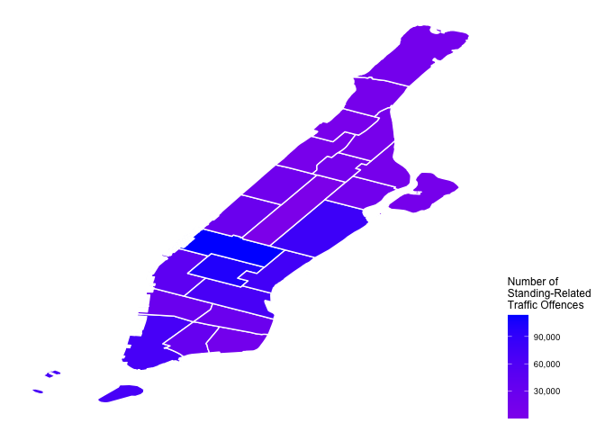
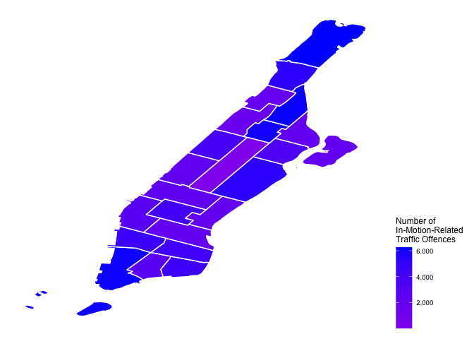

Parking Violations in NYC
================================


## Data

For this assignment, we are going to investigate data on parking violations in NYC. 

#### Parking violations in 2020/21

NYC Open Data has data on all [parking violations issued in NYC](https://data.cityofnewyork.us/City-Government/Parking-Violations-Issued-Fiscal-Year-2021/pvqr-7yc4) since 2014. The updated dataset provided for 2021 currently includes about 10 million observations. To make the assignment manageable, I have reduced it to a subset of tickets issued in from Jan 2020 to Jan 2021 and by Manhattan precincts only, yielding about 2.2M tickets.

Two support files are also included in the `parking` sub folder:

  - the **descriptions of all variables**
  - the **dictionary of violation codes**
  
#### Police Precincts

A second data source is the [shape files of police precincts in NYC](https://www1.nyc.gov/site/planning/data-maps/open-data/districts-download-metadata.page). 

## Exercise

##### 1. Data exploration

Before focusing on the spatial part of the data, let's explore the basic patterns in the data. 


```r
df <- read.csv('./data/parking/parkingNYC_Jan2020-Jan2021.csv')
```


```r
library(tibble)
```

```
## Warning: package 'tibble' was built under R version 4.0.2
```

```r
glimpse(df)
```

```
## Rows: 2,244,505
## Columns: 47
## $ Summons.Number                    <dbl> 1474094223, 1474094600, 1474097807,…
## $ Plate.ID                          <chr> "KDT3875", "GTW5034", "JEF4856", "H…
## $ Registration.State                <chr> "NY", "NY", "NY", "NY", "PA", "PA",…
## $ Plate.Type                        <chr> "PAS", "PAS", "PAS", "PAS", "PAS", …
## $ Issue.Date                        <chr> "06/24/2020", "06/26/2020", "06/26/…
## $ Violation.Code                    <int> 98, 20, 20, 14, 20, 40, 46, 40, 46,…
## $ Vehicle.Body.Type                 <chr> "SDN", "SDN", "SDN", "SDN", "SUBN",…
## $ Vehicle.Make                      <chr> "KIA", "VOLKS", "ME/BE", "TOYOT", "…
## $ Issuing.Agency                    <chr> "P", "P", "P", "P", "P", "P", "P", …
## $ Street.Code1                      <int> 0, 18390, 35710, 15710, 35930, 3593…
## $ Street.Code2                      <int> 40404, 10110, 15710, 35710, 11710, …
## $ Street.Code3                      <int> 40404, 10010, 11710, 35770, 13610, …
## $ Vehicle.Expiration.Date           <int> 20200805, 20201006, 20201219, 0, 0,…
## $ Violation.Location                <int> 19, 19, 24, 24, 24, 24, 25, 25, 25,…
## $ Violation.Precinct                <int> 19, 19, 24, 24, 24, 24, 25, 25, 25,…
## $ Issuer.Precinct                   <int> 19, 19, 24, 24, 24, 24, 25, 25, 25,…
## $ Issuer.Code                       <int> 966865, 939882, 963854, 963854, 968…
## $ Issuer.Command                    <chr> "0019", "0019", "0024", "0024", "00…
## $ Issuer.Squad                      <chr> "0000", "0000", "0000", "0000", "00…
## $ Violation.Time                    <chr> "0805A", "0321P", "0636A", "0628A",…
## $ Time.First.Observed               <chr> NA, NA, NA, NA, NA, NA, NA, NA, NA,…
## $ Violation.County                  <chr> "NY", "NY", "NY", "NY", NA, NA, "NY…
## $ Violation.In.Front.Of.Or.Opposite <chr> "O", "F", "O", "F", "F", "F", "F", …
## $ House.Number                      <chr> "240", "343", "127", "784", "215-7"…
## $ Street.Name                       <chr> "E 75", "EAST 70 STREET", "WEST 97T…
## $ Intersecting.Street               <chr> NA, NA, NA, NA, NA, NA, NA, NA, NA,…
## $ Date.First.Observed               <int> 0, 0, 0, 0, 0, 0, 0, 0, 0, 0, 0, 0,…
## $ Law.Section                       <int> 408, 408, 408, 408, 408, 408, 408, …
## $ Sub.Division                      <chr> "C4", "J6", "D", "C", "C", "D", "D"…
## $ Violation.Legal.Code              <lgl> NA, NA, NA, NA, NA, NA, NA, NA, NA,…
## $ Days.Parking.In.Effect            <chr> "BBBBBBB", "BBBBBBB", "BBBBYBB", "B…
## $ From.Hours.In.Effect              <chr> "ALL", "ALL", "0600A", "ALL", "ALL"…
## $ To.Hours.In.Effect                <chr> "ALL", "ALL", "1500P", "ALL", "ALL"…
## $ Vehicle.Color                     <chr> "BLACK", "BK", "WH", "RD", "WH", "W…
## $ Unregistered.Vehicle.             <int> 0, 0, 0, 0, 0, 0, 0, 0, 0, 0, 0, 0,…
## $ Vehicle.Year                      <int> 2019, 2014, 2018, 0, 0, 0, 2014, 20…
## $ Meter.Number                      <chr> "-", "-", "-", "-", "-", "-", "-", …
## $ Feet.From.Curb                    <int> 0, 0, 0, 0, 0, 0, 0, 1, 0, 0, 1, 0,…
## $ Violation.Post.Code               <lgl> NA, NA, NA, NA, NA, NA, NA, NA, NA,…
## $ Violation.Description             <chr> NA, NA, NA, NA, NA, NA, NA, NA, NA,…
## $ No.Standing.or.Stopping.Violation <lgl> NA, NA, NA, NA, NA, NA, NA, NA, NA,…
## $ Hydrant.Violation                 <lgl> NA, NA, NA, NA, NA, NA, NA, NA, NA,…
## $ Double.Parking.Violation          <lgl> NA, NA, NA, NA, NA, NA, NA, NA, NA,…
## $ issue_date                        <chr> "2020-06-24", "2020-06-26", "2020-0…
## $ year                              <int> 2020, 2020, 2020, 2020, 2020, 2020,…
## $ month                             <int> 6, 6, 6, 6, 6, 6, 7, 6, 6, 5, 5, 5,…
## $ day                               <int> 24, 26, 26, 19, 22, 22, 1, 27, 27, …
```

```r
length(unique(df$Violation.Code))
```

```
## [1] 87
```

##### a) Violation Code and Fine Amounts

Add the violation code descriptions and fine amounts to the data file. Provide a visual overview of the top 10 most common types of violations (feel free to group them into categories if reasonable). Compare how this ranking differs if we focus on the total amount of revenue generated.


```r
library(readxl)
```

```
## Warning: package 'readxl' was built under R version 4.0.2
```

```r
violation_labels <- read_excel('./data/parking/ParkingViolationCodes_January2020.xlsx')

library(tidyverse)
```

```
## Warning: package 'tidyverse' was built under R version 4.0.2
```

```
## Warning: replacing previous import 'vctrs::data_frame' by 'tibble::data_frame'
## when loading 'dplyr'
```

```
## ── Attaching packages ─────────────────────────────────────── tidyverse 1.3.0 ──
```

```
## ✓ ggplot2 3.3.3     ✓ dplyr   1.0.0
## ✓ tidyr   1.1.0     ✓ stringr 1.4.0
## ✓ readr   1.3.1     ✓ forcats 0.5.0
## ✓ purrr   0.3.4
```

```
## Warning: package 'ggplot2' was built under R version 4.0.2
```

```
## ── Conflicts ────────────────────────────────────────── tidyverse_conflicts() ──
## x dplyr::filter() masks stats::filter()
## x dplyr::lag()    masks stats::lag()
```

```r
violation_labels <- violation_labels %>%
  rename(
    'Violation.Code' = 'VIOLATION CODE',
    'Violation.Description' = 'VIOLATION DESCRIPTION',
    'Manhattan.Below' = 'Manhattan  96th St. & below\r\n(Fine Amount $)',
    'All.Other.Areas' = 'All Other Areas\r\n(Fine Amount $)'
  )

glimpse(violation_labels)
```

```
## Rows: 97
## Columns: 4
## $ Violation.Code        <dbl> 1, 2, 3, 4, 5, 6, 7, 8, 9, 10, 11, 12, 13, 14, …
## $ Violation.Description <chr> "FAILURE TO DISPLAY BUS PERMIT", "NO OPERATOR N…
## $ Manhattan.Below       <dbl> 515, 515, 515, 115, 50, 265, 50, 115, 115, 115,…
## $ All.Other.Areas       <dbl> 515, 515, 515, 115, 50, 265, 50, 115, 115, 115,…
```


```r
df_violations = merge(x = df, y = violation_labels, by = 'Violation.Code')

glimpse(df_violations)
```

```
## Rows: 2,244,045
## Columns: 50
## $ Violation.Code                    <int> 1, 1, 1, 1, 1, 1, 1, 1, 1, 1, 1, 1,…
## $ Summons.Number                    <dbl> 8773725183, 8696246354, 8773720630,…
## $ Plate.ID                          <chr> "OYB5181", "OYB1400", "OYB5237", "O…
## $ Registration.State                <chr> "NJ", "NJ", "NJ", "NJ", "NJ", "NJ",…
## $ Plate.Type                        <chr> "PAS", "PAS", "PAS", "PAS", "PAS", …
## $ Issue.Date                        <chr> "11/24/2020", "09/25/2020", "10/21/…
## $ Vehicle.Body.Type                 <chr> "BUS", "BUS", "BUS", "BUS", "BUS", …
## $ Vehicle.Make                      <chr> "FORD", "FORD", "FORD", "FORD", "FO…
## $ Issuing.Agency                    <chr> "T", "T", "T", "T", "T", "T", "T", …
## $ Street.Code1                      <int> 10810, 34610, 10810, 10810, 10810, …
## $ Street.Code2                      <int> 0, 10810, 0, 0, 0, 10810, 0, 0, 345…
## $ Street.Code3                      <int> 0, 10910, 0, 0, 0, 10910, 0, 0, 345…
## $ Vehicle.Expiration.Date           <int> 88880088, 88880088, 88880088, 88880…
## $ Violation.Location                <int> 14, 10, 14, 14, 14, 14, 14, 14, 14,…
## $ Violation.Precinct                <int> 14, 10, 14, 14, 14, 14, 14, 14, 14,…
## $ Issuer.Precinct                   <int> 14, 10, 14, 14, 14, 14, 14, 14, 14,…
## $ Issuer.Code                       <int> 365793, 351969, 365793, 365793, 361…
## $ Issuer.Command                    <chr> "T106", "MTTF", "T106", "T106", "T1…
## $ Issuer.Squad                      <chr> "E", "A", "E", "E", "E", "E", "E", …
## $ Violation.Time                    <chr> "0245P", "0937A", "0844A", "0314P",…
## $ Time.First.Observed               <chr> NA, NA, NA, NA, NA, NA, NA, NA, NA,…
## $ Violation.County                  <chr> "NY", "NY", "NY", "NY", "NY", "NY",…
## $ Violation.In.Front.Of.Or.Opposite <chr> "I", "F", "I", "I", "I", "F", "I", …
## $ House.Number                      <chr> "E", "323", "E", "E", "E", "319", "…
## $ Street.Name                       <chr> "8th Ave", "W 42nd St", "8th Ave", …
## $ Intersecting.Street               <chr> "15ft N/of W 41st St", NA, "30ft S/…
## $ Date.First.Observed               <int> 0, 0, 0, 0, 0, 0, 0, 0, 0, 0, 0, 0,…
## $ Law.Section                       <int> 408, 408, 408, 408, 408, 408, 408, …
## $ Sub.Division                      <chr> "C1", "K7", "D7", "D7", "C1", "M5",…
## $ Violation.Legal.Code              <lgl> NA, NA, NA, NA, NA, NA, NA, NA, NA,…
## $ Days.Parking.In.Effect            <chr> "YYYYYYY", "YYYYYYY", "YYYYYYY", "Y…
## $ From.Hours.In.Effect              <chr> NA, NA, NA, NA, NA, NA, NA, NA, NA,…
## $ To.Hours.In.Effect                <chr> NA, NA, NA, NA, NA, NA, NA, NA, NA,…
## $ Vehicle.Color                     <chr> "WHITE", "WHITE", "WHITE", "WHITE",…
## $ Unregistered.Vehicle.             <int> NA, NA, NA, NA, NA, NA, NA, NA, NA,…
## $ Vehicle.Year                      <int> 0, 0, 0, 0, 0, 0, 0, 0, 0, 0, 0, 0,…
## $ Meter.Number                      <chr> NA, NA, NA, NA, NA, NA, NA, NA, NA,…
## $ Feet.From.Curb                    <int> 0, 0, 0, 0, 0, 0, 0, 0, 0, 0, 0, 0,…
## $ Violation.Post.Code               <lgl> NA, NA, NA, NA, NA, NA, NA, NA, NA,…
## $ Violation.Description.x           <chr> "01-No Intercity Pmt Displ", NA, NA…
## $ No.Standing.or.Stopping.Violation <lgl> NA, NA, NA, NA, NA, NA, NA, NA, NA,…
## $ Hydrant.Violation                 <lgl> NA, NA, NA, NA, NA, NA, NA, NA, NA,…
## $ Double.Parking.Violation          <lgl> NA, NA, NA, NA, NA, NA, NA, NA, NA,…
## $ issue_date                        <chr> "2020-11-24", "2020-09-25", "2020-1…
## $ year                              <int> 2020, 2020, 2020, 2020, 2020, 2020,…
## $ month                             <int> 11, 9, 10, 11, 8, 11, 10, 10, 9, 10…
## $ day                               <int> 24, 25, 21, 24, 25, 8, 26, 21, 3, 3…
## $ Violation.Description.y           <chr> "FAILURE TO DISPLAY BUS PERMIT", "F…
## $ Manhattan.Below                   <dbl> 515, 515, 515, 515, 515, 515, 515, …
## $ All.Other.Areas                   <dbl> 515, 515, 515, 515, 515, 515, 515, …
```

```r
length(unique(df_violations$Violation.Description.y))
```

```
## [1] 85
```

```r
length(unique(df_violations$Violation.Code))
```

```
## [1] 85
```

```r
#Both are 85. We are good to go. 

colnames(df_violations)
```

```
##  [1] "Violation.Code"                    "Summons.Number"                   
##  [3] "Plate.ID"                          "Registration.State"               
##  [5] "Plate.Type"                        "Issue.Date"                       
##  [7] "Vehicle.Body.Type"                 "Vehicle.Make"                     
##  [9] "Issuing.Agency"                    "Street.Code1"                     
## [11] "Street.Code2"                      "Street.Code3"                     
## [13] "Vehicle.Expiration.Date"           "Violation.Location"               
## [15] "Violation.Precinct"                "Issuer.Precinct"                  
## [17] "Issuer.Code"                       "Issuer.Command"                   
## [19] "Issuer.Squad"                      "Violation.Time"                   
## [21] "Time.First.Observed"               "Violation.County"                 
## [23] "Violation.In.Front.Of.Or.Opposite" "House.Number"                     
## [25] "Street.Name"                       "Intersecting.Street"              
## [27] "Date.First.Observed"               "Law.Section"                      
## [29] "Sub.Division"                      "Violation.Legal.Code"             
## [31] "Days.Parking.In.Effect"            "From.Hours.In.Effect"             
## [33] "To.Hours.In.Effect"                "Vehicle.Color"                    
## [35] "Unregistered.Vehicle."             "Vehicle.Year"                     
## [37] "Meter.Number"                      "Feet.From.Curb"                   
## [39] "Violation.Post.Code"               "Violation.Description.x"          
## [41] "No.Standing.or.Stopping.Violation" "Hydrant.Violation"                
## [43] "Double.Parking.Violation"          "issue_date"                       
## [45] "year"                              "month"                            
## [47] "day"                               "Violation.Description.y"          
## [49] "Manhattan.Below"                   "All.Other.Areas"
```


```r
violations_count <- as.data.frame( table(df_violations$Violation.Description.y) )

violations_top10 <- violations_count %>%
  arrange (desc(Freq)) %>% 
  head(11) 

violations_top10
```

```
##                              Var1   Freq
## 1     NO STANDING-DAY/TIME LIMITS 296962
## 2      NO PARKING-DAY/TIME LIMITS 271285
## 3  FAIL TO DSPLY MUNI METER RECPT 201108
## 4     NO STANDING-COMM METER ZONE 180219
## 5      NO PARKING-STREET CLEANING 161910
## 6                  DOUBLE PARKING 139444
## 7  FAIL TO DISP. MUNI METER RECPT 131976
## 8                    FIRE HYDRANT 122162
## 9  NO STANDING-EXC. TRUCK LOADING 100093
## 10             EXPIRED MUNI METER  70944
## 11   DOUBLE PARKING-MIDTOWN COMML  66101
```

```r
violations_top10[violations_top10$Var1 == "FAIL TO DSPLY MUNI METER RECPT", ] <- violations_top10[violations_top10$Var1 == "FAIL TO DSPLY MUNI METER RECPT", ] + violations_top10[violations_top10$Var1 == "FAIL TO DISP. MUNI METER RECPT", ]
```

```
## Warning in Ops.factor(left, right): '+' not meaningful for factors
```

```r
violations_top10 <- violations_top10[rownames(violations_top10) != 7, ]

violations_top10[3, 1] = "FAIL TO DSPLY MUNI METER RECPT"

violations_top10$Var1 <- factor(violations_top10$Var1, levels = violations_top10$Var1[order(violations_top10$Freq, decreasing = F)])

levels(violations_top10$Var1)
```

```
##  [1] "DOUBLE PARKING-MIDTOWN COMML"   "EXPIRED MUNI METER"            
##  [3] "NO STANDING-EXC. TRUCK LOADING" "FIRE HYDRANT"                  
##  [5] "DOUBLE PARKING"                 "NO PARKING-STREET CLEANING"    
##  [7] "NO STANDING-COMM METER ZONE"    "NO PARKING-DAY/TIME LIMITS"    
##  [9] "NO STANDING-DAY/TIME LIMITS"    "FAIL TO DSPLY MUNI METER RECPT"
```


```r
library(ggplot2)
library(ggthemes)
```

```
## Warning: package 'ggthemes' was built under R version 4.0.2
```

```r
count_compare <- ggplot(violations_top10, aes(x= Var1, y = Freq)) + 
  geom_bar(stat = 'identity') + 
  coord_flip() +
  scale_y_continuous(name="Frequency", labels = scales::comma) +
  scale_x_discrete(name = "Type of Traffic Violation") + 
  labs(title = "Top 10 Traffic Violations (Frequency)") +
  theme_tufte()

count_compare
```

<!-- -->


```r
violations_fine_top10 <- df_violations %>%
  group_by(Violation.Description.y) %>%
  summarise(total_fine = sum(Manhattan.Below)) %>%
  arrange (desc(total_fine))  %>%
  head(11)
```

```
## `summarise()` ungrouping output (override with `.groups` argument)
```

```r
violations_fine_top10[violations_fine_top10$Violation.Description.y == "FAIL TO DSPLY MUNI METER RECPT", "total_fine"] <- violations_fine_top10[violations_fine_top10$Violation.Description.y == "FAIL TO DSPLY MUNI METER RECPT", "total_fine"] + violations_fine_top10[violations_fine_top10$Violation.Description.y == "FAIL TO DISP. MUNI METER RECPT", "total_fine"]

violations_fine_top10 <- violations_fine_top10[rownames(violations_fine_top10) != 9, ]

violations_fine_top10
```

```
## # A tibble: 10 x 2
##    Violation.Description.y        total_fine
##    <chr>                               <dbl>
##  1 NO STANDING-DAY/TIME LIMITS      34150630
##  2 NO STANDING-COMM METER ZONE      20725185
##  3 NO PARKING-DAY/TIME LIMITS       17633525
##  4 DOUBLE PARKING                   16036060
##  5 FIRE HYDRANT                     14048630
##  6 FAIL TO DSPLY MUNI METER RECPT   21650460
##  7 NO PARKING-STREET CLEANING       10524150
##  8 NO STANDING-EXC. TRUCK LOADING    9508835
##  9 DOUBLE PARKING-MIDTOWN COMML      7601615
## 10 NO STANDING-BUS STOP              7463270
```

```r
violations_fine_top10$Violation.Description.y <- factor(violations_fine_top10$Violation.Description.y, levels = violations_fine_top10$Violation.Description.y[order(violations_fine_top10$total_fine, decreasing = F)])

levels(violations_fine_top10$Violation.Description.y)
```

```
##  [1] "NO STANDING-BUS STOP"           "DOUBLE PARKING-MIDTOWN COMML"  
##  [3] "NO STANDING-EXC. TRUCK LOADING" "NO PARKING-STREET CLEANING"    
##  [5] "FIRE HYDRANT"                   "DOUBLE PARKING"                
##  [7] "NO PARKING-DAY/TIME LIMITS"     "NO STANDING-COMM METER ZONE"   
##  [9] "FAIL TO DSPLY MUNI METER RECPT" "NO STANDING-DAY/TIME LIMITS"
```


```r
library(ggplot2)

fine_compare <- ggplot(violations_fine_top10, aes(x= Violation.Description.y, y = total_fine)) + 
  geom_col() + 
  coord_flip() + 
  scale_y_continuous(name="Total Fine Amount", labels = scales::comma) + 
  scale_x_discrete(name = "Type of Traffic Violation") + 
  labs(title = "Top 10 Traffic Violations (Total Fine Amount)") +
  theme_tufte() 

fine_compare
```

<!-- -->


```r
library(ggpubr)
```

```
## Warning: package 'ggpubr' was built under R version 4.0.2
```

```r
ggarrange(count_compare, fine_compare, nrow = 2)
```

<!-- -->

There are some overlaps between the frequency of top traffic violations, and their associated fine amounts. 

##### b) Average amount of fine by vehicle

Compare the average amount of fine by vehicle color, vehicle year, and [vehicle plate type](https://dmv.ny.gov/registration/registration-class-codes) [Hint: it is sufficient to restrict your attention to commercial (`COM`) and passenger (`PAS`) vehicles]? Briefly describe your findings.


```r
violations_fine_color <- df_violations %>%
  group_by(Vehicle.Color) %>%
  summarise(mean_fine = mean(Manhattan.Below)) %>%
  arrange (desc(mean_fine))  
```

```
## `summarise()` ungrouping output (override with `.groups` argument)
```

```r
max(violations_fine_color$mean_fine)
```

```
## [1] 180
```

```r
min(violations_fine_color$mean_fine)
```

```
## [1] 32.5
```

```r
unique(violations_fine_color$mean_fine)
```

```
##   [1] 180.00000 165.00000 130.00000 115.00000 114.09091 113.66667 112.16450
##   [8] 112.08333 111.02273 110.22876 109.16667 108.33333 108.28571 107.71505
##  [15] 106.66667 106.61290 105.90909 105.71429 105.21739 105.00000 104.78261
##  [22] 104.76190 104.00000 103.50000 103.14713 102.89704 102.53846 102.50000
##  [29] 102.38785 101.78212 101.66948 101.53846 100.99068 100.40052 100.31250
##  [36] 100.00000  98.68421  98.33333  97.90155  97.85714  97.83333  97.55222
##  [43]  97.48092  97.10145  96.12299  96.08974  95.53571  95.00000  94.92554
##  [50]  94.44999  94.11501  94.11040  94.00000  93.52941  93.28571  92.97209
##  [57]  92.96512  92.70717  92.50000  92.05682  91.66667  91.60920  91.25000
##  [64]  91.14480  90.97594  90.96491  90.68260  90.48970  90.45764  90.28698
##  [71]  90.00000  89.39566  88.92308  88.83606  88.47694  88.18328  87.75272
##  [78]  87.50000  87.43902  86.66667  86.59620  86.58625  86.04244  85.98214
##  [85]  85.89286  85.78890  85.42443  85.33422  85.00000  84.75856  84.52457
##  [92]  84.36508  84.23469  84.08111  84.04412  83.89937  83.88541  83.33333
##  [99]  81.93182  81.73469  81.66667  80.66667  80.00000  77.50000  77.17391
## [106]  69.48980  65.00000  32.50000
```

```r
#rough segmentation - 32.5 to 90, 90 to 100, 100 to 180#

violations_fine_color$groups = ifelse(violations_fine_color$mean_fine <=90, 'Low Fine Amt', 0)

violations_fine_color$groups = ifelse(violations_fine_color$mean_fine >90 & violations_fine_color$mean_fine<=100, 'Medium Fine Amt', violations_fine_color$groups)

violations_fine_color$groups = ifelse(violations_fine_color$mean_fine >100, 'High Fine Amt', violations_fine_color$groups)

violations_fine_color$groups <- as.factor(violations_fine_color$groups)

violations_fine_color %>% #simple counts of each category
  group_by(groups) %>%
  count()
```

```
## # A tibble: 3 x 2
## # Groups:   groups [3]
##   groups              n
##   <fct>           <int>
## 1 High Fine Amt     106
## 2 Low Fine Amt       85
## 3 Medium Fine Amt    57
```

```r
violations_fine_color_high <- violations_fine_color %>%
  filter(groups == "High Fine Amt") 

as.data.frame( table(unique(violations_fine_color_high$Vehicle.Color)) )
```

```
##      Var1 Freq
## 1     B L    1
## 2   BAIGE    1
## 3   BALCK    1
## 4    BBRW    1
## 5    BERG    1
## 6      BG    1
## 7     BGE    1
## 8   BIERG    1
## 9     BKJ    1
## 10   BLAK    1
## 11    BLE    1
## 12    BLK    1
## 13    BLU    1
## 14    BLY    1
## 15     BN    1
## 16    BRG    1
## 17    BRK    1
## 18    BRN    1
## 19   BRNW    1
## 20    BRO    1
## 21   BRON    1
## 22  BRONZ    1
## 23   BROW    1
## 24  BROWN    1
## 25    BRW    1
## 26   BRWN    1
## 27    BUG    1
## 28    BUL    1
## 29   BURG    1
## 30    BWN    1
## 31     BY    1
## 32  CREAM    1
## 33  DARKR    1
## 34  DKGRA    1
## 35  DKGRY    1
## 36   DKGY    1
## 37  DRKGR    1
## 38      G    1
## 39    GAY    1
## 40    GEY    1
## 41    GLD    1
## 42    GLO    1
## 43    GR/    1
## 44  GRAAY    1
## 45  GRANG    1
## 46   GRAY    1
## 47   GREE    1
## 48   GREG    1
## 49   GREN    1
## 50   GREU    1
## 51    GRN    1
## 52   GRRY    1
## 53    GRT    1
## 54    GRU    1
## 55    GRY    1
## 56     GV    1
## 57     GW    1
## 58    HRY    1
## 59  INFIN    1
## 60    MAR    1
## 61   MARO    1
## 62     MC    1
## 63  METAL    1
## 64   MUNI    1
## 65   NYPD    1
## 66  OPTER    1
## 67    ORA    1
## 68    ORN    1
## 69  PKGRY    1
## 70   PRPL    1
## 71   PURP    1
## 72   QBLK    1
## 73      R    1
## 74    RDW    1
## 75  SILER    1
## 76     SL    1
## 77  SLIVE    1
## 78    SLV    1
## 79   SLVR    1
## 80     SR    1
## 81  SUBUR    1
## 82     SV    1
## 83     SY    1
## 84   TEAL    1
## 85    TNG    1
## 86     TX    1
## 87      W    1
## 88  WH/BL    1
## 89    WHE    1
## 90    WHI    1
## 91   WHIE    1
## 92   WHIT    1
## 93  WHITW    1
## 94    WHT    1
## 95   WHTE    1
## 96  WHTIE    1
## 97     WN    1
## 98     WT    1
## 99    WTH    1
## 100   WWT    1
## 101    YE    1
## 102   YEL    1
## 103   YLL    1
## 104  YLLW    1
## 105    YN    1
```

```r
violations_fine_color_medium <- violations_fine_color %>%
  filter(groups == "Medium Fine Amt") 

as.data.frame( table(unique(violations_fine_color_medium$Vehicle.Color)) )
```

```
##     Var1 Freq
## 1   .  Y    1
## 2      B    1
## 3  BEING    1
## 4  BERGU    1
## 5    BKG    1
## 6   BLAC    1
## 7  BLACK    1
## 8   BLCK    1
## 9   BLUE    1
## 10  BRCH    1
## 11   BUR    1
## 12 BURGE    1
## 13 BURGU    1
## 14  DKGN    1
## 15    GD    1
## 16    GN    1
## 17  GOLD    1
## 18   GRA    1
## 19   GRE    1
## 20 GRE Y    1
## 21 GREEN    1
## 22  GREY    1
## 23 GRFAY    1
## 24   GY/    1
## 25   LTB    1
## 26 LTBLU    1
## 27   LTT    1
## 28 MAROO    1
## 29    MN    1
## 30    MR    1
## 31 NVYBL    1
## 32 ORANG    1
## 33 OTHER    1
## 34 PEARL    1
## 35    PK    1
## 36 PURPL    1
## 37   RD/    1
## 38   RDG    1
## 39    RE    1
## 40   RED    1
## 41     S    1
## 42   SIL    1
## 43  SILV    1
## 44 SILVE    1
## 45 SILVR    1
## 46   SIV    1
## 47  SIVR    1
## 48   TAN    1
## 49   WH/    1
## 50   WHB    1
## 51   WHG    1
## 52 WHITE    1
## 53    WI    1
## 54  YELL    1
## 55 YELLO    1
## 56   YLW    1
## 57    YW    1
```

```r
violations_fine_color_low <- violations_fine_color %>%
  filter(groups == "Low Fine Amt") 

as.data.frame( table(unique(violations_fine_color_low$Vehicle.Color)) )
```

```
##     Var1 Freq
## 1     .-    1
## 2  B ACK    1
## 3  B LAC    1
## 4    BCK    1
## 5    BCL    1
## 6   BEGE    1
## 7   BEIG    1
## 8  BEIGE    1
## 9     BI    1
## 10 BIEGE    1
## 11    BK    1
## 12   BK/    1
## 13   BKT    1
## 14   BKW    1
## 15    BL    1
## 16   BL/    1
## 17   BLA    1
## 18   BLB    1
## 19   BLC    1
## 20   BLG    1
## 21   BLO    1
## 22   BLW    1
## 23    BR    1
## 24 BRIGE    1
## 25 BRWON    1
## 26    BU    1
## 27 BURUN    1
## 28    BW    1
## 29 DARKG    1
## 30  DEEP    1
## 31   DK/    1
## 32   DKB    1
## 33   DKG    1
## 34   DKM    1
## 35   DKP    1
## 36   DKR    1
## 37   FAN    1
## 38    FR    1
## 39  GARY    1
## 40  GERY    1
## 41    GL    1
## 42    GR    1
## 43   GRG    1
## 44   GRW    1
## 45    GY    1
## 46   GYB    1
## 47   GYG    1
## 48   GYT    1
## 49  HITE    1
## 50 LAVEN    1
## 51 LIGHT    1
## 52   LT/    1
## 53   LTG    1
## 54   LTP    1
## 55     M    1
## 56   MRG    1
## 57 MULTI    1
## 58  NAVY    1
## 59    NO    1
## 60   NOC    1
## 61 NVBLU    1
## 62 OLIVE    1
## 63    OR    1
## 64   ORG    1
## 65  ORGE    1
## 66  PINK    1
## 67    PR    1
## 68    RD    1
## 69   RDT    1
## 70   REG    1
## 71  RUST    1
## 72 SIVER    1
## 73 SLATE    1
## 74   SLR    1
## 75 SLVER    1
## 76    TN    1
## 77   TN/    1
## 78     U    1
## 79    WH    1
## 80   WHO    1
## 81  WHTG    1
## 82   WTE    1
## 83     Y    1
## 84    YL    1
## 85    YU    1
```

No firm conclusions can be drawn about variation in average fine amounts, according to `Vehicle.Color`, because the data is very unclean. However, it is noteworthy that for `High Fine Amt`, there are many more color types. A preliminary hypothesis that cars with novel colors might be more likely to have committed violations with higher fine amounts. A visual inspection of the tables also show the prevalence of more colors that might not be represented for vehicles that have caused `Medium Fine Amt` and `Low Fine Amt` violations. 


```r
violations_fine_year <- df_violations %>%
  group_by(Vehicle.Year) %>%
  summarise(mean_fine = mean(Manhattan.Below)) %>%
  arrange (desc(mean_fine)) 
```

```
## `summarise()` ungrouping output (override with `.groups` argument)
```

```r
min(violations_fine_year$Vehicle.Year) #nonsense
```

```
## [1] 0
```

```r
max(violations_fine_year$Vehicle.Year) #nonsense
```

```
## [1] 2069
```

```r
violations_fine_year <- df_violations %>%
  filter(Vehicle.Year != 0 & Vehicle.Year <=2021) %>%
  group_by(Vehicle.Year) %>%
  summarise(mean_fine = mean(Manhattan.Below)) %>%
  arrange (desc(mean_fine)) 
```

```
## `summarise()` ungrouping output (override with `.groups` argument)
```

```r
ggplot(violations_fine_year, aes(x=Vehicle.Year, y=mean_fine)) +
  geom_point() + 
  stat_smooth(method= "lm", color = "black", se=F, size=0.3) + 
  labs(
    x = 'Year Vehicle was Registered', 
    y = 'Average Fine Amount',
    title="Average Fine by Vehicle's Registration Year") +
  theme_tufte()
```

```
## `geom_smooth()` using formula 'y ~ x'
```

<!-- -->

The earlier a car is registered, the more likely that the mean fine amount incurred is a smaller value. The later a car is registered, the more likely that the mean fine amount incurred is a higher value. 


```r
violations_fine_plate <- df_violations %>%
  group_by(Plate.Type) %>%
  filter (Plate.Type == 'COM' | Plate.Type == 'PAS') %>%
  summarise(mean_fine = mean(Manhattan.Below)) %>%
  arrange (desc(mean_fine))  
```

```
## `summarise()` ungrouping output (override with `.groups` argument)
```

```r
violations_fine_plate 
```

```
## # A tibble: 2 x 2
##   Plate.Type mean_fine
##   <chr>          <dbl>
## 1 COM             91.6
## 2 PAS             89.7
```

```r
violations_fine_plate_foranova <- df_violations %>%
  group_by(Plate.Type) %>%
  filter (Plate.Type == 'COM' | Plate.Type == 'PAS') 

violations_fine_plate_foranova$Plate.Type <- as.factor(violations_fine_plate_foranova$Plate.Type)

summary(aov(Manhattan.Below ~ Plate.Type, data = violations_fine_plate_foranova)) #statistically significant difference in fine amounts between Plate.Type#
```

```
##                  Df    Sum Sq Mean Sq F value Pr(>F)    
## Plate.Type        1 1.707e+06 1706749    2795 <2e-16 ***
## Residuals   2129696 1.300e+09     611                   
## ---
## Signif. codes:  0 '***' 0.001 '**' 0.01 '*' 0.05 '.' 0.1 ' ' 1
```

Commercial vehicles (M=91.6) seem to incur, on average, higher fines than passenger vehicles (M=89.7). An exploratory one-way Analysis of Variance (ANOVA) was run to compare the mean fine values of these two groups, and indeed there was a significantly significant difference in fine values (p<.01) between the two groups.

##### c) Effect of COVID

Let's see if we can observe the effect of COVID restrictions on parking violations. Present a visualization that shows how parking violations changed after the New York statewide stay-at-home order on March 14, 2020. Make sure the visualization clearly highlights the main pattern (the COVID effect).


```r
library(anytime)
```

```
## Warning: package 'anytime' was built under R version 4.0.2
```

```r
df_violations$issue_date <- anytime::anydate(df_violations$issue_date)

glimpse(df_violations$issue_date)
```

```
##  Date[1:2244045], format: "2020-11-24" "2020-09-25" "2020-10-21" "2020-11-24" "2020-08-25" ...
```

```r
df_violations$Month_Yr <- format(as.Date(df_violations$issue_date), "%Y-%m")

glimpse(df_violations$Month_Yr)
```

```
##  chr [1:2244045] "2020-11" "2020-09" "2020-10" "2020-11" "2020-08" ...
```

```r
df_covid <- df_violations %>%
  filter (issue_date >= '2020-01-01') %>%
  count(Month_Yr) %>%
  filter(Month_Yr <= '2021-01')

df_covid
```

```
##    Month_Yr      n
## 1   2020-01     56
## 2   2020-02     19
## 3   2020-03    177
## 4   2020-04     79
## 5   2020-05    143
## 6   2020-06  15053
## 7   2020-07 178563
## 8   2020-08 352658
## 9   2020-09 397106
## 10  2020-10 395206
## 11  2020-11 339235
## 12  2020-12 285292
## 13  2021-01 280408
```


```r
ggplot(df_covid, aes(x = Month_Yr, y = n)) +
  geom_col() + 
  geom_text(
    aes(label = n, y = n),
    position = position_dodge(0.2),
    vjust = -0.5,
    size=3
  ) +
  scale_x_discrete(name="Year-Month") + 
  scale_y_continuous(name="Number of Traffic Violations", labels = scales::comma) + 
  labs(title="New York Traffic Violations in 2020", caption = "Note on COVID effects: Within the United States and New York, COVID-19 became a serious issue from 2020-03 onwards.") +
  theme_tufte() 
```

<!-- -->

```r
#https://www.nytimes.com/2021/01/05/nyregion/nyc-residential-parking.html #Increase in Car Ownership, post-COVID, as a potential reason for these effects#
```

#### 2. Map by Precincts

Read in the shape files for the police precincts and remove all precincts outside of Manhattan. 


```r
library(rgdal)
```

```
## Warning: package 'rgdal' was built under R version 4.0.2
```

```
## Loading required package: sp
```

```
## Warning: package 'sp' was built under R version 4.0.2
```

```
## rgdal: version: 1.5-23, (SVN revision 1121)
## Geospatial Data Abstraction Library extensions to R successfully loaded
## Loaded GDAL runtime: GDAL 3.1.4, released 2020/10/20
## Path to GDAL shared files: /Library/Frameworks/R.framework/Versions/4.0/Resources/library/rgdal/gdal
## GDAL binary built with GEOS: TRUE 
## Loaded PROJ runtime: Rel. 6.3.1, February 10th, 2020, [PJ_VERSION: 631]
## Path to PROJ shared files: /Library/Frameworks/R.framework/Versions/4.0/Resources/library/rgdal/proj
## Linking to sp version:1.4-5
## To mute warnings of possible GDAL/OSR exportToProj4() degradation,
## use options("rgdal_show_exportToProj4_warnings"="none") before loading rgdal.
```

```r
police_prec <- readOGR('/Users/kagenlim/Documents/Data Viz/07_parking-graded/data/police_precincts/nypp.shp')
```

```
## OGR data source with driver: ESRI Shapefile 
## Source: "/Users/kagenlim/Documents/Data Viz/07_parking-graded/data/police_precincts/nypp.shp", layer: "nypp"
## with 77 features
## It has 3 fields
```

```r
manhattan_before <- subset(police_prec, Precinct<=34) #only Manhattan
#https://www1.nyc.gov/site/nypd/bureaus/patrol/precincts-landing.page

manhattan_before <- spTransform(manhattan_before, "+init=ESRI:102718")

manhattan <- fortify(manhattan_before) 
```

```
## Regions defined for each Polygons
```

```r
from = unique(manhattan$id)

to = unique(manhattan_before$Precinct)

map = setNames(to, from)

manhattan$id =  map[manhattan$id]

unique(manhattan$id) #all good#
```

```
##  [1]  1  5  6  7  9 10 13 14 17 18 19 20 22 23 24 25 26 28 30 32 33 34
```

```r
manhattan <- manhattan %>% 
  rename(
    Violation.Precinct = id,
    )

manhattan$Violation.Precinct <- as.factor(manhattan$Violation.Precinct)
```


```r
library(ggplot2)
library(ggthemes)
manhattan_poly <- ggplot() +
  geom_polygon(aes(y=lat, x=long, group=group), 
               color="dark red", data=manhattan, alpha=.2)  + 
  theme_map()
  
manhattan_poly
```

<!-- -->

##### a) Number of tickets, total fines, and average fines

Provide three maps that show choropleth maps of:

  - the total number of tickets 

```r
violations_prec <- as.data.frame( table(df_violations$Violation.Precinct) )

violations_prec$Var1 <- as.integer(violations_prec$Var1)

manhattan_violations_prec <- subset(violations_prec,as.integer(Var1) <= 34)

manhattan_violations_prec <- manhattan_violations_prec %>% 
  rename(
    Violation.Precinct = Var1,
    )

manhattan_violations_prec$Violation.Precinct <- as.factor(manhattan_violations_prec$Violation.Precinct)

manhattan_violations_prec
```

```
##    Violation.Precinct   Freq
## 1                   1    233
## 2                   2 163469
## 3                   3      7
## 4                   4      4
## 5                   5      8
## 6                   6  92813
## 7                   7 125203
## 8                   8  61854
## 9                   9      2
## 10                 10  96271
## 11                 11 124158
## 12                 12      2
## 13                 13 188542
## 14                 14 197335
## 15                 15      1
## 16                 16 127133
## 17                 17 207388
## 18                 18 271678
## 19                 19 101313
## 20                 20      2
## 21                 21    157
## 22                 22  61823
## 23                 23  92080
## 24                 24  43054
## 25                 25  28600
## 26                 26      3
## 27                 27  68685
## 28                 28  24971
## 29                 29  45624
## 30                 30  51263
## 31                 31  61945
## 32                 32      3
## 33                 33      2
## 34                 34      2
```


```r
df_violations_location = left_join(x = manhattan, y = manhattan_violations_prec, by = 'Violation.Precinct')

unique(df_violations_location$Freq)
```

```
##  [1]    233      8  92813 125203      2  96271 188542 197335 207388 271678
## [11] 101313  61823  92080  43054  28600      3  24971  51263
```
  

```r
manhattan_poly_n <- ggplot() +
  geom_polygon(aes(fill = Freq, y=lat, x=long, group=group), 
               color = 'white', data=df_violations_location) + 
  scale_fill_gradient(name="Frequency of \nTraffic Violations", labels = scales::comma, low = "purple2", high = "blue") + 
  theme_map() + 
  theme(legend.position = 'right')

manhattan_poly_n
```

<!-- -->
  
  - the total amount of fines 
  

```r
df_violations_group_fine <- df_violations %>%
  group_by(Violation.Precinct) %>%
  summarize(total_fines_byprec = sum(Manhattan.Below))
```

```
## `summarise()` ungrouping output (override with `.groups` argument)
```

```r
manhattan_violations_group_fine <- subset(df_violations_group_fine,as.integer(Violation.Precinct) <= 34)

manhattan_violations_group_fine$Violation.Precinct <- as.factor(manhattan_violations_group_fine$Violation.Precinct)

manhattan_violations_group_fine
```

```
## # A tibble: 31 x 2
##    Violation.Precinct total_fines_byprec
##    <fct>                           <dbl>
##  1 0                               24770
##  2 1                            14698510
##  3 2                                 785
##  4 3                                 410
##  5 4                                 770
##  6 5                             7870865
##  7 6                            10193765
##  8 7                             5123620
##  9 8                                 190
## 10 9                             8284975
## # … with 21 more rows
```

```r
#same as above
manhattan$Violation.Precinct <- as.factor(manhattan$Violation.Precinct)
```


```r
df_violations_fine_location = left_join(x = manhattan, y = manhattan_violations_group_fine, by = 'Violation.Precinct')

unique(df_violations_fine_location$total_fines_byprec)
```

```
##  [1] 14698510  7870865 10193765  5123620  8284975 11215995 16983205 19071685
##  [9] 12553685 20118160 24444130  8764365    15235  5683850  8079715  3754230
## [17]  2494015  6042175  2194665  4202170  4583540  5737010
```
  

```r
manhattan_poly_fine <- ggplot() +
  geom_polygon(aes(fill = total_fines_byprec, y=lat, x=long, group=group), 
               color = 'white', data=df_violations_fine_location) + 
  scale_fill_gradient(name="Total Fine Amounts", labels = scales::comma, low = "purple2", high = "blue") + 
  theme_map() + 
  theme(legend.position = 'right')

manhattan_poly_fine
```

<!-- -->
  
  - the average amount of fines
  

```r
df_violations_group_fine_mean <- df_violations %>%
  group_by(Violation.Precinct) %>%
  summarize(mean_fines_byprec = mean(Manhattan.Below))
```

```
## `summarise()` ungrouping output (override with `.groups` argument)
```

```r
manhattan_violations_group_fine_mean <- subset(df_violations_group_fine_mean,as.integer(Violation.Precinct) <= 34)

manhattan_violations_group_fine_mean$Violation.Precinct <- as.factor(manhattan_violations_group_fine_mean$Violation.Precinct)

manhattan_violations_group_fine_mean
```

```
## # A tibble: 31 x 2
##    Violation.Precinct mean_fines_byprec
##    <fct>                          <dbl>
##  1 0                              106. 
##  2 1                               89.9
##  3 2                              112. 
##  4 3                              102. 
##  5 4                               96.2
##  6 5                               84.8
##  7 6                               81.4
##  8 7                               82.8
##  9 8                               95  
## 10 9                               86.1
## # … with 21 more rows
```

```r
#same as above
manhattan$Violation.Precinct <- as.factor(manhattan$Violation.Precinct)
```


```r
df_violations_fine_location_mean = left_join(x = manhattan, y = manhattan_violations_group_fine_mean, by = 'Violation.Precinct')

unique(df_violations_fine_location_mean$mean_fines_byprec)
```

```
##  [1] 89.91619 84.80348 81.41790 82.83409 86.05889 90.33647 90.07651 96.64624
##  [9] 98.74450 97.00735 89.97464 86.50780 97.03822 91.93747 87.74669 87.19817
## [17] 87.20332 87.96935 87.88855 92.10437 89.41225 92.61458
```
  

```r
manhattan_poly_avg_fine <- ggplot() +
  geom_polygon(aes(fill = mean_fines_byprec, y=lat, x=long, group=group), 
               color = 'white', data=df_violations_fine_location_mean) +
  scale_fill_gradient(name="Average Fine Amounts", labels = scales::comma, low = "purple2", high = "blue") + 
  theme_map() + 
  theme(legend.position = 'right')

manhattan_poly_avg_fine
```

<!-- -->


**Briefly describe what you learn from these maps in comparison.**


```r
ggarrange(manhattan_poly_n,
manhattan_poly_fine,
manhattan_poly_avg_fine, ncol=2,nrow=2)
```

<!-- -->


The three maps show that the bulk of traffic violations do happen in the midtown or downtown areas. However, the areas with the largest fines, associated with traffic violations, are not necessarily downtown. The total fine amounts map shows that the Upper East Side area has very high total fine amounts. The average fine maps shows that the region slightly below the Supper East Side, Midtown East, has high average fine amounts. The total and average fines map also show that the more residential areas (i.e., away from downtown, and more toward the upper end of the island) have higher fine amounts that the midtown or downtown areas. 

##### b) Types of violations

Group the almost 100 types of ticket violations into a smaller set of 4-6 subgroups (where `other` should be the remainder of violations not included in other groups you defined). [Hint: No need to spend more than 5 minutes thinking about what the right grouping is.]. Provide choropleth maps for each of these subgroups to show where different types of violations are more or less common. 


```r
df_violations_manhattan <- subset(df_violations,as.integer(Violation.Precinct) <= 34)

df_violations_parking <- subset(df_violations_manhattan, subset = Violation.Code %in% c(4, 6, 20, 21, 23, 24, 27, 32, 33, 34, 35, 37, 38, 39, 40, 42, 43, 44, 46, 47, 59, 60, 77, 78, 86, 87))

df_violations_standing <- subset(df_violations_manhattan, subset = Violation.Code %in% c(8, 10, 11, 13, 14, 15, 16, 17, 18, 19, 22, 25, 26, 28, 30, 31, 63, 64, 79, 81, 89))

df_violations_inmotion <- subset(df_violations_manhattan, subset = Violation.Code %in% c(5, 7, 9, 12, 36, 45, 48, 49, 50, 51, 52, 53, 55, 56, 57, 58, 61, 96, 98))

df_violations_permits_signs_reg <- subset(df_violations_manhattan, subset = Violation.Code %in% c(1, 2, 29, 65, 70, 71, 72, 73, 74, 75, 76, 83))

df_violations_other <- subset(df_violations_manhattan, subset = Violation.Code %in% c(3, 41, 54, 62, 66, 67, 68, 69, 80, 82, 84, 85, 88, 90, 91, 92, 93, 97, 99))
```


```r
check_rows_manhattan <- nrow(df_violations_manhattan)

check_rows_manhattan
```

```
## [1] 2235621
```

```r
check_rows_grouped <- nrow(df_violations_parking) + nrow(df_violations_standing) + nrow(df_violations_inmotion) + nrow(df_violations_permits_signs_reg) + 
nrow(df_violations_other)

check_rows_grouped
```

```
## [1] 2235621
```

```r
check_rows_manhattan == check_rows_grouped
```

```
## [1] TRUE
```

```r
#successfully grouped all observations#
```


```r
parking_related <- as.data.frame( table(df_violations_parking$Violation.Precinct) )

parking_related_prec <- parking_related %>% 
  rename(
    Violation.Precinct = Var1
    )

manhattan_parking = left_join(x = manhattan, y = parking_related_prec, by = 'Violation.Precinct')

manhattan_parking_map <- ggplot() +
  geom_polygon(aes(fill = Freq, y=lat, x=long, group=group), 
               color = 'white', data=manhattan_parking) + 
  scale_fill_gradient(name="Number of \nParking-Related \nTraffic Offences", labels = scales::comma, low = "purple2", high = "blue") + 
  theme_map() + 
  theme(legend.position = 'right')


manhattan_parking_map
```

<!-- -->


```r
standing_related <- as.data.frame( table(df_violations_standing$Violation.Precinct) )

standing_related_prec <- standing_related %>% 
  rename(
     Violation.Precinct = Var1
    )

manhattan_standing = left_join(x = manhattan, y = standing_related_prec, by = 'Violation.Precinct')

manhattan_standing_map <- ggplot() +
  geom_polygon(aes(fill = Freq, y=lat, x=long, group=group), 
               color = 'white', data=manhattan_standing) + 
  scale_fill_gradient(name="Number of \nStanding-Related \nTraffic Offences", labels = scales::comma, low = "purple2", high = "blue") + 
  theme_map() + 
  theme(legend.position = 'right')


manhattan_standing_map
```

<!-- -->


```r
inmotion_related <- as.data.frame( table(df_violations_inmotion$Violation.Precinct) )

inmotion_related_prec <- inmotion_related %>% 
  rename(
     Violation.Precinct = Var1
    )

manhattan_inmotion= left_join(x = manhattan, y = inmotion_related_prec, by = 'Violation.Precinct')

manhattan_inmotion_map <- ggplot() +
  geom_polygon(aes(fill = Freq, y=lat, x=long, group=group), 
               color = 'white', data=manhattan_inmotion) + 
  scale_fill_gradient(name="Number of \nIn-Motion-Related \nTraffic Offences", labels = scales::comma, low = "purple2", high = "blue") + 
  theme_map() + 
  theme(legend.position = 'right')


manhattan_inmotion_map
```

<!-- -->


```r
other_related <- as.data.frame( table(df_violations_other$Violation.Precinct) )

other_prec <- other_related %>% 
  rename(
     Violation.Precinct = Var1
    )

manhattan_other= left_join(x = manhattan, y = other_prec, by = 'Violation.Precinct')

manhattan_other_map <- ggplot() +
  geom_polygon(aes(fill = Freq, y=lat, x=long, group=group), 
               color = 'white', data=manhattan_other) + 
  scale_fill_gradient(name="Number of \nOther/Misc \nTraffic Offences", labels = scales::comma, low = "purple2", high = "blue") + 
  theme_map() + 
  theme(legend.position = 'right')


manhattan_other_map
```

<!-- -->


```r
ggarrange(manhattan_parking_map,
manhattan_standing_map,
manhattan_inmotion_map,
manhattan_other_map, ncol=2,nrow=2)
```

<!-- -->


Somewhat unsurprisingly, the number of in-motion related offences are highest in the areas at the tips of Mantattan, Washington Heights and the financial district, where one might expect the highest amount of traffic to and fro the island. The number of parking-related offences seems concentrated in the Upper East side. Standing-Related Offences and miscellaneous seem concentrated around the midtown area.

#### 3. Focus on the Upper East

[Precinct 19](https://www1.nyc.gov/site/nypd/bureaus/patrol/precincts/19th-precinct.page) identifies the Upper East Side. The data currently does not provide latitude and longitude of the violation locations (and I am not sure what these `street_code` variables are for).

##### a) Ignoring fire hydrants

Restrict your data to parking violations related to fire hydrants (`Violation Code = 40`). Using the variables `Street Name` and `House Number` as well as the knowledge that these addresses are in the Upper East Side of Manhattan, geocode at least 500 addresses. Include a data table of these addresses and the latitude and longitude of these addresses in the output. 


```r
df_fire_hydrants = subset(df_violations, Violation.Code==40)

df_fire_hydrants_uppereast = subset(df_fire_hydrants, Violation.Precinct==19)
```


```r
df_fire_hydrants_uppereast$address = paste(df_fire_hydrants_uppereast$House.Number, df_fire_hydrants_uppereast$Street.Name, "New York City Manhattan Upper East Side", sep = " ")

df_fire_hydrants_uppereast$address[1:5] 
```

```
## [1] "N E 88th St New York City Manhattan Upper East Side"      
## [2] "137 E 76th St New York City Manhattan Upper East Side"    
## [3] "888 Lexington Ave New York City Manhattan Upper East Side"
## [4] "1648 2nd Ave New York City Manhattan Upper East Side"     
## [5] "155 E 77th St New York City Manhattan Upper East Side"
```

```r
#looks good

nrow(df_fire_hydrants_uppereast)
```

```
## [1] 17999
```

```r
#that's a lot, we will just look at the first 600#
```


```r
library(ggmap)
```

```
## Warning: package 'ggmap' was built under R version 4.0.2
```

```r
for (val in 1:600){
  result = geocode(df_fire_hydrants_uppereast$address[val], output = "latlon" , source = "google")
  df_fire_hydrants_uppereast$lon[val] <- as.numeric(result[1])
  df_fire_hydrants_uppereast$lat[val] <- as.numeric(result[2])
}
```


```r
df_fire_hydrants_uppereast_geocoded = head(df_fire_hydrants_uppereast, 600)

glimpse(df_fire_hydrants_uppereast_geocoded)
```

```
## Rows: 600
## Columns: 54
## $ Violation.Code                    <int> 40, 40, 40, 40, 40, 40, 40, 40, 40,…
## $ Summons.Number                    <dbl> 8838014991, 8853963256, 8738049417,…
## $ Plate.ID                          <chr> "33554MN", "DME7952", "E16LGH", "P8…
## $ Registration.State                <chr> "NY", "NY", "NJ", "NJ", "FL", "NJ",…
## $ Plate.Type                        <chr> "COM", "PAS", "PAS", "PAS", "PAS", …
## $ Issue.Date                        <chr> "10/07/2020", "01/19/2021", "08/03/…
## $ Vehicle.Body.Type                 <chr> "2DSD", "SUBN", "4DSD", "PICK", "SU…
## $ Vehicle.Make                      <chr> "SMART", "BMW", "HYUND", "DODGE", "…
## $ Issuing.Agency                    <chr> "T", "T", "T", "T", "T", "T", "T", …
## $ Street.Code1                      <int> 18750, 18510, 24890, 10110, 18530, …
## $ Street.Code2                      <int> 0, 27790, 18290, 18690, 24890, 1011…
## $ Street.Code3                      <int> 0, 24890, 18310, 18710, 10210, 1001…
## $ Vehicle.Expiration.Date           <int> 20211031, 20220213, 88880088, 88880…
## $ Violation.Location                <int> 19, 19, 19, 19, 19, 19, 19, 19, 19,…
## $ Violation.Precinct                <int> 19, 19, 19, 19, 19, 19, 19, 19, 19,…
## $ Issuer.Precinct                   <int> 19, 19, 19, 19, 19, 19, 19, 19, 19,…
## $ Issuer.Code                       <int> 354164, 371204, 353431, 355113, 361…
## $ Issuer.Command                    <chr> "T103", "T103", "T103", "T103", "T1…
## $ Issuer.Squad                      <chr> "H", "N", "CC", "AA", "O", "BB", "P…
## $ Violation.Time                    <chr> "1011A", "0304P", "0825A", "0830A",…
## $ Time.First.Observed               <chr> NA, NA, NA, NA, NA, NA, NA, NA, NA,…
## $ Violation.County                  <chr> "NY", "NY", "NY", "NY", "NY", "NY",…
## $ Violation.In.Front.Of.Or.Opposite <chr> "I", "F", "F", "F", "O", "F", "I", …
## $ House.Number                      <chr> "N", "137", "888", "1648", "155", "…
## $ Street.Name                       <chr> "E 88th St", "E 76th St", "Lexingto…
## $ Intersecting.Street               <chr> "15ft W/of York Ave", NA, NA, NA, N…
## $ Date.First.Observed               <int> 0, 0, 0, 0, 0, 0, 0, 0, 0, 0, 0, 0,…
## $ Law.Section                       <int> 408, 408, 408, 408, 408, 408, 408, …
## $ Sub.Division                      <chr> "E2", "E2", "D", "C", "C", "E2", "e…
## $ Violation.Legal.Code              <lgl> NA, NA, NA, NA, NA, NA, NA, NA, NA,…
## $ Days.Parking.In.Effect            <chr> "YYYYYYY", "YYYYYYY", "YYYYYYY", "Y…
## $ From.Hours.In.Effect              <chr> NA, NA, NA, NA, NA, NA, NA, NA, NA,…
## $ To.Hours.In.Effect                <chr> NA, NA, NA, NA, NA, NA, NA, NA, NA,…
## $ Vehicle.Color                     <chr> "BK", "BL", "BLACK", "OTHER", "WHIT…
## $ Unregistered.Vehicle.             <int> NA, NA, NA, NA, NA, NA, NA, NA, NA,…
## $ Vehicle.Year                      <int> 2016, 2021, 0, 0, 0, 0, 2018, 0, 20…
## $ Meter.Number                      <chr> NA, NA, NA, NA, NA, NA, NA, NA, NA,…
## $ Feet.From.Curb                    <int> 4, 0, 0, 0, 0, 6, 7, 2, 1, 0, 0, 0,…
## $ Violation.Post.Code               <lgl> NA, NA, NA, NA, NA, NA, NA, NA, NA,…
## $ Violation.Description.x           <chr> NA, "40-Fire Hydrant", NA, NA, NA, …
## $ No.Standing.or.Stopping.Violation <lgl> NA, NA, NA, NA, NA, NA, NA, NA, NA,…
## $ Hydrant.Violation                 <lgl> NA, NA, NA, NA, NA, NA, NA, NA, NA,…
## $ Double.Parking.Violation          <lgl> NA, NA, NA, NA, NA, NA, NA, NA, NA,…
## $ issue_date                        <date> 2020-10-07, 2021-01-19, 2020-08-03…
## $ year                              <int> 2020, 2021, 2020, 2020, 2020, 2020,…
## $ month                             <int> 10, 1, 8, 11, 9, 8, 11, 10, 10, 8, …
## $ day                               <int> 7, 19, 3, 2, 4, 25, 6, 22, 20, 19, …
## $ Violation.Description.y           <chr> "FIRE HYDRANT", "FIRE HYDRANT", "FI…
## $ Manhattan.Below                   <dbl> 115, 115, 115, 115, 115, 115, 115, …
## $ All.Other.Areas                   <dbl> 115, 115, 115, 115, 115, 115, 115, …
## $ Month_Yr                          <chr> "2020-10", "2021-01", "2020-08", "2…
## $ address                           <chr> "N E 88th St New York City Manhatta…
## $ lon                               <dbl> -73.95141, -73.96051, -73.96531, -7…
## $ lat                               <dbl> 40.77945, 40.77315, 40.76658, 40.77…
```


```r
library(DT)
```

```
## Warning: package 'DT' was built under R version 4.0.2
```

```r
df_fire_hydrants_uppereast_address <- df_fire_hydrants_uppereast_geocoded %>%
  select(address, lon, lat)

pretty_headers <- colnames(df_fire_hydrants_uppereast_address) %>%
  str_to_title()

interactive_dt <- df_fire_hydrants_uppereast_address %>%
  datatable(
    rownames = FALSE,
    colnames = pretty_headers,
    filter = list(position = "top"),
    options = list(language = list(sSearch = "Filter:"))
  )

interactive_dt
```

<!--html_preserve--><div id="htmlwidget-e5f7ff1451e2a754a84f" style="width:100%;height:auto;" class="datatables html-widget"></div>
<script type="application/json" data-for="htmlwidget-e5f7ff1451e2a754a84f">{"x":{"filter":"top","filterHTML":"<tr>\n  <td data-type=\"character\" style=\"vertical-align: top;\">\n    <div class=\"form-group has-feedback\" style=\"margin-bottom: auto;\">\n      <input type=\"search\" placeholder=\"All\" class=\"form-control\" style=\"width: 100%;\"/>\n      <span class=\"glyphicon glyphicon-remove-circle form-control-feedback\"><\/span>\n    <\/div>\n  <\/td>\n  <td data-type=\"number\" style=\"vertical-align: top;\">\n    <div class=\"form-group has-feedback\" style=\"margin-bottom: auto;\">\n      <input type=\"search\" placeholder=\"All\" class=\"form-control\" style=\"width: 100%;\"/>\n      <span class=\"glyphicon glyphicon-remove-circle form-control-feedback\"><\/span>\n    <\/div>\n    <div style=\"display: none; position: absolute; width: 200px;\">\n      <div data-min=\"-73.9836548\" data-max=\"-73.9340776\" data-scale=\"14\"><\/div>\n      <span style=\"float: left;\"><\/span>\n      <span style=\"float: right;\"><\/span>\n    <\/div>\n  <\/td>\n  <td data-type=\"number\" style=\"vertical-align: top;\">\n    <div class=\"form-group has-feedback\" style=\"margin-bottom: auto;\">\n      <input type=\"search\" placeholder=\"All\" class=\"form-control\" style=\"width: 100%;\"/>\n      <span class=\"glyphicon glyphicon-remove-circle form-control-feedback\"><\/span>\n    <\/div>\n    <div style=\"display: none; position: absolute; width: 200px;\">\n      <div data-min=\"40.7436099\" data-max=\"40.8020961\" data-scale=\"14\"><\/div>\n      <span style=\"float: left;\"><\/span>\n      <span style=\"float: right;\"><\/span>\n    <\/div>\n  <\/td>\n<\/tr>","data":[["N E 88th St New York City Manhattan Upper East Side","137 E 76th St New York City Manhattan Upper East Side","888 Lexington Ave New York City Manhattan Upper East Side","1648 2nd Ave New York City Manhattan Upper East Side","155 E 77th St New York City Manhattan Upper East Side","315 E 80th St New York City Manhattan Upper East Side","N E 76th St New York City Manhattan Upper East Side","N E 91st St New York City Manhattan Upper East Side","170 E 73rd St New York City Manhattan Upper East Side","1657 3rd Ave New York City Manhattan Upper East Side","S E 93rd St New York City Manhattan Upper East Side","138 E 94th St New York City Manhattan Upper East Side","325 E 64th St New York City Manhattan Upper East Side","454 E 84th St New York City Manhattan Upper East Side","N E 90th St New York City Manhattan Upper East Side","1213 Park Ave New York City Manhattan Upper East Side","1700 York Ave New York City Manhattan Upper East Side","N E 88th St New York City Manhattan Upper East Side","N E 70th St New York City Manhattan Upper East Side","1160 Lexington Ave New York City Manhattan Upper East Side","N E 76th St New York City Manhattan Upper East Side","9 E 72nd St New York City Manhattan Upper East Side","S W 58th St New York City Manhattan Upper East Side","113 E 90th St New York City Manhattan Upper East Side","W Madison Ave New York City Manhattan Upper East Side","222 E 87th St New York City Manhattan Upper East Side","1076 3rd Ave New York City Manhattan Upper East Side","163 E 81st St New York City Manhattan Upper East Side","527 E 78th St New York City Manhattan Upper East Side","167 E 94th St New York City Manhattan Upper East Side","328 E 86th St New York City Manhattan Upper East Side","217 E 96th St New York City Manhattan Upper East Side","E York Ave New York City Manhattan Upper East Side","200 E 71st St New York City Manhattan Upper East Side","209 E 81st St New York City Manhattan Upper East Side","1467 York Ave New York City Manhattan Upper East Side","1379 Lexington Ave New York City Manhattan Upper East Side","301 E 87th St New York City Manhattan Upper East Side","153 E 96th St New York City Manhattan Upper East Side","225 E 73rd St New York City Manhattan Upper East Side","135 E 71st St New York City Manhattan Upper East Side","N E 94th St New York City Manhattan Upper East Side","N E 88th St New York City Manhattan Upper East Side","21 E 90th St New York City Manhattan Upper East Side","N E 77th St New York City Manhattan Upper East Side","1242 Lexington Ave New York City Manhattan Upper East Side","430 E 86th St New York City Manhattan Upper East Side","530 E 72nd St New York City Manhattan Upper East Side","417 E 78th St New York City Manhattan Upper East Side","898 Park Ave New York City Manhattan Upper East Side","N E 90th St New York City Manhattan Upper East Side","N W 181st St New York City Manhattan Upper East Side","N E 85th St New York City Manhattan Upper East Side","650 Madison Ave New York City Manhattan Upper East Side","453 E 78th St New York City Manhattan Upper East Side","170 E 79th St New York City Manhattan Upper East Side","407 E 81st St New York City Manhattan Upper East Side","1700 York Ave New York City Manhattan Upper East Side","1291 Lexington Ave New York City Manhattan Upper East Side","200 E 95th St New York City Manhattan Upper East Side","N E 69th St New York City Manhattan Upper East Side","25 E 83rd St New York City Manhattan Upper East Side","N E 90th St New York City Manhattan Upper East Side","527 E 78th St New York City Manhattan Upper East Side","208 E 79th St New York City Manhattan Upper East Side","1577 3rd Ave New York City Manhattan Upper East Side","244 E 84th St New York City Manhattan Upper East Side","181 E 73rd St New York City Manhattan Upper East Side","501 E 84th St New York City Manhattan Upper East Side","27 E 95th St New York City Manhattan Upper East Side","N E 90th St New York City Manhattan Upper East Side","N E 73rd St New York City Manhattan Upper East Side","1574 3rd Ave New York City Manhattan Upper East Side","969 Park Ave New York City Manhattan Upper East Side","503 E 73rd St New York City Manhattan Upper East Side","S E 70th St New York City Manhattan Upper East Side","401 E 91st St New York City Manhattan Upper East Side","400 E 76th St New York City Manhattan Upper East Side","500 E 89th St New York City Manhattan Upper East Side","57 E 96th St New York City Manhattan Upper East Side","240 E 82nd St New York City Manhattan Upper East Side","1237 2nd Ave New York City Manhattan Upper East Side","145 E 81st St New York City Manhattan Upper East Side","27 E 92nd St New York City Manhattan Upper East Side","400 E 89th St New York City Manhattan Upper East Side","7 E 95th St New York City Manhattan Upper East Side","N E 76th St New York City Manhattan Upper East Side","319 E 91st St New York City Manhattan Upper East Side","W 2nd Ave New York City Manhattan Upper East Side","9 E 86th St New York City Manhattan Upper East Side","315 E 92nd St New York City Manhattan Upper East Side","340 E 61st St New York City Manhattan Upper East Side","N E 64th St New York City Manhattan Upper East Side","11 E 89th St New York City Manhattan Upper East Side","118 E 93rd St New York City Manhattan Upper East Side","316 E 80th St New York City Manhattan Upper East Side","993 Park Ave New York City Manhattan Upper East Side","323 E 85th St New York City Manhattan Upper East Side","420 E 64th St New York City Manhattan Upper East Side","N E 92nd St New York City Manhattan Upper East Side","28 E 73rd St New York City Manhattan Upper East Side","147 E 90th St New York City Manhattan Upper East Side","N E 84th St New York City Manhattan Upper East Side","529 E 85th St New York City Manhattan Upper East Side","401 E 81st St New York City Manhattan Upper East Side","409 E 81st St New York City Manhattan Upper East Side","1487 2nd Ave New York City Manhattan Upper East Side","163 E 92nd St New York City Manhattan Upper East Side","333 E 68th St New York City Manhattan Upper East Side","339 E 95th St New York City Manhattan Upper East Side","440 E 81st St New York City Manhattan Upper East Side","1 E 93rd St New York City Manhattan Upper East Side","213 E 88th St New York City Manhattan Upper East Side","1172 Park Ave New York City Manhattan Upper East Side","308 E 83rd St New York City Manhattan Upper East Side","135 E 71st St New York City Manhattan Upper East Side","N E 70th St New York City Manhattan Upper East Side","161 E 78th St New York City Manhattan Upper East Side","1653 3rd Ave New York City Manhattan Upper East Side","856 Lexington Ave New York City Manhattan Upper East Side","343 E 70th St New York City Manhattan Upper East Side","1180 2nd Ave New York City Manhattan Upper East Side","335 E 65th St New York City Manhattan Upper East Side","40 E 63rd St New York City Manhattan Upper East Side","1658 3rd Ave New York City Manhattan Upper East Side","168 E 95th St New York City Manhattan Upper East Side","N E 85th St New York City Manhattan Upper East Side","N E 89th St New York City Manhattan Upper East Side","227 E 81st St New York City Manhattan Upper East Side","188 E 86th St New York City Manhattan Upper East Side","N E 95th St New York City Manhattan Upper East Side","401 E 89th St New York City Manhattan Upper East Side","131 E 83rd St New York City Manhattan Upper East Side","1221 York Ave New York City Manhattan Upper East Side","1442 3rd Ave New York City Manhattan Upper East Side","222 E 93rd St New York City Manhattan Upper East Side","400 E 71st St New York City Manhattan Upper East Side","1110 Park Ave New York City Manhattan Upper East Side","179 E 70th St New York City Manhattan Upper East Side","171 E 88th St New York City Manhattan Upper East Side","N E 69th St New York City Manhattan Upper East Side","N E 94th St New York City Manhattan Upper East Side","222 E 87th St New York City Manhattan Upper East Side","303 E 93rd St New York City Manhattan Upper East Side","536 E 79th St New York City Manhattan Upper East Side","N E 92nd St New York City Manhattan Upper East Side","N E 85th St New York City Manhattan Upper East Side","870 E 68th St New York City Manhattan Upper East Side","W Madison Ave New York City Manhattan Upper East Side","1418 3rd Ave New York City Manhattan Upper East Side","330 E 74th St New York City Manhattan Upper East Side","225 E 70th St New York City Manhattan Upper East Side","N E 89th St New York City Manhattan Upper East Side","186 E 72nd St New York City Manhattan Upper East Side","48 E 73rd St New York City Manhattan Upper East Side","167 E 94th St New York City Manhattan Upper East Side","131 E 81st St New York City Manhattan Upper East Side","N E 88th St New York City Manhattan Upper East Side","2 W 170th St New York City Manhattan Upper East Side","401 E 73rd St New York City Manhattan Upper East Side","N E 81st St New York City Manhattan Upper East Side","N E 72nd St New York City Manhattan Upper East Side","145 E 81st St New York City Manhattan Upper East Side","S E 96th St New York City Manhattan Upper East Side","N E 74th St New York City Manhattan Upper East Side","349 E 76th St New York City Manhattan Upper East Side","N E 90th St New York City Manhattan Upper East Side","1278 3rd Ave New York City Manhattan Upper East Side","1706 1st Ave New York City Manhattan Upper East Side","515 E 82nd St New York City Manhattan Upper East Side","341 E 81st St New York City Manhattan Upper East Side","10 E 87th St New York City Manhattan Upper East Side","329 E 92nd St New York City Manhattan Upper East Side","340 E 93rd St New York City Manhattan Upper East Side","2 East End Ave New York City Manhattan Upper East Side","N E 81st St New York City Manhattan Upper East Side","303 E 85th St New York City Manhattan Upper East Side","N E 89th St New York City Manhattan Upper East Side","12 E 93rd St New York City Manhattan Upper East Side","168 E 66th St New York City Manhattan Upper East Side","W York Ave New York City Manhattan Upper East Side","205 E 78th St New York City Manhattan Upper East Side","251 E 84th St New York City Manhattan Upper East Side","660 Park Ave New York City Manhattan Upper East Side","222 E 87th St New York City Manhattan Upper East Side","333 E 65th St New York City Manhattan Upper East Side","123 E 75th St New York City Manhattan Upper East Side","250 E 90th St New York City Manhattan Upper East Side","W Lexington Ave New York City Manhattan Upper East Side","213 E 88th St New York City Manhattan Upper East Side","222 E 87th St New York City Manhattan Upper East Side","329 E 63rd St New York City Manhattan Upper East Side","63 E 80th St New York City Manhattan Upper East Side","1095 Park Ave New York City Manhattan Upper East Side","359 E 68th St New York City Manhattan Upper East Side","N E 74th St New York City Manhattan Upper East Side","147 E 90th St New York City Manhattan Upper East Side","1607 York Ave New York City Manhattan Upper East Side","N E 76th St New York City Manhattan Upper East Side","429 E 85th St New York City Manhattan Upper East Side","S E 80th St New York City Manhattan Upper East Side","N E 82nd St New York City Manhattan Upper East Side","134 E 70th St New York City Manhattan Upper East Side","1234 Park Ave New York City Manhattan Upper East Side","238 E 95th St New York City Manhattan Upper East Side","W 2nd Ave New York City Manhattan Upper East Side","402 E 83rd St New York City Manhattan Upper East Side","60 E 83rd St New York City Manhattan Upper East Side","N E 64th St New York City Manhattan Upper East Side","1336 3rd Ave New York City Manhattan Upper East Side","315 E 80th St New York City Manhattan Upper East Side","S E 68th St New York City Manhattan Upper East Side","45 E 80th St New York City Manhattan Upper East Side","1471 1st Ave New York City Manhattan Upper East Side","118 E 93rd St New York City Manhattan Upper East Side","425 E 79th St New York City Manhattan Upper East Side","N E 88th St New York City Manhattan Upper East Side","529 E 87th St New York City Manhattan Upper East Side","N E 87th St New York City Manhattan Upper East Side","7 Gracie Sq New York City Manhattan Upper East Side","222 E 86th St New York City Manhattan Upper East Side","135 E 91st St New York City Manhattan Upper East Side","1797 1st Ave New York City Manhattan Upper East Side","W Madison Ave New York City Manhattan Upper East Side","302 E 72nd St New York City Manhattan Upper East Side","W Madison Ave New York City Manhattan Upper East Side","125 E 78th St New York City Manhattan Upper East Side","413 E 87th St New York City Manhattan Upper East Side","503 E 73rd St New York City Manhattan Upper East Side","S E 83rd St New York City Manhattan Upper East Side","N E 91st St New York City Manhattan Upper East Side","2 E 70th St New York City Manhattan Upper East Side","345 E 64th St New York City Manhattan Upper East Side","435 E 90th St New York City Manhattan Upper East Side","209 E 81st St New York City Manhattan Upper East Side","12 E 95th St New York City Manhattan Upper East Side","1242 Lexington Ave New York City Manhattan Upper East Side","351 E 85th St New York City Manhattan Upper East Side","1627 2nd Ave New York City Manhattan Upper East Side","W 3rd Ave New York City Manhattan Upper East Side","1014 Madison Ave New York City Manhattan Upper East Side","530 E 90th St New York City Manhattan Upper East Side","503 E 73rd St New York City Manhattan Upper East Side","1491 3rd Ave New York City Manhattan Upper East Side","1172 Park Ave New York City Manhattan Upper East Side","339 E 95th St New York City Manhattan Upper East Side","515 E 88th St New York City Manhattan Upper East Side","217 E 86th St New York City Manhattan Upper East Side","179 E 93rd St New York City Manhattan Upper East Side","211 E 88th St New York City Manhattan Upper East Side","1459 3rd Ave New York City Manhattan Upper East Side","206 E 73rd St New York City Manhattan Upper East Side","161 E 88th St New York City Manhattan Upper East Side","N E 89th St New York City Manhattan Upper East Side","402 E 83rd St New York City Manhattan Upper East Side","N E 90th St New York City Manhattan Upper East Side","25 E 86th St New York City Manhattan Upper East Side","N E 64th St New York City Manhattan Upper East Side","W 2nd Ave New York City Manhattan Upper East Side","N E 87th St New York City Manhattan Upper East Side","E 3rd Ave New York City Manhattan Upper East Side","129 E 90th St New York City Manhattan Upper East Side","103 E 97th St New York City Manhattan Upper East Side","1690 York Ave New York City Manhattan Upper East Side","302 E 72nd St New York City Manhattan Upper East Side","N E 63rd St New York City Manhattan Upper East Side","130 E 63rd St New York City Manhattan Upper East Side","166 E 75th St New York City Manhattan Upper East Side","1740 2nd Ave New York City Manhattan Upper East Side","1180 2nd Ave New York City Manhattan Upper East Side","S E 83rd St New York City Manhattan Upper East Side","47 E 88th St New York City Manhattan Upper East Side","W 3rd Ave New York City Manhattan Upper East Side","N E 88th St New York City Manhattan Upper East Side","S E 74th St New York City Manhattan Upper East Side","345 E 94th St New York City Manhattan Upper East Side","N E 95th St New York City Manhattan Upper East Side","25 E 83rd St New York City Manhattan Upper East Side","135 E 91st St New York City Manhattan Upper East Side","145 E 81st St New York City Manhattan Upper East Side","1450 3rd Ave New York City Manhattan Upper East Side","399 E 72nd St New York City Manhattan Upper East Side","217 E 66th St New York City Manhattan Upper East Side","330 E 73rd St New York City Manhattan Upper East Side","150 E 94th St New York City Manhattan Upper East Side","315 E 77th St New York City Manhattan Upper East Side","4 E 70th St New York City Manhattan Upper East Side","N E 72nd St New York City Manhattan Upper East Side","N E 85th St New York City Manhattan Upper East Side","316 E 82nd St New York City Manhattan Upper East Side","N E 89th St New York City Manhattan Upper East Side","322 E 94th St New York City Manhattan Upper East Side","303 E 93rd St New York City Manhattan Upper East Side","1680 1st Ave New York City Manhattan Upper East Side","N E 73rd St New York City Manhattan Upper East Side","300 E 70th St New York City Manhattan Upper East Side","321 E 83rd St New York City Manhattan Upper East Side","S E 70th St New York City Manhattan Upper East Side","439 E 88th St New York City Manhattan Upper East Side","N E 95th St New York City Manhattan Upper East Side","1429 2nd Ave New York City Manhattan Upper East Side","164 E 88th St New York City Manhattan Upper East Side","402 E 87th St New York City Manhattan Upper East Side","231 E 88th St New York City Manhattan Upper East Side","1291 Lexington Ave New York City Manhattan Upper East Side","N E 92nd St New York City Manhattan Upper East Side","1520 3rd Ave New York City Manhattan Upper East Side","245 E 83rd St New York City Manhattan Upper East Side","539 Park Ave New York City Manhattan Upper East Side","N E 75th St New York City Manhattan Upper East Side","2415 E 124th St New York City Manhattan Upper East Side","N E 93rd St New York City Manhattan Upper East Side","1601 York Ave New York City Manhattan Upper East Side","N E 85th St New York City Manhattan Upper East Side","N E 90th St New York City Manhattan Upper East Side","523 E 87th St New York City Manhattan Upper East Side","233 E 80th St New York City Manhattan Upper East Side","132 E 85th St New York City Manhattan Upper East Side","N E 88th St New York City Manhattan Upper East Side","N E 87th St New York City Manhattan Upper East Side","500 E 89th St New York City Manhattan Upper East Side","200 E 64 ST New York City Manhattan Upper East Side","301 E 87th St New York City Manhattan Upper East Side","1402 York Ave New York City Manhattan Upper East Side","302 E 72nd St New York City Manhattan Upper East Side","1271 1st Ave New York City Manhattan Upper East Side","W 3rd Ave New York City Manhattan Upper East Side","149 E 73rd St New York City Manhattan Upper East Side","327 E 64th St New York City Manhattan Upper East Side","301 E 95th St New York City Manhattan Upper East Side","201 E 71st St New York City Manhattan Upper East Side","429 E 85th St New York City Manhattan Upper East Side","179 E 78th St New York City Manhattan Upper East Side","401 E 80th St New York City Manhattan Upper East Side","N W 190th St New York City Manhattan Upper East Side","414 E 74th St New York City Manhattan Upper East Side","425 E 79th St New York City Manhattan Upper East Side","1443 York Ave New York City Manhattan Upper East Side","1497 3rd Ave New York City Manhattan Upper East Side","E Park Ave New York City Manhattan Upper East Side","331 E 92nd St New York City Manhattan Upper East Side","N E 92nd St New York City Manhattan Upper East Side","155 Lexington Ave New York City Manhattan Upper East Side","N E 69th St New York City Manhattan Upper East Side","421 E 77th St New York City Manhattan Upper East Side","1556 3rd Ave New York City Manhattan Upper East Side","163 E 82nd St New York City Manhattan Upper East Side","W E 76th St New York City Manhattan Upper East Side","47 E 88th St New York City Manhattan Upper East Side","300 E 77th St New York City Manhattan Upper East Side","N E 59th St New York City Manhattan Upper East Side","75 E 93rd St New York City Manhattan Upper East Side","508 E 79th St New York City Manhattan Upper East Side","1542 1st Ave New York City Manhattan Upper East Side","425 E 65th St New York City Manhattan Upper East Side","N E 87th St New York City Manhattan Upper East Side","1 E 69th St New York City Manhattan Upper East Side","311 E 81st St New York City Manhattan Upper East Side","339 E 95th St New York City Manhattan Upper East Side","163 E 92nd St New York City Manhattan Upper East Side","111 E 85th St New York City Manhattan Upper East Side","527 E 78th St New York City Manhattan Upper East Side","112 E 74th St New York City Manhattan Upper East Side","151 E 71st St New York City Manhattan Upper East Side","100 E 96th St New York City Manhattan Upper East Side","500 E 89th St New York City Manhattan Upper East Side","341 E 81st St New York City Manhattan Upper East Side","N E 85th St New York City Manhattan Upper East Side","27 E 95th St New York City Manhattan Upper East Side","341 E 87th St New York City Manhattan Upper East Side","71 E 94th St New York City Manhattan Upper East Side","W York Ave New York City Manhattan Upper East Side","974 3rd Ave New York City Manhattan Upper East Side","199 E 76th St New York City Manhattan Upper East Side","S E 88th St New York City Manhattan Upper East Side","400 E 85th St New York City Manhattan Upper East Side","350 E 87th St New York City Manhattan Upper East Side","N E 88th St New York City Manhattan Upper East Side","N E 78th St New York City Manhattan Upper East Side","127 E 94th St New York City Manhattan Upper East Side","103 E 78th St New York City Manhattan Upper East Side","128 E 85th St New York City Manhattan Upper East Side","27 E 95th St New York City Manhattan Upper East Side","509 E 77th St New York City Manhattan Upper East Side","N E 94th St New York City Manhattan Upper East Side","113 E 90th St New York City Manhattan Upper East Side","150 E 77th St New York City Manhattan Upper East Side","1627 2nd Ave New York City Manhattan Upper East Side","20 E 87th St New York City Manhattan Upper East Side","1450 3rd Ave New York City Manhattan Upper East Side","203 E 71st St New York City Manhattan Upper East Side","233 E 82nd St New York City Manhattan Upper East Side","400 E 76th St New York City Manhattan Upper East Side","235 E 89th St New York City Manhattan Upper East Side","688 Madison Ave New York City Manhattan Upper East Side","145 E 92nd St New York City Manhattan Upper East Side","E York Ave New York City Manhattan Upper East Side","N E 80th St New York City Manhattan Upper East Side","E 3rd Ave New York City Manhattan Upper East Side","117 E 70th St New York City Manhattan Upper East Side","201 E 82nd St New York City Manhattan Upper East Side","1743 1st Ave New York City Manhattan Upper East Side","154 E 86th St New York City Manhattan Upper East Side","509 E 77th St New York City Manhattan Upper East Side","N E 92nd St New York City Manhattan Upper East Side","N E 89th St New York City Manhattan Upper East Side","1588 1st Ave New York City Manhattan Upper East Side","163 E 81st St New York City Manhattan Upper East Side","N E 92nd St New York City Manhattan Upper East Side","1540 York Ave New York City Manhattan Upper East Side","513 E 75th St New York City Manhattan Upper East Side","N E 73rd St New York City Manhattan Upper East Side","N E 90th St New York City Manhattan Upper East Side","N E 94th St New York City Manhattan Upper East Side","513 E 82nd St New York City Manhattan Upper East Side","109 E 89th St New York City Manhattan Upper East Side","54 E 69th St New York City Manhattan Upper East Side","110 E 87th St New York City Manhattan Upper East Side","310 E 113th St New York City Manhattan Upper East Side","N E 77th St New York City Manhattan Upper East Side","W Madison Ave New York City Manhattan Upper East Side","423 E 84th St New York City Manhattan Upper East Side","147 E 90th St New York City Manhattan Upper East Side","N E 75th St New York City Manhattan Upper East Side","1160 E 92nd St New York City Manhattan Upper East Side","439 E 82nd St New York City Manhattan Upper East Side","510 E 88th St New York City Manhattan Upper East Side","318 E 77th St New York City Manhattan Upper East Side","181 E 90th St New York City Manhattan Upper East Side","304 E 93rd St New York City Manhattan Upper East Side","250 E 90th St New York City Manhattan Upper East Side","500 E 83rd St New York City Manhattan Upper East Side","W York Ave New York City Manhattan Upper East Side","1379 Lexington Ave New York City Manhattan Upper East Side","N E 75th St New York City Manhattan Upper East Side","W 3rd Ave New York City Manhattan Upper East Side","S E 79th St New York City Manhattan Upper East Side","125 E 87th St New York City Manhattan Upper East Side","412 E 88th St New York City Manhattan Upper East Side","N E 95th St New York City Manhattan Upper East Side","308 E 72nd St New York City Manhattan Upper East Side","1582 3rd Ave New York City Manhattan Upper East Side","E York Ave New York City Manhattan Upper East Side","341 E 70th St New York City Manhattan Upper East Side","N E 74th St New York City Manhattan Upper East Side","528 E 83rd St New York City Manhattan Upper East Side","145 E 81st St New York City Manhattan Upper East Side","420 E 80th St New York City Manhattan Upper East Side","N E 72nd St New York City Manhattan Upper East Side","511 E 83rd St New York City Manhattan Upper East Side","335 E 77th St New York City Manhattan Upper East Side","141 E 69th St New York City Manhattan Upper East Side","N E 81st St New York City Manhattan Upper East Side","421 E 82nd St New York City Manhattan Upper East Side","415 E 78th St New York City Manhattan Upper East Side","233 E 80th St New York City Manhattan Upper East Side","337 E 77th St New York City Manhattan Upper East Side","340 E 73rd St New York City Manhattan Upper East Side","N E 94th St New York City Manhattan Upper East Side","325 E 64th St New York City Manhattan Upper East Side","N E 92nd St New York City Manhattan Upper East Side","305 E 83rd St New York City Manhattan Upper East Side","161 E 78th St New York City Manhattan Upper East Side","301 E 64th St New York City Manhattan Upper East Side","555 E 78th St New York City Manhattan Upper East Side","303 E 77th St New York City Manhattan Upper East Side","S E 83rd St New York City Manhattan Upper East Side","S E 83rd St New York City Manhattan Upper East Side","1592 2nd Ave New York City Manhattan Upper East Side","147 E 90th St New York City Manhattan Upper East Side","1095 Park Ave New York City Manhattan Upper East Side","417 E 77th St New York City Manhattan Upper East Side","315 E 88th St New York City Manhattan Upper East Side","N E 89th St New York City Manhattan Upper East Side","307 E 90th St New York City Manhattan Upper East Side","S E 64th St New York City Manhattan Upper East Side","321 E 89th St New York City Manhattan Upper East Side","1450 3rd Ave New York City Manhattan Upper East Side","335 E 90th St New York City Manhattan Upper East Side","231 E 88th St New York City Manhattan Upper East Side","NA York Ave New York City Manhattan Upper East Side","175 E 74th St New York City Manhattan Upper East Side","N E 92nd St New York City Manhattan Upper East Side","112 E 96th St New York City Manhattan Upper East Side","791 Madison Ave New York City Manhattan Upper East Side","427 E 83rd St New York City Manhattan Upper East Side","332 E 74th St New York City Manhattan Upper East Side","529 E 87th St New York City Manhattan Upper East Side","N E 70th St New York City Manhattan Upper East Side","171 E 88th St New York City Manhattan Upper East Side","S E 73rd St New York City Manhattan Upper East Side","N E 94th St New York City Manhattan Upper East Side","117 E 96th St New York City Manhattan Upper East Side","405 E 106th St New York City Manhattan Upper East Side","529 E 85th St New York City Manhattan Upper East Side","339 E 95th St New York City Manhattan Upper East Side","9 E 86th St New York City Manhattan Upper East Side","301 E 64th St New York City Manhattan Upper East Side","339 E 82nd St New York City Manhattan Upper East Side","N E 80th St New York City Manhattan Upper East Side","1558 3rd Ave New York City Manhattan Upper East Side","522 E 74th St New York City Manhattan Upper East Side","435 E 90th St New York City Manhattan Upper East Side","137 E 95th St New York City Manhattan Upper East Side","219 E 85th St New York City Manhattan Upper East Side","220 E 65th St New York City Manhattan Upper East Side","223 E 74th St New York City Manhattan Upper East Side","433 E 80th St New York City Manhattan Upper East Side","1297 Lexington Ave New York City Manhattan Upper East Side","118 E 59th St New York City Manhattan Upper East Side","301 E 87th St New York City Manhattan Upper East Side","300 E 71st St New York City Manhattan Upper East Side","429 E 64th St New York City Manhattan Upper East Side","N E 121st St New York City Manhattan Upper East Side","N E 77th St New York City Manhattan Upper East Side","171 E 89th St New York City Manhattan Upper East Side","221 E 83rd St New York City Manhattan Upper East Side","519 E 85th St New York City Manhattan Upper East Side","N E 85th St New York City Manhattan Upper East Side","425 E 65th St New York City Manhattan Upper East Side","331 E 86th St New York City Manhattan Upper East Side","S E 73rd St New York City Manhattan Upper East Side","1221 York Ave New York City Manhattan Upper East Side","241 E 76th St New York City Manhattan Upper East Side","S E 71st St New York City Manhattan Upper East Side","S E 73rd St New York City Manhattan Upper East Side","N E 88th St New York City Manhattan Upper East Side","308 E 83rd St New York City Manhattan Upper East Side","48 East End Ave New York City Manhattan Upper East Side","409 E 81st St New York City Manhattan Upper East Side","N E 76th St New York City Manhattan Upper East Side","133 E 73rd St New York City Manhattan Upper East Side","162 E 91st St New York City Manhattan Upper East Side","N E 77th St New York City Manhattan Upper East Side","420 E 66th St New York City Manhattan Upper East Side","301 E 73rd St New York City Manhattan Upper East Side","N E 88th St New York City Manhattan Upper East Side","300 E 70th St New York City Manhattan Upper East Side","125 E 86th St New York City Manhattan Upper East Side","N E 95th St New York City Manhattan Upper East Side","526 E 89th St New York City Manhattan Upper East Side","231 E 88th St New York City Manhattan Upper East Side","163 E 92nd St New York City Manhattan Upper East Side","445 E 85th St New York City Manhattan Upper East Side","1540 1st Ave New York City Manhattan Upper East Side","1023 Lexington Ave New York City Manhattan Upper East Side","245 E 92nd St New York City Manhattan Upper East Side","344 E 87th St New York City Manhattan Upper East Side","N E 87th St New York City Manhattan Upper East Side","212 E 88th St New York City Manhattan Upper East Side","1549 York Ave New York City Manhattan Upper East Side","527 E 78th St New York City Manhattan Upper East Side","N E 92nd St New York City Manhattan Upper East Side","N E 82nd St New York City Manhattan Upper East Side","1586 1st Ave New York City Manhattan Upper East Side","53 E 91st St New York City Manhattan Upper East Side","1474 3rd Ave New York City Manhattan Upper East Side","1242 Lexington Ave New York City Manhattan Upper East Side","240 E 81st St New York City Manhattan Upper East Side","345 E 94th St New York City Manhattan Upper East Side","10 E 87th St New York City Manhattan Upper East Side","66 E 83rd St New York City Manhattan Upper East Side","221 E 71st St New York City Manhattan Upper East Side","N E 71st St New York City Manhattan Upper East Side","9 E 84th St New York City Manhattan Upper East Side","208 E 79th St New York City Manhattan Upper East Side","154 E 86th St New York City Manhattan Upper East Side","238 E 95th St New York City Manhattan Upper East Side","217 E 87th St New York City Manhattan Upper East Side","64 E 94th St New York City Manhattan Upper East Side","166 E 96th St New York City Manhattan Upper East Side","527 E 78th St New York City Manhattan Upper East Side","352 E 85th St New York City Manhattan Upper East Side","500A E 87th St New York City Manhattan Upper East Side","409 E 81st St New York City Manhattan Upper East Side","309 E 87th St New York City Manhattan Upper East Side","321 E 89th St New York City Manhattan Upper East Side","W 3rd Ave New York City Manhattan Upper East Side","234 E 82nd St New York City Manhattan Upper East Side","2 E 75th St New York City Manhattan Upper East Side","439 E 87th St New York City Manhattan Upper East Side","440 E 81st St New York City Manhattan Upper East Side","N E 72nd St New York City Manhattan Upper East Side","61 E 92nd St New York City Manhattan Upper East Side","425 E 81st St New York City Manhattan Upper East Side","323 E 85th St New York City Manhattan Upper East Side","S E 64th St New York City Manhattan Upper East Side","132 E 85th St New York City Manhattan Upper East Side","N E 81st St New York City Manhattan Upper East Side","10 E 78th St New York City Manhattan Upper East Side","9 E 72nd St New York City Manhattan Upper East Side","331 E 92nd St New York City Manhattan Upper East Side","427 E 83rd St New York City Manhattan Upper East Side","N E 87th St New York City Manhattan Upper East Side","321 E 89th St New York City Manhattan Upper East Side","353 E 76th St New York City Manhattan Upper East Side","N E 76th St New York City Manhattan Upper East Side","10 E 78th St New York City Manhattan Upper East Side","S E 72nd St New York City Manhattan Upper East Side","217 E 66th St New York City Manhattan Upper East Side"],[-73.9514145,-73.9605074,-73.9653109,-73.9517565,-73.9592879,-73.9535749,-73.9571116,-73.9516558,-73.9610849,-73.9506829,-73.9507498,-73.9521845,-73.960933,-73.9484401,-73.9503276,-73.9529045,-73.9451208,-73.9514145,-73.9605413,-73.9586445,-73.9571116,-73.96598,-73.9836548,-73.9545117,-73.9637928,-73.9524265,-73.9647038,-73.9567859,-73.9492544,-73.9510332,-73.9507462,-73.9480901,-73.951862,-73.9608217,-73.9557515,-73.9512514,-73.9531922,-73.9507922,-73.9503329,-73.958667,-73.9629538,-73.9513217,-73.9514145,-73.9571582,-73.9574725,-73.9568158,-73.9485191,-73.9519246,-73.952032,-73.9609404,-73.9503276,-73.953652,-73.9544916,-73.9713457,-73.9511136,-73.958323,-73.950887,-73.9451208,-73.9550076,-73.949658,-73.962014,-73.9602975,-73.9503276,-73.9492544,-73.9568087,-73.9525831,-73.9532033,-73.9602516,-73.947711,-73.9548331,-73.9503276,-73.9586598,-73.9531341,-73.9585526,-73.952581,-73.9605413,-73.9466936,-73.9538988,-73.9454913,-73.9533887,-73.9540015,-73.9619981,-73.9576239,-73.9562107,-73.9477646,-73.9552464,-73.9571116,-73.9480828,-73.9550821,-73.9594429,-73.9479336,-73.961688,-73.9643068,-73.9579557,-73.9532719,-73.9537344,-73.957795,-73.9510218,-73.9584378,-73.9510024,-73.9652649,-73.9533752,-73.957167,-73.9461311,-73.9512714,-73.9509093,-73.9560422,-73.9517539,-73.958884,-73.9454695,-73.9504516,-73.9565437,-73.952032,-73.9544199,-73.9525831,-73.9629538,-73.9605413,-73.9587248,-73.9507056,-73.9658192,-73.9571182,-73.9625774,-73.9600733,-73.9689318,-73.951006,-73.9508521,-73.9544916,-73.9509272,-73.9550627,-73.9543943,-73.9502432,-73.9473227,-73.9571508,-73.9569282,-73.9562107,-73.9496958,-73.9561871,-73.9558434,-73.9616832,-73.9533637,-73.962014,-73.9513217,-73.9524265,-73.9479763,-73.9485197,-73.9510024,-73.9544916,-73.9544441,-73.9637928,-73.9568309,-73.9563561,-73.9597924,-73.9509272,-73.9611175,-73.9642992,-73.9510332,-73.9581251,-73.9514145,-73.9570412,-73.9550707,-73.9547311,-73.9594312,-73.9576239,-73.9493417,-73.9584414,-73.9550398,-73.9503276,-73.9600923,-73.9479044,-73.947952,-73.9525371,-73.9592023,-73.947394,-73.946774,-73.9481517,-73.9547311,-73.9518501,-73.9509272,-73.95636,-73.9637898,-73.951862,-73.9573268,-73.9529045,-73.96632,-73.9524265,-73.9601307,-73.9610816,-73.9502449,-73.959857,-73.952032,-73.9524265,-73.9610093,-73.960545,-73.9554301,-73.9581476,-73.9584414,-73.9533752,-73.947964,-73.9571116,-73.9485076,-73.9551271,-73.9540605,-73.96352,-73.9529386,-73.947945,-73.9550821,-73.9504707,-73.959535,-73.9643068,-73.9587501,-73.9535749,-73.9613189,-73.961196,-73.9540984,-73.9532719,-73.9511877,-73.9514145,-73.9452028,-73.9521984,-73.9451899,-73.9530882,-73.9534932,-73.946223,-73.9637928,-73.9582004,-73.9637928,-73.95965,-73.947945,-73.952581,-73.9536072,-73.9516558,-73.9676874,-73.9600589,-73.9454919,-73.9557515,-73.955527,-73.9568158,-73.9501952,-73.9527208,-73.9580307,-73.962787,-73.9439269,-73.952581,-73.954474,-73.9544199,-73.9454695,-73.9452196,-73.9529045,-73.9513891,-73.952115,-73.9552923,-73.959638,-73.9536849,-73.9509272,-73.9504707,-73.9503276,-73.9589765,-73.9643068,-73.9550821,-73.9521984,-73.9580307,-73.9538802,-73.9513891,-73.9455889,-73.9582004,-73.9642151,-73.9667467,-73.9605906,-73.9493686,-73.9625774,-73.9536072,-73.9575194,-73.9580307,-73.9514145,-73.9584414,-73.9457638,-73.9502432,-73.9602975,-73.9534932,-73.9576239,-73.9559212,-73.9554976,-73.9621963,-73.9564041,-73.9517056,-73.955157,-73.9672311,-73.9594312,-73.9544916,-73.952858,-73.9509272,-73.9469348,-73.9479763,-73.9483124,-73.9586598,-73.9590556,-73.9518208,-73.9605413,-73.9469577,-73.9502432,-73.9574653,-73.9541166,-73.9486349,-73.9513432,-73.9550076,-73.9510024,-73.9544271,-73.9534555,-73.9684812,-73.9577386,-73.9340776,-73.9507498,-73.9480828,-73.9544916,-73.9503276,-73.9449615,-73.9552579,-73.9563227,-73.9514145,-73.9521984,-73.9454913,-73.964018,-73.9507922,-73.9522683,-73.9582004,-73.9579156,-73.9580307,-73.9613996,-73.9606049,-73.9471066,-73.9606938,-73.9485076,-73.9581973,-73.9515264,-73.953652,-73.9541523,-73.9511877,-73.9517182,-73.9545117,-73.9622845,-73.9473481,-73.9510024,-73.9815064,-73.962014,-73.9527208,-73.9536102,-73.9565896,-73.9570412,-73.9575194,-73.955783,-73.9773038,-73.9541443,-73.9497792,-73.9518408,-73.9578242,-73.9521984,-73.9680824,-73.9532034,-73.9454695,-73.9517539,-73.9567159,-73.9492544,-73.9623179,-73.9624054,-73.9522525,-73.9454913,-73.9525371,-73.9544916,-73.9548331,-73.94969,-73.9540755,-73.951862,-73.967099,-73.959003,-73.9514145,-73.9496655,-73.949608,-73.9514145,-73.9563487,-73.9524568,-73.9603664,-73.956624,-73.9548331,-73.9502854,-73.9513217,-73.9545117,-73.9594274,-73.9527208,-73.9586718,-73.9559212,-73.9604444,-73.9541903,-73.9538988,-73.9505824,-73.9704153,-73.9524683,-73.951862,-73.9551271,-73.9580307,-73.9637954,-73.9554799,-73.9476695,-73.9549789,-73.9502854,-73.9510024,-73.9509272,-73.9507462,-73.9567859,-73.9510024,-73.9489553,-73.9512452,-73.9586598,-73.9503276,-73.9513217,-73.9480439,-73.9548791,-73.9657343,-73.9561419,-73.9586162,-73.9574725,-73.9637928,-73.949177,-73.9533752,-73.9577386,-73.9510024,-73.949313,-73.9455753,-73.9553497,-73.9522157,-73.9480828,-73.9502449,-73.9481587,-73.951862,-73.9531922,-73.9577386,-73.9580307,-73.9558319,-73.9554251,-73.9477242,-73.9502432,-73.9580402,-73.9528672,-73.951862,-73.9572486,-73.9584414,-73.94723,-73.9576239,-73.950981,-73.9594312,-73.9476121,-73.9546059,-73.9631426,-73.9547311,-73.9500115,-73.9521239,-73.9552579,-73.9545256,-73.9558856,-73.9513217,-73.960933,-73.9510024,-73.9523764,-73.9587248,-73.9616521,-73.948426,-73.955553,-73.9536072,-73.9536072,-73.9531341,-73.9533752,-73.9554301,-73.9528078,-73.949996,-73.9509272,-73.9491734,-73.9643068,-73.9490012,-73.9559212,-73.948034,-73.9513432,-73.9446547,-73.9599107,-73.9510024,-73.9518254,-73.9675802,-73.94955,-73.9563102,-73.9452028,-73.9605413,-73.9533637,-73.9586598,-73.9513217,-73.9516513,-73.9396589,-73.9461311,-73.9454695,-73.9594429,-73.9616521,-73.9520435,-73.9551271,-73.9535015,-73.9516716,-73.9454919,-73.9516991,-73.9533178,-73.9624624,-73.9584651,-73.9506124,-73.9547278,-73.9690306,-73.9507922,-73.958897,-73.9575502,-73.953652,-73.9574725,-73.9529313,-73.9542362,-73.9467052,-73.9544916,-73.9578242,-73.9503789,-73.9586598,-73.9569282,-73.9567543,-73.9597965,-73.9586598,-73.9514145,-73.9525831,-73.9471518,-73.9509093,-73.9571116,-73.9618092,-73.9525831,-73.9574725,-73.9579161,-73.9573985,-73.9514145,-73.9590556,-73.9558763,-73.9502432,-73.9446589,-73.9513432,-73.9517539,-73.9479596,-73.9517687,-73.9613648,-73.9490808,-73.949842,-73.9521984,-73.9523075,-73.9491902,-73.9492544,-73.9510024,-73.9540605,-73.9507462,-73.9558349,-73.955499,-73.9568158,-73.9546495,-73.9457638,-73.9592023,-73.9592651,-73.9598015,-73.9597965,-73.9604353,-73.9568087,-73.9549789,-73.947945,-73.9524712,-73.9544887,-73.9503224,-73.9492544,-73.9504133,-73.9465025,-73.9509093,-73.9501722,-73.9490012,-73.9580307,-73.954615,-73.9651648,-73.9471552,-73.9504516,-73.9594312,-73.9551431,-73.9502434,-73.9510218,-73.9643068,-73.9563227,-73.9547311,-73.9636551,-73.96598,-73.9473481,-73.94955,-73.9521984,-73.9490012,-73.9549709,-73.9571116,-73.9636551,-73.9594312,-73.9621963],[40.7794483,40.7731494,40.7665778,40.7774536,40.7736649,40.7738009,40.7716597,40.7820259,40.7706081,40.7829679,40.7832685,40.7845786,40.763499,40.774621,40.7806292,40.7855628,40.7781488,40.7794483,40.768012,40.7755788,40.7716597,40.772329,40.7679663,40.7825515,40.7740625,40.7787356,40.7645399,40.7760419,40.7701261,40.7843999,40.7771942,40.7849374,40.7694491,40.7688848,40.7754759,40.770708,40.7825187,40.7785894,40.7859298,40.770077,40.7700131,40.7843337,40.7794483,40.7836624,40.7726397,40.778102,40.7762408,40.7657736,40.7713591,40.7755966,40.7806292,40.780178,40.7781416,40.7639879,40.7709198,40.7744915,40.773552,40.7781488,40.7800106,40.7843515,40.767812,40.7791699,40.7806292,40.7701261,40.7737755,40.78031,40.7766758,40.7706377,40.7746396,40.7868014,40.7806292,40.7698166,40.7805427,40.7776874,40.767508,40.768012,40.7800249,40.7701974,40.7775843,40.7870575,40.7753074,40.7641796,40.7762706,40.784876,40.7786084,40.787053,40.7716597,40.7808268,40.7733128,40.781438,40.781471,40.760881,40.7646896,40.7832728,40.7841494,40.7735375,40.7785633,40.7768091,40.761988,40.7825512,40.7724544,40.7821295,40.7784446,40.7748209,40.773621,40.7734986,40.7724862,40.783115,40.765956,40.7827852,40.7728957,40.7859359,40.7799616,40.7846599,40.7755267,40.7700131,40.768012,40.7741918,40.7829264,40.7657673,40.7667544,40.7625043,40.7638675,40.7656089,40.783212,40.784763,40.7781416,40.7800581,40.7752622,40.7787776,40.7846912,40.7788108,40.7777321,40.7628027,40.7761585,40.7825526,40.7667923,40.7826638,40.768723,40.7803825,40.767812,40.7843337,40.7787356,40.7822019,40.7703874,40.7825512,40.7781416,40.7638301,40.7740625,40.7753639,40.7695087,40.7679104,40.7800581,40.7699703,40.7720272,40.7843999,40.7764795,40.7794483,40.7718533,40.76844,40.7749292,40.7692518,40.7762706,40.7851928,40.7705669,40.7710733,40.7806292,40.7707731,40.7783922,40.773098,40.77417,40.7817244,40.7812302,40.781007,40.7707878,40.7749292,40.7771612,40.7800581,40.7854276,40.7659685,40.7694491,40.7736038,40.7767683,40.768236,40.7787356,40.7639625,40.7726027,40.780465,40.7736478,40.7799616,40.7787356,40.7626623,40.776794,40.7817564,40.7654815,40.7705669,40.7821295,40.775257,40.7716597,40.7758052,40.7742667,40.7754782,40.769001,40.7864669,40.7835844,40.7733128,40.7745704,40.778352,40.7646896,40.7727888,40.7738009,40.7667038,40.777008,40.7709201,40.7841494,40.7719983,40.7794483,40.7762178,40.778951,40.7733531,40.7781446,40.7828933,40.7816229,40.7740625,40.7685767,40.7740625,40.774636,40.7773356,40.767508,40.7761149,40.7820259,40.7709115,40.7630094,40.7787989,40.7754759,40.786664,40.778102,40.7765372,40.7770122,40.7732948,40.775927,40.7777474,40.767508,40.7774996,40.7846599,40.7827852,40.777015,40.7786199,40.7838044,40.779986,40.776375,40.7700362,40.780652,40.7800581,40.7745704,40.7806292,40.7812029,40.7646896,40.7733128,40.778951,40.7732948,40.7823179,40.7871214,40.777603,40.7685767,40.7638412,40.764758,40.7720978,40.7806627,40.7625043,40.7761149,40.7822272,40.7732948,40.7794483,40.7705669,40.7824832,40.7846912,40.7791699,40.7828933,40.7762706,40.77646,40.7678227,40.7656559,40.7687409,40.784381,40.7719231,40.7706654,40.7692518,40.7781416,40.774709,40.7800581,40.7822835,40.7822019,40.777928,40.7698166,40.7672437,40.7755818,40.768012,40.7777159,40.7846912,40.770535,40.7803531,40.7773041,40.7796321,40.7800106,40.7825512,40.7786308,40.7763066,40.7642387,40.7710852,40.8020961,40.7832685,40.7750793,40.7781416,40.7806292,40.776132,40.7745474,40.7788108,40.7794483,40.778951,40.7775843,40.7643134,40.7785894,40.7683167,40.7685767,40.765633,40.7732948,40.7711868,40.7633393,40.7835139,40.7691012,40.7758052,40.7739837,40.7732103,40.780178,40.7685023,40.7719983,40.7700137,40.7776913,40.77306,40.7811466,40.7825512,40.7436099,40.767812,40.7708399,40.7798788,40.7767042,40.7718533,40.7822272,40.7717689,40.7661851,40.7849292,40.7709509,40.7732657,40.7630816,40.778951,40.7705227,40.774371,40.7827852,40.783115,40.7794706,40.7701261,40.7719732,40.7698019,40.7862479,40.7775843,40.77417,40.7781416,40.7868014,40.7780468,40.7859415,40.7694491,40.761331,40.7725691,40.7794483,40.7759951,40.777608,40.7794483,40.7729951,40.7849881,40.7748399,40.7788018,40.7868014,40.7698012,40.7843337,40.7825515,40.7732613,40.7770122,40.7815891,40.77646,40.7690106,40.7758711,40.7701974,40.7800477,40.7653949,40.7833601,40.7694491,40.7742667,40.7732948,40.7695635,40.7761596,40.7797266,40.7789021,40.7698012,40.7825512,40.7800581,40.7746096,40.7760419,40.7825512,40.7729275,40.7685626,40.7698166,40.7806292,40.7843337,40.7731497,40.7820252,40.7692741,40.7804112,40.7670331,40.7726397,40.7740625,40.775323,40.7821295,40.7710852,40.7825512,40.7735889,40.7767323,40.7715514,40.7816463,40.7819454,40.780465,40.7735711,40.7694491,40.7825187,40.7710852,40.7732948,40.7736394,40.7805193,40.7777749,40.7846912,40.7684713,40.7807599,40.7694491,40.7668167,40.7705669,40.7732172,40.7762706,40.7723353,40.7692518,40.7738068,40.7716133,40.7684757,40.7749292,40.7739264,40.7713722,40.7745474,40.7716115,40.7685003,40.7843337,40.763499,40.7825512,40.7758638,40.7741918,40.7637569,40.769896,40.7720036,40.7761149,40.7761149,40.775528,40.7821295,40.7817564,40.7708801,40.7789773,40.7800581,40.780336,40.7646896,40.7794532,40.77646,40.7799059,40.7796321,40.779684,40.7713442,40.7825512,40.7859686,40.7684018,40.774654,40.769425,40.7762178,40.768012,40.7803825,40.7698166,40.7843337,40.7864242,40.7898964,40.7748209,40.7827852,40.781438,40.7637569,40.7748231,40.7742667,40.7799392,40.7675313,40.7787989,40.7855167,40.7779844,40.7644847,40.7707353,40.7725907,40.7803316,40.7623412,40.7785894,40.7676094,40.7622117,40.780178,40.7726397,40.7810076,40.7765334,40.7750376,40.7781416,40.7630816,40.7777977,40.7698166,40.7628027,40.7716241,40.7685169,40.7698166,40.7794483,40.7755267,40.772245,40.7734986,40.7716597,40.7713996,40.7822,40.7726397,40.7633262,40.7694864,40.7794483,40.7672437,40.7798521,40.7846912,40.7772488,40.7796321,40.783115,40.7755188,40.7731683,40.7712676,40.7819201,40.777712,40.778951,40.7795765,40.7735417,40.7701261,40.7825512,40.7754782,40.7745325,40.784014,40.7772338,40.778102,40.774702,40.7824832,40.7817244,40.7783334,40.7688034,40.7685169,40.7800767,40.7737755,40.7789021,40.7835844,40.779282,40.7854218,40.7853516,40.7701261,40.7762307,40.776326,40.7734986,40.7783276,40.7794532,40.7732948,40.7754782,40.7739982,40.7770292,40.7728957,40.7692518,40.7845024,40.7731917,40.7768091,40.7646896,40.7788108,40.7749292,40.7757939,40.772329,40.7811466,40.774654,40.778951,40.7794532,40.770967,40.7716597,40.7757939,40.7692518,40.7656559]],"container":"<table class=\"display\">\n  <thead>\n    <tr>\n      <th>Address<\/th>\n      <th>Lon<\/th>\n      <th>Lat<\/th>\n    <\/tr>\n  <\/thead>\n<\/table>","options":{"language":{"sSearch":"Filter:"},"columnDefs":[{"className":"dt-right","targets":[1,2]}],"order":[],"autoWidth":false,"orderClasses":false,"orderCellsTop":true}},"evals":[],"jsHooks":[]}</script><!--/html_preserve-->

##### b) Interactive Map

Provide an interactive map of the violations you geocoded using `leaflet`. Provide at least three pieces of information on the parking ticket in a popup.


```r
library(leaflet)

m <- leaflet(df_fire_hydrants_uppereast_geocoded) %>%
  addTiles() %>%    # Add OpenStreetMap map tiles
  addCircles(lng = ~lon, lat = ~lat)

m
```

<!--html_preserve--><div id="htmlwidget-621c83f3526f9013fa0b" style="width:672px;height:480px;" class="leaflet html-widget"></div>
<script type="application/json" data-for="htmlwidget-621c83f3526f9013fa0b">{"x":{"options":{"crs":{"crsClass":"L.CRS.EPSG3857","code":null,"proj4def":null,"projectedBounds":null,"options":{}}},"calls":[{"method":"addTiles","args":["//{s}.tile.openstreetmap.org/{z}/{x}/{y}.png",null,null,{"minZoom":0,"maxZoom":18,"tileSize":256,"subdomains":"abc","errorTileUrl":"","tms":false,"noWrap":false,"zoomOffset":0,"zoomReverse":false,"opacity":1,"zIndex":1,"detectRetina":false,"attribution":"&copy; <a href=\"http://openstreetmap.org\">OpenStreetMap<\/a> contributors, <a href=\"http://creativecommons.org/licenses/by-sa/2.0/\">CC-BY-SA<\/a>"}]},{"method":"addCircles","args":[[40.7794483,40.7731494,40.7665778,40.7774536,40.7736649,40.7738009,40.7716597,40.7820259,40.7706081,40.7829679,40.7832685,40.7845786,40.763499,40.774621,40.7806292,40.7855628,40.7781488,40.7794483,40.768012,40.7755788,40.7716597,40.772329,40.7679663,40.7825515,40.7740625,40.7787356,40.7645399,40.7760419,40.7701261,40.7843999,40.7771942,40.7849374,40.7694491,40.7688848,40.7754759,40.770708,40.7825187,40.7785894,40.7859298,40.770077,40.7700131,40.7843337,40.7794483,40.7836624,40.7726397,40.778102,40.7762408,40.7657736,40.7713591,40.7755966,40.7806292,40.780178,40.7781416,40.7639879,40.7709198,40.7744915,40.773552,40.7781488,40.7800106,40.7843515,40.767812,40.7791699,40.7806292,40.7701261,40.7737755,40.78031,40.7766758,40.7706377,40.7746396,40.7868014,40.7806292,40.7698166,40.7805427,40.7776874,40.767508,40.768012,40.7800249,40.7701974,40.7775843,40.7870575,40.7753074,40.7641796,40.7762706,40.784876,40.7786084,40.787053,40.7716597,40.7808268,40.7733128,40.781438,40.781471,40.760881,40.7646896,40.7832728,40.7841494,40.7735375,40.7785633,40.7768091,40.761988,40.7825512,40.7724544,40.7821295,40.7784446,40.7748209,40.773621,40.7734986,40.7724862,40.783115,40.765956,40.7827852,40.7728957,40.7859359,40.7799616,40.7846599,40.7755267,40.7700131,40.768012,40.7741918,40.7829264,40.7657673,40.7667544,40.7625043,40.7638675,40.7656089,40.783212,40.784763,40.7781416,40.7800581,40.7752622,40.7787776,40.7846912,40.7788108,40.7777321,40.7628027,40.7761585,40.7825526,40.7667923,40.7826638,40.768723,40.7803825,40.767812,40.7843337,40.7787356,40.7822019,40.7703874,40.7825512,40.7781416,40.7638301,40.7740625,40.7753639,40.7695087,40.7679104,40.7800581,40.7699703,40.7720272,40.7843999,40.7764795,40.7794483,40.7718533,40.76844,40.7749292,40.7692518,40.7762706,40.7851928,40.7705669,40.7710733,40.7806292,40.7707731,40.7783922,40.773098,40.77417,40.7817244,40.7812302,40.781007,40.7707878,40.7749292,40.7771612,40.7800581,40.7854276,40.7659685,40.7694491,40.7736038,40.7767683,40.768236,40.7787356,40.7639625,40.7726027,40.780465,40.7736478,40.7799616,40.7787356,40.7626623,40.776794,40.7817564,40.7654815,40.7705669,40.7821295,40.775257,40.7716597,40.7758052,40.7742667,40.7754782,40.769001,40.7864669,40.7835844,40.7733128,40.7745704,40.778352,40.7646896,40.7727888,40.7738009,40.7667038,40.777008,40.7709201,40.7841494,40.7719983,40.7794483,40.7762178,40.778951,40.7733531,40.7781446,40.7828933,40.7816229,40.7740625,40.7685767,40.7740625,40.774636,40.7773356,40.767508,40.7761149,40.7820259,40.7709115,40.7630094,40.7787989,40.7754759,40.786664,40.778102,40.7765372,40.7770122,40.7732948,40.775927,40.7777474,40.767508,40.7774996,40.7846599,40.7827852,40.777015,40.7786199,40.7838044,40.779986,40.776375,40.7700362,40.780652,40.7800581,40.7745704,40.7806292,40.7812029,40.7646896,40.7733128,40.778951,40.7732948,40.7823179,40.7871214,40.777603,40.7685767,40.7638412,40.764758,40.7720978,40.7806627,40.7625043,40.7761149,40.7822272,40.7732948,40.7794483,40.7705669,40.7824832,40.7846912,40.7791699,40.7828933,40.7762706,40.77646,40.7678227,40.7656559,40.7687409,40.784381,40.7719231,40.7706654,40.7692518,40.7781416,40.774709,40.7800581,40.7822835,40.7822019,40.777928,40.7698166,40.7672437,40.7755818,40.768012,40.7777159,40.7846912,40.770535,40.7803531,40.7773041,40.7796321,40.7800106,40.7825512,40.7786308,40.7763066,40.7642387,40.7710852,40.8020961,40.7832685,40.7750793,40.7781416,40.7806292,40.776132,40.7745474,40.7788108,40.7794483,40.778951,40.7775843,40.7643134,40.7785894,40.7683167,40.7685767,40.765633,40.7732948,40.7711868,40.7633393,40.7835139,40.7691012,40.7758052,40.7739837,40.7732103,40.780178,40.7685023,40.7719983,40.7700137,40.7776913,40.77306,40.7811466,40.7825512,40.7436099,40.767812,40.7708399,40.7798788,40.7767042,40.7718533,40.7822272,40.7717689,40.7661851,40.7849292,40.7709509,40.7732657,40.7630816,40.778951,40.7705227,40.774371,40.7827852,40.783115,40.7794706,40.7701261,40.7719732,40.7698019,40.7862479,40.7775843,40.77417,40.7781416,40.7868014,40.7780468,40.7859415,40.7694491,40.761331,40.7725691,40.7794483,40.7759951,40.777608,40.7794483,40.7729951,40.7849881,40.7748399,40.7788018,40.7868014,40.7698012,40.7843337,40.7825515,40.7732613,40.7770122,40.7815891,40.77646,40.7690106,40.7758711,40.7701974,40.7800477,40.7653949,40.7833601,40.7694491,40.7742667,40.7732948,40.7695635,40.7761596,40.7797266,40.7789021,40.7698012,40.7825512,40.7800581,40.7746096,40.7760419,40.7825512,40.7729275,40.7685626,40.7698166,40.7806292,40.7843337,40.7731497,40.7820252,40.7692741,40.7804112,40.7670331,40.7726397,40.7740625,40.775323,40.7821295,40.7710852,40.7825512,40.7735889,40.7767323,40.7715514,40.7816463,40.7819454,40.780465,40.7735711,40.7694491,40.7825187,40.7710852,40.7732948,40.7736394,40.7805193,40.7777749,40.7846912,40.7684713,40.7807599,40.7694491,40.7668167,40.7705669,40.7732172,40.7762706,40.7723353,40.7692518,40.7738068,40.7716133,40.7684757,40.7749292,40.7739264,40.7713722,40.7745474,40.7716115,40.7685003,40.7843337,40.763499,40.7825512,40.7758638,40.7741918,40.7637569,40.769896,40.7720036,40.7761149,40.7761149,40.775528,40.7821295,40.7817564,40.7708801,40.7789773,40.7800581,40.780336,40.7646896,40.7794532,40.77646,40.7799059,40.7796321,40.779684,40.7713442,40.7825512,40.7859686,40.7684018,40.774654,40.769425,40.7762178,40.768012,40.7803825,40.7698166,40.7843337,40.7864242,40.7898964,40.7748209,40.7827852,40.781438,40.7637569,40.7748231,40.7742667,40.7799392,40.7675313,40.7787989,40.7855167,40.7779844,40.7644847,40.7707353,40.7725907,40.7803316,40.7623412,40.7785894,40.7676094,40.7622117,40.780178,40.7726397,40.7810076,40.7765334,40.7750376,40.7781416,40.7630816,40.7777977,40.7698166,40.7628027,40.7716241,40.7685169,40.7698166,40.7794483,40.7755267,40.772245,40.7734986,40.7716597,40.7713996,40.7822,40.7726397,40.7633262,40.7694864,40.7794483,40.7672437,40.7798521,40.7846912,40.7772488,40.7796321,40.783115,40.7755188,40.7731683,40.7712676,40.7819201,40.777712,40.778951,40.7795765,40.7735417,40.7701261,40.7825512,40.7754782,40.7745325,40.784014,40.7772338,40.778102,40.774702,40.7824832,40.7817244,40.7783334,40.7688034,40.7685169,40.7800767,40.7737755,40.7789021,40.7835844,40.779282,40.7854218,40.7853516,40.7701261,40.7762307,40.776326,40.7734986,40.7783276,40.7794532,40.7732948,40.7754782,40.7739982,40.7770292,40.7728957,40.7692518,40.7845024,40.7731917,40.7768091,40.7646896,40.7788108,40.7749292,40.7757939,40.772329,40.7811466,40.774654,40.778951,40.7794532,40.770967,40.7716597,40.7757939,40.7692518,40.7656559],[-73.9514145,-73.9605074,-73.9653109,-73.9517565,-73.9592879,-73.9535749,-73.9571116,-73.9516558,-73.9610849,-73.9506829,-73.9507498,-73.9521845,-73.960933,-73.9484401,-73.9503276,-73.9529045,-73.9451208,-73.9514145,-73.9605413,-73.9586445,-73.9571116,-73.96598,-73.9836548,-73.9545117,-73.9637928,-73.9524265,-73.9647038,-73.9567859,-73.9492544,-73.9510332,-73.9507462,-73.9480901,-73.951862,-73.9608217,-73.9557515,-73.9512514,-73.9531922,-73.9507922,-73.9503329,-73.958667,-73.9629538,-73.9513217,-73.9514145,-73.9571582,-73.9574725,-73.9568158,-73.9485191,-73.9519246,-73.952032,-73.9609404,-73.9503276,-73.953652,-73.9544916,-73.9713457,-73.9511136,-73.958323,-73.950887,-73.9451208,-73.9550076,-73.949658,-73.962014,-73.9602975,-73.9503276,-73.9492544,-73.9568087,-73.9525831,-73.9532033,-73.9602516,-73.947711,-73.9548331,-73.9503276,-73.9586598,-73.9531341,-73.9585526,-73.952581,-73.9605413,-73.9466936,-73.9538988,-73.9454913,-73.9533887,-73.9540015,-73.9619981,-73.9576239,-73.9562107,-73.9477646,-73.9552464,-73.9571116,-73.9480828,-73.9550821,-73.9594429,-73.9479336,-73.961688,-73.9643068,-73.9579557,-73.9532719,-73.9537344,-73.957795,-73.9510218,-73.9584378,-73.9510024,-73.9652649,-73.9533752,-73.957167,-73.9461311,-73.9512714,-73.9509093,-73.9560422,-73.9517539,-73.958884,-73.9454695,-73.9504516,-73.9565437,-73.952032,-73.9544199,-73.9525831,-73.9629538,-73.9605413,-73.9587248,-73.9507056,-73.9658192,-73.9571182,-73.9625774,-73.9600733,-73.9689318,-73.951006,-73.9508521,-73.9544916,-73.9509272,-73.9550627,-73.9543943,-73.9502432,-73.9473227,-73.9571508,-73.9569282,-73.9562107,-73.9496958,-73.9561871,-73.9558434,-73.9616832,-73.9533637,-73.962014,-73.9513217,-73.9524265,-73.9479763,-73.9485197,-73.9510024,-73.9544916,-73.9544441,-73.9637928,-73.9568309,-73.9563561,-73.9597924,-73.9509272,-73.9611175,-73.9642992,-73.9510332,-73.9581251,-73.9514145,-73.9570412,-73.9550707,-73.9547311,-73.9594312,-73.9576239,-73.9493417,-73.9584414,-73.9550398,-73.9503276,-73.9600923,-73.9479044,-73.947952,-73.9525371,-73.9592023,-73.947394,-73.946774,-73.9481517,-73.9547311,-73.9518501,-73.9509272,-73.95636,-73.9637898,-73.951862,-73.9573268,-73.9529045,-73.96632,-73.9524265,-73.9601307,-73.9610816,-73.9502449,-73.959857,-73.952032,-73.9524265,-73.9610093,-73.960545,-73.9554301,-73.9581476,-73.9584414,-73.9533752,-73.947964,-73.9571116,-73.9485076,-73.9551271,-73.9540605,-73.96352,-73.9529386,-73.947945,-73.9550821,-73.9504707,-73.959535,-73.9643068,-73.9587501,-73.9535749,-73.9613189,-73.961196,-73.9540984,-73.9532719,-73.9511877,-73.9514145,-73.9452028,-73.9521984,-73.9451899,-73.9530882,-73.9534932,-73.946223,-73.9637928,-73.9582004,-73.9637928,-73.95965,-73.947945,-73.952581,-73.9536072,-73.9516558,-73.9676874,-73.9600589,-73.9454919,-73.9557515,-73.955527,-73.9568158,-73.9501952,-73.9527208,-73.9580307,-73.962787,-73.9439269,-73.952581,-73.954474,-73.9544199,-73.9454695,-73.9452196,-73.9529045,-73.9513891,-73.952115,-73.9552923,-73.959638,-73.9536849,-73.9509272,-73.9504707,-73.9503276,-73.9589765,-73.9643068,-73.9550821,-73.9521984,-73.9580307,-73.9538802,-73.9513891,-73.9455889,-73.9582004,-73.9642151,-73.9667467,-73.9605906,-73.9493686,-73.9625774,-73.9536072,-73.9575194,-73.9580307,-73.9514145,-73.9584414,-73.9457638,-73.9502432,-73.9602975,-73.9534932,-73.9576239,-73.9559212,-73.9554976,-73.9621963,-73.9564041,-73.9517056,-73.955157,-73.9672311,-73.9594312,-73.9544916,-73.952858,-73.9509272,-73.9469348,-73.9479763,-73.9483124,-73.9586598,-73.9590556,-73.9518208,-73.9605413,-73.9469577,-73.9502432,-73.9574653,-73.9541166,-73.9486349,-73.9513432,-73.9550076,-73.9510024,-73.9544271,-73.9534555,-73.9684812,-73.9577386,-73.9340776,-73.9507498,-73.9480828,-73.9544916,-73.9503276,-73.9449615,-73.9552579,-73.9563227,-73.9514145,-73.9521984,-73.9454913,-73.964018,-73.9507922,-73.9522683,-73.9582004,-73.9579156,-73.9580307,-73.9613996,-73.9606049,-73.9471066,-73.9606938,-73.9485076,-73.9581973,-73.9515264,-73.953652,-73.9541523,-73.9511877,-73.9517182,-73.9545117,-73.9622845,-73.9473481,-73.9510024,-73.9815064,-73.962014,-73.9527208,-73.9536102,-73.9565896,-73.9570412,-73.9575194,-73.955783,-73.9773038,-73.9541443,-73.9497792,-73.9518408,-73.9578242,-73.9521984,-73.9680824,-73.9532034,-73.9454695,-73.9517539,-73.9567159,-73.9492544,-73.9623179,-73.9624054,-73.9522525,-73.9454913,-73.9525371,-73.9544916,-73.9548331,-73.94969,-73.9540755,-73.951862,-73.967099,-73.959003,-73.9514145,-73.9496655,-73.949608,-73.9514145,-73.9563487,-73.9524568,-73.9603664,-73.956624,-73.9548331,-73.9502854,-73.9513217,-73.9545117,-73.9594274,-73.9527208,-73.9586718,-73.9559212,-73.9604444,-73.9541903,-73.9538988,-73.9505824,-73.9704153,-73.9524683,-73.951862,-73.9551271,-73.9580307,-73.9637954,-73.9554799,-73.9476695,-73.9549789,-73.9502854,-73.9510024,-73.9509272,-73.9507462,-73.9567859,-73.9510024,-73.9489553,-73.9512452,-73.9586598,-73.9503276,-73.9513217,-73.9480439,-73.9548791,-73.9657343,-73.9561419,-73.9586162,-73.9574725,-73.9637928,-73.949177,-73.9533752,-73.9577386,-73.9510024,-73.949313,-73.9455753,-73.9553497,-73.9522157,-73.9480828,-73.9502449,-73.9481587,-73.951862,-73.9531922,-73.9577386,-73.9580307,-73.9558319,-73.9554251,-73.9477242,-73.9502432,-73.9580402,-73.9528672,-73.951862,-73.9572486,-73.9584414,-73.94723,-73.9576239,-73.950981,-73.9594312,-73.9476121,-73.9546059,-73.9631426,-73.9547311,-73.9500115,-73.9521239,-73.9552579,-73.9545256,-73.9558856,-73.9513217,-73.960933,-73.9510024,-73.9523764,-73.9587248,-73.9616521,-73.948426,-73.955553,-73.9536072,-73.9536072,-73.9531341,-73.9533752,-73.9554301,-73.9528078,-73.949996,-73.9509272,-73.9491734,-73.9643068,-73.9490012,-73.9559212,-73.948034,-73.9513432,-73.9446547,-73.9599107,-73.9510024,-73.9518254,-73.9675802,-73.94955,-73.9563102,-73.9452028,-73.9605413,-73.9533637,-73.9586598,-73.9513217,-73.9516513,-73.9396589,-73.9461311,-73.9454695,-73.9594429,-73.9616521,-73.9520435,-73.9551271,-73.9535015,-73.9516716,-73.9454919,-73.9516991,-73.9533178,-73.9624624,-73.9584651,-73.9506124,-73.9547278,-73.9690306,-73.9507922,-73.958897,-73.9575502,-73.953652,-73.9574725,-73.9529313,-73.9542362,-73.9467052,-73.9544916,-73.9578242,-73.9503789,-73.9586598,-73.9569282,-73.9567543,-73.9597965,-73.9586598,-73.9514145,-73.9525831,-73.9471518,-73.9509093,-73.9571116,-73.9618092,-73.9525831,-73.9574725,-73.9579161,-73.9573985,-73.9514145,-73.9590556,-73.9558763,-73.9502432,-73.9446589,-73.9513432,-73.9517539,-73.9479596,-73.9517687,-73.9613648,-73.9490808,-73.949842,-73.9521984,-73.9523075,-73.9491902,-73.9492544,-73.9510024,-73.9540605,-73.9507462,-73.9558349,-73.955499,-73.9568158,-73.9546495,-73.9457638,-73.9592023,-73.9592651,-73.9598015,-73.9597965,-73.9604353,-73.9568087,-73.9549789,-73.947945,-73.9524712,-73.9544887,-73.9503224,-73.9492544,-73.9504133,-73.9465025,-73.9509093,-73.9501722,-73.9490012,-73.9580307,-73.954615,-73.9651648,-73.9471552,-73.9504516,-73.9594312,-73.9551431,-73.9502434,-73.9510218,-73.9643068,-73.9563227,-73.9547311,-73.9636551,-73.96598,-73.9473481,-73.94955,-73.9521984,-73.9490012,-73.9549709,-73.9571116,-73.9636551,-73.9594312,-73.9621963],10,null,null,{"interactive":true,"className":"","stroke":true,"color":"#03F","weight":5,"opacity":0.5,"fill":true,"fillColor":"#03F","fillOpacity":0.2},null,null,null,{"interactive":false,"permanent":false,"direction":"auto","opacity":1,"offset":[0,0],"textsize":"10px","textOnly":false,"className":"","sticky":true},null,null]}],"limits":{"lat":[40.7436099,40.8020961],"lng":[-73.9836548,-73.9340776]}},"evals":[],"jsHooks":[]}</script><!--/html_preserve-->

Note: The data here seems a bit unclean, with some observations categorized as falling within the Upper East Side, when they do not. 


```r
table(df_fire_hydrants_uppereast_geocoded$Plate.Type) 
```

```
## 
## 999 AGC APP CMB COM ITP MED MOT OMS OMT PAS RGL SRF 
##   4   1   1   5 115   1   2   3   5   3 452   1   7
```

```r
#there are many different kinds of vehicles, with small numbers, I will try to summarize them#

df_fire_hydrants_uppereast_geocoded$Plate.Type <-  ifelse(df_fire_hydrants_uppereast_geocoded$Plate.Type == 'COM', 'Commerical Vehicle', df_fire_hydrants_uppereast_geocoded$Plate.Type)

df_fire_hydrants_uppereast_geocoded$Plate.Type <- ifelse(df_fire_hydrants_uppereast_geocoded$Plate.Type== 'PAS', 'Passenger Vehicle', df_fire_hydrants_uppereast_geocoded$Plate.Type)

for (val in c('999', 'AGC', 'APP', 'CMB', 'ITP', 'MED', 'MOT', 'OMS', 'OMT', 'RGL', 'SRF')){
  df_fire_hydrants_uppereast_geocoded$Plate.Type <- ifelse(df_fire_hydrants_uppereast_geocoded$Plate.Type == val, 'Non Passenger or Commerical Vehicle', df_fire_hydrants_uppereast_geocoded$Plate.Type)
}

table(df_fire_hydrants_uppereast_geocoded$Plate.Type)
```

```
## 
##                  Commerical Vehicle Non Passenger or Commerical Vehicle 
##                                 115                                  33 
##                   Passenger Vehicle 
##                                 452
```

```r
content <- paste("Vehicle Type:",df_fire_hydrants_uppereast_geocoded$Plate.Type,"<br/>",
                 "When:",df_fire_hydrants_uppereast_geocoded$issue_date,"<br/>",
                 "Where:",df_fire_hydrants_uppereast_geocoded$Street.Name,"<br/>")

m %>%
  addCircles(popup = content)
```

```
## Assuming "lon" and "lat" are longitude and latitude, respectively
```

<!--html_preserve--><div id="htmlwidget-8672781cf8628d59e771" style="width:672px;height:480px;" class="leaflet html-widget"></div>
<script type="application/json" data-for="htmlwidget-8672781cf8628d59e771">{"x":{"options":{"crs":{"crsClass":"L.CRS.EPSG3857","code":null,"proj4def":null,"projectedBounds":null,"options":{}}},"calls":[{"method":"addTiles","args":["//{s}.tile.openstreetmap.org/{z}/{x}/{y}.png",null,null,{"minZoom":0,"maxZoom":18,"tileSize":256,"subdomains":"abc","errorTileUrl":"","tms":false,"noWrap":false,"zoomOffset":0,"zoomReverse":false,"opacity":1,"zIndex":1,"detectRetina":false,"attribution":"&copy; <a href=\"http://openstreetmap.org\">OpenStreetMap<\/a> contributors, <a href=\"http://creativecommons.org/licenses/by-sa/2.0/\">CC-BY-SA<\/a>"}]},{"method":"addCircles","args":[[40.7794483,40.7731494,40.7665778,40.7774536,40.7736649,40.7738009,40.7716597,40.7820259,40.7706081,40.7829679,40.7832685,40.7845786,40.763499,40.774621,40.7806292,40.7855628,40.7781488,40.7794483,40.768012,40.7755788,40.7716597,40.772329,40.7679663,40.7825515,40.7740625,40.7787356,40.7645399,40.7760419,40.7701261,40.7843999,40.7771942,40.7849374,40.7694491,40.7688848,40.7754759,40.770708,40.7825187,40.7785894,40.7859298,40.770077,40.7700131,40.7843337,40.7794483,40.7836624,40.7726397,40.778102,40.7762408,40.7657736,40.7713591,40.7755966,40.7806292,40.780178,40.7781416,40.7639879,40.7709198,40.7744915,40.773552,40.7781488,40.7800106,40.7843515,40.767812,40.7791699,40.7806292,40.7701261,40.7737755,40.78031,40.7766758,40.7706377,40.7746396,40.7868014,40.7806292,40.7698166,40.7805427,40.7776874,40.767508,40.768012,40.7800249,40.7701974,40.7775843,40.7870575,40.7753074,40.7641796,40.7762706,40.784876,40.7786084,40.787053,40.7716597,40.7808268,40.7733128,40.781438,40.781471,40.760881,40.7646896,40.7832728,40.7841494,40.7735375,40.7785633,40.7768091,40.761988,40.7825512,40.7724544,40.7821295,40.7784446,40.7748209,40.773621,40.7734986,40.7724862,40.783115,40.765956,40.7827852,40.7728957,40.7859359,40.7799616,40.7846599,40.7755267,40.7700131,40.768012,40.7741918,40.7829264,40.7657673,40.7667544,40.7625043,40.7638675,40.7656089,40.783212,40.784763,40.7781416,40.7800581,40.7752622,40.7787776,40.7846912,40.7788108,40.7777321,40.7628027,40.7761585,40.7825526,40.7667923,40.7826638,40.768723,40.7803825,40.767812,40.7843337,40.7787356,40.7822019,40.7703874,40.7825512,40.7781416,40.7638301,40.7740625,40.7753639,40.7695087,40.7679104,40.7800581,40.7699703,40.7720272,40.7843999,40.7764795,40.7794483,40.7718533,40.76844,40.7749292,40.7692518,40.7762706,40.7851928,40.7705669,40.7710733,40.7806292,40.7707731,40.7783922,40.773098,40.77417,40.7817244,40.7812302,40.781007,40.7707878,40.7749292,40.7771612,40.7800581,40.7854276,40.7659685,40.7694491,40.7736038,40.7767683,40.768236,40.7787356,40.7639625,40.7726027,40.780465,40.7736478,40.7799616,40.7787356,40.7626623,40.776794,40.7817564,40.7654815,40.7705669,40.7821295,40.775257,40.7716597,40.7758052,40.7742667,40.7754782,40.769001,40.7864669,40.7835844,40.7733128,40.7745704,40.778352,40.7646896,40.7727888,40.7738009,40.7667038,40.777008,40.7709201,40.7841494,40.7719983,40.7794483,40.7762178,40.778951,40.7733531,40.7781446,40.7828933,40.7816229,40.7740625,40.7685767,40.7740625,40.774636,40.7773356,40.767508,40.7761149,40.7820259,40.7709115,40.7630094,40.7787989,40.7754759,40.786664,40.778102,40.7765372,40.7770122,40.7732948,40.775927,40.7777474,40.767508,40.7774996,40.7846599,40.7827852,40.777015,40.7786199,40.7838044,40.779986,40.776375,40.7700362,40.780652,40.7800581,40.7745704,40.7806292,40.7812029,40.7646896,40.7733128,40.778951,40.7732948,40.7823179,40.7871214,40.777603,40.7685767,40.7638412,40.764758,40.7720978,40.7806627,40.7625043,40.7761149,40.7822272,40.7732948,40.7794483,40.7705669,40.7824832,40.7846912,40.7791699,40.7828933,40.7762706,40.77646,40.7678227,40.7656559,40.7687409,40.784381,40.7719231,40.7706654,40.7692518,40.7781416,40.774709,40.7800581,40.7822835,40.7822019,40.777928,40.7698166,40.7672437,40.7755818,40.768012,40.7777159,40.7846912,40.770535,40.7803531,40.7773041,40.7796321,40.7800106,40.7825512,40.7786308,40.7763066,40.7642387,40.7710852,40.8020961,40.7832685,40.7750793,40.7781416,40.7806292,40.776132,40.7745474,40.7788108,40.7794483,40.778951,40.7775843,40.7643134,40.7785894,40.7683167,40.7685767,40.765633,40.7732948,40.7711868,40.7633393,40.7835139,40.7691012,40.7758052,40.7739837,40.7732103,40.780178,40.7685023,40.7719983,40.7700137,40.7776913,40.77306,40.7811466,40.7825512,40.7436099,40.767812,40.7708399,40.7798788,40.7767042,40.7718533,40.7822272,40.7717689,40.7661851,40.7849292,40.7709509,40.7732657,40.7630816,40.778951,40.7705227,40.774371,40.7827852,40.783115,40.7794706,40.7701261,40.7719732,40.7698019,40.7862479,40.7775843,40.77417,40.7781416,40.7868014,40.7780468,40.7859415,40.7694491,40.761331,40.7725691,40.7794483,40.7759951,40.777608,40.7794483,40.7729951,40.7849881,40.7748399,40.7788018,40.7868014,40.7698012,40.7843337,40.7825515,40.7732613,40.7770122,40.7815891,40.77646,40.7690106,40.7758711,40.7701974,40.7800477,40.7653949,40.7833601,40.7694491,40.7742667,40.7732948,40.7695635,40.7761596,40.7797266,40.7789021,40.7698012,40.7825512,40.7800581,40.7746096,40.7760419,40.7825512,40.7729275,40.7685626,40.7698166,40.7806292,40.7843337,40.7731497,40.7820252,40.7692741,40.7804112,40.7670331,40.7726397,40.7740625,40.775323,40.7821295,40.7710852,40.7825512,40.7735889,40.7767323,40.7715514,40.7816463,40.7819454,40.780465,40.7735711,40.7694491,40.7825187,40.7710852,40.7732948,40.7736394,40.7805193,40.7777749,40.7846912,40.7684713,40.7807599,40.7694491,40.7668167,40.7705669,40.7732172,40.7762706,40.7723353,40.7692518,40.7738068,40.7716133,40.7684757,40.7749292,40.7739264,40.7713722,40.7745474,40.7716115,40.7685003,40.7843337,40.763499,40.7825512,40.7758638,40.7741918,40.7637569,40.769896,40.7720036,40.7761149,40.7761149,40.775528,40.7821295,40.7817564,40.7708801,40.7789773,40.7800581,40.780336,40.7646896,40.7794532,40.77646,40.7799059,40.7796321,40.779684,40.7713442,40.7825512,40.7859686,40.7684018,40.774654,40.769425,40.7762178,40.768012,40.7803825,40.7698166,40.7843337,40.7864242,40.7898964,40.7748209,40.7827852,40.781438,40.7637569,40.7748231,40.7742667,40.7799392,40.7675313,40.7787989,40.7855167,40.7779844,40.7644847,40.7707353,40.7725907,40.7803316,40.7623412,40.7785894,40.7676094,40.7622117,40.780178,40.7726397,40.7810076,40.7765334,40.7750376,40.7781416,40.7630816,40.7777977,40.7698166,40.7628027,40.7716241,40.7685169,40.7698166,40.7794483,40.7755267,40.772245,40.7734986,40.7716597,40.7713996,40.7822,40.7726397,40.7633262,40.7694864,40.7794483,40.7672437,40.7798521,40.7846912,40.7772488,40.7796321,40.783115,40.7755188,40.7731683,40.7712676,40.7819201,40.777712,40.778951,40.7795765,40.7735417,40.7701261,40.7825512,40.7754782,40.7745325,40.784014,40.7772338,40.778102,40.774702,40.7824832,40.7817244,40.7783334,40.7688034,40.7685169,40.7800767,40.7737755,40.7789021,40.7835844,40.779282,40.7854218,40.7853516,40.7701261,40.7762307,40.776326,40.7734986,40.7783276,40.7794532,40.7732948,40.7754782,40.7739982,40.7770292,40.7728957,40.7692518,40.7845024,40.7731917,40.7768091,40.7646896,40.7788108,40.7749292,40.7757939,40.772329,40.7811466,40.774654,40.778951,40.7794532,40.770967,40.7716597,40.7757939,40.7692518,40.7656559],[-73.9514145,-73.9605074,-73.9653109,-73.9517565,-73.9592879,-73.9535749,-73.9571116,-73.9516558,-73.9610849,-73.9506829,-73.9507498,-73.9521845,-73.960933,-73.9484401,-73.9503276,-73.9529045,-73.9451208,-73.9514145,-73.9605413,-73.9586445,-73.9571116,-73.96598,-73.9836548,-73.9545117,-73.9637928,-73.9524265,-73.9647038,-73.9567859,-73.9492544,-73.9510332,-73.9507462,-73.9480901,-73.951862,-73.9608217,-73.9557515,-73.9512514,-73.9531922,-73.9507922,-73.9503329,-73.958667,-73.9629538,-73.9513217,-73.9514145,-73.9571582,-73.9574725,-73.9568158,-73.9485191,-73.9519246,-73.952032,-73.9609404,-73.9503276,-73.953652,-73.9544916,-73.9713457,-73.9511136,-73.958323,-73.950887,-73.9451208,-73.9550076,-73.949658,-73.962014,-73.9602975,-73.9503276,-73.9492544,-73.9568087,-73.9525831,-73.9532033,-73.9602516,-73.947711,-73.9548331,-73.9503276,-73.9586598,-73.9531341,-73.9585526,-73.952581,-73.9605413,-73.9466936,-73.9538988,-73.9454913,-73.9533887,-73.9540015,-73.9619981,-73.9576239,-73.9562107,-73.9477646,-73.9552464,-73.9571116,-73.9480828,-73.9550821,-73.9594429,-73.9479336,-73.961688,-73.9643068,-73.9579557,-73.9532719,-73.9537344,-73.957795,-73.9510218,-73.9584378,-73.9510024,-73.9652649,-73.9533752,-73.957167,-73.9461311,-73.9512714,-73.9509093,-73.9560422,-73.9517539,-73.958884,-73.9454695,-73.9504516,-73.9565437,-73.952032,-73.9544199,-73.9525831,-73.9629538,-73.9605413,-73.9587248,-73.9507056,-73.9658192,-73.9571182,-73.9625774,-73.9600733,-73.9689318,-73.951006,-73.9508521,-73.9544916,-73.9509272,-73.9550627,-73.9543943,-73.9502432,-73.9473227,-73.9571508,-73.9569282,-73.9562107,-73.9496958,-73.9561871,-73.9558434,-73.9616832,-73.9533637,-73.962014,-73.9513217,-73.9524265,-73.9479763,-73.9485197,-73.9510024,-73.9544916,-73.9544441,-73.9637928,-73.9568309,-73.9563561,-73.9597924,-73.9509272,-73.9611175,-73.9642992,-73.9510332,-73.9581251,-73.9514145,-73.9570412,-73.9550707,-73.9547311,-73.9594312,-73.9576239,-73.9493417,-73.9584414,-73.9550398,-73.9503276,-73.9600923,-73.9479044,-73.947952,-73.9525371,-73.9592023,-73.947394,-73.946774,-73.9481517,-73.9547311,-73.9518501,-73.9509272,-73.95636,-73.9637898,-73.951862,-73.9573268,-73.9529045,-73.96632,-73.9524265,-73.9601307,-73.9610816,-73.9502449,-73.959857,-73.952032,-73.9524265,-73.9610093,-73.960545,-73.9554301,-73.9581476,-73.9584414,-73.9533752,-73.947964,-73.9571116,-73.9485076,-73.9551271,-73.9540605,-73.96352,-73.9529386,-73.947945,-73.9550821,-73.9504707,-73.959535,-73.9643068,-73.9587501,-73.9535749,-73.9613189,-73.961196,-73.9540984,-73.9532719,-73.9511877,-73.9514145,-73.9452028,-73.9521984,-73.9451899,-73.9530882,-73.9534932,-73.946223,-73.9637928,-73.9582004,-73.9637928,-73.95965,-73.947945,-73.952581,-73.9536072,-73.9516558,-73.9676874,-73.9600589,-73.9454919,-73.9557515,-73.955527,-73.9568158,-73.9501952,-73.9527208,-73.9580307,-73.962787,-73.9439269,-73.952581,-73.954474,-73.9544199,-73.9454695,-73.9452196,-73.9529045,-73.9513891,-73.952115,-73.9552923,-73.959638,-73.9536849,-73.9509272,-73.9504707,-73.9503276,-73.9589765,-73.9643068,-73.9550821,-73.9521984,-73.9580307,-73.9538802,-73.9513891,-73.9455889,-73.9582004,-73.9642151,-73.9667467,-73.9605906,-73.9493686,-73.9625774,-73.9536072,-73.9575194,-73.9580307,-73.9514145,-73.9584414,-73.9457638,-73.9502432,-73.9602975,-73.9534932,-73.9576239,-73.9559212,-73.9554976,-73.9621963,-73.9564041,-73.9517056,-73.955157,-73.9672311,-73.9594312,-73.9544916,-73.952858,-73.9509272,-73.9469348,-73.9479763,-73.9483124,-73.9586598,-73.9590556,-73.9518208,-73.9605413,-73.9469577,-73.9502432,-73.9574653,-73.9541166,-73.9486349,-73.9513432,-73.9550076,-73.9510024,-73.9544271,-73.9534555,-73.9684812,-73.9577386,-73.9340776,-73.9507498,-73.9480828,-73.9544916,-73.9503276,-73.9449615,-73.9552579,-73.9563227,-73.9514145,-73.9521984,-73.9454913,-73.964018,-73.9507922,-73.9522683,-73.9582004,-73.9579156,-73.9580307,-73.9613996,-73.9606049,-73.9471066,-73.9606938,-73.9485076,-73.9581973,-73.9515264,-73.953652,-73.9541523,-73.9511877,-73.9517182,-73.9545117,-73.9622845,-73.9473481,-73.9510024,-73.9815064,-73.962014,-73.9527208,-73.9536102,-73.9565896,-73.9570412,-73.9575194,-73.955783,-73.9773038,-73.9541443,-73.9497792,-73.9518408,-73.9578242,-73.9521984,-73.9680824,-73.9532034,-73.9454695,-73.9517539,-73.9567159,-73.9492544,-73.9623179,-73.9624054,-73.9522525,-73.9454913,-73.9525371,-73.9544916,-73.9548331,-73.94969,-73.9540755,-73.951862,-73.967099,-73.959003,-73.9514145,-73.9496655,-73.949608,-73.9514145,-73.9563487,-73.9524568,-73.9603664,-73.956624,-73.9548331,-73.9502854,-73.9513217,-73.9545117,-73.9594274,-73.9527208,-73.9586718,-73.9559212,-73.9604444,-73.9541903,-73.9538988,-73.9505824,-73.9704153,-73.9524683,-73.951862,-73.9551271,-73.9580307,-73.9637954,-73.9554799,-73.9476695,-73.9549789,-73.9502854,-73.9510024,-73.9509272,-73.9507462,-73.9567859,-73.9510024,-73.9489553,-73.9512452,-73.9586598,-73.9503276,-73.9513217,-73.9480439,-73.9548791,-73.9657343,-73.9561419,-73.9586162,-73.9574725,-73.9637928,-73.949177,-73.9533752,-73.9577386,-73.9510024,-73.949313,-73.9455753,-73.9553497,-73.9522157,-73.9480828,-73.9502449,-73.9481587,-73.951862,-73.9531922,-73.9577386,-73.9580307,-73.9558319,-73.9554251,-73.9477242,-73.9502432,-73.9580402,-73.9528672,-73.951862,-73.9572486,-73.9584414,-73.94723,-73.9576239,-73.950981,-73.9594312,-73.9476121,-73.9546059,-73.9631426,-73.9547311,-73.9500115,-73.9521239,-73.9552579,-73.9545256,-73.9558856,-73.9513217,-73.960933,-73.9510024,-73.9523764,-73.9587248,-73.9616521,-73.948426,-73.955553,-73.9536072,-73.9536072,-73.9531341,-73.9533752,-73.9554301,-73.9528078,-73.949996,-73.9509272,-73.9491734,-73.9643068,-73.9490012,-73.9559212,-73.948034,-73.9513432,-73.9446547,-73.9599107,-73.9510024,-73.9518254,-73.9675802,-73.94955,-73.9563102,-73.9452028,-73.9605413,-73.9533637,-73.9586598,-73.9513217,-73.9516513,-73.9396589,-73.9461311,-73.9454695,-73.9594429,-73.9616521,-73.9520435,-73.9551271,-73.9535015,-73.9516716,-73.9454919,-73.9516991,-73.9533178,-73.9624624,-73.9584651,-73.9506124,-73.9547278,-73.9690306,-73.9507922,-73.958897,-73.9575502,-73.953652,-73.9574725,-73.9529313,-73.9542362,-73.9467052,-73.9544916,-73.9578242,-73.9503789,-73.9586598,-73.9569282,-73.9567543,-73.9597965,-73.9586598,-73.9514145,-73.9525831,-73.9471518,-73.9509093,-73.9571116,-73.9618092,-73.9525831,-73.9574725,-73.9579161,-73.9573985,-73.9514145,-73.9590556,-73.9558763,-73.9502432,-73.9446589,-73.9513432,-73.9517539,-73.9479596,-73.9517687,-73.9613648,-73.9490808,-73.949842,-73.9521984,-73.9523075,-73.9491902,-73.9492544,-73.9510024,-73.9540605,-73.9507462,-73.9558349,-73.955499,-73.9568158,-73.9546495,-73.9457638,-73.9592023,-73.9592651,-73.9598015,-73.9597965,-73.9604353,-73.9568087,-73.9549789,-73.947945,-73.9524712,-73.9544887,-73.9503224,-73.9492544,-73.9504133,-73.9465025,-73.9509093,-73.9501722,-73.9490012,-73.9580307,-73.954615,-73.9651648,-73.9471552,-73.9504516,-73.9594312,-73.9551431,-73.9502434,-73.9510218,-73.9643068,-73.9563227,-73.9547311,-73.9636551,-73.96598,-73.9473481,-73.94955,-73.9521984,-73.9490012,-73.9549709,-73.9571116,-73.9636551,-73.9594312,-73.9621963],10,null,null,{"interactive":true,"className":"","stroke":true,"color":"#03F","weight":5,"opacity":0.5,"fill":true,"fillColor":"#03F","fillOpacity":0.2},null,null,null,{"interactive":false,"permanent":false,"direction":"auto","opacity":1,"offset":[0,0],"textsize":"10px","textOnly":false,"className":"","sticky":true},null,null]},{"method":"addCircles","args":[[40.7794483,40.7731494,40.7665778,40.7774536,40.7736649,40.7738009,40.7716597,40.7820259,40.7706081,40.7829679,40.7832685,40.7845786,40.763499,40.774621,40.7806292,40.7855628,40.7781488,40.7794483,40.768012,40.7755788,40.7716597,40.772329,40.7679663,40.7825515,40.7740625,40.7787356,40.7645399,40.7760419,40.7701261,40.7843999,40.7771942,40.7849374,40.7694491,40.7688848,40.7754759,40.770708,40.7825187,40.7785894,40.7859298,40.770077,40.7700131,40.7843337,40.7794483,40.7836624,40.7726397,40.778102,40.7762408,40.7657736,40.7713591,40.7755966,40.7806292,40.780178,40.7781416,40.7639879,40.7709198,40.7744915,40.773552,40.7781488,40.7800106,40.7843515,40.767812,40.7791699,40.7806292,40.7701261,40.7737755,40.78031,40.7766758,40.7706377,40.7746396,40.7868014,40.7806292,40.7698166,40.7805427,40.7776874,40.767508,40.768012,40.7800249,40.7701974,40.7775843,40.7870575,40.7753074,40.7641796,40.7762706,40.784876,40.7786084,40.787053,40.7716597,40.7808268,40.7733128,40.781438,40.781471,40.760881,40.7646896,40.7832728,40.7841494,40.7735375,40.7785633,40.7768091,40.761988,40.7825512,40.7724544,40.7821295,40.7784446,40.7748209,40.773621,40.7734986,40.7724862,40.783115,40.765956,40.7827852,40.7728957,40.7859359,40.7799616,40.7846599,40.7755267,40.7700131,40.768012,40.7741918,40.7829264,40.7657673,40.7667544,40.7625043,40.7638675,40.7656089,40.783212,40.784763,40.7781416,40.7800581,40.7752622,40.7787776,40.7846912,40.7788108,40.7777321,40.7628027,40.7761585,40.7825526,40.7667923,40.7826638,40.768723,40.7803825,40.767812,40.7843337,40.7787356,40.7822019,40.7703874,40.7825512,40.7781416,40.7638301,40.7740625,40.7753639,40.7695087,40.7679104,40.7800581,40.7699703,40.7720272,40.7843999,40.7764795,40.7794483,40.7718533,40.76844,40.7749292,40.7692518,40.7762706,40.7851928,40.7705669,40.7710733,40.7806292,40.7707731,40.7783922,40.773098,40.77417,40.7817244,40.7812302,40.781007,40.7707878,40.7749292,40.7771612,40.7800581,40.7854276,40.7659685,40.7694491,40.7736038,40.7767683,40.768236,40.7787356,40.7639625,40.7726027,40.780465,40.7736478,40.7799616,40.7787356,40.7626623,40.776794,40.7817564,40.7654815,40.7705669,40.7821295,40.775257,40.7716597,40.7758052,40.7742667,40.7754782,40.769001,40.7864669,40.7835844,40.7733128,40.7745704,40.778352,40.7646896,40.7727888,40.7738009,40.7667038,40.777008,40.7709201,40.7841494,40.7719983,40.7794483,40.7762178,40.778951,40.7733531,40.7781446,40.7828933,40.7816229,40.7740625,40.7685767,40.7740625,40.774636,40.7773356,40.767508,40.7761149,40.7820259,40.7709115,40.7630094,40.7787989,40.7754759,40.786664,40.778102,40.7765372,40.7770122,40.7732948,40.775927,40.7777474,40.767508,40.7774996,40.7846599,40.7827852,40.777015,40.7786199,40.7838044,40.779986,40.776375,40.7700362,40.780652,40.7800581,40.7745704,40.7806292,40.7812029,40.7646896,40.7733128,40.778951,40.7732948,40.7823179,40.7871214,40.777603,40.7685767,40.7638412,40.764758,40.7720978,40.7806627,40.7625043,40.7761149,40.7822272,40.7732948,40.7794483,40.7705669,40.7824832,40.7846912,40.7791699,40.7828933,40.7762706,40.77646,40.7678227,40.7656559,40.7687409,40.784381,40.7719231,40.7706654,40.7692518,40.7781416,40.774709,40.7800581,40.7822835,40.7822019,40.777928,40.7698166,40.7672437,40.7755818,40.768012,40.7777159,40.7846912,40.770535,40.7803531,40.7773041,40.7796321,40.7800106,40.7825512,40.7786308,40.7763066,40.7642387,40.7710852,40.8020961,40.7832685,40.7750793,40.7781416,40.7806292,40.776132,40.7745474,40.7788108,40.7794483,40.778951,40.7775843,40.7643134,40.7785894,40.7683167,40.7685767,40.765633,40.7732948,40.7711868,40.7633393,40.7835139,40.7691012,40.7758052,40.7739837,40.7732103,40.780178,40.7685023,40.7719983,40.7700137,40.7776913,40.77306,40.7811466,40.7825512,40.7436099,40.767812,40.7708399,40.7798788,40.7767042,40.7718533,40.7822272,40.7717689,40.7661851,40.7849292,40.7709509,40.7732657,40.7630816,40.778951,40.7705227,40.774371,40.7827852,40.783115,40.7794706,40.7701261,40.7719732,40.7698019,40.7862479,40.7775843,40.77417,40.7781416,40.7868014,40.7780468,40.7859415,40.7694491,40.761331,40.7725691,40.7794483,40.7759951,40.777608,40.7794483,40.7729951,40.7849881,40.7748399,40.7788018,40.7868014,40.7698012,40.7843337,40.7825515,40.7732613,40.7770122,40.7815891,40.77646,40.7690106,40.7758711,40.7701974,40.7800477,40.7653949,40.7833601,40.7694491,40.7742667,40.7732948,40.7695635,40.7761596,40.7797266,40.7789021,40.7698012,40.7825512,40.7800581,40.7746096,40.7760419,40.7825512,40.7729275,40.7685626,40.7698166,40.7806292,40.7843337,40.7731497,40.7820252,40.7692741,40.7804112,40.7670331,40.7726397,40.7740625,40.775323,40.7821295,40.7710852,40.7825512,40.7735889,40.7767323,40.7715514,40.7816463,40.7819454,40.780465,40.7735711,40.7694491,40.7825187,40.7710852,40.7732948,40.7736394,40.7805193,40.7777749,40.7846912,40.7684713,40.7807599,40.7694491,40.7668167,40.7705669,40.7732172,40.7762706,40.7723353,40.7692518,40.7738068,40.7716133,40.7684757,40.7749292,40.7739264,40.7713722,40.7745474,40.7716115,40.7685003,40.7843337,40.763499,40.7825512,40.7758638,40.7741918,40.7637569,40.769896,40.7720036,40.7761149,40.7761149,40.775528,40.7821295,40.7817564,40.7708801,40.7789773,40.7800581,40.780336,40.7646896,40.7794532,40.77646,40.7799059,40.7796321,40.779684,40.7713442,40.7825512,40.7859686,40.7684018,40.774654,40.769425,40.7762178,40.768012,40.7803825,40.7698166,40.7843337,40.7864242,40.7898964,40.7748209,40.7827852,40.781438,40.7637569,40.7748231,40.7742667,40.7799392,40.7675313,40.7787989,40.7855167,40.7779844,40.7644847,40.7707353,40.7725907,40.7803316,40.7623412,40.7785894,40.7676094,40.7622117,40.780178,40.7726397,40.7810076,40.7765334,40.7750376,40.7781416,40.7630816,40.7777977,40.7698166,40.7628027,40.7716241,40.7685169,40.7698166,40.7794483,40.7755267,40.772245,40.7734986,40.7716597,40.7713996,40.7822,40.7726397,40.7633262,40.7694864,40.7794483,40.7672437,40.7798521,40.7846912,40.7772488,40.7796321,40.783115,40.7755188,40.7731683,40.7712676,40.7819201,40.777712,40.778951,40.7795765,40.7735417,40.7701261,40.7825512,40.7754782,40.7745325,40.784014,40.7772338,40.778102,40.774702,40.7824832,40.7817244,40.7783334,40.7688034,40.7685169,40.7800767,40.7737755,40.7789021,40.7835844,40.779282,40.7854218,40.7853516,40.7701261,40.7762307,40.776326,40.7734986,40.7783276,40.7794532,40.7732948,40.7754782,40.7739982,40.7770292,40.7728957,40.7692518,40.7845024,40.7731917,40.7768091,40.7646896,40.7788108,40.7749292,40.7757939,40.772329,40.7811466,40.774654,40.778951,40.7794532,40.770967,40.7716597,40.7757939,40.7692518,40.7656559],[-73.9514145,-73.9605074,-73.9653109,-73.9517565,-73.9592879,-73.9535749,-73.9571116,-73.9516558,-73.9610849,-73.9506829,-73.9507498,-73.9521845,-73.960933,-73.9484401,-73.9503276,-73.9529045,-73.9451208,-73.9514145,-73.9605413,-73.9586445,-73.9571116,-73.96598,-73.9836548,-73.9545117,-73.9637928,-73.9524265,-73.9647038,-73.9567859,-73.9492544,-73.9510332,-73.9507462,-73.9480901,-73.951862,-73.9608217,-73.9557515,-73.9512514,-73.9531922,-73.9507922,-73.9503329,-73.958667,-73.9629538,-73.9513217,-73.9514145,-73.9571582,-73.9574725,-73.9568158,-73.9485191,-73.9519246,-73.952032,-73.9609404,-73.9503276,-73.953652,-73.9544916,-73.9713457,-73.9511136,-73.958323,-73.950887,-73.9451208,-73.9550076,-73.949658,-73.962014,-73.9602975,-73.9503276,-73.9492544,-73.9568087,-73.9525831,-73.9532033,-73.9602516,-73.947711,-73.9548331,-73.9503276,-73.9586598,-73.9531341,-73.9585526,-73.952581,-73.9605413,-73.9466936,-73.9538988,-73.9454913,-73.9533887,-73.9540015,-73.9619981,-73.9576239,-73.9562107,-73.9477646,-73.9552464,-73.9571116,-73.9480828,-73.9550821,-73.9594429,-73.9479336,-73.961688,-73.9643068,-73.9579557,-73.9532719,-73.9537344,-73.957795,-73.9510218,-73.9584378,-73.9510024,-73.9652649,-73.9533752,-73.957167,-73.9461311,-73.9512714,-73.9509093,-73.9560422,-73.9517539,-73.958884,-73.9454695,-73.9504516,-73.9565437,-73.952032,-73.9544199,-73.9525831,-73.9629538,-73.9605413,-73.9587248,-73.9507056,-73.9658192,-73.9571182,-73.9625774,-73.9600733,-73.9689318,-73.951006,-73.9508521,-73.9544916,-73.9509272,-73.9550627,-73.9543943,-73.9502432,-73.9473227,-73.9571508,-73.9569282,-73.9562107,-73.9496958,-73.9561871,-73.9558434,-73.9616832,-73.9533637,-73.962014,-73.9513217,-73.9524265,-73.9479763,-73.9485197,-73.9510024,-73.9544916,-73.9544441,-73.9637928,-73.9568309,-73.9563561,-73.9597924,-73.9509272,-73.9611175,-73.9642992,-73.9510332,-73.9581251,-73.9514145,-73.9570412,-73.9550707,-73.9547311,-73.9594312,-73.9576239,-73.9493417,-73.9584414,-73.9550398,-73.9503276,-73.9600923,-73.9479044,-73.947952,-73.9525371,-73.9592023,-73.947394,-73.946774,-73.9481517,-73.9547311,-73.9518501,-73.9509272,-73.95636,-73.9637898,-73.951862,-73.9573268,-73.9529045,-73.96632,-73.9524265,-73.9601307,-73.9610816,-73.9502449,-73.959857,-73.952032,-73.9524265,-73.9610093,-73.960545,-73.9554301,-73.9581476,-73.9584414,-73.9533752,-73.947964,-73.9571116,-73.9485076,-73.9551271,-73.9540605,-73.96352,-73.9529386,-73.947945,-73.9550821,-73.9504707,-73.959535,-73.9643068,-73.9587501,-73.9535749,-73.9613189,-73.961196,-73.9540984,-73.9532719,-73.9511877,-73.9514145,-73.9452028,-73.9521984,-73.9451899,-73.9530882,-73.9534932,-73.946223,-73.9637928,-73.9582004,-73.9637928,-73.95965,-73.947945,-73.952581,-73.9536072,-73.9516558,-73.9676874,-73.9600589,-73.9454919,-73.9557515,-73.955527,-73.9568158,-73.9501952,-73.9527208,-73.9580307,-73.962787,-73.9439269,-73.952581,-73.954474,-73.9544199,-73.9454695,-73.9452196,-73.9529045,-73.9513891,-73.952115,-73.9552923,-73.959638,-73.9536849,-73.9509272,-73.9504707,-73.9503276,-73.9589765,-73.9643068,-73.9550821,-73.9521984,-73.9580307,-73.9538802,-73.9513891,-73.9455889,-73.9582004,-73.9642151,-73.9667467,-73.9605906,-73.9493686,-73.9625774,-73.9536072,-73.9575194,-73.9580307,-73.9514145,-73.9584414,-73.9457638,-73.9502432,-73.9602975,-73.9534932,-73.9576239,-73.9559212,-73.9554976,-73.9621963,-73.9564041,-73.9517056,-73.955157,-73.9672311,-73.9594312,-73.9544916,-73.952858,-73.9509272,-73.9469348,-73.9479763,-73.9483124,-73.9586598,-73.9590556,-73.9518208,-73.9605413,-73.9469577,-73.9502432,-73.9574653,-73.9541166,-73.9486349,-73.9513432,-73.9550076,-73.9510024,-73.9544271,-73.9534555,-73.9684812,-73.9577386,-73.9340776,-73.9507498,-73.9480828,-73.9544916,-73.9503276,-73.9449615,-73.9552579,-73.9563227,-73.9514145,-73.9521984,-73.9454913,-73.964018,-73.9507922,-73.9522683,-73.9582004,-73.9579156,-73.9580307,-73.9613996,-73.9606049,-73.9471066,-73.9606938,-73.9485076,-73.9581973,-73.9515264,-73.953652,-73.9541523,-73.9511877,-73.9517182,-73.9545117,-73.9622845,-73.9473481,-73.9510024,-73.9815064,-73.962014,-73.9527208,-73.9536102,-73.9565896,-73.9570412,-73.9575194,-73.955783,-73.9773038,-73.9541443,-73.9497792,-73.9518408,-73.9578242,-73.9521984,-73.9680824,-73.9532034,-73.9454695,-73.9517539,-73.9567159,-73.9492544,-73.9623179,-73.9624054,-73.9522525,-73.9454913,-73.9525371,-73.9544916,-73.9548331,-73.94969,-73.9540755,-73.951862,-73.967099,-73.959003,-73.9514145,-73.9496655,-73.949608,-73.9514145,-73.9563487,-73.9524568,-73.9603664,-73.956624,-73.9548331,-73.9502854,-73.9513217,-73.9545117,-73.9594274,-73.9527208,-73.9586718,-73.9559212,-73.9604444,-73.9541903,-73.9538988,-73.9505824,-73.9704153,-73.9524683,-73.951862,-73.9551271,-73.9580307,-73.9637954,-73.9554799,-73.9476695,-73.9549789,-73.9502854,-73.9510024,-73.9509272,-73.9507462,-73.9567859,-73.9510024,-73.9489553,-73.9512452,-73.9586598,-73.9503276,-73.9513217,-73.9480439,-73.9548791,-73.9657343,-73.9561419,-73.9586162,-73.9574725,-73.9637928,-73.949177,-73.9533752,-73.9577386,-73.9510024,-73.949313,-73.9455753,-73.9553497,-73.9522157,-73.9480828,-73.9502449,-73.9481587,-73.951862,-73.9531922,-73.9577386,-73.9580307,-73.9558319,-73.9554251,-73.9477242,-73.9502432,-73.9580402,-73.9528672,-73.951862,-73.9572486,-73.9584414,-73.94723,-73.9576239,-73.950981,-73.9594312,-73.9476121,-73.9546059,-73.9631426,-73.9547311,-73.9500115,-73.9521239,-73.9552579,-73.9545256,-73.9558856,-73.9513217,-73.960933,-73.9510024,-73.9523764,-73.9587248,-73.9616521,-73.948426,-73.955553,-73.9536072,-73.9536072,-73.9531341,-73.9533752,-73.9554301,-73.9528078,-73.949996,-73.9509272,-73.9491734,-73.9643068,-73.9490012,-73.9559212,-73.948034,-73.9513432,-73.9446547,-73.9599107,-73.9510024,-73.9518254,-73.9675802,-73.94955,-73.9563102,-73.9452028,-73.9605413,-73.9533637,-73.9586598,-73.9513217,-73.9516513,-73.9396589,-73.9461311,-73.9454695,-73.9594429,-73.9616521,-73.9520435,-73.9551271,-73.9535015,-73.9516716,-73.9454919,-73.9516991,-73.9533178,-73.9624624,-73.9584651,-73.9506124,-73.9547278,-73.9690306,-73.9507922,-73.958897,-73.9575502,-73.953652,-73.9574725,-73.9529313,-73.9542362,-73.9467052,-73.9544916,-73.9578242,-73.9503789,-73.9586598,-73.9569282,-73.9567543,-73.9597965,-73.9586598,-73.9514145,-73.9525831,-73.9471518,-73.9509093,-73.9571116,-73.9618092,-73.9525831,-73.9574725,-73.9579161,-73.9573985,-73.9514145,-73.9590556,-73.9558763,-73.9502432,-73.9446589,-73.9513432,-73.9517539,-73.9479596,-73.9517687,-73.9613648,-73.9490808,-73.949842,-73.9521984,-73.9523075,-73.9491902,-73.9492544,-73.9510024,-73.9540605,-73.9507462,-73.9558349,-73.955499,-73.9568158,-73.9546495,-73.9457638,-73.9592023,-73.9592651,-73.9598015,-73.9597965,-73.9604353,-73.9568087,-73.9549789,-73.947945,-73.9524712,-73.9544887,-73.9503224,-73.9492544,-73.9504133,-73.9465025,-73.9509093,-73.9501722,-73.9490012,-73.9580307,-73.954615,-73.9651648,-73.9471552,-73.9504516,-73.9594312,-73.9551431,-73.9502434,-73.9510218,-73.9643068,-73.9563227,-73.9547311,-73.9636551,-73.96598,-73.9473481,-73.94955,-73.9521984,-73.9490012,-73.9549709,-73.9571116,-73.9636551,-73.9594312,-73.9621963],10,null,null,{"interactive":true,"className":"","stroke":true,"color":"#03F","weight":5,"opacity":0.5,"fill":true,"fillColor":"#03F","fillOpacity":0.2},["Vehicle Type: Commerical Vehicle <br/> When: 2020-10-07 <br/> Where: E 88th St <br/>","Vehicle Type: Passenger Vehicle <br/> When: 2021-01-19 <br/> Where: E 76th St <br/>","Vehicle Type: Passenger Vehicle <br/> When: 2020-08-03 <br/> Where: Lexington Ave <br/>","Vehicle Type: Passenger Vehicle <br/> When: 2020-11-02 <br/> Where: 2nd Ave <br/>","Vehicle Type: Passenger Vehicle <br/> When: 2020-09-04 <br/> Where: E 77th St <br/>","Vehicle Type: Passenger Vehicle <br/> When: 2020-08-25 <br/> Where: E 80th St <br/>","Vehicle Type: Passenger Vehicle <br/> When: 2020-11-06 <br/> Where: E 76th St <br/>","Vehicle Type: Passenger Vehicle <br/> When: 2020-10-22 <br/> Where: E 91st St <br/>","Vehicle Type: Commerical Vehicle <br/> When: 2020-10-20 <br/> Where: E 73rd St <br/>","Vehicle Type: Passenger Vehicle <br/> When: 2020-08-19 <br/> Where: 3rd Ave <br/>","Vehicle Type: Passenger Vehicle <br/> When: 2020-11-03 <br/> Where: E 93rd St <br/>","Vehicle Type: Passenger Vehicle <br/> When: 2020-09-25 <br/> Where: E 94th St <br/>","Vehicle Type: Passenger Vehicle <br/> When: 2020-11-25 <br/> Where: E 64th St <br/>","Vehicle Type: Passenger Vehicle <br/> When: 2020-11-02 <br/> Where: E 84th St <br/>","Vehicle Type: Passenger Vehicle <br/> When: 2020-08-10 <br/> Where: E 90th St <br/>","Vehicle Type: Passenger Vehicle <br/> When: 2020-12-23 <br/> Where: Park Ave <br/>","Vehicle Type: Passenger Vehicle <br/> When: 2020-07-01 <br/> Where: York Ave <br/>","Vehicle Type: Commerical Vehicle <br/> When: 2020-06-29 <br/> Where: E 88th St <br/>","Vehicle Type: Passenger Vehicle <br/> When: 2020-10-27 <br/> Where: E 70th St <br/>","Vehicle Type: Commerical Vehicle <br/> When: 2020-12-07 <br/> Where: Lexington Ave <br/>","Vehicle Type: Passenger Vehicle <br/> When: 2020-12-04 <br/> Where: E 76th St <br/>","Vehicle Type: Passenger Vehicle <br/> When: 2020-08-01 <br/> Where: E 72nd St <br/>","Vehicle Type: Passenger Vehicle <br/> When: 2020-07-19 <br/> Where: W 58th St <br/>","Vehicle Type: Commerical Vehicle <br/> When: 2020-10-19 <br/> Where: E 90th St <br/>","Vehicle Type: Passenger Vehicle <br/> When: 2020-10-09 <br/> Where: Madison Ave <br/>","Vehicle Type: Passenger Vehicle <br/> When: 2020-08-01 <br/> Where: E 87th St <br/>","Vehicle Type: Passenger Vehicle <br/> When: 2020-08-10 <br/> Where: 3rd Ave <br/>","Vehicle Type: Non Passenger or Commerical Vehicle <br/> When: 2020-10-07 <br/> Where: E 81st St <br/>","Vehicle Type: Non Passenger or Commerical Vehicle <br/> When: 2020-10-01 <br/> Where: E 78th St <br/>","Vehicle Type: Passenger Vehicle <br/> When: 2020-09-14 <br/> Where: E 94th St <br/>","Vehicle Type: Passenger Vehicle <br/> When: 2020-07-20 <br/> Where: E 86th St <br/>","Vehicle Type: Passenger Vehicle <br/> When: 2020-12-15 <br/> Where: E 96th St <br/>","Vehicle Type: Passenger Vehicle <br/> When: 2020-09-11 <br/> Where: York Ave <br/>","Vehicle Type: Passenger Vehicle <br/> When: 2020-07-15 <br/> Where: E 71st St <br/>","Vehicle Type: Passenger Vehicle <br/> When: 2021-01-13 <br/> Where: E 81st St <br/>","Vehicle Type: Passenger Vehicle <br/> When: 2020-10-11 <br/> Where: York Ave <br/>","Vehicle Type: Commerical Vehicle <br/> When: 2020-08-19 <br/> Where: Lexington Ave <br/>","Vehicle Type: Passenger Vehicle <br/> When: 2020-12-11 <br/> Where: E 87th St <br/>","Vehicle Type: Commerical Vehicle <br/> When: 2020-10-27 <br/> Where: E 96th St <br/>","Vehicle Type: Passenger Vehicle <br/> When: 2020-10-20 <br/> Where: E 73rd St <br/>","Vehicle Type: Passenger Vehicle <br/> When: 2020-08-13 <br/> Where: E 71st St <br/>","Vehicle Type: Passenger Vehicle <br/> When: 2020-10-28 <br/> Where: E 94th St <br/>","Vehicle Type: Commerical Vehicle <br/> When: 2020-09-02 <br/> Where: E 88th St <br/>","Vehicle Type: Passenger Vehicle <br/> When: 2020-07-14 <br/> Where: E 90th St <br/>","Vehicle Type: Passenger Vehicle <br/> When: 2020-11-24 <br/> Where: E 77th St <br/>","Vehicle Type: Passenger Vehicle <br/> When: 2020-12-22 <br/> Where: Lexington Ave <br/>","Vehicle Type: Commerical Vehicle <br/> When: 2020-10-07 <br/> Where: E 86th St <br/>","Vehicle Type: Passenger Vehicle <br/> When: 2021-01-04 <br/> Where: E 72nd St <br/>","Vehicle Type: Passenger Vehicle <br/> When: 2020-08-29 <br/> Where: E 78th St <br/>","Vehicle Type: Passenger Vehicle <br/> When: 2020-08-03 <br/> Where: Park Ave <br/>","Vehicle Type: Passenger Vehicle <br/> When: 2020-07-28 <br/> Where: E 90th St <br/>","Vehicle Type: Passenger Vehicle <br/> When: 2020-10-27 <br/> Where: W 181st St <br/>","Vehicle Type: Passenger Vehicle <br/> When: 2020-10-24 <br/> Where: E 85th St <br/>","Vehicle Type: Passenger Vehicle <br/> When: 2020-10-04 <br/> Where: Madison Ave <br/>","Vehicle Type: Commerical Vehicle <br/> When: 2020-09-04 <br/> Where: E 78th St <br/>","Vehicle Type: Passenger Vehicle <br/> When: 2020-12-02 <br/> Where: E 79th St <br/>","Vehicle Type: Non Passenger or Commerical Vehicle <br/> When: 2020-09-21 <br/> Where: E 81st St <br/>","Vehicle Type: Passenger Vehicle <br/> When: 2020-12-13 <br/> Where: York Ave <br/>","Vehicle Type: Passenger Vehicle <br/> When: 2020-08-02 <br/> Where: Lexington Ave <br/>","Vehicle Type: Passenger Vehicle <br/> When: 2020-11-24 <br/> Where: E 95th St <br/>","Vehicle Type: Passenger Vehicle <br/> When: 2020-10-04 <br/> Where: E 69th St <br/>","Vehicle Type: Passenger Vehicle <br/> When: 2020-06-26 <br/> Where: E 83rd St <br/>","Vehicle Type: Passenger Vehicle <br/> When: 2020-09-15 <br/> Where: E 90th St <br/>","Vehicle Type: Passenger Vehicle <br/> When: 2020-10-01 <br/> Where: E 78th St <br/>","Vehicle Type: Commerical Vehicle <br/> When: 2020-10-06 <br/> Where: E 79th St <br/>","Vehicle Type: Passenger Vehicle <br/> When: 2021-01-17 <br/> Where: 3rd Ave <br/>","Vehicle Type: Passenger Vehicle <br/> When: 2021-01-08 <br/> Where: E 84th St <br/>","Vehicle Type: Passenger Vehicle <br/> When: 2020-08-01 <br/> Where: E 73rd St <br/>","Vehicle Type: Passenger Vehicle <br/> When: 2020-11-20 <br/> Where: E 84th St <br/>","Vehicle Type: Passenger Vehicle <br/> When: 2020-07-21 <br/> Where: E 95th St <br/>","Vehicle Type: Commerical Vehicle <br/> When: 2020-08-19 <br/> Where: E 90th St <br/>","Vehicle Type: Passenger Vehicle <br/> When: 2020-11-12 <br/> Where: E 73rd St <br/>","Vehicle Type: Passenger Vehicle <br/> When: 2020-12-06 <br/> Where: 3rd Ave <br/>","Vehicle Type: Passenger Vehicle <br/> When: 2020-09-27 <br/> Where: Park Ave <br/>","Vehicle Type: Passenger Vehicle <br/> When: 2020-10-01 <br/> Where: E 73rd St <br/>","Vehicle Type: Passenger Vehicle <br/> When: 2020-08-01 <br/> Where: E 70th St <br/>","Vehicle Type: Passenger Vehicle <br/> When: 2020-07-01 <br/> Where: E 91st St <br/>","Vehicle Type: Commerical Vehicle <br/> When: 2020-07-30 <br/> Where: E 76th St <br/>","Vehicle Type: Passenger Vehicle <br/> When: 2020-09-04 <br/> Where: E 89th St <br/>","Vehicle Type: Non Passenger or Commerical Vehicle <br/> When: 2020-10-21 <br/> Where: E 96th St <br/>","Vehicle Type: Passenger Vehicle <br/> When: 2020-07-20 <br/> Where: E 82nd St <br/>","Vehicle Type: Passenger Vehicle <br/> When: 2020-08-30 <br/> Where: 2nd Ave <br/>","Vehicle Type: Commerical Vehicle <br/> When: 2020-07-09 <br/> Where: E 81st St <br/>","Vehicle Type: Commerical Vehicle <br/> When: 2020-08-24 <br/> Where: E 92nd St <br/>","Vehicle Type: Passenger Vehicle <br/> When: 2021-01-09 <br/> Where: E 89th St <br/>","Vehicle Type: Passenger Vehicle <br/> When: 2021-01-12 <br/> Where: E 95th St <br/>","Vehicle Type: Passenger Vehicle <br/> When: 2021-01-22 <br/> Where: E 76th St <br/>","Vehicle Type: Passenger Vehicle <br/> When: 2020-07-09 <br/> Where: E 91st St <br/>","Vehicle Type: Commerical Vehicle <br/> When: 2020-10-07 <br/> Where: 2nd Ave <br/>","Vehicle Type: Commerical Vehicle <br/> When: 2021-01-04 <br/> Where: E 86th St <br/>","Vehicle Type: Passenger Vehicle <br/> When: 2020-09-21 <br/> Where: E 92nd St <br/>","Vehicle Type: Commerical Vehicle <br/> When: 2020-09-14 <br/> Where: E 61st St <br/>","Vehicle Type: Passenger Vehicle <br/> When: 2020-08-15 <br/> Where: E 64th St <br/>","Vehicle Type: Passenger Vehicle <br/> When: 2020-11-29 <br/> Where: E 89th St <br/>","Vehicle Type: Passenger Vehicle <br/> When: 2020-12-28 <br/> Where: E 93rd St <br/>","Vehicle Type: Passenger Vehicle <br/> When: 2020-08-14 <br/> Where: E 80th St <br/>","Vehicle Type: Passenger Vehicle <br/> When: 2020-08-03 <br/> Where: Park Ave <br/>","Vehicle Type: Commerical Vehicle <br/> When: 2021-01-18 <br/> Where: E 85th St <br/>","Vehicle Type: Passenger Vehicle <br/> When: 2020-10-24 <br/> Where: E 64th St <br/>","Vehicle Type: Passenger Vehicle <br/> When: 2020-07-16 <br/> Where: E 92nd St <br/>","Vehicle Type: Passenger Vehicle <br/> When: 2020-07-16 <br/> Where: E 73rd St <br/>","Vehicle Type: Passenger Vehicle <br/> When: 2020-09-14 <br/> Where: E 90th St <br/>","Vehicle Type: Passenger Vehicle <br/> When: 2020-08-28 <br/> Where: E 84th St <br/>","Vehicle Type: Commerical Vehicle <br/> When: 2021-01-18 <br/> Where: E 85th St <br/>","Vehicle Type: Commerical Vehicle <br/> When: 2020-10-05 <br/> Where: E 81st St <br/>","Vehicle Type: Passenger Vehicle <br/> When: 2020-12-15 <br/> Where: E 81st St <br/>","Vehicle Type: Passenger Vehicle <br/> When: 2020-09-14 <br/> Where: 2nd Ave <br/>","Vehicle Type: Commerical Vehicle <br/> When: 2020-10-29 <br/> Where: E 92nd St <br/>","Vehicle Type: Passenger Vehicle <br/> When: 2020-10-14 <br/> Where: E 68th St <br/>","Vehicle Type: Passenger Vehicle <br/> When: 2020-10-28 <br/> Where: E 95th St <br/>","Vehicle Type: Passenger Vehicle <br/> When: 2021-01-16 <br/> Where: E 81st St <br/>","Vehicle Type: Passenger Vehicle <br/> When: 2020-07-16 <br/> Where: E 93rd St <br/>","Vehicle Type: Commerical Vehicle <br/> When: 2020-10-19 <br/> Where: E 88th St <br/>","Vehicle Type: Passenger Vehicle <br/> When: 2020-09-24 <br/> Where: Park Ave <br/>","Vehicle Type: Passenger Vehicle <br/> When: 2020-11-23 <br/> Where: E 83rd St <br/>","Vehicle Type: Passenger Vehicle <br/> When: 2020-08-10 <br/> Where: E 71st St <br/>","Vehicle Type: Passenger Vehicle <br/> When: 2020-07-17 <br/> Where: E 70th St <br/>","Vehicle Type: Passenger Vehicle <br/> When: 2020-11-11 <br/> Where: E 78th St <br/>","Vehicle Type: Commerical Vehicle <br/> When: 2020-07-06 <br/> Where: 3rd Ave <br/>","Vehicle Type: Commerical Vehicle <br/> When: 2020-09-22 <br/> Where: Lexington Ave <br/>","Vehicle Type: Passenger Vehicle <br/> When: 2020-09-23 <br/> Where: E 70th St <br/>","Vehicle Type: Passenger Vehicle <br/> When: 2020-08-30 <br/> Where: 2nd Ave <br/>","Vehicle Type: Passenger Vehicle <br/> When: 2021-01-10 <br/> Where: E 65th St <br/>","Vehicle Type: Passenger Vehicle <br/> When: 2021-01-17 <br/> Where: E 63rd St <br/>","Vehicle Type: Commerical Vehicle <br/> When: 2020-08-08 <br/> Where: 3rd Ave <br/>","Vehicle Type: Passenger Vehicle <br/> When: 2020-12-11 <br/> Where: E 95th St <br/>","Vehicle Type: Non Passenger or Commerical Vehicle <br/> When: 2020-08-19 <br/> Where: E 85th St <br/>","Vehicle Type: Passenger Vehicle <br/> When: 2020-11-13 <br/> Where: E 89th St <br/>","Vehicle Type: Passenger Vehicle <br/> When: 2020-09-06 <br/> Where: E 81st St <br/>","Vehicle Type: Passenger Vehicle <br/> When: 2020-07-27 <br/> Where: E 86th St <br/>","Vehicle Type: Passenger Vehicle <br/> When: 2020-10-22 <br/> Where: E 95th St <br/>","Vehicle Type: Passenger Vehicle <br/> When: 2020-06-28 <br/> Where: E 89th St <br/>","Vehicle Type: Passenger Vehicle <br/> When: 2020-07-30 <br/> Where: E 83rd St <br/>","Vehicle Type: Passenger Vehicle <br/> When: 2020-12-23 <br/> Where: York Ave <br/>","Vehicle Type: Commerical Vehicle <br/> When: 2020-11-30 <br/> Where: 3rd Ave <br/>","Vehicle Type: Passenger Vehicle <br/> When: 2020-12-12 <br/> Where: E 93rd St <br/>","Vehicle Type: Passenger Vehicle <br/> When: 2020-09-19 <br/> Where: E 71st St <br/>","Vehicle Type: Commerical Vehicle <br/> When: 2020-11-05 <br/> Where: Park Ave <br/>","Vehicle Type: Passenger Vehicle <br/> When: 2021-01-23 <br/> Where: E 70th St <br/>","Vehicle Type: Commerical Vehicle <br/> When: 2020-08-07 <br/> Where: E 88th St <br/>","Vehicle Type: Passenger Vehicle <br/> When: 2020-08-07 <br/> Where: E 69th St <br/>","Vehicle Type: Passenger Vehicle <br/> When: 2020-08-19 <br/> Where: E 94th St <br/>","Vehicle Type: Passenger Vehicle <br/> When: 2020-08-12 <br/> Where: E 87th St <br/>","Vehicle Type: Passenger Vehicle <br/> When: 2020-06-29 <br/> Where: E 93rd St <br/>","Vehicle Type: Passenger Vehicle <br/> When: 2020-09-29 <br/> Where: E 79th St <br/>","Vehicle Type: Passenger Vehicle <br/> When: 2021-01-13 <br/> Where: E 92nd St <br/>","Vehicle Type: Passenger Vehicle <br/> When: 2020-09-06 <br/> Where: E 85th St <br/>","Vehicle Type: Passenger Vehicle <br/> When: 2020-09-15 <br/> Where: E 68th St <br/>","Vehicle Type: Passenger Vehicle <br/> When: 2020-10-01 <br/> Where: Madison Ave <br/>","Vehicle Type: Passenger Vehicle <br/> When: 2020-10-18 <br/> Where: 3rd Ave <br/>","Vehicle Type: Passenger Vehicle <br/> When: 2020-09-19 <br/> Where: E 74th St <br/>","Vehicle Type: Passenger Vehicle <br/> When: 2020-07-17 <br/> Where: E 70th St <br/>","Vehicle Type: Passenger Vehicle <br/> When: 2020-08-19 <br/> Where: E 89th St <br/>","Vehicle Type: Passenger Vehicle <br/> When: 2020-09-30 <br/> Where: E 72nd St <br/>","Vehicle Type: Commerical Vehicle <br/> When: 2020-09-25 <br/> Where: E 73rd St <br/>","Vehicle Type: Passenger Vehicle <br/> When: 2020-08-07 <br/> Where: E 94th St <br/>","Vehicle Type: Passenger Vehicle <br/> When: 2020-08-30 <br/> Where: E 81st St <br/>","Vehicle Type: Passenger Vehicle <br/> When: 2020-08-19 <br/> Where: E 88th St <br/>","Vehicle Type: Passenger Vehicle <br/> When: 2020-10-19 <br/> Where: W 170th St <br/>","Vehicle Type: Commerical Vehicle <br/> When: 2020-08-08 <br/> Where: E 73rd St <br/>","Vehicle Type: Passenger Vehicle <br/> When: 2020-08-24 <br/> Where: E 81st St <br/>","Vehicle Type: Passenger Vehicle <br/> When: 2020-10-27 <br/> Where: E 72nd St <br/>","Vehicle Type: Commerical Vehicle <br/> When: 2020-11-24 <br/> Where: E 81st St <br/>","Vehicle Type: Passenger Vehicle <br/> When: 2020-12-10 <br/> Where: E 96th St <br/>","Vehicle Type: Commerical Vehicle <br/> When: 2020-10-07 <br/> Where: E 74th St <br/>","Vehicle Type: Passenger Vehicle <br/> When: 2020-09-05 <br/> Where: E 76th St <br/>","Vehicle Type: Passenger Vehicle <br/> When: 2020-11-17 <br/> Where: E 90th St <br/>","Vehicle Type: Commerical Vehicle <br/> When: 2020-08-25 <br/> Where: 3rd Ave <br/>","Vehicle Type: Passenger Vehicle <br/> When: 2020-08-31 <br/> Where: 1st Ave <br/>","Vehicle Type: Passenger Vehicle <br/> When: 2020-10-25 <br/> Where: E 82nd St <br/>","Vehicle Type: Passenger Vehicle <br/> When: 2020-06-26 <br/> Where: E 81st St <br/>","Vehicle Type: Passenger Vehicle <br/> When: 2020-08-19 <br/> Where: E 87th St <br/>","Vehicle Type: Passenger Vehicle <br/> When: 2020-12-23 <br/> Where: E 92nd St <br/>","Vehicle Type: Passenger Vehicle <br/> When: 2020-08-02 <br/> Where: E 93rd St <br/>","Vehicle Type: Passenger Vehicle <br/> When: 2020-09-21 <br/> Where: East End Ave <br/>","Vehicle Type: Passenger Vehicle <br/> When: 2020-11-21 <br/> Where: E 81st St <br/>","Vehicle Type: Passenger Vehicle <br/> When: 2020-11-15 <br/> Where: E 85th St <br/>","Vehicle Type: Non Passenger or Commerical Vehicle <br/> When: 2020-11-29 <br/> Where: E 89th St <br/>","Vehicle Type: Commerical Vehicle <br/> When: 2020-08-20 <br/> Where: E 93rd St <br/>","Vehicle Type: Commerical Vehicle <br/> When: 2020-08-14 <br/> Where: E 66th St <br/>","Vehicle Type: Passenger Vehicle <br/> When: 2020-09-16 <br/> Where: York Ave <br/>","Vehicle Type: Passenger Vehicle <br/> When: 2020-09-05 <br/> Where: E 78th St <br/>","Vehicle Type: Passenger Vehicle <br/> When: 2020-08-28 <br/> Where: E 84th St <br/>","Vehicle Type: Commerical Vehicle <br/> When: 2020-11-10 <br/> Where: Park Ave <br/>","Vehicle Type: Passenger Vehicle <br/> When: 2020-10-02 <br/> Where: E 87th St <br/>","Vehicle Type: Passenger Vehicle <br/> When: 2020-09-14 <br/> Where: E 65th St <br/>","Vehicle Type: Passenger Vehicle <br/> When: 2020-09-10 <br/> Where: E 75th St <br/>","Vehicle Type: Passenger Vehicle <br/> When: 2020-09-26 <br/> Where: E 90th St <br/>","Vehicle Type: Commerical Vehicle <br/> When: 2020-09-10 <br/> Where: Lexington Ave <br/>","Vehicle Type: Passenger Vehicle <br/> When: 2020-08-21 <br/> Where: E 88th St <br/>","Vehicle Type: Passenger Vehicle <br/> When: 2020-09-28 <br/> Where: E 87th St <br/>","Vehicle Type: Passenger Vehicle <br/> When: 2021-01-17 <br/> Where: E 63rd St <br/>","Vehicle Type: Commerical Vehicle <br/> When: 2020-10-20 <br/> Where: E 80th St <br/>","Vehicle Type: Passenger Vehicle <br/> When: 2020-12-15 <br/> Where: Park Ave <br/>","Vehicle Type: Passenger Vehicle <br/> When: 2021-01-26 <br/> Where: E 68th St <br/>","Vehicle Type: Passenger Vehicle <br/> When: 2020-09-28 <br/> Where: E 74th St <br/>","Vehicle Type: Passenger Vehicle <br/> When: 2020-11-03 <br/> Where: E 90th St <br/>","Vehicle Type: Commerical Vehicle <br/> When: 2020-11-04 <br/> Where: York Ave <br/>","Vehicle Type: Passenger Vehicle <br/> When: 2020-07-24 <br/> Where: E 76th St <br/>","Vehicle Type: Passenger Vehicle <br/> When: 2020-09-02 <br/> Where: E 85th St <br/>","Vehicle Type: Passenger Vehicle <br/> When: 2020-10-08 <br/> Where: E 80th St <br/>","Vehicle Type: Commerical Vehicle <br/> When: 2021-01-21 <br/> Where: E 82nd St <br/>","Vehicle Type: Commerical Vehicle <br/> When: 2020-10-20 <br/> Where: E 70th St <br/>","Vehicle Type: Passenger Vehicle <br/> When: 2020-09-15 <br/> Where: Park Ave <br/>","Vehicle Type: Commerical Vehicle <br/> When: 2020-11-20 <br/> Where: E 95th St <br/>","Vehicle Type: Passenger Vehicle <br/> When: 2020-07-19 <br/> Where: 2nd Ave <br/>","Vehicle Type: Passenger Vehicle <br/> When: 2020-09-22 <br/> Where: E 83rd St <br/>","Vehicle Type: Passenger Vehicle <br/> When: 2020-08-07 <br/> Where: E 83rd St <br/>","Vehicle Type: Passenger Vehicle <br/> When: 2020-09-02 <br/> Where: E 64th St <br/>","Vehicle Type: Passenger Vehicle <br/> When: 2020-09-29 <br/> Where: 3rd Ave <br/>","Vehicle Type: Passenger Vehicle <br/> When: 2020-10-26 <br/> Where: E 80th St <br/>","Vehicle Type: Passenger Vehicle <br/> When: 2021-01-06 <br/> Where: E 68th St <br/>","Vehicle Type: Passenger Vehicle <br/> When: 2020-10-09 <br/> Where: E 80th St <br/>","Vehicle Type: Commerical Vehicle <br/> When: 2020-08-08 <br/> Where: 1st Ave <br/>","Vehicle Type: Passenger Vehicle <br/> When: 2020-07-26 <br/> Where: E 93rd St <br/>","Vehicle Type: Passenger Vehicle <br/> When: 2020-10-21 <br/> Where: E 79th St <br/>","Vehicle Type: Commerical Vehicle <br/> When: 2020-11-05 <br/> Where: E 88th St <br/>","Vehicle Type: Passenger Vehicle <br/> When: 2020-09-09 <br/> Where: E 87th St <br/>","Vehicle Type: Passenger Vehicle <br/> When: 2020-11-17 <br/> Where: E 87th St <br/>","Vehicle Type: Passenger Vehicle <br/> When: 2020-10-24 <br/> Where: Gracie Sq <br/>","Vehicle Type: Passenger Vehicle <br/> When: 2020-08-17 <br/> Where: E 86th St <br/>","Vehicle Type: Passenger Vehicle <br/> When: 2021-01-26 <br/> Where: E 91st St <br/>","Vehicle Type: Non Passenger or Commerical Vehicle <br/> When: 2020-08-05 <br/> Where: 1st Ave <br/>","Vehicle Type: Passenger Vehicle <br/> When: 2020-08-31 <br/> Where: Madison Ave <br/>","Vehicle Type: Passenger Vehicle <br/> When: 2020-08-22 <br/> Where: E 72nd St <br/>","Vehicle Type: Passenger Vehicle <br/> When: 2020-12-27 <br/> Where: Madison Ave <br/>","Vehicle Type: Commerical Vehicle <br/> When: 2021-01-06 <br/> Where: E 78th St <br/>","Vehicle Type: Passenger Vehicle <br/> When: 2020-09-15 <br/> Where: E 87th St <br/>","Vehicle Type: Passenger Vehicle <br/> When: 2020-11-06 <br/> Where: E 73rd St <br/>","Vehicle Type: Commerical Vehicle <br/> When: 2021-01-19 <br/> Where: E 83rd St <br/>","Vehicle Type: Commerical Vehicle <br/> When: 2021-01-18 <br/> Where: E 91st St <br/>","Vehicle Type: Passenger Vehicle <br/> When: 2020-11-25 <br/> Where: E 70th St <br/>","Vehicle Type: Commerical Vehicle <br/> When: 2020-12-30 <br/> Where: E 64th St <br/>","Vehicle Type: Passenger Vehicle <br/> When: 2020-09-19 <br/> Where: E 90th St <br/>","Vehicle Type: Non Passenger or Commerical Vehicle <br/> When: 2020-09-27 <br/> Where: E 81st St <br/>","Vehicle Type: Passenger Vehicle <br/> When: 2020-09-08 <br/> Where: E 95th St <br/>","Vehicle Type: Commerical Vehicle <br/> When: 2020-07-09 <br/> Where: Lexington Ave <br/>","Vehicle Type: Passenger Vehicle <br/> When: 2020-10-04 <br/> Where: E 85th St <br/>","Vehicle Type: Passenger Vehicle <br/> When: 2021-01-02 <br/> Where: 2nd Ave <br/>","Vehicle Type: Commerical Vehicle <br/> When: 2021-01-11 <br/> Where: 3rd Ave <br/>","Vehicle Type: Non Passenger or Commerical Vehicle <br/> When: 2020-10-02 <br/> Where: Madison Ave <br/>","Vehicle Type: Passenger Vehicle <br/> When: 2020-10-06 <br/> Where: E 90th St <br/>","Vehicle Type: Passenger Vehicle <br/> When: 2020-10-10 <br/> Where: E 73rd St <br/>","Vehicle Type: Commerical Vehicle <br/> When: 2020-11-05 <br/> Where: 3rd Ave <br/>","Vehicle Type: Passenger Vehicle <br/> When: 2020-11-05 <br/> Where: Park Ave <br/>","Vehicle Type: Passenger Vehicle <br/> When: 2020-11-13 <br/> Where: E 95th St <br/>","Vehicle Type: Commerical Vehicle <br/> When: 2020-10-20 <br/> Where: E 88th St <br/>","Vehicle Type: Passenger Vehicle <br/> When: 2020-10-21 <br/> Where: E 86th St <br/>","Vehicle Type: Commerical Vehicle <br/> When: 2020-08-25 <br/> Where: E 93rd St <br/>","Vehicle Type: Passenger Vehicle <br/> When: 2020-08-12 <br/> Where: E 88th St <br/>","Vehicle Type: Commerical Vehicle <br/> When: 2020-10-06 <br/> Where: 3rd Ave <br/>","Vehicle Type: Passenger Vehicle <br/> When: 2020-08-01 <br/> Where: E 73rd St <br/>","Vehicle Type: Passenger Vehicle <br/> When: 2020-10-26 <br/> Where: E 88th St <br/>","Vehicle Type: Passenger Vehicle <br/> When: 2020-10-19 <br/> Where: E 89th St <br/>","Vehicle Type: Commerical Vehicle <br/> When: 2020-07-17 <br/> Where: E 83rd St <br/>","Vehicle Type: Passenger Vehicle <br/> When: 2020-11-01 <br/> Where: E 90th St <br/>","Vehicle Type: Passenger Vehicle <br/> When: 2021-01-13 <br/> Where: E 86th St <br/>","Vehicle Type: Passenger Vehicle <br/> When: 2021-01-10 <br/> Where: E 64th St <br/>","Vehicle Type: Commerical Vehicle <br/> When: 2020-07-20 <br/> Where: 2nd Ave <br/>","Vehicle Type: Passenger Vehicle <br/> When: 2020-08-28 <br/> Where: E 87th St <br/>","Vehicle Type: Passenger Vehicle <br/> When: 2020-10-14 <br/> Where: 3rd Ave <br/>","Vehicle Type: Non Passenger or Commerical Vehicle <br/> When: 2020-09-27 <br/> Where: E 90th St <br/>","Vehicle Type: Non Passenger or Commerical Vehicle <br/> When: 2020-10-27 <br/> Where: E 97th St <br/>","Vehicle Type: Passenger Vehicle <br/> When: 2020-10-11 <br/> Where: York Ave <br/>","Vehicle Type: Passenger Vehicle <br/> When: 2020-07-16 <br/> Where: E 72nd St <br/>","Vehicle Type: Commerical Vehicle <br/> When: 2020-11-01 <br/> Where: E 63rd St <br/>","Vehicle Type: Passenger Vehicle <br/> When: 2020-09-15 <br/> Where: E 63rd St <br/>","Vehicle Type: Passenger Vehicle <br/> When: 2020-09-16 <br/> Where: E 75th St <br/>","Vehicle Type: Commerical Vehicle <br/> When: 2020-09-10 <br/> Where: 2nd Ave <br/>","Vehicle Type: Passenger Vehicle <br/> When: 2020-11-27 <br/> Where: 2nd Ave <br/>","Vehicle Type: Commerical Vehicle <br/> When: 2021-01-20 <br/> Where: E 83rd St <br/>","Vehicle Type: Passenger Vehicle <br/> When: 2021-01-22 <br/> Where: E 88th St <br/>","Vehicle Type: Passenger Vehicle <br/> When: 2020-08-06 <br/> Where: 3rd Ave <br/>","Vehicle Type: Passenger Vehicle <br/> When: 2020-10-20 <br/> Where: E 88th St <br/>","Vehicle Type: Passenger Vehicle <br/> When: 2020-09-09 <br/> Where: E 74th St <br/>","Vehicle Type: Commerical Vehicle <br/> When: 2020-08-25 <br/> Where: E 94th St <br/>","Vehicle Type: Passenger Vehicle <br/> When: 2020-08-19 <br/> Where: E 95th St <br/>","Vehicle Type: Passenger Vehicle <br/> When: 2020-10-21 <br/> Where: E 83rd St <br/>","Vehicle Type: Passenger Vehicle <br/> When: 2020-07-08 <br/> Where: E 91st St <br/>","Vehicle Type: Commerical Vehicle <br/> When: 2020-12-03 <br/> Where: E 81st St <br/>","Vehicle Type: Passenger Vehicle <br/> When: 2020-07-15 <br/> Where: 3rd Ave <br/>","Vehicle Type: Passenger Vehicle <br/> When: 2020-12-11 <br/> Where: E 72nd St <br/>","Vehicle Type: Passenger Vehicle <br/> When: 2020-09-12 <br/> Where: E 66th St <br/>","Vehicle Type: Passenger Vehicle <br/> When: 2020-07-21 <br/> Where: E 73rd St <br/>","Vehicle Type: Non Passenger or Commerical Vehicle <br/> When: 2020-07-07 <br/> Where: E 94th St <br/>","Vehicle Type: Passenger Vehicle <br/> When: 2020-10-18 <br/> Where: E 77th St <br/>","Vehicle Type: Passenger Vehicle <br/> When: 2020-10-21 <br/> Where: E 70th St <br/>","Vehicle Type: Passenger Vehicle <br/> When: 2020-09-22 <br/> Where: E 72nd St <br/>","Vehicle Type: Passenger Vehicle <br/> When: 2020-11-14 <br/> Where: E 85th St <br/>","Vehicle Type: Passenger Vehicle <br/> When: 2020-07-22 <br/> Where: E 82nd St <br/>","Vehicle Type: Passenger Vehicle <br/> When: 2020-10-21 <br/> Where: E 89th St <br/>","Vehicle Type: Passenger Vehicle <br/> When: 2020-12-15 <br/> Where: E 94th St <br/>","Vehicle Type: Non Passenger or Commerical Vehicle <br/> When: 2020-09-20 <br/> Where: E 93rd St <br/>","Vehicle Type: Commerical Vehicle <br/> When: 2020-10-30 <br/> Where: 1st Ave <br/>","Vehicle Type: Passenger Vehicle <br/> When: 2020-10-26 <br/> Where: E 73rd St <br/>","Vehicle Type: Passenger Vehicle <br/> When: 2020-12-11 <br/> Where: E 70th St <br/>","Vehicle Type: Commerical Vehicle <br/> When: 2020-10-11 <br/> Where: E 83rd St <br/>","Vehicle Type: Passenger Vehicle <br/> When: 2020-10-20 <br/> Where: E 70th St <br/>","Vehicle Type: Passenger Vehicle <br/> When: 2020-10-09 <br/> Where: E 88th St <br/>","Vehicle Type: Non Passenger or Commerical Vehicle <br/> When: 2020-08-17 <br/> Where: E 95th St <br/>","Vehicle Type: Passenger Vehicle <br/> When: 2020-10-28 <br/> Where: 2nd Ave <br/>","Vehicle Type: Passenger Vehicle <br/> When: 2020-09-16 <br/> Where: E 88th St <br/>","Vehicle Type: Commerical Vehicle <br/> When: 2020-10-27 <br/> Where: E 87th St <br/>","Vehicle Type: Passenger Vehicle <br/> When: 2020-11-16 <br/> Where: E 88th St <br/>","Vehicle Type: Passenger Vehicle <br/> When: 2020-08-21 <br/> Where: Lexington Ave <br/>","Vehicle Type: Passenger Vehicle <br/> When: 2021-01-09 <br/> Where: E 92nd St <br/>","Vehicle Type: Commerical Vehicle <br/> When: 2020-11-23 <br/> Where: 3rd Ave <br/>","Vehicle Type: Passenger Vehicle <br/> When: 2020-08-06 <br/> Where: E 83rd St <br/>","Vehicle Type: Passenger Vehicle <br/> When: 2020-09-07 <br/> Where: Park Ave <br/>","Vehicle Type: Passenger Vehicle <br/> When: 2020-12-04 <br/> Where: E 75th St <br/>","Vehicle Type: Passenger Vehicle <br/> When: 2020-07-02 <br/> Where: E 124th St <br/>","Vehicle Type: Passenger Vehicle <br/> When: 2020-10-15 <br/> Where: E 93rd St <br/>","Vehicle Type: Passenger Vehicle <br/> When: 2020-11-18 <br/> Where: York Ave <br/>","Vehicle Type: Commerical Vehicle <br/> When: 2020-07-17 <br/> Where: E 85th St <br/>","Vehicle Type: Passenger Vehicle <br/> When: 2020-06-28 <br/> Where: E 90th St <br/>","Vehicle Type: Commerical Vehicle <br/> When: 2020-10-19 <br/> Where: E 87th St <br/>","Vehicle Type: Non Passenger or Commerical Vehicle <br/> When: 2020-07-09 <br/> Where: E 80th St <br/>","Vehicle Type: Passenger Vehicle <br/> When: 2020-09-07 <br/> Where: E 85th St <br/>","Vehicle Type: Passenger Vehicle <br/> When: 2020-10-21 <br/> Where: E 88th St <br/>","Vehicle Type: Passenger Vehicle <br/> When: 2020-08-28 <br/> Where: E 87th St <br/>","Vehicle Type: Passenger Vehicle <br/> When: 2020-09-14 <br/> Where: E 89th St <br/>","Vehicle Type: Non Passenger or Commerical Vehicle <br/> When: 2020-06-02 <br/> Where: E 64 ST <br/>","Vehicle Type: Passenger Vehicle <br/> When: 2020-10-12 <br/> Where: E 87th St <br/>","Vehicle Type: Passenger Vehicle <br/> When: 2021-01-24 <br/> Where: York Ave <br/>","Vehicle Type: Passenger Vehicle <br/> When: 2020-11-16 <br/> Where: E 72nd St <br/>","Vehicle Type: Passenger Vehicle <br/> When: 2020-09-15 <br/> Where: 1st Ave <br/>","Vehicle Type: Passenger Vehicle <br/> When: 2020-09-02 <br/> Where: 3rd Ave <br/>","Vehicle Type: Passenger Vehicle <br/> When: 2020-11-05 <br/> Where: E 73rd St <br/>","Vehicle Type: Passenger Vehicle <br/> When: 2020-11-21 <br/> Where: E 64th St <br/>","Vehicle Type: Passenger Vehicle <br/> When: 2020-10-04 <br/> Where: E 95th St <br/>","Vehicle Type: Commerical Vehicle <br/> When: 2020-10-17 <br/> Where: E 71st St <br/>","Vehicle Type: Passenger Vehicle <br/> When: 2020-11-15 <br/> Where: E 85th St <br/>","Vehicle Type: Passenger Vehicle <br/> When: 2020-10-26 <br/> Where: E 78th St <br/>","Vehicle Type: Passenger Vehicle <br/> When: 2020-06-26 <br/> Where: E 80th St <br/>","Vehicle Type: Passenger Vehicle <br/> When: 2020-11-24 <br/> Where: W 190th St <br/>","Vehicle Type: Commerical Vehicle <br/> When: 2020-11-15 <br/> Where: E 74th St <br/>","Vehicle Type: Passenger Vehicle <br/> When: 2020-09-05 <br/> Where: E 79th St <br/>","Vehicle Type: Passenger Vehicle <br/> When: 2020-10-18 <br/> Where: York Ave <br/>","Vehicle Type: Passenger Vehicle <br/> When: 2020-07-25 <br/> Where: 3rd Ave <br/>","Vehicle Type: Commerical Vehicle <br/> When: 2020-11-19 <br/> Where: Park Ave <br/>","Vehicle Type: Passenger Vehicle <br/> When: 2020-07-11 <br/> Where: E 92nd St <br/>","Vehicle Type: Commerical Vehicle <br/> When: 2020-08-31 <br/> Where: E 92nd St <br/>","Vehicle Type: Commerical Vehicle <br/> When: 2020-09-22 <br/> Where: Lexington Ave <br/>","Vehicle Type: Passenger Vehicle <br/> When: 2020-07-21 <br/> Where: E 69th St <br/>","Vehicle Type: Commerical Vehicle <br/> When: 2020-09-07 <br/> Where: E 77th St <br/>","Vehicle Type: Commerical Vehicle <br/> When: 2020-11-29 <br/> Where: 3rd Ave <br/>","Vehicle Type: Passenger Vehicle <br/> When: 2021-01-17 <br/> Where: E 82nd St <br/>","Vehicle Type: Passenger Vehicle <br/> When: 2020-11-15 <br/> Where: E 76th St <br/>","Vehicle Type: Passenger Vehicle <br/> When: 2020-07-20 <br/> Where: E 88th St <br/>","Vehicle Type: Passenger Vehicle <br/> When: 2021-01-12 <br/> Where: E 77th St <br/>","Vehicle Type: Non Passenger or Commerical Vehicle <br/> When: 2020-09-13 <br/> Where: E 59th St <br/>","Vehicle Type: Commerical Vehicle <br/> When: 2020-08-19 <br/> Where: E 93rd St <br/>","Vehicle Type: Passenger Vehicle <br/> When: 2020-11-12 <br/> Where: E 79th St <br/>","Vehicle Type: Passenger Vehicle <br/> When: 2020-08-18 <br/> Where: 1st Ave <br/>","Vehicle Type: Passenger Vehicle <br/> When: 2020-08-31 <br/> Where: E 65th St <br/>","Vehicle Type: Passenger Vehicle <br/> When: 2020-10-20 <br/> Where: E 87th St <br/>","Vehicle Type: Passenger Vehicle <br/> When: 2020-09-28 <br/> Where: E 69th St <br/>","Vehicle Type: Passenger Vehicle <br/> When: 2020-08-05 <br/> Where: E 81st St <br/>","Vehicle Type: Passenger Vehicle <br/> When: 2020-08-12 <br/> Where: E 95th St <br/>","Vehicle Type: Passenger Vehicle <br/> When: 2020-10-01 <br/> Where: E 92nd St <br/>","Vehicle Type: Passenger Vehicle <br/> When: 2020-08-17 <br/> Where: E 85th St <br/>","Vehicle Type: Passenger Vehicle <br/> When: 2021-01-04 <br/> Where: E 78th St <br/>","Vehicle Type: Passenger Vehicle <br/> When: 2020-08-31 <br/> Where: E 74th St <br/>","Vehicle Type: Passenger Vehicle <br/> When: 2020-12-10 <br/> Where: E 71st St <br/>","Vehicle Type: Commerical Vehicle <br/> When: 2020-09-15 <br/> Where: E 96th St <br/>","Vehicle Type: Passenger Vehicle <br/> When: 2020-09-14 <br/> Where: E 89th St <br/>","Vehicle Type: Passenger Vehicle <br/> When: 2020-10-18 <br/> Where: E 81st St <br/>","Vehicle Type: Non Passenger or Commerical Vehicle <br/> When: 2020-08-04 <br/> Where: E 85th St <br/>","Vehicle Type: Passenger Vehicle <br/> When: 2020-07-17 <br/> Where: E 95th St <br/>","Vehicle Type: Passenger Vehicle <br/> When: 2020-11-14 <br/> Where: E 87th St <br/>","Vehicle Type: Commerical Vehicle <br/> When: 2020-08-03 <br/> Where: E 94th St <br/>","Vehicle Type: Commerical Vehicle <br/> When: 2020-12-10 <br/> Where: York Ave <br/>","Vehicle Type: Passenger Vehicle <br/> When: 2020-09-13 <br/> Where: 3rd Ave <br/>","Vehicle Type: Passenger Vehicle <br/> When: 2020-09-20 <br/> Where: E 76th St <br/>","Vehicle Type: Passenger Vehicle <br/> When: 2020-10-08 <br/> Where: E 88th St <br/>","Vehicle Type: Passenger Vehicle <br/> When: 2020-07-22 <br/> Where: E 85th St <br/>","Vehicle Type: Commerical Vehicle <br/> When: 2020-09-21 <br/> Where: E 87th St <br/>","Vehicle Type: Passenger Vehicle <br/> When: 2020-08-24 <br/> Where: E 88th St <br/>","Vehicle Type: Passenger Vehicle <br/> When: 2021-01-11 <br/> Where: E 78th St <br/>","Vehicle Type: Passenger Vehicle <br/> When: 2020-08-08 <br/> Where: E 94th St <br/>","Vehicle Type: Passenger Vehicle <br/> When: 2020-10-26 <br/> Where: E 78th St <br/>","Vehicle Type: Passenger Vehicle <br/> When: 2020-08-11 <br/> Where: E 85th St <br/>","Vehicle Type: Passenger Vehicle <br/> When: 2020-09-11 <br/> Where: E 95th St <br/>","Vehicle Type: Passenger Vehicle <br/> When: 2020-08-21 <br/> Where: E 77th St <br/>","Vehicle Type: Passenger Vehicle <br/> When: 2020-10-08 <br/> Where: E 94th St <br/>","Vehicle Type: Passenger Vehicle <br/> When: 2020-08-14 <br/> Where: E 90th St <br/>","Vehicle Type: Passenger Vehicle <br/> When: 2021-01-23 <br/> Where: E 77th St <br/>","Vehicle Type: Non Passenger or Commerical Vehicle <br/> When: 2020-07-18 <br/> Where: 2nd Ave <br/>","Vehicle Type: Passenger Vehicle <br/> When: 2020-07-19 <br/> Where: E 87th St <br/>","Vehicle Type: Passenger Vehicle <br/> When: 2021-01-06 <br/> Where: 3rd Ave <br/>","Vehicle Type: Passenger Vehicle <br/> When: 2020-07-15 <br/> Where: E 71st St <br/>","Vehicle Type: Passenger Vehicle <br/> When: 2020-11-28 <br/> Where: E 82nd St <br/>","Vehicle Type: Passenger Vehicle <br/> When: 2020-10-18 <br/> Where: E 76th St <br/>","Vehicle Type: Passenger Vehicle <br/> When: 2020-11-19 <br/> Where: E 89th St <br/>","Vehicle Type: Commerical Vehicle <br/> When: 2020-12-23 <br/> Where: Madison Ave <br/>","Vehicle Type: Passenger Vehicle <br/> When: 2020-09-08 <br/> Where: E 92nd St <br/>","Vehicle Type: Passenger Vehicle <br/> When: 2020-09-23 <br/> Where: York Ave <br/>","Vehicle Type: Passenger Vehicle <br/> When: 2020-07-02 <br/> Where: E 80th St <br/>","Vehicle Type: Commerical Vehicle <br/> When: 2020-07-13 <br/> Where: 3rd Ave <br/>","Vehicle Type: Passenger Vehicle <br/> When: 2020-07-23 <br/> Where: E 70th St <br/>","Vehicle Type: Passenger Vehicle <br/> When: 2020-09-04 <br/> Where: E 82nd St <br/>","Vehicle Type: Passenger Vehicle <br/> When: 2020-10-06 <br/> Where: 1st Ave <br/>","Vehicle Type: Commerical Vehicle <br/> When: 2020-11-03 <br/> Where: E 86th St <br/>","Vehicle Type: Passenger Vehicle <br/> When: 2020-12-15 <br/> Where: E 77th St <br/>","Vehicle Type: Passenger Vehicle <br/> When: 2020-08-08 <br/> Where: E 92nd St <br/>","Vehicle Type: Passenger Vehicle <br/> When: 2020-11-29 <br/> Where: E 89th St <br/>","Vehicle Type: Passenger Vehicle <br/> When: 2020-11-07 <br/> Where: 1st Ave <br/>","Vehicle Type: Passenger Vehicle <br/> When: 2020-08-16 <br/> Where: E 81st St <br/>","Vehicle Type: Passenger Vehicle <br/> When: 2020-12-09 <br/> Where: E 92nd St <br/>","Vehicle Type: Passenger Vehicle <br/> When: 2020-11-18 <br/> Where: York Ave <br/>","Vehicle Type: Passenger Vehicle <br/> When: 2020-07-27 <br/> Where: E 75th St <br/>","Vehicle Type: Commerical Vehicle <br/> When: 2020-10-06 <br/> Where: E 73rd St <br/>","Vehicle Type: Passenger Vehicle <br/> When: 2020-11-16 <br/> Where: E 90th St <br/>","Vehicle Type: Commerical Vehicle <br/> When: 2020-10-19 <br/> Where: E 94th St <br/>","Vehicle Type: Passenger Vehicle <br/> When: 2020-12-07 <br/> Where: E 82nd St <br/>","Vehicle Type: Passenger Vehicle <br/> When: 2020-08-31 <br/> Where: E 89th St <br/>","Vehicle Type: Passenger Vehicle <br/> When: 2020-08-02 <br/> Where: E 69th St <br/>","Vehicle Type: Passenger Vehicle <br/> When: 2020-10-14 <br/> Where: E 87th St <br/>","Vehicle Type: Passenger Vehicle <br/> When: 2020-11-23 <br/> Where: E 113th St <br/>","Vehicle Type: Passenger Vehicle <br/> When: 2020-10-11 <br/> Where: E 77th St <br/>","Vehicle Type: Commerical Vehicle <br/> When: 2020-09-07 <br/> Where: Madison Ave <br/>","Vehicle Type: Non Passenger or Commerical Vehicle <br/> When: 2020-11-07 <br/> Where: E 84th St <br/>","Vehicle Type: Passenger Vehicle <br/> When: 2020-10-19 <br/> Where: E 90th St <br/>","Vehicle Type: Passenger Vehicle <br/> When: 2020-10-21 <br/> Where: E 75th St <br/>","Vehicle Type: Passenger Vehicle <br/> When: 2020-09-30 <br/> Where: E 92nd St <br/>","Vehicle Type: Passenger Vehicle <br/> When: 2020-12-10 <br/> Where: E 82nd St <br/>","Vehicle Type: Passenger Vehicle <br/> When: 2020-11-12 <br/> Where: E 88th St <br/>","Vehicle Type: Passenger Vehicle <br/> When: 2020-10-14 <br/> Where: E 77th St <br/>","Vehicle Type: Passenger Vehicle <br/> When: 2020-09-11 <br/> Where: E 90th St <br/>","Vehicle Type: Non Passenger or Commerical Vehicle <br/> When: 2020-11-01 <br/> Where: E 93rd St <br/>","Vehicle Type: Passenger Vehicle <br/> When: 2020-11-03 <br/> Where: E 90th St <br/>","Vehicle Type: Passenger Vehicle <br/> When: 2020-12-26 <br/> Where: E 83rd St <br/>","Vehicle Type: Commerical Vehicle <br/> When: 2020-07-24 <br/> Where: York Ave <br/>","Vehicle Type: Passenger Vehicle <br/> When: 2020-07-16 <br/> Where: Lexington Ave <br/>","Vehicle Type: Passenger Vehicle <br/> When: 2021-01-06 <br/> Where: E 75th St <br/>","Vehicle Type: Commerical Vehicle <br/> When: 2020-10-05 <br/> Where: 3rd Ave <br/>","Vehicle Type: Passenger Vehicle <br/> When: 2020-11-16 <br/> Where: E 79th St <br/>","Vehicle Type: Non Passenger or Commerical Vehicle <br/> When: 2020-10-07 <br/> Where: E 87th St <br/>","Vehicle Type: Passenger Vehicle <br/> When: 2020-11-29 <br/> Where: E 88th St <br/>","Vehicle Type: Passenger Vehicle <br/> When: 2020-08-03 <br/> Where: E 95th St <br/>","Vehicle Type: Passenger Vehicle <br/> When: 2020-07-22 <br/> Where: E 72nd St <br/>","Vehicle Type: Passenger Vehicle <br/> When: 2020-07-30 <br/> Where: 3rd Ave <br/>","Vehicle Type: Passenger Vehicle <br/> When: 2020-06-28 <br/> Where: York Ave <br/>","Vehicle Type: Commerical Vehicle <br/> When: 2021-01-16 <br/> Where: E 70th St <br/>","Vehicle Type: Passenger Vehicle <br/> When: 2020-11-05 <br/> Where: E 74th St <br/>","Vehicle Type: Passenger Vehicle <br/> When: 2020-09-02 <br/> Where: E 83rd St <br/>","Vehicle Type: Commerical Vehicle <br/> When: 2020-09-11 <br/> Where: E 81st St <br/>","Vehicle Type: Passenger Vehicle <br/> When: 2021-01-26 <br/> Where: E 80th St <br/>","Vehicle Type: Passenger Vehicle <br/> When: 2020-09-18 <br/> Where: E 72nd St <br/>","Vehicle Type: Passenger Vehicle <br/> When: 2020-08-09 <br/> Where: E 83rd St <br/>","Vehicle Type: Passenger Vehicle <br/> When: 2020-12-15 <br/> Where: E 77th St <br/>","Vehicle Type: Commerical Vehicle <br/> When: 2020-11-25 <br/> Where: E 69th St <br/>","Vehicle Type: Passenger Vehicle <br/> When: 2020-10-28 <br/> Where: E 81st St <br/>","Vehicle Type: Passenger Vehicle <br/> When: 2020-12-09 <br/> Where: E 82nd St <br/>","Vehicle Type: Passenger Vehicle <br/> When: 2020-10-28 <br/> Where: E 78th St <br/>","Vehicle Type: Passenger Vehicle <br/> When: 2020-06-28 <br/> Where: E 80th St <br/>","Vehicle Type: Commerical Vehicle <br/> When: 2020-12-15 <br/> Where: E 77th St <br/>","Vehicle Type: Passenger Vehicle <br/> When: 2020-11-16 <br/> Where: E 73rd St <br/>","Vehicle Type: Passenger Vehicle <br/> When: 2020-11-28 <br/> Where: E 94th St <br/>","Vehicle Type: Commerical Vehicle <br/> When: 2020-10-26 <br/> Where: E 64th St <br/>","Vehicle Type: Passenger Vehicle <br/> When: 2020-09-27 <br/> Where: E 92nd St <br/>","Vehicle Type: Passenger Vehicle <br/> When: 2020-08-09 <br/> Where: E 83rd St <br/>","Vehicle Type: Passenger Vehicle <br/> When: 2020-11-30 <br/> Where: E 78th St <br/>","Vehicle Type: Commerical Vehicle <br/> When: 2020-09-17 <br/> Where: E 64th St <br/>","Vehicle Type: Passenger Vehicle <br/> When: 2020-07-26 <br/> Where: E 78th St <br/>","Vehicle Type: Passenger Vehicle <br/> When: 2020-10-20 <br/> Where: E 77th St <br/>","Vehicle Type: Passenger Vehicle <br/> When: 2020-08-25 <br/> Where: E 83rd St <br/>","Vehicle Type: Passenger Vehicle <br/> When: 2020-11-10 <br/> Where: E 83rd St <br/>","Vehicle Type: Commerical Vehicle <br/> When: 2020-08-05 <br/> Where: 2nd Ave <br/>","Vehicle Type: Passenger Vehicle <br/> When: 2020-07-21 <br/> Where: E 90th St <br/>","Vehicle Type: Passenger Vehicle <br/> When: 2020-12-09 <br/> Where: Park Ave <br/>","Vehicle Type: Non Passenger or Commerical Vehicle <br/> When: 2020-12-29 <br/> Where: E 77th St <br/>","Vehicle Type: Passenger Vehicle <br/> When: 2020-12-24 <br/> Where: E 88th St <br/>","Vehicle Type: Non Passenger or Commerical Vehicle <br/> When: 2020-10-27 <br/> Where: E 89th St <br/>","Vehicle Type: Passenger Vehicle <br/> When: 2020-08-05 <br/> Where: E 90th St <br/>","Vehicle Type: Commerical Vehicle <br/> When: 2020-10-08 <br/> Where: E 64th St <br/>","Vehicle Type: Passenger Vehicle <br/> When: 2020-09-02 <br/> Where: E 89th St <br/>","Vehicle Type: Passenger Vehicle <br/> When: 2020-11-21 <br/> Where: 3rd Ave <br/>","Vehicle Type: Commerical Vehicle <br/> When: 2020-10-15 <br/> Where: E 90th St <br/>","Vehicle Type: Non Passenger or Commerical Vehicle <br/> When: 2020-11-01 <br/> Where: E 88th St <br/>","Vehicle Type: Passenger Vehicle <br/> When: 2020-08-19 <br/> Where: York Ave <br/>","Vehicle Type: Passenger Vehicle <br/> When: 2021-01-22 <br/> Where: E 74th St <br/>","Vehicle Type: Commerical Vehicle <br/> When: 2020-12-23 <br/> Where: E 92nd St <br/>","Vehicle Type: Non Passenger or Commerical Vehicle <br/> When: 2020-09-24 <br/> Where: E 96th St <br/>","Vehicle Type: Commerical Vehicle <br/> When: 2020-08-24 <br/> Where: Madison Ave <br/>","Vehicle Type: Passenger Vehicle <br/> When: 2020-08-13 <br/> Where: E 83rd St <br/>","Vehicle Type: Passenger Vehicle <br/> When: 2020-10-11 <br/> Where: E 74th St <br/>","Vehicle Type: Passenger Vehicle <br/> When: 2020-11-29 <br/> Where: E 87th St <br/>","Vehicle Type: Non Passenger or Commerical Vehicle <br/> When: 2020-10-21 <br/> Where: E 70th St <br/>","Vehicle Type: Passenger Vehicle <br/> When: 2021-01-23 <br/> Where: E 88th St <br/>","Vehicle Type: Passenger Vehicle <br/> When: 2020-07-21 <br/> Where: E 73rd St <br/>","Vehicle Type: Passenger Vehicle <br/> When: 2020-10-04 <br/> Where: E 94th St <br/>","Vehicle Type: Passenger Vehicle <br/> When: 2020-11-09 <br/> Where: E 96th St <br/>","Vehicle Type: Passenger Vehicle <br/> When: 2020-10-27 <br/> Where: E 106th St <br/>","Vehicle Type: Passenger Vehicle <br/> When: 2021-01-25 <br/> Where: E 85th St <br/>","Vehicle Type: Passenger Vehicle <br/> When: 2020-08-12 <br/> Where: E 95th St <br/>","Vehicle Type: Passenger Vehicle <br/> When: 2020-09-11 <br/> Where: E 86th St <br/>","Vehicle Type: Passenger Vehicle <br/> When: 2021-01-04 <br/> Where: E 64th St <br/>","Vehicle Type: Passenger Vehicle <br/> When: 2020-10-29 <br/> Where: E 82nd St <br/>","Vehicle Type: Commerical Vehicle <br/> When: 2020-09-21 <br/> Where: E 80th St <br/>","Vehicle Type: Commerical Vehicle <br/> When: 2021-01-19 <br/> Where: 3rd Ave <br/>","Vehicle Type: Passenger Vehicle <br/> When: 2020-07-11 <br/> Where: E 74th St <br/>","Vehicle Type: Passenger Vehicle <br/> When: 2020-12-09 <br/> Where: E 90th St <br/>","Vehicle Type: Passenger Vehicle <br/> When: 2020-07-17 <br/> Where: E 95th St <br/>","Vehicle Type: Passenger Vehicle <br/> When: 2020-11-20 <br/> Where: E 85th St <br/>","Vehicle Type: Passenger Vehicle <br/> When: 2020-09-09 <br/> Where: E 65th St <br/>","Vehicle Type: Passenger Vehicle <br/> When: 2020-07-18 <br/> Where: E 74th St <br/>","Vehicle Type: Commerical Vehicle <br/> When: 2020-11-10 <br/> Where: E 80th St <br/>","Vehicle Type: Commerical Vehicle <br/> When: 2021-01-14 <br/> Where: Lexington Ave <br/>","Vehicle Type: Passenger Vehicle <br/> When: 2020-08-16 <br/> Where: E 59th St <br/>","Vehicle Type: Non Passenger or Commerical Vehicle <br/> When: 2020-07-23 <br/> Where: E 87th St <br/>","Vehicle Type: Commerical Vehicle <br/> When: 2020-08-05 <br/> Where: E 71st St <br/>","Vehicle Type: Passenger Vehicle <br/> When: 2020-11-15 <br/> Where: E 64th St <br/>","Vehicle Type: Passenger Vehicle <br/> When: 2020-07-23 <br/> Where: E 121st St <br/>","Vehicle Type: Commerical Vehicle <br/> When: 2020-11-05 <br/> Where: E 77th St <br/>","Vehicle Type: Passenger Vehicle <br/> When: 2020-07-20 <br/> Where: E 89th St <br/>","Vehicle Type: Passenger Vehicle <br/> When: 2020-08-29 <br/> Where: E 83rd St <br/>","Vehicle Type: Passenger Vehicle <br/> When: 2020-12-30 <br/> Where: E 85th St <br/>","Vehicle Type: Passenger Vehicle <br/> When: 2021-01-04 <br/> Where: E 85th St <br/>","Vehicle Type: Passenger Vehicle <br/> When: 2020-10-04 <br/> Where: E 65th St <br/>","Vehicle Type: Passenger Vehicle <br/> When: 2020-07-31 <br/> Where: E 86th St <br/>","Vehicle Type: Commerical Vehicle <br/> When: 2020-11-10 <br/> Where: E 73rd St <br/>","Vehicle Type: Passenger Vehicle <br/> When: 2020-09-20 <br/> Where: York Ave <br/>","Vehicle Type: Passenger Vehicle <br/> When: 2020-08-21 <br/> Where: E 76th St <br/>","Vehicle Type: Passenger Vehicle <br/> When: 2021-01-06 <br/> Where: E 71st St <br/>","Vehicle Type: Commerical Vehicle <br/> When: 2020-09-18 <br/> Where: E 73rd St <br/>","Vehicle Type: Passenger Vehicle <br/> When: 2020-10-25 <br/> Where: E 88th St <br/>","Vehicle Type: Passenger Vehicle <br/> When: 2020-07-27 <br/> Where: E 83rd St <br/>","Vehicle Type: Passenger Vehicle <br/> When: 2020-08-11 <br/> Where: East End Ave <br/>","Vehicle Type: Passenger Vehicle <br/> When: 2020-09-22 <br/> Where: E 81st St <br/>","Vehicle Type: Non Passenger or Commerical Vehicle <br/> When: 2020-10-21 <br/> Where: E 76th St <br/>","Vehicle Type: Non Passenger or Commerical Vehicle <br/> When: 2020-12-15 <br/> Where: E 73rd St <br/>","Vehicle Type: Passenger Vehicle <br/> When: 2020-09-19 <br/> Where: E 91st St <br/>","Vehicle Type: Passenger Vehicle <br/> When: 2020-08-25 <br/> Where: E 77th St <br/>","Vehicle Type: Passenger Vehicle <br/> When: 2020-12-30 <br/> Where: E 66th St <br/>","Vehicle Type: Passenger Vehicle <br/> When: 2020-08-05 <br/> Where: E 73rd St <br/>","Vehicle Type: Passenger Vehicle <br/> When: 2020-08-05 <br/> Where: E 88th St <br/>","Vehicle Type: Passenger Vehicle <br/> When: 2020-11-30 <br/> Where: E 70th St <br/>","Vehicle Type: Passenger Vehicle <br/> When: 2020-09-20 <br/> Where: E 86th St <br/>","Vehicle Type: Passenger Vehicle <br/> When: 2020-09-21 <br/> Where: E 95th St <br/>","Vehicle Type: Passenger Vehicle <br/> When: 2020-12-22 <br/> Where: E 89th St <br/>","Vehicle Type: Commerical Vehicle <br/> When: 2020-08-21 <br/> Where: E 88th St <br/>","Vehicle Type: Passenger Vehicle <br/> When: 2020-09-11 <br/> Where: E 92nd St <br/>","Vehicle Type: Commerical Vehicle <br/> When: 2020-12-15 <br/> Where: E 85th St <br/>","Vehicle Type: Commerical Vehicle <br/> When: 2020-09-29 <br/> Where: 1st Ave <br/>","Vehicle Type: Passenger Vehicle <br/> When: 2020-08-25 <br/> Where: Lexington Ave <br/>","Vehicle Type: Passenger Vehicle <br/> When: 2020-07-22 <br/> Where: E 92nd St <br/>","Vehicle Type: Passenger Vehicle <br/> When: 2021-01-11 <br/> Where: E 87th St <br/>","Vehicle Type: Passenger Vehicle <br/> When: 2020-09-25 <br/> Where: E 87th St <br/>","Vehicle Type: Passenger Vehicle <br/> When: 2020-10-28 <br/> Where: E 88th St <br/>","Vehicle Type: Commerical Vehicle <br/> When: 2020-10-07 <br/> Where: York Ave <br/>","Vehicle Type: Passenger Vehicle <br/> When: 2020-09-16 <br/> Where: E 78th St <br/>","Vehicle Type: Passenger Vehicle <br/> When: 2020-09-25 <br/> Where: E 92nd St <br/>","Vehicle Type: Non Passenger or Commerical Vehicle <br/> When: 2020-12-02 <br/> Where: E 82nd St <br/>","Vehicle Type: Passenger Vehicle <br/> When: 2020-11-14 <br/> Where: 1st Ave <br/>","Vehicle Type: Passenger Vehicle <br/> When: 2020-08-31 <br/> Where: E 91st St <br/>","Vehicle Type: Passenger Vehicle <br/> When: 2020-07-20 <br/> Where: 3rd Ave <br/>","Vehicle Type: Commerical Vehicle <br/> When: 2020-10-26 <br/> Where: Lexington Ave <br/>","Vehicle Type: Commerical Vehicle <br/> When: 2020-08-28 <br/> Where: E 81st St <br/>","Vehicle Type: Passenger Vehicle <br/> When: 2020-08-18 <br/> Where: E 94th St <br/>","Vehicle Type: Passenger Vehicle <br/> When: 2020-07-30 <br/> Where: E 87th St <br/>","Vehicle Type: Passenger Vehicle <br/> When: 2020-09-03 <br/> Where: E 83rd St <br/>","Vehicle Type: Passenger Vehicle <br/> When: 2020-09-29 <br/> Where: E 71st St <br/>","Vehicle Type: Passenger Vehicle <br/> When: 2020-11-01 <br/> Where: E 71st St <br/>","Vehicle Type: Passenger Vehicle <br/> When: 2020-10-29 <br/> Where: E 84th St <br/>","Vehicle Type: Passenger Vehicle <br/> When: 2020-09-26 <br/> Where: E 79th St <br/>","Vehicle Type: Passenger Vehicle <br/> When: 2020-10-15 <br/> Where: E 86th St <br/>","Vehicle Type: Passenger Vehicle <br/> When: 2020-07-30 <br/> Where: E 95th St <br/>","Vehicle Type: Passenger Vehicle <br/> When: 2020-07-23 <br/> Where: E 87th St <br/>","Vehicle Type: Passenger Vehicle <br/> When: 2020-10-14 <br/> Where: E 94th St <br/>","Vehicle Type: Passenger Vehicle <br/> When: 2021-01-18 <br/> Where: E 96th St <br/>","Vehicle Type: Passenger Vehicle <br/> When: 2020-08-14 <br/> Where: E 78th St <br/>","Vehicle Type: Passenger Vehicle <br/> When: 2020-06-28 <br/> Where: E 85th St <br/>","Vehicle Type: Passenger Vehicle <br/> When: 2020-11-30 <br/> Where: E 87th St <br/>","Vehicle Type: Passenger Vehicle <br/> When: 2020-08-22 <br/> Where: E 81st St <br/>","Vehicle Type: Passenger Vehicle <br/> When: 2020-08-28 <br/> Where: E 87th St <br/>","Vehicle Type: Passenger Vehicle <br/> When: 2020-09-20 <br/> Where: E 89th St <br/>","Vehicle Type: Passenger Vehicle <br/> When: 2020-08-14 <br/> Where: 3rd Ave <br/>","Vehicle Type: Passenger Vehicle <br/> When: 2020-07-15 <br/> Where: E 82nd St <br/>","Vehicle Type: Passenger Vehicle <br/> When: 2020-09-08 <br/> Where: E 75th St <br/>","Vehicle Type: Passenger Vehicle <br/> When: 2020-08-24 <br/> Where: E 87th St <br/>","Vehicle Type: Passenger Vehicle <br/> When: 2020-08-12 <br/> Where: E 81st St <br/>","Vehicle Type: Passenger Vehicle <br/> When: 2020-11-16 <br/> Where: E 72nd St <br/>","Vehicle Type: Passenger Vehicle <br/> When: 2020-08-17 <br/> Where: E 92nd St <br/>","Vehicle Type: Passenger Vehicle <br/> When: 2020-10-29 <br/> Where: E 81st St <br/>","Vehicle Type: Commerical Vehicle <br/> When: 2020-09-19 <br/> Where: E 85th St <br/>","Vehicle Type: Passenger Vehicle <br/> When: 2020-08-01 <br/> Where: E 64th St <br/>","Vehicle Type: Passenger Vehicle <br/> When: 2020-08-12 <br/> Where: E 85th St <br/>","Vehicle Type: Non Passenger or Commerical Vehicle <br/> When: 2020-11-03 <br/> Where: E 81st St <br/>","Vehicle Type: Passenger Vehicle <br/> When: 2020-08-25 <br/> Where: E 78th St <br/>","Vehicle Type: Passenger Vehicle <br/> When: 2020-09-07 <br/> Where: E 72nd St <br/>","Vehicle Type: Passenger Vehicle <br/> When: 2020-11-27 <br/> Where: E 92nd St <br/>","Vehicle Type: Passenger Vehicle <br/> When: 2020-09-27 <br/> Where: E 83rd St <br/>","Vehicle Type: Passenger Vehicle <br/> When: 2020-12-07 <br/> Where: E 87th St <br/>","Vehicle Type: Passenger Vehicle <br/> When: 2020-11-02 <br/> Where: E 89th St <br/>","Vehicle Type: Commerical Vehicle <br/> When: 2020-08-20 <br/> Where: E 76th St <br/>","Vehicle Type: Non Passenger or Commerical Vehicle <br/> When: 2020-12-08 <br/> Where: E 76th St <br/>","Vehicle Type: Passenger Vehicle <br/> When: 2021-01-23 <br/> Where: E 78th St <br/>","Vehicle Type: Passenger Vehicle <br/> When: 2020-10-25 <br/> Where: E 72nd St <br/>","Vehicle Type: Passenger Vehicle <br/> When: 2020-08-07 <br/> Where: E 66th St <br/>"],null,null,{"interactive":false,"permanent":false,"direction":"auto","opacity":1,"offset":[0,0],"textsize":"10px","textOnly":false,"className":"","sticky":true},null,null]}],"limits":{"lat":[40.7436099,40.8020961],"lng":[-73.9836548,-73.9340776]}},"evals":[],"jsHooks":[]}</script><!--/html_preserve-->

##### c) Luxury cars and repeat offenders

Using the vehicle `Plate ID`, identify repeat offenders (in the full dataset). Create another variable called `luxury_car` in which you identify luxury car brands using the `Vehicle Make` variable.

Start with the previous map. Distinguish the points by whether the car is a repeat offender and/or luxury car. Add a legend informing the user about the color scheme. Also make sure that the added information about the car type and repeat offender status is now contained in the popup information. Show this map.


```r
glimpse(df_fire_hydrants_uppereast)
```

```
## Rows: 17,999
## Columns: 54
## $ Violation.Code                    <int> 40, 40, 40, 40, 40, 40, 40, 40, 40,…
## $ Summons.Number                    <dbl> 8838014991, 8853963256, 8738049417,…
## $ Plate.ID                          <chr> "33554MN", "DME7952", "E16LGH", "P8…
## $ Registration.State                <chr> "NY", "NY", "NJ", "NJ", "FL", "NJ",…
## $ Plate.Type                        <chr> "COM", "PAS", "PAS", "PAS", "PAS", …
## $ Issue.Date                        <chr> "10/07/2020", "01/19/2021", "08/03/…
## $ Vehicle.Body.Type                 <chr> "2DSD", "SUBN", "4DSD", "PICK", "SU…
## $ Vehicle.Make                      <chr> "SMART", "BMW", "HYUND", "DODGE", "…
## $ Issuing.Agency                    <chr> "T", "T", "T", "T", "T", "T", "T", …
## $ Street.Code1                      <int> 18750, 18510, 24890, 10110, 18530, …
## $ Street.Code2                      <int> 0, 27790, 18290, 18690, 24890, 1011…
## $ Street.Code3                      <int> 0, 24890, 18310, 18710, 10210, 1001…
## $ Vehicle.Expiration.Date           <int> 20211031, 20220213, 88880088, 88880…
## $ Violation.Location                <int> 19, 19, 19, 19, 19, 19, 19, 19, 19,…
## $ Violation.Precinct                <int> 19, 19, 19, 19, 19, 19, 19, 19, 19,…
## $ Issuer.Precinct                   <int> 19, 19, 19, 19, 19, 19, 19, 19, 19,…
## $ Issuer.Code                       <int> 354164, 371204, 353431, 355113, 361…
## $ Issuer.Command                    <chr> "T103", "T103", "T103", "T103", "T1…
## $ Issuer.Squad                      <chr> "H", "N", "CC", "AA", "O", "BB", "P…
## $ Violation.Time                    <chr> "1011A", "0304P", "0825A", "0830A",…
## $ Time.First.Observed               <chr> NA, NA, NA, NA, NA, NA, NA, NA, NA,…
## $ Violation.County                  <chr> "NY", "NY", "NY", "NY", "NY", "NY",…
## $ Violation.In.Front.Of.Or.Opposite <chr> "I", "F", "F", "F", "O", "F", "I", …
## $ House.Number                      <chr> "N", "137", "888", "1648", "155", "…
## $ Street.Name                       <chr> "E 88th St", "E 76th St", "Lexingto…
## $ Intersecting.Street               <chr> "15ft W/of York Ave", NA, NA, NA, N…
## $ Date.First.Observed               <int> 0, 0, 0, 0, 0, 0, 0, 0, 0, 0, 0, 0,…
## $ Law.Section                       <int> 408, 408, 408, 408, 408, 408, 408, …
## $ Sub.Division                      <chr> "E2", "E2", "D", "C", "C", "E2", "e…
## $ Violation.Legal.Code              <lgl> NA, NA, NA, NA, NA, NA, NA, NA, NA,…
## $ Days.Parking.In.Effect            <chr> "YYYYYYY", "YYYYYYY", "YYYYYYY", "Y…
## $ From.Hours.In.Effect              <chr> NA, NA, NA, NA, NA, NA, NA, NA, NA,…
## $ To.Hours.In.Effect                <chr> NA, NA, NA, NA, NA, NA, NA, NA, NA,…
## $ Vehicle.Color                     <chr> "BK", "BL", "BLACK", "OTHER", "WHIT…
## $ Unregistered.Vehicle.             <int> NA, NA, NA, NA, NA, NA, NA, NA, NA,…
## $ Vehicle.Year                      <int> 2016, 2021, 0, 0, 0, 0, 2018, 0, 20…
## $ Meter.Number                      <chr> NA, NA, NA, NA, NA, NA, NA, NA, NA,…
## $ Feet.From.Curb                    <int> 4, 0, 0, 0, 0, 6, 7, 2, 1, 0, 0, 0,…
## $ Violation.Post.Code               <lgl> NA, NA, NA, NA, NA, NA, NA, NA, NA,…
## $ Violation.Description.x           <chr> NA, "40-Fire Hydrant", NA, NA, NA, …
## $ No.Standing.or.Stopping.Violation <lgl> NA, NA, NA, NA, NA, NA, NA, NA, NA,…
## $ Hydrant.Violation                 <lgl> NA, NA, NA, NA, NA, NA, NA, NA, NA,…
## $ Double.Parking.Violation          <lgl> NA, NA, NA, NA, NA, NA, NA, NA, NA,…
## $ issue_date                        <date> 2020-10-07, 2021-01-19, 2020-08-03…
## $ year                              <int> 2020, 2021, 2020, 2020, 2020, 2020,…
## $ month                             <int> 10, 1, 8, 11, 9, 8, 11, 10, 10, 8, …
## $ day                               <int> 7, 19, 3, 2, 4, 25, 6, 22, 20, 19, …
## $ Violation.Description.y           <chr> "FIRE HYDRANT", "FIRE HYDRANT", "FI…
## $ Manhattan.Below                   <dbl> 115, 115, 115, 115, 115, 115, 115, …
## $ All.Other.Areas                   <dbl> 115, 115, 115, 115, 115, 115, 115, …
## $ Month_Yr                          <chr> "2020-10", "2021-01", "2020-08", "2…
## $ address                           <chr> "N E 88th St New York City Manhatta…
## $ lon                               <dbl> -73.95141, -73.96051, -73.96531, -7…
## $ lat                               <dbl> 40.77945, 40.77315, 40.76658, 40.77…
```

```r
duplicated_offences_uppereast <- df_fire_hydrants_uppereast %>% 
  group_by(Plate.ID) %>% 
  filter(n()>1) 

duplicated_offences_uppereast #for whole dataset#
```

```
## # A tibble: 5,826 x 54
## # Groups:   Plate.ID [2,194]
##    Violation.Code Summons.Number Plate.ID Registration.St… Plate.Type Issue.Date
##             <int>          <dbl> <chr>    <chr>            <chr>      <chr>     
##  1             40     8853963256 DME7952  NY               PAS        01/19/2021
##  2             40     8820927962 P81BJL   NJ               PAS        11/02/2020
##  3             40     8717499100 GPT6930  NY               PAS        11/06/2020
##  4             40     8796814160 63805NA  NY               COM        10/20/2020
##  5             40     8796816624 HNY6738  NY               PAS        11/03/2020
##  6             40     8844318350 Y13SDB   FL               PAS        11/25/2020
##  7             40     8736575483 FHD2188  NY               PAS        08/10/2020
##  8             40     8820504601 XFUT29   NJ               PAS        07/01/2020
##  9             40     8809715810 58930MM  NY               COM        06/29/2020
## 10             40     8809742692 EWU2149  NY               PAS        10/27/2020
## # … with 5,816 more rows, and 48 more variables: Vehicle.Body.Type <chr>,
## #   Vehicle.Make <chr>, Issuing.Agency <chr>, Street.Code1 <int>,
## #   Street.Code2 <int>, Street.Code3 <int>, Vehicle.Expiration.Date <int>,
## #   Violation.Location <int>, Violation.Precinct <int>, Issuer.Precinct <int>,
## #   Issuer.Code <int>, Issuer.Command <chr>, Issuer.Squad <chr>,
## #   Violation.Time <chr>, Time.First.Observed <chr>, Violation.County <chr>,
## #   Violation.In.Front.Of.Or.Opposite <chr>, House.Number <chr>,
## #   Street.Name <chr>, Intersecting.Street <chr>, Date.First.Observed <int>,
## #   Law.Section <int>, Sub.Division <chr>, Violation.Legal.Code <lgl>,
## #   Days.Parking.In.Effect <chr>, From.Hours.In.Effect <chr>,
## #   To.Hours.In.Effect <chr>, Vehicle.Color <chr>, Unregistered.Vehicle. <int>,
## #   Vehicle.Year <int>, Meter.Number <chr>, Feet.From.Curb <int>,
## #   Violation.Post.Code <lgl>, Violation.Description.x <chr>,
## #   No.Standing.or.Stopping.Violation <lgl>, Hydrant.Violation <lgl>,
## #   Double.Parking.Violation <lgl>, issue_date <date>, year <int>, month <int>,
## #   day <int>, Violation.Description.y <chr>, Manhattan.Below <dbl>,
## #   All.Other.Areas <dbl>, Month_Yr <chr>, address <chr>, lon <dbl>, lat <dbl>
```


```r
print(table(df_fire_hydrants_uppereast$Vehicle.Make))
```

```
## 
## ACURA ALFAR  AUDI BENTL BERTO   BMW   BSA BUICK CADIL CHECK CHEVR CHRYS CITRO 
##   274     6   451     9     2   730     1    51   114     2  1102   168     1 
## DIAMO DODGE DUCAT FERRA  FIAT FISKE FONTA  FORD FRUEH   GEO   GMC HARLE   HIN 
##     1   697     1     4    51     1     1  2318   377     1   400     3   272 
## HONDA HUMBE HUMME  HYUN HYUND INFIN INTER ISUZU JAGUA  JEEP JENSE KAWAS KENWO 
##  1551     1    12     1   467   185   231   426    28   884     6     4    43 
##   KIA LAMBO LEXUS LINCO  MACK  MASE MAZDA ME/BE MERCU  MINI MITSU NISSA   NIU 
##   263    11   355    70     6    18   296   979    25   171   180  1152    18 
## NS/OT OSHKO PETER PONTI PORSC ROLLS ROVER  SAAB SATUR SCION SMART  SPRI SUBAR 
##   143     1     7    15   106     6   313    17    14     9    65     9   464 
## SUZUK TESLA TOYOT TRIUM    UD UTILI VANHO VESPA VOLKS VOLVO WORKH YAMAH 
##    11    63  1564     1    13    10     1     2   469   209    27     2
```

```r
#This is a bit arbitrary, but I will attempt to isolate some luxury cars

luxury_cars <- c("BMW", "ALFAR", "BENTL", "CADIL", "CHRYS", "DUCAT", "FERRA", "INFIN", "JAGUA", "LAMBO", "LEXUS", "LINCO", "PORSC", "ROLLS", "TESLA", "VOLVO")

#new variable#
df_fire_hydrants_uppereast$luxury_car = ifelse(df_fire_hydrants_uppereast$Vehicle.Make %in% luxury_cars, 1, 0) #for whole dataset#

df_fire_hydrants_uppereast$luxury_car[0:10] #seems good#
```

```
##  [1] 0 1 0 0 1 0 0 0 0 0
```


```r
df_fire_hydrants_uppereast_geocoded$duplicated = ifelse(df_fire_hydrants_uppereast_geocoded$Summons.Number %in% duplicated_offences_uppereast$Summons.Number, 'Yes', 'No')

df_fire_hydrants_uppereast_geocoded$luxury = ifelse(df_fire_hydrants_uppereast_geocoded$Vehicle.Make %in% luxury_cars, 'Yes', 'No') 

content2 <- paste("Vehicle Type:",df_fire_hydrants_uppereast_geocoded$Plate.Type,"<br/>",
                 "When:",df_fire_hydrants_uppereast_geocoded$issue_date,"<br/>",
                 "Where:",df_fire_hydrants_uppereast_geocoded$Street.Name,"<br/>",
                 "Is this a repeat offence?", df_fire_hydrants_uppereast_geocoded$duplicated, "<br/>",
                 "Is this a Luxury Car?", 
                 df_fire_hydrants_uppereast_geocoded$luxury, "<br/>")

#recodes for new variable
df_fire_hydrants_uppereast_geocoded$trouble = ifelse(df_fire_hydrants_uppereast_geocoded$duplicated == 'Yes' & df_fire_hydrants_uppereast_geocoded$luxury == 'Yes', 'Both Repeat and Luxury Car', 0) 
df_fire_hydrants_uppereast_geocoded$trouble = ifelse(df_fire_hydrants_uppereast_geocoded$duplicated == 'Yes' & df_fire_hydrants_uppereast_geocoded$luxury == 'No', 'Repeat, but not Luxury Car', df_fire_hydrants_uppereast_geocoded$trouble)

df_fire_hydrants_uppereast_geocoded$trouble = ifelse(df_fire_hydrants_uppereast_geocoded$duplicated == 'No' & df_fire_hydrants_uppereast_geocoded$luxury == 'Yes', 'Not Repeat, but Luxury Car', df_fire_hydrants_uppereast_geocoded$trouble)

df_fire_hydrants_uppereast_geocoded$trouble = ifelse(df_fire_hydrants_uppereast_geocoded$duplicated == 'No' & df_fire_hydrants_uppereast_geocoded$luxury == 'No', 'Neither Repeat nor Luxury Car', df_fire_hydrants_uppereast_geocoded$trouble)

library(RColorBrewer)
pal = colorFactor("Set1", domain = df_fire_hydrants_uppereast_geocoded$trouble) # Grab a palette
color_trouble = pal(df_fire_hydrants_uppereast_geocoded$trouble)

m %>% addCircles(color = color_trouble , popup = content2) %>%
  addLegend(pal = pal, values = ~df_fire_hydrants_uppereast_geocoded$trouble, title = "Are Repeat Offenders or Luxury Car Drivers Responsible? Not Exactly.")
```

```
## Assuming "lon" and "lat" are longitude and latitude, respectively
```

<!--html_preserve--><div id="htmlwidget-038d5f00414c95295eb6" style="width:672px;height:480px;" class="leaflet html-widget"></div>
<script type="application/json" data-for="htmlwidget-038d5f00414c95295eb6">{"x":{"options":{"crs":{"crsClass":"L.CRS.EPSG3857","code":null,"proj4def":null,"projectedBounds":null,"options":{}}},"calls":[{"method":"addTiles","args":["//{s}.tile.openstreetmap.org/{z}/{x}/{y}.png",null,null,{"minZoom":0,"maxZoom":18,"tileSize":256,"subdomains":"abc","errorTileUrl":"","tms":false,"noWrap":false,"zoomOffset":0,"zoomReverse":false,"opacity":1,"zIndex":1,"detectRetina":false,"attribution":"&copy; <a href=\"http://openstreetmap.org\">OpenStreetMap<\/a> contributors, <a href=\"http://creativecommons.org/licenses/by-sa/2.0/\">CC-BY-SA<\/a>"}]},{"method":"addCircles","args":[[40.7794483,40.7731494,40.7665778,40.7774536,40.7736649,40.7738009,40.7716597,40.7820259,40.7706081,40.7829679,40.7832685,40.7845786,40.763499,40.774621,40.7806292,40.7855628,40.7781488,40.7794483,40.768012,40.7755788,40.7716597,40.772329,40.7679663,40.7825515,40.7740625,40.7787356,40.7645399,40.7760419,40.7701261,40.7843999,40.7771942,40.7849374,40.7694491,40.7688848,40.7754759,40.770708,40.7825187,40.7785894,40.7859298,40.770077,40.7700131,40.7843337,40.7794483,40.7836624,40.7726397,40.778102,40.7762408,40.7657736,40.7713591,40.7755966,40.7806292,40.780178,40.7781416,40.7639879,40.7709198,40.7744915,40.773552,40.7781488,40.7800106,40.7843515,40.767812,40.7791699,40.7806292,40.7701261,40.7737755,40.78031,40.7766758,40.7706377,40.7746396,40.7868014,40.7806292,40.7698166,40.7805427,40.7776874,40.767508,40.768012,40.7800249,40.7701974,40.7775843,40.7870575,40.7753074,40.7641796,40.7762706,40.784876,40.7786084,40.787053,40.7716597,40.7808268,40.7733128,40.781438,40.781471,40.760881,40.7646896,40.7832728,40.7841494,40.7735375,40.7785633,40.7768091,40.761988,40.7825512,40.7724544,40.7821295,40.7784446,40.7748209,40.773621,40.7734986,40.7724862,40.783115,40.765956,40.7827852,40.7728957,40.7859359,40.7799616,40.7846599,40.7755267,40.7700131,40.768012,40.7741918,40.7829264,40.7657673,40.7667544,40.7625043,40.7638675,40.7656089,40.783212,40.784763,40.7781416,40.7800581,40.7752622,40.7787776,40.7846912,40.7788108,40.7777321,40.7628027,40.7761585,40.7825526,40.7667923,40.7826638,40.768723,40.7803825,40.767812,40.7843337,40.7787356,40.7822019,40.7703874,40.7825512,40.7781416,40.7638301,40.7740625,40.7753639,40.7695087,40.7679104,40.7800581,40.7699703,40.7720272,40.7843999,40.7764795,40.7794483,40.7718533,40.76844,40.7749292,40.7692518,40.7762706,40.7851928,40.7705669,40.7710733,40.7806292,40.7707731,40.7783922,40.773098,40.77417,40.7817244,40.7812302,40.781007,40.7707878,40.7749292,40.7771612,40.7800581,40.7854276,40.7659685,40.7694491,40.7736038,40.7767683,40.768236,40.7787356,40.7639625,40.7726027,40.780465,40.7736478,40.7799616,40.7787356,40.7626623,40.776794,40.7817564,40.7654815,40.7705669,40.7821295,40.775257,40.7716597,40.7758052,40.7742667,40.7754782,40.769001,40.7864669,40.7835844,40.7733128,40.7745704,40.778352,40.7646896,40.7727888,40.7738009,40.7667038,40.777008,40.7709201,40.7841494,40.7719983,40.7794483,40.7762178,40.778951,40.7733531,40.7781446,40.7828933,40.7816229,40.7740625,40.7685767,40.7740625,40.774636,40.7773356,40.767508,40.7761149,40.7820259,40.7709115,40.7630094,40.7787989,40.7754759,40.786664,40.778102,40.7765372,40.7770122,40.7732948,40.775927,40.7777474,40.767508,40.7774996,40.7846599,40.7827852,40.777015,40.7786199,40.7838044,40.779986,40.776375,40.7700362,40.780652,40.7800581,40.7745704,40.7806292,40.7812029,40.7646896,40.7733128,40.778951,40.7732948,40.7823179,40.7871214,40.777603,40.7685767,40.7638412,40.764758,40.7720978,40.7806627,40.7625043,40.7761149,40.7822272,40.7732948,40.7794483,40.7705669,40.7824832,40.7846912,40.7791699,40.7828933,40.7762706,40.77646,40.7678227,40.7656559,40.7687409,40.784381,40.7719231,40.7706654,40.7692518,40.7781416,40.774709,40.7800581,40.7822835,40.7822019,40.777928,40.7698166,40.7672437,40.7755818,40.768012,40.7777159,40.7846912,40.770535,40.7803531,40.7773041,40.7796321,40.7800106,40.7825512,40.7786308,40.7763066,40.7642387,40.7710852,40.8020961,40.7832685,40.7750793,40.7781416,40.7806292,40.776132,40.7745474,40.7788108,40.7794483,40.778951,40.7775843,40.7643134,40.7785894,40.7683167,40.7685767,40.765633,40.7732948,40.7711868,40.7633393,40.7835139,40.7691012,40.7758052,40.7739837,40.7732103,40.780178,40.7685023,40.7719983,40.7700137,40.7776913,40.77306,40.7811466,40.7825512,40.7436099,40.767812,40.7708399,40.7798788,40.7767042,40.7718533,40.7822272,40.7717689,40.7661851,40.7849292,40.7709509,40.7732657,40.7630816,40.778951,40.7705227,40.774371,40.7827852,40.783115,40.7794706,40.7701261,40.7719732,40.7698019,40.7862479,40.7775843,40.77417,40.7781416,40.7868014,40.7780468,40.7859415,40.7694491,40.761331,40.7725691,40.7794483,40.7759951,40.777608,40.7794483,40.7729951,40.7849881,40.7748399,40.7788018,40.7868014,40.7698012,40.7843337,40.7825515,40.7732613,40.7770122,40.7815891,40.77646,40.7690106,40.7758711,40.7701974,40.7800477,40.7653949,40.7833601,40.7694491,40.7742667,40.7732948,40.7695635,40.7761596,40.7797266,40.7789021,40.7698012,40.7825512,40.7800581,40.7746096,40.7760419,40.7825512,40.7729275,40.7685626,40.7698166,40.7806292,40.7843337,40.7731497,40.7820252,40.7692741,40.7804112,40.7670331,40.7726397,40.7740625,40.775323,40.7821295,40.7710852,40.7825512,40.7735889,40.7767323,40.7715514,40.7816463,40.7819454,40.780465,40.7735711,40.7694491,40.7825187,40.7710852,40.7732948,40.7736394,40.7805193,40.7777749,40.7846912,40.7684713,40.7807599,40.7694491,40.7668167,40.7705669,40.7732172,40.7762706,40.7723353,40.7692518,40.7738068,40.7716133,40.7684757,40.7749292,40.7739264,40.7713722,40.7745474,40.7716115,40.7685003,40.7843337,40.763499,40.7825512,40.7758638,40.7741918,40.7637569,40.769896,40.7720036,40.7761149,40.7761149,40.775528,40.7821295,40.7817564,40.7708801,40.7789773,40.7800581,40.780336,40.7646896,40.7794532,40.77646,40.7799059,40.7796321,40.779684,40.7713442,40.7825512,40.7859686,40.7684018,40.774654,40.769425,40.7762178,40.768012,40.7803825,40.7698166,40.7843337,40.7864242,40.7898964,40.7748209,40.7827852,40.781438,40.7637569,40.7748231,40.7742667,40.7799392,40.7675313,40.7787989,40.7855167,40.7779844,40.7644847,40.7707353,40.7725907,40.7803316,40.7623412,40.7785894,40.7676094,40.7622117,40.780178,40.7726397,40.7810076,40.7765334,40.7750376,40.7781416,40.7630816,40.7777977,40.7698166,40.7628027,40.7716241,40.7685169,40.7698166,40.7794483,40.7755267,40.772245,40.7734986,40.7716597,40.7713996,40.7822,40.7726397,40.7633262,40.7694864,40.7794483,40.7672437,40.7798521,40.7846912,40.7772488,40.7796321,40.783115,40.7755188,40.7731683,40.7712676,40.7819201,40.777712,40.778951,40.7795765,40.7735417,40.7701261,40.7825512,40.7754782,40.7745325,40.784014,40.7772338,40.778102,40.774702,40.7824832,40.7817244,40.7783334,40.7688034,40.7685169,40.7800767,40.7737755,40.7789021,40.7835844,40.779282,40.7854218,40.7853516,40.7701261,40.7762307,40.776326,40.7734986,40.7783276,40.7794532,40.7732948,40.7754782,40.7739982,40.7770292,40.7728957,40.7692518,40.7845024,40.7731917,40.7768091,40.7646896,40.7788108,40.7749292,40.7757939,40.772329,40.7811466,40.774654,40.778951,40.7794532,40.770967,40.7716597,40.7757939,40.7692518,40.7656559],[-73.9514145,-73.9605074,-73.9653109,-73.9517565,-73.9592879,-73.9535749,-73.9571116,-73.9516558,-73.9610849,-73.9506829,-73.9507498,-73.9521845,-73.960933,-73.9484401,-73.9503276,-73.9529045,-73.9451208,-73.9514145,-73.9605413,-73.9586445,-73.9571116,-73.96598,-73.9836548,-73.9545117,-73.9637928,-73.9524265,-73.9647038,-73.9567859,-73.9492544,-73.9510332,-73.9507462,-73.9480901,-73.951862,-73.9608217,-73.9557515,-73.9512514,-73.9531922,-73.9507922,-73.9503329,-73.958667,-73.9629538,-73.9513217,-73.9514145,-73.9571582,-73.9574725,-73.9568158,-73.9485191,-73.9519246,-73.952032,-73.9609404,-73.9503276,-73.953652,-73.9544916,-73.9713457,-73.9511136,-73.958323,-73.950887,-73.9451208,-73.9550076,-73.949658,-73.962014,-73.9602975,-73.9503276,-73.9492544,-73.9568087,-73.9525831,-73.9532033,-73.9602516,-73.947711,-73.9548331,-73.9503276,-73.9586598,-73.9531341,-73.9585526,-73.952581,-73.9605413,-73.9466936,-73.9538988,-73.9454913,-73.9533887,-73.9540015,-73.9619981,-73.9576239,-73.9562107,-73.9477646,-73.9552464,-73.9571116,-73.9480828,-73.9550821,-73.9594429,-73.9479336,-73.961688,-73.9643068,-73.9579557,-73.9532719,-73.9537344,-73.957795,-73.9510218,-73.9584378,-73.9510024,-73.9652649,-73.9533752,-73.957167,-73.9461311,-73.9512714,-73.9509093,-73.9560422,-73.9517539,-73.958884,-73.9454695,-73.9504516,-73.9565437,-73.952032,-73.9544199,-73.9525831,-73.9629538,-73.9605413,-73.9587248,-73.9507056,-73.9658192,-73.9571182,-73.9625774,-73.9600733,-73.9689318,-73.951006,-73.9508521,-73.9544916,-73.9509272,-73.9550627,-73.9543943,-73.9502432,-73.9473227,-73.9571508,-73.9569282,-73.9562107,-73.9496958,-73.9561871,-73.9558434,-73.9616832,-73.9533637,-73.962014,-73.9513217,-73.9524265,-73.9479763,-73.9485197,-73.9510024,-73.9544916,-73.9544441,-73.9637928,-73.9568309,-73.9563561,-73.9597924,-73.9509272,-73.9611175,-73.9642992,-73.9510332,-73.9581251,-73.9514145,-73.9570412,-73.9550707,-73.9547311,-73.9594312,-73.9576239,-73.9493417,-73.9584414,-73.9550398,-73.9503276,-73.9600923,-73.9479044,-73.947952,-73.9525371,-73.9592023,-73.947394,-73.946774,-73.9481517,-73.9547311,-73.9518501,-73.9509272,-73.95636,-73.9637898,-73.951862,-73.9573268,-73.9529045,-73.96632,-73.9524265,-73.9601307,-73.9610816,-73.9502449,-73.959857,-73.952032,-73.9524265,-73.9610093,-73.960545,-73.9554301,-73.9581476,-73.9584414,-73.9533752,-73.947964,-73.9571116,-73.9485076,-73.9551271,-73.9540605,-73.96352,-73.9529386,-73.947945,-73.9550821,-73.9504707,-73.959535,-73.9643068,-73.9587501,-73.9535749,-73.9613189,-73.961196,-73.9540984,-73.9532719,-73.9511877,-73.9514145,-73.9452028,-73.9521984,-73.9451899,-73.9530882,-73.9534932,-73.946223,-73.9637928,-73.9582004,-73.9637928,-73.95965,-73.947945,-73.952581,-73.9536072,-73.9516558,-73.9676874,-73.9600589,-73.9454919,-73.9557515,-73.955527,-73.9568158,-73.9501952,-73.9527208,-73.9580307,-73.962787,-73.9439269,-73.952581,-73.954474,-73.9544199,-73.9454695,-73.9452196,-73.9529045,-73.9513891,-73.952115,-73.9552923,-73.959638,-73.9536849,-73.9509272,-73.9504707,-73.9503276,-73.9589765,-73.9643068,-73.9550821,-73.9521984,-73.9580307,-73.9538802,-73.9513891,-73.9455889,-73.9582004,-73.9642151,-73.9667467,-73.9605906,-73.9493686,-73.9625774,-73.9536072,-73.9575194,-73.9580307,-73.9514145,-73.9584414,-73.9457638,-73.9502432,-73.9602975,-73.9534932,-73.9576239,-73.9559212,-73.9554976,-73.9621963,-73.9564041,-73.9517056,-73.955157,-73.9672311,-73.9594312,-73.9544916,-73.952858,-73.9509272,-73.9469348,-73.9479763,-73.9483124,-73.9586598,-73.9590556,-73.9518208,-73.9605413,-73.9469577,-73.9502432,-73.9574653,-73.9541166,-73.9486349,-73.9513432,-73.9550076,-73.9510024,-73.9544271,-73.9534555,-73.9684812,-73.9577386,-73.9340776,-73.9507498,-73.9480828,-73.9544916,-73.9503276,-73.9449615,-73.9552579,-73.9563227,-73.9514145,-73.9521984,-73.9454913,-73.964018,-73.9507922,-73.9522683,-73.9582004,-73.9579156,-73.9580307,-73.9613996,-73.9606049,-73.9471066,-73.9606938,-73.9485076,-73.9581973,-73.9515264,-73.953652,-73.9541523,-73.9511877,-73.9517182,-73.9545117,-73.9622845,-73.9473481,-73.9510024,-73.9815064,-73.962014,-73.9527208,-73.9536102,-73.9565896,-73.9570412,-73.9575194,-73.955783,-73.9773038,-73.9541443,-73.9497792,-73.9518408,-73.9578242,-73.9521984,-73.9680824,-73.9532034,-73.9454695,-73.9517539,-73.9567159,-73.9492544,-73.9623179,-73.9624054,-73.9522525,-73.9454913,-73.9525371,-73.9544916,-73.9548331,-73.94969,-73.9540755,-73.951862,-73.967099,-73.959003,-73.9514145,-73.9496655,-73.949608,-73.9514145,-73.9563487,-73.9524568,-73.9603664,-73.956624,-73.9548331,-73.9502854,-73.9513217,-73.9545117,-73.9594274,-73.9527208,-73.9586718,-73.9559212,-73.9604444,-73.9541903,-73.9538988,-73.9505824,-73.9704153,-73.9524683,-73.951862,-73.9551271,-73.9580307,-73.9637954,-73.9554799,-73.9476695,-73.9549789,-73.9502854,-73.9510024,-73.9509272,-73.9507462,-73.9567859,-73.9510024,-73.9489553,-73.9512452,-73.9586598,-73.9503276,-73.9513217,-73.9480439,-73.9548791,-73.9657343,-73.9561419,-73.9586162,-73.9574725,-73.9637928,-73.949177,-73.9533752,-73.9577386,-73.9510024,-73.949313,-73.9455753,-73.9553497,-73.9522157,-73.9480828,-73.9502449,-73.9481587,-73.951862,-73.9531922,-73.9577386,-73.9580307,-73.9558319,-73.9554251,-73.9477242,-73.9502432,-73.9580402,-73.9528672,-73.951862,-73.9572486,-73.9584414,-73.94723,-73.9576239,-73.950981,-73.9594312,-73.9476121,-73.9546059,-73.9631426,-73.9547311,-73.9500115,-73.9521239,-73.9552579,-73.9545256,-73.9558856,-73.9513217,-73.960933,-73.9510024,-73.9523764,-73.9587248,-73.9616521,-73.948426,-73.955553,-73.9536072,-73.9536072,-73.9531341,-73.9533752,-73.9554301,-73.9528078,-73.949996,-73.9509272,-73.9491734,-73.9643068,-73.9490012,-73.9559212,-73.948034,-73.9513432,-73.9446547,-73.9599107,-73.9510024,-73.9518254,-73.9675802,-73.94955,-73.9563102,-73.9452028,-73.9605413,-73.9533637,-73.9586598,-73.9513217,-73.9516513,-73.9396589,-73.9461311,-73.9454695,-73.9594429,-73.9616521,-73.9520435,-73.9551271,-73.9535015,-73.9516716,-73.9454919,-73.9516991,-73.9533178,-73.9624624,-73.9584651,-73.9506124,-73.9547278,-73.9690306,-73.9507922,-73.958897,-73.9575502,-73.953652,-73.9574725,-73.9529313,-73.9542362,-73.9467052,-73.9544916,-73.9578242,-73.9503789,-73.9586598,-73.9569282,-73.9567543,-73.9597965,-73.9586598,-73.9514145,-73.9525831,-73.9471518,-73.9509093,-73.9571116,-73.9618092,-73.9525831,-73.9574725,-73.9579161,-73.9573985,-73.9514145,-73.9590556,-73.9558763,-73.9502432,-73.9446589,-73.9513432,-73.9517539,-73.9479596,-73.9517687,-73.9613648,-73.9490808,-73.949842,-73.9521984,-73.9523075,-73.9491902,-73.9492544,-73.9510024,-73.9540605,-73.9507462,-73.9558349,-73.955499,-73.9568158,-73.9546495,-73.9457638,-73.9592023,-73.9592651,-73.9598015,-73.9597965,-73.9604353,-73.9568087,-73.9549789,-73.947945,-73.9524712,-73.9544887,-73.9503224,-73.9492544,-73.9504133,-73.9465025,-73.9509093,-73.9501722,-73.9490012,-73.9580307,-73.954615,-73.9651648,-73.9471552,-73.9504516,-73.9594312,-73.9551431,-73.9502434,-73.9510218,-73.9643068,-73.9563227,-73.9547311,-73.9636551,-73.96598,-73.9473481,-73.94955,-73.9521984,-73.9490012,-73.9549709,-73.9571116,-73.9636551,-73.9594312,-73.9621963],10,null,null,{"interactive":true,"className":"","stroke":true,"color":"#03F","weight":5,"opacity":0.5,"fill":true,"fillColor":"#03F","fillOpacity":0.2},null,null,null,{"interactive":false,"permanent":false,"direction":"auto","opacity":1,"offset":[0,0],"textsize":"10px","textOnly":false,"className":"","sticky":true},null,null]},{"method":"addCircles","args":[[40.7794483,40.7731494,40.7665778,40.7774536,40.7736649,40.7738009,40.7716597,40.7820259,40.7706081,40.7829679,40.7832685,40.7845786,40.763499,40.774621,40.7806292,40.7855628,40.7781488,40.7794483,40.768012,40.7755788,40.7716597,40.772329,40.7679663,40.7825515,40.7740625,40.7787356,40.7645399,40.7760419,40.7701261,40.7843999,40.7771942,40.7849374,40.7694491,40.7688848,40.7754759,40.770708,40.7825187,40.7785894,40.7859298,40.770077,40.7700131,40.7843337,40.7794483,40.7836624,40.7726397,40.778102,40.7762408,40.7657736,40.7713591,40.7755966,40.7806292,40.780178,40.7781416,40.7639879,40.7709198,40.7744915,40.773552,40.7781488,40.7800106,40.7843515,40.767812,40.7791699,40.7806292,40.7701261,40.7737755,40.78031,40.7766758,40.7706377,40.7746396,40.7868014,40.7806292,40.7698166,40.7805427,40.7776874,40.767508,40.768012,40.7800249,40.7701974,40.7775843,40.7870575,40.7753074,40.7641796,40.7762706,40.784876,40.7786084,40.787053,40.7716597,40.7808268,40.7733128,40.781438,40.781471,40.760881,40.7646896,40.7832728,40.7841494,40.7735375,40.7785633,40.7768091,40.761988,40.7825512,40.7724544,40.7821295,40.7784446,40.7748209,40.773621,40.7734986,40.7724862,40.783115,40.765956,40.7827852,40.7728957,40.7859359,40.7799616,40.7846599,40.7755267,40.7700131,40.768012,40.7741918,40.7829264,40.7657673,40.7667544,40.7625043,40.7638675,40.7656089,40.783212,40.784763,40.7781416,40.7800581,40.7752622,40.7787776,40.7846912,40.7788108,40.7777321,40.7628027,40.7761585,40.7825526,40.7667923,40.7826638,40.768723,40.7803825,40.767812,40.7843337,40.7787356,40.7822019,40.7703874,40.7825512,40.7781416,40.7638301,40.7740625,40.7753639,40.7695087,40.7679104,40.7800581,40.7699703,40.7720272,40.7843999,40.7764795,40.7794483,40.7718533,40.76844,40.7749292,40.7692518,40.7762706,40.7851928,40.7705669,40.7710733,40.7806292,40.7707731,40.7783922,40.773098,40.77417,40.7817244,40.7812302,40.781007,40.7707878,40.7749292,40.7771612,40.7800581,40.7854276,40.7659685,40.7694491,40.7736038,40.7767683,40.768236,40.7787356,40.7639625,40.7726027,40.780465,40.7736478,40.7799616,40.7787356,40.7626623,40.776794,40.7817564,40.7654815,40.7705669,40.7821295,40.775257,40.7716597,40.7758052,40.7742667,40.7754782,40.769001,40.7864669,40.7835844,40.7733128,40.7745704,40.778352,40.7646896,40.7727888,40.7738009,40.7667038,40.777008,40.7709201,40.7841494,40.7719983,40.7794483,40.7762178,40.778951,40.7733531,40.7781446,40.7828933,40.7816229,40.7740625,40.7685767,40.7740625,40.774636,40.7773356,40.767508,40.7761149,40.7820259,40.7709115,40.7630094,40.7787989,40.7754759,40.786664,40.778102,40.7765372,40.7770122,40.7732948,40.775927,40.7777474,40.767508,40.7774996,40.7846599,40.7827852,40.777015,40.7786199,40.7838044,40.779986,40.776375,40.7700362,40.780652,40.7800581,40.7745704,40.7806292,40.7812029,40.7646896,40.7733128,40.778951,40.7732948,40.7823179,40.7871214,40.777603,40.7685767,40.7638412,40.764758,40.7720978,40.7806627,40.7625043,40.7761149,40.7822272,40.7732948,40.7794483,40.7705669,40.7824832,40.7846912,40.7791699,40.7828933,40.7762706,40.77646,40.7678227,40.7656559,40.7687409,40.784381,40.7719231,40.7706654,40.7692518,40.7781416,40.774709,40.7800581,40.7822835,40.7822019,40.777928,40.7698166,40.7672437,40.7755818,40.768012,40.7777159,40.7846912,40.770535,40.7803531,40.7773041,40.7796321,40.7800106,40.7825512,40.7786308,40.7763066,40.7642387,40.7710852,40.8020961,40.7832685,40.7750793,40.7781416,40.7806292,40.776132,40.7745474,40.7788108,40.7794483,40.778951,40.7775843,40.7643134,40.7785894,40.7683167,40.7685767,40.765633,40.7732948,40.7711868,40.7633393,40.7835139,40.7691012,40.7758052,40.7739837,40.7732103,40.780178,40.7685023,40.7719983,40.7700137,40.7776913,40.77306,40.7811466,40.7825512,40.7436099,40.767812,40.7708399,40.7798788,40.7767042,40.7718533,40.7822272,40.7717689,40.7661851,40.7849292,40.7709509,40.7732657,40.7630816,40.778951,40.7705227,40.774371,40.7827852,40.783115,40.7794706,40.7701261,40.7719732,40.7698019,40.7862479,40.7775843,40.77417,40.7781416,40.7868014,40.7780468,40.7859415,40.7694491,40.761331,40.7725691,40.7794483,40.7759951,40.777608,40.7794483,40.7729951,40.7849881,40.7748399,40.7788018,40.7868014,40.7698012,40.7843337,40.7825515,40.7732613,40.7770122,40.7815891,40.77646,40.7690106,40.7758711,40.7701974,40.7800477,40.7653949,40.7833601,40.7694491,40.7742667,40.7732948,40.7695635,40.7761596,40.7797266,40.7789021,40.7698012,40.7825512,40.7800581,40.7746096,40.7760419,40.7825512,40.7729275,40.7685626,40.7698166,40.7806292,40.7843337,40.7731497,40.7820252,40.7692741,40.7804112,40.7670331,40.7726397,40.7740625,40.775323,40.7821295,40.7710852,40.7825512,40.7735889,40.7767323,40.7715514,40.7816463,40.7819454,40.780465,40.7735711,40.7694491,40.7825187,40.7710852,40.7732948,40.7736394,40.7805193,40.7777749,40.7846912,40.7684713,40.7807599,40.7694491,40.7668167,40.7705669,40.7732172,40.7762706,40.7723353,40.7692518,40.7738068,40.7716133,40.7684757,40.7749292,40.7739264,40.7713722,40.7745474,40.7716115,40.7685003,40.7843337,40.763499,40.7825512,40.7758638,40.7741918,40.7637569,40.769896,40.7720036,40.7761149,40.7761149,40.775528,40.7821295,40.7817564,40.7708801,40.7789773,40.7800581,40.780336,40.7646896,40.7794532,40.77646,40.7799059,40.7796321,40.779684,40.7713442,40.7825512,40.7859686,40.7684018,40.774654,40.769425,40.7762178,40.768012,40.7803825,40.7698166,40.7843337,40.7864242,40.7898964,40.7748209,40.7827852,40.781438,40.7637569,40.7748231,40.7742667,40.7799392,40.7675313,40.7787989,40.7855167,40.7779844,40.7644847,40.7707353,40.7725907,40.7803316,40.7623412,40.7785894,40.7676094,40.7622117,40.780178,40.7726397,40.7810076,40.7765334,40.7750376,40.7781416,40.7630816,40.7777977,40.7698166,40.7628027,40.7716241,40.7685169,40.7698166,40.7794483,40.7755267,40.772245,40.7734986,40.7716597,40.7713996,40.7822,40.7726397,40.7633262,40.7694864,40.7794483,40.7672437,40.7798521,40.7846912,40.7772488,40.7796321,40.783115,40.7755188,40.7731683,40.7712676,40.7819201,40.777712,40.778951,40.7795765,40.7735417,40.7701261,40.7825512,40.7754782,40.7745325,40.784014,40.7772338,40.778102,40.774702,40.7824832,40.7817244,40.7783334,40.7688034,40.7685169,40.7800767,40.7737755,40.7789021,40.7835844,40.779282,40.7854218,40.7853516,40.7701261,40.7762307,40.776326,40.7734986,40.7783276,40.7794532,40.7732948,40.7754782,40.7739982,40.7770292,40.7728957,40.7692518,40.7845024,40.7731917,40.7768091,40.7646896,40.7788108,40.7749292,40.7757939,40.772329,40.7811466,40.774654,40.778951,40.7794532,40.770967,40.7716597,40.7757939,40.7692518,40.7656559],[-73.9514145,-73.9605074,-73.9653109,-73.9517565,-73.9592879,-73.9535749,-73.9571116,-73.9516558,-73.9610849,-73.9506829,-73.9507498,-73.9521845,-73.960933,-73.9484401,-73.9503276,-73.9529045,-73.9451208,-73.9514145,-73.9605413,-73.9586445,-73.9571116,-73.96598,-73.9836548,-73.9545117,-73.9637928,-73.9524265,-73.9647038,-73.9567859,-73.9492544,-73.9510332,-73.9507462,-73.9480901,-73.951862,-73.9608217,-73.9557515,-73.9512514,-73.9531922,-73.9507922,-73.9503329,-73.958667,-73.9629538,-73.9513217,-73.9514145,-73.9571582,-73.9574725,-73.9568158,-73.9485191,-73.9519246,-73.952032,-73.9609404,-73.9503276,-73.953652,-73.9544916,-73.9713457,-73.9511136,-73.958323,-73.950887,-73.9451208,-73.9550076,-73.949658,-73.962014,-73.9602975,-73.9503276,-73.9492544,-73.9568087,-73.9525831,-73.9532033,-73.9602516,-73.947711,-73.9548331,-73.9503276,-73.9586598,-73.9531341,-73.9585526,-73.952581,-73.9605413,-73.9466936,-73.9538988,-73.9454913,-73.9533887,-73.9540015,-73.9619981,-73.9576239,-73.9562107,-73.9477646,-73.9552464,-73.9571116,-73.9480828,-73.9550821,-73.9594429,-73.9479336,-73.961688,-73.9643068,-73.9579557,-73.9532719,-73.9537344,-73.957795,-73.9510218,-73.9584378,-73.9510024,-73.9652649,-73.9533752,-73.957167,-73.9461311,-73.9512714,-73.9509093,-73.9560422,-73.9517539,-73.958884,-73.9454695,-73.9504516,-73.9565437,-73.952032,-73.9544199,-73.9525831,-73.9629538,-73.9605413,-73.9587248,-73.9507056,-73.9658192,-73.9571182,-73.9625774,-73.9600733,-73.9689318,-73.951006,-73.9508521,-73.9544916,-73.9509272,-73.9550627,-73.9543943,-73.9502432,-73.9473227,-73.9571508,-73.9569282,-73.9562107,-73.9496958,-73.9561871,-73.9558434,-73.9616832,-73.9533637,-73.962014,-73.9513217,-73.9524265,-73.9479763,-73.9485197,-73.9510024,-73.9544916,-73.9544441,-73.9637928,-73.9568309,-73.9563561,-73.9597924,-73.9509272,-73.9611175,-73.9642992,-73.9510332,-73.9581251,-73.9514145,-73.9570412,-73.9550707,-73.9547311,-73.9594312,-73.9576239,-73.9493417,-73.9584414,-73.9550398,-73.9503276,-73.9600923,-73.9479044,-73.947952,-73.9525371,-73.9592023,-73.947394,-73.946774,-73.9481517,-73.9547311,-73.9518501,-73.9509272,-73.95636,-73.9637898,-73.951862,-73.9573268,-73.9529045,-73.96632,-73.9524265,-73.9601307,-73.9610816,-73.9502449,-73.959857,-73.952032,-73.9524265,-73.9610093,-73.960545,-73.9554301,-73.9581476,-73.9584414,-73.9533752,-73.947964,-73.9571116,-73.9485076,-73.9551271,-73.9540605,-73.96352,-73.9529386,-73.947945,-73.9550821,-73.9504707,-73.959535,-73.9643068,-73.9587501,-73.9535749,-73.9613189,-73.961196,-73.9540984,-73.9532719,-73.9511877,-73.9514145,-73.9452028,-73.9521984,-73.9451899,-73.9530882,-73.9534932,-73.946223,-73.9637928,-73.9582004,-73.9637928,-73.95965,-73.947945,-73.952581,-73.9536072,-73.9516558,-73.9676874,-73.9600589,-73.9454919,-73.9557515,-73.955527,-73.9568158,-73.9501952,-73.9527208,-73.9580307,-73.962787,-73.9439269,-73.952581,-73.954474,-73.9544199,-73.9454695,-73.9452196,-73.9529045,-73.9513891,-73.952115,-73.9552923,-73.959638,-73.9536849,-73.9509272,-73.9504707,-73.9503276,-73.9589765,-73.9643068,-73.9550821,-73.9521984,-73.9580307,-73.9538802,-73.9513891,-73.9455889,-73.9582004,-73.9642151,-73.9667467,-73.9605906,-73.9493686,-73.9625774,-73.9536072,-73.9575194,-73.9580307,-73.9514145,-73.9584414,-73.9457638,-73.9502432,-73.9602975,-73.9534932,-73.9576239,-73.9559212,-73.9554976,-73.9621963,-73.9564041,-73.9517056,-73.955157,-73.9672311,-73.9594312,-73.9544916,-73.952858,-73.9509272,-73.9469348,-73.9479763,-73.9483124,-73.9586598,-73.9590556,-73.9518208,-73.9605413,-73.9469577,-73.9502432,-73.9574653,-73.9541166,-73.9486349,-73.9513432,-73.9550076,-73.9510024,-73.9544271,-73.9534555,-73.9684812,-73.9577386,-73.9340776,-73.9507498,-73.9480828,-73.9544916,-73.9503276,-73.9449615,-73.9552579,-73.9563227,-73.9514145,-73.9521984,-73.9454913,-73.964018,-73.9507922,-73.9522683,-73.9582004,-73.9579156,-73.9580307,-73.9613996,-73.9606049,-73.9471066,-73.9606938,-73.9485076,-73.9581973,-73.9515264,-73.953652,-73.9541523,-73.9511877,-73.9517182,-73.9545117,-73.9622845,-73.9473481,-73.9510024,-73.9815064,-73.962014,-73.9527208,-73.9536102,-73.9565896,-73.9570412,-73.9575194,-73.955783,-73.9773038,-73.9541443,-73.9497792,-73.9518408,-73.9578242,-73.9521984,-73.9680824,-73.9532034,-73.9454695,-73.9517539,-73.9567159,-73.9492544,-73.9623179,-73.9624054,-73.9522525,-73.9454913,-73.9525371,-73.9544916,-73.9548331,-73.94969,-73.9540755,-73.951862,-73.967099,-73.959003,-73.9514145,-73.9496655,-73.949608,-73.9514145,-73.9563487,-73.9524568,-73.9603664,-73.956624,-73.9548331,-73.9502854,-73.9513217,-73.9545117,-73.9594274,-73.9527208,-73.9586718,-73.9559212,-73.9604444,-73.9541903,-73.9538988,-73.9505824,-73.9704153,-73.9524683,-73.951862,-73.9551271,-73.9580307,-73.9637954,-73.9554799,-73.9476695,-73.9549789,-73.9502854,-73.9510024,-73.9509272,-73.9507462,-73.9567859,-73.9510024,-73.9489553,-73.9512452,-73.9586598,-73.9503276,-73.9513217,-73.9480439,-73.9548791,-73.9657343,-73.9561419,-73.9586162,-73.9574725,-73.9637928,-73.949177,-73.9533752,-73.9577386,-73.9510024,-73.949313,-73.9455753,-73.9553497,-73.9522157,-73.9480828,-73.9502449,-73.9481587,-73.951862,-73.9531922,-73.9577386,-73.9580307,-73.9558319,-73.9554251,-73.9477242,-73.9502432,-73.9580402,-73.9528672,-73.951862,-73.9572486,-73.9584414,-73.94723,-73.9576239,-73.950981,-73.9594312,-73.9476121,-73.9546059,-73.9631426,-73.9547311,-73.9500115,-73.9521239,-73.9552579,-73.9545256,-73.9558856,-73.9513217,-73.960933,-73.9510024,-73.9523764,-73.9587248,-73.9616521,-73.948426,-73.955553,-73.9536072,-73.9536072,-73.9531341,-73.9533752,-73.9554301,-73.9528078,-73.949996,-73.9509272,-73.9491734,-73.9643068,-73.9490012,-73.9559212,-73.948034,-73.9513432,-73.9446547,-73.9599107,-73.9510024,-73.9518254,-73.9675802,-73.94955,-73.9563102,-73.9452028,-73.9605413,-73.9533637,-73.9586598,-73.9513217,-73.9516513,-73.9396589,-73.9461311,-73.9454695,-73.9594429,-73.9616521,-73.9520435,-73.9551271,-73.9535015,-73.9516716,-73.9454919,-73.9516991,-73.9533178,-73.9624624,-73.9584651,-73.9506124,-73.9547278,-73.9690306,-73.9507922,-73.958897,-73.9575502,-73.953652,-73.9574725,-73.9529313,-73.9542362,-73.9467052,-73.9544916,-73.9578242,-73.9503789,-73.9586598,-73.9569282,-73.9567543,-73.9597965,-73.9586598,-73.9514145,-73.9525831,-73.9471518,-73.9509093,-73.9571116,-73.9618092,-73.9525831,-73.9574725,-73.9579161,-73.9573985,-73.9514145,-73.9590556,-73.9558763,-73.9502432,-73.9446589,-73.9513432,-73.9517539,-73.9479596,-73.9517687,-73.9613648,-73.9490808,-73.949842,-73.9521984,-73.9523075,-73.9491902,-73.9492544,-73.9510024,-73.9540605,-73.9507462,-73.9558349,-73.955499,-73.9568158,-73.9546495,-73.9457638,-73.9592023,-73.9592651,-73.9598015,-73.9597965,-73.9604353,-73.9568087,-73.9549789,-73.947945,-73.9524712,-73.9544887,-73.9503224,-73.9492544,-73.9504133,-73.9465025,-73.9509093,-73.9501722,-73.9490012,-73.9580307,-73.954615,-73.9651648,-73.9471552,-73.9504516,-73.9594312,-73.9551431,-73.9502434,-73.9510218,-73.9643068,-73.9563227,-73.9547311,-73.9636551,-73.96598,-73.9473481,-73.94955,-73.9521984,-73.9490012,-73.9549709,-73.9571116,-73.9636551,-73.9594312,-73.9621963],10,null,null,{"interactive":true,"className":"","stroke":true,"color":["#377EB8","#E41A1C","#377EB8","#984EA3","#4DAF4A","#377EB8","#984EA3","#377EB8","#984EA3","#377EB8","#984EA3","#377EB8","#984EA3","#377EB8","#E41A1C","#377EB8","#984EA3","#984EA3","#984EA3","#377EB8","#377EB8","#377EB8","#377EB8","#984EA3","#4DAF4A","#377EB8","#377EB8","#984EA3","#377EB8","#377EB8","#377EB8","#4DAF4A","#377EB8","#984EA3","#377EB8","#984EA3","#377EB8","#377EB8","#377EB8","#377EB8","#4DAF4A","#377EB8","#377EB8","#984EA3","#377EB8","#377EB8","#984EA3","#377EB8","#E41A1C","#377EB8","#377EB8","#377EB8","#377EB8","#4DAF4A","#984EA3","#984EA3","#377EB8","#377EB8","#377EB8","#377EB8","#984EA3","#984EA3","#377EB8","#377EB8","#984EA3","#377EB8","#984EA3","#377EB8","#984EA3","#984EA3","#377EB8","#4DAF4A","#377EB8","#377EB8","#984EA3","#377EB8","#984EA3","#984EA3","#377EB8","#4DAF4A","#377EB8","#377EB8","#984EA3","#377EB8","#377EB8","#377EB8","#377EB8","#4DAF4A","#377EB8","#377EB8","#377EB8","#377EB8","#4DAF4A","#4DAF4A","#377EB8","#377EB8","#984EA3","#377EB8","#377EB8","#377EB8","#E41A1C","#377EB8","#377EB8","#377EB8","#377EB8","#377EB8","#377EB8","#377EB8","#377EB8","#377EB8","#984EA3","#984EA3","#377EB8","#984EA3","#377EB8","#377EB8","#377EB8","#377EB8","#377EB8","#377EB8","#984EA3","#377EB8","#377EB8","#377EB8","#984EA3","#984EA3","#377EB8","#377EB8","#377EB8","#377EB8","#377EB8","#377EB8","#377EB8","#377EB8","#377EB8","#984EA3","#377EB8","#984EA3","#984EA3","#377EB8","#377EB8","#377EB8","#984EA3","#377EB8","#377EB8","#984EA3","#377EB8","#E41A1C","#377EB8","#984EA3","#984EA3","#377EB8","#377EB8","#E41A1C","#377EB8","#377EB8","#984EA3","#984EA3","#377EB8","#984EA3","#984EA3","#984EA3","#377EB8","#377EB8","#377EB8","#377EB8","#984EA3","#377EB8","#4DAF4A","#377EB8","#377EB8","#377EB8","#377EB8","#984EA3","#984EA3","#4DAF4A","#377EB8","#377EB8","#377EB8","#377EB8","#377EB8","#377EB8","#377EB8","#377EB8","#377EB8","#377EB8","#984EA3","#377EB8","#377EB8","#377EB8","#377EB8","#4DAF4A","#377EB8","#377EB8","#377EB8","#377EB8","#4DAF4A","#377EB8","#377EB8","#984EA3","#4DAF4A","#377EB8","#377EB8","#984EA3","#377EB8","#377EB8","#377EB8","#377EB8","#377EB8","#984EA3","#984EA3","#377EB8","#984EA3","#377EB8","#4DAF4A","#E41A1C","#984EA3","#377EB8","#984EA3","#377EB8","#984EA3","#377EB8","#377EB8","#984EA3","#984EA3","#377EB8","#984EA3","#377EB8","#377EB8","#377EB8","#377EB8","#377EB8","#984EA3","#377EB8","#4DAF4A","#377EB8","#377EB8","#377EB8","#377EB8","#377EB8","#984EA3","#4DAF4A","#E41A1C","#984EA3","#377EB8","#377EB8","#984EA3","#377EB8","#377EB8","#377EB8","#377EB8","#377EB8","#E41A1C","#4DAF4A","#984EA3","#377EB8","#377EB8","#377EB8","#984EA3","#377EB8","#377EB8","#377EB8","#4DAF4A","#377EB8","#377EB8","#984EA3","#4DAF4A","#377EB8","#377EB8","#377EB8","#984EA3","#377EB8","#984EA3","#984EA3","#377EB8","#984EA3","#377EB8","#984EA3","#377EB8","#984EA3","#984EA3","#377EB8","#377EB8","#377EB8","#984EA3","#377EB8","#377EB8","#377EB8","#377EB8","#984EA3","#377EB8","#377EB8","#377EB8","#377EB8","#377EB8","#4DAF4A","#377EB8","#377EB8","#984EA3","#984EA3","#377EB8","#377EB8","#377EB8","#377EB8","#377EB8","#377EB8","#377EB8","#984EA3","#984EA3","#377EB8","#377EB8","#984EA3","#984EA3","#984EA3","#377EB8","#377EB8","#377EB8","#377EB8","#377EB8","#377EB8","#377EB8","#984EA3","#E41A1C","#4DAF4A","#377EB8","#4DAF4A","#377EB8","#377EB8","#984EA3","#377EB8","#984EA3","#4DAF4A","#377EB8","#984EA3","#377EB8","#377EB8","#984EA3","#377EB8","#377EB8","#377EB8","#377EB8","#984EA3","#377EB8","#377EB8","#984EA3","#984EA3","#377EB8","#377EB8","#984EA3","#377EB8","#377EB8","#377EB8","#377EB8","#377EB8","#377EB8","#377EB8","#984EA3","#4DAF4A","#377EB8","#984EA3","#984EA3","#984EA3","#377EB8","#377EB8","#984EA3","#377EB8","#377EB8","#377EB8","#377EB8","#377EB8","#377EB8","#377EB8","#377EB8","#377EB8","#377EB8","#377EB8","#984EA3","#377EB8","#377EB8","#377EB8","#984EA3","#377EB8","#984EA3","#984EA3","#377EB8","#377EB8","#377EB8","#984EA3","#377EB8","#377EB8","#4DAF4A","#4DAF4A","#4DAF4A","#4DAF4A","#984EA3","#377EB8","#377EB8","#984EA3","#984EA3","#377EB8","#E41A1C","#377EB8","#984EA3","#984EA3","#377EB8","#984EA3","#984EA3","#377EB8","#984EA3","#377EB8","#377EB8","#377EB8","#377EB8","#377EB8","#984EA3","#377EB8","#984EA3","#E41A1C","#377EB8","#377EB8","#377EB8","#984EA3","#377EB8","#377EB8","#E41A1C","#377EB8","#984EA3","#984EA3","#984EA3","#377EB8","#4DAF4A","#377EB8","#377EB8","#377EB8","#377EB8","#984EA3","#377EB8","#377EB8","#377EB8","#377EB8","#377EB8","#377EB8","#984EA3","#377EB8","#4DAF4A","#377EB8","#377EB8","#377EB8","#4DAF4A","#377EB8","#377EB8","#377EB8","#E41A1C","#377EB8","#377EB8","#984EA3","#377EB8","#984EA3","#984EA3","#377EB8","#E41A1C","#377EB8","#377EB8","#984EA3","#377EB8","#377EB8","#377EB8","#377EB8","#377EB8","#377EB8","#377EB8","#984EA3","#377EB8","#377EB8","#4DAF4A","#377EB8","#377EB8","#377EB8","#984EA3","#377EB8","#377EB8","#984EA3","#984EA3","#984EA3","#377EB8","#984EA3","#377EB8","#377EB8","#377EB8","#377EB8","#377EB8","#377EB8","#984EA3","#377EB8","#377EB8","#984EA3","#377EB8","#377EB8","#984EA3","#984EA3","#984EA3","#377EB8","#984EA3","#377EB8","#377EB8","#984EA3","#4DAF4A","#984EA3","#377EB8","#377EB8","#984EA3","#984EA3","#377EB8","#377EB8","#377EB8","#377EB8","#377EB8","#984EA3","#377EB8","#984EA3","#377EB8","#984EA3","#377EB8","#984EA3","#377EB8","#377EB8","#4DAF4A","#377EB8","#377EB8","#984EA3","#E41A1C","#4DAF4A","#984EA3","#377EB8","#377EB8","#377EB8","#E41A1C","#377EB8","#377EB8","#377EB8","#984EA3","#377EB8","#984EA3","#984EA3","#377EB8","#4DAF4A","#984EA3","#984EA3","#377EB8","#984EA3","#984EA3","#377EB8","#377EB8","#377EB8","#984EA3","#984EA3","#984EA3","#377EB8","#377EB8","#984EA3","#377EB8","#377EB8","#377EB8","#377EB8","#984EA3","#377EB8","#377EB8","#377EB8","#377EB8","#377EB8","#4DAF4A","#377EB8","#377EB8","#E41A1C","#984EA3","#984EA3","#4DAF4A","#377EB8","#984EA3","#377EB8","#377EB8","#377EB8","#377EB8","#377EB8","#377EB8","#377EB8","#377EB8","#377EB8","#984EA3","#377EB8","#377EB8","#984EA3","#377EB8","#377EB8","#377EB8","#377EB8","#984EA3","#377EB8","#377EB8","#377EB8"],"weight":5,"opacity":0.5,"fill":true,"fillColor":["#377EB8","#E41A1C","#377EB8","#984EA3","#4DAF4A","#377EB8","#984EA3","#377EB8","#984EA3","#377EB8","#984EA3","#377EB8","#984EA3","#377EB8","#E41A1C","#377EB8","#984EA3","#984EA3","#984EA3","#377EB8","#377EB8","#377EB8","#377EB8","#984EA3","#4DAF4A","#377EB8","#377EB8","#984EA3","#377EB8","#377EB8","#377EB8","#4DAF4A","#377EB8","#984EA3","#377EB8","#984EA3","#377EB8","#377EB8","#377EB8","#377EB8","#4DAF4A","#377EB8","#377EB8","#984EA3","#377EB8","#377EB8","#984EA3","#377EB8","#E41A1C","#377EB8","#377EB8","#377EB8","#377EB8","#4DAF4A","#984EA3","#984EA3","#377EB8","#377EB8","#377EB8","#377EB8","#984EA3","#984EA3","#377EB8","#377EB8","#984EA3","#377EB8","#984EA3","#377EB8","#984EA3","#984EA3","#377EB8","#4DAF4A","#377EB8","#377EB8","#984EA3","#377EB8","#984EA3","#984EA3","#377EB8","#4DAF4A","#377EB8","#377EB8","#984EA3","#377EB8","#377EB8","#377EB8","#377EB8","#4DAF4A","#377EB8","#377EB8","#377EB8","#377EB8","#4DAF4A","#4DAF4A","#377EB8","#377EB8","#984EA3","#377EB8","#377EB8","#377EB8","#E41A1C","#377EB8","#377EB8","#377EB8","#377EB8","#377EB8","#377EB8","#377EB8","#377EB8","#377EB8","#984EA3","#984EA3","#377EB8","#984EA3","#377EB8","#377EB8","#377EB8","#377EB8","#377EB8","#377EB8","#984EA3","#377EB8","#377EB8","#377EB8","#984EA3","#984EA3","#377EB8","#377EB8","#377EB8","#377EB8","#377EB8","#377EB8","#377EB8","#377EB8","#377EB8","#984EA3","#377EB8","#984EA3","#984EA3","#377EB8","#377EB8","#377EB8","#984EA3","#377EB8","#377EB8","#984EA3","#377EB8","#E41A1C","#377EB8","#984EA3","#984EA3","#377EB8","#377EB8","#E41A1C","#377EB8","#377EB8","#984EA3","#984EA3","#377EB8","#984EA3","#984EA3","#984EA3","#377EB8","#377EB8","#377EB8","#377EB8","#984EA3","#377EB8","#4DAF4A","#377EB8","#377EB8","#377EB8","#377EB8","#984EA3","#984EA3","#4DAF4A","#377EB8","#377EB8","#377EB8","#377EB8","#377EB8","#377EB8","#377EB8","#377EB8","#377EB8","#377EB8","#984EA3","#377EB8","#377EB8","#377EB8","#377EB8","#4DAF4A","#377EB8","#377EB8","#377EB8","#377EB8","#4DAF4A","#377EB8","#377EB8","#984EA3","#4DAF4A","#377EB8","#377EB8","#984EA3","#377EB8","#377EB8","#377EB8","#377EB8","#377EB8","#984EA3","#984EA3","#377EB8","#984EA3","#377EB8","#4DAF4A","#E41A1C","#984EA3","#377EB8","#984EA3","#377EB8","#984EA3","#377EB8","#377EB8","#984EA3","#984EA3","#377EB8","#984EA3","#377EB8","#377EB8","#377EB8","#377EB8","#377EB8","#984EA3","#377EB8","#4DAF4A","#377EB8","#377EB8","#377EB8","#377EB8","#377EB8","#984EA3","#4DAF4A","#E41A1C","#984EA3","#377EB8","#377EB8","#984EA3","#377EB8","#377EB8","#377EB8","#377EB8","#377EB8","#E41A1C","#4DAF4A","#984EA3","#377EB8","#377EB8","#377EB8","#984EA3","#377EB8","#377EB8","#377EB8","#4DAF4A","#377EB8","#377EB8","#984EA3","#4DAF4A","#377EB8","#377EB8","#377EB8","#984EA3","#377EB8","#984EA3","#984EA3","#377EB8","#984EA3","#377EB8","#984EA3","#377EB8","#984EA3","#984EA3","#377EB8","#377EB8","#377EB8","#984EA3","#377EB8","#377EB8","#377EB8","#377EB8","#984EA3","#377EB8","#377EB8","#377EB8","#377EB8","#377EB8","#4DAF4A","#377EB8","#377EB8","#984EA3","#984EA3","#377EB8","#377EB8","#377EB8","#377EB8","#377EB8","#377EB8","#377EB8","#984EA3","#984EA3","#377EB8","#377EB8","#984EA3","#984EA3","#984EA3","#377EB8","#377EB8","#377EB8","#377EB8","#377EB8","#377EB8","#377EB8","#984EA3","#E41A1C","#4DAF4A","#377EB8","#4DAF4A","#377EB8","#377EB8","#984EA3","#377EB8","#984EA3","#4DAF4A","#377EB8","#984EA3","#377EB8","#377EB8","#984EA3","#377EB8","#377EB8","#377EB8","#377EB8","#984EA3","#377EB8","#377EB8","#984EA3","#984EA3","#377EB8","#377EB8","#984EA3","#377EB8","#377EB8","#377EB8","#377EB8","#377EB8","#377EB8","#377EB8","#984EA3","#4DAF4A","#377EB8","#984EA3","#984EA3","#984EA3","#377EB8","#377EB8","#984EA3","#377EB8","#377EB8","#377EB8","#377EB8","#377EB8","#377EB8","#377EB8","#377EB8","#377EB8","#377EB8","#377EB8","#984EA3","#377EB8","#377EB8","#377EB8","#984EA3","#377EB8","#984EA3","#984EA3","#377EB8","#377EB8","#377EB8","#984EA3","#377EB8","#377EB8","#4DAF4A","#4DAF4A","#4DAF4A","#4DAF4A","#984EA3","#377EB8","#377EB8","#984EA3","#984EA3","#377EB8","#E41A1C","#377EB8","#984EA3","#984EA3","#377EB8","#984EA3","#984EA3","#377EB8","#984EA3","#377EB8","#377EB8","#377EB8","#377EB8","#377EB8","#984EA3","#377EB8","#984EA3","#E41A1C","#377EB8","#377EB8","#377EB8","#984EA3","#377EB8","#377EB8","#E41A1C","#377EB8","#984EA3","#984EA3","#984EA3","#377EB8","#4DAF4A","#377EB8","#377EB8","#377EB8","#377EB8","#984EA3","#377EB8","#377EB8","#377EB8","#377EB8","#377EB8","#377EB8","#984EA3","#377EB8","#4DAF4A","#377EB8","#377EB8","#377EB8","#4DAF4A","#377EB8","#377EB8","#377EB8","#E41A1C","#377EB8","#377EB8","#984EA3","#377EB8","#984EA3","#984EA3","#377EB8","#E41A1C","#377EB8","#377EB8","#984EA3","#377EB8","#377EB8","#377EB8","#377EB8","#377EB8","#377EB8","#377EB8","#984EA3","#377EB8","#377EB8","#4DAF4A","#377EB8","#377EB8","#377EB8","#984EA3","#377EB8","#377EB8","#984EA3","#984EA3","#984EA3","#377EB8","#984EA3","#377EB8","#377EB8","#377EB8","#377EB8","#377EB8","#377EB8","#984EA3","#377EB8","#377EB8","#984EA3","#377EB8","#377EB8","#984EA3","#984EA3","#984EA3","#377EB8","#984EA3","#377EB8","#377EB8","#984EA3","#4DAF4A","#984EA3","#377EB8","#377EB8","#984EA3","#984EA3","#377EB8","#377EB8","#377EB8","#377EB8","#377EB8","#984EA3","#377EB8","#984EA3","#377EB8","#984EA3","#377EB8","#984EA3","#377EB8","#377EB8","#4DAF4A","#377EB8","#377EB8","#984EA3","#E41A1C","#4DAF4A","#984EA3","#377EB8","#377EB8","#377EB8","#E41A1C","#377EB8","#377EB8","#377EB8","#984EA3","#377EB8","#984EA3","#984EA3","#377EB8","#4DAF4A","#984EA3","#984EA3","#377EB8","#984EA3","#984EA3","#377EB8","#377EB8","#377EB8","#984EA3","#984EA3","#984EA3","#377EB8","#377EB8","#984EA3","#377EB8","#377EB8","#377EB8","#377EB8","#984EA3","#377EB8","#377EB8","#377EB8","#377EB8","#377EB8","#4DAF4A","#377EB8","#377EB8","#E41A1C","#984EA3","#984EA3","#4DAF4A","#377EB8","#984EA3","#377EB8","#377EB8","#377EB8","#377EB8","#377EB8","#377EB8","#377EB8","#377EB8","#377EB8","#984EA3","#377EB8","#377EB8","#984EA3","#377EB8","#377EB8","#377EB8","#377EB8","#984EA3","#377EB8","#377EB8","#377EB8"],"fillOpacity":0.2},["Vehicle Type: Commerical Vehicle <br/> When: 2020-10-07 <br/> Where: E 88th St <br/> Is this a repeat offence? No <br/> Is this a Luxury Car? No <br/>","Vehicle Type: Passenger Vehicle <br/> When: 2021-01-19 <br/> Where: E 76th St <br/> Is this a repeat offence? Yes <br/> Is this a Luxury Car? Yes <br/>","Vehicle Type: Passenger Vehicle <br/> When: 2020-08-03 <br/> Where: Lexington Ave <br/> Is this a repeat offence? No <br/> Is this a Luxury Car? No <br/>","Vehicle Type: Passenger Vehicle <br/> When: 2020-11-02 <br/> Where: 2nd Ave <br/> Is this a repeat offence? Yes <br/> Is this a Luxury Car? No <br/>","Vehicle Type: Passenger Vehicle <br/> When: 2020-09-04 <br/> Where: E 77th St <br/> Is this a repeat offence? No <br/> Is this a Luxury Car? Yes <br/>","Vehicle Type: Passenger Vehicle <br/> When: 2020-08-25 <br/> Where: E 80th St <br/> Is this a repeat offence? No <br/> Is this a Luxury Car? No <br/>","Vehicle Type: Passenger Vehicle <br/> When: 2020-11-06 <br/> Where: E 76th St <br/> Is this a repeat offence? Yes <br/> Is this a Luxury Car? No <br/>","Vehicle Type: Passenger Vehicle <br/> When: 2020-10-22 <br/> Where: E 91st St <br/> Is this a repeat offence? No <br/> Is this a Luxury Car? No <br/>","Vehicle Type: Commerical Vehicle <br/> When: 2020-10-20 <br/> Where: E 73rd St <br/> Is this a repeat offence? Yes <br/> Is this a Luxury Car? No <br/>","Vehicle Type: Passenger Vehicle <br/> When: 2020-08-19 <br/> Where: 3rd Ave <br/> Is this a repeat offence? No <br/> Is this a Luxury Car? No <br/>","Vehicle Type: Passenger Vehicle <br/> When: 2020-11-03 <br/> Where: E 93rd St <br/> Is this a repeat offence? Yes <br/> Is this a Luxury Car? No <br/>","Vehicle Type: Passenger Vehicle <br/> When: 2020-09-25 <br/> Where: E 94th St <br/> Is this a repeat offence? No <br/> Is this a Luxury Car? No <br/>","Vehicle Type: Passenger Vehicle <br/> When: 2020-11-25 <br/> Where: E 64th St <br/> Is this a repeat offence? Yes <br/> Is this a Luxury Car? No <br/>","Vehicle Type: Passenger Vehicle <br/> When: 2020-11-02 <br/> Where: E 84th St <br/> Is this a repeat offence? No <br/> Is this a Luxury Car? No <br/>","Vehicle Type: Passenger Vehicle <br/> When: 2020-08-10 <br/> Where: E 90th St <br/> Is this a repeat offence? Yes <br/> Is this a Luxury Car? Yes <br/>","Vehicle Type: Passenger Vehicle <br/> When: 2020-12-23 <br/> Where: Park Ave <br/> Is this a repeat offence? No <br/> Is this a Luxury Car? No <br/>","Vehicle Type: Passenger Vehicle <br/> When: 2020-07-01 <br/> Where: York Ave <br/> Is this a repeat offence? Yes <br/> Is this a Luxury Car? No <br/>","Vehicle Type: Commerical Vehicle <br/> When: 2020-06-29 <br/> Where: E 88th St <br/> Is this a repeat offence? Yes <br/> Is this a Luxury Car? No <br/>","Vehicle Type: Passenger Vehicle <br/> When: 2020-10-27 <br/> Where: E 70th St <br/> Is this a repeat offence? Yes <br/> Is this a Luxury Car? No <br/>","Vehicle Type: Commerical Vehicle <br/> When: 2020-12-07 <br/> Where: Lexington Ave <br/> Is this a repeat offence? No <br/> Is this a Luxury Car? No <br/>","Vehicle Type: Passenger Vehicle <br/> When: 2020-12-04 <br/> Where: E 76th St <br/> Is this a repeat offence? No <br/> Is this a Luxury Car? No <br/>","Vehicle Type: Passenger Vehicle <br/> When: 2020-08-01 <br/> Where: E 72nd St <br/> Is this a repeat offence? No <br/> Is this a Luxury Car? No <br/>","Vehicle Type: Passenger Vehicle <br/> When: 2020-07-19 <br/> Where: W 58th St <br/> Is this a repeat offence? No <br/> Is this a Luxury Car? No <br/>","Vehicle Type: Commerical Vehicle <br/> When: 2020-10-19 <br/> Where: E 90th St <br/> Is this a repeat offence? Yes <br/> Is this a Luxury Car? No <br/>","Vehicle Type: Passenger Vehicle <br/> When: 2020-10-09 <br/> Where: Madison Ave <br/> Is this a repeat offence? No <br/> Is this a Luxury Car? Yes <br/>","Vehicle Type: Passenger Vehicle <br/> When: 2020-08-01 <br/> Where: E 87th St <br/> Is this a repeat offence? No <br/> Is this a Luxury Car? No <br/>","Vehicle Type: Passenger Vehicle <br/> When: 2020-08-10 <br/> Where: 3rd Ave <br/> Is this a repeat offence? No <br/> Is this a Luxury Car? No <br/>","Vehicle Type: Non Passenger or Commerical Vehicle <br/> When: 2020-10-07 <br/> Where: E 81st St <br/> Is this a repeat offence? Yes <br/> Is this a Luxury Car? No <br/>","Vehicle Type: Non Passenger or Commerical Vehicle <br/> When: 2020-10-01 <br/> Where: E 78th St <br/> Is this a repeat offence? No <br/> Is this a Luxury Car? No <br/>","Vehicle Type: Passenger Vehicle <br/> When: 2020-09-14 <br/> Where: E 94th St <br/> Is this a repeat offence? No <br/> Is this a Luxury Car? No <br/>","Vehicle Type: Passenger Vehicle <br/> When: 2020-07-20 <br/> Where: E 86th St <br/> Is this a repeat offence? No <br/> Is this a Luxury Car? No <br/>","Vehicle Type: Passenger Vehicle <br/> When: 2020-12-15 <br/> Where: E 96th St <br/> Is this a repeat offence? No <br/> Is this a Luxury Car? Yes <br/>","Vehicle Type: Passenger Vehicle <br/> When: 2020-09-11 <br/> Where: York Ave <br/> Is this a repeat offence? No <br/> Is this a Luxury Car? No <br/>","Vehicle Type: Passenger Vehicle <br/> When: 2020-07-15 <br/> Where: E 71st St <br/> Is this a repeat offence? Yes <br/> Is this a Luxury Car? No <br/>","Vehicle Type: Passenger Vehicle <br/> When: 2021-01-13 <br/> Where: E 81st St <br/> Is this a repeat offence? No <br/> Is this a Luxury Car? No <br/>","Vehicle Type: Passenger Vehicle <br/> When: 2020-10-11 <br/> Where: York Ave <br/> Is this a repeat offence? Yes <br/> Is this a Luxury Car? No <br/>","Vehicle Type: Commerical Vehicle <br/> When: 2020-08-19 <br/> Where: Lexington Ave <br/> Is this a repeat offence? No <br/> Is this a Luxury Car? No <br/>","Vehicle Type: Passenger Vehicle <br/> When: 2020-12-11 <br/> Where: E 87th St <br/> Is this a repeat offence? No <br/> Is this a Luxury Car? No <br/>","Vehicle Type: Commerical Vehicle <br/> When: 2020-10-27 <br/> Where: E 96th St <br/> Is this a repeat offence? No <br/> Is this a Luxury Car? No <br/>","Vehicle Type: Passenger Vehicle <br/> When: 2020-10-20 <br/> Where: E 73rd St <br/> Is this a repeat offence? No <br/> Is this a Luxury Car? No <br/>","Vehicle Type: Passenger Vehicle <br/> When: 2020-08-13 <br/> Where: E 71st St <br/> Is this a repeat offence? No <br/> Is this a Luxury Car? Yes <br/>","Vehicle Type: Passenger Vehicle <br/> When: 2020-10-28 <br/> Where: E 94th St <br/> Is this a repeat offence? No <br/> Is this a Luxury Car? No <br/>","Vehicle Type: Commerical Vehicle <br/> When: 2020-09-02 <br/> Where: E 88th St <br/> Is this a repeat offence? No <br/> Is this a Luxury Car? No <br/>","Vehicle Type: Passenger Vehicle <br/> When: 2020-07-14 <br/> Where: E 90th St <br/> Is this a repeat offence? Yes <br/> Is this a Luxury Car? No <br/>","Vehicle Type: Passenger Vehicle <br/> When: 2020-11-24 <br/> Where: E 77th St <br/> Is this a repeat offence? No <br/> Is this a Luxury Car? No <br/>","Vehicle Type: Passenger Vehicle <br/> When: 2020-12-22 <br/> Where: Lexington Ave <br/> Is this a repeat offence? No <br/> Is this a Luxury Car? No <br/>","Vehicle Type: Commerical Vehicle <br/> When: 2020-10-07 <br/> Where: E 86th St <br/> Is this a repeat offence? Yes <br/> Is this a Luxury Car? No <br/>","Vehicle Type: Passenger Vehicle <br/> When: 2021-01-04 <br/> Where: E 72nd St <br/> Is this a repeat offence? No <br/> Is this a Luxury Car? No <br/>","Vehicle Type: Passenger Vehicle <br/> When: 2020-08-29 <br/> Where: E 78th St <br/> Is this a repeat offence? Yes <br/> Is this a Luxury Car? Yes <br/>","Vehicle Type: Passenger Vehicle <br/> When: 2020-08-03 <br/> Where: Park Ave <br/> Is this a repeat offence? No <br/> Is this a Luxury Car? No <br/>","Vehicle Type: Passenger Vehicle <br/> When: 2020-07-28 <br/> Where: E 90th St <br/> Is this a repeat offence? No <br/> Is this a Luxury Car? No <br/>","Vehicle Type: Passenger Vehicle <br/> When: 2020-10-27 <br/> Where: W 181st St <br/> Is this a repeat offence? No <br/> Is this a Luxury Car? No <br/>","Vehicle Type: Passenger Vehicle <br/> When: 2020-10-24 <br/> Where: E 85th St <br/> Is this a repeat offence? No <br/> Is this a Luxury Car? No <br/>","Vehicle Type: Passenger Vehicle <br/> When: 2020-10-04 <br/> Where: Madison Ave <br/> Is this a repeat offence? No <br/> Is this a Luxury Car? Yes <br/>","Vehicle Type: Commerical Vehicle <br/> When: 2020-09-04 <br/> Where: E 78th St <br/> Is this a repeat offence? Yes <br/> Is this a Luxury Car? No <br/>","Vehicle Type: Passenger Vehicle <br/> When: 2020-12-02 <br/> Where: E 79th St <br/> Is this a repeat offence? Yes <br/> Is this a Luxury Car? No <br/>","Vehicle Type: Non Passenger or Commerical Vehicle <br/> When: 2020-09-21 <br/> Where: E 81st St <br/> Is this a repeat offence? No <br/> Is this a Luxury Car? No <br/>","Vehicle Type: Passenger Vehicle <br/> When: 2020-12-13 <br/> Where: York Ave <br/> Is this a repeat offence? No <br/> Is this a Luxury Car? No <br/>","Vehicle Type: Passenger Vehicle <br/> When: 2020-08-02 <br/> Where: Lexington Ave <br/> Is this a repeat offence? No <br/> Is this a Luxury Car? No <br/>","Vehicle Type: Passenger Vehicle <br/> When: 2020-11-24 <br/> Where: E 95th St <br/> Is this a repeat offence? No <br/> Is this a Luxury Car? No <br/>","Vehicle Type: Passenger Vehicle <br/> When: 2020-10-04 <br/> Where: E 69th St <br/> Is this a repeat offence? Yes <br/> Is this a Luxury Car? No <br/>","Vehicle Type: Passenger Vehicle <br/> When: 2020-06-26 <br/> Where: E 83rd St <br/> Is this a repeat offence? Yes <br/> Is this a Luxury Car? No <br/>","Vehicle Type: Passenger Vehicle <br/> When: 2020-09-15 <br/> Where: E 90th St <br/> Is this a repeat offence? No <br/> Is this a Luxury Car? No <br/>","Vehicle Type: Passenger Vehicle <br/> When: 2020-10-01 <br/> Where: E 78th St <br/> Is this a repeat offence? No <br/> Is this a Luxury Car? No <br/>","Vehicle Type: Commerical Vehicle <br/> When: 2020-10-06 <br/> Where: E 79th St <br/> Is this a repeat offence? Yes <br/> Is this a Luxury Car? No <br/>","Vehicle Type: Passenger Vehicle <br/> When: 2021-01-17 <br/> Where: 3rd Ave <br/> Is this a repeat offence? No <br/> Is this a Luxury Car? No <br/>","Vehicle Type: Passenger Vehicle <br/> When: 2021-01-08 <br/> Where: E 84th St <br/> Is this a repeat offence? Yes <br/> Is this a Luxury Car? No <br/>","Vehicle Type: Passenger Vehicle <br/> When: 2020-08-01 <br/> Where: E 73rd St <br/> Is this a repeat offence? No <br/> Is this a Luxury Car? No <br/>","Vehicle Type: Passenger Vehicle <br/> When: 2020-11-20 <br/> Where: E 84th St <br/> Is this a repeat offence? Yes <br/> Is this a Luxury Car? No <br/>","Vehicle Type: Passenger Vehicle <br/> When: 2020-07-21 <br/> Where: E 95th St <br/> Is this a repeat offence? Yes <br/> Is this a Luxury Car? No <br/>","Vehicle Type: Commerical Vehicle <br/> When: 2020-08-19 <br/> Where: E 90th St <br/> Is this a repeat offence? No <br/> Is this a Luxury Car? No <br/>","Vehicle Type: Passenger Vehicle <br/> When: 2020-11-12 <br/> Where: E 73rd St <br/> Is this a repeat offence? No <br/> Is this a Luxury Car? Yes <br/>","Vehicle Type: Passenger Vehicle <br/> When: 2020-12-06 <br/> Where: 3rd Ave <br/> Is this a repeat offence? No <br/> Is this a Luxury Car? No <br/>","Vehicle Type: Passenger Vehicle <br/> When: 2020-09-27 <br/> Where: Park Ave <br/> Is this a repeat offence? No <br/> Is this a Luxury Car? No <br/>","Vehicle Type: Passenger Vehicle <br/> When: 2020-10-01 <br/> Where: E 73rd St <br/> Is this a repeat offence? Yes <br/> Is this a Luxury Car? No <br/>","Vehicle Type: Passenger Vehicle <br/> When: 2020-08-01 <br/> Where: E 70th St <br/> Is this a repeat offence? No <br/> Is this a Luxury Car? No <br/>","Vehicle Type: Passenger Vehicle <br/> When: 2020-07-01 <br/> Where: E 91st St <br/> Is this a repeat offence? Yes <br/> Is this a Luxury Car? No <br/>","Vehicle Type: Commerical Vehicle <br/> When: 2020-07-30 <br/> Where: E 76th St <br/> Is this a repeat offence? Yes <br/> Is this a Luxury Car? No <br/>","Vehicle Type: Passenger Vehicle <br/> When: 2020-09-04 <br/> Where: E 89th St <br/> Is this a repeat offence? No <br/> Is this a Luxury Car? No <br/>","Vehicle Type: Non Passenger or Commerical Vehicle <br/> When: 2020-10-21 <br/> Where: E 96th St <br/> Is this a repeat offence? No <br/> Is this a Luxury Car? Yes <br/>","Vehicle Type: Passenger Vehicle <br/> When: 2020-07-20 <br/> Where: E 82nd St <br/> Is this a repeat offence? No <br/> Is this a Luxury Car? No <br/>","Vehicle Type: Passenger Vehicle <br/> When: 2020-08-30 <br/> Where: 2nd Ave <br/> Is this a repeat offence? No <br/> Is this a Luxury Car? No <br/>","Vehicle Type: Commerical Vehicle <br/> When: 2020-07-09 <br/> Where: E 81st St <br/> Is this a repeat offence? Yes <br/> Is this a Luxury Car? No <br/>","Vehicle Type: Commerical Vehicle <br/> When: 2020-08-24 <br/> Where: E 92nd St <br/> Is this a repeat offence? No <br/> Is this a Luxury Car? No <br/>","Vehicle Type: Passenger Vehicle <br/> When: 2021-01-09 <br/> Where: E 89th St <br/> Is this a repeat offence? No <br/> Is this a Luxury Car? No <br/>","Vehicle Type: Passenger Vehicle <br/> When: 2021-01-12 <br/> Where: E 95th St <br/> Is this a repeat offence? No <br/> Is this a Luxury Car? No <br/>","Vehicle Type: Passenger Vehicle <br/> When: 2021-01-22 <br/> Where: E 76th St <br/> Is this a repeat offence? No <br/> Is this a Luxury Car? No <br/>","Vehicle Type: Passenger Vehicle <br/> When: 2020-07-09 <br/> Where: E 91st St <br/> Is this a repeat offence? No <br/> Is this a Luxury Car? Yes <br/>","Vehicle Type: Commerical Vehicle <br/> When: 2020-10-07 <br/> Where: 2nd Ave <br/> Is this a repeat offence? No <br/> Is this a Luxury Car? No <br/>","Vehicle Type: Commerical Vehicle <br/> When: 2021-01-04 <br/> Where: E 86th St <br/> Is this a repeat offence? No <br/> Is this a Luxury Car? No <br/>","Vehicle Type: Passenger Vehicle <br/> When: 2020-09-21 <br/> Where: E 92nd St <br/> Is this a repeat offence? No <br/> Is this a Luxury Car? No <br/>","Vehicle Type: Commerical Vehicle <br/> When: 2020-09-14 <br/> Where: E 61st St <br/> Is this a repeat offence? No <br/> Is this a Luxury Car? No <br/>","Vehicle Type: Passenger Vehicle <br/> When: 2020-08-15 <br/> Where: E 64th St <br/> Is this a repeat offence? No <br/> Is this a Luxury Car? Yes <br/>","Vehicle Type: Passenger Vehicle <br/> When: 2020-11-29 <br/> Where: E 89th St <br/> Is this a repeat offence? No <br/> Is this a Luxury Car? Yes <br/>","Vehicle Type: Passenger Vehicle <br/> When: 2020-12-28 <br/> Where: E 93rd St <br/> Is this a repeat offence? No <br/> Is this a Luxury Car? No <br/>","Vehicle Type: Passenger Vehicle <br/> When: 2020-08-14 <br/> Where: E 80th St <br/> Is this a repeat offence? No <br/> Is this a Luxury Car? No <br/>","Vehicle Type: Passenger Vehicle <br/> When: 2020-08-03 <br/> Where: Park Ave <br/> Is this a repeat offence? Yes <br/> Is this a Luxury Car? No <br/>","Vehicle Type: Commerical Vehicle <br/> When: 2021-01-18 <br/> Where: E 85th St <br/> Is this a repeat offence? No <br/> Is this a Luxury Car? No <br/>","Vehicle Type: Passenger Vehicle <br/> When: 2020-10-24 <br/> Where: E 64th St <br/> Is this a repeat offence? No <br/> Is this a Luxury Car? No <br/>","Vehicle Type: Passenger Vehicle <br/> When: 2020-07-16 <br/> Where: E 92nd St <br/> Is this a repeat offence? No <br/> Is this a Luxury Car? No <br/>","Vehicle Type: Passenger Vehicle <br/> When: 2020-07-16 <br/> Where: E 73rd St <br/> Is this a repeat offence? Yes <br/> Is this a Luxury Car? Yes <br/>","Vehicle Type: Passenger Vehicle <br/> When: 2020-09-14 <br/> Where: E 90th St <br/> Is this a repeat offence? No <br/> Is this a Luxury Car? No <br/>","Vehicle Type: Passenger Vehicle <br/> When: 2020-08-28 <br/> Where: E 84th St <br/> Is this a repeat offence? No <br/> Is this a Luxury Car? No <br/>","Vehicle Type: Commerical Vehicle <br/> When: 2021-01-18 <br/> Where: E 85th St <br/> Is this a repeat offence? No <br/> Is this a Luxury Car? No <br/>","Vehicle Type: Commerical Vehicle <br/> When: 2020-10-05 <br/> Where: E 81st St <br/> Is this a repeat offence? No <br/> Is this a Luxury Car? No <br/>","Vehicle Type: Passenger Vehicle <br/> When: 2020-12-15 <br/> Where: E 81st St <br/> Is this a repeat offence? No <br/> Is this a Luxury Car? No <br/>","Vehicle Type: Passenger Vehicle <br/> When: 2020-09-14 <br/> Where: 2nd Ave <br/> Is this a repeat offence? No <br/> Is this a Luxury Car? No <br/>","Vehicle Type: Commerical Vehicle <br/> When: 2020-10-29 <br/> Where: E 92nd St <br/> Is this a repeat offence? No <br/> Is this a Luxury Car? No <br/>","Vehicle Type: Passenger Vehicle <br/> When: 2020-10-14 <br/> Where: E 68th St <br/> Is this a repeat offence? No <br/> Is this a Luxury Car? No <br/>","Vehicle Type: Passenger Vehicle <br/> When: 2020-10-28 <br/> Where: E 95th St <br/> Is this a repeat offence? No <br/> Is this a Luxury Car? No <br/>","Vehicle Type: Passenger Vehicle <br/> When: 2021-01-16 <br/> Where: E 81st St <br/> Is this a repeat offence? Yes <br/> Is this a Luxury Car? No <br/>","Vehicle Type: Passenger Vehicle <br/> When: 2020-07-16 <br/> Where: E 93rd St <br/> Is this a repeat offence? Yes <br/> Is this a Luxury Car? No <br/>","Vehicle Type: Commerical Vehicle <br/> When: 2020-10-19 <br/> Where: E 88th St <br/> Is this a repeat offence? No <br/> Is this a Luxury Car? No <br/>","Vehicle Type: Passenger Vehicle <br/> When: 2020-09-24 <br/> Where: Park Ave <br/> Is this a repeat offence? Yes <br/> Is this a Luxury Car? No <br/>","Vehicle Type: Passenger Vehicle <br/> When: 2020-11-23 <br/> Where: E 83rd St <br/> Is this a repeat offence? No <br/> Is this a Luxury Car? No <br/>","Vehicle Type: Passenger Vehicle <br/> When: 2020-08-10 <br/> Where: E 71st St <br/> Is this a repeat offence? No <br/> Is this a Luxury Car? No <br/>","Vehicle Type: Passenger Vehicle <br/> When: 2020-07-17 <br/> Where: E 70th St <br/> Is this a repeat offence? No <br/> Is this a Luxury Car? No <br/>","Vehicle Type: Passenger Vehicle <br/> When: 2020-11-11 <br/> Where: E 78th St <br/> Is this a repeat offence? No <br/> Is this a Luxury Car? No <br/>","Vehicle Type: Commerical Vehicle <br/> When: 2020-07-06 <br/> Where: 3rd Ave <br/> Is this a repeat offence? No <br/> Is this a Luxury Car? No <br/>","Vehicle Type: Commerical Vehicle <br/> When: 2020-09-22 <br/> Where: Lexington Ave <br/> Is this a repeat offence? No <br/> Is this a Luxury Car? No <br/>","Vehicle Type: Passenger Vehicle <br/> When: 2020-09-23 <br/> Where: E 70th St <br/> Is this a repeat offence? Yes <br/> Is this a Luxury Car? No <br/>","Vehicle Type: Passenger Vehicle <br/> When: 2020-08-30 <br/> Where: 2nd Ave <br/> Is this a repeat offence? No <br/> Is this a Luxury Car? No <br/>","Vehicle Type: Passenger Vehicle <br/> When: 2021-01-10 <br/> Where: E 65th St <br/> Is this a repeat offence? No <br/> Is this a Luxury Car? No <br/>","Vehicle Type: Passenger Vehicle <br/> When: 2021-01-17 <br/> Where: E 63rd St <br/> Is this a repeat offence? No <br/> Is this a Luxury Car? No <br/>","Vehicle Type: Commerical Vehicle <br/> When: 2020-08-08 <br/> Where: 3rd Ave <br/> Is this a repeat offence? Yes <br/> Is this a Luxury Car? No <br/>","Vehicle Type: Passenger Vehicle <br/> When: 2020-12-11 <br/> Where: E 95th St <br/> Is this a repeat offence? Yes <br/> Is this a Luxury Car? No <br/>","Vehicle Type: Non Passenger or Commerical Vehicle <br/> When: 2020-08-19 <br/> Where: E 85th St <br/> Is this a repeat offence? No <br/> Is this a Luxury Car? No <br/>","Vehicle Type: Passenger Vehicle <br/> When: 2020-11-13 <br/> Where: E 89th St <br/> Is this a repeat offence? No <br/> Is this a Luxury Car? No <br/>","Vehicle Type: Passenger Vehicle <br/> When: 2020-09-06 <br/> Where: E 81st St <br/> Is this a repeat offence? No <br/> Is this a Luxury Car? No <br/>","Vehicle Type: Passenger Vehicle <br/> When: 2020-07-27 <br/> Where: E 86th St <br/> Is this a repeat offence? No <br/> Is this a Luxury Car? No <br/>","Vehicle Type: Passenger Vehicle <br/> When: 2020-10-22 <br/> Where: E 95th St <br/> Is this a repeat offence? No <br/> Is this a Luxury Car? No <br/>","Vehicle Type: Passenger Vehicle <br/> When: 2020-06-28 <br/> Where: E 89th St <br/> Is this a repeat offence? No <br/> Is this a Luxury Car? No <br/>","Vehicle Type: Passenger Vehicle <br/> When: 2020-07-30 <br/> Where: E 83rd St <br/> Is this a repeat offence? No <br/> Is this a Luxury Car? No <br/>","Vehicle Type: Passenger Vehicle <br/> When: 2020-12-23 <br/> Where: York Ave <br/> Is this a repeat offence? No <br/> Is this a Luxury Car? No <br/>","Vehicle Type: Commerical Vehicle <br/> When: 2020-11-30 <br/> Where: 3rd Ave <br/> Is this a repeat offence? No <br/> Is this a Luxury Car? No <br/>","Vehicle Type: Passenger Vehicle <br/> When: 2020-12-12 <br/> Where: E 93rd St <br/> Is this a repeat offence? Yes <br/> Is this a Luxury Car? No <br/>","Vehicle Type: Passenger Vehicle <br/> When: 2020-09-19 <br/> Where: E 71st St <br/> Is this a repeat offence? No <br/> Is this a Luxury Car? No <br/>","Vehicle Type: Commerical Vehicle <br/> When: 2020-11-05 <br/> Where: Park Ave <br/> Is this a repeat offence? Yes <br/> Is this a Luxury Car? No <br/>","Vehicle Type: Passenger Vehicle <br/> When: 2021-01-23 <br/> Where: E 70th St <br/> Is this a repeat offence? Yes <br/> Is this a Luxury Car? No <br/>","Vehicle Type: Commerical Vehicle <br/> When: 2020-08-07 <br/> Where: E 88th St <br/> Is this a repeat offence? No <br/> Is this a Luxury Car? No <br/>","Vehicle Type: Passenger Vehicle <br/> When: 2020-08-07 <br/> Where: E 69th St <br/> Is this a repeat offence? No <br/> Is this a Luxury Car? No <br/>","Vehicle Type: Passenger Vehicle <br/> When: 2020-08-19 <br/> Where: E 94th St <br/> Is this a repeat offence? No <br/> Is this a Luxury Car? No <br/>","Vehicle Type: Passenger Vehicle <br/> When: 2020-08-12 <br/> Where: E 87th St <br/> Is this a repeat offence? Yes <br/> Is this a Luxury Car? No <br/>","Vehicle Type: Passenger Vehicle <br/> When: 2020-06-29 <br/> Where: E 93rd St <br/> Is this a repeat offence? No <br/> Is this a Luxury Car? No <br/>","Vehicle Type: Passenger Vehicle <br/> When: 2020-09-29 <br/> Where: E 79th St <br/> Is this a repeat offence? No <br/> Is this a Luxury Car? No <br/>","Vehicle Type: Passenger Vehicle <br/> When: 2021-01-13 <br/> Where: E 92nd St <br/> Is this a repeat offence? Yes <br/> Is this a Luxury Car? No <br/>","Vehicle Type: Passenger Vehicle <br/> When: 2020-09-06 <br/> Where: E 85th St <br/> Is this a repeat offence? No <br/> Is this a Luxury Car? No <br/>","Vehicle Type: Passenger Vehicle <br/> When: 2020-09-15 <br/> Where: E 68th St <br/> Is this a repeat offence? Yes <br/> Is this a Luxury Car? Yes <br/>","Vehicle Type: Passenger Vehicle <br/> When: 2020-10-01 <br/> Where: Madison Ave <br/> Is this a repeat offence? No <br/> Is this a Luxury Car? No <br/>","Vehicle Type: Passenger Vehicle <br/> When: 2020-10-18 <br/> Where: 3rd Ave <br/> Is this a repeat offence? Yes <br/> Is this a Luxury Car? No <br/>","Vehicle Type: Passenger Vehicle <br/> When: 2020-09-19 <br/> Where: E 74th St <br/> Is this a repeat offence? Yes <br/> Is this a Luxury Car? No <br/>","Vehicle Type: Passenger Vehicle <br/> When: 2020-07-17 <br/> Where: E 70th St <br/> Is this a repeat offence? No <br/> Is this a Luxury Car? No <br/>","Vehicle Type: Passenger Vehicle <br/> When: 2020-08-19 <br/> Where: E 89th St <br/> Is this a repeat offence? No <br/> Is this a Luxury Car? No <br/>","Vehicle Type: Passenger Vehicle <br/> When: 2020-09-30 <br/> Where: E 72nd St <br/> Is this a repeat offence? Yes <br/> Is this a Luxury Car? Yes <br/>","Vehicle Type: Commerical Vehicle <br/> When: 2020-09-25 <br/> Where: E 73rd St <br/> Is this a repeat offence? No <br/> Is this a Luxury Car? No <br/>","Vehicle Type: Passenger Vehicle <br/> When: 2020-08-07 <br/> Where: E 94th St <br/> Is this a repeat offence? No <br/> Is this a Luxury Car? No <br/>","Vehicle Type: Passenger Vehicle <br/> When: 2020-08-30 <br/> Where: E 81st St <br/> Is this a repeat offence? Yes <br/> Is this a Luxury Car? No <br/>","Vehicle Type: Passenger Vehicle <br/> When: 2020-08-19 <br/> Where: E 88th St <br/> Is this a repeat offence? Yes <br/> Is this a Luxury Car? No <br/>","Vehicle Type: Passenger Vehicle <br/> When: 2020-10-19 <br/> Where: W 170th St <br/> Is this a repeat offence? No <br/> Is this a Luxury Car? No <br/>","Vehicle Type: Commerical Vehicle <br/> When: 2020-08-08 <br/> Where: E 73rd St <br/> Is this a repeat offence? Yes <br/> Is this a Luxury Car? No <br/>","Vehicle Type: Passenger Vehicle <br/> When: 2020-08-24 <br/> Where: E 81st St <br/> Is this a repeat offence? Yes <br/> Is this a Luxury Car? No <br/>","Vehicle Type: Passenger Vehicle <br/> When: 2020-10-27 <br/> Where: E 72nd St <br/> Is this a repeat offence? Yes <br/> Is this a Luxury Car? No <br/>","Vehicle Type: Commerical Vehicle <br/> When: 2020-11-24 <br/> Where: E 81st St <br/> Is this a repeat offence? No <br/> Is this a Luxury Car? No <br/>","Vehicle Type: Passenger Vehicle <br/> When: 2020-12-10 <br/> Where: E 96th St <br/> Is this a repeat offence? No <br/> Is this a Luxury Car? No <br/>","Vehicle Type: Commerical Vehicle <br/> When: 2020-10-07 <br/> Where: E 74th St <br/> Is this a repeat offence? No <br/> Is this a Luxury Car? No <br/>","Vehicle Type: Passenger Vehicle <br/> When: 2020-09-05 <br/> Where: E 76th St <br/> Is this a repeat offence? No <br/> Is this a Luxury Car? No <br/>","Vehicle Type: Passenger Vehicle <br/> When: 2020-11-17 <br/> Where: E 90th St <br/> Is this a repeat offence? Yes <br/> Is this a Luxury Car? No <br/>","Vehicle Type: Commerical Vehicle <br/> When: 2020-08-25 <br/> Where: 3rd Ave <br/> Is this a repeat offence? No <br/> Is this a Luxury Car? No <br/>","Vehicle Type: Passenger Vehicle <br/> When: 2020-08-31 <br/> Where: 1st Ave <br/> Is this a repeat offence? No <br/> Is this a Luxury Car? Yes <br/>","Vehicle Type: Passenger Vehicle <br/> When: 2020-10-25 <br/> Where: E 82nd St <br/> Is this a repeat offence? No <br/> Is this a Luxury Car? No <br/>","Vehicle Type: Passenger Vehicle <br/> When: 2020-06-26 <br/> Where: E 81st St <br/> Is this a repeat offence? No <br/> Is this a Luxury Car? No <br/>","Vehicle Type: Passenger Vehicle <br/> When: 2020-08-19 <br/> Where: E 87th St <br/> Is this a repeat offence? No <br/> Is this a Luxury Car? No <br/>","Vehicle Type: Passenger Vehicle <br/> When: 2020-12-23 <br/> Where: E 92nd St <br/> Is this a repeat offence? No <br/> Is this a Luxury Car? No <br/>","Vehicle Type: Passenger Vehicle <br/> When: 2020-08-02 <br/> Where: E 93rd St <br/> Is this a repeat offence? Yes <br/> Is this a Luxury Car? No <br/>","Vehicle Type: Passenger Vehicle <br/> When: 2020-09-21 <br/> Where: East End Ave <br/> Is this a repeat offence? Yes <br/> Is this a Luxury Car? No <br/>","Vehicle Type: Passenger Vehicle <br/> When: 2020-11-21 <br/> Where: E 81st St <br/> Is this a repeat offence? No <br/> Is this a Luxury Car? Yes <br/>","Vehicle Type: Passenger Vehicle <br/> When: 2020-11-15 <br/> Where: E 85th St <br/> Is this a repeat offence? No <br/> Is this a Luxury Car? No <br/>","Vehicle Type: Non Passenger or Commerical Vehicle <br/> When: 2020-11-29 <br/> Where: E 89th St <br/> Is this a repeat offence? No <br/> Is this a Luxury Car? No <br/>","Vehicle Type: Commerical Vehicle <br/> When: 2020-08-20 <br/> Where: E 93rd St <br/> Is this a repeat offence? No <br/> Is this a Luxury Car? No <br/>","Vehicle Type: Commerical Vehicle <br/> When: 2020-08-14 <br/> Where: E 66th St <br/> Is this a repeat offence? No <br/> Is this a Luxury Car? No <br/>","Vehicle Type: Passenger Vehicle <br/> When: 2020-09-16 <br/> Where: York Ave <br/> Is this a repeat offence? No <br/> Is this a Luxury Car? No <br/>","Vehicle Type: Passenger Vehicle <br/> When: 2020-09-05 <br/> Where: E 78th St <br/> Is this a repeat offence? No <br/> Is this a Luxury Car? No <br/>","Vehicle Type: Passenger Vehicle <br/> When: 2020-08-28 <br/> Where: E 84th St <br/> Is this a repeat offence? No <br/> Is this a Luxury Car? No <br/>","Vehicle Type: Commerical Vehicle <br/> When: 2020-11-10 <br/> Where: Park Ave <br/> Is this a repeat offence? No <br/> Is this a Luxury Car? No <br/>","Vehicle Type: Passenger Vehicle <br/> When: 2020-10-02 <br/> Where: E 87th St <br/> Is this a repeat offence? No <br/> Is this a Luxury Car? No <br/>","Vehicle Type: Passenger Vehicle <br/> When: 2020-09-14 <br/> Where: E 65th St <br/> Is this a repeat offence? No <br/> Is this a Luxury Car? No <br/>","Vehicle Type: Passenger Vehicle <br/> When: 2020-09-10 <br/> Where: E 75th St <br/> Is this a repeat offence? Yes <br/> Is this a Luxury Car? No <br/>","Vehicle Type: Passenger Vehicle <br/> When: 2020-09-26 <br/> Where: E 90th St <br/> Is this a repeat offence? No <br/> Is this a Luxury Car? No <br/>","Vehicle Type: Commerical Vehicle <br/> When: 2020-09-10 <br/> Where: Lexington Ave <br/> Is this a repeat offence? No <br/> Is this a Luxury Car? No <br/>","Vehicle Type: Passenger Vehicle <br/> When: 2020-08-21 <br/> Where: E 88th St <br/> Is this a repeat offence? No <br/> Is this a Luxury Car? No <br/>","Vehicle Type: Passenger Vehicle <br/> When: 2020-09-28 <br/> Where: E 87th St <br/> Is this a repeat offence? No <br/> Is this a Luxury Car? No <br/>","Vehicle Type: Passenger Vehicle <br/> When: 2021-01-17 <br/> Where: E 63rd St <br/> Is this a repeat offence? No <br/> Is this a Luxury Car? Yes <br/>","Vehicle Type: Commerical Vehicle <br/> When: 2020-10-20 <br/> Where: E 80th St <br/> Is this a repeat offence? No <br/> Is this a Luxury Car? No <br/>","Vehicle Type: Passenger Vehicle <br/> When: 2020-12-15 <br/> Where: Park Ave <br/> Is this a repeat offence? No <br/> Is this a Luxury Car? No <br/>","Vehicle Type: Passenger Vehicle <br/> When: 2021-01-26 <br/> Where: E 68th St <br/> Is this a repeat offence? No <br/> Is this a Luxury Car? No <br/>","Vehicle Type: Passenger Vehicle <br/> When: 2020-09-28 <br/> Where: E 74th St <br/> Is this a repeat offence? No <br/> Is this a Luxury Car? No <br/>","Vehicle Type: Passenger Vehicle <br/> When: 2020-11-03 <br/> Where: E 90th St <br/> Is this a repeat offence? No <br/> Is this a Luxury Car? Yes <br/>","Vehicle Type: Commerical Vehicle <br/> When: 2020-11-04 <br/> Where: York Ave <br/> Is this a repeat offence? No <br/> Is this a Luxury Car? No <br/>","Vehicle Type: Passenger Vehicle <br/> When: 2020-07-24 <br/> Where: E 76th St <br/> Is this a repeat offence? No <br/> Is this a Luxury Car? No <br/>","Vehicle Type: Passenger Vehicle <br/> When: 2020-09-02 <br/> Where: E 85th St <br/> Is this a repeat offence? Yes <br/> Is this a Luxury Car? No <br/>","Vehicle Type: Passenger Vehicle <br/> When: 2020-10-08 <br/> Where: E 80th St <br/> Is this a repeat offence? No <br/> Is this a Luxury Car? Yes <br/>","Vehicle Type: Commerical Vehicle <br/> When: 2021-01-21 <br/> Where: E 82nd St <br/> Is this a repeat offence? No <br/> Is this a Luxury Car? No <br/>","Vehicle Type: Commerical Vehicle <br/> When: 2020-10-20 <br/> Where: E 70th St <br/> Is this a repeat offence? No <br/> Is this a Luxury Car? No <br/>","Vehicle Type: Passenger Vehicle <br/> When: 2020-09-15 <br/> Where: Park Ave <br/> Is this a repeat offence? Yes <br/> Is this a Luxury Car? No <br/>","Vehicle Type: Commerical Vehicle <br/> When: 2020-11-20 <br/> Where: E 95th St <br/> Is this a repeat offence? No <br/> Is this a Luxury Car? No <br/>","Vehicle Type: Passenger Vehicle <br/> When: 2020-07-19 <br/> Where: 2nd Ave <br/> Is this a repeat offence? No <br/> Is this a Luxury Car? No <br/>","Vehicle Type: Passenger Vehicle <br/> When: 2020-09-22 <br/> Where: E 83rd St <br/> Is this a repeat offence? No <br/> Is this a Luxury Car? No <br/>","Vehicle Type: Passenger Vehicle <br/> When: 2020-08-07 <br/> Where: E 83rd St <br/> Is this a repeat offence? No <br/> Is this a Luxury Car? No <br/>","Vehicle Type: Passenger Vehicle <br/> When: 2020-09-02 <br/> Where: E 64th St <br/> Is this a repeat offence? No <br/> Is this a Luxury Car? No <br/>","Vehicle Type: Passenger Vehicle <br/> When: 2020-09-29 <br/> Where: 3rd Ave <br/> Is this a repeat offence? Yes <br/> Is this a Luxury Car? No <br/>","Vehicle Type: Passenger Vehicle <br/> When: 2020-10-26 <br/> Where: E 80th St <br/> Is this a repeat offence? Yes <br/> Is this a Luxury Car? No <br/>","Vehicle Type: Passenger Vehicle <br/> When: 2021-01-06 <br/> Where: E 68th St <br/> Is this a repeat offence? No <br/> Is this a Luxury Car? No <br/>","Vehicle Type: Passenger Vehicle <br/> When: 2020-10-09 <br/> Where: E 80th St <br/> Is this a repeat offence? Yes <br/> Is this a Luxury Car? No <br/>","Vehicle Type: Commerical Vehicle <br/> When: 2020-08-08 <br/> Where: 1st Ave <br/> Is this a repeat offence? No <br/> Is this a Luxury Car? No <br/>","Vehicle Type: Passenger Vehicle <br/> When: 2020-07-26 <br/> Where: E 93rd St <br/> Is this a repeat offence? No <br/> Is this a Luxury Car? Yes <br/>","Vehicle Type: Passenger Vehicle <br/> When: 2020-10-21 <br/> Where: E 79th St <br/> Is this a repeat offence? Yes <br/> Is this a Luxury Car? Yes <br/>","Vehicle Type: Commerical Vehicle <br/> When: 2020-11-05 <br/> Where: E 88th St <br/> Is this a repeat offence? Yes <br/> Is this a Luxury Car? No <br/>","Vehicle Type: Passenger Vehicle <br/> When: 2020-09-09 <br/> Where: E 87th St <br/> Is this a repeat offence? No <br/> Is this a Luxury Car? No <br/>","Vehicle Type: Passenger Vehicle <br/> When: 2020-11-17 <br/> Where: E 87th St <br/> Is this a repeat offence? Yes <br/> Is this a Luxury Car? No <br/>","Vehicle Type: Passenger Vehicle <br/> When: 2020-10-24 <br/> Where: Gracie Sq <br/> Is this a repeat offence? No <br/> Is this a Luxury Car? No <br/>","Vehicle Type: Passenger Vehicle <br/> When: 2020-08-17 <br/> Where: E 86th St <br/> Is this a repeat offence? Yes <br/> Is this a Luxury Car? No <br/>","Vehicle Type: Passenger Vehicle <br/> When: 2021-01-26 <br/> Where: E 91st St <br/> Is this a repeat offence? No <br/> Is this a Luxury Car? No <br/>","Vehicle Type: Non Passenger or Commerical Vehicle <br/> When: 2020-08-05 <br/> Where: 1st Ave <br/> Is this a repeat offence? No <br/> Is this a Luxury Car? No <br/>","Vehicle Type: Passenger Vehicle <br/> When: 2020-08-31 <br/> Where: Madison Ave <br/> Is this a repeat offence? Yes <br/> Is this a Luxury Car? No <br/>","Vehicle Type: Passenger Vehicle <br/> When: 2020-08-22 <br/> Where: E 72nd St <br/> Is this a repeat offence? Yes <br/> Is this a Luxury Car? No <br/>","Vehicle Type: Passenger Vehicle <br/> When: 2020-12-27 <br/> Where: Madison Ave <br/> Is this a repeat offence? No <br/> Is this a Luxury Car? No <br/>","Vehicle Type: Commerical Vehicle <br/> When: 2021-01-06 <br/> Where: E 78th St <br/> Is this a repeat offence? Yes <br/> Is this a Luxury Car? No <br/>","Vehicle Type: Passenger Vehicle <br/> When: 2020-09-15 <br/> Where: E 87th St <br/> Is this a repeat offence? No <br/> Is this a Luxury Car? No <br/>","Vehicle Type: Passenger Vehicle <br/> When: 2020-11-06 <br/> Where: E 73rd St <br/> Is this a repeat offence? No <br/> Is this a Luxury Car? No <br/>","Vehicle Type: Commerical Vehicle <br/> When: 2021-01-19 <br/> Where: E 83rd St <br/> Is this a repeat offence? No <br/> Is this a Luxury Car? No <br/>","Vehicle Type: Commerical Vehicle <br/> When: 2021-01-18 <br/> Where: E 91st St <br/> Is this a repeat offence? No <br/> Is this a Luxury Car? No <br/>","Vehicle Type: Passenger Vehicle <br/> When: 2020-11-25 <br/> Where: E 70th St <br/> Is this a repeat offence? No <br/> Is this a Luxury Car? No <br/>","Vehicle Type: Commerical Vehicle <br/> When: 2020-12-30 <br/> Where: E 64th St <br/> Is this a repeat offence? Yes <br/> Is this a Luxury Car? No <br/>","Vehicle Type: Passenger Vehicle <br/> When: 2020-09-19 <br/> Where: E 90th St <br/> Is this a repeat offence? No <br/> Is this a Luxury Car? No <br/>","Vehicle Type: Non Passenger or Commerical Vehicle <br/> When: 2020-09-27 <br/> Where: E 81st St <br/> Is this a repeat offence? No <br/> Is this a Luxury Car? Yes <br/>","Vehicle Type: Passenger Vehicle <br/> When: 2020-09-08 <br/> Where: E 95th St <br/> Is this a repeat offence? No <br/> Is this a Luxury Car? No <br/>","Vehicle Type: Commerical Vehicle <br/> When: 2020-07-09 <br/> Where: Lexington Ave <br/> Is this a repeat offence? No <br/> Is this a Luxury Car? No <br/>","Vehicle Type: Passenger Vehicle <br/> When: 2020-10-04 <br/> Where: E 85th St <br/> Is this a repeat offence? No <br/> Is this a Luxury Car? No <br/>","Vehicle Type: Passenger Vehicle <br/> When: 2021-01-02 <br/> Where: 2nd Ave <br/> Is this a repeat offence? No <br/> Is this a Luxury Car? No <br/>","Vehicle Type: Commerical Vehicle <br/> When: 2021-01-11 <br/> Where: 3rd Ave <br/> Is this a repeat offence? No <br/> Is this a Luxury Car? No <br/>","Vehicle Type: Non Passenger or Commerical Vehicle <br/> When: 2020-10-02 <br/> Where: Madison Ave <br/> Is this a repeat offence? Yes <br/> Is this a Luxury Car? No <br/>","Vehicle Type: Passenger Vehicle <br/> When: 2020-10-06 <br/> Where: E 90th St <br/> Is this a repeat offence? No <br/> Is this a Luxury Car? Yes <br/>","Vehicle Type: Passenger Vehicle <br/> When: 2020-10-10 <br/> Where: E 73rd St <br/> Is this a repeat offence? Yes <br/> Is this a Luxury Car? Yes <br/>","Vehicle Type: Commerical Vehicle <br/> When: 2020-11-05 <br/> Where: 3rd Ave <br/> Is this a repeat offence? Yes <br/> Is this a Luxury Car? No <br/>","Vehicle Type: Passenger Vehicle <br/> When: 2020-11-05 <br/> Where: Park Ave <br/> Is this a repeat offence? No <br/> Is this a Luxury Car? No <br/>","Vehicle Type: Passenger Vehicle <br/> When: 2020-11-13 <br/> Where: E 95th St <br/> Is this a repeat offence? No <br/> Is this a Luxury Car? No <br/>","Vehicle Type: Commerical Vehicle <br/> When: 2020-10-20 <br/> Where: E 88th St <br/> Is this a repeat offence? Yes <br/> Is this a Luxury Car? No <br/>","Vehicle Type: Passenger Vehicle <br/> When: 2020-10-21 <br/> Where: E 86th St <br/> Is this a repeat offence? No <br/> Is this a Luxury Car? No <br/>","Vehicle Type: Commerical Vehicle <br/> When: 2020-08-25 <br/> Where: E 93rd St <br/> Is this a repeat offence? No <br/> Is this a Luxury Car? No <br/>","Vehicle Type: Passenger Vehicle <br/> When: 2020-08-12 <br/> Where: E 88th St <br/> Is this a repeat offence? No <br/> Is this a Luxury Car? No <br/>","Vehicle Type: Commerical Vehicle <br/> When: 2020-10-06 <br/> Where: 3rd Ave <br/> Is this a repeat offence? No <br/> Is this a Luxury Car? No <br/>","Vehicle Type: Passenger Vehicle <br/> When: 2020-08-01 <br/> Where: E 73rd St <br/> Is this a repeat offence? No <br/> Is this a Luxury Car? No <br/>","Vehicle Type: Passenger Vehicle <br/> When: 2020-10-26 <br/> Where: E 88th St <br/> Is this a repeat offence? Yes <br/> Is this a Luxury Car? Yes <br/>","Vehicle Type: Passenger Vehicle <br/> When: 2020-10-19 <br/> Where: E 89th St <br/> Is this a repeat offence? No <br/> Is this a Luxury Car? Yes <br/>","Vehicle Type: Commerical Vehicle <br/> When: 2020-07-17 <br/> Where: E 83rd St <br/> Is this a repeat offence? Yes <br/> Is this a Luxury Car? No <br/>","Vehicle Type: Passenger Vehicle <br/> When: 2020-11-01 <br/> Where: E 90th St <br/> Is this a repeat offence? No <br/> Is this a Luxury Car? No <br/>","Vehicle Type: Passenger Vehicle <br/> When: 2021-01-13 <br/> Where: E 86th St <br/> Is this a repeat offence? No <br/> Is this a Luxury Car? No <br/>","Vehicle Type: Passenger Vehicle <br/> When: 2021-01-10 <br/> Where: E 64th St <br/> Is this a repeat offence? No <br/> Is this a Luxury Car? No <br/>","Vehicle Type: Commerical Vehicle <br/> When: 2020-07-20 <br/> Where: 2nd Ave <br/> Is this a repeat offence? Yes <br/> Is this a Luxury Car? No <br/>","Vehicle Type: Passenger Vehicle <br/> When: 2020-08-28 <br/> Where: E 87th St <br/> Is this a repeat offence? No <br/> Is this a Luxury Car? No <br/>","Vehicle Type: Passenger Vehicle <br/> When: 2020-10-14 <br/> Where: 3rd Ave <br/> Is this a repeat offence? No <br/> Is this a Luxury Car? No <br/>","Vehicle Type: Non Passenger or Commerical Vehicle <br/> When: 2020-09-27 <br/> Where: E 90th St <br/> Is this a repeat offence? No <br/> Is this a Luxury Car? No <br/>","Vehicle Type: Non Passenger or Commerical Vehicle <br/> When: 2020-10-27 <br/> Where: E 97th St <br/> Is this a repeat offence? No <br/> Is this a Luxury Car? Yes <br/>","Vehicle Type: Passenger Vehicle <br/> When: 2020-10-11 <br/> Where: York Ave <br/> Is this a repeat offence? No <br/> Is this a Luxury Car? No <br/>","Vehicle Type: Passenger Vehicle <br/> When: 2020-07-16 <br/> Where: E 72nd St <br/> Is this a repeat offence? No <br/> Is this a Luxury Car? No <br/>","Vehicle Type: Commerical Vehicle <br/> When: 2020-11-01 <br/> Where: E 63rd St <br/> Is this a repeat offence? Yes <br/> Is this a Luxury Car? No <br/>","Vehicle Type: Passenger Vehicle <br/> When: 2020-09-15 <br/> Where: E 63rd St <br/> Is this a repeat offence? No <br/> Is this a Luxury Car? Yes <br/>","Vehicle Type: Passenger Vehicle <br/> When: 2020-09-16 <br/> Where: E 75th St <br/> Is this a repeat offence? No <br/> Is this a Luxury Car? No <br/>","Vehicle Type: Commerical Vehicle <br/> When: 2020-09-10 <br/> Where: 2nd Ave <br/> Is this a repeat offence? No <br/> Is this a Luxury Car? No <br/>","Vehicle Type: Passenger Vehicle <br/> When: 2020-11-27 <br/> Where: 2nd Ave <br/> Is this a repeat offence? No <br/> Is this a Luxury Car? No <br/>","Vehicle Type: Commerical Vehicle <br/> When: 2021-01-20 <br/> Where: E 83rd St <br/> Is this a repeat offence? Yes <br/> Is this a Luxury Car? No <br/>","Vehicle Type: Passenger Vehicle <br/> When: 2021-01-22 <br/> Where: E 88th St <br/> Is this a repeat offence? No <br/> Is this a Luxury Car? No <br/>","Vehicle Type: Passenger Vehicle <br/> When: 2020-08-06 <br/> Where: 3rd Ave <br/> Is this a repeat offence? Yes <br/> Is this a Luxury Car? No <br/>","Vehicle Type: Passenger Vehicle <br/> When: 2020-10-20 <br/> Where: E 88th St <br/> Is this a repeat offence? Yes <br/> Is this a Luxury Car? No <br/>","Vehicle Type: Passenger Vehicle <br/> When: 2020-09-09 <br/> Where: E 74th St <br/> Is this a repeat offence? No <br/> Is this a Luxury Car? No <br/>","Vehicle Type: Commerical Vehicle <br/> When: 2020-08-25 <br/> Where: E 94th St <br/> Is this a repeat offence? Yes <br/> Is this a Luxury Car? No <br/>","Vehicle Type: Passenger Vehicle <br/> When: 2020-08-19 <br/> Where: E 95th St <br/> Is this a repeat offence? No <br/> Is this a Luxury Car? No <br/>","Vehicle Type: Passenger Vehicle <br/> When: 2020-10-21 <br/> Where: E 83rd St <br/> Is this a repeat offence? Yes <br/> Is this a Luxury Car? No <br/>","Vehicle Type: Passenger Vehicle <br/> When: 2020-07-08 <br/> Where: E 91st St <br/> Is this a repeat offence? No <br/> Is this a Luxury Car? No <br/>","Vehicle Type: Commerical Vehicle <br/> When: 2020-12-03 <br/> Where: E 81st St <br/> Is this a repeat offence? Yes <br/> Is this a Luxury Car? No <br/>","Vehicle Type: Passenger Vehicle <br/> When: 2020-07-15 <br/> Where: 3rd Ave <br/> Is this a repeat offence? Yes <br/> Is this a Luxury Car? No <br/>","Vehicle Type: Passenger Vehicle <br/> When: 2020-12-11 <br/> Where: E 72nd St <br/> Is this a repeat offence? No <br/> Is this a Luxury Car? No <br/>","Vehicle Type: Passenger Vehicle <br/> When: 2020-09-12 <br/> Where: E 66th St <br/> Is this a repeat offence? No <br/> Is this a Luxury Car? No <br/>","Vehicle Type: Passenger Vehicle <br/> When: 2020-07-21 <br/> Where: E 73rd St <br/> Is this a repeat offence? No <br/> Is this a Luxury Car? No <br/>","Vehicle Type: Non Passenger or Commerical Vehicle <br/> When: 2020-07-07 <br/> Where: E 94th St <br/> Is this a repeat offence? Yes <br/> Is this a Luxury Car? No <br/>","Vehicle Type: Passenger Vehicle <br/> When: 2020-10-18 <br/> Where: E 77th St <br/> Is this a repeat offence? No <br/> Is this a Luxury Car? No <br/>","Vehicle Type: Passenger Vehicle <br/> When: 2020-10-21 <br/> Where: E 70th St <br/> Is this a repeat offence? No <br/> Is this a Luxury Car? No <br/>","Vehicle Type: Passenger Vehicle <br/> When: 2020-09-22 <br/> Where: E 72nd St <br/> Is this a repeat offence? No <br/> Is this a Luxury Car? No <br/>","Vehicle Type: Passenger Vehicle <br/> When: 2020-11-14 <br/> Where: E 85th St <br/> Is this a repeat offence? No <br/> Is this a Luxury Car? No <br/>","Vehicle Type: Passenger Vehicle <br/> When: 2020-07-22 <br/> Where: E 82nd St <br/> Is this a repeat offence? Yes <br/> Is this a Luxury Car? No <br/>","Vehicle Type: Passenger Vehicle <br/> When: 2020-10-21 <br/> Where: E 89th St <br/> Is this a repeat offence? No <br/> Is this a Luxury Car? No <br/>","Vehicle Type: Passenger Vehicle <br/> When: 2020-12-15 <br/> Where: E 94th St <br/> Is this a repeat offence? No <br/> Is this a Luxury Car? No <br/>","Vehicle Type: Non Passenger or Commerical Vehicle <br/> When: 2020-09-20 <br/> Where: E 93rd St <br/> Is this a repeat offence? No <br/> Is this a Luxury Car? No <br/>","Vehicle Type: Commerical Vehicle <br/> When: 2020-10-30 <br/> Where: 1st Ave <br/> Is this a repeat offence? No <br/> Is this a Luxury Car? No <br/>","Vehicle Type: Passenger Vehicle <br/> When: 2020-10-26 <br/> Where: E 73rd St <br/> Is this a repeat offence? No <br/> Is this a Luxury Car? No <br/>","Vehicle Type: Passenger Vehicle <br/> When: 2020-12-11 <br/> Where: E 70th St <br/> Is this a repeat offence? No <br/> Is this a Luxury Car? Yes <br/>","Vehicle Type: Commerical Vehicle <br/> When: 2020-10-11 <br/> Where: E 83rd St <br/> Is this a repeat offence? No <br/> Is this a Luxury Car? No <br/>","Vehicle Type: Passenger Vehicle <br/> When: 2020-10-20 <br/> Where: E 70th St <br/> Is this a repeat offence? No <br/> Is this a Luxury Car? No <br/>","Vehicle Type: Passenger Vehicle <br/> When: 2020-10-09 <br/> Where: E 88th St <br/> Is this a repeat offence? Yes <br/> Is this a Luxury Car? No <br/>","Vehicle Type: Non Passenger or Commerical Vehicle <br/> When: 2020-08-17 <br/> Where: E 95th St <br/> Is this a repeat offence? Yes <br/> Is this a Luxury Car? No <br/>","Vehicle Type: Passenger Vehicle <br/> When: 2020-10-28 <br/> Where: 2nd Ave <br/> Is this a repeat offence? No <br/> Is this a Luxury Car? No <br/>","Vehicle Type: Passenger Vehicle <br/> When: 2020-09-16 <br/> Where: E 88th St <br/> Is this a repeat offence? No <br/> Is this a Luxury Car? No <br/>","Vehicle Type: Commerical Vehicle <br/> When: 2020-10-27 <br/> Where: E 87th St <br/> Is this a repeat offence? No <br/> Is this a Luxury Car? No <br/>","Vehicle Type: Passenger Vehicle <br/> When: 2020-11-16 <br/> Where: E 88th St <br/> Is this a repeat offence? No <br/> Is this a Luxury Car? No <br/>","Vehicle Type: Passenger Vehicle <br/> When: 2020-08-21 <br/> Where: Lexington Ave <br/> Is this a repeat offence? No <br/> Is this a Luxury Car? No <br/>","Vehicle Type: Passenger Vehicle <br/> When: 2021-01-09 <br/> Where: E 92nd St <br/> Is this a repeat offence? No <br/> Is this a Luxury Car? No <br/>","Vehicle Type: Commerical Vehicle <br/> When: 2020-11-23 <br/> Where: 3rd Ave <br/> Is this a repeat offence? No <br/> Is this a Luxury Car? No <br/>","Vehicle Type: Passenger Vehicle <br/> When: 2020-08-06 <br/> Where: E 83rd St <br/> Is this a repeat offence? Yes <br/> Is this a Luxury Car? No <br/>","Vehicle Type: Passenger Vehicle <br/> When: 2020-09-07 <br/> Where: Park Ave <br/> Is this a repeat offence? Yes <br/> Is this a Luxury Car? No <br/>","Vehicle Type: Passenger Vehicle <br/> When: 2020-12-04 <br/> Where: E 75th St <br/> Is this a repeat offence? No <br/> Is this a Luxury Car? No <br/>","Vehicle Type: Passenger Vehicle <br/> When: 2020-07-02 <br/> Where: E 124th St <br/> Is this a repeat offence? No <br/> Is this a Luxury Car? No <br/>","Vehicle Type: Passenger Vehicle <br/> When: 2020-10-15 <br/> Where: E 93rd St <br/> Is this a repeat offence? Yes <br/> Is this a Luxury Car? No <br/>","Vehicle Type: Passenger Vehicle <br/> When: 2020-11-18 <br/> Where: York Ave <br/> Is this a repeat offence? Yes <br/> Is this a Luxury Car? No <br/>","Vehicle Type: Commerical Vehicle <br/> When: 2020-07-17 <br/> Where: E 85th St <br/> Is this a repeat offence? Yes <br/> Is this a Luxury Car? No <br/>","Vehicle Type: Passenger Vehicle <br/> When: 2020-06-28 <br/> Where: E 90th St <br/> Is this a repeat offence? No <br/> Is this a Luxury Car? No <br/>","Vehicle Type: Commerical Vehicle <br/> When: 2020-10-19 <br/> Where: E 87th St <br/> Is this a repeat offence? No <br/> Is this a Luxury Car? No <br/>","Vehicle Type: Non Passenger or Commerical Vehicle <br/> When: 2020-07-09 <br/> Where: E 80th St <br/> Is this a repeat offence? No <br/> Is this a Luxury Car? No <br/>","Vehicle Type: Passenger Vehicle <br/> When: 2020-09-07 <br/> Where: E 85th St <br/> Is this a repeat offence? No <br/> Is this a Luxury Car? No <br/>","Vehicle Type: Passenger Vehicle <br/> When: 2020-10-21 <br/> Where: E 88th St <br/> Is this a repeat offence? No <br/> Is this a Luxury Car? No <br/>","Vehicle Type: Passenger Vehicle <br/> When: 2020-08-28 <br/> Where: E 87th St <br/> Is this a repeat offence? No <br/> Is this a Luxury Car? No <br/>","Vehicle Type: Passenger Vehicle <br/> When: 2020-09-14 <br/> Where: E 89th St <br/> Is this a repeat offence? No <br/> Is this a Luxury Car? No <br/>","Vehicle Type: Non Passenger or Commerical Vehicle <br/> When: 2020-06-02 <br/> Where: E 64 ST <br/> Is this a repeat offence? Yes <br/> Is this a Luxury Car? No <br/>","Vehicle Type: Passenger Vehicle <br/> When: 2020-10-12 <br/> Where: E 87th St <br/> Is this a repeat offence? Yes <br/> Is this a Luxury Car? Yes <br/>","Vehicle Type: Passenger Vehicle <br/> When: 2021-01-24 <br/> Where: York Ave <br/> Is this a repeat offence? No <br/> Is this a Luxury Car? Yes <br/>","Vehicle Type: Passenger Vehicle <br/> When: 2020-11-16 <br/> Where: E 72nd St <br/> Is this a repeat offence? No <br/> Is this a Luxury Car? No <br/>","Vehicle Type: Passenger Vehicle <br/> When: 2020-09-15 <br/> Where: 1st Ave <br/> Is this a repeat offence? No <br/> Is this a Luxury Car? Yes <br/>","Vehicle Type: Passenger Vehicle <br/> When: 2020-09-02 <br/> Where: 3rd Ave <br/> Is this a repeat offence? No <br/> Is this a Luxury Car? No <br/>","Vehicle Type: Passenger Vehicle <br/> When: 2020-11-05 <br/> Where: E 73rd St <br/> Is this a repeat offence? No <br/> Is this a Luxury Car? No <br/>","Vehicle Type: Passenger Vehicle <br/> When: 2020-11-21 <br/> Where: E 64th St <br/> Is this a repeat offence? Yes <br/> Is this a Luxury Car? No <br/>","Vehicle Type: Passenger Vehicle <br/> When: 2020-10-04 <br/> Where: E 95th St <br/> Is this a repeat offence? No <br/> Is this a Luxury Car? No <br/>","Vehicle Type: Commerical Vehicle <br/> When: 2020-10-17 <br/> Where: E 71st St <br/> Is this a repeat offence? Yes <br/> Is this a Luxury Car? No <br/>","Vehicle Type: Passenger Vehicle <br/> When: 2020-11-15 <br/> Where: E 85th St <br/> Is this a repeat offence? No <br/> Is this a Luxury Car? Yes <br/>","Vehicle Type: Passenger Vehicle <br/> When: 2020-10-26 <br/> Where: E 78th St <br/> Is this a repeat offence? No <br/> Is this a Luxury Car? No <br/>","Vehicle Type: Passenger Vehicle <br/> When: 2020-06-26 <br/> Where: E 80th St <br/> Is this a repeat offence? Yes <br/> Is this a Luxury Car? No <br/>","Vehicle Type: Passenger Vehicle <br/> When: 2020-11-24 <br/> Where: W 190th St <br/> Is this a repeat offence? No <br/> Is this a Luxury Car? No <br/>","Vehicle Type: Commerical Vehicle <br/> When: 2020-11-15 <br/> Where: E 74th St <br/> Is this a repeat offence? No <br/> Is this a Luxury Car? No <br/>","Vehicle Type: Passenger Vehicle <br/> When: 2020-09-05 <br/> Where: E 79th St <br/> Is this a repeat offence? Yes <br/> Is this a Luxury Car? No <br/>","Vehicle Type: Passenger Vehicle <br/> When: 2020-10-18 <br/> Where: York Ave <br/> Is this a repeat offence? No <br/> Is this a Luxury Car? No <br/>","Vehicle Type: Passenger Vehicle <br/> When: 2020-07-25 <br/> Where: 3rd Ave <br/> Is this a repeat offence? No <br/> Is this a Luxury Car? No <br/>","Vehicle Type: Commerical Vehicle <br/> When: 2020-11-19 <br/> Where: Park Ave <br/> Is this a repeat offence? No <br/> Is this a Luxury Car? No <br/>","Vehicle Type: Passenger Vehicle <br/> When: 2020-07-11 <br/> Where: E 92nd St <br/> Is this a repeat offence? No <br/> Is this a Luxury Car? No <br/>","Vehicle Type: Commerical Vehicle <br/> When: 2020-08-31 <br/> Where: E 92nd St <br/> Is this a repeat offence? Yes <br/> Is this a Luxury Car? No <br/>","Vehicle Type: Commerical Vehicle <br/> When: 2020-09-22 <br/> Where: Lexington Ave <br/> Is this a repeat offence? No <br/> Is this a Luxury Car? No <br/>","Vehicle Type: Passenger Vehicle <br/> When: 2020-07-21 <br/> Where: E 69th St <br/> Is this a repeat offence? No <br/> Is this a Luxury Car? No <br/>","Vehicle Type: Commerical Vehicle <br/> When: 2020-09-07 <br/> Where: E 77th St <br/> Is this a repeat offence? Yes <br/> Is this a Luxury Car? No <br/>","Vehicle Type: Commerical Vehicle <br/> When: 2020-11-29 <br/> Where: 3rd Ave <br/> Is this a repeat offence? Yes <br/> Is this a Luxury Car? No <br/>","Vehicle Type: Passenger Vehicle <br/> When: 2021-01-17 <br/> Where: E 82nd St <br/> Is this a repeat offence? No <br/> Is this a Luxury Car? No <br/>","Vehicle Type: Passenger Vehicle <br/> When: 2020-11-15 <br/> Where: E 76th St <br/> Is this a repeat offence? No <br/> Is this a Luxury Car? No <br/>","Vehicle Type: Passenger Vehicle <br/> When: 2020-07-20 <br/> Where: E 88th St <br/> Is this a repeat offence? Yes <br/> Is this a Luxury Car? No <br/>","Vehicle Type: Passenger Vehicle <br/> When: 2021-01-12 <br/> Where: E 77th St <br/> Is this a repeat offence? No <br/> Is this a Luxury Car? No <br/>","Vehicle Type: Non Passenger or Commerical Vehicle <br/> When: 2020-09-13 <br/> Where: E 59th St <br/> Is this a repeat offence? No <br/> Is this a Luxury Car? No <br/>","Vehicle Type: Commerical Vehicle <br/> When: 2020-08-19 <br/> Where: E 93rd St <br/> Is this a repeat offence? No <br/> Is this a Luxury Car? No <br/>","Vehicle Type: Passenger Vehicle <br/> When: 2020-11-12 <br/> Where: E 79th St <br/> Is this a repeat offence? No <br/> Is this a Luxury Car? No <br/>","Vehicle Type: Passenger Vehicle <br/> When: 2020-08-18 <br/> Where: 1st Ave <br/> Is this a repeat offence? No <br/> Is this a Luxury Car? No <br/>","Vehicle Type: Passenger Vehicle <br/> When: 2020-08-31 <br/> Where: E 65th St <br/> Is this a repeat offence? No <br/> Is this a Luxury Car? No <br/>","Vehicle Type: Passenger Vehicle <br/> When: 2020-10-20 <br/> Where: E 87th St <br/> Is this a repeat offence? No <br/> Is this a Luxury Car? No <br/>","Vehicle Type: Passenger Vehicle <br/> When: 2020-09-28 <br/> Where: E 69th St <br/> Is this a repeat offence? Yes <br/> Is this a Luxury Car? No <br/>","Vehicle Type: Passenger Vehicle <br/> When: 2020-08-05 <br/> Where: E 81st St <br/> Is this a repeat offence? No <br/> Is this a Luxury Car? Yes <br/>","Vehicle Type: Passenger Vehicle <br/> When: 2020-08-12 <br/> Where: E 95th St <br/> Is this a repeat offence? No <br/> Is this a Luxury Car? No <br/>","Vehicle Type: Passenger Vehicle <br/> When: 2020-10-01 <br/> Where: E 92nd St <br/> Is this a repeat offence? Yes <br/> Is this a Luxury Car? No <br/>","Vehicle Type: Passenger Vehicle <br/> When: 2020-08-17 <br/> Where: E 85th St <br/> Is this a repeat offence? Yes <br/> Is this a Luxury Car? No <br/>","Vehicle Type: Passenger Vehicle <br/> When: 2021-01-04 <br/> Where: E 78th St <br/> Is this a repeat offence? Yes <br/> Is this a Luxury Car? No <br/>","Vehicle Type: Passenger Vehicle <br/> When: 2020-08-31 <br/> Where: E 74th St <br/> Is this a repeat offence? No <br/> Is this a Luxury Car? No <br/>","Vehicle Type: Passenger Vehicle <br/> When: 2020-12-10 <br/> Where: E 71st St <br/> Is this a repeat offence? No <br/> Is this a Luxury Car? No <br/>","Vehicle Type: Commerical Vehicle <br/> When: 2020-09-15 <br/> Where: E 96th St <br/> Is this a repeat offence? Yes <br/> Is this a Luxury Car? No <br/>","Vehicle Type: Passenger Vehicle <br/> When: 2020-09-14 <br/> Where: E 89th St <br/> Is this a repeat offence? No <br/> Is this a Luxury Car? No <br/>","Vehicle Type: Passenger Vehicle <br/> When: 2020-10-18 <br/> Where: E 81st St <br/> Is this a repeat offence? No <br/> Is this a Luxury Car? No <br/>","Vehicle Type: Non Passenger or Commerical Vehicle <br/> When: 2020-08-04 <br/> Where: E 85th St <br/> Is this a repeat offence? No <br/> Is this a Luxury Car? No <br/>","Vehicle Type: Passenger Vehicle <br/> When: 2020-07-17 <br/> Where: E 95th St <br/> Is this a repeat offence? No <br/> Is this a Luxury Car? No <br/>","Vehicle Type: Passenger Vehicle <br/> When: 2020-11-14 <br/> Where: E 87th St <br/> Is this a repeat offence? No <br/> Is this a Luxury Car? No <br/>","Vehicle Type: Commerical Vehicle <br/> When: 2020-08-03 <br/> Where: E 94th St <br/> Is this a repeat offence? No <br/> Is this a Luxury Car? No <br/>","Vehicle Type: Commerical Vehicle <br/> When: 2020-12-10 <br/> Where: York Ave <br/> Is this a repeat offence? No <br/> Is this a Luxury Car? No <br/>","Vehicle Type: Passenger Vehicle <br/> When: 2020-09-13 <br/> Where: 3rd Ave <br/> Is this a repeat offence? No <br/> Is this a Luxury Car? No <br/>","Vehicle Type: Passenger Vehicle <br/> When: 2020-09-20 <br/> Where: E 76th St <br/> Is this a repeat offence? No <br/> Is this a Luxury Car? No <br/>","Vehicle Type: Passenger Vehicle <br/> When: 2020-10-08 <br/> Where: E 88th St <br/> Is this a repeat offence? No <br/> Is this a Luxury Car? No <br/>","Vehicle Type: Passenger Vehicle <br/> When: 2020-07-22 <br/> Where: E 85th St <br/> Is this a repeat offence? No <br/> Is this a Luxury Car? No <br/>","Vehicle Type: Commerical Vehicle <br/> When: 2020-09-21 <br/> Where: E 87th St <br/> Is this a repeat offence? Yes <br/> Is this a Luxury Car? No <br/>","Vehicle Type: Passenger Vehicle <br/> When: 2020-08-24 <br/> Where: E 88th St <br/> Is this a repeat offence? No <br/> Is this a Luxury Car? No <br/>","Vehicle Type: Passenger Vehicle <br/> When: 2021-01-11 <br/> Where: E 78th St <br/> Is this a repeat offence? No <br/> Is this a Luxury Car? No <br/>","Vehicle Type: Passenger Vehicle <br/> When: 2020-08-08 <br/> Where: E 94th St <br/> Is this a repeat offence? No <br/> Is this a Luxury Car? No <br/>","Vehicle Type: Passenger Vehicle <br/> When: 2020-10-26 <br/> Where: E 78th St <br/> Is this a repeat offence? Yes <br/> Is this a Luxury Car? No <br/>","Vehicle Type: Passenger Vehicle <br/> When: 2020-08-11 <br/> Where: E 85th St <br/> Is this a repeat offence? No <br/> Is this a Luxury Car? No <br/>","Vehicle Type: Passenger Vehicle <br/> When: 2020-09-11 <br/> Where: E 95th St <br/> Is this a repeat offence? Yes <br/> Is this a Luxury Car? No <br/>","Vehicle Type: Passenger Vehicle <br/> When: 2020-08-21 <br/> Where: E 77th St <br/> Is this a repeat offence? Yes <br/> Is this a Luxury Car? No <br/>","Vehicle Type: Passenger Vehicle <br/> When: 2020-10-08 <br/> Where: E 94th St <br/> Is this a repeat offence? No <br/> Is this a Luxury Car? No <br/>","Vehicle Type: Passenger Vehicle <br/> When: 2020-08-14 <br/> Where: E 90th St <br/> Is this a repeat offence? No <br/> Is this a Luxury Car? No <br/>","Vehicle Type: Passenger Vehicle <br/> When: 2021-01-23 <br/> Where: E 77th St <br/> Is this a repeat offence? No <br/> Is this a Luxury Car? No <br/>","Vehicle Type: Non Passenger or Commerical Vehicle <br/> When: 2020-07-18 <br/> Where: 2nd Ave <br/> Is this a repeat offence? Yes <br/> Is this a Luxury Car? No <br/>","Vehicle Type: Passenger Vehicle <br/> When: 2020-07-19 <br/> Where: E 87th St <br/> Is this a repeat offence? No <br/> Is this a Luxury Car? No <br/>","Vehicle Type: Passenger Vehicle <br/> When: 2021-01-06 <br/> Where: 3rd Ave <br/> Is this a repeat offence? No <br/> Is this a Luxury Car? No <br/>","Vehicle Type: Passenger Vehicle <br/> When: 2020-07-15 <br/> Where: E 71st St <br/> Is this a repeat offence? No <br/> Is this a Luxury Car? Yes <br/>","Vehicle Type: Passenger Vehicle <br/> When: 2020-11-28 <br/> Where: E 82nd St <br/> Is this a repeat offence? No <br/> Is this a Luxury Car? Yes <br/>","Vehicle Type: Passenger Vehicle <br/> When: 2020-10-18 <br/> Where: E 76th St <br/> Is this a repeat offence? No <br/> Is this a Luxury Car? Yes <br/>","Vehicle Type: Passenger Vehicle <br/> When: 2020-11-19 <br/> Where: E 89th St <br/> Is this a repeat offence? No <br/> Is this a Luxury Car? Yes <br/>","Vehicle Type: Commerical Vehicle <br/> When: 2020-12-23 <br/> Where: Madison Ave <br/> Is this a repeat offence? Yes <br/> Is this a Luxury Car? No <br/>","Vehicle Type: Passenger Vehicle <br/> When: 2020-09-08 <br/> Where: E 92nd St <br/> Is this a repeat offence? No <br/> Is this a Luxury Car? No <br/>","Vehicle Type: Passenger Vehicle <br/> When: 2020-09-23 <br/> Where: York Ave <br/> Is this a repeat offence? No <br/> Is this a Luxury Car? No <br/>","Vehicle Type: Passenger Vehicle <br/> When: 2020-07-02 <br/> Where: E 80th St <br/> Is this a repeat offence? Yes <br/> Is this a Luxury Car? No <br/>","Vehicle Type: Commerical Vehicle <br/> When: 2020-07-13 <br/> Where: 3rd Ave <br/> Is this a repeat offence? Yes <br/> Is this a Luxury Car? No <br/>","Vehicle Type: Passenger Vehicle <br/> When: 2020-07-23 <br/> Where: E 70th St <br/> Is this a repeat offence? No <br/> Is this a Luxury Car? No <br/>","Vehicle Type: Passenger Vehicle <br/> When: 2020-09-04 <br/> Where: E 82nd St <br/> Is this a repeat offence? Yes <br/> Is this a Luxury Car? Yes <br/>","Vehicle Type: Passenger Vehicle <br/> When: 2020-10-06 <br/> Where: 1st Ave <br/> Is this a repeat offence? No <br/> Is this a Luxury Car? No <br/>","Vehicle Type: Commerical Vehicle <br/> When: 2020-11-03 <br/> Where: E 86th St <br/> Is this a repeat offence? Yes <br/> Is this a Luxury Car? No <br/>","Vehicle Type: Passenger Vehicle <br/> When: 2020-12-15 <br/> Where: E 77th St <br/> Is this a repeat offence? Yes <br/> Is this a Luxury Car? No <br/>","Vehicle Type: Passenger Vehicle <br/> When: 2020-08-08 <br/> Where: E 92nd St <br/> Is this a repeat offence? No <br/> Is this a Luxury Car? No <br/>","Vehicle Type: Passenger Vehicle <br/> When: 2020-11-29 <br/> Where: E 89th St <br/> Is this a repeat offence? Yes <br/> Is this a Luxury Car? No <br/>","Vehicle Type: Passenger Vehicle <br/> When: 2020-11-07 <br/> Where: 1st Ave <br/> Is this a repeat offence? Yes <br/> Is this a Luxury Car? No <br/>","Vehicle Type: Passenger Vehicle <br/> When: 2020-08-16 <br/> Where: E 81st St <br/> Is this a repeat offence? No <br/> Is this a Luxury Car? No <br/>","Vehicle Type: Passenger Vehicle <br/> When: 2020-12-09 <br/> Where: E 92nd St <br/> Is this a repeat offence? Yes <br/> Is this a Luxury Car? No <br/>","Vehicle Type: Passenger Vehicle <br/> When: 2020-11-18 <br/> Where: York Ave <br/> Is this a repeat offence? No <br/> Is this a Luxury Car? No <br/>","Vehicle Type: Passenger Vehicle <br/> When: 2020-07-27 <br/> Where: E 75th St <br/> Is this a repeat offence? No <br/> Is this a Luxury Car? No <br/>","Vehicle Type: Commerical Vehicle <br/> When: 2020-10-06 <br/> Where: E 73rd St <br/> Is this a repeat offence? No <br/> Is this a Luxury Car? No <br/>","Vehicle Type: Passenger Vehicle <br/> When: 2020-11-16 <br/> Where: E 90th St <br/> Is this a repeat offence? No <br/> Is this a Luxury Car? No <br/>","Vehicle Type: Commerical Vehicle <br/> When: 2020-10-19 <br/> Where: E 94th St <br/> Is this a repeat offence? No <br/> Is this a Luxury Car? No <br/>","Vehicle Type: Passenger Vehicle <br/> When: 2020-12-07 <br/> Where: E 82nd St <br/> Is this a repeat offence? Yes <br/> Is this a Luxury Car? No <br/>","Vehicle Type: Passenger Vehicle <br/> When: 2020-08-31 <br/> Where: E 89th St <br/> Is this a repeat offence? No <br/> Is this a Luxury Car? No <br/>","Vehicle Type: Passenger Vehicle <br/> When: 2020-08-02 <br/> Where: E 69th St <br/> Is this a repeat offence? Yes <br/> Is this a Luxury Car? No <br/>","Vehicle Type: Passenger Vehicle <br/> When: 2020-10-14 <br/> Where: E 87th St <br/> Is this a repeat offence? Yes <br/> Is this a Luxury Car? Yes <br/>","Vehicle Type: Passenger Vehicle <br/> When: 2020-11-23 <br/> Where: E 113th St <br/> Is this a repeat offence? No <br/> Is this a Luxury Car? No <br/>","Vehicle Type: Passenger Vehicle <br/> When: 2020-10-11 <br/> Where: E 77th St <br/> Is this a repeat offence? No <br/> Is this a Luxury Car? No <br/>","Vehicle Type: Commerical Vehicle <br/> When: 2020-09-07 <br/> Where: Madison Ave <br/> Is this a repeat offence? No <br/> Is this a Luxury Car? No <br/>","Vehicle Type: Non Passenger or Commerical Vehicle <br/> When: 2020-11-07 <br/> Where: E 84th St <br/> Is this a repeat offence? Yes <br/> Is this a Luxury Car? No <br/>","Vehicle Type: Passenger Vehicle <br/> When: 2020-10-19 <br/> Where: E 90th St <br/> Is this a repeat offence? No <br/> Is this a Luxury Car? No <br/>","Vehicle Type: Passenger Vehicle <br/> When: 2020-10-21 <br/> Where: E 75th St <br/> Is this a repeat offence? No <br/> Is this a Luxury Car? No <br/>","Vehicle Type: Passenger Vehicle <br/> When: 2020-09-30 <br/> Where: E 92nd St <br/> Is this a repeat offence? Yes <br/> Is this a Luxury Car? Yes <br/>","Vehicle Type: Passenger Vehicle <br/> When: 2020-12-10 <br/> Where: E 82nd St <br/> Is this a repeat offence? No <br/> Is this a Luxury Car? No <br/>","Vehicle Type: Passenger Vehicle <br/> When: 2020-11-12 <br/> Where: E 88th St <br/> Is this a repeat offence? Yes <br/> Is this a Luxury Car? No <br/>","Vehicle Type: Passenger Vehicle <br/> When: 2020-10-14 <br/> Where: E 77th St <br/> Is this a repeat offence? Yes <br/> Is this a Luxury Car? No <br/>","Vehicle Type: Passenger Vehicle <br/> When: 2020-09-11 <br/> Where: E 90th St <br/> Is this a repeat offence? Yes <br/> Is this a Luxury Car? No <br/>","Vehicle Type: Non Passenger or Commerical Vehicle <br/> When: 2020-11-01 <br/> Where: E 93rd St <br/> Is this a repeat offence? No <br/> Is this a Luxury Car? No <br/>","Vehicle Type: Passenger Vehicle <br/> When: 2020-11-03 <br/> Where: E 90th St <br/> Is this a repeat offence? No <br/> Is this a Luxury Car? Yes <br/>","Vehicle Type: Passenger Vehicle <br/> When: 2020-12-26 <br/> Where: E 83rd St <br/> Is this a repeat offence? No <br/> Is this a Luxury Car? No <br/>","Vehicle Type: Commerical Vehicle <br/> When: 2020-07-24 <br/> Where: York Ave <br/> Is this a repeat offence? No <br/> Is this a Luxury Car? No <br/>","Vehicle Type: Passenger Vehicle <br/> When: 2020-07-16 <br/> Where: Lexington Ave <br/> Is this a repeat offence? No <br/> Is this a Luxury Car? No <br/>","Vehicle Type: Passenger Vehicle <br/> When: 2021-01-06 <br/> Where: E 75th St <br/> Is this a repeat offence? No <br/> Is this a Luxury Car? No <br/>","Vehicle Type: Commerical Vehicle <br/> When: 2020-10-05 <br/> Where: 3rd Ave <br/> Is this a repeat offence? Yes <br/> Is this a Luxury Car? No <br/>","Vehicle Type: Passenger Vehicle <br/> When: 2020-11-16 <br/> Where: E 79th St <br/> Is this a repeat offence? No <br/> Is this a Luxury Car? No <br/>","Vehicle Type: Non Passenger or Commerical Vehicle <br/> When: 2020-10-07 <br/> Where: E 87th St <br/> Is this a repeat offence? No <br/> Is this a Luxury Car? No <br/>","Vehicle Type: Passenger Vehicle <br/> When: 2020-11-29 <br/> Where: E 88th St <br/> Is this a repeat offence? No <br/> Is this a Luxury Car? No <br/>","Vehicle Type: Passenger Vehicle <br/> When: 2020-08-03 <br/> Where: E 95th St <br/> Is this a repeat offence? No <br/> Is this a Luxury Car? No <br/>","Vehicle Type: Passenger Vehicle <br/> When: 2020-07-22 <br/> Where: E 72nd St <br/> Is this a repeat offence? No <br/> Is this a Luxury Car? No <br/>","Vehicle Type: Passenger Vehicle <br/> When: 2020-07-30 <br/> Where: 3rd Ave <br/> Is this a repeat offence? No <br/> Is this a Luxury Car? No <br/>","Vehicle Type: Passenger Vehicle <br/> When: 2020-06-28 <br/> Where: York Ave <br/> Is this a repeat offence? Yes <br/> Is this a Luxury Car? No <br/>","Vehicle Type: Commerical Vehicle <br/> When: 2021-01-16 <br/> Where: E 70th St <br/> Is this a repeat offence? No <br/> Is this a Luxury Car? No <br/>","Vehicle Type: Passenger Vehicle <br/> When: 2020-11-05 <br/> Where: E 74th St <br/> Is this a repeat offence? No <br/> Is this a Luxury Car? Yes <br/>","Vehicle Type: Passenger Vehicle <br/> When: 2020-09-02 <br/> Where: E 83rd St <br/> Is this a repeat offence? No <br/> Is this a Luxury Car? No <br/>","Vehicle Type: Commerical Vehicle <br/> When: 2020-09-11 <br/> Where: E 81st St <br/> Is this a repeat offence? No <br/> Is this a Luxury Car? No <br/>","Vehicle Type: Passenger Vehicle <br/> When: 2021-01-26 <br/> Where: E 80th St <br/> Is this a repeat offence? No <br/> Is this a Luxury Car? No <br/>","Vehicle Type: Passenger Vehicle <br/> When: 2020-09-18 <br/> Where: E 72nd St <br/> Is this a repeat offence? No <br/> Is this a Luxury Car? Yes <br/>","Vehicle Type: Passenger Vehicle <br/> When: 2020-08-09 <br/> Where: E 83rd St <br/> Is this a repeat offence? No <br/> Is this a Luxury Car? No <br/>","Vehicle Type: Passenger Vehicle <br/> When: 2020-12-15 <br/> Where: E 77th St <br/> Is this a repeat offence? No <br/> Is this a Luxury Car? No <br/>","Vehicle Type: Commerical Vehicle <br/> When: 2020-11-25 <br/> Where: E 69th St <br/> Is this a repeat offence? No <br/> Is this a Luxury Car? No <br/>","Vehicle Type: Passenger Vehicle <br/> When: 2020-10-28 <br/> Where: E 81st St <br/> Is this a repeat offence? Yes <br/> Is this a Luxury Car? Yes <br/>","Vehicle Type: Passenger Vehicle <br/> When: 2020-12-09 <br/> Where: E 82nd St <br/> Is this a repeat offence? No <br/> Is this a Luxury Car? No <br/>","Vehicle Type: Passenger Vehicle <br/> When: 2020-10-28 <br/> Where: E 78th St <br/> Is this a repeat offence? No <br/> Is this a Luxury Car? No <br/>","Vehicle Type: Passenger Vehicle <br/> When: 2020-06-28 <br/> Where: E 80th St <br/> Is this a repeat offence? Yes <br/> Is this a Luxury Car? No <br/>","Vehicle Type: Commerical Vehicle <br/> When: 2020-12-15 <br/> Where: E 77th St <br/> Is this a repeat offence? No <br/> Is this a Luxury Car? No <br/>","Vehicle Type: Passenger Vehicle <br/> When: 2020-11-16 <br/> Where: E 73rd St <br/> Is this a repeat offence? Yes <br/> Is this a Luxury Car? No <br/>","Vehicle Type: Passenger Vehicle <br/> When: 2020-11-28 <br/> Where: E 94th St <br/> Is this a repeat offence? Yes <br/> Is this a Luxury Car? No <br/>","Vehicle Type: Commerical Vehicle <br/> When: 2020-10-26 <br/> Where: E 64th St <br/> Is this a repeat offence? No <br/> Is this a Luxury Car? No <br/>","Vehicle Type: Passenger Vehicle <br/> When: 2020-09-27 <br/> Where: E 92nd St <br/> Is this a repeat offence? Yes <br/> Is this a Luxury Car? Yes <br/>","Vehicle Type: Passenger Vehicle <br/> When: 2020-08-09 <br/> Where: E 83rd St <br/> Is this a repeat offence? No <br/> Is this a Luxury Car? No <br/>","Vehicle Type: Passenger Vehicle <br/> When: 2020-11-30 <br/> Where: E 78th St <br/> Is this a repeat offence? No <br/> Is this a Luxury Car? No <br/>","Vehicle Type: Commerical Vehicle <br/> When: 2020-09-17 <br/> Where: E 64th St <br/> Is this a repeat offence? Yes <br/> Is this a Luxury Car? No <br/>","Vehicle Type: Passenger Vehicle <br/> When: 2020-07-26 <br/> Where: E 78th St <br/> Is this a repeat offence? No <br/> Is this a Luxury Car? No <br/>","Vehicle Type: Passenger Vehicle <br/> When: 2020-10-20 <br/> Where: E 77th St <br/> Is this a repeat offence? No <br/> Is this a Luxury Car? No <br/>","Vehicle Type: Passenger Vehicle <br/> When: 2020-08-25 <br/> Where: E 83rd St <br/> Is this a repeat offence? No <br/> Is this a Luxury Car? No <br/>","Vehicle Type: Passenger Vehicle <br/> When: 2020-11-10 <br/> Where: E 83rd St <br/> Is this a repeat offence? No <br/> Is this a Luxury Car? No <br/>","Vehicle Type: Commerical Vehicle <br/> When: 2020-08-05 <br/> Where: 2nd Ave <br/> Is this a repeat offence? No <br/> Is this a Luxury Car? No <br/>","Vehicle Type: Passenger Vehicle <br/> When: 2020-07-21 <br/> Where: E 90th St <br/> Is this a repeat offence? No <br/> Is this a Luxury Car? No <br/>","Vehicle Type: Passenger Vehicle <br/> When: 2020-12-09 <br/> Where: Park Ave <br/> Is this a repeat offence? No <br/> Is this a Luxury Car? No <br/>","Vehicle Type: Non Passenger or Commerical Vehicle <br/> When: 2020-12-29 <br/> Where: E 77th St <br/> Is this a repeat offence? Yes <br/> Is this a Luxury Car? No <br/>","Vehicle Type: Passenger Vehicle <br/> When: 2020-12-24 <br/> Where: E 88th St <br/> Is this a repeat offence? No <br/> Is this a Luxury Car? No <br/>","Vehicle Type: Non Passenger or Commerical Vehicle <br/> When: 2020-10-27 <br/> Where: E 89th St <br/> Is this a repeat offence? No <br/> Is this a Luxury Car? No <br/>","Vehicle Type: Passenger Vehicle <br/> When: 2020-08-05 <br/> Where: E 90th St <br/> Is this a repeat offence? No <br/> Is this a Luxury Car? Yes <br/>","Vehicle Type: Commerical Vehicle <br/> When: 2020-10-08 <br/> Where: E 64th St <br/> Is this a repeat offence? No <br/> Is this a Luxury Car? No <br/>","Vehicle Type: Passenger Vehicle <br/> When: 2020-09-02 <br/> Where: E 89th St <br/> Is this a repeat offence? No <br/> Is this a Luxury Car? No <br/>","Vehicle Type: Passenger Vehicle <br/> When: 2020-11-21 <br/> Where: 3rd Ave <br/> Is this a repeat offence? No <br/> Is this a Luxury Car? No <br/>","Vehicle Type: Commerical Vehicle <br/> When: 2020-10-15 <br/> Where: E 90th St <br/> Is this a repeat offence? Yes <br/> Is this a Luxury Car? No <br/>","Vehicle Type: Non Passenger or Commerical Vehicle <br/> When: 2020-11-01 <br/> Where: E 88th St <br/> Is this a repeat offence? No <br/> Is this a Luxury Car? No <br/>","Vehicle Type: Passenger Vehicle <br/> When: 2020-08-19 <br/> Where: York Ave <br/> Is this a repeat offence? No <br/> Is this a Luxury Car? No <br/>","Vehicle Type: Passenger Vehicle <br/> When: 2021-01-22 <br/> Where: E 74th St <br/> Is this a repeat offence? Yes <br/> Is this a Luxury Car? No <br/>","Vehicle Type: Commerical Vehicle <br/> When: 2020-12-23 <br/> Where: E 92nd St <br/> Is this a repeat offence? Yes <br/> Is this a Luxury Car? No <br/>","Vehicle Type: Non Passenger or Commerical Vehicle <br/> When: 2020-09-24 <br/> Where: E 96th St <br/> Is this a repeat offence? Yes <br/> Is this a Luxury Car? No <br/>","Vehicle Type: Commerical Vehicle <br/> When: 2020-08-24 <br/> Where: Madison Ave <br/> Is this a repeat offence? No <br/> Is this a Luxury Car? No <br/>","Vehicle Type: Passenger Vehicle <br/> When: 2020-08-13 <br/> Where: E 83rd St <br/> Is this a repeat offence? Yes <br/> Is this a Luxury Car? No <br/>","Vehicle Type: Passenger Vehicle <br/> When: 2020-10-11 <br/> Where: E 74th St <br/> Is this a repeat offence? No <br/> Is this a Luxury Car? No <br/>","Vehicle Type: Passenger Vehicle <br/> When: 2020-11-29 <br/> Where: E 87th St <br/> Is this a repeat offence? No <br/> Is this a Luxury Car? No <br/>","Vehicle Type: Non Passenger or Commerical Vehicle <br/> When: 2020-10-21 <br/> Where: E 70th St <br/> Is this a repeat offence? No <br/> Is this a Luxury Car? No <br/>","Vehicle Type: Passenger Vehicle <br/> When: 2021-01-23 <br/> Where: E 88th St <br/> Is this a repeat offence? No <br/> Is this a Luxury Car? No <br/>","Vehicle Type: Passenger Vehicle <br/> When: 2020-07-21 <br/> Where: E 73rd St <br/> Is this a repeat offence? No <br/> Is this a Luxury Car? No <br/>","Vehicle Type: Passenger Vehicle <br/> When: 2020-10-04 <br/> Where: E 94th St <br/> Is this a repeat offence? No <br/> Is this a Luxury Car? No <br/>","Vehicle Type: Passenger Vehicle <br/> When: 2020-11-09 <br/> Where: E 96th St <br/> Is this a repeat offence? Yes <br/> Is this a Luxury Car? No <br/>","Vehicle Type: Passenger Vehicle <br/> When: 2020-10-27 <br/> Where: E 106th St <br/> Is this a repeat offence? No <br/> Is this a Luxury Car? No <br/>","Vehicle Type: Passenger Vehicle <br/> When: 2021-01-25 <br/> Where: E 85th St <br/> Is this a repeat offence? No <br/> Is this a Luxury Car? No <br/>","Vehicle Type: Passenger Vehicle <br/> When: 2020-08-12 <br/> Where: E 95th St <br/> Is this a repeat offence? Yes <br/> Is this a Luxury Car? No <br/>","Vehicle Type: Passenger Vehicle <br/> When: 2020-09-11 <br/> Where: E 86th St <br/> Is this a repeat offence? No <br/> Is this a Luxury Car? No <br/>","Vehicle Type: Passenger Vehicle <br/> When: 2021-01-04 <br/> Where: E 64th St <br/> Is this a repeat offence? No <br/> Is this a Luxury Car? No <br/>","Vehicle Type: Passenger Vehicle <br/> When: 2020-10-29 <br/> Where: E 82nd St <br/> Is this a repeat offence? Yes <br/> Is this a Luxury Car? No <br/>","Vehicle Type: Commerical Vehicle <br/> When: 2020-09-21 <br/> Where: E 80th St <br/> Is this a repeat offence? Yes <br/> Is this a Luxury Car? No <br/>","Vehicle Type: Commerical Vehicle <br/> When: 2021-01-19 <br/> Where: 3rd Ave <br/> Is this a repeat offence? Yes <br/> Is this a Luxury Car? No <br/>","Vehicle Type: Passenger Vehicle <br/> When: 2020-07-11 <br/> Where: E 74th St <br/> Is this a repeat offence? No <br/> Is this a Luxury Car? No <br/>","Vehicle Type: Passenger Vehicle <br/> When: 2020-12-09 <br/> Where: E 90th St <br/> Is this a repeat offence? Yes <br/> Is this a Luxury Car? No <br/>","Vehicle Type: Passenger Vehicle <br/> When: 2020-07-17 <br/> Where: E 95th St <br/> Is this a repeat offence? No <br/> Is this a Luxury Car? No <br/>","Vehicle Type: Passenger Vehicle <br/> When: 2020-11-20 <br/> Where: E 85th St <br/> Is this a repeat offence? No <br/> Is this a Luxury Car? No <br/>","Vehicle Type: Passenger Vehicle <br/> When: 2020-09-09 <br/> Where: E 65th St <br/> Is this a repeat offence? Yes <br/> Is this a Luxury Car? No <br/>","Vehicle Type: Passenger Vehicle <br/> When: 2020-07-18 <br/> Where: E 74th St <br/> Is this a repeat offence? No <br/> Is this a Luxury Car? Yes <br/>","Vehicle Type: Commerical Vehicle <br/> When: 2020-11-10 <br/> Where: E 80th St <br/> Is this a repeat offence? Yes <br/> Is this a Luxury Car? No <br/>","Vehicle Type: Commerical Vehicle <br/> When: 2021-01-14 <br/> Where: Lexington Ave <br/> Is this a repeat offence? No <br/> Is this a Luxury Car? No <br/>","Vehicle Type: Passenger Vehicle <br/> When: 2020-08-16 <br/> Where: E 59th St <br/> Is this a repeat offence? No <br/> Is this a Luxury Car? No <br/>","Vehicle Type: Non Passenger or Commerical Vehicle <br/> When: 2020-07-23 <br/> Where: E 87th St <br/> Is this a repeat offence? Yes <br/> Is this a Luxury Car? No <br/>","Vehicle Type: Commerical Vehicle <br/> When: 2020-08-05 <br/> Where: E 71st St <br/> Is this a repeat offence? Yes <br/> Is this a Luxury Car? No <br/>","Vehicle Type: Passenger Vehicle <br/> When: 2020-11-15 <br/> Where: E 64th St <br/> Is this a repeat offence? No <br/> Is this a Luxury Car? No <br/>","Vehicle Type: Passenger Vehicle <br/> When: 2020-07-23 <br/> Where: E 121st St <br/> Is this a repeat offence? No <br/> Is this a Luxury Car? No <br/>","Vehicle Type: Commerical Vehicle <br/> When: 2020-11-05 <br/> Where: E 77th St <br/> Is this a repeat offence? No <br/> Is this a Luxury Car? No <br/>","Vehicle Type: Passenger Vehicle <br/> When: 2020-07-20 <br/> Where: E 89th St <br/> Is this a repeat offence? No <br/> Is this a Luxury Car? No <br/>","Vehicle Type: Passenger Vehicle <br/> When: 2020-08-29 <br/> Where: E 83rd St <br/> Is this a repeat offence? No <br/> Is this a Luxury Car? No <br/>","Vehicle Type: Passenger Vehicle <br/> When: 2020-12-30 <br/> Where: E 85th St <br/> Is this a repeat offence? Yes <br/> Is this a Luxury Car? No <br/>","Vehicle Type: Passenger Vehicle <br/> When: 2021-01-04 <br/> Where: E 85th St <br/> Is this a repeat offence? No <br/> Is this a Luxury Car? No <br/>","Vehicle Type: Passenger Vehicle <br/> When: 2020-10-04 <br/> Where: E 65th St <br/> Is this a repeat offence? Yes <br/> Is this a Luxury Car? No <br/>","Vehicle Type: Passenger Vehicle <br/> When: 2020-07-31 <br/> Where: E 86th St <br/> Is this a repeat offence? No <br/> Is this a Luxury Car? No <br/>","Vehicle Type: Commerical Vehicle <br/> When: 2020-11-10 <br/> Where: E 73rd St <br/> Is this a repeat offence? Yes <br/> Is this a Luxury Car? No <br/>","Vehicle Type: Passenger Vehicle <br/> When: 2020-09-20 <br/> Where: York Ave <br/> Is this a repeat offence? No <br/> Is this a Luxury Car? No <br/>","Vehicle Type: Passenger Vehicle <br/> When: 2020-08-21 <br/> Where: E 76th St <br/> Is this a repeat offence? Yes <br/> Is this a Luxury Car? No <br/>","Vehicle Type: Passenger Vehicle <br/> When: 2021-01-06 <br/> Where: E 71st St <br/> Is this a repeat offence? No <br/> Is this a Luxury Car? No <br/>","Vehicle Type: Commerical Vehicle <br/> When: 2020-09-18 <br/> Where: E 73rd St <br/> Is this a repeat offence? No <br/> Is this a Luxury Car? No <br/>","Vehicle Type: Passenger Vehicle <br/> When: 2020-10-25 <br/> Where: E 88th St <br/> Is this a repeat offence? No <br/> Is this a Luxury Car? Yes <br/>","Vehicle Type: Passenger Vehicle <br/> When: 2020-07-27 <br/> Where: E 83rd St <br/> Is this a repeat offence? No <br/> Is this a Luxury Car? No <br/>","Vehicle Type: Passenger Vehicle <br/> When: 2020-08-11 <br/> Where: East End Ave <br/> Is this a repeat offence? No <br/> Is this a Luxury Car? No <br/>","Vehicle Type: Passenger Vehicle <br/> When: 2020-09-22 <br/> Where: E 81st St <br/> Is this a repeat offence? Yes <br/> Is this a Luxury Car? No <br/>","Vehicle Type: Non Passenger or Commerical Vehicle <br/> When: 2020-10-21 <br/> Where: E 76th St <br/> Is this a repeat offence? Yes <br/> Is this a Luxury Car? Yes <br/>","Vehicle Type: Non Passenger or Commerical Vehicle <br/> When: 2020-12-15 <br/> Where: E 73rd St <br/> Is this a repeat offence? No <br/> Is this a Luxury Car? Yes <br/>","Vehicle Type: Passenger Vehicle <br/> When: 2020-09-19 <br/> Where: E 91st St <br/> Is this a repeat offence? Yes <br/> Is this a Luxury Car? No <br/>","Vehicle Type: Passenger Vehicle <br/> When: 2020-08-25 <br/> Where: E 77th St <br/> Is this a repeat offence? No <br/> Is this a Luxury Car? No <br/>","Vehicle Type: Passenger Vehicle <br/> When: 2020-12-30 <br/> Where: E 66th St <br/> Is this a repeat offence? No <br/> Is this a Luxury Car? No <br/>","Vehicle Type: Passenger Vehicle <br/> When: 2020-08-05 <br/> Where: E 73rd St <br/> Is this a repeat offence? No <br/> Is this a Luxury Car? No <br/>","Vehicle Type: Passenger Vehicle <br/> When: 2020-08-05 <br/> Where: E 88th St <br/> Is this a repeat offence? Yes <br/> Is this a Luxury Car? Yes <br/>","Vehicle Type: Passenger Vehicle <br/> When: 2020-11-30 <br/> Where: E 70th St <br/> Is this a repeat offence? No <br/> Is this a Luxury Car? No <br/>","Vehicle Type: Passenger Vehicle <br/> When: 2020-09-20 <br/> Where: E 86th St <br/> Is this a repeat offence? No <br/> Is this a Luxury Car? No <br/>","Vehicle Type: Passenger Vehicle <br/> When: 2020-09-21 <br/> Where: E 95th St <br/> Is this a repeat offence? No <br/> Is this a Luxury Car? No <br/>","Vehicle Type: Passenger Vehicle <br/> When: 2020-12-22 <br/> Where: E 89th St <br/> Is this a repeat offence? Yes <br/> Is this a Luxury Car? No <br/>","Vehicle Type: Commerical Vehicle <br/> When: 2020-08-21 <br/> Where: E 88th St <br/> Is this a repeat offence? No <br/> Is this a Luxury Car? No <br/>","Vehicle Type: Passenger Vehicle <br/> When: 2020-09-11 <br/> Where: E 92nd St <br/> Is this a repeat offence? Yes <br/> Is this a Luxury Car? No <br/>","Vehicle Type: Commerical Vehicle <br/> When: 2020-12-15 <br/> Where: E 85th St <br/> Is this a repeat offence? Yes <br/> Is this a Luxury Car? No <br/>","Vehicle Type: Commerical Vehicle <br/> When: 2020-09-29 <br/> Where: 1st Ave <br/> Is this a repeat offence? No <br/> Is this a Luxury Car? No <br/>","Vehicle Type: Passenger Vehicle <br/> When: 2020-08-25 <br/> Where: Lexington Ave <br/> Is this a repeat offence? No <br/> Is this a Luxury Car? Yes <br/>","Vehicle Type: Passenger Vehicle <br/> When: 2020-07-22 <br/> Where: E 92nd St <br/> Is this a repeat offence? Yes <br/> Is this a Luxury Car? No <br/>","Vehicle Type: Passenger Vehicle <br/> When: 2021-01-11 <br/> Where: E 87th St <br/> Is this a repeat offence? Yes <br/> Is this a Luxury Car? No <br/>","Vehicle Type: Passenger Vehicle <br/> When: 2020-09-25 <br/> Where: E 87th St <br/> Is this a repeat offence? No <br/> Is this a Luxury Car? No <br/>","Vehicle Type: Passenger Vehicle <br/> When: 2020-10-28 <br/> Where: E 88th St <br/> Is this a repeat offence? Yes <br/> Is this a Luxury Car? No <br/>","Vehicle Type: Commerical Vehicle <br/> When: 2020-10-07 <br/> Where: York Ave <br/> Is this a repeat offence? Yes <br/> Is this a Luxury Car? No <br/>","Vehicle Type: Passenger Vehicle <br/> When: 2020-09-16 <br/> Where: E 78th St <br/> Is this a repeat offence? No <br/> Is this a Luxury Car? No <br/>","Vehicle Type: Passenger Vehicle <br/> When: 2020-09-25 <br/> Where: E 92nd St <br/> Is this a repeat offence? No <br/> Is this a Luxury Car? No <br/>","Vehicle Type: Non Passenger or Commerical Vehicle <br/> When: 2020-12-02 <br/> Where: E 82nd St <br/> Is this a repeat offence? No <br/> Is this a Luxury Car? No <br/>","Vehicle Type: Passenger Vehicle <br/> When: 2020-11-14 <br/> Where: 1st Ave <br/> Is this a repeat offence? Yes <br/> Is this a Luxury Car? No <br/>","Vehicle Type: Passenger Vehicle <br/> When: 2020-08-31 <br/> Where: E 91st St <br/> Is this a repeat offence? Yes <br/> Is this a Luxury Car? No <br/>","Vehicle Type: Passenger Vehicle <br/> When: 2020-07-20 <br/> Where: 3rd Ave <br/> Is this a repeat offence? Yes <br/> Is this a Luxury Car? No <br/>","Vehicle Type: Commerical Vehicle <br/> When: 2020-10-26 <br/> Where: Lexington Ave <br/> Is this a repeat offence? No <br/> Is this a Luxury Car? No <br/>","Vehicle Type: Commerical Vehicle <br/> When: 2020-08-28 <br/> Where: E 81st St <br/> Is this a repeat offence? No <br/> Is this a Luxury Car? No <br/>","Vehicle Type: Passenger Vehicle <br/> When: 2020-08-18 <br/> Where: E 94th St <br/> Is this a repeat offence? Yes <br/> Is this a Luxury Car? No <br/>","Vehicle Type: Passenger Vehicle <br/> When: 2020-07-30 <br/> Where: E 87th St <br/> Is this a repeat offence? No <br/> Is this a Luxury Car? No <br/>","Vehicle Type: Passenger Vehicle <br/> When: 2020-09-03 <br/> Where: E 83rd St <br/> Is this a repeat offence? No <br/> Is this a Luxury Car? No <br/>","Vehicle Type: Passenger Vehicle <br/> When: 2020-09-29 <br/> Where: E 71st St <br/> Is this a repeat offence? No <br/> Is this a Luxury Car? No <br/>","Vehicle Type: Passenger Vehicle <br/> When: 2020-11-01 <br/> Where: E 71st St <br/> Is this a repeat offence? No <br/> Is this a Luxury Car? No <br/>","Vehicle Type: Passenger Vehicle <br/> When: 2020-10-29 <br/> Where: E 84th St <br/> Is this a repeat offence? Yes <br/> Is this a Luxury Car? No <br/>","Vehicle Type: Passenger Vehicle <br/> When: 2020-09-26 <br/> Where: E 79th St <br/> Is this a repeat offence? No <br/> Is this a Luxury Car? No <br/>","Vehicle Type: Passenger Vehicle <br/> When: 2020-10-15 <br/> Where: E 86th St <br/> Is this a repeat offence? No <br/> Is this a Luxury Car? No <br/>","Vehicle Type: Passenger Vehicle <br/> When: 2020-07-30 <br/> Where: E 95th St <br/> Is this a repeat offence? No <br/> Is this a Luxury Car? No <br/>","Vehicle Type: Passenger Vehicle <br/> When: 2020-07-23 <br/> Where: E 87th St <br/> Is this a repeat offence? No <br/> Is this a Luxury Car? No <br/>","Vehicle Type: Passenger Vehicle <br/> When: 2020-10-14 <br/> Where: E 94th St <br/> Is this a repeat offence? No <br/> Is this a Luxury Car? No <br/>","Vehicle Type: Passenger Vehicle <br/> When: 2021-01-18 <br/> Where: E 96th St <br/> Is this a repeat offence? No <br/> Is this a Luxury Car? Yes <br/>","Vehicle Type: Passenger Vehicle <br/> When: 2020-08-14 <br/> Where: E 78th St <br/> Is this a repeat offence? No <br/> Is this a Luxury Car? No <br/>","Vehicle Type: Passenger Vehicle <br/> When: 2020-06-28 <br/> Where: E 85th St <br/> Is this a repeat offence? No <br/> Is this a Luxury Car? No <br/>","Vehicle Type: Passenger Vehicle <br/> When: 2020-11-30 <br/> Where: E 87th St <br/> Is this a repeat offence? Yes <br/> Is this a Luxury Car? Yes <br/>","Vehicle Type: Passenger Vehicle <br/> When: 2020-08-22 <br/> Where: E 81st St <br/> Is this a repeat offence? Yes <br/> Is this a Luxury Car? No <br/>","Vehicle Type: Passenger Vehicle <br/> When: 2020-08-28 <br/> Where: E 87th St <br/> Is this a repeat offence? Yes <br/> Is this a Luxury Car? No <br/>","Vehicle Type: Passenger Vehicle <br/> When: 2020-09-20 <br/> Where: E 89th St <br/> Is this a repeat offence? No <br/> Is this a Luxury Car? Yes <br/>","Vehicle Type: Passenger Vehicle <br/> When: 2020-08-14 <br/> Where: 3rd Ave <br/> Is this a repeat offence? No <br/> Is this a Luxury Car? No <br/>","Vehicle Type: Passenger Vehicle <br/> When: 2020-07-15 <br/> Where: E 82nd St <br/> Is this a repeat offence? Yes <br/> Is this a Luxury Car? No <br/>","Vehicle Type: Passenger Vehicle <br/> When: 2020-09-08 <br/> Where: E 75th St <br/> Is this a repeat offence? No <br/> Is this a Luxury Car? No <br/>","Vehicle Type: Passenger Vehicle <br/> When: 2020-08-24 <br/> Where: E 87th St <br/> Is this a repeat offence? No <br/> Is this a Luxury Car? No <br/>","Vehicle Type: Passenger Vehicle <br/> When: 2020-08-12 <br/> Where: E 81st St <br/> Is this a repeat offence? No <br/> Is this a Luxury Car? No <br/>","Vehicle Type: Passenger Vehicle <br/> When: 2020-11-16 <br/> Where: E 72nd St <br/> Is this a repeat offence? No <br/> Is this a Luxury Car? No <br/>","Vehicle Type: Passenger Vehicle <br/> When: 2020-08-17 <br/> Where: E 92nd St <br/> Is this a repeat offence? No <br/> Is this a Luxury Car? No <br/>","Vehicle Type: Passenger Vehicle <br/> When: 2020-10-29 <br/> Where: E 81st St <br/> Is this a repeat offence? No <br/> Is this a Luxury Car? No <br/>","Vehicle Type: Commerical Vehicle <br/> When: 2020-09-19 <br/> Where: E 85th St <br/> Is this a repeat offence? No <br/> Is this a Luxury Car? No <br/>","Vehicle Type: Passenger Vehicle <br/> When: 2020-08-01 <br/> Where: E 64th St <br/> Is this a repeat offence? No <br/> Is this a Luxury Car? No <br/>","Vehicle Type: Passenger Vehicle <br/> When: 2020-08-12 <br/> Where: E 85th St <br/> Is this a repeat offence? No <br/> Is this a Luxury Car? No <br/>","Vehicle Type: Non Passenger or Commerical Vehicle <br/> When: 2020-11-03 <br/> Where: E 81st St <br/> Is this a repeat offence? Yes <br/> Is this a Luxury Car? No <br/>","Vehicle Type: Passenger Vehicle <br/> When: 2020-08-25 <br/> Where: E 78th St <br/> Is this a repeat offence? No <br/> Is this a Luxury Car? No <br/>","Vehicle Type: Passenger Vehicle <br/> When: 2020-09-07 <br/> Where: E 72nd St <br/> Is this a repeat offence? No <br/> Is this a Luxury Car? No <br/>","Vehicle Type: Passenger Vehicle <br/> When: 2020-11-27 <br/> Where: E 92nd St <br/> Is this a repeat offence? Yes <br/> Is this a Luxury Car? No <br/>","Vehicle Type: Passenger Vehicle <br/> When: 2020-09-27 <br/> Where: E 83rd St <br/> Is this a repeat offence? No <br/> Is this a Luxury Car? No <br/>","Vehicle Type: Passenger Vehicle <br/> When: 2020-12-07 <br/> Where: E 87th St <br/> Is this a repeat offence? No <br/> Is this a Luxury Car? No <br/>","Vehicle Type: Passenger Vehicle <br/> When: 2020-11-02 <br/> Where: E 89th St <br/> Is this a repeat offence? No <br/> Is this a Luxury Car? No <br/>","Vehicle Type: Commerical Vehicle <br/> When: 2020-08-20 <br/> Where: E 76th St <br/> Is this a repeat offence? No <br/> Is this a Luxury Car? No <br/>","Vehicle Type: Non Passenger or Commerical Vehicle <br/> When: 2020-12-08 <br/> Where: E 76th St <br/> Is this a repeat offence? Yes <br/> Is this a Luxury Car? No <br/>","Vehicle Type: Passenger Vehicle <br/> When: 2021-01-23 <br/> Where: E 78th St <br/> Is this a repeat offence? No <br/> Is this a Luxury Car? No <br/>","Vehicle Type: Passenger Vehicle <br/> When: 2020-10-25 <br/> Where: E 72nd St <br/> Is this a repeat offence? No <br/> Is this a Luxury Car? No <br/>","Vehicle Type: Passenger Vehicle <br/> When: 2020-08-07 <br/> Where: E 66th St <br/> Is this a repeat offence? No <br/> Is this a Luxury Car? No <br/>"],null,null,{"interactive":false,"permanent":false,"direction":"auto","opacity":1,"offset":[0,0],"textsize":"10px","textOnly":false,"className":"","sticky":true},null,null]},{"method":"addLegend","args":[{"colors":["#E41A1C","#377EB8","#4DAF4A","#984EA3"],"labels":["Both Repeat and Luxury Car","Neither Repeat nor Luxury Car","Not Repeat, but Luxury Car","Repeat, but not Luxury Car"],"na_color":null,"na_label":"NA","opacity":0.5,"position":"topright","type":"factor","title":"Are Repeat Offenders or Luxury Car Drivers Responsible? Not Exactly.","extra":null,"layerId":null,"className":"info legend","group":null}]}],"limits":{"lat":[40.7436099,40.8020961],"lng":[-73.9836548,-73.9340776]}},"evals":[],"jsHooks":[]}</script><!--/html_preserve-->

Note: The data here seems a bit unclean, with some observations categorized as falling within the Upper East Side, when they do not. 

##### d) Cluster

Add marker clustering, so that zooming in will reveal the individual locations but the zoomed out map only shows the clusters. Show the map with clusters.


```r
mclust <- leaflet(df_fire_hydrants_uppereast_geocoded) %>%
  addTiles() %>%    # Add OpenStreetMap map tiles
   addCircleMarkers(color = color_trouble, 
                       popup = content2,
                       clusterOptions = markerClusterOptions()) 
```

```
## Assuming "lon" and "lat" are longitude and latitude, respectively
```

```r
mclust
```

<!--html_preserve--><div id="htmlwidget-67baae2a33bcd9d982fb" style="width:672px;height:480px;" class="leaflet html-widget"></div>
<script type="application/json" data-for="htmlwidget-67baae2a33bcd9d982fb">{"x":{"options":{"crs":{"crsClass":"L.CRS.EPSG3857","code":null,"proj4def":null,"projectedBounds":null,"options":{}}},"calls":[{"method":"addTiles","args":["//{s}.tile.openstreetmap.org/{z}/{x}/{y}.png",null,null,{"minZoom":0,"maxZoom":18,"tileSize":256,"subdomains":"abc","errorTileUrl":"","tms":false,"noWrap":false,"zoomOffset":0,"zoomReverse":false,"opacity":1,"zIndex":1,"detectRetina":false,"attribution":"&copy; <a href=\"http://openstreetmap.org\">OpenStreetMap<\/a> contributors, <a href=\"http://creativecommons.org/licenses/by-sa/2.0/\">CC-BY-SA<\/a>"}]},{"method":"addCircleMarkers","args":[[40.7794483,40.7731494,40.7665778,40.7774536,40.7736649,40.7738009,40.7716597,40.7820259,40.7706081,40.7829679,40.7832685,40.7845786,40.763499,40.774621,40.7806292,40.7855628,40.7781488,40.7794483,40.768012,40.7755788,40.7716597,40.772329,40.7679663,40.7825515,40.7740625,40.7787356,40.7645399,40.7760419,40.7701261,40.7843999,40.7771942,40.7849374,40.7694491,40.7688848,40.7754759,40.770708,40.7825187,40.7785894,40.7859298,40.770077,40.7700131,40.7843337,40.7794483,40.7836624,40.7726397,40.778102,40.7762408,40.7657736,40.7713591,40.7755966,40.7806292,40.780178,40.7781416,40.7639879,40.7709198,40.7744915,40.773552,40.7781488,40.7800106,40.7843515,40.767812,40.7791699,40.7806292,40.7701261,40.7737755,40.78031,40.7766758,40.7706377,40.7746396,40.7868014,40.7806292,40.7698166,40.7805427,40.7776874,40.767508,40.768012,40.7800249,40.7701974,40.7775843,40.7870575,40.7753074,40.7641796,40.7762706,40.784876,40.7786084,40.787053,40.7716597,40.7808268,40.7733128,40.781438,40.781471,40.760881,40.7646896,40.7832728,40.7841494,40.7735375,40.7785633,40.7768091,40.761988,40.7825512,40.7724544,40.7821295,40.7784446,40.7748209,40.773621,40.7734986,40.7724862,40.783115,40.765956,40.7827852,40.7728957,40.7859359,40.7799616,40.7846599,40.7755267,40.7700131,40.768012,40.7741918,40.7829264,40.7657673,40.7667544,40.7625043,40.7638675,40.7656089,40.783212,40.784763,40.7781416,40.7800581,40.7752622,40.7787776,40.7846912,40.7788108,40.7777321,40.7628027,40.7761585,40.7825526,40.7667923,40.7826638,40.768723,40.7803825,40.767812,40.7843337,40.7787356,40.7822019,40.7703874,40.7825512,40.7781416,40.7638301,40.7740625,40.7753639,40.7695087,40.7679104,40.7800581,40.7699703,40.7720272,40.7843999,40.7764795,40.7794483,40.7718533,40.76844,40.7749292,40.7692518,40.7762706,40.7851928,40.7705669,40.7710733,40.7806292,40.7707731,40.7783922,40.773098,40.77417,40.7817244,40.7812302,40.781007,40.7707878,40.7749292,40.7771612,40.7800581,40.7854276,40.7659685,40.7694491,40.7736038,40.7767683,40.768236,40.7787356,40.7639625,40.7726027,40.780465,40.7736478,40.7799616,40.7787356,40.7626623,40.776794,40.7817564,40.7654815,40.7705669,40.7821295,40.775257,40.7716597,40.7758052,40.7742667,40.7754782,40.769001,40.7864669,40.7835844,40.7733128,40.7745704,40.778352,40.7646896,40.7727888,40.7738009,40.7667038,40.777008,40.7709201,40.7841494,40.7719983,40.7794483,40.7762178,40.778951,40.7733531,40.7781446,40.7828933,40.7816229,40.7740625,40.7685767,40.7740625,40.774636,40.7773356,40.767508,40.7761149,40.7820259,40.7709115,40.7630094,40.7787989,40.7754759,40.786664,40.778102,40.7765372,40.7770122,40.7732948,40.775927,40.7777474,40.767508,40.7774996,40.7846599,40.7827852,40.777015,40.7786199,40.7838044,40.779986,40.776375,40.7700362,40.780652,40.7800581,40.7745704,40.7806292,40.7812029,40.7646896,40.7733128,40.778951,40.7732948,40.7823179,40.7871214,40.777603,40.7685767,40.7638412,40.764758,40.7720978,40.7806627,40.7625043,40.7761149,40.7822272,40.7732948,40.7794483,40.7705669,40.7824832,40.7846912,40.7791699,40.7828933,40.7762706,40.77646,40.7678227,40.7656559,40.7687409,40.784381,40.7719231,40.7706654,40.7692518,40.7781416,40.774709,40.7800581,40.7822835,40.7822019,40.777928,40.7698166,40.7672437,40.7755818,40.768012,40.7777159,40.7846912,40.770535,40.7803531,40.7773041,40.7796321,40.7800106,40.7825512,40.7786308,40.7763066,40.7642387,40.7710852,40.8020961,40.7832685,40.7750793,40.7781416,40.7806292,40.776132,40.7745474,40.7788108,40.7794483,40.778951,40.7775843,40.7643134,40.7785894,40.7683167,40.7685767,40.765633,40.7732948,40.7711868,40.7633393,40.7835139,40.7691012,40.7758052,40.7739837,40.7732103,40.780178,40.7685023,40.7719983,40.7700137,40.7776913,40.77306,40.7811466,40.7825512,40.7436099,40.767812,40.7708399,40.7798788,40.7767042,40.7718533,40.7822272,40.7717689,40.7661851,40.7849292,40.7709509,40.7732657,40.7630816,40.778951,40.7705227,40.774371,40.7827852,40.783115,40.7794706,40.7701261,40.7719732,40.7698019,40.7862479,40.7775843,40.77417,40.7781416,40.7868014,40.7780468,40.7859415,40.7694491,40.761331,40.7725691,40.7794483,40.7759951,40.777608,40.7794483,40.7729951,40.7849881,40.7748399,40.7788018,40.7868014,40.7698012,40.7843337,40.7825515,40.7732613,40.7770122,40.7815891,40.77646,40.7690106,40.7758711,40.7701974,40.7800477,40.7653949,40.7833601,40.7694491,40.7742667,40.7732948,40.7695635,40.7761596,40.7797266,40.7789021,40.7698012,40.7825512,40.7800581,40.7746096,40.7760419,40.7825512,40.7729275,40.7685626,40.7698166,40.7806292,40.7843337,40.7731497,40.7820252,40.7692741,40.7804112,40.7670331,40.7726397,40.7740625,40.775323,40.7821295,40.7710852,40.7825512,40.7735889,40.7767323,40.7715514,40.7816463,40.7819454,40.780465,40.7735711,40.7694491,40.7825187,40.7710852,40.7732948,40.7736394,40.7805193,40.7777749,40.7846912,40.7684713,40.7807599,40.7694491,40.7668167,40.7705669,40.7732172,40.7762706,40.7723353,40.7692518,40.7738068,40.7716133,40.7684757,40.7749292,40.7739264,40.7713722,40.7745474,40.7716115,40.7685003,40.7843337,40.763499,40.7825512,40.7758638,40.7741918,40.7637569,40.769896,40.7720036,40.7761149,40.7761149,40.775528,40.7821295,40.7817564,40.7708801,40.7789773,40.7800581,40.780336,40.7646896,40.7794532,40.77646,40.7799059,40.7796321,40.779684,40.7713442,40.7825512,40.7859686,40.7684018,40.774654,40.769425,40.7762178,40.768012,40.7803825,40.7698166,40.7843337,40.7864242,40.7898964,40.7748209,40.7827852,40.781438,40.7637569,40.7748231,40.7742667,40.7799392,40.7675313,40.7787989,40.7855167,40.7779844,40.7644847,40.7707353,40.7725907,40.7803316,40.7623412,40.7785894,40.7676094,40.7622117,40.780178,40.7726397,40.7810076,40.7765334,40.7750376,40.7781416,40.7630816,40.7777977,40.7698166,40.7628027,40.7716241,40.7685169,40.7698166,40.7794483,40.7755267,40.772245,40.7734986,40.7716597,40.7713996,40.7822,40.7726397,40.7633262,40.7694864,40.7794483,40.7672437,40.7798521,40.7846912,40.7772488,40.7796321,40.783115,40.7755188,40.7731683,40.7712676,40.7819201,40.777712,40.778951,40.7795765,40.7735417,40.7701261,40.7825512,40.7754782,40.7745325,40.784014,40.7772338,40.778102,40.774702,40.7824832,40.7817244,40.7783334,40.7688034,40.7685169,40.7800767,40.7737755,40.7789021,40.7835844,40.779282,40.7854218,40.7853516,40.7701261,40.7762307,40.776326,40.7734986,40.7783276,40.7794532,40.7732948,40.7754782,40.7739982,40.7770292,40.7728957,40.7692518,40.7845024,40.7731917,40.7768091,40.7646896,40.7788108,40.7749292,40.7757939,40.772329,40.7811466,40.774654,40.778951,40.7794532,40.770967,40.7716597,40.7757939,40.7692518,40.7656559],[-73.9514145,-73.9605074,-73.9653109,-73.9517565,-73.9592879,-73.9535749,-73.9571116,-73.9516558,-73.9610849,-73.9506829,-73.9507498,-73.9521845,-73.960933,-73.9484401,-73.9503276,-73.9529045,-73.9451208,-73.9514145,-73.9605413,-73.9586445,-73.9571116,-73.96598,-73.9836548,-73.9545117,-73.9637928,-73.9524265,-73.9647038,-73.9567859,-73.9492544,-73.9510332,-73.9507462,-73.9480901,-73.951862,-73.9608217,-73.9557515,-73.9512514,-73.9531922,-73.9507922,-73.9503329,-73.958667,-73.9629538,-73.9513217,-73.9514145,-73.9571582,-73.9574725,-73.9568158,-73.9485191,-73.9519246,-73.952032,-73.9609404,-73.9503276,-73.953652,-73.9544916,-73.9713457,-73.9511136,-73.958323,-73.950887,-73.9451208,-73.9550076,-73.949658,-73.962014,-73.9602975,-73.9503276,-73.9492544,-73.9568087,-73.9525831,-73.9532033,-73.9602516,-73.947711,-73.9548331,-73.9503276,-73.9586598,-73.9531341,-73.9585526,-73.952581,-73.9605413,-73.9466936,-73.9538988,-73.9454913,-73.9533887,-73.9540015,-73.9619981,-73.9576239,-73.9562107,-73.9477646,-73.9552464,-73.9571116,-73.9480828,-73.9550821,-73.9594429,-73.9479336,-73.961688,-73.9643068,-73.9579557,-73.9532719,-73.9537344,-73.957795,-73.9510218,-73.9584378,-73.9510024,-73.9652649,-73.9533752,-73.957167,-73.9461311,-73.9512714,-73.9509093,-73.9560422,-73.9517539,-73.958884,-73.9454695,-73.9504516,-73.9565437,-73.952032,-73.9544199,-73.9525831,-73.9629538,-73.9605413,-73.9587248,-73.9507056,-73.9658192,-73.9571182,-73.9625774,-73.9600733,-73.9689318,-73.951006,-73.9508521,-73.9544916,-73.9509272,-73.9550627,-73.9543943,-73.9502432,-73.9473227,-73.9571508,-73.9569282,-73.9562107,-73.9496958,-73.9561871,-73.9558434,-73.9616832,-73.9533637,-73.962014,-73.9513217,-73.9524265,-73.9479763,-73.9485197,-73.9510024,-73.9544916,-73.9544441,-73.9637928,-73.9568309,-73.9563561,-73.9597924,-73.9509272,-73.9611175,-73.9642992,-73.9510332,-73.9581251,-73.9514145,-73.9570412,-73.9550707,-73.9547311,-73.9594312,-73.9576239,-73.9493417,-73.9584414,-73.9550398,-73.9503276,-73.9600923,-73.9479044,-73.947952,-73.9525371,-73.9592023,-73.947394,-73.946774,-73.9481517,-73.9547311,-73.9518501,-73.9509272,-73.95636,-73.9637898,-73.951862,-73.9573268,-73.9529045,-73.96632,-73.9524265,-73.9601307,-73.9610816,-73.9502449,-73.959857,-73.952032,-73.9524265,-73.9610093,-73.960545,-73.9554301,-73.9581476,-73.9584414,-73.9533752,-73.947964,-73.9571116,-73.9485076,-73.9551271,-73.9540605,-73.96352,-73.9529386,-73.947945,-73.9550821,-73.9504707,-73.959535,-73.9643068,-73.9587501,-73.9535749,-73.9613189,-73.961196,-73.9540984,-73.9532719,-73.9511877,-73.9514145,-73.9452028,-73.9521984,-73.9451899,-73.9530882,-73.9534932,-73.946223,-73.9637928,-73.9582004,-73.9637928,-73.95965,-73.947945,-73.952581,-73.9536072,-73.9516558,-73.9676874,-73.9600589,-73.9454919,-73.9557515,-73.955527,-73.9568158,-73.9501952,-73.9527208,-73.9580307,-73.962787,-73.9439269,-73.952581,-73.954474,-73.9544199,-73.9454695,-73.9452196,-73.9529045,-73.9513891,-73.952115,-73.9552923,-73.959638,-73.9536849,-73.9509272,-73.9504707,-73.9503276,-73.9589765,-73.9643068,-73.9550821,-73.9521984,-73.9580307,-73.9538802,-73.9513891,-73.9455889,-73.9582004,-73.9642151,-73.9667467,-73.9605906,-73.9493686,-73.9625774,-73.9536072,-73.9575194,-73.9580307,-73.9514145,-73.9584414,-73.9457638,-73.9502432,-73.9602975,-73.9534932,-73.9576239,-73.9559212,-73.9554976,-73.9621963,-73.9564041,-73.9517056,-73.955157,-73.9672311,-73.9594312,-73.9544916,-73.952858,-73.9509272,-73.9469348,-73.9479763,-73.9483124,-73.9586598,-73.9590556,-73.9518208,-73.9605413,-73.9469577,-73.9502432,-73.9574653,-73.9541166,-73.9486349,-73.9513432,-73.9550076,-73.9510024,-73.9544271,-73.9534555,-73.9684812,-73.9577386,-73.9340776,-73.9507498,-73.9480828,-73.9544916,-73.9503276,-73.9449615,-73.9552579,-73.9563227,-73.9514145,-73.9521984,-73.9454913,-73.964018,-73.9507922,-73.9522683,-73.9582004,-73.9579156,-73.9580307,-73.9613996,-73.9606049,-73.9471066,-73.9606938,-73.9485076,-73.9581973,-73.9515264,-73.953652,-73.9541523,-73.9511877,-73.9517182,-73.9545117,-73.9622845,-73.9473481,-73.9510024,-73.9815064,-73.962014,-73.9527208,-73.9536102,-73.9565896,-73.9570412,-73.9575194,-73.955783,-73.9773038,-73.9541443,-73.9497792,-73.9518408,-73.9578242,-73.9521984,-73.9680824,-73.9532034,-73.9454695,-73.9517539,-73.9567159,-73.9492544,-73.9623179,-73.9624054,-73.9522525,-73.9454913,-73.9525371,-73.9544916,-73.9548331,-73.94969,-73.9540755,-73.951862,-73.967099,-73.959003,-73.9514145,-73.9496655,-73.949608,-73.9514145,-73.9563487,-73.9524568,-73.9603664,-73.956624,-73.9548331,-73.9502854,-73.9513217,-73.9545117,-73.9594274,-73.9527208,-73.9586718,-73.9559212,-73.9604444,-73.9541903,-73.9538988,-73.9505824,-73.9704153,-73.9524683,-73.951862,-73.9551271,-73.9580307,-73.9637954,-73.9554799,-73.9476695,-73.9549789,-73.9502854,-73.9510024,-73.9509272,-73.9507462,-73.9567859,-73.9510024,-73.9489553,-73.9512452,-73.9586598,-73.9503276,-73.9513217,-73.9480439,-73.9548791,-73.9657343,-73.9561419,-73.9586162,-73.9574725,-73.9637928,-73.949177,-73.9533752,-73.9577386,-73.9510024,-73.949313,-73.9455753,-73.9553497,-73.9522157,-73.9480828,-73.9502449,-73.9481587,-73.951862,-73.9531922,-73.9577386,-73.9580307,-73.9558319,-73.9554251,-73.9477242,-73.9502432,-73.9580402,-73.9528672,-73.951862,-73.9572486,-73.9584414,-73.94723,-73.9576239,-73.950981,-73.9594312,-73.9476121,-73.9546059,-73.9631426,-73.9547311,-73.9500115,-73.9521239,-73.9552579,-73.9545256,-73.9558856,-73.9513217,-73.960933,-73.9510024,-73.9523764,-73.9587248,-73.9616521,-73.948426,-73.955553,-73.9536072,-73.9536072,-73.9531341,-73.9533752,-73.9554301,-73.9528078,-73.949996,-73.9509272,-73.9491734,-73.9643068,-73.9490012,-73.9559212,-73.948034,-73.9513432,-73.9446547,-73.9599107,-73.9510024,-73.9518254,-73.9675802,-73.94955,-73.9563102,-73.9452028,-73.9605413,-73.9533637,-73.9586598,-73.9513217,-73.9516513,-73.9396589,-73.9461311,-73.9454695,-73.9594429,-73.9616521,-73.9520435,-73.9551271,-73.9535015,-73.9516716,-73.9454919,-73.9516991,-73.9533178,-73.9624624,-73.9584651,-73.9506124,-73.9547278,-73.9690306,-73.9507922,-73.958897,-73.9575502,-73.953652,-73.9574725,-73.9529313,-73.9542362,-73.9467052,-73.9544916,-73.9578242,-73.9503789,-73.9586598,-73.9569282,-73.9567543,-73.9597965,-73.9586598,-73.9514145,-73.9525831,-73.9471518,-73.9509093,-73.9571116,-73.9618092,-73.9525831,-73.9574725,-73.9579161,-73.9573985,-73.9514145,-73.9590556,-73.9558763,-73.9502432,-73.9446589,-73.9513432,-73.9517539,-73.9479596,-73.9517687,-73.9613648,-73.9490808,-73.949842,-73.9521984,-73.9523075,-73.9491902,-73.9492544,-73.9510024,-73.9540605,-73.9507462,-73.9558349,-73.955499,-73.9568158,-73.9546495,-73.9457638,-73.9592023,-73.9592651,-73.9598015,-73.9597965,-73.9604353,-73.9568087,-73.9549789,-73.947945,-73.9524712,-73.9544887,-73.9503224,-73.9492544,-73.9504133,-73.9465025,-73.9509093,-73.9501722,-73.9490012,-73.9580307,-73.954615,-73.9651648,-73.9471552,-73.9504516,-73.9594312,-73.9551431,-73.9502434,-73.9510218,-73.9643068,-73.9563227,-73.9547311,-73.9636551,-73.96598,-73.9473481,-73.94955,-73.9521984,-73.9490012,-73.9549709,-73.9571116,-73.9636551,-73.9594312,-73.9621963],10,null,null,{"interactive":true,"className":"","stroke":true,"color":["#377EB8","#E41A1C","#377EB8","#984EA3","#4DAF4A","#377EB8","#984EA3","#377EB8","#984EA3","#377EB8","#984EA3","#377EB8","#984EA3","#377EB8","#E41A1C","#377EB8","#984EA3","#984EA3","#984EA3","#377EB8","#377EB8","#377EB8","#377EB8","#984EA3","#4DAF4A","#377EB8","#377EB8","#984EA3","#377EB8","#377EB8","#377EB8","#4DAF4A","#377EB8","#984EA3","#377EB8","#984EA3","#377EB8","#377EB8","#377EB8","#377EB8","#4DAF4A","#377EB8","#377EB8","#984EA3","#377EB8","#377EB8","#984EA3","#377EB8","#E41A1C","#377EB8","#377EB8","#377EB8","#377EB8","#4DAF4A","#984EA3","#984EA3","#377EB8","#377EB8","#377EB8","#377EB8","#984EA3","#984EA3","#377EB8","#377EB8","#984EA3","#377EB8","#984EA3","#377EB8","#984EA3","#984EA3","#377EB8","#4DAF4A","#377EB8","#377EB8","#984EA3","#377EB8","#984EA3","#984EA3","#377EB8","#4DAF4A","#377EB8","#377EB8","#984EA3","#377EB8","#377EB8","#377EB8","#377EB8","#4DAF4A","#377EB8","#377EB8","#377EB8","#377EB8","#4DAF4A","#4DAF4A","#377EB8","#377EB8","#984EA3","#377EB8","#377EB8","#377EB8","#E41A1C","#377EB8","#377EB8","#377EB8","#377EB8","#377EB8","#377EB8","#377EB8","#377EB8","#377EB8","#984EA3","#984EA3","#377EB8","#984EA3","#377EB8","#377EB8","#377EB8","#377EB8","#377EB8","#377EB8","#984EA3","#377EB8","#377EB8","#377EB8","#984EA3","#984EA3","#377EB8","#377EB8","#377EB8","#377EB8","#377EB8","#377EB8","#377EB8","#377EB8","#377EB8","#984EA3","#377EB8","#984EA3","#984EA3","#377EB8","#377EB8","#377EB8","#984EA3","#377EB8","#377EB8","#984EA3","#377EB8","#E41A1C","#377EB8","#984EA3","#984EA3","#377EB8","#377EB8","#E41A1C","#377EB8","#377EB8","#984EA3","#984EA3","#377EB8","#984EA3","#984EA3","#984EA3","#377EB8","#377EB8","#377EB8","#377EB8","#984EA3","#377EB8","#4DAF4A","#377EB8","#377EB8","#377EB8","#377EB8","#984EA3","#984EA3","#4DAF4A","#377EB8","#377EB8","#377EB8","#377EB8","#377EB8","#377EB8","#377EB8","#377EB8","#377EB8","#377EB8","#984EA3","#377EB8","#377EB8","#377EB8","#377EB8","#4DAF4A","#377EB8","#377EB8","#377EB8","#377EB8","#4DAF4A","#377EB8","#377EB8","#984EA3","#4DAF4A","#377EB8","#377EB8","#984EA3","#377EB8","#377EB8","#377EB8","#377EB8","#377EB8","#984EA3","#984EA3","#377EB8","#984EA3","#377EB8","#4DAF4A","#E41A1C","#984EA3","#377EB8","#984EA3","#377EB8","#984EA3","#377EB8","#377EB8","#984EA3","#984EA3","#377EB8","#984EA3","#377EB8","#377EB8","#377EB8","#377EB8","#377EB8","#984EA3","#377EB8","#4DAF4A","#377EB8","#377EB8","#377EB8","#377EB8","#377EB8","#984EA3","#4DAF4A","#E41A1C","#984EA3","#377EB8","#377EB8","#984EA3","#377EB8","#377EB8","#377EB8","#377EB8","#377EB8","#E41A1C","#4DAF4A","#984EA3","#377EB8","#377EB8","#377EB8","#984EA3","#377EB8","#377EB8","#377EB8","#4DAF4A","#377EB8","#377EB8","#984EA3","#4DAF4A","#377EB8","#377EB8","#377EB8","#984EA3","#377EB8","#984EA3","#984EA3","#377EB8","#984EA3","#377EB8","#984EA3","#377EB8","#984EA3","#984EA3","#377EB8","#377EB8","#377EB8","#984EA3","#377EB8","#377EB8","#377EB8","#377EB8","#984EA3","#377EB8","#377EB8","#377EB8","#377EB8","#377EB8","#4DAF4A","#377EB8","#377EB8","#984EA3","#984EA3","#377EB8","#377EB8","#377EB8","#377EB8","#377EB8","#377EB8","#377EB8","#984EA3","#984EA3","#377EB8","#377EB8","#984EA3","#984EA3","#984EA3","#377EB8","#377EB8","#377EB8","#377EB8","#377EB8","#377EB8","#377EB8","#984EA3","#E41A1C","#4DAF4A","#377EB8","#4DAF4A","#377EB8","#377EB8","#984EA3","#377EB8","#984EA3","#4DAF4A","#377EB8","#984EA3","#377EB8","#377EB8","#984EA3","#377EB8","#377EB8","#377EB8","#377EB8","#984EA3","#377EB8","#377EB8","#984EA3","#984EA3","#377EB8","#377EB8","#984EA3","#377EB8","#377EB8","#377EB8","#377EB8","#377EB8","#377EB8","#377EB8","#984EA3","#4DAF4A","#377EB8","#984EA3","#984EA3","#984EA3","#377EB8","#377EB8","#984EA3","#377EB8","#377EB8","#377EB8","#377EB8","#377EB8","#377EB8","#377EB8","#377EB8","#377EB8","#377EB8","#377EB8","#984EA3","#377EB8","#377EB8","#377EB8","#984EA3","#377EB8","#984EA3","#984EA3","#377EB8","#377EB8","#377EB8","#984EA3","#377EB8","#377EB8","#4DAF4A","#4DAF4A","#4DAF4A","#4DAF4A","#984EA3","#377EB8","#377EB8","#984EA3","#984EA3","#377EB8","#E41A1C","#377EB8","#984EA3","#984EA3","#377EB8","#984EA3","#984EA3","#377EB8","#984EA3","#377EB8","#377EB8","#377EB8","#377EB8","#377EB8","#984EA3","#377EB8","#984EA3","#E41A1C","#377EB8","#377EB8","#377EB8","#984EA3","#377EB8","#377EB8","#E41A1C","#377EB8","#984EA3","#984EA3","#984EA3","#377EB8","#4DAF4A","#377EB8","#377EB8","#377EB8","#377EB8","#984EA3","#377EB8","#377EB8","#377EB8","#377EB8","#377EB8","#377EB8","#984EA3","#377EB8","#4DAF4A","#377EB8","#377EB8","#377EB8","#4DAF4A","#377EB8","#377EB8","#377EB8","#E41A1C","#377EB8","#377EB8","#984EA3","#377EB8","#984EA3","#984EA3","#377EB8","#E41A1C","#377EB8","#377EB8","#984EA3","#377EB8","#377EB8","#377EB8","#377EB8","#377EB8","#377EB8","#377EB8","#984EA3","#377EB8","#377EB8","#4DAF4A","#377EB8","#377EB8","#377EB8","#984EA3","#377EB8","#377EB8","#984EA3","#984EA3","#984EA3","#377EB8","#984EA3","#377EB8","#377EB8","#377EB8","#377EB8","#377EB8","#377EB8","#984EA3","#377EB8","#377EB8","#984EA3","#377EB8","#377EB8","#984EA3","#984EA3","#984EA3","#377EB8","#984EA3","#377EB8","#377EB8","#984EA3","#4DAF4A","#984EA3","#377EB8","#377EB8","#984EA3","#984EA3","#377EB8","#377EB8","#377EB8","#377EB8","#377EB8","#984EA3","#377EB8","#984EA3","#377EB8","#984EA3","#377EB8","#984EA3","#377EB8","#377EB8","#4DAF4A","#377EB8","#377EB8","#984EA3","#E41A1C","#4DAF4A","#984EA3","#377EB8","#377EB8","#377EB8","#E41A1C","#377EB8","#377EB8","#377EB8","#984EA3","#377EB8","#984EA3","#984EA3","#377EB8","#4DAF4A","#984EA3","#984EA3","#377EB8","#984EA3","#984EA3","#377EB8","#377EB8","#377EB8","#984EA3","#984EA3","#984EA3","#377EB8","#377EB8","#984EA3","#377EB8","#377EB8","#377EB8","#377EB8","#984EA3","#377EB8","#377EB8","#377EB8","#377EB8","#377EB8","#4DAF4A","#377EB8","#377EB8","#E41A1C","#984EA3","#984EA3","#4DAF4A","#377EB8","#984EA3","#377EB8","#377EB8","#377EB8","#377EB8","#377EB8","#377EB8","#377EB8","#377EB8","#377EB8","#984EA3","#377EB8","#377EB8","#984EA3","#377EB8","#377EB8","#377EB8","#377EB8","#984EA3","#377EB8","#377EB8","#377EB8"],"weight":5,"opacity":0.5,"fill":true,"fillColor":["#377EB8","#E41A1C","#377EB8","#984EA3","#4DAF4A","#377EB8","#984EA3","#377EB8","#984EA3","#377EB8","#984EA3","#377EB8","#984EA3","#377EB8","#E41A1C","#377EB8","#984EA3","#984EA3","#984EA3","#377EB8","#377EB8","#377EB8","#377EB8","#984EA3","#4DAF4A","#377EB8","#377EB8","#984EA3","#377EB8","#377EB8","#377EB8","#4DAF4A","#377EB8","#984EA3","#377EB8","#984EA3","#377EB8","#377EB8","#377EB8","#377EB8","#4DAF4A","#377EB8","#377EB8","#984EA3","#377EB8","#377EB8","#984EA3","#377EB8","#E41A1C","#377EB8","#377EB8","#377EB8","#377EB8","#4DAF4A","#984EA3","#984EA3","#377EB8","#377EB8","#377EB8","#377EB8","#984EA3","#984EA3","#377EB8","#377EB8","#984EA3","#377EB8","#984EA3","#377EB8","#984EA3","#984EA3","#377EB8","#4DAF4A","#377EB8","#377EB8","#984EA3","#377EB8","#984EA3","#984EA3","#377EB8","#4DAF4A","#377EB8","#377EB8","#984EA3","#377EB8","#377EB8","#377EB8","#377EB8","#4DAF4A","#377EB8","#377EB8","#377EB8","#377EB8","#4DAF4A","#4DAF4A","#377EB8","#377EB8","#984EA3","#377EB8","#377EB8","#377EB8","#E41A1C","#377EB8","#377EB8","#377EB8","#377EB8","#377EB8","#377EB8","#377EB8","#377EB8","#377EB8","#984EA3","#984EA3","#377EB8","#984EA3","#377EB8","#377EB8","#377EB8","#377EB8","#377EB8","#377EB8","#984EA3","#377EB8","#377EB8","#377EB8","#984EA3","#984EA3","#377EB8","#377EB8","#377EB8","#377EB8","#377EB8","#377EB8","#377EB8","#377EB8","#377EB8","#984EA3","#377EB8","#984EA3","#984EA3","#377EB8","#377EB8","#377EB8","#984EA3","#377EB8","#377EB8","#984EA3","#377EB8","#E41A1C","#377EB8","#984EA3","#984EA3","#377EB8","#377EB8","#E41A1C","#377EB8","#377EB8","#984EA3","#984EA3","#377EB8","#984EA3","#984EA3","#984EA3","#377EB8","#377EB8","#377EB8","#377EB8","#984EA3","#377EB8","#4DAF4A","#377EB8","#377EB8","#377EB8","#377EB8","#984EA3","#984EA3","#4DAF4A","#377EB8","#377EB8","#377EB8","#377EB8","#377EB8","#377EB8","#377EB8","#377EB8","#377EB8","#377EB8","#984EA3","#377EB8","#377EB8","#377EB8","#377EB8","#4DAF4A","#377EB8","#377EB8","#377EB8","#377EB8","#4DAF4A","#377EB8","#377EB8","#984EA3","#4DAF4A","#377EB8","#377EB8","#984EA3","#377EB8","#377EB8","#377EB8","#377EB8","#377EB8","#984EA3","#984EA3","#377EB8","#984EA3","#377EB8","#4DAF4A","#E41A1C","#984EA3","#377EB8","#984EA3","#377EB8","#984EA3","#377EB8","#377EB8","#984EA3","#984EA3","#377EB8","#984EA3","#377EB8","#377EB8","#377EB8","#377EB8","#377EB8","#984EA3","#377EB8","#4DAF4A","#377EB8","#377EB8","#377EB8","#377EB8","#377EB8","#984EA3","#4DAF4A","#E41A1C","#984EA3","#377EB8","#377EB8","#984EA3","#377EB8","#377EB8","#377EB8","#377EB8","#377EB8","#E41A1C","#4DAF4A","#984EA3","#377EB8","#377EB8","#377EB8","#984EA3","#377EB8","#377EB8","#377EB8","#4DAF4A","#377EB8","#377EB8","#984EA3","#4DAF4A","#377EB8","#377EB8","#377EB8","#984EA3","#377EB8","#984EA3","#984EA3","#377EB8","#984EA3","#377EB8","#984EA3","#377EB8","#984EA3","#984EA3","#377EB8","#377EB8","#377EB8","#984EA3","#377EB8","#377EB8","#377EB8","#377EB8","#984EA3","#377EB8","#377EB8","#377EB8","#377EB8","#377EB8","#4DAF4A","#377EB8","#377EB8","#984EA3","#984EA3","#377EB8","#377EB8","#377EB8","#377EB8","#377EB8","#377EB8","#377EB8","#984EA3","#984EA3","#377EB8","#377EB8","#984EA3","#984EA3","#984EA3","#377EB8","#377EB8","#377EB8","#377EB8","#377EB8","#377EB8","#377EB8","#984EA3","#E41A1C","#4DAF4A","#377EB8","#4DAF4A","#377EB8","#377EB8","#984EA3","#377EB8","#984EA3","#4DAF4A","#377EB8","#984EA3","#377EB8","#377EB8","#984EA3","#377EB8","#377EB8","#377EB8","#377EB8","#984EA3","#377EB8","#377EB8","#984EA3","#984EA3","#377EB8","#377EB8","#984EA3","#377EB8","#377EB8","#377EB8","#377EB8","#377EB8","#377EB8","#377EB8","#984EA3","#4DAF4A","#377EB8","#984EA3","#984EA3","#984EA3","#377EB8","#377EB8","#984EA3","#377EB8","#377EB8","#377EB8","#377EB8","#377EB8","#377EB8","#377EB8","#377EB8","#377EB8","#377EB8","#377EB8","#984EA3","#377EB8","#377EB8","#377EB8","#984EA3","#377EB8","#984EA3","#984EA3","#377EB8","#377EB8","#377EB8","#984EA3","#377EB8","#377EB8","#4DAF4A","#4DAF4A","#4DAF4A","#4DAF4A","#984EA3","#377EB8","#377EB8","#984EA3","#984EA3","#377EB8","#E41A1C","#377EB8","#984EA3","#984EA3","#377EB8","#984EA3","#984EA3","#377EB8","#984EA3","#377EB8","#377EB8","#377EB8","#377EB8","#377EB8","#984EA3","#377EB8","#984EA3","#E41A1C","#377EB8","#377EB8","#377EB8","#984EA3","#377EB8","#377EB8","#E41A1C","#377EB8","#984EA3","#984EA3","#984EA3","#377EB8","#4DAF4A","#377EB8","#377EB8","#377EB8","#377EB8","#984EA3","#377EB8","#377EB8","#377EB8","#377EB8","#377EB8","#377EB8","#984EA3","#377EB8","#4DAF4A","#377EB8","#377EB8","#377EB8","#4DAF4A","#377EB8","#377EB8","#377EB8","#E41A1C","#377EB8","#377EB8","#984EA3","#377EB8","#984EA3","#984EA3","#377EB8","#E41A1C","#377EB8","#377EB8","#984EA3","#377EB8","#377EB8","#377EB8","#377EB8","#377EB8","#377EB8","#377EB8","#984EA3","#377EB8","#377EB8","#4DAF4A","#377EB8","#377EB8","#377EB8","#984EA3","#377EB8","#377EB8","#984EA3","#984EA3","#984EA3","#377EB8","#984EA3","#377EB8","#377EB8","#377EB8","#377EB8","#377EB8","#377EB8","#984EA3","#377EB8","#377EB8","#984EA3","#377EB8","#377EB8","#984EA3","#984EA3","#984EA3","#377EB8","#984EA3","#377EB8","#377EB8","#984EA3","#4DAF4A","#984EA3","#377EB8","#377EB8","#984EA3","#984EA3","#377EB8","#377EB8","#377EB8","#377EB8","#377EB8","#984EA3","#377EB8","#984EA3","#377EB8","#984EA3","#377EB8","#984EA3","#377EB8","#377EB8","#4DAF4A","#377EB8","#377EB8","#984EA3","#E41A1C","#4DAF4A","#984EA3","#377EB8","#377EB8","#377EB8","#E41A1C","#377EB8","#377EB8","#377EB8","#984EA3","#377EB8","#984EA3","#984EA3","#377EB8","#4DAF4A","#984EA3","#984EA3","#377EB8","#984EA3","#984EA3","#377EB8","#377EB8","#377EB8","#984EA3","#984EA3","#984EA3","#377EB8","#377EB8","#984EA3","#377EB8","#377EB8","#377EB8","#377EB8","#984EA3","#377EB8","#377EB8","#377EB8","#377EB8","#377EB8","#4DAF4A","#377EB8","#377EB8","#E41A1C","#984EA3","#984EA3","#4DAF4A","#377EB8","#984EA3","#377EB8","#377EB8","#377EB8","#377EB8","#377EB8","#377EB8","#377EB8","#377EB8","#377EB8","#984EA3","#377EB8","#377EB8","#984EA3","#377EB8","#377EB8","#377EB8","#377EB8","#984EA3","#377EB8","#377EB8","#377EB8"],"fillOpacity":0.2},{"showCoverageOnHover":true,"zoomToBoundsOnClick":true,"spiderfyOnMaxZoom":true,"removeOutsideVisibleBounds":true,"spiderLegPolylineOptions":{"weight":1.5,"color":"#222","opacity":0.5},"freezeAtZoom":false},null,["Vehicle Type: Commerical Vehicle <br/> When: 2020-10-07 <br/> Where: E 88th St <br/> Is this a repeat offence? No <br/> Is this a Luxury Car? No <br/>","Vehicle Type: Passenger Vehicle <br/> When: 2021-01-19 <br/> Where: E 76th St <br/> Is this a repeat offence? Yes <br/> Is this a Luxury Car? Yes <br/>","Vehicle Type: Passenger Vehicle <br/> When: 2020-08-03 <br/> Where: Lexington Ave <br/> Is this a repeat offence? No <br/> Is this a Luxury Car? No <br/>","Vehicle Type: Passenger Vehicle <br/> When: 2020-11-02 <br/> Where: 2nd Ave <br/> Is this a repeat offence? Yes <br/> Is this a Luxury Car? No <br/>","Vehicle Type: Passenger Vehicle <br/> When: 2020-09-04 <br/> Where: E 77th St <br/> Is this a repeat offence? No <br/> Is this a Luxury Car? Yes <br/>","Vehicle Type: Passenger Vehicle <br/> When: 2020-08-25 <br/> Where: E 80th St <br/> Is this a repeat offence? No <br/> Is this a Luxury Car? No <br/>","Vehicle Type: Passenger Vehicle <br/> When: 2020-11-06 <br/> Where: E 76th St <br/> Is this a repeat offence? Yes <br/> Is this a Luxury Car? No <br/>","Vehicle Type: Passenger Vehicle <br/> When: 2020-10-22 <br/> Where: E 91st St <br/> Is this a repeat offence? No <br/> Is this a Luxury Car? No <br/>","Vehicle Type: Commerical Vehicle <br/> When: 2020-10-20 <br/> Where: E 73rd St <br/> Is this a repeat offence? Yes <br/> Is this a Luxury Car? No <br/>","Vehicle Type: Passenger Vehicle <br/> When: 2020-08-19 <br/> Where: 3rd Ave <br/> Is this a repeat offence? No <br/> Is this a Luxury Car? No <br/>","Vehicle Type: Passenger Vehicle <br/> When: 2020-11-03 <br/> Where: E 93rd St <br/> Is this a repeat offence? Yes <br/> Is this a Luxury Car? No <br/>","Vehicle Type: Passenger Vehicle <br/> When: 2020-09-25 <br/> Where: E 94th St <br/> Is this a repeat offence? No <br/> Is this a Luxury Car? No <br/>","Vehicle Type: Passenger Vehicle <br/> When: 2020-11-25 <br/> Where: E 64th St <br/> Is this a repeat offence? Yes <br/> Is this a Luxury Car? No <br/>","Vehicle Type: Passenger Vehicle <br/> When: 2020-11-02 <br/> Where: E 84th St <br/> Is this a repeat offence? No <br/> Is this a Luxury Car? No <br/>","Vehicle Type: Passenger Vehicle <br/> When: 2020-08-10 <br/> Where: E 90th St <br/> Is this a repeat offence? Yes <br/> Is this a Luxury Car? Yes <br/>","Vehicle Type: Passenger Vehicle <br/> When: 2020-12-23 <br/> Where: Park Ave <br/> Is this a repeat offence? No <br/> Is this a Luxury Car? No <br/>","Vehicle Type: Passenger Vehicle <br/> When: 2020-07-01 <br/> Where: York Ave <br/> Is this a repeat offence? Yes <br/> Is this a Luxury Car? No <br/>","Vehicle Type: Commerical Vehicle <br/> When: 2020-06-29 <br/> Where: E 88th St <br/> Is this a repeat offence? Yes <br/> Is this a Luxury Car? No <br/>","Vehicle Type: Passenger Vehicle <br/> When: 2020-10-27 <br/> Where: E 70th St <br/> Is this a repeat offence? Yes <br/> Is this a Luxury Car? No <br/>","Vehicle Type: Commerical Vehicle <br/> When: 2020-12-07 <br/> Where: Lexington Ave <br/> Is this a repeat offence? No <br/> Is this a Luxury Car? No <br/>","Vehicle Type: Passenger Vehicle <br/> When: 2020-12-04 <br/> Where: E 76th St <br/> Is this a repeat offence? No <br/> Is this a Luxury Car? No <br/>","Vehicle Type: Passenger Vehicle <br/> When: 2020-08-01 <br/> Where: E 72nd St <br/> Is this a repeat offence? No <br/> Is this a Luxury Car? No <br/>","Vehicle Type: Passenger Vehicle <br/> When: 2020-07-19 <br/> Where: W 58th St <br/> Is this a repeat offence? No <br/> Is this a Luxury Car? No <br/>","Vehicle Type: Commerical Vehicle <br/> When: 2020-10-19 <br/> Where: E 90th St <br/> Is this a repeat offence? Yes <br/> Is this a Luxury Car? No <br/>","Vehicle Type: Passenger Vehicle <br/> When: 2020-10-09 <br/> Where: Madison Ave <br/> Is this a repeat offence? No <br/> Is this a Luxury Car? Yes <br/>","Vehicle Type: Passenger Vehicle <br/> When: 2020-08-01 <br/> Where: E 87th St <br/> Is this a repeat offence? No <br/> Is this a Luxury Car? No <br/>","Vehicle Type: Passenger Vehicle <br/> When: 2020-08-10 <br/> Where: 3rd Ave <br/> Is this a repeat offence? No <br/> Is this a Luxury Car? No <br/>","Vehicle Type: Non Passenger or Commerical Vehicle <br/> When: 2020-10-07 <br/> Where: E 81st St <br/> Is this a repeat offence? Yes <br/> Is this a Luxury Car? No <br/>","Vehicle Type: Non Passenger or Commerical Vehicle <br/> When: 2020-10-01 <br/> Where: E 78th St <br/> Is this a repeat offence? No <br/> Is this a Luxury Car? No <br/>","Vehicle Type: Passenger Vehicle <br/> When: 2020-09-14 <br/> Where: E 94th St <br/> Is this a repeat offence? No <br/> Is this a Luxury Car? No <br/>","Vehicle Type: Passenger Vehicle <br/> When: 2020-07-20 <br/> Where: E 86th St <br/> Is this a repeat offence? No <br/> Is this a Luxury Car? No <br/>","Vehicle Type: Passenger Vehicle <br/> When: 2020-12-15 <br/> Where: E 96th St <br/> Is this a repeat offence? No <br/> Is this a Luxury Car? Yes <br/>","Vehicle Type: Passenger Vehicle <br/> When: 2020-09-11 <br/> Where: York Ave <br/> Is this a repeat offence? No <br/> Is this a Luxury Car? No <br/>","Vehicle Type: Passenger Vehicle <br/> When: 2020-07-15 <br/> Where: E 71st St <br/> Is this a repeat offence? Yes <br/> Is this a Luxury Car? No <br/>","Vehicle Type: Passenger Vehicle <br/> When: 2021-01-13 <br/> Where: E 81st St <br/> Is this a repeat offence? No <br/> Is this a Luxury Car? No <br/>","Vehicle Type: Passenger Vehicle <br/> When: 2020-10-11 <br/> Where: York Ave <br/> Is this a repeat offence? Yes <br/> Is this a Luxury Car? No <br/>","Vehicle Type: Commerical Vehicle <br/> When: 2020-08-19 <br/> Where: Lexington Ave <br/> Is this a repeat offence? No <br/> Is this a Luxury Car? No <br/>","Vehicle Type: Passenger Vehicle <br/> When: 2020-12-11 <br/> Where: E 87th St <br/> Is this a repeat offence? No <br/> Is this a Luxury Car? No <br/>","Vehicle Type: Commerical Vehicle <br/> When: 2020-10-27 <br/> Where: E 96th St <br/> Is this a repeat offence? No <br/> Is this a Luxury Car? No <br/>","Vehicle Type: Passenger Vehicle <br/> When: 2020-10-20 <br/> Where: E 73rd St <br/> Is this a repeat offence? No <br/> Is this a Luxury Car? No <br/>","Vehicle Type: Passenger Vehicle <br/> When: 2020-08-13 <br/> Where: E 71st St <br/> Is this a repeat offence? No <br/> Is this a Luxury Car? Yes <br/>","Vehicle Type: Passenger Vehicle <br/> When: 2020-10-28 <br/> Where: E 94th St <br/> Is this a repeat offence? No <br/> Is this a Luxury Car? No <br/>","Vehicle Type: Commerical Vehicle <br/> When: 2020-09-02 <br/> Where: E 88th St <br/> Is this a repeat offence? No <br/> Is this a Luxury Car? No <br/>","Vehicle Type: Passenger Vehicle <br/> When: 2020-07-14 <br/> Where: E 90th St <br/> Is this a repeat offence? Yes <br/> Is this a Luxury Car? No <br/>","Vehicle Type: Passenger Vehicle <br/> When: 2020-11-24 <br/> Where: E 77th St <br/> Is this a repeat offence? No <br/> Is this a Luxury Car? No <br/>","Vehicle Type: Passenger Vehicle <br/> When: 2020-12-22 <br/> Where: Lexington Ave <br/> Is this a repeat offence? No <br/> Is this a Luxury Car? No <br/>","Vehicle Type: Commerical Vehicle <br/> When: 2020-10-07 <br/> Where: E 86th St <br/> Is this a repeat offence? Yes <br/> Is this a Luxury Car? No <br/>","Vehicle Type: Passenger Vehicle <br/> When: 2021-01-04 <br/> Where: E 72nd St <br/> Is this a repeat offence? No <br/> Is this a Luxury Car? No <br/>","Vehicle Type: Passenger Vehicle <br/> When: 2020-08-29 <br/> Where: E 78th St <br/> Is this a repeat offence? Yes <br/> Is this a Luxury Car? Yes <br/>","Vehicle Type: Passenger Vehicle <br/> When: 2020-08-03 <br/> Where: Park Ave <br/> Is this a repeat offence? No <br/> Is this a Luxury Car? No <br/>","Vehicle Type: Passenger Vehicle <br/> When: 2020-07-28 <br/> Where: E 90th St <br/> Is this a repeat offence? No <br/> Is this a Luxury Car? No <br/>","Vehicle Type: Passenger Vehicle <br/> When: 2020-10-27 <br/> Where: W 181st St <br/> Is this a repeat offence? No <br/> Is this a Luxury Car? No <br/>","Vehicle Type: Passenger Vehicle <br/> When: 2020-10-24 <br/> Where: E 85th St <br/> Is this a repeat offence? No <br/> Is this a Luxury Car? No <br/>","Vehicle Type: Passenger Vehicle <br/> When: 2020-10-04 <br/> Where: Madison Ave <br/> Is this a repeat offence? No <br/> Is this a Luxury Car? Yes <br/>","Vehicle Type: Commerical Vehicle <br/> When: 2020-09-04 <br/> Where: E 78th St <br/> Is this a repeat offence? Yes <br/> Is this a Luxury Car? No <br/>","Vehicle Type: Passenger Vehicle <br/> When: 2020-12-02 <br/> Where: E 79th St <br/> Is this a repeat offence? Yes <br/> Is this a Luxury Car? No <br/>","Vehicle Type: Non Passenger or Commerical Vehicle <br/> When: 2020-09-21 <br/> Where: E 81st St <br/> Is this a repeat offence? No <br/> Is this a Luxury Car? No <br/>","Vehicle Type: Passenger Vehicle <br/> When: 2020-12-13 <br/> Where: York Ave <br/> Is this a repeat offence? No <br/> Is this a Luxury Car? No <br/>","Vehicle Type: Passenger Vehicle <br/> When: 2020-08-02 <br/> Where: Lexington Ave <br/> Is this a repeat offence? No <br/> Is this a Luxury Car? No <br/>","Vehicle Type: Passenger Vehicle <br/> When: 2020-11-24 <br/> Where: E 95th St <br/> Is this a repeat offence? No <br/> Is this a Luxury Car? No <br/>","Vehicle Type: Passenger Vehicle <br/> When: 2020-10-04 <br/> Where: E 69th St <br/> Is this a repeat offence? Yes <br/> Is this a Luxury Car? No <br/>","Vehicle Type: Passenger Vehicle <br/> When: 2020-06-26 <br/> Where: E 83rd St <br/> Is this a repeat offence? Yes <br/> Is this a Luxury Car? No <br/>","Vehicle Type: Passenger Vehicle <br/> When: 2020-09-15 <br/> Where: E 90th St <br/> Is this a repeat offence? No <br/> Is this a Luxury Car? No <br/>","Vehicle Type: Passenger Vehicle <br/> When: 2020-10-01 <br/> Where: E 78th St <br/> Is this a repeat offence? No <br/> Is this a Luxury Car? No <br/>","Vehicle Type: Commerical Vehicle <br/> When: 2020-10-06 <br/> Where: E 79th St <br/> Is this a repeat offence? Yes <br/> Is this a Luxury Car? No <br/>","Vehicle Type: Passenger Vehicle <br/> When: 2021-01-17 <br/> Where: 3rd Ave <br/> Is this a repeat offence? No <br/> Is this a Luxury Car? No <br/>","Vehicle Type: Passenger Vehicle <br/> When: 2021-01-08 <br/> Where: E 84th St <br/> Is this a repeat offence? Yes <br/> Is this a Luxury Car? No <br/>","Vehicle Type: Passenger Vehicle <br/> When: 2020-08-01 <br/> Where: E 73rd St <br/> Is this a repeat offence? No <br/> Is this a Luxury Car? No <br/>","Vehicle Type: Passenger Vehicle <br/> When: 2020-11-20 <br/> Where: E 84th St <br/> Is this a repeat offence? Yes <br/> Is this a Luxury Car? No <br/>","Vehicle Type: Passenger Vehicle <br/> When: 2020-07-21 <br/> Where: E 95th St <br/> Is this a repeat offence? Yes <br/> Is this a Luxury Car? No <br/>","Vehicle Type: Commerical Vehicle <br/> When: 2020-08-19 <br/> Where: E 90th St <br/> Is this a repeat offence? No <br/> Is this a Luxury Car? No <br/>","Vehicle Type: Passenger Vehicle <br/> When: 2020-11-12 <br/> Where: E 73rd St <br/> Is this a repeat offence? No <br/> Is this a Luxury Car? Yes <br/>","Vehicle Type: Passenger Vehicle <br/> When: 2020-12-06 <br/> Where: 3rd Ave <br/> Is this a repeat offence? No <br/> Is this a Luxury Car? No <br/>","Vehicle Type: Passenger Vehicle <br/> When: 2020-09-27 <br/> Where: Park Ave <br/> Is this a repeat offence? No <br/> Is this a Luxury Car? No <br/>","Vehicle Type: Passenger Vehicle <br/> When: 2020-10-01 <br/> Where: E 73rd St <br/> Is this a repeat offence? Yes <br/> Is this a Luxury Car? No <br/>","Vehicle Type: Passenger Vehicle <br/> When: 2020-08-01 <br/> Where: E 70th St <br/> Is this a repeat offence? No <br/> Is this a Luxury Car? No <br/>","Vehicle Type: Passenger Vehicle <br/> When: 2020-07-01 <br/> Where: E 91st St <br/> Is this a repeat offence? Yes <br/> Is this a Luxury Car? No <br/>","Vehicle Type: Commerical Vehicle <br/> When: 2020-07-30 <br/> Where: E 76th St <br/> Is this a repeat offence? Yes <br/> Is this a Luxury Car? No <br/>","Vehicle Type: Passenger Vehicle <br/> When: 2020-09-04 <br/> Where: E 89th St <br/> Is this a repeat offence? No <br/> Is this a Luxury Car? No <br/>","Vehicle Type: Non Passenger or Commerical Vehicle <br/> When: 2020-10-21 <br/> Where: E 96th St <br/> Is this a repeat offence? No <br/> Is this a Luxury Car? Yes <br/>","Vehicle Type: Passenger Vehicle <br/> When: 2020-07-20 <br/> Where: E 82nd St <br/> Is this a repeat offence? No <br/> Is this a Luxury Car? No <br/>","Vehicle Type: Passenger Vehicle <br/> When: 2020-08-30 <br/> Where: 2nd Ave <br/> Is this a repeat offence? No <br/> Is this a Luxury Car? No <br/>","Vehicle Type: Commerical Vehicle <br/> When: 2020-07-09 <br/> Where: E 81st St <br/> Is this a repeat offence? Yes <br/> Is this a Luxury Car? No <br/>","Vehicle Type: Commerical Vehicle <br/> When: 2020-08-24 <br/> Where: E 92nd St <br/> Is this a repeat offence? No <br/> Is this a Luxury Car? No <br/>","Vehicle Type: Passenger Vehicle <br/> When: 2021-01-09 <br/> Where: E 89th St <br/> Is this a repeat offence? No <br/> Is this a Luxury Car? No <br/>","Vehicle Type: Passenger Vehicle <br/> When: 2021-01-12 <br/> Where: E 95th St <br/> Is this a repeat offence? No <br/> Is this a Luxury Car? No <br/>","Vehicle Type: Passenger Vehicle <br/> When: 2021-01-22 <br/> Where: E 76th St <br/> Is this a repeat offence? No <br/> Is this a Luxury Car? No <br/>","Vehicle Type: Passenger Vehicle <br/> When: 2020-07-09 <br/> Where: E 91st St <br/> Is this a repeat offence? No <br/> Is this a Luxury Car? Yes <br/>","Vehicle Type: Commerical Vehicle <br/> When: 2020-10-07 <br/> Where: 2nd Ave <br/> Is this a repeat offence? No <br/> Is this a Luxury Car? No <br/>","Vehicle Type: Commerical Vehicle <br/> When: 2021-01-04 <br/> Where: E 86th St <br/> Is this a repeat offence? No <br/> Is this a Luxury Car? No <br/>","Vehicle Type: Passenger Vehicle <br/> When: 2020-09-21 <br/> Where: E 92nd St <br/> Is this a repeat offence? No <br/> Is this a Luxury Car? No <br/>","Vehicle Type: Commerical Vehicle <br/> When: 2020-09-14 <br/> Where: E 61st St <br/> Is this a repeat offence? No <br/> Is this a Luxury Car? No <br/>","Vehicle Type: Passenger Vehicle <br/> When: 2020-08-15 <br/> Where: E 64th St <br/> Is this a repeat offence? No <br/> Is this a Luxury Car? Yes <br/>","Vehicle Type: Passenger Vehicle <br/> When: 2020-11-29 <br/> Where: E 89th St <br/> Is this a repeat offence? No <br/> Is this a Luxury Car? Yes <br/>","Vehicle Type: Passenger Vehicle <br/> When: 2020-12-28 <br/> Where: E 93rd St <br/> Is this a repeat offence? No <br/> Is this a Luxury Car? No <br/>","Vehicle Type: Passenger Vehicle <br/> When: 2020-08-14 <br/> Where: E 80th St <br/> Is this a repeat offence? No <br/> Is this a Luxury Car? No <br/>","Vehicle Type: Passenger Vehicle <br/> When: 2020-08-03 <br/> Where: Park Ave <br/> Is this a repeat offence? Yes <br/> Is this a Luxury Car? No <br/>","Vehicle Type: Commerical Vehicle <br/> When: 2021-01-18 <br/> Where: E 85th St <br/> Is this a repeat offence? No <br/> Is this a Luxury Car? No <br/>","Vehicle Type: Passenger Vehicle <br/> When: 2020-10-24 <br/> Where: E 64th St <br/> Is this a repeat offence? No <br/> Is this a Luxury Car? No <br/>","Vehicle Type: Passenger Vehicle <br/> When: 2020-07-16 <br/> Where: E 92nd St <br/> Is this a repeat offence? No <br/> Is this a Luxury Car? No <br/>","Vehicle Type: Passenger Vehicle <br/> When: 2020-07-16 <br/> Where: E 73rd St <br/> Is this a repeat offence? Yes <br/> Is this a Luxury Car? Yes <br/>","Vehicle Type: Passenger Vehicle <br/> When: 2020-09-14 <br/> Where: E 90th St <br/> Is this a repeat offence? No <br/> Is this a Luxury Car? No <br/>","Vehicle Type: Passenger Vehicle <br/> When: 2020-08-28 <br/> Where: E 84th St <br/> Is this a repeat offence? No <br/> Is this a Luxury Car? No <br/>","Vehicle Type: Commerical Vehicle <br/> When: 2021-01-18 <br/> Where: E 85th St <br/> Is this a repeat offence? No <br/> Is this a Luxury Car? No <br/>","Vehicle Type: Commerical Vehicle <br/> When: 2020-10-05 <br/> Where: E 81st St <br/> Is this a repeat offence? No <br/> Is this a Luxury Car? No <br/>","Vehicle Type: Passenger Vehicle <br/> When: 2020-12-15 <br/> Where: E 81st St <br/> Is this a repeat offence? No <br/> Is this a Luxury Car? No <br/>","Vehicle Type: Passenger Vehicle <br/> When: 2020-09-14 <br/> Where: 2nd Ave <br/> Is this a repeat offence? No <br/> Is this a Luxury Car? No <br/>","Vehicle Type: Commerical Vehicle <br/> When: 2020-10-29 <br/> Where: E 92nd St <br/> Is this a repeat offence? No <br/> Is this a Luxury Car? No <br/>","Vehicle Type: Passenger Vehicle <br/> When: 2020-10-14 <br/> Where: E 68th St <br/> Is this a repeat offence? No <br/> Is this a Luxury Car? No <br/>","Vehicle Type: Passenger Vehicle <br/> When: 2020-10-28 <br/> Where: E 95th St <br/> Is this a repeat offence? No <br/> Is this a Luxury Car? No <br/>","Vehicle Type: Passenger Vehicle <br/> When: 2021-01-16 <br/> Where: E 81st St <br/> Is this a repeat offence? Yes <br/> Is this a Luxury Car? No <br/>","Vehicle Type: Passenger Vehicle <br/> When: 2020-07-16 <br/> Where: E 93rd St <br/> Is this a repeat offence? Yes <br/> Is this a Luxury Car? No <br/>","Vehicle Type: Commerical Vehicle <br/> When: 2020-10-19 <br/> Where: E 88th St <br/> Is this a repeat offence? No <br/> Is this a Luxury Car? No <br/>","Vehicle Type: Passenger Vehicle <br/> When: 2020-09-24 <br/> Where: Park Ave <br/> Is this a repeat offence? Yes <br/> Is this a Luxury Car? No <br/>","Vehicle Type: Passenger Vehicle <br/> When: 2020-11-23 <br/> Where: E 83rd St <br/> Is this a repeat offence? No <br/> Is this a Luxury Car? No <br/>","Vehicle Type: Passenger Vehicle <br/> When: 2020-08-10 <br/> Where: E 71st St <br/> Is this a repeat offence? No <br/> Is this a Luxury Car? No <br/>","Vehicle Type: Passenger Vehicle <br/> When: 2020-07-17 <br/> Where: E 70th St <br/> Is this a repeat offence? No <br/> Is this a Luxury Car? No <br/>","Vehicle Type: Passenger Vehicle <br/> When: 2020-11-11 <br/> Where: E 78th St <br/> Is this a repeat offence? No <br/> Is this a Luxury Car? No <br/>","Vehicle Type: Commerical Vehicle <br/> When: 2020-07-06 <br/> Where: 3rd Ave <br/> Is this a repeat offence? No <br/> Is this a Luxury Car? No <br/>","Vehicle Type: Commerical Vehicle <br/> When: 2020-09-22 <br/> Where: Lexington Ave <br/> Is this a repeat offence? No <br/> Is this a Luxury Car? No <br/>","Vehicle Type: Passenger Vehicle <br/> When: 2020-09-23 <br/> Where: E 70th St <br/> Is this a repeat offence? Yes <br/> Is this a Luxury Car? No <br/>","Vehicle Type: Passenger Vehicle <br/> When: 2020-08-30 <br/> Where: 2nd Ave <br/> Is this a repeat offence? No <br/> Is this a Luxury Car? No <br/>","Vehicle Type: Passenger Vehicle <br/> When: 2021-01-10 <br/> Where: E 65th St <br/> Is this a repeat offence? No <br/> Is this a Luxury Car? No <br/>","Vehicle Type: Passenger Vehicle <br/> When: 2021-01-17 <br/> Where: E 63rd St <br/> Is this a repeat offence? No <br/> Is this a Luxury Car? No <br/>","Vehicle Type: Commerical Vehicle <br/> When: 2020-08-08 <br/> Where: 3rd Ave <br/> Is this a repeat offence? Yes <br/> Is this a Luxury Car? No <br/>","Vehicle Type: Passenger Vehicle <br/> When: 2020-12-11 <br/> Where: E 95th St <br/> Is this a repeat offence? Yes <br/> Is this a Luxury Car? No <br/>","Vehicle Type: Non Passenger or Commerical Vehicle <br/> When: 2020-08-19 <br/> Where: E 85th St <br/> Is this a repeat offence? No <br/> Is this a Luxury Car? No <br/>","Vehicle Type: Passenger Vehicle <br/> When: 2020-11-13 <br/> Where: E 89th St <br/> Is this a repeat offence? No <br/> Is this a Luxury Car? No <br/>","Vehicle Type: Passenger Vehicle <br/> When: 2020-09-06 <br/> Where: E 81st St <br/> Is this a repeat offence? No <br/> Is this a Luxury Car? No <br/>","Vehicle Type: Passenger Vehicle <br/> When: 2020-07-27 <br/> Where: E 86th St <br/> Is this a repeat offence? No <br/> Is this a Luxury Car? No <br/>","Vehicle Type: Passenger Vehicle <br/> When: 2020-10-22 <br/> Where: E 95th St <br/> Is this a repeat offence? No <br/> Is this a Luxury Car? No <br/>","Vehicle Type: Passenger Vehicle <br/> When: 2020-06-28 <br/> Where: E 89th St <br/> Is this a repeat offence? No <br/> Is this a Luxury Car? No <br/>","Vehicle Type: Passenger Vehicle <br/> When: 2020-07-30 <br/> Where: E 83rd St <br/> Is this a repeat offence? No <br/> Is this a Luxury Car? No <br/>","Vehicle Type: Passenger Vehicle <br/> When: 2020-12-23 <br/> Where: York Ave <br/> Is this a repeat offence? No <br/> Is this a Luxury Car? No <br/>","Vehicle Type: Commerical Vehicle <br/> When: 2020-11-30 <br/> Where: 3rd Ave <br/> Is this a repeat offence? No <br/> Is this a Luxury Car? No <br/>","Vehicle Type: Passenger Vehicle <br/> When: 2020-12-12 <br/> Where: E 93rd St <br/> Is this a repeat offence? Yes <br/> Is this a Luxury Car? No <br/>","Vehicle Type: Passenger Vehicle <br/> When: 2020-09-19 <br/> Where: E 71st St <br/> Is this a repeat offence? No <br/> Is this a Luxury Car? No <br/>","Vehicle Type: Commerical Vehicle <br/> When: 2020-11-05 <br/> Where: Park Ave <br/> Is this a repeat offence? Yes <br/> Is this a Luxury Car? No <br/>","Vehicle Type: Passenger Vehicle <br/> When: 2021-01-23 <br/> Where: E 70th St <br/> Is this a repeat offence? Yes <br/> Is this a Luxury Car? No <br/>","Vehicle Type: Commerical Vehicle <br/> When: 2020-08-07 <br/> Where: E 88th St <br/> Is this a repeat offence? No <br/> Is this a Luxury Car? No <br/>","Vehicle Type: Passenger Vehicle <br/> When: 2020-08-07 <br/> Where: E 69th St <br/> Is this a repeat offence? No <br/> Is this a Luxury Car? No <br/>","Vehicle Type: Passenger Vehicle <br/> When: 2020-08-19 <br/> Where: E 94th St <br/> Is this a repeat offence? No <br/> Is this a Luxury Car? No <br/>","Vehicle Type: Passenger Vehicle <br/> When: 2020-08-12 <br/> Where: E 87th St <br/> Is this a repeat offence? Yes <br/> Is this a Luxury Car? No <br/>","Vehicle Type: Passenger Vehicle <br/> When: 2020-06-29 <br/> Where: E 93rd St <br/> Is this a repeat offence? No <br/> Is this a Luxury Car? No <br/>","Vehicle Type: Passenger Vehicle <br/> When: 2020-09-29 <br/> Where: E 79th St <br/> Is this a repeat offence? No <br/> Is this a Luxury Car? No <br/>","Vehicle Type: Passenger Vehicle <br/> When: 2021-01-13 <br/> Where: E 92nd St <br/> Is this a repeat offence? Yes <br/> Is this a Luxury Car? No <br/>","Vehicle Type: Passenger Vehicle <br/> When: 2020-09-06 <br/> Where: E 85th St <br/> Is this a repeat offence? No <br/> Is this a Luxury Car? No <br/>","Vehicle Type: Passenger Vehicle <br/> When: 2020-09-15 <br/> Where: E 68th St <br/> Is this a repeat offence? Yes <br/> Is this a Luxury Car? Yes <br/>","Vehicle Type: Passenger Vehicle <br/> When: 2020-10-01 <br/> Where: Madison Ave <br/> Is this a repeat offence? No <br/> Is this a Luxury Car? No <br/>","Vehicle Type: Passenger Vehicle <br/> When: 2020-10-18 <br/> Where: 3rd Ave <br/> Is this a repeat offence? Yes <br/> Is this a Luxury Car? No <br/>","Vehicle Type: Passenger Vehicle <br/> When: 2020-09-19 <br/> Where: E 74th St <br/> Is this a repeat offence? Yes <br/> Is this a Luxury Car? No <br/>","Vehicle Type: Passenger Vehicle <br/> When: 2020-07-17 <br/> Where: E 70th St <br/> Is this a repeat offence? No <br/> Is this a Luxury Car? No <br/>","Vehicle Type: Passenger Vehicle <br/> When: 2020-08-19 <br/> Where: E 89th St <br/> Is this a repeat offence? No <br/> Is this a Luxury Car? No <br/>","Vehicle Type: Passenger Vehicle <br/> When: 2020-09-30 <br/> Where: E 72nd St <br/> Is this a repeat offence? Yes <br/> Is this a Luxury Car? Yes <br/>","Vehicle Type: Commerical Vehicle <br/> When: 2020-09-25 <br/> Where: E 73rd St <br/> Is this a repeat offence? No <br/> Is this a Luxury Car? No <br/>","Vehicle Type: Passenger Vehicle <br/> When: 2020-08-07 <br/> Where: E 94th St <br/> Is this a repeat offence? No <br/> Is this a Luxury Car? No <br/>","Vehicle Type: Passenger Vehicle <br/> When: 2020-08-30 <br/> Where: E 81st St <br/> Is this a repeat offence? Yes <br/> Is this a Luxury Car? No <br/>","Vehicle Type: Passenger Vehicle <br/> When: 2020-08-19 <br/> Where: E 88th St <br/> Is this a repeat offence? Yes <br/> Is this a Luxury Car? No <br/>","Vehicle Type: Passenger Vehicle <br/> When: 2020-10-19 <br/> Where: W 170th St <br/> Is this a repeat offence? No <br/> Is this a Luxury Car? No <br/>","Vehicle Type: Commerical Vehicle <br/> When: 2020-08-08 <br/> Where: E 73rd St <br/> Is this a repeat offence? Yes <br/> Is this a Luxury Car? No <br/>","Vehicle Type: Passenger Vehicle <br/> When: 2020-08-24 <br/> Where: E 81st St <br/> Is this a repeat offence? Yes <br/> Is this a Luxury Car? No <br/>","Vehicle Type: Passenger Vehicle <br/> When: 2020-10-27 <br/> Where: E 72nd St <br/> Is this a repeat offence? Yes <br/> Is this a Luxury Car? No <br/>","Vehicle Type: Commerical Vehicle <br/> When: 2020-11-24 <br/> Where: E 81st St <br/> Is this a repeat offence? No <br/> Is this a Luxury Car? No <br/>","Vehicle Type: Passenger Vehicle <br/> When: 2020-12-10 <br/> Where: E 96th St <br/> Is this a repeat offence? No <br/> Is this a Luxury Car? No <br/>","Vehicle Type: Commerical Vehicle <br/> When: 2020-10-07 <br/> Where: E 74th St <br/> Is this a repeat offence? No <br/> Is this a Luxury Car? No <br/>","Vehicle Type: Passenger Vehicle <br/> When: 2020-09-05 <br/> Where: E 76th St <br/> Is this a repeat offence? No <br/> Is this a Luxury Car? No <br/>","Vehicle Type: Passenger Vehicle <br/> When: 2020-11-17 <br/> Where: E 90th St <br/> Is this a repeat offence? Yes <br/> Is this a Luxury Car? No <br/>","Vehicle Type: Commerical Vehicle <br/> When: 2020-08-25 <br/> Where: 3rd Ave <br/> Is this a repeat offence? No <br/> Is this a Luxury Car? No <br/>","Vehicle Type: Passenger Vehicle <br/> When: 2020-08-31 <br/> Where: 1st Ave <br/> Is this a repeat offence? No <br/> Is this a Luxury Car? Yes <br/>","Vehicle Type: Passenger Vehicle <br/> When: 2020-10-25 <br/> Where: E 82nd St <br/> Is this a repeat offence? No <br/> Is this a Luxury Car? No <br/>","Vehicle Type: Passenger Vehicle <br/> When: 2020-06-26 <br/> Where: E 81st St <br/> Is this a repeat offence? No <br/> Is this a Luxury Car? No <br/>","Vehicle Type: Passenger Vehicle <br/> When: 2020-08-19 <br/> Where: E 87th St <br/> Is this a repeat offence? No <br/> Is this a Luxury Car? No <br/>","Vehicle Type: Passenger Vehicle <br/> When: 2020-12-23 <br/> Where: E 92nd St <br/> Is this a repeat offence? No <br/> Is this a Luxury Car? No <br/>","Vehicle Type: Passenger Vehicle <br/> When: 2020-08-02 <br/> Where: E 93rd St <br/> Is this a repeat offence? Yes <br/> Is this a Luxury Car? No <br/>","Vehicle Type: Passenger Vehicle <br/> When: 2020-09-21 <br/> Where: East End Ave <br/> Is this a repeat offence? Yes <br/> Is this a Luxury Car? No <br/>","Vehicle Type: Passenger Vehicle <br/> When: 2020-11-21 <br/> Where: E 81st St <br/> Is this a repeat offence? No <br/> Is this a Luxury Car? Yes <br/>","Vehicle Type: Passenger Vehicle <br/> When: 2020-11-15 <br/> Where: E 85th St <br/> Is this a repeat offence? No <br/> Is this a Luxury Car? No <br/>","Vehicle Type: Non Passenger or Commerical Vehicle <br/> When: 2020-11-29 <br/> Where: E 89th St <br/> Is this a repeat offence? No <br/> Is this a Luxury Car? No <br/>","Vehicle Type: Commerical Vehicle <br/> When: 2020-08-20 <br/> Where: E 93rd St <br/> Is this a repeat offence? No <br/> Is this a Luxury Car? No <br/>","Vehicle Type: Commerical Vehicle <br/> When: 2020-08-14 <br/> Where: E 66th St <br/> Is this a repeat offence? No <br/> Is this a Luxury Car? No <br/>","Vehicle Type: Passenger Vehicle <br/> When: 2020-09-16 <br/> Where: York Ave <br/> Is this a repeat offence? No <br/> Is this a Luxury Car? No <br/>","Vehicle Type: Passenger Vehicle <br/> When: 2020-09-05 <br/> Where: E 78th St <br/> Is this a repeat offence? No <br/> Is this a Luxury Car? No <br/>","Vehicle Type: Passenger Vehicle <br/> When: 2020-08-28 <br/> Where: E 84th St <br/> Is this a repeat offence? No <br/> Is this a Luxury Car? No <br/>","Vehicle Type: Commerical Vehicle <br/> When: 2020-11-10 <br/> Where: Park Ave <br/> Is this a repeat offence? No <br/> Is this a Luxury Car? No <br/>","Vehicle Type: Passenger Vehicle <br/> When: 2020-10-02 <br/> Where: E 87th St <br/> Is this a repeat offence? No <br/> Is this a Luxury Car? No <br/>","Vehicle Type: Passenger Vehicle <br/> When: 2020-09-14 <br/> Where: E 65th St <br/> Is this a repeat offence? No <br/> Is this a Luxury Car? No <br/>","Vehicle Type: Passenger Vehicle <br/> When: 2020-09-10 <br/> Where: E 75th St <br/> Is this a repeat offence? Yes <br/> Is this a Luxury Car? No <br/>","Vehicle Type: Passenger Vehicle <br/> When: 2020-09-26 <br/> Where: E 90th St <br/> Is this a repeat offence? No <br/> Is this a Luxury Car? No <br/>","Vehicle Type: Commerical Vehicle <br/> When: 2020-09-10 <br/> Where: Lexington Ave <br/> Is this a repeat offence? No <br/> Is this a Luxury Car? No <br/>","Vehicle Type: Passenger Vehicle <br/> When: 2020-08-21 <br/> Where: E 88th St <br/> Is this a repeat offence? No <br/> Is this a Luxury Car? No <br/>","Vehicle Type: Passenger Vehicle <br/> When: 2020-09-28 <br/> Where: E 87th St <br/> Is this a repeat offence? No <br/> Is this a Luxury Car? No <br/>","Vehicle Type: Passenger Vehicle <br/> When: 2021-01-17 <br/> Where: E 63rd St <br/> Is this a repeat offence? No <br/> Is this a Luxury Car? Yes <br/>","Vehicle Type: Commerical Vehicle <br/> When: 2020-10-20 <br/> Where: E 80th St <br/> Is this a repeat offence? No <br/> Is this a Luxury Car? No <br/>","Vehicle Type: Passenger Vehicle <br/> When: 2020-12-15 <br/> Where: Park Ave <br/> Is this a repeat offence? No <br/> Is this a Luxury Car? No <br/>","Vehicle Type: Passenger Vehicle <br/> When: 2021-01-26 <br/> Where: E 68th St <br/> Is this a repeat offence? No <br/> Is this a Luxury Car? No <br/>","Vehicle Type: Passenger Vehicle <br/> When: 2020-09-28 <br/> Where: E 74th St <br/> Is this a repeat offence? No <br/> Is this a Luxury Car? No <br/>","Vehicle Type: Passenger Vehicle <br/> When: 2020-11-03 <br/> Where: E 90th St <br/> Is this a repeat offence? No <br/> Is this a Luxury Car? Yes <br/>","Vehicle Type: Commerical Vehicle <br/> When: 2020-11-04 <br/> Where: York Ave <br/> Is this a repeat offence? No <br/> Is this a Luxury Car? No <br/>","Vehicle Type: Passenger Vehicle <br/> When: 2020-07-24 <br/> Where: E 76th St <br/> Is this a repeat offence? No <br/> Is this a Luxury Car? No <br/>","Vehicle Type: Passenger Vehicle <br/> When: 2020-09-02 <br/> Where: E 85th St <br/> Is this a repeat offence? Yes <br/> Is this a Luxury Car? No <br/>","Vehicle Type: Passenger Vehicle <br/> When: 2020-10-08 <br/> Where: E 80th St <br/> Is this a repeat offence? No <br/> Is this a Luxury Car? Yes <br/>","Vehicle Type: Commerical Vehicle <br/> When: 2021-01-21 <br/> Where: E 82nd St <br/> Is this a repeat offence? No <br/> Is this a Luxury Car? No <br/>","Vehicle Type: Commerical Vehicle <br/> When: 2020-10-20 <br/> Where: E 70th St <br/> Is this a repeat offence? No <br/> Is this a Luxury Car? No <br/>","Vehicle Type: Passenger Vehicle <br/> When: 2020-09-15 <br/> Where: Park Ave <br/> Is this a repeat offence? Yes <br/> Is this a Luxury Car? No <br/>","Vehicle Type: Commerical Vehicle <br/> When: 2020-11-20 <br/> Where: E 95th St <br/> Is this a repeat offence? No <br/> Is this a Luxury Car? No <br/>","Vehicle Type: Passenger Vehicle <br/> When: 2020-07-19 <br/> Where: 2nd Ave <br/> Is this a repeat offence? No <br/> Is this a Luxury Car? No <br/>","Vehicle Type: Passenger Vehicle <br/> When: 2020-09-22 <br/> Where: E 83rd St <br/> Is this a repeat offence? No <br/> Is this a Luxury Car? No <br/>","Vehicle Type: Passenger Vehicle <br/> When: 2020-08-07 <br/> Where: E 83rd St <br/> Is this a repeat offence? No <br/> Is this a Luxury Car? No <br/>","Vehicle Type: Passenger Vehicle <br/> When: 2020-09-02 <br/> Where: E 64th St <br/> Is this a repeat offence? No <br/> Is this a Luxury Car? No <br/>","Vehicle Type: Passenger Vehicle <br/> When: 2020-09-29 <br/> Where: 3rd Ave <br/> Is this a repeat offence? Yes <br/> Is this a Luxury Car? No <br/>","Vehicle Type: Passenger Vehicle <br/> When: 2020-10-26 <br/> Where: E 80th St <br/> Is this a repeat offence? Yes <br/> Is this a Luxury Car? No <br/>","Vehicle Type: Passenger Vehicle <br/> When: 2021-01-06 <br/> Where: E 68th St <br/> Is this a repeat offence? No <br/> Is this a Luxury Car? No <br/>","Vehicle Type: Passenger Vehicle <br/> When: 2020-10-09 <br/> Where: E 80th St <br/> Is this a repeat offence? Yes <br/> Is this a Luxury Car? No <br/>","Vehicle Type: Commerical Vehicle <br/> When: 2020-08-08 <br/> Where: 1st Ave <br/> Is this a repeat offence? No <br/> Is this a Luxury Car? No <br/>","Vehicle Type: Passenger Vehicle <br/> When: 2020-07-26 <br/> Where: E 93rd St <br/> Is this a repeat offence? No <br/> Is this a Luxury Car? Yes <br/>","Vehicle Type: Passenger Vehicle <br/> When: 2020-10-21 <br/> Where: E 79th St <br/> Is this a repeat offence? Yes <br/> Is this a Luxury Car? Yes <br/>","Vehicle Type: Commerical Vehicle <br/> When: 2020-11-05 <br/> Where: E 88th St <br/> Is this a repeat offence? Yes <br/> Is this a Luxury Car? No <br/>","Vehicle Type: Passenger Vehicle <br/> When: 2020-09-09 <br/> Where: E 87th St <br/> Is this a repeat offence? No <br/> Is this a Luxury Car? No <br/>","Vehicle Type: Passenger Vehicle <br/> When: 2020-11-17 <br/> Where: E 87th St <br/> Is this a repeat offence? Yes <br/> Is this a Luxury Car? No <br/>","Vehicle Type: Passenger Vehicle <br/> When: 2020-10-24 <br/> Where: Gracie Sq <br/> Is this a repeat offence? No <br/> Is this a Luxury Car? No <br/>","Vehicle Type: Passenger Vehicle <br/> When: 2020-08-17 <br/> Where: E 86th St <br/> Is this a repeat offence? Yes <br/> Is this a Luxury Car? No <br/>","Vehicle Type: Passenger Vehicle <br/> When: 2021-01-26 <br/> Where: E 91st St <br/> Is this a repeat offence? No <br/> Is this a Luxury Car? No <br/>","Vehicle Type: Non Passenger or Commerical Vehicle <br/> When: 2020-08-05 <br/> Where: 1st Ave <br/> Is this a repeat offence? No <br/> Is this a Luxury Car? No <br/>","Vehicle Type: Passenger Vehicle <br/> When: 2020-08-31 <br/> Where: Madison Ave <br/> Is this a repeat offence? Yes <br/> Is this a Luxury Car? No <br/>","Vehicle Type: Passenger Vehicle <br/> When: 2020-08-22 <br/> Where: E 72nd St <br/> Is this a repeat offence? Yes <br/> Is this a Luxury Car? No <br/>","Vehicle Type: Passenger Vehicle <br/> When: 2020-12-27 <br/> Where: Madison Ave <br/> Is this a repeat offence? No <br/> Is this a Luxury Car? No <br/>","Vehicle Type: Commerical Vehicle <br/> When: 2021-01-06 <br/> Where: E 78th St <br/> Is this a repeat offence? Yes <br/> Is this a Luxury Car? No <br/>","Vehicle Type: Passenger Vehicle <br/> When: 2020-09-15 <br/> Where: E 87th St <br/> Is this a repeat offence? No <br/> Is this a Luxury Car? No <br/>","Vehicle Type: Passenger Vehicle <br/> When: 2020-11-06 <br/> Where: E 73rd St <br/> Is this a repeat offence? No <br/> Is this a Luxury Car? No <br/>","Vehicle Type: Commerical Vehicle <br/> When: 2021-01-19 <br/> Where: E 83rd St <br/> Is this a repeat offence? No <br/> Is this a Luxury Car? No <br/>","Vehicle Type: Commerical Vehicle <br/> When: 2021-01-18 <br/> Where: E 91st St <br/> Is this a repeat offence? No <br/> Is this a Luxury Car? No <br/>","Vehicle Type: Passenger Vehicle <br/> When: 2020-11-25 <br/> Where: E 70th St <br/> Is this a repeat offence? No <br/> Is this a Luxury Car? No <br/>","Vehicle Type: Commerical Vehicle <br/> When: 2020-12-30 <br/> Where: E 64th St <br/> Is this a repeat offence? Yes <br/> Is this a Luxury Car? No <br/>","Vehicle Type: Passenger Vehicle <br/> When: 2020-09-19 <br/> Where: E 90th St <br/> Is this a repeat offence? No <br/> Is this a Luxury Car? No <br/>","Vehicle Type: Non Passenger or Commerical Vehicle <br/> When: 2020-09-27 <br/> Where: E 81st St <br/> Is this a repeat offence? No <br/> Is this a Luxury Car? Yes <br/>","Vehicle Type: Passenger Vehicle <br/> When: 2020-09-08 <br/> Where: E 95th St <br/> Is this a repeat offence? No <br/> Is this a Luxury Car? No <br/>","Vehicle Type: Commerical Vehicle <br/> When: 2020-07-09 <br/> Where: Lexington Ave <br/> Is this a repeat offence? No <br/> Is this a Luxury Car? No <br/>","Vehicle Type: Passenger Vehicle <br/> When: 2020-10-04 <br/> Where: E 85th St <br/> Is this a repeat offence? No <br/> Is this a Luxury Car? No <br/>","Vehicle Type: Passenger Vehicle <br/> When: 2021-01-02 <br/> Where: 2nd Ave <br/> Is this a repeat offence? No <br/> Is this a Luxury Car? No <br/>","Vehicle Type: Commerical Vehicle <br/> When: 2021-01-11 <br/> Where: 3rd Ave <br/> Is this a repeat offence? No <br/> Is this a Luxury Car? No <br/>","Vehicle Type: Non Passenger or Commerical Vehicle <br/> When: 2020-10-02 <br/> Where: Madison Ave <br/> Is this a repeat offence? Yes <br/> Is this a Luxury Car? No <br/>","Vehicle Type: Passenger Vehicle <br/> When: 2020-10-06 <br/> Where: E 90th St <br/> Is this a repeat offence? No <br/> Is this a Luxury Car? Yes <br/>","Vehicle Type: Passenger Vehicle <br/> When: 2020-10-10 <br/> Where: E 73rd St <br/> Is this a repeat offence? Yes <br/> Is this a Luxury Car? Yes <br/>","Vehicle Type: Commerical Vehicle <br/> When: 2020-11-05 <br/> Where: 3rd Ave <br/> Is this a repeat offence? Yes <br/> Is this a Luxury Car? No <br/>","Vehicle Type: Passenger Vehicle <br/> When: 2020-11-05 <br/> Where: Park Ave <br/> Is this a repeat offence? No <br/> Is this a Luxury Car? No <br/>","Vehicle Type: Passenger Vehicle <br/> When: 2020-11-13 <br/> Where: E 95th St <br/> Is this a repeat offence? No <br/> Is this a Luxury Car? No <br/>","Vehicle Type: Commerical Vehicle <br/> When: 2020-10-20 <br/> Where: E 88th St <br/> Is this a repeat offence? Yes <br/> Is this a Luxury Car? No <br/>","Vehicle Type: Passenger Vehicle <br/> When: 2020-10-21 <br/> Where: E 86th St <br/> Is this a repeat offence? No <br/> Is this a Luxury Car? No <br/>","Vehicle Type: Commerical Vehicle <br/> When: 2020-08-25 <br/> Where: E 93rd St <br/> Is this a repeat offence? No <br/> Is this a Luxury Car? No <br/>","Vehicle Type: Passenger Vehicle <br/> When: 2020-08-12 <br/> Where: E 88th St <br/> Is this a repeat offence? No <br/> Is this a Luxury Car? No <br/>","Vehicle Type: Commerical Vehicle <br/> When: 2020-10-06 <br/> Where: 3rd Ave <br/> Is this a repeat offence? No <br/> Is this a Luxury Car? No <br/>","Vehicle Type: Passenger Vehicle <br/> When: 2020-08-01 <br/> Where: E 73rd St <br/> Is this a repeat offence? No <br/> Is this a Luxury Car? No <br/>","Vehicle Type: Passenger Vehicle <br/> When: 2020-10-26 <br/> Where: E 88th St <br/> Is this a repeat offence? Yes <br/> Is this a Luxury Car? Yes <br/>","Vehicle Type: Passenger Vehicle <br/> When: 2020-10-19 <br/> Where: E 89th St <br/> Is this a repeat offence? No <br/> Is this a Luxury Car? Yes <br/>","Vehicle Type: Commerical Vehicle <br/> When: 2020-07-17 <br/> Where: E 83rd St <br/> Is this a repeat offence? Yes <br/> Is this a Luxury Car? No <br/>","Vehicle Type: Passenger Vehicle <br/> When: 2020-11-01 <br/> Where: E 90th St <br/> Is this a repeat offence? No <br/> Is this a Luxury Car? No <br/>","Vehicle Type: Passenger Vehicle <br/> When: 2021-01-13 <br/> Where: E 86th St <br/> Is this a repeat offence? No <br/> Is this a Luxury Car? No <br/>","Vehicle Type: Passenger Vehicle <br/> When: 2021-01-10 <br/> Where: E 64th St <br/> Is this a repeat offence? No <br/> Is this a Luxury Car? No <br/>","Vehicle Type: Commerical Vehicle <br/> When: 2020-07-20 <br/> Where: 2nd Ave <br/> Is this a repeat offence? Yes <br/> Is this a Luxury Car? No <br/>","Vehicle Type: Passenger Vehicle <br/> When: 2020-08-28 <br/> Where: E 87th St <br/> Is this a repeat offence? No <br/> Is this a Luxury Car? No <br/>","Vehicle Type: Passenger Vehicle <br/> When: 2020-10-14 <br/> Where: 3rd Ave <br/> Is this a repeat offence? No <br/> Is this a Luxury Car? No <br/>","Vehicle Type: Non Passenger or Commerical Vehicle <br/> When: 2020-09-27 <br/> Where: E 90th St <br/> Is this a repeat offence? No <br/> Is this a Luxury Car? No <br/>","Vehicle Type: Non Passenger or Commerical Vehicle <br/> When: 2020-10-27 <br/> Where: E 97th St <br/> Is this a repeat offence? No <br/> Is this a Luxury Car? Yes <br/>","Vehicle Type: Passenger Vehicle <br/> When: 2020-10-11 <br/> Where: York Ave <br/> Is this a repeat offence? No <br/> Is this a Luxury Car? No <br/>","Vehicle Type: Passenger Vehicle <br/> When: 2020-07-16 <br/> Where: E 72nd St <br/> Is this a repeat offence? No <br/> Is this a Luxury Car? No <br/>","Vehicle Type: Commerical Vehicle <br/> When: 2020-11-01 <br/> Where: E 63rd St <br/> Is this a repeat offence? Yes <br/> Is this a Luxury Car? No <br/>","Vehicle Type: Passenger Vehicle <br/> When: 2020-09-15 <br/> Where: E 63rd St <br/> Is this a repeat offence? No <br/> Is this a Luxury Car? Yes <br/>","Vehicle Type: Passenger Vehicle <br/> When: 2020-09-16 <br/> Where: E 75th St <br/> Is this a repeat offence? No <br/> Is this a Luxury Car? No <br/>","Vehicle Type: Commerical Vehicle <br/> When: 2020-09-10 <br/> Where: 2nd Ave <br/> Is this a repeat offence? No <br/> Is this a Luxury Car? No <br/>","Vehicle Type: Passenger Vehicle <br/> When: 2020-11-27 <br/> Where: 2nd Ave <br/> Is this a repeat offence? No <br/> Is this a Luxury Car? No <br/>","Vehicle Type: Commerical Vehicle <br/> When: 2021-01-20 <br/> Where: E 83rd St <br/> Is this a repeat offence? Yes <br/> Is this a Luxury Car? No <br/>","Vehicle Type: Passenger Vehicle <br/> When: 2021-01-22 <br/> Where: E 88th St <br/> Is this a repeat offence? No <br/> Is this a Luxury Car? No <br/>","Vehicle Type: Passenger Vehicle <br/> When: 2020-08-06 <br/> Where: 3rd Ave <br/> Is this a repeat offence? Yes <br/> Is this a Luxury Car? No <br/>","Vehicle Type: Passenger Vehicle <br/> When: 2020-10-20 <br/> Where: E 88th St <br/> Is this a repeat offence? Yes <br/> Is this a Luxury Car? No <br/>","Vehicle Type: Passenger Vehicle <br/> When: 2020-09-09 <br/> Where: E 74th St <br/> Is this a repeat offence? No <br/> Is this a Luxury Car? No <br/>","Vehicle Type: Commerical Vehicle <br/> When: 2020-08-25 <br/> Where: E 94th St <br/> Is this a repeat offence? Yes <br/> Is this a Luxury Car? No <br/>","Vehicle Type: Passenger Vehicle <br/> When: 2020-08-19 <br/> Where: E 95th St <br/> Is this a repeat offence? No <br/> Is this a Luxury Car? No <br/>","Vehicle Type: Passenger Vehicle <br/> When: 2020-10-21 <br/> Where: E 83rd St <br/> Is this a repeat offence? Yes <br/> Is this a Luxury Car? No <br/>","Vehicle Type: Passenger Vehicle <br/> When: 2020-07-08 <br/> Where: E 91st St <br/> Is this a repeat offence? No <br/> Is this a Luxury Car? No <br/>","Vehicle Type: Commerical Vehicle <br/> When: 2020-12-03 <br/> Where: E 81st St <br/> Is this a repeat offence? Yes <br/> Is this a Luxury Car? No <br/>","Vehicle Type: Passenger Vehicle <br/> When: 2020-07-15 <br/> Where: 3rd Ave <br/> Is this a repeat offence? Yes <br/> Is this a Luxury Car? No <br/>","Vehicle Type: Passenger Vehicle <br/> When: 2020-12-11 <br/> Where: E 72nd St <br/> Is this a repeat offence? No <br/> Is this a Luxury Car? No <br/>","Vehicle Type: Passenger Vehicle <br/> When: 2020-09-12 <br/> Where: E 66th St <br/> Is this a repeat offence? No <br/> Is this a Luxury Car? No <br/>","Vehicle Type: Passenger Vehicle <br/> When: 2020-07-21 <br/> Where: E 73rd St <br/> Is this a repeat offence? No <br/> Is this a Luxury Car? No <br/>","Vehicle Type: Non Passenger or Commerical Vehicle <br/> When: 2020-07-07 <br/> Where: E 94th St <br/> Is this a repeat offence? Yes <br/> Is this a Luxury Car? No <br/>","Vehicle Type: Passenger Vehicle <br/> When: 2020-10-18 <br/> Where: E 77th St <br/> Is this a repeat offence? No <br/> Is this a Luxury Car? No <br/>","Vehicle Type: Passenger Vehicle <br/> When: 2020-10-21 <br/> Where: E 70th St <br/> Is this a repeat offence? No <br/> Is this a Luxury Car? No <br/>","Vehicle Type: Passenger Vehicle <br/> When: 2020-09-22 <br/> Where: E 72nd St <br/> Is this a repeat offence? No <br/> Is this a Luxury Car? No <br/>","Vehicle Type: Passenger Vehicle <br/> When: 2020-11-14 <br/> Where: E 85th St <br/> Is this a repeat offence? No <br/> Is this a Luxury Car? No <br/>","Vehicle Type: Passenger Vehicle <br/> When: 2020-07-22 <br/> Where: E 82nd St <br/> Is this a repeat offence? Yes <br/> Is this a Luxury Car? No <br/>","Vehicle Type: Passenger Vehicle <br/> When: 2020-10-21 <br/> Where: E 89th St <br/> Is this a repeat offence? No <br/> Is this a Luxury Car? No <br/>","Vehicle Type: Passenger Vehicle <br/> When: 2020-12-15 <br/> Where: E 94th St <br/> Is this a repeat offence? No <br/> Is this a Luxury Car? No <br/>","Vehicle Type: Non Passenger or Commerical Vehicle <br/> When: 2020-09-20 <br/> Where: E 93rd St <br/> Is this a repeat offence? No <br/> Is this a Luxury Car? No <br/>","Vehicle Type: Commerical Vehicle <br/> When: 2020-10-30 <br/> Where: 1st Ave <br/> Is this a repeat offence? No <br/> Is this a Luxury Car? No <br/>","Vehicle Type: Passenger Vehicle <br/> When: 2020-10-26 <br/> Where: E 73rd St <br/> Is this a repeat offence? No <br/> Is this a Luxury Car? No <br/>","Vehicle Type: Passenger Vehicle <br/> When: 2020-12-11 <br/> Where: E 70th St <br/> Is this a repeat offence? No <br/> Is this a Luxury Car? Yes <br/>","Vehicle Type: Commerical Vehicle <br/> When: 2020-10-11 <br/> Where: E 83rd St <br/> Is this a repeat offence? No <br/> Is this a Luxury Car? No <br/>","Vehicle Type: Passenger Vehicle <br/> When: 2020-10-20 <br/> Where: E 70th St <br/> Is this a repeat offence? No <br/> Is this a Luxury Car? No <br/>","Vehicle Type: Passenger Vehicle <br/> When: 2020-10-09 <br/> Where: E 88th St <br/> Is this a repeat offence? Yes <br/> Is this a Luxury Car? No <br/>","Vehicle Type: Non Passenger or Commerical Vehicle <br/> When: 2020-08-17 <br/> Where: E 95th St <br/> Is this a repeat offence? Yes <br/> Is this a Luxury Car? No <br/>","Vehicle Type: Passenger Vehicle <br/> When: 2020-10-28 <br/> Where: 2nd Ave <br/> Is this a repeat offence? No <br/> Is this a Luxury Car? No <br/>","Vehicle Type: Passenger Vehicle <br/> When: 2020-09-16 <br/> Where: E 88th St <br/> Is this a repeat offence? No <br/> Is this a Luxury Car? No <br/>","Vehicle Type: Commerical Vehicle <br/> When: 2020-10-27 <br/> Where: E 87th St <br/> Is this a repeat offence? No <br/> Is this a Luxury Car? No <br/>","Vehicle Type: Passenger Vehicle <br/> When: 2020-11-16 <br/> Where: E 88th St <br/> Is this a repeat offence? No <br/> Is this a Luxury Car? No <br/>","Vehicle Type: Passenger Vehicle <br/> When: 2020-08-21 <br/> Where: Lexington Ave <br/> Is this a repeat offence? No <br/> Is this a Luxury Car? No <br/>","Vehicle Type: Passenger Vehicle <br/> When: 2021-01-09 <br/> Where: E 92nd St <br/> Is this a repeat offence? No <br/> Is this a Luxury Car? No <br/>","Vehicle Type: Commerical Vehicle <br/> When: 2020-11-23 <br/> Where: 3rd Ave <br/> Is this a repeat offence? No <br/> Is this a Luxury Car? No <br/>","Vehicle Type: Passenger Vehicle <br/> When: 2020-08-06 <br/> Where: E 83rd St <br/> Is this a repeat offence? Yes <br/> Is this a Luxury Car? No <br/>","Vehicle Type: Passenger Vehicle <br/> When: 2020-09-07 <br/> Where: Park Ave <br/> Is this a repeat offence? Yes <br/> Is this a Luxury Car? No <br/>","Vehicle Type: Passenger Vehicle <br/> When: 2020-12-04 <br/> Where: E 75th St <br/> Is this a repeat offence? No <br/> Is this a Luxury Car? No <br/>","Vehicle Type: Passenger Vehicle <br/> When: 2020-07-02 <br/> Where: E 124th St <br/> Is this a repeat offence? No <br/> Is this a Luxury Car? No <br/>","Vehicle Type: Passenger Vehicle <br/> When: 2020-10-15 <br/> Where: E 93rd St <br/> Is this a repeat offence? Yes <br/> Is this a Luxury Car? No <br/>","Vehicle Type: Passenger Vehicle <br/> When: 2020-11-18 <br/> Where: York Ave <br/> Is this a repeat offence? Yes <br/> Is this a Luxury Car? No <br/>","Vehicle Type: Commerical Vehicle <br/> When: 2020-07-17 <br/> Where: E 85th St <br/> Is this a repeat offence? Yes <br/> Is this a Luxury Car? No <br/>","Vehicle Type: Passenger Vehicle <br/> When: 2020-06-28 <br/> Where: E 90th St <br/> Is this a repeat offence? No <br/> Is this a Luxury Car? No <br/>","Vehicle Type: Commerical Vehicle <br/> When: 2020-10-19 <br/> Where: E 87th St <br/> Is this a repeat offence? No <br/> Is this a Luxury Car? No <br/>","Vehicle Type: Non Passenger or Commerical Vehicle <br/> When: 2020-07-09 <br/> Where: E 80th St <br/> Is this a repeat offence? No <br/> Is this a Luxury Car? No <br/>","Vehicle Type: Passenger Vehicle <br/> When: 2020-09-07 <br/> Where: E 85th St <br/> Is this a repeat offence? No <br/> Is this a Luxury Car? No <br/>","Vehicle Type: Passenger Vehicle <br/> When: 2020-10-21 <br/> Where: E 88th St <br/> Is this a repeat offence? No <br/> Is this a Luxury Car? No <br/>","Vehicle Type: Passenger Vehicle <br/> When: 2020-08-28 <br/> Where: E 87th St <br/> Is this a repeat offence? No <br/> Is this a Luxury Car? No <br/>","Vehicle Type: Passenger Vehicle <br/> When: 2020-09-14 <br/> Where: E 89th St <br/> Is this a repeat offence? No <br/> Is this a Luxury Car? No <br/>","Vehicle Type: Non Passenger or Commerical Vehicle <br/> When: 2020-06-02 <br/> Where: E 64 ST <br/> Is this a repeat offence? Yes <br/> Is this a Luxury Car? No <br/>","Vehicle Type: Passenger Vehicle <br/> When: 2020-10-12 <br/> Where: E 87th St <br/> Is this a repeat offence? Yes <br/> Is this a Luxury Car? Yes <br/>","Vehicle Type: Passenger Vehicle <br/> When: 2021-01-24 <br/> Where: York Ave <br/> Is this a repeat offence? No <br/> Is this a Luxury Car? Yes <br/>","Vehicle Type: Passenger Vehicle <br/> When: 2020-11-16 <br/> Where: E 72nd St <br/> Is this a repeat offence? No <br/> Is this a Luxury Car? No <br/>","Vehicle Type: Passenger Vehicle <br/> When: 2020-09-15 <br/> Where: 1st Ave <br/> Is this a repeat offence? No <br/> Is this a Luxury Car? Yes <br/>","Vehicle Type: Passenger Vehicle <br/> When: 2020-09-02 <br/> Where: 3rd Ave <br/> Is this a repeat offence? No <br/> Is this a Luxury Car? No <br/>","Vehicle Type: Passenger Vehicle <br/> When: 2020-11-05 <br/> Where: E 73rd St <br/> Is this a repeat offence? No <br/> Is this a Luxury Car? No <br/>","Vehicle Type: Passenger Vehicle <br/> When: 2020-11-21 <br/> Where: E 64th St <br/> Is this a repeat offence? Yes <br/> Is this a Luxury Car? No <br/>","Vehicle Type: Passenger Vehicle <br/> When: 2020-10-04 <br/> Where: E 95th St <br/> Is this a repeat offence? No <br/> Is this a Luxury Car? No <br/>","Vehicle Type: Commerical Vehicle <br/> When: 2020-10-17 <br/> Where: E 71st St <br/> Is this a repeat offence? Yes <br/> Is this a Luxury Car? No <br/>","Vehicle Type: Passenger Vehicle <br/> When: 2020-11-15 <br/> Where: E 85th St <br/> Is this a repeat offence? No <br/> Is this a Luxury Car? Yes <br/>","Vehicle Type: Passenger Vehicle <br/> When: 2020-10-26 <br/> Where: E 78th St <br/> Is this a repeat offence? No <br/> Is this a Luxury Car? No <br/>","Vehicle Type: Passenger Vehicle <br/> When: 2020-06-26 <br/> Where: E 80th St <br/> Is this a repeat offence? Yes <br/> Is this a Luxury Car? No <br/>","Vehicle Type: Passenger Vehicle <br/> When: 2020-11-24 <br/> Where: W 190th St <br/> Is this a repeat offence? No <br/> Is this a Luxury Car? No <br/>","Vehicle Type: Commerical Vehicle <br/> When: 2020-11-15 <br/> Where: E 74th St <br/> Is this a repeat offence? No <br/> Is this a Luxury Car? No <br/>","Vehicle Type: Passenger Vehicle <br/> When: 2020-09-05 <br/> Where: E 79th St <br/> Is this a repeat offence? Yes <br/> Is this a Luxury Car? No <br/>","Vehicle Type: Passenger Vehicle <br/> When: 2020-10-18 <br/> Where: York Ave <br/> Is this a repeat offence? No <br/> Is this a Luxury Car? No <br/>","Vehicle Type: Passenger Vehicle <br/> When: 2020-07-25 <br/> Where: 3rd Ave <br/> Is this a repeat offence? No <br/> Is this a Luxury Car? No <br/>","Vehicle Type: Commerical Vehicle <br/> When: 2020-11-19 <br/> Where: Park Ave <br/> Is this a repeat offence? No <br/> Is this a Luxury Car? No <br/>","Vehicle Type: Passenger Vehicle <br/> When: 2020-07-11 <br/> Where: E 92nd St <br/> Is this a repeat offence? No <br/> Is this a Luxury Car? No <br/>","Vehicle Type: Commerical Vehicle <br/> When: 2020-08-31 <br/> Where: E 92nd St <br/> Is this a repeat offence? Yes <br/> Is this a Luxury Car? No <br/>","Vehicle Type: Commerical Vehicle <br/> When: 2020-09-22 <br/> Where: Lexington Ave <br/> Is this a repeat offence? No <br/> Is this a Luxury Car? No <br/>","Vehicle Type: Passenger Vehicle <br/> When: 2020-07-21 <br/> Where: E 69th St <br/> Is this a repeat offence? No <br/> Is this a Luxury Car? No <br/>","Vehicle Type: Commerical Vehicle <br/> When: 2020-09-07 <br/> Where: E 77th St <br/> Is this a repeat offence? Yes <br/> Is this a Luxury Car? No <br/>","Vehicle Type: Commerical Vehicle <br/> When: 2020-11-29 <br/> Where: 3rd Ave <br/> Is this a repeat offence? Yes <br/> Is this a Luxury Car? No <br/>","Vehicle Type: Passenger Vehicle <br/> When: 2021-01-17 <br/> Where: E 82nd St <br/> Is this a repeat offence? No <br/> Is this a Luxury Car? No <br/>","Vehicle Type: Passenger Vehicle <br/> When: 2020-11-15 <br/> Where: E 76th St <br/> Is this a repeat offence? No <br/> Is this a Luxury Car? No <br/>","Vehicle Type: Passenger Vehicle <br/> When: 2020-07-20 <br/> Where: E 88th St <br/> Is this a repeat offence? Yes <br/> Is this a Luxury Car? No <br/>","Vehicle Type: Passenger Vehicle <br/> When: 2021-01-12 <br/> Where: E 77th St <br/> Is this a repeat offence? No <br/> Is this a Luxury Car? No <br/>","Vehicle Type: Non Passenger or Commerical Vehicle <br/> When: 2020-09-13 <br/> Where: E 59th St <br/> Is this a repeat offence? No <br/> Is this a Luxury Car? No <br/>","Vehicle Type: Commerical Vehicle <br/> When: 2020-08-19 <br/> Where: E 93rd St <br/> Is this a repeat offence? No <br/> Is this a Luxury Car? No <br/>","Vehicle Type: Passenger Vehicle <br/> When: 2020-11-12 <br/> Where: E 79th St <br/> Is this a repeat offence? No <br/> Is this a Luxury Car? No <br/>","Vehicle Type: Passenger Vehicle <br/> When: 2020-08-18 <br/> Where: 1st Ave <br/> Is this a repeat offence? No <br/> Is this a Luxury Car? No <br/>","Vehicle Type: Passenger Vehicle <br/> When: 2020-08-31 <br/> Where: E 65th St <br/> Is this a repeat offence? No <br/> Is this a Luxury Car? No <br/>","Vehicle Type: Passenger Vehicle <br/> When: 2020-10-20 <br/> Where: E 87th St <br/> Is this a repeat offence? No <br/> Is this a Luxury Car? No <br/>","Vehicle Type: Passenger Vehicle <br/> When: 2020-09-28 <br/> Where: E 69th St <br/> Is this a repeat offence? Yes <br/> Is this a Luxury Car? No <br/>","Vehicle Type: Passenger Vehicle <br/> When: 2020-08-05 <br/> Where: E 81st St <br/> Is this a repeat offence? No <br/> Is this a Luxury Car? Yes <br/>","Vehicle Type: Passenger Vehicle <br/> When: 2020-08-12 <br/> Where: E 95th St <br/> Is this a repeat offence? No <br/> Is this a Luxury Car? No <br/>","Vehicle Type: Passenger Vehicle <br/> When: 2020-10-01 <br/> Where: E 92nd St <br/> Is this a repeat offence? Yes <br/> Is this a Luxury Car? No <br/>","Vehicle Type: Passenger Vehicle <br/> When: 2020-08-17 <br/> Where: E 85th St <br/> Is this a repeat offence? Yes <br/> Is this a Luxury Car? No <br/>","Vehicle Type: Passenger Vehicle <br/> When: 2021-01-04 <br/> Where: E 78th St <br/> Is this a repeat offence? Yes <br/> Is this a Luxury Car? No <br/>","Vehicle Type: Passenger Vehicle <br/> When: 2020-08-31 <br/> Where: E 74th St <br/> Is this a repeat offence? No <br/> Is this a Luxury Car? No <br/>","Vehicle Type: Passenger Vehicle <br/> When: 2020-12-10 <br/> Where: E 71st St <br/> Is this a repeat offence? No <br/> Is this a Luxury Car? No <br/>","Vehicle Type: Commerical Vehicle <br/> When: 2020-09-15 <br/> Where: E 96th St <br/> Is this a repeat offence? Yes <br/> Is this a Luxury Car? No <br/>","Vehicle Type: Passenger Vehicle <br/> When: 2020-09-14 <br/> Where: E 89th St <br/> Is this a repeat offence? No <br/> Is this a Luxury Car? No <br/>","Vehicle Type: Passenger Vehicle <br/> When: 2020-10-18 <br/> Where: E 81st St <br/> Is this a repeat offence? No <br/> Is this a Luxury Car? No <br/>","Vehicle Type: Non Passenger or Commerical Vehicle <br/> When: 2020-08-04 <br/> Where: E 85th St <br/> Is this a repeat offence? No <br/> Is this a Luxury Car? No <br/>","Vehicle Type: Passenger Vehicle <br/> When: 2020-07-17 <br/> Where: E 95th St <br/> Is this a repeat offence? No <br/> Is this a Luxury Car? No <br/>","Vehicle Type: Passenger Vehicle <br/> When: 2020-11-14 <br/> Where: E 87th St <br/> Is this a repeat offence? No <br/> Is this a Luxury Car? No <br/>","Vehicle Type: Commerical Vehicle <br/> When: 2020-08-03 <br/> Where: E 94th St <br/> Is this a repeat offence? No <br/> Is this a Luxury Car? No <br/>","Vehicle Type: Commerical Vehicle <br/> When: 2020-12-10 <br/> Where: York Ave <br/> Is this a repeat offence? No <br/> Is this a Luxury Car? No <br/>","Vehicle Type: Passenger Vehicle <br/> When: 2020-09-13 <br/> Where: 3rd Ave <br/> Is this a repeat offence? No <br/> Is this a Luxury Car? No <br/>","Vehicle Type: Passenger Vehicle <br/> When: 2020-09-20 <br/> Where: E 76th St <br/> Is this a repeat offence? No <br/> Is this a Luxury Car? No <br/>","Vehicle Type: Passenger Vehicle <br/> When: 2020-10-08 <br/> Where: E 88th St <br/> Is this a repeat offence? No <br/> Is this a Luxury Car? No <br/>","Vehicle Type: Passenger Vehicle <br/> When: 2020-07-22 <br/> Where: E 85th St <br/> Is this a repeat offence? No <br/> Is this a Luxury Car? No <br/>","Vehicle Type: Commerical Vehicle <br/> When: 2020-09-21 <br/> Where: E 87th St <br/> Is this a repeat offence? Yes <br/> Is this a Luxury Car? No <br/>","Vehicle Type: Passenger Vehicle <br/> When: 2020-08-24 <br/> Where: E 88th St <br/> Is this a repeat offence? No <br/> Is this a Luxury Car? No <br/>","Vehicle Type: Passenger Vehicle <br/> When: 2021-01-11 <br/> Where: E 78th St <br/> Is this a repeat offence? No <br/> Is this a Luxury Car? No <br/>","Vehicle Type: Passenger Vehicle <br/> When: 2020-08-08 <br/> Where: E 94th St <br/> Is this a repeat offence? No <br/> Is this a Luxury Car? No <br/>","Vehicle Type: Passenger Vehicle <br/> When: 2020-10-26 <br/> Where: E 78th St <br/> Is this a repeat offence? Yes <br/> Is this a Luxury Car? No <br/>","Vehicle Type: Passenger Vehicle <br/> When: 2020-08-11 <br/> Where: E 85th St <br/> Is this a repeat offence? No <br/> Is this a Luxury Car? No <br/>","Vehicle Type: Passenger Vehicle <br/> When: 2020-09-11 <br/> Where: E 95th St <br/> Is this a repeat offence? Yes <br/> Is this a Luxury Car? No <br/>","Vehicle Type: Passenger Vehicle <br/> When: 2020-08-21 <br/> Where: E 77th St <br/> Is this a repeat offence? Yes <br/> Is this a Luxury Car? No <br/>","Vehicle Type: Passenger Vehicle <br/> When: 2020-10-08 <br/> Where: E 94th St <br/> Is this a repeat offence? No <br/> Is this a Luxury Car? No <br/>","Vehicle Type: Passenger Vehicle <br/> When: 2020-08-14 <br/> Where: E 90th St <br/> Is this a repeat offence? No <br/> Is this a Luxury Car? No <br/>","Vehicle Type: Passenger Vehicle <br/> When: 2021-01-23 <br/> Where: E 77th St <br/> Is this a repeat offence? No <br/> Is this a Luxury Car? No <br/>","Vehicle Type: Non Passenger or Commerical Vehicle <br/> When: 2020-07-18 <br/> Where: 2nd Ave <br/> Is this a repeat offence? Yes <br/> Is this a Luxury Car? No <br/>","Vehicle Type: Passenger Vehicle <br/> When: 2020-07-19 <br/> Where: E 87th St <br/> Is this a repeat offence? No <br/> Is this a Luxury Car? No <br/>","Vehicle Type: Passenger Vehicle <br/> When: 2021-01-06 <br/> Where: 3rd Ave <br/> Is this a repeat offence? No <br/> Is this a Luxury Car? No <br/>","Vehicle Type: Passenger Vehicle <br/> When: 2020-07-15 <br/> Where: E 71st St <br/> Is this a repeat offence? No <br/> Is this a Luxury Car? Yes <br/>","Vehicle Type: Passenger Vehicle <br/> When: 2020-11-28 <br/> Where: E 82nd St <br/> Is this a repeat offence? No <br/> Is this a Luxury Car? Yes <br/>","Vehicle Type: Passenger Vehicle <br/> When: 2020-10-18 <br/> Where: E 76th St <br/> Is this a repeat offence? No <br/> Is this a Luxury Car? Yes <br/>","Vehicle Type: Passenger Vehicle <br/> When: 2020-11-19 <br/> Where: E 89th St <br/> Is this a repeat offence? No <br/> Is this a Luxury Car? Yes <br/>","Vehicle Type: Commerical Vehicle <br/> When: 2020-12-23 <br/> Where: Madison Ave <br/> Is this a repeat offence? Yes <br/> Is this a Luxury Car? No <br/>","Vehicle Type: Passenger Vehicle <br/> When: 2020-09-08 <br/> Where: E 92nd St <br/> Is this a repeat offence? No <br/> Is this a Luxury Car? No <br/>","Vehicle Type: Passenger Vehicle <br/> When: 2020-09-23 <br/> Where: York Ave <br/> Is this a repeat offence? No <br/> Is this a Luxury Car? No <br/>","Vehicle Type: Passenger Vehicle <br/> When: 2020-07-02 <br/> Where: E 80th St <br/> Is this a repeat offence? Yes <br/> Is this a Luxury Car? No <br/>","Vehicle Type: Commerical Vehicle <br/> When: 2020-07-13 <br/> Where: 3rd Ave <br/> Is this a repeat offence? Yes <br/> Is this a Luxury Car? No <br/>","Vehicle Type: Passenger Vehicle <br/> When: 2020-07-23 <br/> Where: E 70th St <br/> Is this a repeat offence? No <br/> Is this a Luxury Car? No <br/>","Vehicle Type: Passenger Vehicle <br/> When: 2020-09-04 <br/> Where: E 82nd St <br/> Is this a repeat offence? Yes <br/> Is this a Luxury Car? Yes <br/>","Vehicle Type: Passenger Vehicle <br/> When: 2020-10-06 <br/> Where: 1st Ave <br/> Is this a repeat offence? No <br/> Is this a Luxury Car? No <br/>","Vehicle Type: Commerical Vehicle <br/> When: 2020-11-03 <br/> Where: E 86th St <br/> Is this a repeat offence? Yes <br/> Is this a Luxury Car? No <br/>","Vehicle Type: Passenger Vehicle <br/> When: 2020-12-15 <br/> Where: E 77th St <br/> Is this a repeat offence? Yes <br/> Is this a Luxury Car? No <br/>","Vehicle Type: Passenger Vehicle <br/> When: 2020-08-08 <br/> Where: E 92nd St <br/> Is this a repeat offence? No <br/> Is this a Luxury Car? No <br/>","Vehicle Type: Passenger Vehicle <br/> When: 2020-11-29 <br/> Where: E 89th St <br/> Is this a repeat offence? Yes <br/> Is this a Luxury Car? No <br/>","Vehicle Type: Passenger Vehicle <br/> When: 2020-11-07 <br/> Where: 1st Ave <br/> Is this a repeat offence? Yes <br/> Is this a Luxury Car? No <br/>","Vehicle Type: Passenger Vehicle <br/> When: 2020-08-16 <br/> Where: E 81st St <br/> Is this a repeat offence? No <br/> Is this a Luxury Car? No <br/>","Vehicle Type: Passenger Vehicle <br/> When: 2020-12-09 <br/> Where: E 92nd St <br/> Is this a repeat offence? Yes <br/> Is this a Luxury Car? No <br/>","Vehicle Type: Passenger Vehicle <br/> When: 2020-11-18 <br/> Where: York Ave <br/> Is this a repeat offence? No <br/> Is this a Luxury Car? No <br/>","Vehicle Type: Passenger Vehicle <br/> When: 2020-07-27 <br/> Where: E 75th St <br/> Is this a repeat offence? No <br/> Is this a Luxury Car? No <br/>","Vehicle Type: Commerical Vehicle <br/> When: 2020-10-06 <br/> Where: E 73rd St <br/> Is this a repeat offence? No <br/> Is this a Luxury Car? No <br/>","Vehicle Type: Passenger Vehicle <br/> When: 2020-11-16 <br/> Where: E 90th St <br/> Is this a repeat offence? No <br/> Is this a Luxury Car? No <br/>","Vehicle Type: Commerical Vehicle <br/> When: 2020-10-19 <br/> Where: E 94th St <br/> Is this a repeat offence? No <br/> Is this a Luxury Car? No <br/>","Vehicle Type: Passenger Vehicle <br/> When: 2020-12-07 <br/> Where: E 82nd St <br/> Is this a repeat offence? Yes <br/> Is this a Luxury Car? No <br/>","Vehicle Type: Passenger Vehicle <br/> When: 2020-08-31 <br/> Where: E 89th St <br/> Is this a repeat offence? No <br/> Is this a Luxury Car? No <br/>","Vehicle Type: Passenger Vehicle <br/> When: 2020-08-02 <br/> Where: E 69th St <br/> Is this a repeat offence? Yes <br/> Is this a Luxury Car? No <br/>","Vehicle Type: Passenger Vehicle <br/> When: 2020-10-14 <br/> Where: E 87th St <br/> Is this a repeat offence? Yes <br/> Is this a Luxury Car? Yes <br/>","Vehicle Type: Passenger Vehicle <br/> When: 2020-11-23 <br/> Where: E 113th St <br/> Is this a repeat offence? No <br/> Is this a Luxury Car? No <br/>","Vehicle Type: Passenger Vehicle <br/> When: 2020-10-11 <br/> Where: E 77th St <br/> Is this a repeat offence? No <br/> Is this a Luxury Car? No <br/>","Vehicle Type: Commerical Vehicle <br/> When: 2020-09-07 <br/> Where: Madison Ave <br/> Is this a repeat offence? No <br/> Is this a Luxury Car? No <br/>","Vehicle Type: Non Passenger or Commerical Vehicle <br/> When: 2020-11-07 <br/> Where: E 84th St <br/> Is this a repeat offence? Yes <br/> Is this a Luxury Car? No <br/>","Vehicle Type: Passenger Vehicle <br/> When: 2020-10-19 <br/> Where: E 90th St <br/> Is this a repeat offence? No <br/> Is this a Luxury Car? No <br/>","Vehicle Type: Passenger Vehicle <br/> When: 2020-10-21 <br/> Where: E 75th St <br/> Is this a repeat offence? No <br/> Is this a Luxury Car? No <br/>","Vehicle Type: Passenger Vehicle <br/> When: 2020-09-30 <br/> Where: E 92nd St <br/> Is this a repeat offence? Yes <br/> Is this a Luxury Car? Yes <br/>","Vehicle Type: Passenger Vehicle <br/> When: 2020-12-10 <br/> Where: E 82nd St <br/> Is this a repeat offence? No <br/> Is this a Luxury Car? No <br/>","Vehicle Type: Passenger Vehicle <br/> When: 2020-11-12 <br/> Where: E 88th St <br/> Is this a repeat offence? Yes <br/> Is this a Luxury Car? No <br/>","Vehicle Type: Passenger Vehicle <br/> When: 2020-10-14 <br/> Where: E 77th St <br/> Is this a repeat offence? Yes <br/> Is this a Luxury Car? No <br/>","Vehicle Type: Passenger Vehicle <br/> When: 2020-09-11 <br/> Where: E 90th St <br/> Is this a repeat offence? Yes <br/> Is this a Luxury Car? No <br/>","Vehicle Type: Non Passenger or Commerical Vehicle <br/> When: 2020-11-01 <br/> Where: E 93rd St <br/> Is this a repeat offence? No <br/> Is this a Luxury Car? No <br/>","Vehicle Type: Passenger Vehicle <br/> When: 2020-11-03 <br/> Where: E 90th St <br/> Is this a repeat offence? No <br/> Is this a Luxury Car? Yes <br/>","Vehicle Type: Passenger Vehicle <br/> When: 2020-12-26 <br/> Where: E 83rd St <br/> Is this a repeat offence? No <br/> Is this a Luxury Car? No <br/>","Vehicle Type: Commerical Vehicle <br/> When: 2020-07-24 <br/> Where: York Ave <br/> Is this a repeat offence? No <br/> Is this a Luxury Car? No <br/>","Vehicle Type: Passenger Vehicle <br/> When: 2020-07-16 <br/> Where: Lexington Ave <br/> Is this a repeat offence? No <br/> Is this a Luxury Car? No <br/>","Vehicle Type: Passenger Vehicle <br/> When: 2021-01-06 <br/> Where: E 75th St <br/> Is this a repeat offence? No <br/> Is this a Luxury Car? No <br/>","Vehicle Type: Commerical Vehicle <br/> When: 2020-10-05 <br/> Where: 3rd Ave <br/> Is this a repeat offence? Yes <br/> Is this a Luxury Car? No <br/>","Vehicle Type: Passenger Vehicle <br/> When: 2020-11-16 <br/> Where: E 79th St <br/> Is this a repeat offence? No <br/> Is this a Luxury Car? No <br/>","Vehicle Type: Non Passenger or Commerical Vehicle <br/> When: 2020-10-07 <br/> Where: E 87th St <br/> Is this a repeat offence? No <br/> Is this a Luxury Car? No <br/>","Vehicle Type: Passenger Vehicle <br/> When: 2020-11-29 <br/> Where: E 88th St <br/> Is this a repeat offence? No <br/> Is this a Luxury Car? No <br/>","Vehicle Type: Passenger Vehicle <br/> When: 2020-08-03 <br/> Where: E 95th St <br/> Is this a repeat offence? No <br/> Is this a Luxury Car? No <br/>","Vehicle Type: Passenger Vehicle <br/> When: 2020-07-22 <br/> Where: E 72nd St <br/> Is this a repeat offence? No <br/> Is this a Luxury Car? No <br/>","Vehicle Type: Passenger Vehicle <br/> When: 2020-07-30 <br/> Where: 3rd Ave <br/> Is this a repeat offence? No <br/> Is this a Luxury Car? No <br/>","Vehicle Type: Passenger Vehicle <br/> When: 2020-06-28 <br/> Where: York Ave <br/> Is this a repeat offence? Yes <br/> Is this a Luxury Car? No <br/>","Vehicle Type: Commerical Vehicle <br/> When: 2021-01-16 <br/> Where: E 70th St <br/> Is this a repeat offence? No <br/> Is this a Luxury Car? No <br/>","Vehicle Type: Passenger Vehicle <br/> When: 2020-11-05 <br/> Where: E 74th St <br/> Is this a repeat offence? No <br/> Is this a Luxury Car? Yes <br/>","Vehicle Type: Passenger Vehicle <br/> When: 2020-09-02 <br/> Where: E 83rd St <br/> Is this a repeat offence? No <br/> Is this a Luxury Car? No <br/>","Vehicle Type: Commerical Vehicle <br/> When: 2020-09-11 <br/> Where: E 81st St <br/> Is this a repeat offence? No <br/> Is this a Luxury Car? No <br/>","Vehicle Type: Passenger Vehicle <br/> When: 2021-01-26 <br/> Where: E 80th St <br/> Is this a repeat offence? No <br/> Is this a Luxury Car? No <br/>","Vehicle Type: Passenger Vehicle <br/> When: 2020-09-18 <br/> Where: E 72nd St <br/> Is this a repeat offence? No <br/> Is this a Luxury Car? Yes <br/>","Vehicle Type: Passenger Vehicle <br/> When: 2020-08-09 <br/> Where: E 83rd St <br/> Is this a repeat offence? No <br/> Is this a Luxury Car? No <br/>","Vehicle Type: Passenger Vehicle <br/> When: 2020-12-15 <br/> Where: E 77th St <br/> Is this a repeat offence? No <br/> Is this a Luxury Car? No <br/>","Vehicle Type: Commerical Vehicle <br/> When: 2020-11-25 <br/> Where: E 69th St <br/> Is this a repeat offence? No <br/> Is this a Luxury Car? No <br/>","Vehicle Type: Passenger Vehicle <br/> When: 2020-10-28 <br/> Where: E 81st St <br/> Is this a repeat offence? Yes <br/> Is this a Luxury Car? Yes <br/>","Vehicle Type: Passenger Vehicle <br/> When: 2020-12-09 <br/> Where: E 82nd St <br/> Is this a repeat offence? No <br/> Is this a Luxury Car? No <br/>","Vehicle Type: Passenger Vehicle <br/> When: 2020-10-28 <br/> Where: E 78th St <br/> Is this a repeat offence? No <br/> Is this a Luxury Car? No <br/>","Vehicle Type: Passenger Vehicle <br/> When: 2020-06-28 <br/> Where: E 80th St <br/> Is this a repeat offence? Yes <br/> Is this a Luxury Car? No <br/>","Vehicle Type: Commerical Vehicle <br/> When: 2020-12-15 <br/> Where: E 77th St <br/> Is this a repeat offence? No <br/> Is this a Luxury Car? No <br/>","Vehicle Type: Passenger Vehicle <br/> When: 2020-11-16 <br/> Where: E 73rd St <br/> Is this a repeat offence? Yes <br/> Is this a Luxury Car? No <br/>","Vehicle Type: Passenger Vehicle <br/> When: 2020-11-28 <br/> Where: E 94th St <br/> Is this a repeat offence? Yes <br/> Is this a Luxury Car? No <br/>","Vehicle Type: Commerical Vehicle <br/> When: 2020-10-26 <br/> Where: E 64th St <br/> Is this a repeat offence? No <br/> Is this a Luxury Car? No <br/>","Vehicle Type: Passenger Vehicle <br/> When: 2020-09-27 <br/> Where: E 92nd St <br/> Is this a repeat offence? Yes <br/> Is this a Luxury Car? Yes <br/>","Vehicle Type: Passenger Vehicle <br/> When: 2020-08-09 <br/> Where: E 83rd St <br/> Is this a repeat offence? No <br/> Is this a Luxury Car? No <br/>","Vehicle Type: Passenger Vehicle <br/> When: 2020-11-30 <br/> Where: E 78th St <br/> Is this a repeat offence? No <br/> Is this a Luxury Car? No <br/>","Vehicle Type: Commerical Vehicle <br/> When: 2020-09-17 <br/> Where: E 64th St <br/> Is this a repeat offence? Yes <br/> Is this a Luxury Car? No <br/>","Vehicle Type: Passenger Vehicle <br/> When: 2020-07-26 <br/> Where: E 78th St <br/> Is this a repeat offence? No <br/> Is this a Luxury Car? No <br/>","Vehicle Type: Passenger Vehicle <br/> When: 2020-10-20 <br/> Where: E 77th St <br/> Is this a repeat offence? No <br/> Is this a Luxury Car? No <br/>","Vehicle Type: Passenger Vehicle <br/> When: 2020-08-25 <br/> Where: E 83rd St <br/> Is this a repeat offence? No <br/> Is this a Luxury Car? No <br/>","Vehicle Type: Passenger Vehicle <br/> When: 2020-11-10 <br/> Where: E 83rd St <br/> Is this a repeat offence? No <br/> Is this a Luxury Car? No <br/>","Vehicle Type: Commerical Vehicle <br/> When: 2020-08-05 <br/> Where: 2nd Ave <br/> Is this a repeat offence? No <br/> Is this a Luxury Car? No <br/>","Vehicle Type: Passenger Vehicle <br/> When: 2020-07-21 <br/> Where: E 90th St <br/> Is this a repeat offence? No <br/> Is this a Luxury Car? No <br/>","Vehicle Type: Passenger Vehicle <br/> When: 2020-12-09 <br/> Where: Park Ave <br/> Is this a repeat offence? No <br/> Is this a Luxury Car? No <br/>","Vehicle Type: Non Passenger or Commerical Vehicle <br/> When: 2020-12-29 <br/> Where: E 77th St <br/> Is this a repeat offence? Yes <br/> Is this a Luxury Car? No <br/>","Vehicle Type: Passenger Vehicle <br/> When: 2020-12-24 <br/> Where: E 88th St <br/> Is this a repeat offence? No <br/> Is this a Luxury Car? No <br/>","Vehicle Type: Non Passenger or Commerical Vehicle <br/> When: 2020-10-27 <br/> Where: E 89th St <br/> Is this a repeat offence? No <br/> Is this a Luxury Car? No <br/>","Vehicle Type: Passenger Vehicle <br/> When: 2020-08-05 <br/> Where: E 90th St <br/> Is this a repeat offence? No <br/> Is this a Luxury Car? Yes <br/>","Vehicle Type: Commerical Vehicle <br/> When: 2020-10-08 <br/> Where: E 64th St <br/> Is this a repeat offence? No <br/> Is this a Luxury Car? No <br/>","Vehicle Type: Passenger Vehicle <br/> When: 2020-09-02 <br/> Where: E 89th St <br/> Is this a repeat offence? No <br/> Is this a Luxury Car? No <br/>","Vehicle Type: Passenger Vehicle <br/> When: 2020-11-21 <br/> Where: 3rd Ave <br/> Is this a repeat offence? No <br/> Is this a Luxury Car? No <br/>","Vehicle Type: Commerical Vehicle <br/> When: 2020-10-15 <br/> Where: E 90th St <br/> Is this a repeat offence? Yes <br/> Is this a Luxury Car? No <br/>","Vehicle Type: Non Passenger or Commerical Vehicle <br/> When: 2020-11-01 <br/> Where: E 88th St <br/> Is this a repeat offence? No <br/> Is this a Luxury Car? No <br/>","Vehicle Type: Passenger Vehicle <br/> When: 2020-08-19 <br/> Where: York Ave <br/> Is this a repeat offence? No <br/> Is this a Luxury Car? No <br/>","Vehicle Type: Passenger Vehicle <br/> When: 2021-01-22 <br/> Where: E 74th St <br/> Is this a repeat offence? Yes <br/> Is this a Luxury Car? No <br/>","Vehicle Type: Commerical Vehicle <br/> When: 2020-12-23 <br/> Where: E 92nd St <br/> Is this a repeat offence? Yes <br/> Is this a Luxury Car? No <br/>","Vehicle Type: Non Passenger or Commerical Vehicle <br/> When: 2020-09-24 <br/> Where: E 96th St <br/> Is this a repeat offence? Yes <br/> Is this a Luxury Car? No <br/>","Vehicle Type: Commerical Vehicle <br/> When: 2020-08-24 <br/> Where: Madison Ave <br/> Is this a repeat offence? No <br/> Is this a Luxury Car? No <br/>","Vehicle Type: Passenger Vehicle <br/> When: 2020-08-13 <br/> Where: E 83rd St <br/> Is this a repeat offence? Yes <br/> Is this a Luxury Car? No <br/>","Vehicle Type: Passenger Vehicle <br/> When: 2020-10-11 <br/> Where: E 74th St <br/> Is this a repeat offence? No <br/> Is this a Luxury Car? No <br/>","Vehicle Type: Passenger Vehicle <br/> When: 2020-11-29 <br/> Where: E 87th St <br/> Is this a repeat offence? No <br/> Is this a Luxury Car? No <br/>","Vehicle Type: Non Passenger or Commerical Vehicle <br/> When: 2020-10-21 <br/> Where: E 70th St <br/> Is this a repeat offence? No <br/> Is this a Luxury Car? No <br/>","Vehicle Type: Passenger Vehicle <br/> When: 2021-01-23 <br/> Where: E 88th St <br/> Is this a repeat offence? No <br/> Is this a Luxury Car? No <br/>","Vehicle Type: Passenger Vehicle <br/> When: 2020-07-21 <br/> Where: E 73rd St <br/> Is this a repeat offence? No <br/> Is this a Luxury Car? No <br/>","Vehicle Type: Passenger Vehicle <br/> When: 2020-10-04 <br/> Where: E 94th St <br/> Is this a repeat offence? No <br/> Is this a Luxury Car? No <br/>","Vehicle Type: Passenger Vehicle <br/> When: 2020-11-09 <br/> Where: E 96th St <br/> Is this a repeat offence? Yes <br/> Is this a Luxury Car? No <br/>","Vehicle Type: Passenger Vehicle <br/> When: 2020-10-27 <br/> Where: E 106th St <br/> Is this a repeat offence? No <br/> Is this a Luxury Car? No <br/>","Vehicle Type: Passenger Vehicle <br/> When: 2021-01-25 <br/> Where: E 85th St <br/> Is this a repeat offence? No <br/> Is this a Luxury Car? No <br/>","Vehicle Type: Passenger Vehicle <br/> When: 2020-08-12 <br/> Where: E 95th St <br/> Is this a repeat offence? Yes <br/> Is this a Luxury Car? No <br/>","Vehicle Type: Passenger Vehicle <br/> When: 2020-09-11 <br/> Where: E 86th St <br/> Is this a repeat offence? No <br/> Is this a Luxury Car? No <br/>","Vehicle Type: Passenger Vehicle <br/> When: 2021-01-04 <br/> Where: E 64th St <br/> Is this a repeat offence? No <br/> Is this a Luxury Car? No <br/>","Vehicle Type: Passenger Vehicle <br/> When: 2020-10-29 <br/> Where: E 82nd St <br/> Is this a repeat offence? Yes <br/> Is this a Luxury Car? No <br/>","Vehicle Type: Commerical Vehicle <br/> When: 2020-09-21 <br/> Where: E 80th St <br/> Is this a repeat offence? Yes <br/> Is this a Luxury Car? No <br/>","Vehicle Type: Commerical Vehicle <br/> When: 2021-01-19 <br/> Where: 3rd Ave <br/> Is this a repeat offence? Yes <br/> Is this a Luxury Car? No <br/>","Vehicle Type: Passenger Vehicle <br/> When: 2020-07-11 <br/> Where: E 74th St <br/> Is this a repeat offence? No <br/> Is this a Luxury Car? No <br/>","Vehicle Type: Passenger Vehicle <br/> When: 2020-12-09 <br/> Where: E 90th St <br/> Is this a repeat offence? Yes <br/> Is this a Luxury Car? No <br/>","Vehicle Type: Passenger Vehicle <br/> When: 2020-07-17 <br/> Where: E 95th St <br/> Is this a repeat offence? No <br/> Is this a Luxury Car? No <br/>","Vehicle Type: Passenger Vehicle <br/> When: 2020-11-20 <br/> Where: E 85th St <br/> Is this a repeat offence? No <br/> Is this a Luxury Car? No <br/>","Vehicle Type: Passenger Vehicle <br/> When: 2020-09-09 <br/> Where: E 65th St <br/> Is this a repeat offence? Yes <br/> Is this a Luxury Car? No <br/>","Vehicle Type: Passenger Vehicle <br/> When: 2020-07-18 <br/> Where: E 74th St <br/> Is this a repeat offence? No <br/> Is this a Luxury Car? Yes <br/>","Vehicle Type: Commerical Vehicle <br/> When: 2020-11-10 <br/> Where: E 80th St <br/> Is this a repeat offence? Yes <br/> Is this a Luxury Car? No <br/>","Vehicle Type: Commerical Vehicle <br/> When: 2021-01-14 <br/> Where: Lexington Ave <br/> Is this a repeat offence? No <br/> Is this a Luxury Car? No <br/>","Vehicle Type: Passenger Vehicle <br/> When: 2020-08-16 <br/> Where: E 59th St <br/> Is this a repeat offence? No <br/> Is this a Luxury Car? No <br/>","Vehicle Type: Non Passenger or Commerical Vehicle <br/> When: 2020-07-23 <br/> Where: E 87th St <br/> Is this a repeat offence? Yes <br/> Is this a Luxury Car? No <br/>","Vehicle Type: Commerical Vehicle <br/> When: 2020-08-05 <br/> Where: E 71st St <br/> Is this a repeat offence? Yes <br/> Is this a Luxury Car? No <br/>","Vehicle Type: Passenger Vehicle <br/> When: 2020-11-15 <br/> Where: E 64th St <br/> Is this a repeat offence? No <br/> Is this a Luxury Car? No <br/>","Vehicle Type: Passenger Vehicle <br/> When: 2020-07-23 <br/> Where: E 121st St <br/> Is this a repeat offence? No <br/> Is this a Luxury Car? No <br/>","Vehicle Type: Commerical Vehicle <br/> When: 2020-11-05 <br/> Where: E 77th St <br/> Is this a repeat offence? No <br/> Is this a Luxury Car? No <br/>","Vehicle Type: Passenger Vehicle <br/> When: 2020-07-20 <br/> Where: E 89th St <br/> Is this a repeat offence? No <br/> Is this a Luxury Car? No <br/>","Vehicle Type: Passenger Vehicle <br/> When: 2020-08-29 <br/> Where: E 83rd St <br/> Is this a repeat offence? No <br/> Is this a Luxury Car? No <br/>","Vehicle Type: Passenger Vehicle <br/> When: 2020-12-30 <br/> Where: E 85th St <br/> Is this a repeat offence? Yes <br/> Is this a Luxury Car? No <br/>","Vehicle Type: Passenger Vehicle <br/> When: 2021-01-04 <br/> Where: E 85th St <br/> Is this a repeat offence? No <br/> Is this a Luxury Car? No <br/>","Vehicle Type: Passenger Vehicle <br/> When: 2020-10-04 <br/> Where: E 65th St <br/> Is this a repeat offence? Yes <br/> Is this a Luxury Car? No <br/>","Vehicle Type: Passenger Vehicle <br/> When: 2020-07-31 <br/> Where: E 86th St <br/> Is this a repeat offence? No <br/> Is this a Luxury Car? No <br/>","Vehicle Type: Commerical Vehicle <br/> When: 2020-11-10 <br/> Where: E 73rd St <br/> Is this a repeat offence? Yes <br/> Is this a Luxury Car? No <br/>","Vehicle Type: Passenger Vehicle <br/> When: 2020-09-20 <br/> Where: York Ave <br/> Is this a repeat offence? No <br/> Is this a Luxury Car? No <br/>","Vehicle Type: Passenger Vehicle <br/> When: 2020-08-21 <br/> Where: E 76th St <br/> Is this a repeat offence? Yes <br/> Is this a Luxury Car? No <br/>","Vehicle Type: Passenger Vehicle <br/> When: 2021-01-06 <br/> Where: E 71st St <br/> Is this a repeat offence? No <br/> Is this a Luxury Car? No <br/>","Vehicle Type: Commerical Vehicle <br/> When: 2020-09-18 <br/> Where: E 73rd St <br/> Is this a repeat offence? No <br/> Is this a Luxury Car? No <br/>","Vehicle Type: Passenger Vehicle <br/> When: 2020-10-25 <br/> Where: E 88th St <br/> Is this a repeat offence? No <br/> Is this a Luxury Car? Yes <br/>","Vehicle Type: Passenger Vehicle <br/> When: 2020-07-27 <br/> Where: E 83rd St <br/> Is this a repeat offence? No <br/> Is this a Luxury Car? No <br/>","Vehicle Type: Passenger Vehicle <br/> When: 2020-08-11 <br/> Where: East End Ave <br/> Is this a repeat offence? No <br/> Is this a Luxury Car? No <br/>","Vehicle Type: Passenger Vehicle <br/> When: 2020-09-22 <br/> Where: E 81st St <br/> Is this a repeat offence? Yes <br/> Is this a Luxury Car? No <br/>","Vehicle Type: Non Passenger or Commerical Vehicle <br/> When: 2020-10-21 <br/> Where: E 76th St <br/> Is this a repeat offence? Yes <br/> Is this a Luxury Car? Yes <br/>","Vehicle Type: Non Passenger or Commerical Vehicle <br/> When: 2020-12-15 <br/> Where: E 73rd St <br/> Is this a repeat offence? No <br/> Is this a Luxury Car? Yes <br/>","Vehicle Type: Passenger Vehicle <br/> When: 2020-09-19 <br/> Where: E 91st St <br/> Is this a repeat offence? Yes <br/> Is this a Luxury Car? No <br/>","Vehicle Type: Passenger Vehicle <br/> When: 2020-08-25 <br/> Where: E 77th St <br/> Is this a repeat offence? No <br/> Is this a Luxury Car? No <br/>","Vehicle Type: Passenger Vehicle <br/> When: 2020-12-30 <br/> Where: E 66th St <br/> Is this a repeat offence? No <br/> Is this a Luxury Car? No <br/>","Vehicle Type: Passenger Vehicle <br/> When: 2020-08-05 <br/> Where: E 73rd St <br/> Is this a repeat offence? No <br/> Is this a Luxury Car? No <br/>","Vehicle Type: Passenger Vehicle <br/> When: 2020-08-05 <br/> Where: E 88th St <br/> Is this a repeat offence? Yes <br/> Is this a Luxury Car? Yes <br/>","Vehicle Type: Passenger Vehicle <br/> When: 2020-11-30 <br/> Where: E 70th St <br/> Is this a repeat offence? No <br/> Is this a Luxury Car? No <br/>","Vehicle Type: Passenger Vehicle <br/> When: 2020-09-20 <br/> Where: E 86th St <br/> Is this a repeat offence? No <br/> Is this a Luxury Car? No <br/>","Vehicle Type: Passenger Vehicle <br/> When: 2020-09-21 <br/> Where: E 95th St <br/> Is this a repeat offence? No <br/> Is this a Luxury Car? No <br/>","Vehicle Type: Passenger Vehicle <br/> When: 2020-12-22 <br/> Where: E 89th St <br/> Is this a repeat offence? Yes <br/> Is this a Luxury Car? No <br/>","Vehicle Type: Commerical Vehicle <br/> When: 2020-08-21 <br/> Where: E 88th St <br/> Is this a repeat offence? No <br/> Is this a Luxury Car? No <br/>","Vehicle Type: Passenger Vehicle <br/> When: 2020-09-11 <br/> Where: E 92nd St <br/> Is this a repeat offence? Yes <br/> Is this a Luxury Car? No <br/>","Vehicle Type: Commerical Vehicle <br/> When: 2020-12-15 <br/> Where: E 85th St <br/> Is this a repeat offence? Yes <br/> Is this a Luxury Car? No <br/>","Vehicle Type: Commerical Vehicle <br/> When: 2020-09-29 <br/> Where: 1st Ave <br/> Is this a repeat offence? No <br/> Is this a Luxury Car? No <br/>","Vehicle Type: Passenger Vehicle <br/> When: 2020-08-25 <br/> Where: Lexington Ave <br/> Is this a repeat offence? No <br/> Is this a Luxury Car? Yes <br/>","Vehicle Type: Passenger Vehicle <br/> When: 2020-07-22 <br/> Where: E 92nd St <br/> Is this a repeat offence? Yes <br/> Is this a Luxury Car? No <br/>","Vehicle Type: Passenger Vehicle <br/> When: 2021-01-11 <br/> Where: E 87th St <br/> Is this a repeat offence? Yes <br/> Is this a Luxury Car? No <br/>","Vehicle Type: Passenger Vehicle <br/> When: 2020-09-25 <br/> Where: E 87th St <br/> Is this a repeat offence? No <br/> Is this a Luxury Car? No <br/>","Vehicle Type: Passenger Vehicle <br/> When: 2020-10-28 <br/> Where: E 88th St <br/> Is this a repeat offence? Yes <br/> Is this a Luxury Car? No <br/>","Vehicle Type: Commerical Vehicle <br/> When: 2020-10-07 <br/> Where: York Ave <br/> Is this a repeat offence? Yes <br/> Is this a Luxury Car? No <br/>","Vehicle Type: Passenger Vehicle <br/> When: 2020-09-16 <br/> Where: E 78th St <br/> Is this a repeat offence? No <br/> Is this a Luxury Car? No <br/>","Vehicle Type: Passenger Vehicle <br/> When: 2020-09-25 <br/> Where: E 92nd St <br/> Is this a repeat offence? No <br/> Is this a Luxury Car? No <br/>","Vehicle Type: Non Passenger or Commerical Vehicle <br/> When: 2020-12-02 <br/> Where: E 82nd St <br/> Is this a repeat offence? No <br/> Is this a Luxury Car? No <br/>","Vehicle Type: Passenger Vehicle <br/> When: 2020-11-14 <br/> Where: 1st Ave <br/> Is this a repeat offence? Yes <br/> Is this a Luxury Car? No <br/>","Vehicle Type: Passenger Vehicle <br/> When: 2020-08-31 <br/> Where: E 91st St <br/> Is this a repeat offence? Yes <br/> Is this a Luxury Car? No <br/>","Vehicle Type: Passenger Vehicle <br/> When: 2020-07-20 <br/> Where: 3rd Ave <br/> Is this a repeat offence? Yes <br/> Is this a Luxury Car? No <br/>","Vehicle Type: Commerical Vehicle <br/> When: 2020-10-26 <br/> Where: Lexington Ave <br/> Is this a repeat offence? No <br/> Is this a Luxury Car? No <br/>","Vehicle Type: Commerical Vehicle <br/> When: 2020-08-28 <br/> Where: E 81st St <br/> Is this a repeat offence? No <br/> Is this a Luxury Car? No <br/>","Vehicle Type: Passenger Vehicle <br/> When: 2020-08-18 <br/> Where: E 94th St <br/> Is this a repeat offence? Yes <br/> Is this a Luxury Car? No <br/>","Vehicle Type: Passenger Vehicle <br/> When: 2020-07-30 <br/> Where: E 87th St <br/> Is this a repeat offence? No <br/> Is this a Luxury Car? No <br/>","Vehicle Type: Passenger Vehicle <br/> When: 2020-09-03 <br/> Where: E 83rd St <br/> Is this a repeat offence? No <br/> Is this a Luxury Car? No <br/>","Vehicle Type: Passenger Vehicle <br/> When: 2020-09-29 <br/> Where: E 71st St <br/> Is this a repeat offence? No <br/> Is this a Luxury Car? No <br/>","Vehicle Type: Passenger Vehicle <br/> When: 2020-11-01 <br/> Where: E 71st St <br/> Is this a repeat offence? No <br/> Is this a Luxury Car? No <br/>","Vehicle Type: Passenger Vehicle <br/> When: 2020-10-29 <br/> Where: E 84th St <br/> Is this a repeat offence? Yes <br/> Is this a Luxury Car? No <br/>","Vehicle Type: Passenger Vehicle <br/> When: 2020-09-26 <br/> Where: E 79th St <br/> Is this a repeat offence? No <br/> Is this a Luxury Car? No <br/>","Vehicle Type: Passenger Vehicle <br/> When: 2020-10-15 <br/> Where: E 86th St <br/> Is this a repeat offence? No <br/> Is this a Luxury Car? No <br/>","Vehicle Type: Passenger Vehicle <br/> When: 2020-07-30 <br/> Where: E 95th St <br/> Is this a repeat offence? No <br/> Is this a Luxury Car? No <br/>","Vehicle Type: Passenger Vehicle <br/> When: 2020-07-23 <br/> Where: E 87th St <br/> Is this a repeat offence? No <br/> Is this a Luxury Car? No <br/>","Vehicle Type: Passenger Vehicle <br/> When: 2020-10-14 <br/> Where: E 94th St <br/> Is this a repeat offence? No <br/> Is this a Luxury Car? No <br/>","Vehicle Type: Passenger Vehicle <br/> When: 2021-01-18 <br/> Where: E 96th St <br/> Is this a repeat offence? No <br/> Is this a Luxury Car? Yes <br/>","Vehicle Type: Passenger Vehicle <br/> When: 2020-08-14 <br/> Where: E 78th St <br/> Is this a repeat offence? No <br/> Is this a Luxury Car? No <br/>","Vehicle Type: Passenger Vehicle <br/> When: 2020-06-28 <br/> Where: E 85th St <br/> Is this a repeat offence? No <br/> Is this a Luxury Car? No <br/>","Vehicle Type: Passenger Vehicle <br/> When: 2020-11-30 <br/> Where: E 87th St <br/> Is this a repeat offence? Yes <br/> Is this a Luxury Car? Yes <br/>","Vehicle Type: Passenger Vehicle <br/> When: 2020-08-22 <br/> Where: E 81st St <br/> Is this a repeat offence? Yes <br/> Is this a Luxury Car? No <br/>","Vehicle Type: Passenger Vehicle <br/> When: 2020-08-28 <br/> Where: E 87th St <br/> Is this a repeat offence? Yes <br/> Is this a Luxury Car? No <br/>","Vehicle Type: Passenger Vehicle <br/> When: 2020-09-20 <br/> Where: E 89th St <br/> Is this a repeat offence? No <br/> Is this a Luxury Car? Yes <br/>","Vehicle Type: Passenger Vehicle <br/> When: 2020-08-14 <br/> Where: 3rd Ave <br/> Is this a repeat offence? No <br/> Is this a Luxury Car? No <br/>","Vehicle Type: Passenger Vehicle <br/> When: 2020-07-15 <br/> Where: E 82nd St <br/> Is this a repeat offence? Yes <br/> Is this a Luxury Car? No <br/>","Vehicle Type: Passenger Vehicle <br/> When: 2020-09-08 <br/> Where: E 75th St <br/> Is this a repeat offence? No <br/> Is this a Luxury Car? No <br/>","Vehicle Type: Passenger Vehicle <br/> When: 2020-08-24 <br/> Where: E 87th St <br/> Is this a repeat offence? No <br/> Is this a Luxury Car? No <br/>","Vehicle Type: Passenger Vehicle <br/> When: 2020-08-12 <br/> Where: E 81st St <br/> Is this a repeat offence? No <br/> Is this a Luxury Car? No <br/>","Vehicle Type: Passenger Vehicle <br/> When: 2020-11-16 <br/> Where: E 72nd St <br/> Is this a repeat offence? No <br/> Is this a Luxury Car? No <br/>","Vehicle Type: Passenger Vehicle <br/> When: 2020-08-17 <br/> Where: E 92nd St <br/> Is this a repeat offence? No <br/> Is this a Luxury Car? No <br/>","Vehicle Type: Passenger Vehicle <br/> When: 2020-10-29 <br/> Where: E 81st St <br/> Is this a repeat offence? No <br/> Is this a Luxury Car? No <br/>","Vehicle Type: Commerical Vehicle <br/> When: 2020-09-19 <br/> Where: E 85th St <br/> Is this a repeat offence? No <br/> Is this a Luxury Car? No <br/>","Vehicle Type: Passenger Vehicle <br/> When: 2020-08-01 <br/> Where: E 64th St <br/> Is this a repeat offence? No <br/> Is this a Luxury Car? No <br/>","Vehicle Type: Passenger Vehicle <br/> When: 2020-08-12 <br/> Where: E 85th St <br/> Is this a repeat offence? No <br/> Is this a Luxury Car? No <br/>","Vehicle Type: Non Passenger or Commerical Vehicle <br/> When: 2020-11-03 <br/> Where: E 81st St <br/> Is this a repeat offence? Yes <br/> Is this a Luxury Car? No <br/>","Vehicle Type: Passenger Vehicle <br/> When: 2020-08-25 <br/> Where: E 78th St <br/> Is this a repeat offence? No <br/> Is this a Luxury Car? No <br/>","Vehicle Type: Passenger Vehicle <br/> When: 2020-09-07 <br/> Where: E 72nd St <br/> Is this a repeat offence? No <br/> Is this a Luxury Car? No <br/>","Vehicle Type: Passenger Vehicle <br/> When: 2020-11-27 <br/> Where: E 92nd St <br/> Is this a repeat offence? Yes <br/> Is this a Luxury Car? No <br/>","Vehicle Type: Passenger Vehicle <br/> When: 2020-09-27 <br/> Where: E 83rd St <br/> Is this a repeat offence? No <br/> Is this a Luxury Car? No <br/>","Vehicle Type: Passenger Vehicle <br/> When: 2020-12-07 <br/> Where: E 87th St <br/> Is this a repeat offence? No <br/> Is this a Luxury Car? No <br/>","Vehicle Type: Passenger Vehicle <br/> When: 2020-11-02 <br/> Where: E 89th St <br/> Is this a repeat offence? No <br/> Is this a Luxury Car? No <br/>","Vehicle Type: Commerical Vehicle <br/> When: 2020-08-20 <br/> Where: E 76th St <br/> Is this a repeat offence? No <br/> Is this a Luxury Car? No <br/>","Vehicle Type: Non Passenger or Commerical Vehicle <br/> When: 2020-12-08 <br/> Where: E 76th St <br/> Is this a repeat offence? Yes <br/> Is this a Luxury Car? No <br/>","Vehicle Type: Passenger Vehicle <br/> When: 2021-01-23 <br/> Where: E 78th St <br/> Is this a repeat offence? No <br/> Is this a Luxury Car? No <br/>","Vehicle Type: Passenger Vehicle <br/> When: 2020-10-25 <br/> Where: E 72nd St <br/> Is this a repeat offence? No <br/> Is this a Luxury Car? No <br/>","Vehicle Type: Passenger Vehicle <br/> When: 2020-08-07 <br/> Where: E 66th St <br/> Is this a repeat offence? No <br/> Is this a Luxury Car? No <br/>"],null,null,{"interactive":false,"permanent":false,"direction":"auto","opacity":1,"offset":[0,0],"textsize":"10px","textOnly":false,"className":"","sticky":true},null]}],"limits":{"lat":[40.7436099,40.8020961],"lng":[-73.9836548,-73.9340776]}},"evals":[],"jsHooks":[]}</script><!--/html_preserve-->
