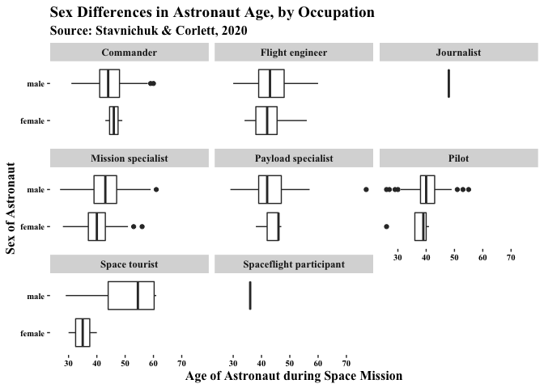
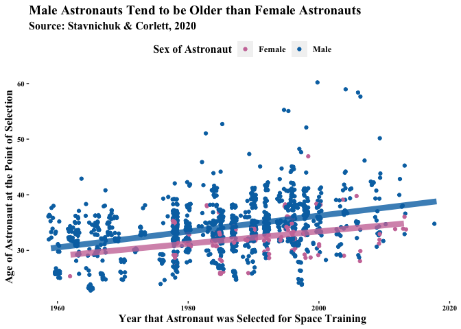
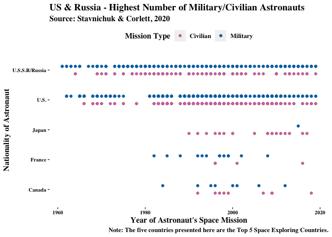
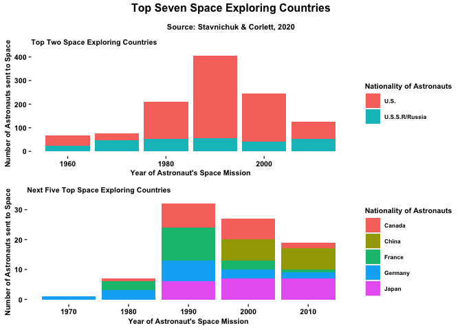
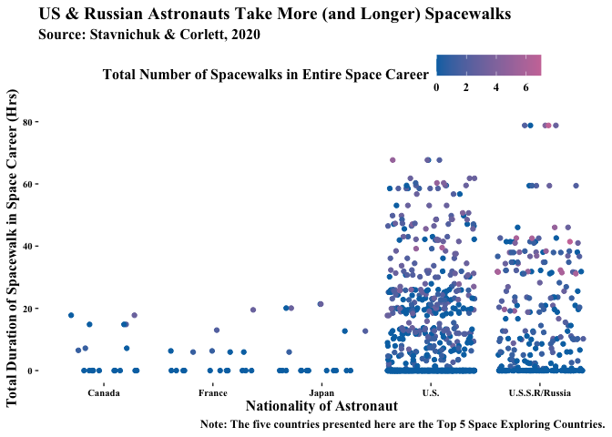
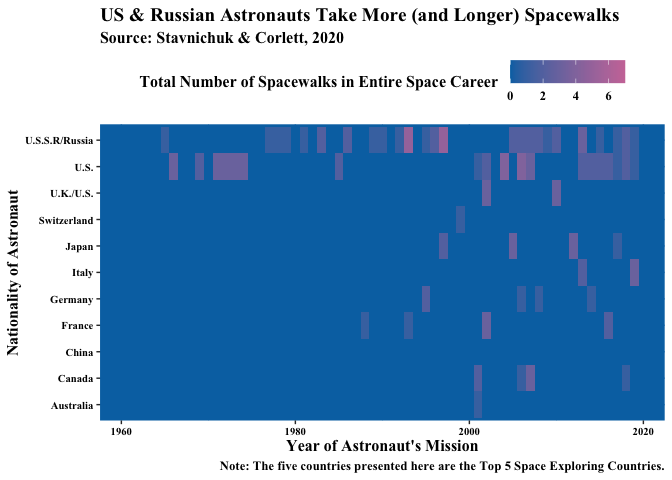
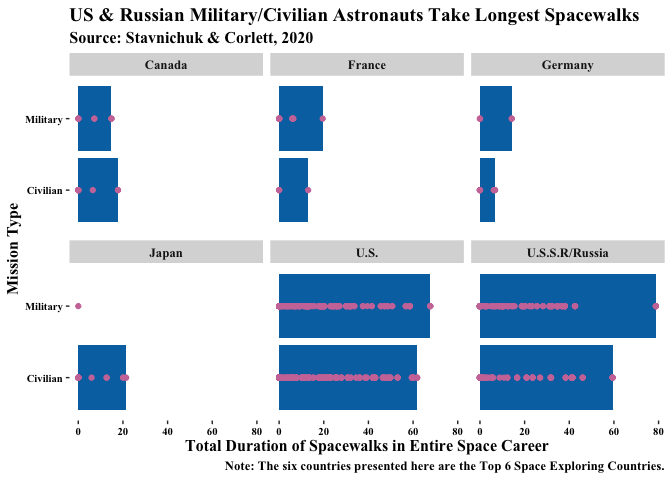
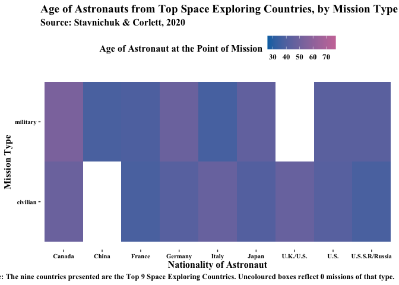
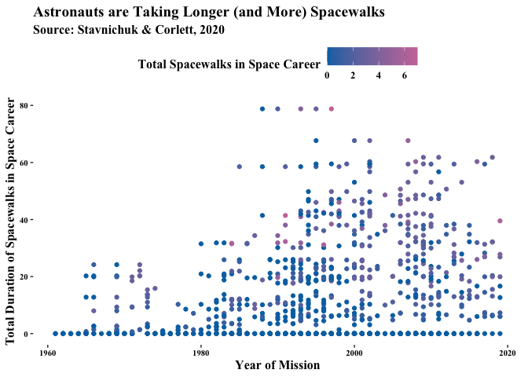

- Completed as Assignment 1 for QMSS GR5063 Data Visualization, Spring 2021
- Contact: [kagen.lim@columbia.edu](mailto:kagen.lim@columbia.edu) 

The dataset utilized in this assignment is the Astronauts Dataset [(Stavnichuk & Corlett, 2020)](https://data.mendeley.com/datasets/86tsnnbv2w/1) which contains publicly available information about the astronauts who participated in space missions before 15 January 2020. 

The first three questions in this assignment are guided in terms of topic, in which I explore the Age, Sex, Nationality and Space Walk records (i.e., extravehicular explorations). The fourth one allows some room of exploration. In the fifth one, I introduce some interactive plots, and in the final question I explore an interactive data table. 

First, I set up the libraries I need and load in my dataset:


```r
#setting up relevant libraries#
library(tidyverse)
```

```
## Warning: package 'tidyverse' was built under R version 4.0.2
```

```
## Warning: replacing previous import 'vctrs::data_frame' by 'tibble::data_frame'
## when loading 'dplyr'
```

```
## ── Attaching packages ─────────────────────────────────────── tidyverse 1.3.0 ──
```

```
## ✓ ggplot2 3.3.3     ✓ purrr   0.3.4
## ✓ tibble  3.0.6     ✓ dplyr   1.0.0
## ✓ tidyr   1.1.0     ✓ stringr 1.4.0
## ✓ readr   1.3.1     ✓ forcats 0.5.0
```

```
## Warning: package 'ggplot2' was built under R version 4.0.2
```

```
## Warning: package 'tibble' was built under R version 4.0.2
```

```
## ── Conflicts ────────────────────────────────────────── tidyverse_conflicts() ──
## x dplyr::filter() masks stats::filter()
## x dplyr::lag()    masks stats::lag()
```

```r
library(tibble)
library(dplyr)
library(ggplot2)
library(plotly)
```

```
## Warning: package 'plotly' was built under R version 4.0.2
```

```
## 
## Attaching package: 'plotly'
```

```
## The following object is masked from 'package:ggplot2':
## 
##     last_plot
```

```
## The following object is masked from 'package:stats':
## 
##     filter
```

```
## The following object is masked from 'package:graphics':
## 
##     layout
```

```r
library(ggpubr)
```

```
## Warning: package 'ggpubr' was built under R version 4.0.2
```

```r
library(extrafont)
```

```
## Warning: package 'extrafont' was built under R version 4.0.2
```

```
## Registering fonts with R
```

```r
library(DT)
```

```
## Warning: package 'DT' was built under R version 4.0.2
```


```r
#setting up my dataset#

df <- read.csv("astronauts.csv")

colnames(df)
```

```
##  [1] "id"                       "number"                  
##  [3] "nationwide_number"        "name"                    
##  [5] "original_name"            "sex"                     
##  [7] "year_of_birth"            "nationality"             
##  [9] "military_civilian"        "selection"               
## [11] "year_of_selection"        "mission_number"          
## [13] "total_number_of_missions" "occupation"              
## [15] "year_of_mission"          "mission_title"           
## [17] "ascend_shuttle"           "in_orbit"                
## [19] "descend_shuttle"          "hours_mission"           
## [21] "total_hrs_sum"            "eva_instances"           
## [23] "eva_hrs_mission"          "total_eva_hrs"
```

```r
glimpse(df)
```

```
## Rows: 1,277
## Columns: 24
## $ id                       <int> 1, 2, 3, 4, 5, 6, 7, 8, 9, 10, 11, 12, 13, 1…
## $ number                   <int> 1, 2, 3, 3, 4, 5, 5, 6, 6, 7, 7, 7, 8, 8, 9,…
## $ nationwide_number        <int> 1, 2, 1, 1, 2, 2, 2, 4, 4, 3, 3, 3, 4, 4, 5,…
## $ name                     <chr> "Gagarin, Yuri", "Titov, Gherman", "Glenn, J…
## $ original_name            <chr> "ГАГАРИН Юрий Алексеевич", "ТИТОВ Герман Сте…
## $ sex                      <chr> "male", "male", "male", "male", "male", "mal…
## $ year_of_birth            <int> 1934, 1935, 1921, 1921, 1925, 1929, 1929, 19…
## $ nationality              <chr> "U.S.S.R/Russia", "U.S.S.R/Russia", "U.S.", …
## $ military_civilian        <chr> "military", "military", "military", "militar…
## $ selection                <chr> "TsPK-1", "TsPK-1", "NASA Astronaut Group 1"…
## $ year_of_selection        <int> 1960, 1960, 1959, 1959, 1959, 1960, 1960, 19…
## $ mission_number           <int> 1, 1, 1, 2, 1, 1, 2, 1, 2, 1, 2, 3, 1, 2, 1,…
## $ total_number_of_missions <int> 1, 1, 2, 2, 1, 2, 2, 2, 2, 3, 3, 3, 2, 2, 3,…
## $ occupation               <chr> "pilot", "pilot", "pilot", "PSP", "Pilot", "…
## $ year_of_mission          <int> 1961, 1961, 1962, 1998, 1962, 1962, 1970, 19…
## $ mission_title            <chr> "Vostok 1", "Vostok 2", "MA-6", "STS-95", "M…
## $ ascend_shuttle           <chr> "Vostok 1", "Vostok 2", "MA-6", "STS-95", "M…
## $ in_orbit                 <chr> "Vostok 2", "Vostok 2", "MA-6", "STS-95", "M…
## $ descend_shuttle          <chr> "Vostok 3", "Vostok 2", "MA-6", "STS-95", "M…
## $ hours_mission            <dbl> 1.77, 25.00, 5.00, 213.00, 5.00, 94.00, 424.…
## $ total_hrs_sum            <dbl> 1.77, 25.30, 218.00, 218.00, 5.00, 519.33, 5…
## $ eva_instances            <int> 0, 0, 0, 0, 0, 0, 0, 0, 0, 0, 0, 0, 0, 0, 0,…
## $ eva_hrs_mission          <dbl> 0.00, 0.00, 0.00, 0.00, 0.00, 0.00, 0.00, 0.…
## $ total_eva_hrs            <dbl> 0.00, 0.00, 0.00, 0.00, 0.00, 0.00, 0.00, 0.…
```

```r
n_distinct(df$name) #564 means that astronauts performed multiple missions#
```

```
## [1] 564
```

```r
n_distinct(df$id) #1277 means that this will be a good key value#
```

```
## [1] 1277
```

### 1. Age & Sex

Visualize the information presented by the year of birth of astronauts. This could be their age when selected, their age during their first mission, or how old they were during their last mission (or all of these). This could also include who were the youngest or oldest astronauts, or which astronauts where active the longest. In addition, use the sex information on the astronauts for further differentiation.

Create 2-3 charts in this section to highlight some important patterns. Make sure to use some variation in the type of visualizations. Briefly discuss which visualization you recommend to your editor and why.

Discuss three specific design choices in these graphs that were influenced by your knowledge of the data visualization principles we discussed in the lectures.


```r
df1 <- df %>%
  group_by(name, number) %>%
  mutate(age_selected = year_of_selection - year_of_birth, age_mission = year_of_mission - year_of_birth) %>% #create new vars#
  filter(age_selected >= 0, age_mission >=0) #sanity check#

glimpse(df1)
```

```
## Rows: 1,277
## Columns: 26
## Groups: name, number [565]
## $ id                       <int> 1, 2, 3, 4, 5, 6, 7, 8, 9, 10, 11, 12, 13, 1…
## $ number                   <int> 1, 2, 3, 3, 4, 5, 5, 6, 6, 7, 7, 7, 8, 8, 9,…
## $ nationwide_number        <int> 1, 2, 1, 1, 2, 2, 2, 4, 4, 3, 3, 3, 4, 4, 5,…
## $ name                     <chr> "Gagarin, Yuri", "Titov, Gherman", "Glenn, J…
## $ original_name            <chr> "ГАГАРИН Юрий Алексеевич", "ТИТОВ Герман Сте…
## $ sex                      <chr> "male", "male", "male", "male", "male", "mal…
## $ year_of_birth            <int> 1934, 1935, 1921, 1921, 1925, 1929, 1929, 19…
## $ nationality              <chr> "U.S.S.R/Russia", "U.S.S.R/Russia", "U.S.", …
## $ military_civilian        <chr> "military", "military", "military", "militar…
## $ selection                <chr> "TsPK-1", "TsPK-1", "NASA Astronaut Group 1"…
## $ year_of_selection        <int> 1960, 1960, 1959, 1959, 1959, 1960, 1960, 19…
## $ mission_number           <int> 1, 1, 1, 2, 1, 1, 2, 1, 2, 1, 2, 3, 1, 2, 1,…
## $ total_number_of_missions <int> 1, 1, 2, 2, 1, 2, 2, 2, 2, 3, 3, 3, 2, 2, 3,…
## $ occupation               <chr> "pilot", "pilot", "pilot", "PSP", "Pilot", "…
## $ year_of_mission          <int> 1961, 1961, 1962, 1998, 1962, 1962, 1970, 19…
## $ mission_title            <chr> "Vostok 1", "Vostok 2", "MA-6", "STS-95", "M…
## $ ascend_shuttle           <chr> "Vostok 1", "Vostok 2", "MA-6", "STS-95", "M…
## $ in_orbit                 <chr> "Vostok 2", "Vostok 2", "MA-6", "STS-95", "M…
## $ descend_shuttle          <chr> "Vostok 3", "Vostok 2", "MA-6", "STS-95", "M…
## $ hours_mission            <dbl> 1.77, 25.00, 5.00, 213.00, 5.00, 94.00, 424.…
## $ total_hrs_sum            <dbl> 1.77, 25.30, 218.00, 218.00, 5.00, 519.33, 5…
## $ eva_instances            <int> 0, 0, 0, 0, 0, 0, 0, 0, 0, 0, 0, 0, 0, 0, 0,…
## $ eva_hrs_mission          <dbl> 0.00, 0.00, 0.00, 0.00, 0.00, 0.00, 0.00, 0.…
## $ total_eva_hrs            <dbl> 0.00, 0.00, 0.00, 0.00, 0.00, 0.00, 0.00, 0.…
## $ age_selected             <int> 26, 25, 38, 38, 34, 31, 31, 30, 30, 36, 36, …
## $ age_mission              <int> 27, 26, 41, 77, 37, 33, 41, 32, 44, 39, 42, …
```

```r
unique(df1$occupation) #needs recoding, lots of overlap#
```

```
##  [1] "pilot"                   "PSP"                    
##  [3] "Pilot"                   "commander"              
##  [5] "MSP"                     "flight engineer"        
##  [7] "Other (Journalist)"      "Flight engineer"        
##  [9] "Other (space tourist)"   "Other (Space tourist)"  
## [11] "Space tourist"           "spaceflight participant"
```

```r
#recodes#
df1$occupation_new <- ifelse(df1$occupation == 'pilot', 'Pilot', df1$occupation)

df1$occupation_new <- ifelse(df1$occupation_new == 'Other (Journalist)', 'Journalist', df1$occupation_new)

df1$occupation_new <- ifelse(df1$occupation_new == 'Other (space tourist)', 'Space tourist', df1$occupation_new)

df1$occupation_new <- ifelse(df1$occupation_new == 'Other (Space tourist)', 'Space tourist', df1$occupation_new)

df1$occupation_new <- ifelse(df1$occupation_new == 'commander', 'Commander', df1$occupation_new)

df1$occupation_new <- ifelse(df1$occupation_new == 'flight engineer', 'Flight engineer', df1$occupation_new)

df1$occupation_new <- ifelse(df1$occupation_new == 'spaceflight participant', 'Spaceflight participant', df1$occupation_new)

df1$occupation_new <- ifelse(df1$occupation_new == 'MSP', 'Mission specialist', df1$occupation_new)

df1$occupation_new <- ifelse(df1$occupation_new == 'PSP', 'Payload specialist', df1$occupation_new)

unique(df1$occupation_new) #much better#
```

```
## [1] "Pilot"                   "Payload specialist"     
## [3] "Commander"               "Mission specialist"     
## [5] "Flight engineer"         "Journalist"             
## [7] "Space tourist"           "Spaceflight participant"
```


```r
ggplot(df1) + 
  geom_boxplot(aes(x = sex, y = age_mission)) +
  coord_flip() + 
  facet_wrap(~occupation_new) +
  theme(panel.grid=element_line(colour="white"), panel.background = element_rect(fill="white")) + 
  labs(
    x = "Sex of Astronaut",
    y = "Age of Astronaut during Space Mission",
    title = "Sex Differences in Astronaut Age, by Occupation",
    subtitle = "Source: Stavnichuk & Corlett, 2020"
  ) + 
  theme(text=element_text(family="Times New Roman", face="bold", size=12)) + 
  theme(axis.text.x = element_text(face="bold", color="black", 
                           size=8),
          axis.text.y = element_text(face="bold", color="black", 
                           size=8))
```

<!-- -->


```r
df1_female <- df1 %>%
  filter(sex == 'female')

df1_male <- df1 %>%
  filter(sex == 'male')
```


```r
ggplot(df1) + 
  geom_jitter(aes(x = year_of_selection, y = age_selected, color = sex)) + 
  scale_color_manual(labels = c("Female", "Male"), values=c("#CC79A7", "#0072B2")) + 
  stat_smooth(mapping = aes(x = year_of_selection, y = age_selected), data = df1_male, method = 'lm', color = "#0072B2", formula = y~x, geom = 'line', alpha = 0.8, size = 3, se = FALSE) + 
  stat_smooth(mapping = aes(x = year_of_selection, y = age_selected), data = df1_female, method = 'lm', colour = "#CC79A7", formula = y~x, geom = 'line', alpha = 0.8, size = 3, se = FALSE) +
  theme(legend.position="top") + 
  theme(panel.grid=element_line(colour="white"), panel.background = element_rect(fill="white")) + 
    labs(
    x = "Year that Astronaut was Selected for Space Training",
    y = "Age of Astronaut at the Point of Selection",
    color = "Sex of Astronaut",
    title = "Male Astronauts Tend to be Older than Female Astronauts",
    subtitle = "Source: Stavnichuk & Corlett, 2020"
  ) + 
  theme(text=element_text(family="Times New Roman", face="bold", size=12)) + 
    theme(axis.text.x = element_text(face="bold", color="black", 
                           size=8),
          axis.text.y = element_text(face="bold", color="black", 
                           size=8))
```

<!-- -->

I recommend the second plot in this segment, the scatter plot titled `Male Astronauts Tend to be Older than Female Astronauts` to the editor. I believe that this plot clearly conveys a single point -- male astronauts tend to be older than female astronauts, and this effect seems to have held true over time. This insight is succinctly captured in the title. The two linear regression lines, associated with a male astronauts subset of the dataset (in blue, following the color scheme) and with female astronauts subset of the dataset (in pink, following the color scheme) respectively, clearly conveys this single point too. 

My Graphs in this section reflect some Gestalt principles.

Graph 2 most clearly reflects the principle of similarity through the color choice. The blue dots represent one group (male) and the pink dots represent one group (female). It also displays the principle of continuity, with the use of the two regression lines to imply that the two groups indeed have different trajectories.

Graph 1 employs a `facet_wrap()`, with the conscious application of the Gestalt principle of proximity. Boxplots appeared under clearly labelled headers, throughout the graph, so the user knows which boxplot represents which category. 

### 2. Nationality 

For a long time, space exploration was a duel between two superpowers. But recently, other nations have entered the game as well. Use the information on the nationality of the astronauts to visualize some interesting patterns. Consider, for example, that the composition of shuttle missions has recently become mixed nationalities, something that was absent in earlier times.

Create 1-2 charts in this section to highlight the information on nationality. Make sure to use some variation in the type of visualizations. Briefly discuss which visualization you recommend to your editor and why.


```r
unique(df$nationality) #there are quite a number#
```

```
##  [1] "U.S.S.R/Russia"           "U.S."                    
##  [3] "Mongolia"                 "Romania"                 
##  [5] "France"                   "Czechoslovakia"          
##  [7] "Poland"                   "Germany"                 
##  [9] "Bulgaria"                 "Hungry"                  
## [11] "Vietnam"                  "Cuba"                    
## [13] "India"                    "Canada"                  
## [15] "Saudi Arabia"             "Netherland"              
## [17] "Mexico"                   "Syria"                   
## [19] "Afghanistan"              "Japan"                   
## [21] "U.K."                     "Austria"                 
## [23] "Belgium"                  "Switzerland"             
## [25] "Italy"                    "Australia"               
## [27] "U.S.S.R/Ukraine"          "Spain"                   
## [29] "Slovakia"                 "Republic of South Africa"
## [31] "U.K./U.S."                "Israel"                  
## [33] "China"                    "Brazil"                  
## [35] "Sweden"                   "Malysia"                 
## [37] "Korea"                    "Denmark"                 
## [39] "Kazakhstan"               "UAE"
```

```r
#Subsetting to the top 5 only!#
nationality_top5_count <- df %>%
  group_by(nationality) %>%
  tally(sort = TRUE) %>%
  top_n(5)
```

```
## Selecting by n
```

```r
nationality_top5 <- df %>% 
  filter(nationality %in% nationality_top5_count$nationality)

glimpse(nationality_top5) #quite a number captured by top_10. 1240 observations, so we are getting quite a fair bit of the information just by the top_10#
```

```
## Rows: 1,183
## Columns: 24
## $ id                       <int> 1, 2, 3, 4, 5, 6, 7, 8, 9, 10, 11, 12, 13, 1…
## $ number                   <int> 1, 2, 3, 3, 4, 5, 5, 6, 6, 7, 7, 7, 8, 8, 9,…
## $ nationwide_number        <int> 1, 2, 1, 1, 2, 2, 2, 4, 4, 3, 3, 3, 4, 4, 5,…
## $ name                     <chr> "Gagarin, Yuri", "Titov, Gherman", "Glenn, J…
## $ original_name            <chr> "ГАГАРИН Юрий Алексеевич", "ТИТОВ Герман Сте…
## $ sex                      <chr> "male", "male", "male", "male", "male", "mal…
## $ year_of_birth            <int> 1934, 1935, 1921, 1921, 1925, 1929, 1929, 19…
## $ nationality              <chr> "U.S.S.R/Russia", "U.S.S.R/Russia", "U.S.", …
## $ military_civilian        <chr> "military", "military", "military", "militar…
## $ selection                <chr> "TsPK-1", "TsPK-1", "NASA Astronaut Group 1"…
## $ year_of_selection        <int> 1960, 1960, 1959, 1959, 1959, 1960, 1960, 19…
## $ mission_number           <int> 1, 1, 1, 2, 1, 1, 2, 1, 2, 1, 2, 3, 1, 2, 1,…
## $ total_number_of_missions <int> 1, 1, 2, 2, 1, 2, 2, 2, 2, 3, 3, 3, 2, 2, 3,…
## $ occupation               <chr> "pilot", "pilot", "pilot", "PSP", "Pilot", "…
## $ year_of_mission          <int> 1961, 1961, 1962, 1998, 1962, 1962, 1970, 19…
## $ mission_title            <chr> "Vostok 1", "Vostok 2", "MA-6", "STS-95", "M…
## $ ascend_shuttle           <chr> "Vostok 1", "Vostok 2", "MA-6", "STS-95", "M…
## $ in_orbit                 <chr> "Vostok 2", "Vostok 2", "MA-6", "STS-95", "M…
## $ descend_shuttle          <chr> "Vostok 3", "Vostok 2", "MA-6", "STS-95", "M…
## $ hours_mission            <dbl> 1.77, 25.00, 5.00, 213.00, 5.00, 94.00, 424.…
## $ total_hrs_sum            <dbl> 1.77, 25.30, 218.00, 218.00, 5.00, 519.33, 5…
## $ eva_instances            <int> 0, 0, 0, 0, 0, 0, 0, 0, 0, 0, 0, 0, 0, 0, 0,…
## $ eva_hrs_mission          <dbl> 0.00, 0.00, 0.00, 0.00, 0.00, 0.00, 0.00, 0.…
## $ total_eva_hrs            <dbl> 0.00, 0.00, 0.00, 0.00, 0.00, 0.00, 0.00, 0.…
```


```r
military_civilian = ggplot(nationality_top5) + 
  geom_point(aes(x = year_of_mission, y = nationality, colour = military_civilian), position = position_dodge(width = 0.5)) + 
  scale_color_manual(labels = c("Civilian", "Military"), values=c("#CC79A7", "#0072B2")) + 
  theme(legend.position="top")  + 
  theme(panel.grid=element_line(colour="white"), panel.background = element_rect(fill="white")) +
     labs(
    x = "Year of Astronaut's Space Mission",
    y = "Nationality of Astronaut",
    color = "Mission Type",
    title = "US & Russia - Highest Number of Military/Civilian Astronauts",
    subtitle = "Source: Stavnichuk & Corlett, 2020",
    caption = "Note: The five countries presented here are the Top 5 Space Exploring Countries."
  ) + 
  theme(text=element_text(family = "Times", face="bold", size=12)) + 
    theme(axis.text.x = element_text(face="bold", color="black", 
                           size=8),
          axis.text.y = element_text(face="bold", color="black", 
                           size=8))

military_civilian
```

<!-- -->


```r
#Subsetting to the top 5, non US, Russia, only#
nationality_nonsuper_top5_count <- df %>%
  group_by(nationality) %>%
  tally(sort = TRUE) %>%
  top_n(7) %>%
  filter(!nationality %in% c('U.S.', 'U.S.S.R/Russia')) #not one of the two big superpowers for space exploration#
```

```
## Selecting by n
```

```r
glimpse(nationality_nonsuper_top5_count) #still quite a number captured by top_5. 1183 observations, so we are getting quite a fair bit of the information just by the top_5#
```

```
## Rows: 5
## Columns: 2
## $ nationality <chr> "Japan", "Canada", "France", "Germany", "China"
## $ n           <int> 20, 18, 18, 16, 14
```

```r
#Grouping by Decade#
nationality_nonsuper_top5_number_decade <- df %>%
  filter(nationality %in% nationality_nonsuper_top5_count$nationality) %>%
  mutate(decade = floor(year_of_mission/10)*10) %>%
  group_by(decade, nationality) %>%
  dplyr::summarize(astronaut_trips = n())
```

```
## `summarise()` regrouping output by 'decade' (override with `.groups` argument)
```

```r
nationality_super_number_decade <- df %>%
  filter(nationality %in% c('U.S.', 'U.S.S.R/Russia')) %>%
  mutate(decade = floor(year_of_mission/10)*10) %>%
  group_by(decade, nationality) %>%
  dplyr::summarize(astronaut_trips = n())
```

```
## `summarise()` regrouping output by 'decade' (override with `.groups` argument)
```


```r
super = ggplot(nationality_super_number_decade) + 
  geom_col(aes(x = decade, y = astronaut_trips,fill=nationality)) + 
  labs(
    x = "Year of Astronaut's Space Mission",
    y = "Number of Astronauts sent to Space",
    subtitle = "Top Two Space Exploring Countries",
    fill = "Nationality of Astronauts") +
  theme(panel.grid=element_line(colour="white"), panel.background = element_rect(fill="white")) + 
  theme(text=element_text(face="bold", size=8)) + 
      theme(axis.text.x = element_text(face="bold", color="black", 
                           size=8),
          axis.text.y = element_text(face="bold", color="black", 
                           size=8))

non_super = ggplot(nationality_nonsuper_top5_number_decade) + 
  geom_col(aes(x = decade, y = astronaut_trips,fill=nationality)) + 
    labs(
    x = "Year of Astronaut's Space Mission",
    y = "Number of Astronauts sent to Space",
    subtitle = "Next Five Top Space Exploring Countries",
    fill = "Nationality of Astronauts") +
  theme(panel.grid=element_line(colour="white"), panel.background = element_rect(fill="white")) + 
  theme(text=element_text(face="bold", size=8)) + 
      theme(axis.text.x = element_text(face="bold", color="black", 
                           size=8),
          axis.text.y = element_text(face="bold", color="black", 
                           size=8))
#Add color#

combined = ggarrange(super, non_super, ncol = 1)

title <- expression(atop(bold("Top Seven Space Exploring Countries"), scriptstyle(bold("Source: Stavnichuk & Corlett, 2020"))))
annotate_figure(combined,
                top=text_grob(title), fig.lab.face = "bold")
```

<!-- -->

I recommend the first plot in this segment, the scatter plot titled `America & Russia have Highest Number of Military/Civilian Astronauts` to the editor. I believe that this plot clearly does justice to the data, since the raw data is fully displayed. The segmentation, both by color and by a totally separate but adjacent row of points,  into military and civilian groups makes this point extremely clear. And in this case, this helps to convey the point -- America and Russia not only have the most number of astronauts who have been to space, they lead in sending astronauts on both military and civilian missions. This effect holds even now, when countries Japan, France and Canada are also catching up. This insight is succinctly captured in the title too.

### 3. Space walks 

Space walks, or extravehicular activities, are often the highlight of these missions. Wrangle the data to create an overview of cumulative spacewalk records of individual astronauts (i.e. calculate the number and total duration of EVA by astronaut).

Create 1-2 charts in this section to highlight some important patterns. Make sure to use some variation in the type of visualizations. Briefly discuss which visualization you recommend to your editor and why.


```r
df3 <- df %>%
  group_by(number, name) %>%
  mutate(number_spacewalk = eva_instances, duration_spacewalk = total_eva_hrs)

#Subsetting to the top 5 only!#
nationality_top5_count_3 <- df3 %>%
  group_by(nationality) %>%
  tally(sort = TRUE) %>%
  top_n(5)
```

```
## Selecting by n
```

```r
nationality_top5_3 <- df3 %>% 
  filter(nationality %in% nationality_top5_count_3$nationality)

#Subsetting to the top 10 only!#
nationality_top10_count_3 <- df3 %>%
  group_by(nationality) %>%
  tally(sort = TRUE) %>%
  top_n(10)
```

```
## Selecting by n
```

```r
nationality_top10_3 <- df3 %>% 
  filter(nationality %in% nationality_top10_count_3$nationality)
```


```r
ggplot(nationality_top5_3) + 
  geom_jitter(aes(x = duration_spacewalk, y = nationality, color = number_spacewalk)) + 
  scale_color_gradient(low = "#0072B2", high = "#CC79A7") + 
  theme(legend.position="top") +
  theme(panel.grid=element_line(colour="white"), panel.background = element_rect(fill="white")) +
  coord_flip() + 
     labs(
    x = "Total Duration of Spacewalk in Space Career (Hrs)",
    y = "Nationality of Astronaut",
    color = "Total Number of Spacewalks in Entire Space Career",
    title = "US & Russian Astronauts Take More (and Longer) Spacewalks",
    subtitle = "Source: Stavnichuk & Corlett, 2020",
    caption = "Note: The five countries presented here are the Top 5 Space Exploring Countries."
  ) + 
  theme(text=element_text(family="Times New Roman", face="bold", size=12)) + 
    theme(axis.text.x = element_text(face="bold", color="black", 
                           size=8),
          axis.text.y = element_text(face="bold", color="black", 
                           size=8))
```

<!-- -->


```r
ggplot(nationality_top10_3) + 
  geom_tile(aes(x = year_of_mission, y = nationality, fill = number_spacewalk)) +
  scale_fill_gradient(low = "#0072B2", high = "#CC79A7") + 
  theme(legend.position="top") +
  theme(panel.background=element_rect(fill="#0072B2"), panel.grid=element_line(colour="#0072B2")) + 
       labs(
    x = "Year of Astronaut's Mission",
    y = "Nationality of Astronaut",
    fill = "Total Number of Spacewalks in Entire Space Career ",
    title = "US & Russian Astronauts Take More (and Longer) Spacewalks",
    subtitle = "Source: Stavnichuk & Corlett, 2020",
    caption = "Note: The five countries presented here are the Top 5 Space Exploring Countries."
  ) + 
  theme(text=element_text(family="Times New Roman", face="bold", size=12)) + 
    theme(axis.text.x = element_text(face="bold", color="black", 
                           size=8),
          axis.text.y = element_text(face="bold", color="black", 
                           size=8))
```

<!-- -->

I recommend the second plot in this segment, the heatmap titled `American & Russian Astronauts Take More (and Longer) Spacewalks` to the editor. 

I believe that this plot format enables the reader to have a broader overview of more countries, other than America and Russia, as the heatmap captures much of the information by differences in color. In addition to that, it also communicates a clear point by color - the number of spacewalks covered per country, along with when these spacewalks happened. It clearly shows peaks in spacewalks for the USSR somewhere in the early to mid 1990s, and how non US/Russia countries had more spacewealks in the second half of the heatmap's time frame, after 1990. This should be easy to read for a lay person.

### 4. Independent Exploration


```r
df4 <- df %>%
  group_by(number) %>%
  mutate(number_spacewalk = eva_instances, duration_spacewalk = total_eva_hrs, age_mission = year_of_mission - year_of_birth) %>% #create new vars#
  filter(age_mission >= 0)  #sanity check#

nationality_top6_count_4 <- df4 %>%
  group_by(nationality) %>%
  tally(sort = TRUE) %>%
  top_n(6)
```

```
## Selecting by n
```

```r
nationality_top6_4 <- df4 %>% 
  filter(nationality %in% nationality_top6_count_4$nationality)

nationality_top9_count_4 <- df4 %>%
  group_by(nationality) %>%
  tally(sort = TRUE) %>%
  top_n(9)
```

```
## Selecting by n
```

```r
nationality_top9_4 <- df4 %>% 
  filter(nationality %in% nationality_top9_count_4$nationality)
```


```r
ggplot(nationality_top6_4) + 
  geom_col(position = position_dodge(width=1), aes(x = military_civilian, y = duration_spacewalk), fill = "#0072B2") +
  geom_point(position = position_dodge(width=1), aes(x = military_civilian, y = duration_spacewalk), color ="#CC79A7") +
  facet_wrap(~nationality) + 
  theme(panel.grid=element_line(colour="white"), panel.background = element_rect(fill="white")) +
  scale_x_discrete(breaks=c("military", "civilian"),
                      labels=c("Military", "Civilian")) + 
    coord_flip() + 
     labs(
    x = "Mission Type",
    y = "Total Duration of Spacewalks in Entire Space Career",
    title = "US & Russian Military/Civilian Astronauts Take Longest Spacewalks",
    subtitle = "Source: Stavnichuk & Corlett, 2020",
    caption = "Note: The six countries presented here are the Top 6 Space Exploring Countries."
  ) + 
  theme(text=element_text(family="Times New Roman", face="bold", size=12)) + 
    theme(axis.text.x = element_text(face="bold", color="black", 
                           size=8),
          axis.text.y = element_text(face="bold", color="black", 
                           size=8))
```

<!-- -->


```r
ggplot(nationality_top9_4) + 
  geom_tile(aes(x = nationality, y = military_civilian, fill = age_mission)) +
  scale_fill_gradient(low = "#0072B2", high = "#CC79A7", na.value = "grey50") + 
  theme(legend.position="top") +
  theme(panel.grid=element_line(colour="white"), panel.background = element_rect(fill="white")) + 
       labs(
    x = "Nationality of Astronaut",
    y = "Mission Type",
    fill = "Age of Astronaut at the Point of Mission",
    title = "Age of Astronauts from Top Space Exploring Countries, by Mission Type",
    subtitle = "Source: Stavnichuk & Corlett, 2020",
    caption = "Note: The nine countries presented are the Top 9 Space Exploring Countries. Uncoloured boxes reflect 0 missions of that type."
  ) + 
  theme(text=element_text(family="Times New Roman", face="bold", size=12)) + 
    theme(axis.text.x = element_text(face="bold", color="black", 
                           size=8),
          axis.text.y = element_text(face="bold", color="black", 
                           size=8))
```

<!-- -->


```r
ggplot(df4) + 
  geom_point(aes(x = year_of_mission, y = duration_spacewalk, color =number_spacewalk, position = 'dodge')) +
    labs(
    x = "Year of Mission",
    y = "Total Duration of Spacewalks in Space Career",
    color = "Total Spacewalks in Space Career",
    title = "Astronauts are Taking Longer (and More) Spacewalks",
    subtitle = "Source: Stavnichuk & Corlett, 2020") + 
  scale_color_gradient(low = "#0072B2", high = "#CC79A7") +
  theme(legend.position="top") +
  theme(panel.grid=element_line(colour="white"), panel.background = element_rect(fill="white")) + 
  theme(text=element_text(family="Times New Roman", face="bold", size=12)) + 
    theme(axis.text.x = element_text(face="bold", color="black", 
                           size=8),
          axis.text.y = element_text(face="bold", color="black", 
                           size=8))
```

```
## Warning: Ignoring unknown aesthetics: position
```

<!-- -->

I recommend the third plot in this segment, the scatter plot titled `Astronauts are Taking Longer (and More) Spacewalks` to the editor. This clearly coveys a single point, both by the position of the points and by color -- that more Spacewalks are being taken in more recent years. This is conveyed by the position of the points and by the increasing pink color towards the right of the graph. I believe that the inclusion of total spacewalks as color further enhances this point  This insight is succinctly captured in the title too.

### 5. Interactivity

Choose 2 of the plots you created above and add interactivity. For at least one of these interactive plots, this should not be done through the use of `ggplotly`. Briefly describe to the editor why interactivity in these visualizations is particularly helpful for a reader.


```r
ggplotly(military_civilian)  %>%
  layout(annotations = 
 list(x = 0.01, y = 1.03, text = "<b>Source: Stavnichuk & Corlett, 2020<b>", 
      showarrow = F, xref='paper', yref='paper', 
      xanchor='auto', yanchor='auto', xshift=0, yshift=0,
      font=list(size=15)))
```

<!--html_preserve--><div id="htmlwidget-935d1a3df0e0d0c63a0a" style="width:672px;height:480px;" class="plotly html-widget"></div>
<script type="application/json" data-for="htmlwidget-935d1a3df0e0d0c63a0a">{"x":{"data":[{"x":[1964,1964,1966,1969,1966,1969,1968,1985,1988,1982,1968,1969,1969,1971,1969,1970,1970,1970,1975,1971,1972,1973,1983,1973,1978,1980,1973,1973,1982,1975,1977,1985,1975,1982,1984,1990,1975,1977,1979,1980,1998,1980,1983,1984,1990,1995,1981,1983,1990,1993,1982,1984,1982,1984,1982,1983,1985,1989,1991,1993,1996,1983,1984,1983,1985,1989,1992,1995,1983,1987,1983,1985,1983,1990,1984,1986,1984,1986,1984,1984,1984,1985,1984,1986,1988,1984,1986,1990,1997,1999,1984,1985,1984,1985,1985,1984,1990,1992,1984,1984,1985,1991,1993,1985,1985,1990,1992,1993,1996,1985,1985,1985,1989,1991,1993,1996,1985,1985,1978,1978,1985,1988,1990,1985,1985,1990,1992,1995,1998,1985,1989,1986,1989,1992,1994,1996,1998,2002,1986,1986,1986,1986,1987,1988,1994,1988,1991,1994,1998,2000,2005,1989,1991,1989,1992,1995,1989,1992,1993,1995,1990,1992,1994,1997,2001,1990,1991,1993,1990,1990,1995,1990,1995,1990,1991,1994,1996,2001,1991,1992,1994,1996,1991,1993,1995,1997,1991,1992,1991,1992,1994,1991,1992,1995,1996,1999,1991,1991,1992,1993,1996,1992,1992,1996,2000,2003,2010,1992,1993,1995,1997,1999,2003,1992,1992,1993,1995,1998,1992,1994,1997,1992,1992,2000,1993,1995,1996,2001,2002,1993,1994,1999,2002,1993,1995,1993,1994,1997,2000,1993,1995,1997,1997,2000,1993,1995,1998,2002,1993,1997,2002,2009,1993,1994,1996,1994,1994,1996,2001,1994,1996,2000,2004,1994,1995,1997,1997,1994,1998,1994,1997,1999,2002,1994,1997,1994,1997,2000,2006,1994,1997,1998,2001,2007,1995,1997,1999,2002,2009,1995,1998,2002,1995,1996,1997,2000,1995,2000,1995,1997,1997,2001,1995,1995,1996,2000,2009,2013,1996,1999,2001,1996,1998,2002,2008,1996,1996,2009,1996,2001,1997,1997,1997,1997,1997,1997,2000,2003,1997,2006,2013,1997,1998,2005,2010,1997,1997,2003,1997,2008,1998,2001,2007,1998,2007,1998,1998,1998,2000,2001,1998,2001,1999,2009,2000,2007,2010,2014,2000,2001,2006,2009,2001,2001,2005,2009,2001,2001,2001,2007,2002,2009,2002,2008,2016,2002,2002,2008,2011,2002,2007,2010,2013,2017,2002,2008,2011,2005,2009,2005,2005,2006,2008,2011,2006,2007,2010,2006,2006,2007,2009,2007,2009,2014,2007,2009,2007,2010,2007,2010,2007,2008,2009,2008,2008,2010,2008,2013,2008,2012,2008,2011,2009,2012,2017,2009,2018,2009,2011,2009,2009,2009,2011,2018,2009,2009,2011,2009,2009,2010,2015,2010,2010,2010,2010,2016,2019,2011,2012,2013,2017,2014,2016,2016,2016,2017,2018,2018,2019,2019],"y":[4.875,4.875,3.875,3.875,3.875,3.875,3.875,4.875,4.875,4.875,3.875,4.875,4.875,4.875,3.875,3.875,3.875,4.875,4.875,4.875,3.875,3.875,3.875,4.875,4.875,4.875,3.875,4.875,4.875,4.875,4.875,4.875,3.875,3.875,3.875,3.875,3.875,4.875,4.875,4.875,4.875,4.875,4.875,4.875,4.875,4.875,4.875,4.875,4.875,4.875,4.875,4.875,3.875,3.875,3.875,3.875,3.875,3.875,3.875,3.875,3.875,3.875,3.875,3.875,3.875,3.875,3.875,3.875,4.875,4.875,3.875,3.875,3.875,3.875,3.875,3.875,4.875,4.875,4.875,3.875,3.875,3.875,3.875,3.875,3.875,3.875,3.875,3.875,3.875,3.875,3.875,3.875,3.875,3.875,3.875,3.875,3.875,3.875,3.875,3.875,3.875,3.875,3.875,3.875,3.875,3.875,3.875,3.875,3.875,3.875,3.875,3.875,3.875,3.875,3.875,3.875,3.875,3.875,3.875,3.875,3.875,3.875,3.875,3.875,3.875,3.875,3.875,3.875,3.875,3.875,3.875,3.875,3.875,3.875,3.875,3.875,3.875,3.875,3.875,3.875,3.875,3.875,4.875,4.875,4.875,4.875,4.875,4.875,4.875,4.875,4.875,3.875,3.875,3.875,3.875,3.875,3.875,3.875,3.875,3.875,3.875,3.875,3.875,3.875,3.875,3.875,3.875,3.875,4.875,3.875,3.875,3.875,3.875,2.875,3.875,3.875,3.875,3.875,3.875,3.875,3.875,3.875,3.875,3.875,3.875,3.875,3.875,3.875,3.875,3.875,3.875,3.875,3.875,3.875,3.875,3.875,3.875,3.875,3.875,3.875,3.875,0.875,4.875,4.875,4.875,4.875,4.875,3.875,3.875,3.875,3.875,3.875,3.875,3.875,3.875,4.875,4.875,4.875,3.875,3.875,3.875,3.875,2.875,2.875,3.875,3.875,3.875,3.875,3.875,3.875,3.875,3.875,3.875,3.875,3.875,3.875,3.875,3.875,3.875,3.875,3.875,3.875,3.875,3.875,3.875,3.875,3.875,3.875,3.875,3.875,3.875,3.875,3.875,3.875,3.875,3.875,3.875,3.875,3.875,3.875,3.875,3.875,3.875,3.875,3.875,3.875,3.875,2.875,2.875,3.875,3.875,3.875,3.875,4.875,4.875,3.875,3.875,3.875,3.875,3.875,3.875,3.875,3.875,3.875,3.875,3.875,3.875,3.875,3.875,4.875,4.875,4.875,3.875,3.875,3.875,3.875,3.875,3.875,3.875,3.875,3.875,3.875,3.875,3.875,2.875,2.875,2.875,2.875,3.875,3.875,3.875,3.875,3.875,3.875,3.875,1.875,0.875,0.875,1.875,1.875,4.875,3.875,3.875,3.875,3.875,3.875,3.875,3.875,4.875,4.875,4.875,3.875,3.875,3.875,3.875,0.875,3.875,3.875,2.875,2.875,3.875,3.875,3.875,0.875,0.875,3.875,3.875,3.875,3.875,3.875,4.875,4.875,0.875,0.875,3.875,3.875,3.875,3.875,4.875,3.875,3.875,3.875,3.875,3.875,3.875,3.875,3.875,4.875,3.875,3.875,3.875,3.875,3.875,3.875,3.875,4.875,3.875,3.875,3.875,4.875,4.875,4.875,4.875,4.875,3.875,3.875,3.875,2.875,2.875,3.875,3.875,3.875,3.875,3.875,3.875,3.875,3.875,3.875,3.875,3.875,3.875,3.875,3.875,3.875,3.875,3.875,3.875,3.875,3.875,3.875,3.875,3.875,3.875,3.875,3.875,3.875,3.875,3.875,2.875,2.875,3.875,3.875,3.875,3.875,3.875,3.875,3.875,3.875,3.875,3.875,3.875,3.875,3.875,3.875,3.875,3.875,3.875,0.875,3.875,4.875,4.875,3.875,2.875,3.875,4.875,4.875,4.875,2.875,4.875,4.875,4.875,4.875,2.875,3.875,1.875,2.875,3.875,0.875,3.875,3.875],"text":["year_of_mission: 1964<br />nationality: U.S.S.R/Russia<br />military_civilian: civilian","year_of_mission: 1964<br />nationality: U.S.S.R/Russia<br />military_civilian: civilian","year_of_mission: 1966<br />nationality: U.S.<br />military_civilian: civilian","year_of_mission: 1969<br />nationality: U.S.<br />military_civilian: civilian","year_of_mission: 1966<br />nationality: U.S.<br />military_civilian: civilian","year_of_mission: 1969<br />nationality: U.S.<br />military_civilian: civilian","year_of_mission: 1968<br />nationality: U.S.<br />military_civilian: civilian","year_of_mission: 1985<br />nationality: U.S.S.R/Russia<br />military_civilian: civilian","year_of_mission: 1988<br />nationality: U.S.S.R/Russia<br />military_civilian: civilian","year_of_mission: 1982<br />nationality: U.S.S.R/Russia<br />military_civilian: civilian","year_of_mission: 1968<br />nationality: U.S.<br />military_civilian: civilian","year_of_mission: 1969<br />nationality: U.S.S.R/Russia<br />military_civilian: civilian","year_of_mission: 1969<br />nationality: U.S.S.R/Russia<br />military_civilian: civilian","year_of_mission: 1971<br />nationality: U.S.S.R/Russia<br />military_civilian: civilian","year_of_mission: 1969<br />nationality: U.S.<br />military_civilian: civilian","year_of_mission: 1970<br />nationality: U.S.<br />military_civilian: civilian","year_of_mission: 1970<br />nationality: U.S.<br />military_civilian: civilian","year_of_mission: 1970<br />nationality: U.S.S.R/Russia<br />military_civilian: civilian","year_of_mission: 1975<br />nationality: U.S.S.R/Russia<br />military_civilian: civilian","year_of_mission: 1971<br />nationality: U.S.S.R/Russia<br />military_civilian: civilian","year_of_mission: 1972<br />nationality: U.S.<br />military_civilian: civilian","year_of_mission: 1973<br />nationality: U.S.<br />military_civilian: civilian","year_of_mission: 1983<br />nationality: U.S.<br />military_civilian: civilian","year_of_mission: 1973<br />nationality: U.S.S.R/Russia<br />military_civilian: civilian","year_of_mission: 1978<br />nationality: U.S.S.R/Russia<br />military_civilian: civilian","year_of_mission: 1980<br />nationality: U.S.S.R/Russia<br />military_civilian: civilian","year_of_mission: 1973<br />nationality: U.S.<br />military_civilian: civilian","year_of_mission: 1973<br />nationality: U.S.S.R/Russia<br />military_civilian: civilian","year_of_mission: 1982<br />nationality: U.S.S.R/Russia<br />military_civilian: civilian","year_of_mission: 1975<br />nationality: U.S.S.R/Russia<br />military_civilian: civilian","year_of_mission: 1977<br />nationality: U.S.S.R/Russia<br />military_civilian: civilian","year_of_mission: 1985<br />nationality: U.S.S.R/Russia<br />military_civilian: civilian","year_of_mission: 1975<br />nationality: U.S.<br />military_civilian: civilian","year_of_mission: 1982<br />nationality: U.S.<br />military_civilian: civilian","year_of_mission: 1984<br />nationality: U.S.<br />military_civilian: civilian","year_of_mission: 1990<br />nationality: U.S.<br />military_civilian: civilian","year_of_mission: 1975<br />nationality: U.S.<br />military_civilian: civilian","year_of_mission: 1977<br />nationality: U.S.S.R/Russia<br />military_civilian: civilian","year_of_mission: 1979<br />nationality: U.S.S.R/Russia<br />military_civilian: civilian","year_of_mission: 1980<br />nationality: U.S.S.R/Russia<br />military_civilian: civilian","year_of_mission: 1998<br />nationality: U.S.S.R/Russia<br />military_civilian: civilian","year_of_mission: 1980<br />nationality: U.S.S.R/Russia<br />military_civilian: civilian","year_of_mission: 1983<br />nationality: U.S.S.R/Russia<br />military_civilian: civilian","year_of_mission: 1984<br />nationality: U.S.S.R/Russia<br />military_civilian: civilian","year_of_mission: 1990<br />nationality: U.S.S.R/Russia<br />military_civilian: civilian","year_of_mission: 1995<br />nationality: U.S.S.R/Russia<br />military_civilian: civilian","year_of_mission: 1981<br />nationality: U.S.S.R/Russia<br />military_civilian: civilian","year_of_mission: 1983<br />nationality: U.S.S.R/Russia<br />military_civilian: civilian","year_of_mission: 1990<br />nationality: U.S.S.R/Russia<br />military_civilian: civilian","year_of_mission: 1993<br />nationality: U.S.S.R/Russia<br />military_civilian: civilian","year_of_mission: 1982<br />nationality: U.S.S.R/Russia<br />military_civilian: civilian","year_of_mission: 1984<br />nationality: U.S.S.R/Russia<br />military_civilian: civilian","year_of_mission: 1982<br />nationality: U.S.<br />military_civilian: civilian","year_of_mission: 1984<br />nationality: U.S.<br />military_civilian: civilian","year_of_mission: 1982<br />nationality: U.S.<br />military_civilian: civilian","year_of_mission: 1983<br />nationality: U.S.<br />military_civilian: civilian","year_of_mission: 1985<br />nationality: U.S.<br />military_civilian: civilian","year_of_mission: 1989<br />nationality: U.S.<br />military_civilian: civilian","year_of_mission: 1991<br />nationality: U.S.<br />military_civilian: civilian","year_of_mission: 1993<br />nationality: U.S.<br />military_civilian: civilian","year_of_mission: 1996<br />nationality: U.S.<br />military_civilian: civilian","year_of_mission: 1983<br />nationality: U.S.<br />military_civilian: civilian","year_of_mission: 1984<br />nationality: U.S.<br />military_civilian: civilian","year_of_mission: 1983<br />nationality: U.S.<br />military_civilian: civilian","year_of_mission: 1985<br />nationality: U.S.<br />military_civilian: civilian","year_of_mission: 1989<br />nationality: U.S.<br />military_civilian: civilian","year_of_mission: 1992<br />nationality: U.S.<br />military_civilian: civilian","year_of_mission: 1995<br />nationality: U.S.<br />military_civilian: civilian","year_of_mission: 1983<br />nationality: U.S.S.R/Russia<br />military_civilian: civilian","year_of_mission: 1987<br />nationality: U.S.S.R/Russia<br />military_civilian: civilian","year_of_mission: 1983<br />nationality: U.S.<br />military_civilian: civilian","year_of_mission: 1985<br />nationality: U.S.<br />military_civilian: civilian","year_of_mission: 1983<br />nationality: U.S.<br />military_civilian: civilian","year_of_mission: 1990<br />nationality: U.S.<br />military_civilian: civilian","year_of_mission: 1984<br />nationality: U.S.<br />military_civilian: civilian","year_of_mission: 1986<br />nationality: U.S.<br />military_civilian: civilian","year_of_mission: 1984<br />nationality: U.S.S.R/Russia<br />military_civilian: civilian","year_of_mission: 1986<br />nationality: U.S.S.R/Russia<br />military_civilian: civilian","year_of_mission: 1984<br />nationality: U.S.S.R/Russia<br />military_civilian: civilian","year_of_mission: 1984<br />nationality: U.S.<br />military_civilian: civilian","year_of_mission: 1984<br />nationality: U.S.<br />military_civilian: civilian","year_of_mission: 1985<br />nationality: U.S.<br />military_civilian: civilian","year_of_mission: 1984<br />nationality: U.S.<br />military_civilian: civilian","year_of_mission: 1986<br />nationality: U.S.<br />military_civilian: civilian","year_of_mission: 1988<br />nationality: U.S.<br />military_civilian: civilian","year_of_mission: 1984<br />nationality: U.S.<br />military_civilian: civilian","year_of_mission: 1986<br />nationality: U.S.<br />military_civilian: civilian","year_of_mission: 1990<br />nationality: U.S.<br />military_civilian: civilian","year_of_mission: 1997<br />nationality: U.S.<br />military_civilian: civilian","year_of_mission: 1999<br />nationality: U.S.<br />military_civilian: civilian","year_of_mission: 1984<br />nationality: U.S.<br />military_civilian: civilian","year_of_mission: 1985<br />nationality: U.S.<br />military_civilian: civilian","year_of_mission: 1984<br />nationality: U.S.<br />military_civilian: civilian","year_of_mission: 1985<br />nationality: U.S.<br />military_civilian: civilian","year_of_mission: 1985<br />nationality: U.S.<br />military_civilian: civilian","year_of_mission: 1984<br />nationality: U.S.<br />military_civilian: civilian","year_of_mission: 1990<br />nationality: U.S.<br />military_civilian: civilian","year_of_mission: 1992<br />nationality: U.S.<br />military_civilian: civilian","year_of_mission: 1984<br />nationality: U.S.<br />military_civilian: civilian","year_of_mission: 1984<br />nationality: U.S.<br />military_civilian: civilian","year_of_mission: 1985<br />nationality: U.S.<br />military_civilian: civilian","year_of_mission: 1991<br />nationality: U.S.<br />military_civilian: civilian","year_of_mission: 1993<br />nationality: U.S.<br />military_civilian: civilian","year_of_mission: 1985<br />nationality: U.S.<br />military_civilian: civilian","year_of_mission: 1985<br />nationality: U.S.<br />military_civilian: civilian","year_of_mission: 1990<br />nationality: U.S.<br />military_civilian: civilian","year_of_mission: 1992<br />nationality: U.S.<br />military_civilian: civilian","year_of_mission: 1993<br />nationality: U.S.<br />military_civilian: civilian","year_of_mission: 1996<br />nationality: U.S.<br />military_civilian: civilian","year_of_mission: 1985<br />nationality: U.S.<br />military_civilian: civilian","year_of_mission: 1985<br />nationality: U.S.<br />military_civilian: civilian","year_of_mission: 1985<br />nationality: U.S.<br />military_civilian: civilian","year_of_mission: 1989<br />nationality: U.S.<br />military_civilian: civilian","year_of_mission: 1991<br />nationality: U.S.<br />military_civilian: civilian","year_of_mission: 1993<br />nationality: U.S.<br />military_civilian: civilian","year_of_mission: 1996<br />nationality: U.S.<br />military_civilian: civilian","year_of_mission: 1985<br />nationality: U.S.<br />military_civilian: civilian","year_of_mission: 1985<br />nationality: U.S.<br />military_civilian: civilian","year_of_mission: 1978<br />nationality: U.S.<br />military_civilian: civilian","year_of_mission: 1978<br />nationality: U.S.<br />military_civilian: civilian","year_of_mission: 1985<br />nationality: U.S.<br />military_civilian: civilian","year_of_mission: 1988<br />nationality: U.S.<br />military_civilian: civilian","year_of_mission: 1990<br />nationality: U.S.<br />military_civilian: civilian","year_of_mission: 1985<br />nationality: U.S.<br />military_civilian: civilian","year_of_mission: 1985<br />nationality: U.S.<br />military_civilian: civilian","year_of_mission: 1990<br />nationality: U.S.<br />military_civilian: civilian","year_of_mission: 1992<br />nationality: U.S.<br />military_civilian: civilian","year_of_mission: 1995<br />nationality: U.S.<br />military_civilian: civilian","year_of_mission: 1998<br />nationality: U.S.<br />military_civilian: civilian","year_of_mission: 1985<br />nationality: U.S.<br />military_civilian: civilian","year_of_mission: 1989<br />nationality: U.S.<br />military_civilian: civilian","year_of_mission: 1986<br />nationality: U.S.<br />military_civilian: civilian","year_of_mission: 1989<br />nationality: U.S.<br />military_civilian: civilian","year_of_mission: 1992<br />nationality: U.S.<br />military_civilian: civilian","year_of_mission: 1994<br />nationality: U.S.<br />military_civilian: civilian","year_of_mission: 1996<br />nationality: U.S.<br />military_civilian: civilian","year_of_mission: 1998<br />nationality: U.S.<br />military_civilian: civilian","year_of_mission: 2002<br />nationality: U.S.<br />military_civilian: civilian","year_of_mission: 1986<br />nationality: U.S.<br />military_civilian: civilian","year_of_mission: 1986<br />nationality: U.S.<br />military_civilian: civilian","year_of_mission: 1986<br />nationality: U.S.<br />military_civilian: civilian","year_of_mission: 1986<br />nationality: U.S.<br />military_civilian: civilian","year_of_mission: 1987<br />nationality: U.S.S.R/Russia<br />military_civilian: civilian","year_of_mission: 1988<br />nationality: U.S.S.R/Russia<br />military_civilian: civilian","year_of_mission: 1994<br />nationality: U.S.S.R/Russia<br />military_civilian: civilian","year_of_mission: 1988<br />nationality: U.S.S.R/Russia<br />military_civilian: civilian","year_of_mission: 1991<br />nationality: U.S.S.R/Russia<br />military_civilian: civilian","year_of_mission: 1994<br />nationality: U.S.S.R/Russia<br />military_civilian: civilian","year_of_mission: 1998<br />nationality: U.S.S.R/Russia<br />military_civilian: civilian","year_of_mission: 2000<br />nationality: U.S.S.R/Russia<br />military_civilian: civilian","year_of_mission: 2005<br />nationality: U.S.S.R/Russia<br />military_civilian: civilian","year_of_mission: 1989<br />nationality: U.S.<br />military_civilian: civilian","year_of_mission: 1991<br />nationality: U.S.<br />military_civilian: civilian","year_of_mission: 1989<br />nationality: U.S.<br />military_civilian: civilian","year_of_mission: 1992<br />nationality: U.S.<br />military_civilian: civilian","year_of_mission: 1995<br />nationality: U.S.<br />military_civilian: civilian","year_of_mission: 1989<br />nationality: U.S.<br />military_civilian: civilian","year_of_mission: 1992<br />nationality: U.S.<br />military_civilian: civilian","year_of_mission: 1993<br />nationality: U.S.<br />military_civilian: civilian","year_of_mission: 1995<br />nationality: U.S.<br />military_civilian: civilian","year_of_mission: 1990<br />nationality: U.S.<br />military_civilian: civilian","year_of_mission: 1992<br />nationality: U.S.<br />military_civilian: civilian","year_of_mission: 1994<br />nationality: U.S.<br />military_civilian: civilian","year_of_mission: 1997<br />nationality: U.S.<br />military_civilian: civilian","year_of_mission: 2001<br />nationality: U.S.<br />military_civilian: civilian","year_of_mission: 1990<br />nationality: U.S.<br />military_civilian: civilian","year_of_mission: 1991<br />nationality: U.S.<br />military_civilian: civilian","year_of_mission: 1993<br />nationality: U.S.<br />military_civilian: civilian","year_of_mission: 1990<br />nationality: U.S.S.R/Russia<br />military_civilian: civilian","year_of_mission: 1990<br />nationality: U.S.<br />military_civilian: civilian","year_of_mission: 1995<br />nationality: U.S.<br />military_civilian: civilian","year_of_mission: 1990<br />nationality: U.S.<br />military_civilian: civilian","year_of_mission: 1995<br />nationality: U.S.<br />military_civilian: civilian","year_of_mission: 1990<br />nationality: Japan<br />military_civilian: civilian","year_of_mission: 1991<br />nationality: U.S.<br />military_civilian: civilian","year_of_mission: 1994<br />nationality: U.S.<br />military_civilian: civilian","year_of_mission: 1996<br />nationality: U.S.<br />military_civilian: civilian","year_of_mission: 2001<br />nationality: U.S.<br />military_civilian: civilian","year_of_mission: 1991<br />nationality: U.S.<br />military_civilian: civilian","year_of_mission: 1992<br />nationality: U.S.<br />military_civilian: civilian","year_of_mission: 1994<br />nationality: U.S.<br />military_civilian: civilian","year_of_mission: 1996<br />nationality: U.S.<br />military_civilian: civilian","year_of_mission: 1991<br />nationality: U.S.<br />military_civilian: civilian","year_of_mission: 1993<br />nationality: U.S.<br />military_civilian: civilian","year_of_mission: 1995<br />nationality: U.S.<br />military_civilian: civilian","year_of_mission: 1997<br />nationality: U.S.<br />military_civilian: civilian","year_of_mission: 1991<br />nationality: U.S.<br />military_civilian: civilian","year_of_mission: 1992<br />nationality: U.S.<br />military_civilian: civilian","year_of_mission: 1991<br />nationality: U.S.<br />military_civilian: civilian","year_of_mission: 1992<br />nationality: U.S.<br />military_civilian: civilian","year_of_mission: 1994<br />nationality: U.S.<br />military_civilian: civilian","year_of_mission: 1991<br />nationality: U.S.<br />military_civilian: civilian","year_of_mission: 1992<br />nationality: U.S.<br />military_civilian: civilian","year_of_mission: 1995<br />nationality: U.S.<br />military_civilian: civilian","year_of_mission: 1996<br />nationality: U.S.<br />military_civilian: civilian","year_of_mission: 1999<br />nationality: U.S.<br />military_civilian: civilian","year_of_mission: 1991<br />nationality: U.S.<br />military_civilian: civilian","year_of_mission: 1991<br />nationality: U.S.<br />military_civilian: civilian","year_of_mission: 1992<br />nationality: U.S.<br />military_civilian: civilian","year_of_mission: 1993<br />nationality: U.S.<br />military_civilian: civilian","year_of_mission: 1996<br />nationality: U.S.<br />military_civilian: civilian","year_of_mission: 1992<br />nationality: Canada<br />military_civilian: civilian","year_of_mission: 1992<br />nationality: U.S.S.R/Russia<br />military_civilian: civilian","year_of_mission: 1996<br />nationality: U.S.S.R/Russia<br />military_civilian: civilian","year_of_mission: 2000<br />nationality: U.S.S.R/Russia<br />military_civilian: civilian","year_of_mission: 2003<br />nationality: U.S.S.R/Russia<br />military_civilian: civilian","year_of_mission: 2010<br />nationality: U.S.S.R/Russia<br />military_civilian: civilian","year_of_mission: 1992<br />nationality: U.S.<br />military_civilian: civilian","year_of_mission: 1993<br />nationality: U.S.<br />military_civilian: civilian","year_of_mission: 1995<br />nationality: U.S.<br />military_civilian: civilian","year_of_mission: 1997<br />nationality: U.S.<br />military_civilian: civilian","year_of_mission: 1999<br />nationality: U.S.<br />military_civilian: civilian","year_of_mission: 2003<br />nationality: U.S.<br />military_civilian: civilian","year_of_mission: 1992<br />nationality: U.S.<br />military_civilian: civilian","year_of_mission: 1992<br />nationality: U.S.<br />military_civilian: civilian","year_of_mission: 1993<br />nationality: U.S.S.R/Russia<br />military_civilian: civilian","year_of_mission: 1995<br />nationality: U.S.S.R/Russia<br />military_civilian: civilian","year_of_mission: 1998<br />nationality: U.S.S.R/Russia<br />military_civilian: civilian","year_of_mission: 1992<br />nationality: U.S.<br />military_civilian: civilian","year_of_mission: 1994<br />nationality: U.S.<br />military_civilian: civilian","year_of_mission: 1997<br />nationality: U.S.<br />military_civilian: civilian","year_of_mission: 1992<br />nationality: U.S.<br />military_civilian: civilian","year_of_mission: 1992<br />nationality: Japan<br />military_civilian: civilian","year_of_mission: 2000<br />nationality: Japan<br />military_civilian: civilian","year_of_mission: 1993<br />nationality: U.S.<br />military_civilian: civilian","year_of_mission: 1995<br />nationality: U.S.<br />military_civilian: civilian","year_of_mission: 1996<br />nationality: U.S.<br />military_civilian: civilian","year_of_mission: 2001<br />nationality: U.S.<br />military_civilian: civilian","year_of_mission: 2002<br />nationality: U.S.<br />military_civilian: civilian","year_of_mission: 1993<br />nationality: U.S.<br />military_civilian: civilian","year_of_mission: 1994<br />nationality: U.S.<br />military_civilian: civilian","year_of_mission: 1999<br />nationality: U.S.<br />military_civilian: civilian","year_of_mission: 2002<br />nationality: U.S.<br />military_civilian: civilian","year_of_mission: 1993<br />nationality: U.S.<br />military_civilian: civilian","year_of_mission: 1995<br />nationality: U.S.<br />military_civilian: civilian","year_of_mission: 1993<br />nationality: U.S.<br />military_civilian: civilian","year_of_mission: 1994<br />nationality: U.S.<br />military_civilian: civilian","year_of_mission: 1997<br />nationality: U.S.<br />military_civilian: civilian","year_of_mission: 2000<br />nationality: U.S.<br />military_civilian: civilian","year_of_mission: 1993<br />nationality: U.S.<br />military_civilian: civilian","year_of_mission: 1995<br />nationality: U.S.<br />military_civilian: civilian","year_of_mission: 1997<br />nationality: U.S.<br />military_civilian: civilian","year_of_mission: 1997<br />nationality: U.S.<br />military_civilian: civilian","year_of_mission: 2000<br />nationality: U.S.<br />military_civilian: civilian","year_of_mission: 1993<br />nationality: U.S.<br />military_civilian: civilian","year_of_mission: 1995<br />nationality: U.S.<br />military_civilian: civilian","year_of_mission: 1998<br />nationality: U.S.<br />military_civilian: civilian","year_of_mission: 2002<br />nationality: U.S.<br />military_civilian: civilian","year_of_mission: 1993<br />nationality: U.S.<br />military_civilian: civilian","year_of_mission: 1997<br />nationality: U.S.<br />military_civilian: civilian","year_of_mission: 2002<br />nationality: U.S.<br />military_civilian: civilian","year_of_mission: 2009<br />nationality: U.S.<br />military_civilian: civilian","year_of_mission: 1993<br />nationality: U.S.<br />military_civilian: civilian","year_of_mission: 1994<br />nationality: U.S.<br />military_civilian: civilian","year_of_mission: 1996<br />nationality: U.S.<br />military_civilian: civilian","year_of_mission: 1994<br />nationality: U.S.<br />military_civilian: civilian","year_of_mission: 1994<br />nationality: U.S.<br />military_civilian: civilian","year_of_mission: 1996<br />nationality: U.S.<br />military_civilian: civilian","year_of_mission: 2001<br />nationality: U.S.<br />military_civilian: civilian","year_of_mission: 1994<br />nationality: U.S.<br />military_civilian: civilian","year_of_mission: 1996<br />nationality: U.S.<br />military_civilian: civilian","year_of_mission: 2000<br />nationality: U.S.<br />military_civilian: civilian","year_of_mission: 2004<br />nationality: U.S.<br />military_civilian: civilian","year_of_mission: 1994<br />nationality: U.S.<br />military_civilian: civilian","year_of_mission: 1995<br />nationality: U.S.<br />military_civilian: civilian","year_of_mission: 1997<br />nationality: U.S.<br />military_civilian: civilian","year_of_mission: 1997<br />nationality: U.S.<br />military_civilian: civilian","year_of_mission: 1994<br />nationality: Japan<br />military_civilian: civilian","year_of_mission: 1998<br />nationality: Japan<br />military_civilian: civilian","year_of_mission: 1994<br />nationality: U.S.<br />military_civilian: civilian","year_of_mission: 1997<br />nationality: U.S.<br />military_civilian: civilian","year_of_mission: 1999<br />nationality: U.S.<br />military_civilian: civilian","year_of_mission: 2002<br />nationality: U.S.<br />military_civilian: civilian","year_of_mission: 1994<br />nationality: U.S.S.R/Russia<br />military_civilian: civilian","year_of_mission: 1997<br />nationality: U.S.S.R/Russia<br />military_civilian: civilian","year_of_mission: 1994<br />nationality: U.S.<br />military_civilian: civilian","year_of_mission: 1997<br />nationality: U.S.<br />military_civilian: civilian","year_of_mission: 2000<br />nationality: U.S.<br />military_civilian: civilian","year_of_mission: 2006<br />nationality: U.S.<br />military_civilian: civilian","year_of_mission: 1994<br />nationality: U.S.<br />military_civilian: civilian","year_of_mission: 1997<br />nationality: U.S.<br />military_civilian: civilian","year_of_mission: 1998<br />nationality: U.S.<br />military_civilian: civilian","year_of_mission: 2001<br />nationality: U.S.<br />military_civilian: civilian","year_of_mission: 2007<br />nationality: U.S.<br />military_civilian: civilian","year_of_mission: 1995<br />nationality: U.S.<br />military_civilian: civilian","year_of_mission: 1997<br />nationality: U.S.<br />military_civilian: civilian","year_of_mission: 1999<br />nationality: U.S.<br />military_civilian: civilian","year_of_mission: 2002<br />nationality: U.S.<br />military_civilian: civilian","year_of_mission: 2009<br />nationality: U.S.<br />military_civilian: civilian","year_of_mission: 1995<br />nationality: U.S.S.R/Russia<br />military_civilian: civilian","year_of_mission: 1998<br />nationality: U.S.S.R/Russia<br />military_civilian: civilian","year_of_mission: 2002<br />nationality: U.S.S.R/Russia<br />military_civilian: civilian","year_of_mission: 1995<br />nationality: U.S.<br />military_civilian: civilian","year_of_mission: 1996<br />nationality: U.S.<br />military_civilian: civilian","year_of_mission: 1997<br />nationality: U.S.<br />military_civilian: civilian","year_of_mission: 2000<br />nationality: U.S.<br />military_civilian: civilian","year_of_mission: 1995<br />nationality: U.S.<br />military_civilian: civilian","year_of_mission: 2000<br />nationality: U.S.<br />military_civilian: civilian","year_of_mission: 1995<br />nationality: U.S.<br />military_civilian: civilian","year_of_mission: 1997<br />nationality: U.S.<br />military_civilian: civilian","year_of_mission: 1997<br />nationality: U.S.<br />military_civilian: civilian","year_of_mission: 2001<br />nationality: U.S.<br />military_civilian: civilian","year_of_mission: 1995<br />nationality: U.S.<br />military_civilian: civilian","year_of_mission: 1995<br />nationality: U.S.<br />military_civilian: civilian","year_of_mission: 1996<br />nationality: Japan<br />military_civilian: civilian","year_of_mission: 2000<br />nationality: Japan<br />military_civilian: civilian","year_of_mission: 2009<br />nationality: Japan<br />military_civilian: civilian","year_of_mission: 2013<br />nationality: Japan<br />military_civilian: civilian","year_of_mission: 1996<br />nationality: U.S.<br />military_civilian: civilian","year_of_mission: 1999<br />nationality: U.S.<br />military_civilian: civilian","year_of_mission: 2001<br />nationality: U.S.<br />military_civilian: civilian","year_of_mission: 1996<br />nationality: U.S.<br />military_civilian: civilian","year_of_mission: 1998<br />nationality: U.S.<br />military_civilian: civilian","year_of_mission: 2002<br />nationality: U.S.<br />military_civilian: civilian","year_of_mission: 2008<br />nationality: U.S.<br />military_civilian: civilian","year_of_mission: 1996<br />nationality: France<br />military_civilian: civilian","year_of_mission: 1996<br />nationality: Canada<br />military_civilian: civilian","year_of_mission: 2009<br />nationality: Canada<br />military_civilian: civilian","year_of_mission: 1996<br />nationality: France<br />military_civilian: civilian","year_of_mission: 2001<br />nationality: France<br />military_civilian: civilian","year_of_mission: 1997<br />nationality: U.S.S.R/Russia<br />military_civilian: civilian","year_of_mission: 1997<br />nationality: U.S.<br />military_civilian: civilian","year_of_mission: 1997<br />nationality: U.S.<br />military_civilian: civilian","year_of_mission: 1997<br />nationality: U.S.<br />military_civilian: civilian","year_of_mission: 1997<br />nationality: U.S.<br />military_civilian: civilian","year_of_mission: 1997<br />nationality: U.S.<br />military_civilian: civilian","year_of_mission: 2000<br />nationality: U.S.<br />military_civilian: civilian","year_of_mission: 2003<br />nationality: U.S.<br />military_civilian: civilian","year_of_mission: 1997<br />nationality: U.S.S.R/Russia<br />military_civilian: civilian","year_of_mission: 2006<br />nationality: U.S.S.R/Russia<br />military_civilian: civilian","year_of_mission: 2013<br />nationality: U.S.S.R/Russia<br />military_civilian: civilian","year_of_mission: 1997<br />nationality: U.S.<br />military_civilian: civilian","year_of_mission: 1998<br />nationality: U.S.<br />military_civilian: civilian","year_of_mission: 2005<br />nationality: U.S.<br />military_civilian: civilian","year_of_mission: 2010<br />nationality: U.S.<br />military_civilian: civilian","year_of_mission: 1997<br />nationality: Canada<br />military_civilian: civilian","year_of_mission: 1997<br />nationality: U.S.<br />military_civilian: civilian","year_of_mission: 2003<br />nationality: U.S.<br />military_civilian: civilian","year_of_mission: 1997<br />nationality: Japan<br />military_civilian: civilian","year_of_mission: 2008<br />nationality: Japan<br />military_civilian: civilian","year_of_mission: 1998<br />nationality: U.S.<br />military_civilian: civilian","year_of_mission: 2001<br />nationality: U.S.<br />military_civilian: civilian","year_of_mission: 2007<br />nationality: U.S.<br />military_civilian: civilian","year_of_mission: 1998<br />nationality: Canada<br />military_civilian: civilian","year_of_mission: 2007<br />nationality: Canada<br />military_civilian: civilian","year_of_mission: 1998<br />nationality: U.S.<br />military_civilian: civilian","year_of_mission: 1998<br />nationality: U.S.<br />military_civilian: civilian","year_of_mission: 1998<br />nationality: U.S.<br />military_civilian: civilian","year_of_mission: 2000<br />nationality: U.S.<br />military_civilian: civilian","year_of_mission: 2001<br />nationality: U.S.<br />military_civilian: civilian","year_of_mission: 1998<br />nationality: U.S.S.R/Russia<br />military_civilian: civilian","year_of_mission: 2001<br />nationality: U.S.S.R/Russia<br />military_civilian: civilian","year_of_mission: 1999<br />nationality: Canada<br />military_civilian: civilian","year_of_mission: 2009<br />nationality: Canada<br />military_civilian: civilian","year_of_mission: 2000<br />nationality: U.S.<br />military_civilian: civilian","year_of_mission: 2007<br />nationality: U.S.<br />military_civilian: civilian","year_of_mission: 2010<br />nationality: U.S.<br />military_civilian: civilian","year_of_mission: 2014<br />nationality: U.S.<br />military_civilian: civilian","year_of_mission: 2000<br />nationality: U.S.S.R/Russia<br />military_civilian: civilian","year_of_mission: 2001<br />nationality: U.S.<br />military_civilian: civilian","year_of_mission: 2006<br />nationality: U.S.<br />military_civilian: civilian","year_of_mission: 2009<br />nationality: U.S.<br />military_civilian: civilian","year_of_mission: 2001<br />nationality: U.S.<br />military_civilian: civilian","year_of_mission: 2001<br />nationality: U.S.<br />military_civilian: civilian","year_of_mission: 2005<br />nationality: U.S.<br />military_civilian: civilian","year_of_mission: 2009<br />nationality: U.S.<br />military_civilian: civilian","year_of_mission: 2001<br />nationality: U.S.<br />military_civilian: civilian","year_of_mission: 2001<br />nationality: U.S.S.R/Russia<br />military_civilian: civilian","year_of_mission: 2001<br />nationality: U.S.<br />military_civilian: civilian","year_of_mission: 2007<br />nationality: U.S.<br />military_civilian: civilian","year_of_mission: 2002<br />nationality: U.S.<br />military_civilian: civilian","year_of_mission: 2009<br />nationality: U.S.<br />military_civilian: civilian","year_of_mission: 2002<br />nationality: U.S.<br />military_civilian: civilian","year_of_mission: 2008<br />nationality: U.S.<br />military_civilian: civilian","year_of_mission: 2016<br />nationality: U.S.<br />military_civilian: civilian","year_of_mission: 2002<br />nationality: U.S.S.R/Russia<br />military_civilian: civilian","year_of_mission: 2002<br />nationality: U.S.<br />military_civilian: civilian","year_of_mission: 2008<br />nationality: U.S.<br />military_civilian: civilian","year_of_mission: 2011<br />nationality: U.S.<br />military_civilian: civilian","year_of_mission: 2002<br />nationality: U.S.S.R/Russia<br />military_civilian: civilian","year_of_mission: 2007<br />nationality: U.S.S.R/Russia<br />military_civilian: civilian","year_of_mission: 2010<br />nationality: U.S.S.R/Russia<br />military_civilian: civilian","year_of_mission: 2013<br />nationality: U.S.S.R/Russia<br />military_civilian: civilian","year_of_mission: 2017<br />nationality: U.S.S.R/Russia<br />military_civilian: civilian","year_of_mission: 2002<br />nationality: U.S.<br />military_civilian: civilian","year_of_mission: 2008<br />nationality: U.S.<br />military_civilian: civilian","year_of_mission: 2011<br />nationality: U.S.<br />military_civilian: civilian","year_of_mission: 2005<br />nationality: Japan<br />military_civilian: civilian","year_of_mission: 2009<br />nationality: Japan<br />military_civilian: civilian","year_of_mission: 2005<br />nationality: U.S.<br />military_civilian: civilian","year_of_mission: 2005<br />nationality: U.S.<br />military_civilian: civilian","year_of_mission: 2006<br />nationality: U.S.<br />military_civilian: civilian","year_of_mission: 2008<br />nationality: U.S.<br />military_civilian: civilian","year_of_mission: 2011<br />nationality: U.S.<br />military_civilian: civilian","year_of_mission: 2006<br />nationality: U.S.<br />military_civilian: civilian","year_of_mission: 2007<br />nationality: U.S.<br />military_civilian: civilian","year_of_mission: 2010<br />nationality: U.S.<br />military_civilian: civilian","year_of_mission: 2006<br />nationality: U.S.<br />military_civilian: civilian","year_of_mission: 2006<br />nationality: U.S.<br />military_civilian: civilian","year_of_mission: 2007<br />nationality: U.S.<br />military_civilian: civilian","year_of_mission: 2009<br />nationality: U.S.<br />military_civilian: civilian","year_of_mission: 2007<br />nationality: U.S.<br />military_civilian: civilian","year_of_mission: 2009<br />nationality: U.S.<br />military_civilian: civilian","year_of_mission: 2014<br />nationality: U.S.<br />military_civilian: civilian","year_of_mission: 2007<br />nationality: U.S.<br />military_civilian: civilian","year_of_mission: 2009<br />nationality: U.S.<br />military_civilian: civilian","year_of_mission: 2007<br />nationality: U.S.<br />military_civilian: civilian","year_of_mission: 2010<br />nationality: U.S.<br />military_civilian: civilian","year_of_mission: 2007<br />nationality: U.S.<br />military_civilian: civilian","year_of_mission: 2010<br />nationality: U.S.<br />military_civilian: civilian","year_of_mission: 2007<br />nationality: U.S.<br />military_civilian: civilian","year_of_mission: 2008<br />nationality: U.S.<br />military_civilian: civilian","year_of_mission: 2009<br />nationality: U.S.<br />military_civilian: civilian","year_of_mission: 2008<br />nationality: U.S.<br />military_civilian: civilian","year_of_mission: 2008<br />nationality: U.S.<br />military_civilian: civilian","year_of_mission: 2010<br />nationality: U.S.<br />military_civilian: civilian","year_of_mission: 2008<br />nationality: U.S.<br />military_civilian: civilian","year_of_mission: 2013<br />nationality: U.S.<br />military_civilian: civilian","year_of_mission: 2008<br />nationality: Japan<br />military_civilian: civilian","year_of_mission: 2012<br />nationality: Japan<br />military_civilian: civilian","year_of_mission: 2008<br />nationality: U.S.<br />military_civilian: civilian","year_of_mission: 2011<br />nationality: U.S.<br />military_civilian: civilian","year_of_mission: 2009<br />nationality: U.S.<br />military_civilian: civilian","year_of_mission: 2012<br />nationality: U.S.<br />military_civilian: civilian","year_of_mission: 2017<br />nationality: U.S.<br />military_civilian: civilian","year_of_mission: 2009<br />nationality: U.S.<br />military_civilian: civilian","year_of_mission: 2018<br />nationality: U.S.<br />military_civilian: civilian","year_of_mission: 2009<br />nationality: U.S.<br />military_civilian: civilian","year_of_mission: 2011<br />nationality: U.S.<br />military_civilian: civilian","year_of_mission: 2009<br />nationality: U.S.<br />military_civilian: civilian","year_of_mission: 2009<br />nationality: U.S.<br />military_civilian: civilian","year_of_mission: 2009<br />nationality: U.S.<br />military_civilian: civilian","year_of_mission: 2011<br />nationality: U.S.<br />military_civilian: civilian","year_of_mission: 2018<br />nationality: U.S.<br />military_civilian: civilian","year_of_mission: 2009<br />nationality: U.S.<br />military_civilian: civilian","year_of_mission: 2009<br />nationality: U.S.<br />military_civilian: civilian","year_of_mission: 2011<br />nationality: U.S.<br />military_civilian: civilian","year_of_mission: 2009<br />nationality: Canada<br />military_civilian: civilian","year_of_mission: 2009<br />nationality: U.S.<br />military_civilian: civilian","year_of_mission: 2010<br />nationality: U.S.S.R/Russia<br />military_civilian: civilian","year_of_mission: 2015<br />nationality: U.S.S.R/Russia<br />military_civilian: civilian","year_of_mission: 2010<br />nationality: U.S.<br />military_civilian: civilian","year_of_mission: 2010<br />nationality: Japan<br />military_civilian: civilian","year_of_mission: 2010<br />nationality: U.S.<br />military_civilian: civilian","year_of_mission: 2010<br />nationality: U.S.S.R/Russia<br />military_civilian: civilian","year_of_mission: 2016<br />nationality: U.S.S.R/Russia<br />military_civilian: civilian","year_of_mission: 2019<br />nationality: U.S.S.R/Russia<br />military_civilian: civilian","year_of_mission: 2011<br />nationality: Japan<br />military_civilian: civilian","year_of_mission: 2012<br />nationality: U.S.S.R/Russia<br />military_civilian: civilian","year_of_mission: 2013<br />nationality: U.S.S.R/Russia<br />military_civilian: civilian","year_of_mission: 2017<br />nationality: U.S.S.R/Russia<br />military_civilian: civilian","year_of_mission: 2014<br />nationality: U.S.S.R/Russia<br />military_civilian: civilian","year_of_mission: 2016<br />nationality: Japan<br />military_civilian: civilian","year_of_mission: 2016<br />nationality: U.S.<br />military_civilian: civilian","year_of_mission: 2016<br />nationality: France<br />military_civilian: civilian","year_of_mission: 2017<br />nationality: Japan<br />military_civilian: civilian","year_of_mission: 2018<br />nationality: U.S.<br />military_civilian: civilian","year_of_mission: 2018<br />nationality: Canada<br />military_civilian: civilian","year_of_mission: 2019<br />nationality: U.S.<br />military_civilian: civilian","year_of_mission: 2019<br />nationality: U.S.<br />military_civilian: civilian"],"type":"scatter","mode":"markers","marker":{"autocolorscale":false,"color":"rgba(204,121,167,1)","opacity":1,"size":5.66929133858268,"symbol":"circle","line":{"width":1.88976377952756,"color":"rgba(204,121,167,1)"}},"hoveron":"points","name":"civilian","legendgroup":"civilian","showlegend":true,"xaxis":"x","yaxis":"y","hoverinfo":"text","frame":null},{"x":[1961,1961,1962,1998,1962,1962,1970,1962,1974,1962,1965,1968,1963,1965,1963,1976,1978,1963,1964,1967,1965,1965,1975,1965,1965,1966,1969,1972,1981,1983,1965,1969,1965,1965,1966,1969,1973,1965,1968,1965,1966,1968,1970,1965,1966,1969,1975,1966,1969,1971,1966,1969,1972,1966,1969,1966,1969,1968,1981,1983,1984,1984,1981,1985,1981,1983,1982,1985,1982,1982,1988,1997,1982,1984,1985,1968,1969,1969,1971,1969,1976,1969,1969,1969,1975,1980,1969,1974,1969,1971,1969,1977,1980,1969,1973,1971,1971,1971,1971,1974,1979,1971,1971,1971,1972,1982,1985,1972,1972,1973,1983,1973,1973,1982,1973,1974,1973,1973,1975,1978,1974,1974,1974,1975,1978,1976,1976,1980,1976,1976,1977,1977,1978,1981,1977,1980,1987,1978,1981,1982,1984,1985,1978,1982,1979,1983,1988,1980,1981,1982,1980,1984,1980,1984,1986,1982,1985,1983,1985,1985,1983,1983,1988,1995,1997,1983,1984,1988,1983,1985,1983,1985,1990,1992,1983,1985,1991,1992,1983,1984,1983,1985,1989,1983,1992,1984,1986,1988,1992,1995,1984,1985,1984,1990,1984,1986,1984,1984,1989,1991,1984,1988,1990,1984,1984,1989,1992,1984,1996,2000,1984,1989,1992,1995,1985,1990,1992,1985,1986,1985,1985,1989,1991,1985,1985,1989,1985,1985,1989,1991,1985,1985,1990,1991,1985,1985,1991,1993,1985,1985,1985,1988,1990,1993,1985,1985,1989,1992,1985,1989,1992,1993,1985,1988,1990,1992,1985,1985,1991,1985,1988,1991,1993,1995,1998,2002,1985,1986,1990,1992,1994,1986,1987,1990,1992,1994,1987,1990,1987,1988,1990,1993,1995,1997,1988,1990,1988,1990,1992,2000,1989,1989,1991,1993,1996,1989,1990,1989,1992,1994,1997,1989,1990,1992,1994,1989,1991,1989,1991,1989,1989,1990,1992,1995,1997,2001,2002,1990,1993,1994,1996,1990,1992,1994,1990,1993,1990,1992,1994,1998,1990,1992,1990,1992,1993,1996,1990,1993,2001,1990,1992,1994,1990,1991,1994,1991,1994,1999,2001,1991,1993,1995,1991,1994,1991,1993,1994,1991,1991,1994,1991,1992,1994,1997,1991,1994,1991,1991,1993,1995,1996,1991,1992,1995,2000,2001,1991,1993,1996,1991,1992,1993,1995,1992,1993,1996,2000,1992,1994,1996,1992,1993,1995,1997,2002,1992,1999,1992,1994,1996,1992,1994,1996,1997,1998,1999,1992,2006,1992,1994,1996,1993,1994,1996,2000,2001,1993,1993,1995,1997,1998,1993,1995,1998,2002,1993,1997,1993,1999,1993,1994,1996,2001,1993,1994,1996,2001,1993,1996,1998,1993,1995,2000,2006,1994,1996,2000,2001,1994,2000,2003,2007,2012,2015,1994,1998,2001,1994,1995,1997,1997,2000,1994,1997,1994,1996,1998,2000,1994,1997,1999,1995,1997,1999,2005,1995,1995,1997,1998,2005,1995,2001,1995,2000,2002,1995,1996,1997,1999,2001,1995,1999,2011,1995,2000,2002,2007,1995,2001,2012,1996,1997,2000,2006,1996,1997,1996,2001,1996,1997,2000,2001,1996,1996,2002,1997,1997,1997,2000,1997,2001,2006,1997,2000,2002,1997,1998,2002,2006,2011,1998,1998,2003,1998,2004,1998,2008,1998,2000,2002,2009,1998,2010,1998,2000,2001,2008,1998,2004,2009,2012,2015,1998,2001,2007,2009,1999,2003,1999,2005,1999,2001,2002,1999,2007,2011,2015,2000,2002,2000,2006,2010,2016,2000,2006,2011,2000,2002,2007,2001,2005,2001,2002,2008,2001,2007,2009,2001,2007,2009,2001,2006,2013,2001,2006,2008,2011,2002,2002,2008,2002,2008,2011,2002,2002,2002,2002,2002,2003,2003,2003,2004,2009,2011,2004,2006,2006,2008,2011,2002,2008,2006,2006,2012,2007,2009,2013,2007,2009,2007,2011,2007,2010,2007,2010,2008,2010,2008,2011,2008,2010,2008,2009,2008,2011,2015,2008,2011,2015,2018,2008,2010,2008,2008,2008,2011,2008,2010,2011,2008,2016,2009,2010,2009,2010,2009,2012,2009,2011,2009,2013,2009,2013,2009,2015,2009,2012,2014,2009,2009,2014,2009,2017,2009,2010,2014,2010,2014,2019,2010,2010,2011,2014,2011,2016,2011,2014,2017,2011,2016,2012,2016,2012,2013,2017,2013,2014,2018,2014,2015,2015,2016,2019,2019,2016,2017,2017,2017,2018,2018,2019,2018,2019],"y":[5.125,5.125,4.125,4.125,4.125,5.125,5.125,5.125,5.125,4.125,4.125,4.125,4.125,4.125,5.125,5.125,5.125,5.125,5.125,5.125,5.125,5.125,5.125,4.125,4.125,4.125,4.125,4.125,4.125,4.125,4.125,4.125,4.125,4.125,4.125,4.125,4.125,4.125,4.125,4.125,4.125,4.125,4.125,4.125,4.125,4.125,4.125,4.125,4.125,4.125,4.125,4.125,4.125,4.125,4.125,4.125,4.125,4.125,4.125,4.125,4.125,4.125,4.125,4.125,4.125,4.125,4.125,4.125,5.125,2.125,2.125,2.125,4.125,4.125,4.125,5.125,5.125,5.125,5.125,5.125,5.125,5.125,5.125,5.125,5.125,5.125,5.125,5.125,5.125,5.125,5.125,5.125,5.125,4.125,4.125,4.125,4.125,4.125,5.125,5.125,5.125,5.125,4.125,4.125,4.125,4.125,4.125,4.125,4.125,4.125,4.125,4.125,4.125,4.125,5.125,4.125,4.125,5.125,5.125,5.125,5.125,5.125,5.125,5.125,5.125,5.125,5.125,5.125,5.125,5.125,5.125,5.125,5.125,5.125,5.125,5.125,5.125,5.125,5.125,5.125,5.125,5.125,5.125,5.125,5.125,5.125,5.125,5.125,5.125,5.125,5.125,5.125,5.125,5.125,5.125,4.125,4.125,4.125,4.125,4.125,4.125,5.125,5.125,5.125,5.125,4.125,4.125,4.125,4.125,4.125,4.125,4.125,4.125,4.125,4.125,4.125,4.125,4.125,4.125,4.125,4.125,4.125,4.125,4.125,4.125,4.125,4.125,4.125,4.125,4.125,4.125,4.125,4.125,4.125,4.125,4.125,5.125,4.125,4.125,4.125,4.125,4.125,4.125,4.125,4.125,4.125,4.125,1.125,1.125,1.125,4.125,4.125,4.125,4.125,4.125,4.125,4.125,4.125,4.125,4.125,4.125,4.125,4.125,4.125,4.125,4.125,4.125,4.125,4.125,4.125,4.125,4.125,4.125,4.125,4.125,4.125,4.125,4.125,2.125,4.125,4.125,4.125,4.125,4.125,5.125,5.125,5.125,5.125,4.125,4.125,4.125,4.125,4.125,4.125,4.125,4.125,4.125,4.125,4.125,4.125,4.125,4.125,4.125,4.125,4.125,4.125,4.125,4.125,4.125,4.125,4.125,4.125,5.125,5.125,5.125,5.125,5.125,5.125,5.125,5.125,5.125,5.125,5.125,5.125,4.125,4.125,4.125,4.125,4.125,4.125,4.125,4.125,4.125,4.125,4.125,4.125,4.125,4.125,4.125,4.125,4.125,4.125,4.125,4.125,4.125,4.125,4.125,4.125,4.125,4.125,4.125,4.125,4.125,4.125,4.125,4.125,4.125,4.125,4.125,4.125,4.125,4.125,4.125,4.125,5.125,5.125,4.125,4.125,4.125,4.125,4.125,4.125,4.125,4.125,4.125,4.125,4.125,4.125,4.125,4.125,4.125,4.125,4.125,4.125,4.125,5.125,5.125,5.125,5.125,4.125,4.125,4.125,4.125,4.125,4.125,4.125,4.125,5.125,4.125,4.125,4.125,4.125,4.125,4.125,4.125,4.125,5.125,4.125,4.125,4.125,4.125,4.125,4.125,4.125,4.125,4.125,4.125,4.125,4.125,4.125,4.125,4.125,4.125,4.125,4.125,4.125,4.125,4.125,4.125,4.125,4.125,4.125,4.125,4.125,4.125,2.125,2.125,4.125,4.125,4.125,4.125,4.125,4.125,4.125,4.125,4.125,1.125,1.125,4.125,4.125,4.125,4.125,4.125,4.125,4.125,4.125,5.125,4.125,4.125,4.125,4.125,4.125,4.125,4.125,4.125,5.125,5.125,2.125,2.125,4.125,4.125,4.125,4.125,4.125,4.125,4.125,4.125,4.125,4.125,4.125,4.125,4.125,4.125,4.125,5.125,5.125,5.125,5.125,5.125,5.125,5.125,5.125,5.125,5.125,5.125,5.125,5.125,4.125,4.125,4.125,4.125,4.125,4.125,4.125,4.125,4.125,4.125,4.125,2.125,2.125,2.125,4.125,4.125,4.125,4.125,4.125,4.125,4.125,4.125,4.125,5.125,5.125,5.125,5.125,5.125,4.125,4.125,4.125,4.125,4.125,4.125,4.125,4.125,4.125,4.125,4.125,4.125,1.125,1.125,1.125,4.125,4.125,4.125,4.125,4.125,4.125,5.125,5.125,4.125,4.125,4.125,4.125,4.125,5.125,5.125,4.125,4.125,4.125,4.125,4.125,4.125,4.125,4.125,4.125,4.125,4.125,4.125,4.125,4.125,4.125,4.125,4.125,4.125,5.125,5.125,2.125,2.125,4.125,4.125,4.125,4.125,4.125,4.125,4.125,4.125,4.125,4.125,5.125,5.125,5.125,5.125,5.125,4.125,4.125,4.125,4.125,4.125,4.125,5.125,5.125,4.125,4.125,4.125,4.125,4.125,4.125,4.125,5.125,5.125,4.125,4.125,4.125,4.125,4.125,4.125,4.125,4.125,4.125,4.125,4.125,4.125,5.125,5.125,5.125,4.125,4.125,4.125,4.125,4.125,4.125,5.125,5.125,5.125,4.125,4.125,4.125,4.125,4.125,4.125,4.125,4.125,4.125,4.125,4.125,4.125,4.125,2.125,4.125,4.125,4.125,4.125,4.125,4.125,4.125,5.125,4.125,4.125,4.125,4.125,4.125,4.125,4.125,4.125,4.125,5.125,5.125,5.125,4.125,4.125,4.125,4.125,4.125,4.125,4.125,4.125,4.125,4.125,4.125,4.125,4.125,4.125,4.125,4.125,5.125,5.125,5.125,5.125,5.125,5.125,5.125,4.125,4.125,4.125,4.125,4.125,4.125,4.125,4.125,4.125,4.125,4.125,4.125,4.125,4.125,4.125,5.125,5.125,4.125,4.125,4.125,4.125,4.125,4.125,4.125,4.125,4.125,4.125,5.125,5.125,4.125,4.125,4.125,4.125,4.125,4.125,4.125,5.125,5.125,5.125,4.125,5.125,5.125,5.125,5.125,5.125,5.125,5.125,5.125,5.125,5.125,5.125,5.125,5.125,5.125,5.125,4.125,5.125,5.125,4.125,3.125,4.125,5.125,5.125,5.125,5.125,4.125,4.125,4.125,5.125,4.125,4.125,4.125,4.125],"text":["year_of_mission: 1961<br />nationality: U.S.S.R/Russia<br />military_civilian: military","year_of_mission: 1961<br />nationality: U.S.S.R/Russia<br />military_civilian: military","year_of_mission: 1962<br />nationality: U.S.<br />military_civilian: military","year_of_mission: 1998<br />nationality: U.S.<br />military_civilian: military","year_of_mission: 1962<br />nationality: U.S.<br />military_civilian: military","year_of_mission: 1962<br />nationality: U.S.S.R/Russia<br />military_civilian: military","year_of_mission: 1970<br />nationality: U.S.S.R/Russia<br />military_civilian: military","year_of_mission: 1962<br />nationality: U.S.S.R/Russia<br />military_civilian: military","year_of_mission: 1974<br />nationality: U.S.S.R/Russia<br />military_civilian: military","year_of_mission: 1962<br />nationality: U.S.<br />military_civilian: military","year_of_mission: 1965<br />nationality: U.S.<br />military_civilian: military","year_of_mission: 1968<br />nationality: U.S.<br />military_civilian: military","year_of_mission: 1963<br />nationality: U.S.<br />military_civilian: military","year_of_mission: 1965<br />nationality: U.S.<br />military_civilian: military","year_of_mission: 1963<br />nationality: U.S.S.R/Russia<br />military_civilian: military","year_of_mission: 1976<br />nationality: U.S.S.R/Russia<br />military_civilian: military","year_of_mission: 1978<br />nationality: U.S.S.R/Russia<br />military_civilian: military","year_of_mission: 1963<br />nationality: U.S.S.R/Russia<br />military_civilian: military","year_of_mission: 1964<br />nationality: U.S.S.R/Russia<br />military_civilian: military","year_of_mission: 1967<br />nationality: U.S.S.R/Russia<br />military_civilian: military","year_of_mission: 1965<br />nationality: U.S.S.R/Russia<br />military_civilian: military","year_of_mission: 1965<br />nationality: U.S.S.R/Russia<br />military_civilian: military","year_of_mission: 1975<br />nationality: U.S.S.R/Russia<br />military_civilian: military","year_of_mission: 1965<br />nationality: U.S.<br />military_civilian: military","year_of_mission: 1965<br />nationality: U.S.<br />military_civilian: military","year_of_mission: 1966<br />nationality: U.S.<br />military_civilian: military","year_of_mission: 1969<br />nationality: U.S.<br />military_civilian: military","year_of_mission: 1972<br />nationality: U.S.<br />military_civilian: military","year_of_mission: 1981<br />nationality: U.S.<br />military_civilian: military","year_of_mission: 1983<br />nationality: U.S.<br />military_civilian: military","year_of_mission: 1965<br />nationality: U.S.<br />military_civilian: military","year_of_mission: 1969<br />nationality: U.S.<br />military_civilian: military","year_of_mission: 1965<br />nationality: U.S.<br />military_civilian: military","year_of_mission: 1965<br />nationality: U.S.<br />military_civilian: military","year_of_mission: 1966<br />nationality: U.S.<br />military_civilian: military","year_of_mission: 1969<br />nationality: U.S.<br />military_civilian: military","year_of_mission: 1973<br />nationality: U.S.<br />military_civilian: military","year_of_mission: 1965<br />nationality: U.S.<br />military_civilian: military","year_of_mission: 1968<br />nationality: U.S.<br />military_civilian: military","year_of_mission: 1965<br />nationality: U.S.<br />military_civilian: military","year_of_mission: 1966<br />nationality: U.S.<br />military_civilian: military","year_of_mission: 1968<br />nationality: U.S.<br />military_civilian: military","year_of_mission: 1970<br />nationality: U.S.<br />military_civilian: military","year_of_mission: 1965<br />nationality: U.S.<br />military_civilian: military","year_of_mission: 1966<br />nationality: U.S.<br />military_civilian: military","year_of_mission: 1969<br />nationality: U.S.<br />military_civilian: military","year_of_mission: 1975<br />nationality: U.S.<br />military_civilian: military","year_of_mission: 1966<br />nationality: U.S.<br />military_civilian: military","year_of_mission: 1969<br />nationality: U.S.<br />military_civilian: military","year_of_mission: 1971<br />nationality: U.S.<br />military_civilian: military","year_of_mission: 1966<br />nationality: U.S.<br />military_civilian: military","year_of_mission: 1969<br />nationality: U.S.<br />military_civilian: military","year_of_mission: 1972<br />nationality: U.S.<br />military_civilian: military","year_of_mission: 1966<br />nationality: U.S.<br />military_civilian: military","year_of_mission: 1969<br />nationality: U.S.<br />military_civilian: military","year_of_mission: 1966<br />nationality: U.S.<br />military_civilian: military","year_of_mission: 1969<br />nationality: U.S.<br />military_civilian: military","year_of_mission: 1968<br />nationality: U.S.<br />military_civilian: military","year_of_mission: 1981<br />nationality: U.S.<br />military_civilian: military","year_of_mission: 1983<br />nationality: U.S.<br />military_civilian: military","year_of_mission: 1984<br />nationality: U.S.<br />military_civilian: military","year_of_mission: 1984<br />nationality: U.S.<br />military_civilian: military","year_of_mission: 1981<br />nationality: U.S.<br />military_civilian: military","year_of_mission: 1985<br />nationality: U.S.<br />military_civilian: military","year_of_mission: 1981<br />nationality: U.S.<br />military_civilian: military","year_of_mission: 1983<br />nationality: U.S.<br />military_civilian: military","year_of_mission: 1982<br />nationality: U.S.<br />military_civilian: military","year_of_mission: 1985<br />nationality: U.S.<br />military_civilian: military","year_of_mission: 1982<br />nationality: U.S.S.R/Russia<br />military_civilian: military","year_of_mission: 1982<br />nationality: France<br />military_civilian: military","year_of_mission: 1988<br />nationality: France<br />military_civilian: military","year_of_mission: 1997<br />nationality: France<br />military_civilian: military","year_of_mission: 1982<br />nationality: U.S.<br />military_civilian: military","year_of_mission: 1984<br />nationality: U.S.<br />military_civilian: military","year_of_mission: 1985<br />nationality: U.S.<br />military_civilian: military","year_of_mission: 1968<br />nationality: U.S.S.R/Russia<br />military_civilian: military","year_of_mission: 1969<br />nationality: U.S.S.R/Russia<br />military_civilian: military","year_of_mission: 1969<br />nationality: U.S.S.R/Russia<br />military_civilian: military","year_of_mission: 1971<br />nationality: U.S.S.R/Russia<br />military_civilian: military","year_of_mission: 1969<br />nationality: U.S.S.R/Russia<br />military_civilian: military","year_of_mission: 1976<br />nationality: U.S.S.R/Russia<br />military_civilian: military","year_of_mission: 1969<br />nationality: U.S.S.R/Russia<br />military_civilian: military","year_of_mission: 1969<br />nationality: U.S.S.R/Russia<br />military_civilian: military","year_of_mission: 1969<br />nationality: U.S.S.R/Russia<br />military_civilian: military","year_of_mission: 1975<br />nationality: U.S.S.R/Russia<br />military_civilian: military","year_of_mission: 1980<br />nationality: U.S.S.R/Russia<br />military_civilian: military","year_of_mission: 1969<br />nationality: U.S.S.R/Russia<br />military_civilian: military","year_of_mission: 1974<br />nationality: U.S.S.R/Russia<br />military_civilian: military","year_of_mission: 1969<br />nationality: U.S.S.R/Russia<br />military_civilian: military","year_of_mission: 1971<br />nationality: U.S.S.R/Russia<br />military_civilian: military","year_of_mission: 1969<br />nationality: U.S.S.R/Russia<br />military_civilian: military","year_of_mission: 1977<br />nationality: U.S.S.R/Russia<br />military_civilian: military","year_of_mission: 1980<br />nationality: U.S.S.R/Russia<br />military_civilian: military","year_of_mission: 1969<br />nationality: U.S.<br />military_civilian: military","year_of_mission: 1973<br />nationality: U.S.<br />military_civilian: military","year_of_mission: 1971<br />nationality: U.S.<br />military_civilian: military","year_of_mission: 1971<br />nationality: U.S.<br />military_civilian: military","year_of_mission: 1971<br />nationality: U.S.<br />military_civilian: military","year_of_mission: 1971<br />nationality: U.S.S.R/Russia<br />military_civilian: military","year_of_mission: 1974<br />nationality: U.S.S.R/Russia<br />military_civilian: military","year_of_mission: 1979<br />nationality: U.S.S.R/Russia<br />military_civilian: military","year_of_mission: 1971<br />nationality: U.S.S.R/Russia<br />military_civilian: military","year_of_mission: 1971<br />nationality: U.S.<br />military_civilian: military","year_of_mission: 1971<br />nationality: U.S.<br />military_civilian: military","year_of_mission: 1972<br />nationality: U.S.<br />military_civilian: military","year_of_mission: 1982<br />nationality: U.S.<br />military_civilian: military","year_of_mission: 1985<br />nationality: U.S.<br />military_civilian: military","year_of_mission: 1972<br />nationality: U.S.<br />military_civilian: military","year_of_mission: 1972<br />nationality: U.S.<br />military_civilian: military","year_of_mission: 1973<br />nationality: U.S.<br />military_civilian: military","year_of_mission: 1983<br />nationality: U.S.<br />military_civilian: military","year_of_mission: 1973<br />nationality: U.S.<br />military_civilian: military","year_of_mission: 1973<br />nationality: U.S.<br />military_civilian: military","year_of_mission: 1982<br />nationality: U.S.<br />military_civilian: military","year_of_mission: 1973<br />nationality: U.S.S.R/Russia<br />military_civilian: military","year_of_mission: 1974<br />nationality: U.S.<br />military_civilian: military","year_of_mission: 1973<br />nationality: U.S.<br />military_civilian: military","year_of_mission: 1973<br />nationality: U.S.S.R/Russia<br />military_civilian: military","year_of_mission: 1975<br />nationality: U.S.S.R/Russia<br />military_civilian: military","year_of_mission: 1978<br />nationality: U.S.S.R/Russia<br />military_civilian: military","year_of_mission: 1974<br />nationality: U.S.S.R/Russia<br />military_civilian: military","year_of_mission: 1974<br />nationality: U.S.S.R/Russia<br />military_civilian: military","year_of_mission: 1974<br />nationality: U.S.S.R/Russia<br />military_civilian: military","year_of_mission: 1975<br />nationality: U.S.S.R/Russia<br />military_civilian: military","year_of_mission: 1978<br />nationality: U.S.S.R/Russia<br />military_civilian: military","year_of_mission: 1976<br />nationality: U.S.S.R/Russia<br />military_civilian: military","year_of_mission: 1976<br />nationality: U.S.S.R/Russia<br />military_civilian: military","year_of_mission: 1980<br />nationality: U.S.S.R/Russia<br />military_civilian: military","year_of_mission: 1976<br />nationality: U.S.S.R/Russia<br />military_civilian: military","year_of_mission: 1976<br />nationality: U.S.S.R/Russia<br />military_civilian: military","year_of_mission: 1977<br />nationality: U.S.S.R/Russia<br />military_civilian: military","year_of_mission: 1977<br />nationality: U.S.S.R/Russia<br />military_civilian: military","year_of_mission: 1978<br />nationality: U.S.S.R/Russia<br />military_civilian: military","year_of_mission: 1981<br />nationality: U.S.S.R/Russia<br />military_civilian: military","year_of_mission: 1977<br />nationality: U.S.S.R/Russia<br />military_civilian: military","year_of_mission: 1980<br />nationality: U.S.S.R/Russia<br />military_civilian: military","year_of_mission: 1987<br />nationality: U.S.S.R/Russia<br />military_civilian: military","year_of_mission: 1978<br />nationality: U.S.S.R/Russia<br />military_civilian: military","year_of_mission: 1981<br />nationality: U.S.S.R/Russia<br />military_civilian: military","year_of_mission: 1982<br />nationality: U.S.S.R/Russia<br />military_civilian: military","year_of_mission: 1984<br />nationality: U.S.S.R/Russia<br />military_civilian: military","year_of_mission: 1985<br />nationality: U.S.S.R/Russia<br />military_civilian: military","year_of_mission: 1978<br />nationality: U.S.S.R/Russia<br />military_civilian: military","year_of_mission: 1982<br />nationality: U.S.S.R/Russia<br />military_civilian: military","year_of_mission: 1979<br />nationality: U.S.S.R/Russia<br />military_civilian: military","year_of_mission: 1983<br />nationality: U.S.S.R/Russia<br />military_civilian: military","year_of_mission: 1988<br />nationality: U.S.S.R/Russia<br />military_civilian: military","year_of_mission: 1980<br />nationality: U.S.S.R/Russia<br />military_civilian: military","year_of_mission: 1981<br />nationality: U.S.S.R/Russia<br />military_civilian: military","year_of_mission: 1982<br />nationality: U.S.S.R/Russia<br />military_civilian: military","year_of_mission: 1980<br />nationality: U.S.S.R/Russia<br />military_civilian: military","year_of_mission: 1984<br />nationality: U.S.S.R/Russia<br />military_civilian: military","year_of_mission: 1980<br />nationality: U.S.S.R/Russia<br />military_civilian: military","year_of_mission: 1984<br />nationality: U.S.S.R/Russia<br />military_civilian: military","year_of_mission: 1986<br />nationality: U.S.S.R/Russia<br />military_civilian: military","year_of_mission: 1982<br />nationality: U.S.<br />military_civilian: military","year_of_mission: 1985<br />nationality: U.S.<br />military_civilian: military","year_of_mission: 1983<br />nationality: U.S.<br />military_civilian: military","year_of_mission: 1985<br />nationality: U.S.<br />military_civilian: military","year_of_mission: 1985<br />nationality: U.S.<br />military_civilian: military","year_of_mission: 1983<br />nationality: U.S.<br />military_civilian: military","year_of_mission: 1983<br />nationality: U.S.S.R/Russia<br />military_civilian: military","year_of_mission: 1988<br />nationality: U.S.S.R/Russia<br />military_civilian: military","year_of_mission: 1995<br />nationality: U.S.S.R/Russia<br />military_civilian: military","year_of_mission: 1997<br />nationality: U.S.S.R/Russia<br />military_civilian: military","year_of_mission: 1983<br />nationality: U.S.<br />military_civilian: military","year_of_mission: 1984<br />nationality: U.S.<br />military_civilian: military","year_of_mission: 1988<br />nationality: U.S.<br />military_civilian: military","year_of_mission: 1983<br />nationality: U.S.<br />military_civilian: military","year_of_mission: 1985<br />nationality: U.S.<br />military_civilian: military","year_of_mission: 1983<br />nationality: U.S.<br />military_civilian: military","year_of_mission: 1985<br />nationality: U.S.<br />military_civilian: military","year_of_mission: 1990<br />nationality: U.S.<br />military_civilian: military","year_of_mission: 1992<br />nationality: U.S.<br />military_civilian: military","year_of_mission: 1983<br />nationality: U.S.<br />military_civilian: military","year_of_mission: 1985<br />nationality: U.S.<br />military_civilian: military","year_of_mission: 1991<br />nationality: U.S.<br />military_civilian: military","year_of_mission: 1992<br />nationality: U.S.<br />military_civilian: military","year_of_mission: 1983<br />nationality: U.S.<br />military_civilian: military","year_of_mission: 1984<br />nationality: U.S.<br />military_civilian: military","year_of_mission: 1983<br />nationality: U.S.<br />military_civilian: military","year_of_mission: 1985<br />nationality: U.S.<br />military_civilian: military","year_of_mission: 1989<br />nationality: U.S.<br />military_civilian: military","year_of_mission: 1983<br />nationality: U.S.<br />military_civilian: military","year_of_mission: 1992<br />nationality: U.S.<br />military_civilian: military","year_of_mission: 1984<br />nationality: U.S.<br />military_civilian: military","year_of_mission: 1986<br />nationality: U.S.<br />military_civilian: military","year_of_mission: 1988<br />nationality: U.S.<br />military_civilian: military","year_of_mission: 1992<br />nationality: U.S.<br />military_civilian: military","year_of_mission: 1995<br />nationality: U.S.<br />military_civilian: military","year_of_mission: 1984<br />nationality: U.S.<br />military_civilian: military","year_of_mission: 1985<br />nationality: U.S.<br />military_civilian: military","year_of_mission: 1984<br />nationality: U.S.<br />military_civilian: military","year_of_mission: 1990<br />nationality: U.S.<br />military_civilian: military","year_of_mission: 1984<br />nationality: U.S.<br />military_civilian: military","year_of_mission: 1986<br />nationality: U.S.<br />military_civilian: military","year_of_mission: 1984<br />nationality: U.S.S.R/Russia<br />military_civilian: military","year_of_mission: 1984<br />nationality: U.S.<br />military_civilian: military","year_of_mission: 1989<br />nationality: U.S.<br />military_civilian: military","year_of_mission: 1991<br />nationality: U.S.<br />military_civilian: military","year_of_mission: 1984<br />nationality: U.S.<br />military_civilian: military","year_of_mission: 1988<br />nationality: U.S.<br />military_civilian: military","year_of_mission: 1990<br />nationality: U.S.<br />military_civilian: military","year_of_mission: 1984<br />nationality: U.S.<br />military_civilian: military","year_of_mission: 1984<br />nationality: U.S.<br />military_civilian: military","year_of_mission: 1989<br />nationality: U.S.<br />military_civilian: military","year_of_mission: 1992<br />nationality: U.S.<br />military_civilian: military","year_of_mission: 1984<br />nationality: Canada<br />military_civilian: military","year_of_mission: 1996<br />nationality: Canada<br />military_civilian: military","year_of_mission: 2000<br />nationality: Canada<br />military_civilian: military","year_of_mission: 1984<br />nationality: U.S.<br />military_civilian: military","year_of_mission: 1989<br />nationality: U.S.<br />military_civilian: military","year_of_mission: 1992<br />nationality: U.S.<br />military_civilian: military","year_of_mission: 1995<br />nationality: U.S.<br />military_civilian: military","year_of_mission: 1985<br />nationality: U.S.<br />military_civilian: military","year_of_mission: 1990<br />nationality: U.S.<br />military_civilian: military","year_of_mission: 1992<br />nationality: U.S.<br />military_civilian: military","year_of_mission: 1985<br />nationality: U.S.<br />military_civilian: military","year_of_mission: 1986<br />nationality: U.S.<br />military_civilian: military","year_of_mission: 1985<br />nationality: U.S.<br />military_civilian: military","year_of_mission: 1985<br />nationality: U.S.<br />military_civilian: military","year_of_mission: 1989<br />nationality: U.S.<br />military_civilian: military","year_of_mission: 1991<br />nationality: U.S.<br />military_civilian: military","year_of_mission: 1985<br />nationality: U.S.<br />military_civilian: military","year_of_mission: 1985<br />nationality: U.S.<br />military_civilian: military","year_of_mission: 1989<br />nationality: U.S.<br />military_civilian: military","year_of_mission: 1985<br />nationality: U.S.<br />military_civilian: military","year_of_mission: 1985<br />nationality: U.S.<br />military_civilian: military","year_of_mission: 1989<br />nationality: U.S.<br />military_civilian: military","year_of_mission: 1991<br />nationality: U.S.<br />military_civilian: military","year_of_mission: 1985<br />nationality: U.S.<br />military_civilian: military","year_of_mission: 1985<br />nationality: U.S.<br />military_civilian: military","year_of_mission: 1990<br />nationality: U.S.<br />military_civilian: military","year_of_mission: 1991<br />nationality: U.S.<br />military_civilian: military","year_of_mission: 1985<br />nationality: U.S.<br />military_civilian: military","year_of_mission: 1985<br />nationality: U.S.<br />military_civilian: military","year_of_mission: 1991<br />nationality: U.S.<br />military_civilian: military","year_of_mission: 1993<br />nationality: U.S.<br />military_civilian: military","year_of_mission: 1985<br />nationality: France<br />military_civilian: military","year_of_mission: 1985<br />nationality: U.S.<br />military_civilian: military","year_of_mission: 1985<br />nationality: U.S.<br />military_civilian: military","year_of_mission: 1988<br />nationality: U.S.<br />military_civilian: military","year_of_mission: 1990<br />nationality: U.S.<br />military_civilian: military","year_of_mission: 1993<br />nationality: U.S.<br />military_civilian: military","year_of_mission: 1985<br />nationality: U.S.S.R/Russia<br />military_civilian: military","year_of_mission: 1985<br />nationality: U.S.S.R/Russia<br />military_civilian: military","year_of_mission: 1989<br />nationality: U.S.S.R/Russia<br />military_civilian: military","year_of_mission: 1992<br />nationality: U.S.S.R/Russia<br />military_civilian: military","year_of_mission: 1985<br />nationality: U.S.<br />military_civilian: military","year_of_mission: 1989<br />nationality: U.S.<br />military_civilian: military","year_of_mission: 1992<br />nationality: U.S.<br />military_civilian: military","year_of_mission: 1993<br />nationality: U.S.<br />military_civilian: military","year_of_mission: 1985<br />nationality: U.S.<br />military_civilian: military","year_of_mission: 1988<br />nationality: U.S.<br />military_civilian: military","year_of_mission: 1990<br />nationality: U.S.<br />military_civilian: military","year_of_mission: 1992<br />nationality: U.S.<br />military_civilian: military","year_of_mission: 1985<br />nationality: U.S.<br />military_civilian: military","year_of_mission: 1985<br />nationality: U.S.<br />military_civilian: military","year_of_mission: 1991<br />nationality: U.S.<br />military_civilian: military","year_of_mission: 1985<br />nationality: U.S.<br />military_civilian: military","year_of_mission: 1988<br />nationality: U.S.<br />military_civilian: military","year_of_mission: 1991<br />nationality: U.S.<br />military_civilian: military","year_of_mission: 1993<br />nationality: U.S.<br />military_civilian: military","year_of_mission: 1995<br />nationality: U.S.<br />military_civilian: military","year_of_mission: 1998<br />nationality: U.S.<br />military_civilian: military","year_of_mission: 2002<br />nationality: U.S.<br />military_civilian: military","year_of_mission: 1985<br />nationality: U.S.<br />military_civilian: military","year_of_mission: 1986<br />nationality: U.S.<br />military_civilian: military","year_of_mission: 1990<br />nationality: U.S.<br />military_civilian: military","year_of_mission: 1992<br />nationality: U.S.<br />military_civilian: military","year_of_mission: 1994<br />nationality: U.S.<br />military_civilian: military","year_of_mission: 1986<br />nationality: U.S.<br />military_civilian: military","year_of_mission: 1987<br />nationality: U.S.S.R/Russia<br />military_civilian: military","year_of_mission: 1990<br />nationality: U.S.S.R/Russia<br />military_civilian: military","year_of_mission: 1992<br />nationality: U.S.S.R/Russia<br />military_civilian: military","year_of_mission: 1994<br />nationality: U.S.S.R/Russia<br />military_civilian: military","year_of_mission: 1987<br />nationality: U.S.S.R/Russia<br />military_civilian: military","year_of_mission: 1990<br />nationality: U.S.S.R/Russia<br />military_civilian: military","year_of_mission: 1987<br />nationality: U.S.S.R/Russia<br />military_civilian: military","year_of_mission: 1988<br />nationality: U.S.S.R/Russia<br />military_civilian: military","year_of_mission: 1990<br />nationality: U.S.S.R/Russia<br />military_civilian: military","year_of_mission: 1993<br />nationality: U.S.S.R/Russia<br />military_civilian: military","year_of_mission: 1995<br />nationality: U.S.S.R/Russia<br />military_civilian: military","year_of_mission: 1997<br />nationality: U.S.S.R/Russia<br />military_civilian: military","year_of_mission: 1988<br />nationality: U.S.<br />military_civilian: military","year_of_mission: 1990<br />nationality: U.S.<br />military_civilian: military","year_of_mission: 1988<br />nationality: U.S.<br />military_civilian: military","year_of_mission: 1990<br />nationality: U.S.<br />military_civilian: military","year_of_mission: 1992<br />nationality: U.S.<br />military_civilian: military","year_of_mission: 2000<br />nationality: U.S.<br />military_civilian: military","year_of_mission: 1989<br />nationality: U.S.<br />military_civilian: military","year_of_mission: 1989<br />nationality: U.S.<br />military_civilian: military","year_of_mission: 1991<br />nationality: U.S.<br />military_civilian: military","year_of_mission: 1993<br />nationality: U.S.<br />military_civilian: military","year_of_mission: 1996<br />nationality: U.S.<br />military_civilian: military","year_of_mission: 1989<br />nationality: U.S.<br />military_civilian: military","year_of_mission: 1990<br />nationality: U.S.<br />military_civilian: military","year_of_mission: 1989<br />nationality: U.S.<br />military_civilian: military","year_of_mission: 1992<br />nationality: U.S.<br />military_civilian: military","year_of_mission: 1994<br />nationality: U.S.<br />military_civilian: military","year_of_mission: 1997<br />nationality: U.S.<br />military_civilian: military","year_of_mission: 1989<br />nationality: U.S.<br />military_civilian: military","year_of_mission: 1990<br />nationality: U.S.<br />military_civilian: military","year_of_mission: 1992<br />nationality: U.S.<br />military_civilian: military","year_of_mission: 1994<br />nationality: U.S.<br />military_civilian: military","year_of_mission: 1989<br />nationality: U.S.<br />military_civilian: military","year_of_mission: 1991<br />nationality: U.S.<br />military_civilian: military","year_of_mission: 1989<br />nationality: U.S.<br />military_civilian: military","year_of_mission: 1991<br />nationality: U.S.<br />military_civilian: military","year_of_mission: 1989<br />nationality: U.S.<br />military_civilian: military","year_of_mission: 1989<br />nationality: U.S.<br />military_civilian: military","year_of_mission: 1990<br />nationality: U.S.<br />military_civilian: military","year_of_mission: 1992<br />nationality: U.S.<br />military_civilian: military","year_of_mission: 1995<br />nationality: U.S.<br />military_civilian: military","year_of_mission: 1997<br />nationality: U.S.<br />military_civilian: military","year_of_mission: 2001<br />nationality: U.S.<br />military_civilian: military","year_of_mission: 2002<br />nationality: U.S.<br />military_civilian: military","year_of_mission: 1990<br />nationality: U.S.<br />military_civilian: military","year_of_mission: 1993<br />nationality: U.S.<br />military_civilian: military","year_of_mission: 1994<br />nationality: U.S.<br />military_civilian: military","year_of_mission: 1996<br />nationality: U.S.<br />military_civilian: military","year_of_mission: 1990<br />nationality: U.S.<br />military_civilian: military","year_of_mission: 1992<br />nationality: U.S.<br />military_civilian: military","year_of_mission: 1994<br />nationality: U.S.<br />military_civilian: military","year_of_mission: 1990<br />nationality: U.S.S.R/Russia<br />military_civilian: military","year_of_mission: 1993<br />nationality: U.S.S.R/Russia<br />military_civilian: military","year_of_mission: 1990<br />nationality: U.S.<br />military_civilian: military","year_of_mission: 1992<br />nationality: U.S.<br />military_civilian: military","year_of_mission: 1994<br />nationality: U.S.<br />military_civilian: military","year_of_mission: 1998<br />nationality: U.S.<br />military_civilian: military","year_of_mission: 1990<br />nationality: U.S.<br />military_civilian: military","year_of_mission: 1992<br />nationality: U.S.<br />military_civilian: military","year_of_mission: 1990<br />nationality: U.S.<br />military_civilian: military","year_of_mission: 1992<br />nationality: U.S.<br />military_civilian: military","year_of_mission: 1993<br />nationality: U.S.<br />military_civilian: military","year_of_mission: 1996<br />nationality: U.S.<br />military_civilian: military","year_of_mission: 1990<br />nationality: U.S.<br />military_civilian: military","year_of_mission: 1993<br />nationality: U.S.<br />military_civilian: military","year_of_mission: 2001<br />nationality: U.S.<br />military_civilian: military","year_of_mission: 1990<br />nationality: U.S.<br />military_civilian: military","year_of_mission: 1992<br />nationality: U.S.<br />military_civilian: military","year_of_mission: 1994<br />nationality: U.S.<br />military_civilian: military","year_of_mission: 1990<br />nationality: U.S.<br />military_civilian: military","year_of_mission: 1991<br />nationality: U.S.<br />military_civilian: military","year_of_mission: 1994<br />nationality: U.S.<br />military_civilian: military","year_of_mission: 1991<br />nationality: U.S.S.R/Russia<br />military_civilian: military","year_of_mission: 1994<br />nationality: U.S.S.R/Russia<br />military_civilian: military","year_of_mission: 1999<br />nationality: U.S.S.R/Russia<br />military_civilian: military","year_of_mission: 2001<br />nationality: U.S.S.R/Russia<br />military_civilian: military","year_of_mission: 1991<br />nationality: U.S.<br />military_civilian: military","year_of_mission: 1993<br />nationality: U.S.<br />military_civilian: military","year_of_mission: 1995<br />nationality: U.S.<br />military_civilian: military","year_of_mission: 1991<br />nationality: U.S.<br />military_civilian: military","year_of_mission: 1994<br />nationality: U.S.<br />military_civilian: military","year_of_mission: 1991<br />nationality: U.S.<br />military_civilian: military","year_of_mission: 1993<br />nationality: U.S.<br />military_civilian: military","year_of_mission: 1994<br />nationality: U.S.<br />military_civilian: military","year_of_mission: 1991<br />nationality: U.S.S.R/Russia<br />military_civilian: military","year_of_mission: 1991<br />nationality: U.S.<br />military_civilian: military","year_of_mission: 1994<br />nationality: U.S.<br />military_civilian: military","year_of_mission: 1991<br />nationality: U.S.<br />military_civilian: military","year_of_mission: 1992<br />nationality: U.S.<br />military_civilian: military","year_of_mission: 1994<br />nationality: U.S.<br />military_civilian: military","year_of_mission: 1997<br />nationality: U.S.<br />military_civilian: military","year_of_mission: 1991<br />nationality: U.S.<br />military_civilian: military","year_of_mission: 1994<br />nationality: U.S.<br />military_civilian: military","year_of_mission: 1991<br />nationality: U.S.S.R/Russia<br />military_civilian: military","year_of_mission: 1991<br />nationality: U.S.<br />military_civilian: military","year_of_mission: 1993<br />nationality: U.S.<br />military_civilian: military","year_of_mission: 1995<br />nationality: U.S.<br />military_civilian: military","year_of_mission: 1996<br />nationality: U.S.<br />military_civilian: military","year_of_mission: 1991<br />nationality: U.S.<br />military_civilian: military","year_of_mission: 1992<br />nationality: U.S.<br />military_civilian: military","year_of_mission: 1995<br />nationality: U.S.<br />military_civilian: military","year_of_mission: 2000<br />nationality: U.S.<br />military_civilian: military","year_of_mission: 2001<br />nationality: U.S.<br />military_civilian: military","year_of_mission: 1991<br />nationality: U.S.<br />military_civilian: military","year_of_mission: 1993<br />nationality: U.S.<br />military_civilian: military","year_of_mission: 1996<br />nationality: U.S.<br />military_civilian: military","year_of_mission: 1991<br />nationality: U.S.<br />military_civilian: military","year_of_mission: 1992<br />nationality: U.S.<br />military_civilian: military","year_of_mission: 1993<br />nationality: U.S.<br />military_civilian: military","year_of_mission: 1995<br />nationality: U.S.<br />military_civilian: military","year_of_mission: 1992<br />nationality: U.S.<br />military_civilian: military","year_of_mission: 1993<br />nationality: U.S.<br />military_civilian: military","year_of_mission: 1996<br />nationality: U.S.<br />military_civilian: military","year_of_mission: 2000<br />nationality: U.S.<br />military_civilian: military","year_of_mission: 1992<br />nationality: U.S.<br />military_civilian: military","year_of_mission: 1994<br />nationality: U.S.<br />military_civilian: military","year_of_mission: 1996<br />nationality: U.S.<br />military_civilian: military","year_of_mission: 1992<br />nationality: U.S.<br />military_civilian: military","year_of_mission: 1993<br />nationality: U.S.<br />military_civilian: military","year_of_mission: 1995<br />nationality: U.S.<br />military_civilian: military","year_of_mission: 1997<br />nationality: U.S.<br />military_civilian: military","year_of_mission: 2002<br />nationality: U.S.<br />military_civilian: military","year_of_mission: 1992<br />nationality: France<br />military_civilian: military","year_of_mission: 1999<br />nationality: France<br />military_civilian: military","year_of_mission: 1992<br />nationality: U.S.<br />military_civilian: military","year_of_mission: 1994<br />nationality: U.S.<br />military_civilian: military","year_of_mission: 1996<br />nationality: U.S.<br />military_civilian: military","year_of_mission: 1992<br />nationality: U.S.<br />military_civilian: military","year_of_mission: 1994<br />nationality: U.S.<br />military_civilian: military","year_of_mission: 1996<br />nationality: U.S.<br />military_civilian: military","year_of_mission: 1997<br />nationality: U.S.<br />military_civilian: military","year_of_mission: 1998<br />nationality: U.S.<br />military_civilian: military","year_of_mission: 1999<br />nationality: U.S.<br />military_civilian: military","year_of_mission: 1992<br />nationality: Canada<br />military_civilian: military","year_of_mission: 2006<br />nationality: Canada<br />military_civilian: military","year_of_mission: 1992<br />nationality: U.S.<br />military_civilian: military","year_of_mission: 1994<br />nationality: U.S.<br />military_civilian: military","year_of_mission: 1996<br />nationality: U.S.<br />military_civilian: military","year_of_mission: 1993<br />nationality: U.S.<br />military_civilian: military","year_of_mission: 1994<br />nationality: U.S.<br />military_civilian: military","year_of_mission: 1996<br />nationality: U.S.<br />military_civilian: military","year_of_mission: 2000<br />nationality: U.S.<br />military_civilian: military","year_of_mission: 2001<br />nationality: U.S.<br />military_civilian: military","year_of_mission: 1993<br />nationality: U.S.S.R/Russia<br />military_civilian: military","year_of_mission: 1993<br />nationality: U.S.<br />military_civilian: military","year_of_mission: 1995<br />nationality: U.S.<br />military_civilian: military","year_of_mission: 1997<br />nationality: U.S.<br />military_civilian: military","year_of_mission: 1998<br />nationality: U.S.<br />military_civilian: military","year_of_mission: 1993<br />nationality: U.S.<br />military_civilian: military","year_of_mission: 1995<br />nationality: U.S.<br />military_civilian: military","year_of_mission: 1998<br />nationality: U.S.<br />military_civilian: military","year_of_mission: 2002<br />nationality: U.S.<br />military_civilian: military","year_of_mission: 1993<br />nationality: U.S.S.R/Russia<br />military_civilian: military","year_of_mission: 1997<br />nationality: U.S.S.R/Russia<br />military_civilian: military","year_of_mission: 1993<br />nationality: France<br />military_civilian: military","year_of_mission: 1999<br />nationality: France<br />military_civilian: military","year_of_mission: 1993<br />nationality: U.S.<br />military_civilian: military","year_of_mission: 1994<br />nationality: U.S.<br />military_civilian: military","year_of_mission: 1996<br />nationality: U.S.<br />military_civilian: military","year_of_mission: 2001<br />nationality: U.S.<br />military_civilian: military","year_of_mission: 1993<br />nationality: U.S.<br />military_civilian: military","year_of_mission: 1994<br />nationality: U.S.<br />military_civilian: military","year_of_mission: 1996<br />nationality: U.S.<br />military_civilian: military","year_of_mission: 2001<br />nationality: U.S.<br />military_civilian: military","year_of_mission: 1993<br />nationality: U.S.<br />military_civilian: military","year_of_mission: 1996<br />nationality: U.S.<br />military_civilian: military","year_of_mission: 1998<br />nationality: U.S.<br />military_civilian: military","year_of_mission: 1993<br />nationality: U.S.<br />military_civilian: military","year_of_mission: 1995<br />nationality: U.S.<br />military_civilian: military","year_of_mission: 2000<br />nationality: U.S.<br />military_civilian: military","year_of_mission: 2006<br />nationality: U.S.<br />military_civilian: military","year_of_mission: 1994<br />nationality: U.S.S.R/Russia<br />military_civilian: military","year_of_mission: 1996<br />nationality: U.S.S.R/Russia<br />military_civilian: military","year_of_mission: 2000<br />nationality: U.S.S.R/Russia<br />military_civilian: military","year_of_mission: 2001<br />nationality: U.S.S.R/Russia<br />military_civilian: military","year_of_mission: 1994<br />nationality: U.S.S.R/Russia<br />military_civilian: military","year_of_mission: 2000<br />nationality: U.S.S.R/Russia<br />military_civilian: military","year_of_mission: 2003<br />nationality: U.S.S.R/Russia<br />military_civilian: military","year_of_mission: 2007<br />nationality: U.S.S.R/Russia<br />military_civilian: military","year_of_mission: 2012<br />nationality: U.S.S.R/Russia<br />military_civilian: military","year_of_mission: 2015<br />nationality: U.S.S.R/Russia<br />military_civilian: military","year_of_mission: 1994<br />nationality: U.S.S.R/Russia<br />military_civilian: military","year_of_mission: 1998<br />nationality: U.S.S.R/Russia<br />military_civilian: military","year_of_mission: 2001<br />nationality: U.S.S.R/Russia<br />military_civilian: military","year_of_mission: 1994<br />nationality: U.S.<br />military_civilian: military","year_of_mission: 1995<br />nationality: U.S.<br />military_civilian: military","year_of_mission: 1997<br />nationality: U.S.<br />military_civilian: military","year_of_mission: 1997<br />nationality: U.S.<br />military_civilian: military","year_of_mission: 2000<br />nationality: U.S.<br />military_civilian: military","year_of_mission: 1994<br />nationality: U.S.<br />military_civilian: military","year_of_mission: 1997<br />nationality: U.S.<br />military_civilian: military","year_of_mission: 1994<br />nationality: U.S.<br />military_civilian: military","year_of_mission: 1996<br />nationality: U.S.<br />military_civilian: military","year_of_mission: 1998<br />nationality: U.S.<br />military_civilian: military","year_of_mission: 2000<br />nationality: U.S.<br />military_civilian: military","year_of_mission: 1994<br />nationality: France<br />military_civilian: military","year_of_mission: 1997<br />nationality: France<br />military_civilian: military","year_of_mission: 1999<br />nationality: France<br />military_civilian: military","year_of_mission: 1995<br />nationality: U.S.<br />military_civilian: military","year_of_mission: 1997<br />nationality: U.S.<br />military_civilian: military","year_of_mission: 1999<br />nationality: U.S.<br />military_civilian: military","year_of_mission: 2005<br />nationality: U.S.<br />military_civilian: military","year_of_mission: 1995<br />nationality: U.S.<br />military_civilian: military","year_of_mission: 1995<br />nationality: U.S.<br />military_civilian: military","year_of_mission: 1997<br />nationality: U.S.<br />military_civilian: military","year_of_mission: 1998<br />nationality: U.S.<br />military_civilian: military","year_of_mission: 2005<br />nationality: U.S.<br />military_civilian: military","year_of_mission: 1995<br />nationality: U.S.S.R/Russia<br />military_civilian: military","year_of_mission: 2001<br />nationality: U.S.S.R/Russia<br />military_civilian: military","year_of_mission: 1995<br />nationality: U.S.S.R/Russia<br />military_civilian: military","year_of_mission: 2000<br />nationality: U.S.S.R/Russia<br />military_civilian: military","year_of_mission: 2002<br />nationality: U.S.S.R/Russia<br />military_civilian: military","year_of_mission: 1995<br />nationality: U.S.<br />military_civilian: military","year_of_mission: 1996<br />nationality: U.S.<br />military_civilian: military","year_of_mission: 1997<br />nationality: U.S.<br />military_civilian: military","year_of_mission: 1999<br />nationality: U.S.<br />military_civilian: military","year_of_mission: 2001<br />nationality: U.S.<br />military_civilian: military","year_of_mission: 1995<br />nationality: U.S.<br />military_civilian: military","year_of_mission: 1999<br />nationality: U.S.<br />military_civilian: military","year_of_mission: 2011<br />nationality: U.S.<br />military_civilian: military","year_of_mission: 1995<br />nationality: U.S.<br />military_civilian: military","year_of_mission: 2000<br />nationality: U.S.<br />military_civilian: military","year_of_mission: 2002<br />nationality: U.S.<br />military_civilian: military","year_of_mission: 2007<br />nationality: U.S.<br />military_civilian: military","year_of_mission: 1995<br />nationality: Canada<br />military_civilian: military","year_of_mission: 2001<br />nationality: Canada<br />military_civilian: military","year_of_mission: 2012<br />nationality: Canada<br />military_civilian: military","year_of_mission: 1996<br />nationality: U.S.<br />military_civilian: military","year_of_mission: 1997<br />nationality: U.S.<br />military_civilian: military","year_of_mission: 2000<br />nationality: U.S.<br />military_civilian: military","year_of_mission: 2006<br />nationality: U.S.<br />military_civilian: military","year_of_mission: 1996<br />nationality: U.S.<br />military_civilian: military","year_of_mission: 1997<br />nationality: U.S.<br />military_civilian: military","year_of_mission: 1996<br />nationality: U.S.S.R/Russia<br />military_civilian: military","year_of_mission: 2001<br />nationality: U.S.S.R/Russia<br />military_civilian: military","year_of_mission: 1996<br />nationality: U.S.<br />military_civilian: military","year_of_mission: 1997<br />nationality: U.S.<br />military_civilian: military","year_of_mission: 2000<br />nationality: U.S.<br />military_civilian: military","year_of_mission: 2001<br />nationality: U.S.<br />military_civilian: military","year_of_mission: 1996<br />nationality: U.S.<br />military_civilian: military","year_of_mission: 1996<br />nationality: U.S.S.R/Russia<br />military_civilian: military","year_of_mission: 2002<br />nationality: U.S.S.R/Russia<br />military_civilian: military","year_of_mission: 1997<br />nationality: U.S.<br />military_civilian: military","year_of_mission: 1997<br />nationality: U.S.<br />military_civilian: military","year_of_mission: 1997<br />nationality: U.S.<br />military_civilian: military","year_of_mission: 2000<br />nationality: U.S.<br />military_civilian: military","year_of_mission: 1997<br />nationality: U.S.<br />military_civilian: military","year_of_mission: 2001<br />nationality: U.S.<br />military_civilian: military","year_of_mission: 2006<br />nationality: U.S.<br />military_civilian: military","year_of_mission: 1997<br />nationality: U.S.<br />military_civilian: military","year_of_mission: 2000<br />nationality: U.S.<br />military_civilian: military","year_of_mission: 2002<br />nationality: U.S.<br />military_civilian: military","year_of_mission: 1997<br />nationality: U.S.<br />military_civilian: military","year_of_mission: 1998<br />nationality: U.S.<br />military_civilian: military","year_of_mission: 2002<br />nationality: U.S.<br />military_civilian: military","year_of_mission: 2006<br />nationality: U.S.<br />military_civilian: military","year_of_mission: 2011<br />nationality: U.S.<br />military_civilian: military","year_of_mission: 1998<br />nationality: U.S.<br />military_civilian: military","year_of_mission: 1998<br />nationality: U.S.<br />military_civilian: military","year_of_mission: 2003<br />nationality: U.S.<br />military_civilian: military","year_of_mission: 1998<br />nationality: U.S.S.R/Russia<br />military_civilian: military","year_of_mission: 2004<br />nationality: U.S.S.R/Russia<br />military_civilian: military","year_of_mission: 1998<br />nationality: France<br />military_civilian: military","year_of_mission: 2008<br />nationality: France<br />military_civilian: military","year_of_mission: 1998<br />nationality: U.S.<br />military_civilian: military","year_of_mission: 2000<br />nationality: U.S.<br />military_civilian: military","year_of_mission: 2002<br />nationality: U.S.<br />military_civilian: military","year_of_mission: 2009<br />nationality: U.S.<br />military_civilian: military","year_of_mission: 1998<br />nationality: U.S.<br />military_civilian: military","year_of_mission: 2010<br />nationality: U.S.<br />military_civilian: military","year_of_mission: 1998<br />nationality: U.S.<br />military_civilian: military","year_of_mission: 2000<br />nationality: U.S.<br />military_civilian: military","year_of_mission: 2001<br />nationality: U.S.<br />military_civilian: military","year_of_mission: 2008<br />nationality: U.S.<br />military_civilian: military","year_of_mission: 1998<br />nationality: U.S.S.R/Russia<br />military_civilian: military","year_of_mission: 2004<br />nationality: U.S.S.R/Russia<br />military_civilian: military","year_of_mission: 2009<br />nationality: U.S.S.R/Russia<br />military_civilian: military","year_of_mission: 2012<br />nationality: U.S.S.R/Russia<br />military_civilian: military","year_of_mission: 2015<br />nationality: U.S.S.R/Russia<br />military_civilian: military","year_of_mission: 1998<br />nationality: U.S.<br />military_civilian: military","year_of_mission: 2001<br />nationality: U.S.<br />military_civilian: military","year_of_mission: 2007<br />nationality: U.S.<br />military_civilian: military","year_of_mission: 2009<br />nationality: U.S.<br />military_civilian: military","year_of_mission: 1999<br />nationality: U.S.<br />military_civilian: military","year_of_mission: 2003<br />nationality: U.S.<br />military_civilian: military","year_of_mission: 1999<br />nationality: U.S.S.R/Russia<br />military_civilian: military","year_of_mission: 2005<br />nationality: U.S.S.R/Russia<br />military_civilian: military","year_of_mission: 1999<br />nationality: U.S.<br />military_civilian: military","year_of_mission: 2001<br />nationality: U.S.<br />military_civilian: military","year_of_mission: 2002<br />nationality: U.S.<br />military_civilian: military","year_of_mission: 1999<br />nationality: U.S.<br />military_civilian: military","year_of_mission: 2007<br />nationality: U.S.<br />military_civilian: military","year_of_mission: 2011<br />nationality: U.S.<br />military_civilian: military","year_of_mission: 2015<br />nationality: U.S.<br />military_civilian: military","year_of_mission: 2000<br />nationality: U.S.S.R/Russia<br />military_civilian: military","year_of_mission: 2002<br />nationality: U.S.S.R/Russia<br />military_civilian: military","year_of_mission: 2000<br />nationality: U.S.<br />military_civilian: military","year_of_mission: 2006<br />nationality: U.S.<br />military_civilian: military","year_of_mission: 2010<br />nationality: U.S.<br />military_civilian: military","year_of_mission: 2016<br />nationality: U.S.<br />military_civilian: military","year_of_mission: 2000<br />nationality: U.S.<br />military_civilian: military","year_of_mission: 2006<br />nationality: U.S.<br />military_civilian: military","year_of_mission: 2011<br />nationality: U.S.<br />military_civilian: military","year_of_mission: 2000<br />nationality: U.S.<br />military_civilian: military","year_of_mission: 2002<br />nationality: U.S.<br />military_civilian: military","year_of_mission: 2007<br />nationality: U.S.<br />military_civilian: military","year_of_mission: 2001<br />nationality: U.S.<br />military_civilian: military","year_of_mission: 2005<br />nationality: U.S.<br />military_civilian: military","year_of_mission: 2001<br />nationality: U.S.S.R/Russia<br />military_civilian: military","year_of_mission: 2002<br />nationality: U.S.S.R/Russia<br />military_civilian: military","year_of_mission: 2008<br />nationality: U.S.S.R/Russia<br />military_civilian: military","year_of_mission: 2001<br />nationality: U.S.<br />military_civilian: military","year_of_mission: 2007<br />nationality: U.S.<br />military_civilian: military","year_of_mission: 2009<br />nationality: U.S.<br />military_civilian: military","year_of_mission: 2001<br />nationality: U.S.<br />military_civilian: military","year_of_mission: 2007<br />nationality: U.S.<br />military_civilian: military","year_of_mission: 2009<br />nationality: U.S.<br />military_civilian: military","year_of_mission: 2001<br />nationality: U.S.S.R/Russia<br />military_civilian: military","year_of_mission: 2006<br />nationality: U.S.S.R/Russia<br />military_civilian: military","year_of_mission: 2013<br />nationality: U.S.S.R/Russia<br />military_civilian: military","year_of_mission: 2001<br />nationality: U.S.<br />military_civilian: military","year_of_mission: 2006<br />nationality: U.S.<br />military_civilian: military","year_of_mission: 2008<br />nationality: U.S.<br />military_civilian: military","year_of_mission: 2011<br />nationality: U.S.<br />military_civilian: military","year_of_mission: 2002<br />nationality: U.S.<br />military_civilian: military","year_of_mission: 2002<br />nationality: U.S.<br />military_civilian: military","year_of_mission: 2008<br />nationality: U.S.<br />military_civilian: military","year_of_mission: 2002<br />nationality: U.S.<br />military_civilian: military","year_of_mission: 2008<br />nationality: U.S.<br />military_civilian: military","year_of_mission: 2011<br />nationality: U.S.<br />military_civilian: military","year_of_mission: 2002<br />nationality: U.S.<br />military_civilian: military","year_of_mission: 2002<br />nationality: U.S.<br />military_civilian: military","year_of_mission: 2002<br />nationality: U.S.<br />military_civilian: military","year_of_mission: 2002<br />nationality: France<br />military_civilian: military","year_of_mission: 2002<br />nationality: U.S.<br />military_civilian: military","year_of_mission: 2003<br />nationality: U.S.<br />military_civilian: military","year_of_mission: 2003<br />nationality: U.S.<br />military_civilian: military","year_of_mission: 2003<br />nationality: U.S.<br />military_civilian: military","year_of_mission: 2004<br />nationality: U.S.<br />military_civilian: military","year_of_mission: 2009<br />nationality: U.S.<br />military_civilian: military","year_of_mission: 2011<br />nationality: U.S.<br />military_civilian: military","year_of_mission: 2004<br />nationality: U.S.S.R/Russia<br />military_civilian: military","year_of_mission: 2006<br />nationality: U.S.<br />military_civilian: military","year_of_mission: 2006<br />nationality: U.S.<br />military_civilian: military","year_of_mission: 2008<br />nationality: U.S.<br />military_civilian: military","year_of_mission: 2011<br />nationality: U.S.<br />military_civilian: military","year_of_mission: 2002<br />nationality: U.S.<br />military_civilian: military","year_of_mission: 2008<br />nationality: U.S.<br />military_civilian: military","year_of_mission: 2006<br />nationality: U.S.<br />military_civilian: military","year_of_mission: 2006<br />nationality: U.S.<br />military_civilian: military","year_of_mission: 2012<br />nationality: U.S.<br />military_civilian: military","year_of_mission: 2007<br />nationality: U.S.S.R/Russia<br />military_civilian: military","year_of_mission: 2009<br />nationality: U.S.S.R/Russia<br />military_civilian: military","year_of_mission: 2013<br />nationality: U.S.S.R/Russia<br />military_civilian: military","year_of_mission: 2007<br />nationality: U.S.<br />military_civilian: military","year_of_mission: 2009<br />nationality: U.S.<br />military_civilian: military","year_of_mission: 2007<br />nationality: U.S.<br />military_civilian: military","year_of_mission: 2011<br />nationality: U.S.<br />military_civilian: military","year_of_mission: 2007<br />nationality: U.S.<br />military_civilian: military","year_of_mission: 2010<br />nationality: U.S.<br />military_civilian: military","year_of_mission: 2007<br />nationality: U.S.<br />military_civilian: military","year_of_mission: 2010<br />nationality: U.S.<br />military_civilian: military","year_of_mission: 2008<br />nationality: U.S.<br />military_civilian: military","year_of_mission: 2010<br />nationality: U.S.<br />military_civilian: military","year_of_mission: 2008<br />nationality: U.S.<br />military_civilian: military","year_of_mission: 2011<br />nationality: U.S.<br />military_civilian: military","year_of_mission: 2008<br />nationality: U.S.<br />military_civilian: military","year_of_mission: 2010<br />nationality: U.S.<br />military_civilian: military","year_of_mission: 2008<br />nationality: U.S.<br />military_civilian: military","year_of_mission: 2009<br />nationality: U.S.<br />military_civilian: military","year_of_mission: 2008<br />nationality: U.S.S.R/Russia<br />military_civilian: military","year_of_mission: 2011<br />nationality: U.S.S.R/Russia<br />military_civilian: military","year_of_mission: 2015<br />nationality: U.S.S.R/Russia<br />military_civilian: military","year_of_mission: 2008<br />nationality: U.S.S.R/Russia<br />military_civilian: military","year_of_mission: 2011<br />nationality: U.S.S.R/Russia<br />military_civilian: military","year_of_mission: 2015<br />nationality: U.S.S.R/Russia<br />military_civilian: military","year_of_mission: 2018<br />nationality: U.S.S.R/Russia<br />military_civilian: military","year_of_mission: 2008<br />nationality: U.S.<br />military_civilian: military","year_of_mission: 2010<br />nationality: U.S.<br />military_civilian: military","year_of_mission: 2008<br />nationality: U.S.<br />military_civilian: military","year_of_mission: 2008<br />nationality: U.S.<br />military_civilian: military","year_of_mission: 2008<br />nationality: U.S.<br />military_civilian: military","year_of_mission: 2011<br />nationality: U.S.<br />military_civilian: military","year_of_mission: 2008<br />nationality: U.S.<br />military_civilian: military","year_of_mission: 2010<br />nationality: U.S.<br />military_civilian: military","year_of_mission: 2011<br />nationality: U.S.<br />military_civilian: military","year_of_mission: 2008<br />nationality: U.S.<br />military_civilian: military","year_of_mission: 2016<br />nationality: U.S.<br />military_civilian: military","year_of_mission: 2009<br />nationality: U.S.<br />military_civilian: military","year_of_mission: 2010<br />nationality: U.S.<br />military_civilian: military","year_of_mission: 2009<br />nationality: U.S.<br />military_civilian: military","year_of_mission: 2010<br />nationality: U.S.<br />military_civilian: military","year_of_mission: 2009<br />nationality: U.S.S.R/Russia<br />military_civilian: military","year_of_mission: 2012<br />nationality: U.S.S.R/Russia<br />military_civilian: military","year_of_mission: 2009<br />nationality: U.S.<br />military_civilian: military","year_of_mission: 2011<br />nationality: U.S.<br />military_civilian: military","year_of_mission: 2009<br />nationality: U.S.<br />military_civilian: military","year_of_mission: 2013<br />nationality: U.S.<br />military_civilian: military","year_of_mission: 2009<br />nationality: U.S.<br />military_civilian: military","year_of_mission: 2013<br />nationality: U.S.<br />military_civilian: military","year_of_mission: 2009<br />nationality: U.S.<br />military_civilian: military","year_of_mission: 2015<br />nationality: U.S.<br />military_civilian: military","year_of_mission: 2009<br />nationality: U.S.<br />military_civilian: military","year_of_mission: 2012<br />nationality: U.S.<br />military_civilian: military","year_of_mission: 2014<br />nationality: U.S.S.R/Russia<br />military_civilian: military","year_of_mission: 2009<br />nationality: U.S.S.R/Russia<br />military_civilian: military","year_of_mission: 2009<br />nationality: U.S.<br />military_civilian: military","year_of_mission: 2014<br />nationality: U.S.<br />military_civilian: military","year_of_mission: 2009<br />nationality: U.S.<br />military_civilian: military","year_of_mission: 2017<br />nationality: U.S.<br />military_civilian: military","year_of_mission: 2009<br />nationality: U.S.<br />military_civilian: military","year_of_mission: 2010<br />nationality: U.S.<br />military_civilian: military","year_of_mission: 2014<br />nationality: U.S.<br />military_civilian: military","year_of_mission: 2010<br />nationality: U.S.S.R/Russia<br />military_civilian: military","year_of_mission: 2014<br />nationality: U.S.S.R/Russia<br />military_civilian: military","year_of_mission: 2019<br />nationality: U.S.S.R/Russia<br />military_civilian: military","year_of_mission: 2010<br />nationality: U.S.<br />military_civilian: military","year_of_mission: 2010<br />nationality: U.S.S.R/Russia<br />military_civilian: military","year_of_mission: 2011<br />nationality: U.S.S.R/Russia<br />military_civilian: military","year_of_mission: 2014<br />nationality: U.S.S.R/Russia<br />military_civilian: military","year_of_mission: 2011<br />nationality: U.S.S.R/Russia<br />military_civilian: military","year_of_mission: 2016<br />nationality: U.S.S.R/Russia<br />military_civilian: military","year_of_mission: 2011<br />nationality: U.S.S.R/Russia<br />military_civilian: military","year_of_mission: 2014<br />nationality: U.S.S.R/Russia<br />military_civilian: military","year_of_mission: 2017<br />nationality: U.S.S.R/Russia<br />military_civilian: military","year_of_mission: 2011<br />nationality: U.S.S.R/Russia<br />military_civilian: military","year_of_mission: 2016<br />nationality: U.S.S.R/Russia<br />military_civilian: military","year_of_mission: 2012<br />nationality: U.S.S.R/Russia<br />military_civilian: military","year_of_mission: 2016<br />nationality: U.S.S.R/Russia<br />military_civilian: military","year_of_mission: 2012<br />nationality: U.S.S.R/Russia<br />military_civilian: military","year_of_mission: 2013<br />nationality: U.S.S.R/Russia<br />military_civilian: military","year_of_mission: 2017<br />nationality: U.S.S.R/Russia<br />military_civilian: military","year_of_mission: 2013<br />nationality: U.S.<br />military_civilian: military","year_of_mission: 2014<br />nationality: U.S.S.R/Russia<br />military_civilian: military","year_of_mission: 2018<br />nationality: U.S.S.R/Russia<br />military_civilian: military","year_of_mission: 2014<br />nationality: U.S.<br />military_civilian: military","year_of_mission: 2015<br />nationality: Japan<br />military_civilian: military","year_of_mission: 2015<br />nationality: U.S.<br />military_civilian: military","year_of_mission: 2016<br />nationality: U.S.S.R/Russia<br />military_civilian: military","year_of_mission: 2019<br />nationality: U.S.S.R/Russia<br />military_civilian: military","year_of_mission: 2019<br />nationality: U.S.S.R/Russia<br />military_civilian: military","year_of_mission: 2016<br />nationality: U.S.S.R/Russia<br />military_civilian: military","year_of_mission: 2017<br />nationality: U.S.<br />military_civilian: military","year_of_mission: 2017<br />nationality: U.S.<br />military_civilian: military","year_of_mission: 2017<br />nationality: U.S.<br />military_civilian: military","year_of_mission: 2018<br />nationality: U.S.S.R/Russia<br />military_civilian: military","year_of_mission: 2018<br />nationality: U.S.<br />military_civilian: military","year_of_mission: 2019<br />nationality: U.S.<br />military_civilian: military","year_of_mission: 2018<br />nationality: U.S.<br />military_civilian: military","year_of_mission: 2019<br />nationality: U.S.<br />military_civilian: military"],"type":"scatter","mode":"markers","marker":{"autocolorscale":false,"color":"rgba(0,114,178,1)","opacity":1,"size":5.66929133858268,"symbol":"circle","line":{"width":1.88976377952756,"color":"rgba(0,114,178,1)"}},"hoveron":"points","name":"military","legendgroup":"military","showlegend":true,"xaxis":"x","yaxis":"y","hoverinfo":"text","frame":null}],"layout":{"margin":{"t":45.3565794935658,"r":7.30593607305936,"b":40.4483188044832,"l":101.286841012868},"plot_bgcolor":"rgba(255,255,255,1)","paper_bgcolor":"rgba(255,255,255,1)","font":{"color":"rgba(0,0,0,1)","family":"Times","size":15.9402241594022},"title":{"text":"<b> US & Russia - Highest Number of Military/Civilian Astronauts <\/b>","font":{"color":"rgba(0,0,0,1)","family":"Times","size":19.1282689912827},"x":0,"xref":"paper"},"xaxis":{"domain":[0,1],"automargin":true,"type":"linear","autorange":false,"range":[1958.1,2021.9],"tickmode":"array","ticktext":["1960","1980","2000","2020"],"tickvals":[1960,1980,2000,2020],"categoryorder":"array","categoryarray":["1960","1980","2000","2020"],"nticks":null,"ticks":"outside","tickcolor":"rgba(51,51,51,1)","ticklen":3.65296803652968,"tickwidth":0.66417600664176,"showticklabels":true,"tickfont":{"color":"rgba(0,0,0,1)","family":"Times","size":10.6268161062682},"tickangle":-0,"showline":false,"linecolor":null,"linewidth":0,"showgrid":true,"gridcolor":"rgba(255,255,255,1)","gridwidth":0.66417600664176,"zeroline":false,"anchor":"y","title":{"text":"<b> Year of Astronaut's Space Mission <\/b>","font":{"color":"rgba(0,0,0,1)","family":"Times","size":15.9402241594022}},"hoverformat":".2f"},"yaxis":{"domain":[0,1],"automargin":true,"type":"linear","autorange":false,"range":[0.4,5.6],"tickmode":"array","ticktext":["Canada","France","Japan","U.S.","U.S.S.R/Russia"],"tickvals":[1,2,3,4,5],"categoryorder":"array","categoryarray":["Canada","France","Japan","U.S.","U.S.S.R/Russia"],"nticks":null,"ticks":"outside","tickcolor":"rgba(51,51,51,1)","ticklen":3.65296803652968,"tickwidth":0.66417600664176,"showticklabels":true,"tickfont":{"color":"rgba(0,0,0,1)","family":"Times","size":10.6268161062682},"tickangle":-0,"showline":false,"linecolor":null,"linewidth":0,"showgrid":true,"gridcolor":"rgba(255,255,255,1)","gridwidth":0.66417600664176,"zeroline":false,"anchor":"x","title":{"text":"<b> Nationality of Astronaut <\/b>","font":{"color":"rgba(0,0,0,1)","family":"Times","size":15.9402241594022}},"hoverformat":".2f"},"shapes":[{"type":"rect","fillcolor":null,"line":{"color":null,"width":0,"linetype":[]},"yref":"paper","xref":"paper","x0":0,"x1":1,"y0":0,"y1":1}],"showlegend":true,"legend":{"bgcolor":"rgba(255,255,255,1)","bordercolor":"transparent","borderwidth":1.88976377952756,"font":{"color":"rgba(0,0,0,1)","family":"Times","size":12.7521793275218},"y":0.905511811023622},"annotations":[{"text":"Mission Type","x":1.02,"y":1,"showarrow":false,"ax":0,"ay":0,"font":{"color":"rgba(0,0,0,1)","family":"Times","size":15.9402241594022},"xref":"paper","yref":"paper","textangle":-0,"xanchor":"left","yanchor":"bottom","legendTitle":true},{"x":0.01,"y":1.03,"text":"<b>Source: Stavnichuk & Corlett, 2020<b>","showarrow":false,"xref":"paper","yref":"paper","xanchor":"auto","yanchor":"auto","xshift":0,"yshift":0,"font":{"size":15}}],"hovermode":"closest","barmode":"relative"},"config":{"doubleClick":"reset","showSendToCloud":false},"source":"A","attrs":{"8e76a87671e":{"x":{},"y":{},"colour":{},"type":"scatter"}},"cur_data":"8e76a87671e","visdat":{"8e76a87671e":["function (y) ","x"]},"highlight":{"on":"plotly_click","persistent":false,"dynamic":false,"selectize":false,"opacityDim":0.2,"selected":{"opacity":1},"debounce":0},"shinyEvents":["plotly_hover","plotly_click","plotly_selected","plotly_relayout","plotly_brushed","plotly_brushing","plotly_clickannotation","plotly_doubleclick","plotly_deselect","plotly_afterplot","plotly_sunburstclick"],"base_url":"https://plot.ly"},"evals":[],"jsHooks":[]}</script><!--/html_preserve-->

This plot was first generated above for Question 2. 

Interactivity enhances the interface of this graph; the non-interactive visual of the graph provides a broad overview of the position of the years. But now the end-user can get information on the exact years that each country presented here had space missions. 

Additionally, if they so choose, they can toggle the graph to display civilian or military missions only. 


```r
#plot.ly plot#
fig = plot_ly(df4, y = ~duration_spacewalk, x=~year_of_mission, color = ~number_spacewalk, colors = "YlOrRd", type = "scatter", mode = "markers", textposition = "top right", hoverinfo = 'text', text = ~paste('</br> Number of Spacewalks: ', number_spacewalk,
                      '</br> Year of Mission: ', year_of_mission,
                      '</br> Duration of Total Spacewalk Throughout Career: ', duration_spacewalk)) %>%
  layout(xaxis = list(showgrid = F),
         yaxis = list(showgrid = F))
fig <- fig %>%
  layout(title = "<b>Astronauts are Taking Longer (and More) Spacewalks<b>",
         xaxis = list(title = "<b>Year of Mission<b>"),
         yaxis = list(title = "<b>Total Duration of Spacewalks in Entire Space Career<b>"))

fig %>%
  layout(legend=list(title=list(text='<b>No. Spacewalks<b>'))) %>%
  layout(annotations = 
 list(x = 0.02, y = 1.03, text = "<b>Source: Stavnichuk & Corlett, 2020<b>", 
      showarrow = F, xref='paper', yref='paper', 
      xanchor='auto', yanchor='auto', xshift=0, yshift=0,
      font=list(size=15))
 )
```

<!--html_preserve--><div id="htmlwidget-02af2fc29436c0e01b14" style="width:672px;height:480px;" class="plotly html-widget"></div>
<script type="application/json" data-for="htmlwidget-02af2fc29436c0e01b14">{"x":{"visdat":{"8e717ec1790":["function () ","plotlyVisDat"]},"cur_data":"8e717ec1790","attrs":{"8e717ec1790":{"y":{},"x":{},"mode":"markers","textposition":"top right","hoverinfo":"text","text":{},"color":{},"colors":"YlOrRd","alpha_stroke":1,"sizes":[10,100],"spans":[1,20],"type":"scatter"}},"layout":{"margin":{"b":40,"l":60,"t":25,"r":10},"xaxis":{"domain":[0,1],"automargin":true,"showgrid":false,"title":"<b>Year of Mission<b>"},"yaxis":{"domain":[0,1],"automargin":true,"showgrid":false,"title":"<b>Total Duration of Spacewalks in Entire Space Career<b>"},"title":"<b>Astronauts are Taking Longer (and More) Spacewalks<b>","legend":{"title":{"text":"<b>No. Spacewalks<b>"},"yanchor":"top","y":0.5},"annotations":[{"x":0.02,"y":1.03,"text":"<b>Source: Stavnichuk & Corlett, 2020<b>","showarrow":false,"xref":"paper","yref":"paper","xanchor":"auto","yanchor":"auto","xshift":0,"yshift":0,"font":{"size":15}}],"hovermode":"closest","showlegend":false},"source":"A","config":{"showSendToCloud":false},"data":[{"y":[0,0,0,0,0,0,0,0,0,0,0,0,0,0,0,0,0,0,0,0,0,0,0,0.73,0.73,0,20.23,20.23,20.23,20.23,20.23,20.23,0,0,0.33,12.77,12.77,12.77,12.77,0,0,0,0,0,0,0,0,0,0,2.51,2.51,19.9,19.9,19.9,24.18,24.18,24.18,1.47,1.47,2.68,2.68,8,8,0,0,5,5,0,0,0,0,0,0,0,0,0,0,0,0,2.55,5.95,5.95,5.95,0,0,0,31.82,0,0,0,0,0,0,0,0.62,0.62,0.62,0.62,1.13,0,0,0,0,0,0,0,0,0,0,0,9.32,9.32,0,0,0,0,9.25,0,9.38,0,0,0,0,0,0.63,18.5,1.38,1.38,1.38,20.25,1.4,22.07,2.27,2.27,3.42,11,11,13.72,13.72,0,0,0,0,15.85,13.62,15.35,0,0,0,2.55,2.55,0,0,0,0,0,1.01,1.01,1.01,0,0,0,0,0,0,0,0,0,0,0,2.33,2.33,2.33,1.38,1.38,1.38,1.38,10.27,10.27,10.27,8.57,8.57,8.57,8.57,8.57,0,2.33,2.33,0,0,7.12,7.12,7.12,0,0,0,0,0,0,0,0,0,31.48,31.48,31.48,20.93,20.93,20.93,20.93,20.93,5,31.82,31.82,31.82,3.58,3.58,0,0,11.7,11.7,0,0,0,0,3.83,25.9,25.9,25.9,25.9,25.9,25.9,18.8,18.8,18.8,18.8,0,0,0,0,0,0,0,0,0,0,0,0,5.86,5.86,0,0,0,0,0,0,0,0,12,12,0,0,0,0,0,0,0,0,0,0,0,0,0,0,0,0,0,12.02,12.02,11.95,11.95,11.95,11.95,31.67,31.67,0,0,0,0,0,21.89,21.89,10.1,10.1,10.1,0,0,0,0,0,0,0,0,0,0,0,0,0,0,0,0,0,0,3.45,3.45,3.45,3.5,3.5,3.5,0,0,0,0,0,0,0,0,0,0,0,0,0,0,0,0,0,0,0,0,0,0,0,0,3.17,25.2,25.2,25.2,25.2,25.2,0,0,0,0,0,0,0,0,0,0,0,0,0,0,0,0,0,0,0,0,0,0,0,0,0,0,0,0,0,0,0,0,0,11.76,0,10.2,10.2,10.2,0,0,0,0,0,0,0,0,0,0,0,0,0,0,0,0,0,0,0,58.53,58.53,58.53,58.53,58.53,58.53,58.53,0,0,12.17,0,0,0,0,0,19.52,19.52,19.52,19.52,19.52,19.52,19.52,0,0,0,0,0,8.8,19.65,19.65,19.65,19.65,0,34.38,34.38,0,78.8,78.8,78.8,78.8,78.8,0,0,0,0,41.43,41.43,41.43,41.43,41.43,41.43,0,0,0,0,0,0,0,0,0,0,0,0,0,0,0,26.02,26.02,26.02,26.02,0,0,0,0,0,0,0,0,0,0,0,0,0,21.18,21.18,21.18,21.18,0,0,0,0,0,0,0,0,0,0,0,5.83,5.83,5.83,10.78,0,0,0,0,17.7,17.7,17.7,12.72,12.72,0,0,0,0,0,0,30.15,30.15,30.15,30.15,5.07,5.07,5.07,6.85,6.85,6.85,0,0,0,0,0,0,0,38.05,38.05,38.05,38.05,0,0,0,0,10.23,10.23,10.23,10.23,10.82,10.82,10.82,10.82,0,0,18.49,18.49,18.49,18.49,0,0,0,0,0,17.7,17.7,17.7,32.28,0,0,0,7.92,7.92,7.92,7.92,7.92,0,0,0,0,0,0,0,0,0,0,0,0,0,0,23.08,23.08,23.08,23.08,23.08,4.47,4.47,4.47,0,0,0,0,0,0,0,0,23.58,23.58,23.58,23.58,23.58,0,0,0,0,0,22.73,22.73,22.73,22.73,22.73,22.73,0,0,0,0,13.28,13.28,13.28,13.28,13.28,0,0,41,41,41,0,0,0,0,0,8.16,8.16,8.16,8.16,0,0,0,0,0,0,0,0,0,0,0,0,0,7.18,7.18,6.03,6.03,6.03,8.93,8.93,8.93,8.93,8.93,9.97,0,0,0,0,0,0,0,0,0,0,0,0,0,4.65,4.65,0,6.75,6.75,0,0,0,0,19.88,19.88,19.88,19.88,0,0,0,0,0,19.18,19.18,6.32,6.32,43.03,43.03,43.03,43.03,11.77,11.77,11.77,11.77,18.91,18.91,18.91,18.91,0,0,0,24.35,24.35,24.35,24.35,41.95,41.95,41.95,41.95,0,31.15,31.15,31.15,31.15,0,0,19.82,19.82,19.82,19.82,34.83,34.83,34.83,34.83,34.83,34.83,42.6,42.6,42.6,0,0,0,0,0,36.09,36.09,36.09,36.09,0,0,0,0,0,0,0,0,0,0,0,0,49.8,49.8,49.8,49.8,0,0,46.48,46.48,46.48,46.48,0,0,0,47.08,47.08,47.08,47.08,47.08,0,0,0,0,0,59.5,59.5,59.5,59.5,59.5,0,0,0,0,36.87,36.87,46.02,46.02,46.02,0,0,0,0,0,0,3.1,3.1,3.1,14.25,14.25,23.26,23.26,23.26,23.26,0,0,0,0,0,0,0,0,67.67,67.67,67.67,67.67,0,0,14.83,14.83,14.83,0,0,0,0,19.38,19.38,0,0,0,0,25.82,25.82,25.82,42.53,42.53,0,0,0,0,0,0,0,6.35,6.35,6.35,6.35,42.2,42.2,42.2,42.2,0,0,0,0,22.33,22.33,0,0,0,0,0,0,0,0,0,0,19.33,19.33,6.23,6.23,6.23,38.4,38.4,38.4,45.55,45.55,45.55,20.08,20.08,20.08,20.08,0,0,0,0,0,0,0,0,0,0,0,12.7,12.7,0,0,30.72,30.72,30.72,0,0,10,10,0,0,0,0,0,0,0,0,17.78,17.78,0,0,0,0,0,0,0,0,0,37.95,37.95,37.95,37.95,37.95,0,0,0,0,0,0,0,0,0,0,0,0,0,11.08,11.08,0,0,0,18.33,18.33,18.33,18.33,0,5.05,5.05,31.92,31.92,31.92,31.92,53.07,53.07,53.07,53.07,7.18,7.18,7.18,0,0,0,0,0,0,0,0,0,6.35,4.78,4.78,4.78,10.28,10.28,10.28,0,0,0,0,25.5,25.5,25.5,25.52,25.52,25.52,0,0,0,0,0,39.18,39.18,0,30.74,30.74,0,0,56.73,56.73,56.73,14.12,0,0,0,0,0,0,19.52,60.31,60.31,60.31,5.35,0,0,0,41.17,41.17,41.17,59.43,59.43,59.43,59.43,59.43,0,0,19.92,13.28,13.28,13.28,0,0,0,0,0,48.61,48.61,48.61,0,0,0,20.08,20.08,0,0,0,0,0,0,48.53,48.53,48.53,0,0,0,0,0,0,0,33.7,33.7,0,0,18.23,18.23,31.9,31.9,0,50.67,50.67,36.7,36.7,36.7,0,0,0,0,27.9,27.9,27.9,34.47,34.47,38.46,38.46,22.81,22.81,12.8,12.8,0,0,0,0,41.5,41.5,0,0,0,0,0,0,0,15.38,0,0,37.54,37.54,32.31,32.31,21.2,21.2,23.28,23.28,23.28,32.2,32.2,32.2,32.2,0,0,0,0,0,27,27,21.38,21.38,13.72,13.72,0.23,0.03,0,0,0,0,0,0,47.3,47.3,47.3,26,26,0,0,19.93,19.93,19.93,32.07,32.07,5.1,5.1,0,30,30,0,61.8,61.8,61.8,6.62,6.62,0,0,31.23,31.23,24.5,24.5,13.51,13.51,0,0,0,6.58,6.58,9.42,9.42,0,25.67,25.67,31.33,31.33,12.32,0,19.1,19.1,12.67,12.67,12.67,12.28,12.28,0,0,0,0,16.65,16.65,16.65,10.2,10.05,10.05,0,0,0,14.47,14.47,14.47,0,0,0,0,0,0,0,0,28.25,28.25,26.88,26.88,0,0,26.92,26.92,12.97,20.34,20.34,12.78,6.22,6.22,0,0,0,15.07,0,0,4.72,6,6,6,0,12.77,0,0,13,7,27,7.4,5.95,15.52,0,19.93,19.93,6.5,13.13,27.8,39.52,7.28,0],"x":[1961,1961,1962,1998,1962,1962,1970,1962,1974,1962,1965,1968,1963,1965,1963,1976,1978,1963,1964,1967,1964,1964,1965,1965,1975,1965,1965,1966,1969,1972,1981,1983,1965,1969,1965,1965,1966,1969,1973,1965,1968,1965,1966,1968,1970,1965,1966,1969,1975,1966,1969,1966,1969,1971,1966,1969,1972,1966,1969,1966,1969,1966,1969,1968,1968,1985,1988,1981,1981,1983,1984,1984,1981,1981,1985,1981,1983,1982,1985,1982,1982,1988,1997,1982,1984,1985,1982,1968,1968,1969,1969,1971,1969,1976,1969,1969,1971,1969,1969,1969,1969,1975,1980,1969,1974,1969,1971,1969,1977,1980,1969,1973,1970,1970,1970,1975,1971,1971,1971,1971,1974,1979,1971,1971,1971,1971,1972,1982,1985,1972,1972,1972,1973,1983,1973,1973,1982,1973,1983,1973,1973,1978,1980,1974,1973,1973,1973,1975,1978,1973,1982,1974,1974,1974,1975,1978,1975,1977,1985,1975,1982,1984,1990,1975,1976,1976,1980,1976,1976,1977,1977,1978,1981,1977,1979,1980,1998,1977,1980,1987,1978,1981,1982,1984,1985,1978,1978,1982,1978,1978,1979,1983,1988,1979,1980,1981,1982,1980,1980,1984,1980,1980,1980,1984,1986,1980,1983,1984,1990,1995,1981,1983,1990,1993,1982,1984,1982,1985,1982,1984,1982,1983,1985,1985,1983,1983,1985,1989,1991,1993,1996,1983,1988,1995,1997,1983,1984,1988,1983,1985,1983,1984,1983,1985,1989,1992,1995,1983,1987,1983,1985,1990,1992,1983,1985,1991,1992,1983,1984,1983,1985,1983,1985,1989,1983,1990,1983,1992,1983,1992,1994,1984,1986,1988,1992,1995,1984,1986,1984,1985,1984,1990,1984,1986,1984,1984,1984,1986,1984,1984,1985,1984,1986,1988,1984,1984,1989,1991,1984,1988,1990,1984,1986,1990,1997,1999,1984,1985,1984,1985,1985,1984,1984,1990,1992,1984,1989,1992,1984,1984,1996,2000,1984,1989,1992,1995,1984,1985,1990,1992,1985,1986,1985,1985,1989,1991,1985,1985,1989,1985,1991,1993,1985,1985,1990,1992,1993,1996,1985,1985,1989,1991,1985,1985,1985,1985,1990,1991,1985,1985,1991,1993,1985,1989,1991,1993,1996,1985,1985,1985,1985,1985,1978,1978,1985,1988,1990,1993,1985,1988,1990,1985,1985,1985,1989,1992,1985,1989,1992,1993,1985,1988,1990,1992,1985,1985,1990,1992,1995,1998,1985,1985,1985,1985,1991,1985,1988,1991,1993,1995,1998,2002,1985,1989,1985,1985,1986,1990,1992,1994,1986,1989,1992,1994,1996,1998,2002,1986,1986,1986,1986,1986,1987,1987,1990,1992,1994,1987,1987,1990,1987,1988,1990,1993,1995,1997,1988,1988,1994,1988,1988,1991,1994,1998,2000,2005,1988,1990,1988,1990,1992,2000,1989,1989,1991,1993,1996,1989,1990,1989,1991,1989,1992,1994,1997,1989,1990,1992,1994,1989,1991,1989,1991,1989,1989,1992,1995,1989,1989,1992,1993,1995,1990,1992,1995,1997,2001,2002,1990,1992,1994,1997,2001,1990,1991,1993,1990,1990,1993,1994,1996,1990,1992,1994,1990,1993,1990,1992,1994,1998,1990,1992,1990,1992,1993,1996,1990,1993,2001,1990,1992,1994,1990,1991,1994,1990,1995,1990,1995,1991,1994,1999,2001,1990,1991,1993,1995,1991,1994,1996,2001,1991,1992,1994,1996,1991,1994,1991,1993,1995,1997,1991,1993,1994,1991,1992,1991,1992,1994,1991,1991,1991,1994,1991,1992,1995,1996,1999,1991,1991,1991,1992,1994,1997,1991,1994,1991,1991,1991,1993,1995,1996,1991,1992,1995,2000,2001,1991,1993,1996,1991,1992,1993,1995,1992,1993,1996,1992,1992,1996,2000,2003,2010,1992,1992,1993,1996,2000,1992,1993,1995,1997,1999,2003,1992,1992,1994,1996,1992,1993,1995,1997,2002,1992,1992,1993,1995,1998,1992,1999,1992,1994,1996,1992,1993,1996,1999,1992,1992,1994,1996,1997,1998,1999,1992,1994,1997,1992,1992,2000,1992,2006,1992,1994,1996,1993,1994,1996,2000,2001,1993,1993,1995,1996,2001,2002,1993,1994,1999,2002,1993,1995,1997,1998,1993,1995,1993,1993,2008,1993,1995,1998,2002,1993,1994,1997,2000,1993,1995,1997,1997,2000,1993,1997,1993,1999,1993,1995,1998,2002,1993,1994,1996,2001,1993,1994,1996,2001,1993,1996,1998,1993,1995,2000,2006,1993,1997,2002,2009,1993,1994,1996,2000,2001,1994,1996,1994,1994,1996,2001,1994,2000,2003,2007,2012,2015,1994,1998,2001,1994,1995,1997,1997,2000,1994,1996,2000,2004,1994,1995,1997,1997,1994,1998,1994,1997,1994,1996,1998,2000,1994,1997,1999,2002,1994,1997,1994,1997,2000,2006,1994,1997,1999,1994,1997,1998,2001,2007,1995,1997,1999,2005,1995,1995,1997,1999,2002,2009,1995,1997,1998,2005,1995,2001,1995,1998,2002,1995,1996,1997,2000,1995,2000,1995,2000,2002,1995,2006,1995,1997,1997,2001,1995,1996,1997,1999,2001,1995,1999,2011,1995,2000,2002,2007,1995,1995,1995,2001,2012,1996,1997,2000,2006,1996,1997,1996,2000,2009,2013,1996,1999,2001,1996,2001,1996,1997,2000,2001,1996,1996,2001,1983,1998,2001,2005,1996,1998,2002,2008,1996,1996,1996,2009,1996,2002,1996,2001,1997,1997,1997,1997,1997,1997,1997,1997,1997,2000,1997,2000,2003,1997,2006,2013,1997,2001,2006,1997,1998,2005,2010,1997,1997,2000,2002,1997,1998,2002,2006,2011,1997,2003,1997,2008,1997,1998,1998,2001,2007,1998,2003,1998,2004,1998,2008,1998,2000,2002,2009,1998,2010,1998,2007,1998,1998,1998,2000,2001,2008,1998,2000,2001,1998,2004,2009,2012,2015,1998,1998,2001,2003,1998,2001,2007,2009,1999,1999,2003,1999,2009,1999,2005,1999,2001,2002,1999,2007,2011,2015,2000,2000,2002,2000,2006,2010,2016,2000,2007,2010,2014,2000,2006,2011,2000,2000,2002,2007,2001,2006,2009,2001,2005,2001,2001,2005,2009,2001,2002,2008,2001,2001,2007,2009,2001,2007,2009,2001,2006,2013,2001,2001,2006,2008,2011,2001,2007,2002,2002,2009,2002,2008,2002,2008,2011,2002,2002,2005,2011,2002,2002,2002,2002,2002,2008,2016,2002,2002,2008,2011,2002,2006,2010,2002,2007,2010,2013,2017,2002,2009,2002,2002,2008,2011,2003,2003,2003,2003,2005,2004,2009,2011,2004,2012,2004,2005,2009,2005,2005,2005,2005,2008,2006,2006,2008,2011,2006,2006,2007,2010,2006,2008,2011,2002,2008,2006,2006,2006,2010,2006,2009,2006,2006,2012,2007,2009,2013,2007,2009,2007,2009,2007,2009,2014,2007,2009,2007,2010,2007,2010,2007,2011,2007,2007,2007,2010,2007,2010,2007,2010,2017,2008,2010,2008,2009,2008,2008,2011,2008,2010,2008,2009,2008,2010,2008,2011,2015,2008,2011,2015,2018,2008,2008,2010,2008,2013,2008,2008,2008,2012,2008,2011,2008,2008,2008,2012,2016,2008,2008,2011,2008,2010,2011,2008,2016,2009,2010,2009,2012,2017,2009,2018,2009,2011,2009,2009,2010,2009,2009,2011,2018,2009,2012,2009,2011,2009,2013,2009,2013,2009,2015,2009,2012,2009,2009,2011,2014,2009,2009,2009,2014,2009,2017,2009,2009,2010,2014,2010,2014,2019,2010,2015,2010,2010,2010,2010,2010,2016,2019,2010,2011,2014,2011,2016,2011,2011,2014,2017,2011,2016,2012,2012,2012,2012,2016,2012,2013,2017,2013,2019,2013,2013,2013,2017,2013,2014,2018,2014,2014,2018,2014,2014,2015,2015,2015,2015,2015,2016,2019,2019,2016,2016,2016,2016,2016,2017,2017,2017,2017,2018,2018,2018,2019,2018,2018,2019,2019,2019,2019],"mode":"markers","textposition":["top right","top right","top right","top right","top right","top right","top right","top right","top right","top right","top right","top right","top right","top right","top right","top right","top right","top right","top right","top right","top right","top right","top right","top right","top right","top right","top right","top right","top right","top right","top right","top right","top right","top right","top right","top right","top right","top right","top right","top right","top right","top right","top right","top right","top right","top right","top right","top right","top right","top right","top right","top right","top right","top right","top right","top right","top right","top right","top right","top right","top right","top right","top right","top right","top right","top right","top right","top right","top right","top right","top right","top right","top right","top right","top right","top right","top right","top right","top right","top right","top right","top right","top right","top right","top right","top right","top right","top right","top right","top right","top right","top right","top right","top right","top right","top right","top right","top right","top right","top right","top right","top right","top right","top right","top right","top right","top right","top right","top right","top right","top right","top right","top right","top right","top right","top right","top right","top right","top right","top right","top right","top right","top right","top right","top right","top right","top right","top right","top right","top right","top right","top right","top right","top right","top right","top right","top right","top right","top right","top right","top right","top right","top right","top right","top right","top right","top right","top right","top right","top right","top right","top right","top right","top right","top right","top right","top right","top right","top right","top right","top right","top right","top right","top right","top right","top right","top right","top right","top right","top right","top right","top right","top right","top right","top right","top right","top right","top right","top right","top right","top right","top right","top right","top right","top right","top right","top right","top right","top right","top right","top right","top right","top right","top right","top right","top right","top right","top right","top right","top right","top right","top right","top right","top right","top right","top right","top right","top right","top right","top right","top right","top right","top right","top right","top right","top right","top right","top right","top right","top right","top right","top right","top right","top right","top right","top right","top right","top right","top right","top right","top right","top right","top right","top right","top right","top right","top right","top right","top right","top right","top right","top right","top right","top right","top right","top right","top right","top right","top right","top right","top right","top right","top right","top right","top right","top right","top right","top right","top right","top right","top right","top right","top right","top right","top right","top right","top right","top right","top right","top right","top right","top right","top right","top right","top right","top right","top right","top right","top right","top right","top right","top right","top right","top right","top right","top right","top right","top right","top right","top right","top right","top right","top right","top right","top right","top right","top right","top right","top right","top right","top right","top right","top right","top right","top right","top right","top right","top right","top right","top right","top right","top right","top right","top right","top right","top right","top right","top right","top right","top right","top right","top right","top right","top right","top right","top right","top right","top right","top right","top right","top right","top right","top right","top right","top right","top right","top right","top right","top right","top right","top right","top right","top right","top right","top right","top right","top right","top right","top right","top right","top right","top right","top right","top right","top right","top right","top right","top right","top right","top right","top right","top right","top right","top right","top right","top right","top right","top right","top right","top right","top right","top right","top right","top right","top right","top right","top right","top right","top right","top right","top right","top right","top right","top right","top right","top right","top right","top right","top right","top right","top right","top right","top right","top right","top right","top right","top right","top right","top right","top right","top right","top right","top right","top right","top right","top right","top right","top right","top right","top right","top right","top right","top right","top right","top right","top right","top right","top right","top right","top right","top right","top right","top right","top right","top right","top right","top right","top right","top right","top right","top right","top right","top right","top right","top right","top right","top right","top right","top right","top right","top right","top right","top right","top right","top right","top right","top right","top right","top right","top right","top right","top right","top right","top right","top right","top right","top right","top right","top right","top right","top right","top right","top right","top right","top right","top right","top right","top right","top right","top right","top right","top right","top right","top right","top right","top right","top right","top right","top right","top right","top right","top right","top right","top right","top right","top right","top right","top right","top right","top right","top right","top right","top right","top right","top right","top right","top right","top right","top right","top right","top right","top right","top right","top right","top right","top right","top right","top right","top right","top right","top right","top right","top right","top right","top right","top right","top right","top right","top right","top right","top right","top right","top right","top right","top right","top right","top right","top right","top right","top right","top right","top right","top right","top right","top right","top right","top right","top right","top right","top right","top right","top right","top right","top right","top right","top right","top right","top right","top right","top right","top right","top right","top right","top right","top right","top right","top right","top right","top right","top right","top right","top right","top right","top right","top right","top right","top right","top right","top right","top right","top right","top right","top right","top right","top right","top right","top right","top right","top right","top right","top right","top right","top right","top right","top right","top right","top right","top right","top right","top right","top right","top right","top right","top right","top right","top right","top right","top right","top right","top right","top right","top right","top right","top right","top right","top right","top right","top right","top right","top right","top right","top right","top right","top right","top right","top right","top right","top right","top right","top right","top right","top right","top right","top right","top right","top right","top right","top right","top right","top right","top right","top right","top right","top right","top right","top right","top right","top right","top right","top right","top right","top right","top right","top right","top right","top right","top right","top right","top right","top right","top right","top right","top right","top right","top right","top right","top right","top right","top right","top right","top right","top right","top right","top right","top right","top right","top right","top right","top right","top right","top right","top right","top right","top right","top right","top right","top right","top right","top right","top right","top right","top right","top right","top right","top right","top right","top right","top right","top right","top right","top right","top right","top right","top right","top right","top right","top right","top right","top right","top right","top right","top right","top right","top right","top right","top right","top right","top right","top right","top right","top right","top right","top right","top right","top right","top right","top right","top right","top right","top right","top right","top right","top right","top right","top right","top right","top right","top right","top right","top right","top right","top right","top right","top right","top right","top right","top right","top right","top right","top right","top right","top right","top right","top right","top right","top right","top right","top right","top right","top right","top right","top right","top right","top right","top right","top right","top right","top right","top right","top right","top right","top right","top right","top right","top right","top right","top right","top right","top right","top right","top right","top right","top right","top right","top right","top right","top right","top right","top right","top right","top right","top right","top right","top right","top right","top right","top right","top right","top right","top right","top right","top right","top right","top right","top right","top right","top right","top right","top right","top right","top right","top right","top right","top right","top right","top right","top right","top right","top right","top right","top right","top right","top right","top right","top right","top right","top right","top right","top right","top right","top right","top right","top right","top right","top right","top right","top right","top right","top right","top right","top right","top right","top right","top right","top right","top right","top right","top right","top right","top right","top right","top right","top right","top right","top right","top right","top right","top right","top right","top right","top right","top right","top right","top right","top right","top right","top right","top right","top right","top right","top right","top right","top right","top right","top right","top right","top right","top right","top right","top right","top right","top right","top right","top right","top right","top right","top right","top right","top right","top right","top right","top right","top right","top right","top right","top right","top right","top right","top right","top right","top right","top right","top right","top right","top right","top right","top right","top right","top right","top right","top right","top right","top right","top right","top right","top right","top right","top right","top right","top right","top right","top right","top right","top right","top right","top right","top right","top right","top right","top right","top right","top right","top right","top right","top right","top right","top right","top right","top right","top right","top right","top right","top right","top right","top right","top right","top right","top right","top right","top right","top right","top right","top right","top right","top right","top right","top right","top right","top right","top right","top right","top right","top right","top right","top right","top right","top right","top right","top right","top right","top right","top right","top right","top right","top right","top right","top right","top right","top right","top right","top right","top right","top right","top right","top right","top right","top right","top right","top right","top right","top right","top right","top right","top right","top right","top right","top right","top right","top right","top right","top right","top right","top right","top right","top right","top right","top right","top right","top right","top right","top right","top right","top right","top right","top right","top right","top right","top right","top right","top right","top right","top right","top right","top right","top right","top right","top right","top right","top right","top right","top right","top right","top right","top right","top right","top right","top right","top right","top right","top right","top right","top right","top right","top right","top right","top right","top right","top right","top right","top right","top right","top right","top right","top right","top right","top right","top right","top right","top right","top right","top right","top right","top right","top right","top right","top right","top right","top right","top right","top right","top right","top right","top right","top right","top right","top right","top right","top right","top right","top right","top right","top right","top right","top right","top right","top right","top right","top right","top right","top right","top right","top right","top right","top right","top right","top right","top right","top right","top right","top right","top right","top right","top right","top right","top right","top right","top right","top right","top right","top right","top right","top right","top right","top right","top right","top right","top right","top right","top right","top right","top right","top right","top right","top right","top right","top right","top right","top right","top right","top right","top right","top right","top right","top right","top right","top right","top right","top right","top right","top right","top right","top right","top right","top right","top right","top right","top right","top right","top right","top right","top right","top right","top right","top right","top right","top right","top right","top right","top right","top right","top right","top right","top right","top right","top right","top right","top right","top right","top right","top right","top right","top right","top right","top right","top right","top right","top right","top right","top right","top right","top right","top right","top right","top right","top right","top right","top right","top right","top right","top right","top right","top right","top right","top right","top right","top right","top right","top right","top right","top right","top right","top right","top right","top right","top right","top right","top right","top right","top right","top right","top right","top right","top right","top right","top right","top right","top right","top right","top right","top right","top right","top right","top right","top right","top right","top right","top right","top right","top right","top right","top right","top right","top right","top right","top right","top right","top right","top right","top right","top right","top right","top right","top right","top right","top right","top right","top right","top right","top right","top right","top right","top right","top right","top right","top right","top right","top right","top right","top right","top right","top right","top right","top right","top right","top right","top right","top right","top right","top right","top right","top right","top right","top right","top right","top right","top right","top right","top right","top right","top right","top right","top right","top right","top right","top right","top right","top right"],"hoverinfo":["text","text","text","text","text","text","text","text","text","text","text","text","text","text","text","text","text","text","text","text","text","text","text","text","text","text","text","text","text","text","text","text","text","text","text","text","text","text","text","text","text","text","text","text","text","text","text","text","text","text","text","text","text","text","text","text","text","text","text","text","text","text","text","text","text","text","text","text","text","text","text","text","text","text","text","text","text","text","text","text","text","text","text","text","text","text","text","text","text","text","text","text","text","text","text","text","text","text","text","text","text","text","text","text","text","text","text","text","text","text","text","text","text","text","text","text","text","text","text","text","text","text","text","text","text","text","text","text","text","text","text","text","text","text","text","text","text","text","text","text","text","text","text","text","text","text","text","text","text","text","text","text","text","text","text","text","text","text","text","text","text","text","text","text","text","text","text","text","text","text","text","text","text","text","text","text","text","text","text","text","text","text","text","text","text","text","text","text","text","text","text","text","text","text","text","text","text","text","text","text","text","text","text","text","text","text","text","text","text","text","text","text","text","text","text","text","text","text","text","text","text","text","text","text","text","text","text","text","text","text","text","text","text","text","text","text","text","text","text","text","text","text","text","text","text","text","text","text","text","text","text","text","text","text","text","text","text","text","text","text","text","text","text","text","text","text","text","text","text","text","text","text","text","text","text","text","text","text","text","text","text","text","text","text","text","text","text","text","text","text","text","text","text","text","text","text","text","text","text","text","text","text","text","text","text","text","text","text","text","text","text","text","text","text","text","text","text","text","text","text","text","text","text","text","text","text","text","text","text","text","text","text","text","text","text","text","text","text","text","text","text","text","text","text","text","text","text","text","text","text","text","text","text","text","text","text","text","text","text","text","text","text","text","text","text","text","text","text","text","text","text","text","text","text","text","text","text","text","text","text","text","text","text","text","text","text","text","text","text","text","text","text","text","text","text","text","text","text","text","text","text","text","text","text","text","text","text","text","text","text","text","text","text","text","text","text","text","text","text","text","text","text","text","text","text","text","text","text","text","text","text","text","text","text","text","text","text","text","text","text","text","text","text","text","text","text","text","text","text","text","text","text","text","text","text","text","text","text","text","text","text","text","text","text","text","text","text","text","text","text","text","text","text","text","text","text","text","text","text","text","text","text","text","text","text","text","text","text","text","text","text","text","text","text","text","text","text","text","text","text","text","text","text","text","text","text","text","text","text","text","text","text","text","text","text","text","text","text","text","text","text","text","text","text","text","text","text","text","text","text","text","text","text","text","text","text","text","text","text","text","text","text","text","text","text","text","text","text","text","text","text","text","text","text","text","text","text","text","text","text","text","text","text","text","text","text","text","text","text","text","text","text","text","text","text","text","text","text","text","text","text","text","text","text","text","text","text","text","text","text","text","text","text","text","text","text","text","text","text","text","text","text","text","text","text","text","text","text","text","text","text","text","text","text","text","text","text","text","text","text","text","text","text","text","text","text","text","text","text","text","text","text","text","text","text","text","text","text","text","text","text","text","text","text","text","text","text","text","text","text","text","text","text","text","text","text","text","text","text","text","text","text","text","text","text","text","text","text","text","text","text","text","text","text","text","text","text","text","text","text","text","text","text","text","text","text","text","text","text","text","text","text","text","text","text","text","text","text","text","text","text","text","text","text","text","text","text","text","text","text","text","text","text","text","text","text","text","text","text","text","text","text","text","text","text","text","text","text","text","text","text","text","text","text","text","text","text","text","text","text","text","text","text","text","text","text","text","text","text","text","text","text","text","text","text","text","text","text","text","text","text","text","text","text","text","text","text","text","text","text","text","text","text","text","text","text","text","text","text","text","text","text","text","text","text","text","text","text","text","text","text","text","text","text","text","text","text","text","text","text","text","text","text","text","text","text","text","text","text","text","text","text","text","text","text","text","text","text","text","text","text","text","text","text","text","text","text","text","text","text","text","text","text","text","text","text","text","text","text","text","text","text","text","text","text","text","text","text","text","text","text","text","text","text","text","text","text","text","text","text","text","text","text","text","text","text","text","text","text","text","text","text","text","text","text","text","text","text","text","text","text","text","text","text","text","text","text","text","text","text","text","text","text","text","text","text","text","text","text","text","text","text","text","text","text","text","text","text","text","text","text","text","text","text","text","text","text","text","text","text","text","text","text","text","text","text","text","text","text","text","text","text","text","text","text","text","text","text","text","text","text","text","text","text","text","text","text","text","text","text","text","text","text","text","text","text","text","text","text","text","text","text","text","text","text","text","text","text","text","text","text","text","text","text","text","text","text","text","text","text","text","text","text","text","text","text","text","text","text","text","text","text","text","text","text","text","text","text","text","text","text","text","text","text","text","text","text","text","text","text","text","text","text","text","text","text","text","text","text","text","text","text","text","text","text","text","text","text","text","text","text","text","text","text","text","text","text","text","text","text","text","text","text","text","text","text","text","text","text","text","text","text","text","text","text","text","text","text","text","text","text","text","text","text","text","text","text","text","text","text","text","text","text","text","text","text","text","text","text","text","text","text","text","text","text","text","text","text","text","text","text","text","text","text","text","text","text","text","text","text","text","text","text","text","text","text","text","text","text","text","text","text","text","text","text","text","text","text","text","text","text","text","text","text","text","text","text","text","text","text","text","text","text","text","text","text","text","text","text","text","text","text","text","text","text","text","text","text","text","text","text","text","text","text","text","text","text","text","text","text","text","text","text","text","text","text","text","text","text","text","text","text","text","text","text","text","text","text","text","text","text","text","text","text","text","text","text","text","text","text","text","text","text","text","text","text","text","text","text","text","text","text","text","text","text","text","text","text","text","text","text","text","text","text","text","text","text","text","text","text","text","text","text","text","text","text","text","text","text","text","text","text","text","text","text","text","text","text","text","text","text","text","text","text","text","text","text","text","text","text","text","text","text","text","text","text","text","text","text","text","text","text","text","text","text","text","text","text","text","text","text","text","text","text","text","text","text"],"text":["<\/br> Number of Spacewalks:  0 <\/br> Year of Mission:  1961 <\/br> Duration of Total Spacewalk Throughout Career:  0","<\/br> Number of Spacewalks:  0 <\/br> Year of Mission:  1961 <\/br> Duration of Total Spacewalk Throughout Career:  0","<\/br> Number of Spacewalks:  0 <\/br> Year of Mission:  1962 <\/br> Duration of Total Spacewalk Throughout Career:  0","<\/br> Number of Spacewalks:  0 <\/br> Year of Mission:  1998 <\/br> Duration of Total Spacewalk Throughout Career:  0","<\/br> Number of Spacewalks:  0 <\/br> Year of Mission:  1962 <\/br> Duration of Total Spacewalk Throughout Career:  0","<\/br> Number of Spacewalks:  0 <\/br> Year of Mission:  1962 <\/br> Duration of Total Spacewalk Throughout Career:  0","<\/br> Number of Spacewalks:  0 <\/br> Year of Mission:  1970 <\/br> Duration of Total Spacewalk Throughout Career:  0","<\/br> Number of Spacewalks:  0 <\/br> Year of Mission:  1962 <\/br> Duration of Total Spacewalk Throughout Career:  0","<\/br> Number of Spacewalks:  0 <\/br> Year of Mission:  1974 <\/br> Duration of Total Spacewalk Throughout Career:  0","<\/br> Number of Spacewalks:  0 <\/br> Year of Mission:  1962 <\/br> Duration of Total Spacewalk Throughout Career:  0","<\/br> Number of Spacewalks:  0 <\/br> Year of Mission:  1965 <\/br> Duration of Total Spacewalk Throughout Career:  0","<\/br> Number of Spacewalks:  0 <\/br> Year of Mission:  1968 <\/br> Duration of Total Spacewalk Throughout Career:  0","<\/br> Number of Spacewalks:  0 <\/br> Year of Mission:  1963 <\/br> Duration of Total Spacewalk Throughout Career:  0","<\/br> Number of Spacewalks:  0 <\/br> Year of Mission:  1965 <\/br> Duration of Total Spacewalk Throughout Career:  0","<\/br> Number of Spacewalks:  0 <\/br> Year of Mission:  1963 <\/br> Duration of Total Spacewalk Throughout Career:  0","<\/br> Number of Spacewalks:  0 <\/br> Year of Mission:  1976 <\/br> Duration of Total Spacewalk Throughout Career:  0","<\/br> Number of Spacewalks:  0 <\/br> Year of Mission:  1978 <\/br> Duration of Total Spacewalk Throughout Career:  0","<\/br> Number of Spacewalks:  0 <\/br> Year of Mission:  1963 <\/br> Duration of Total Spacewalk Throughout Career:  0","<\/br> Number of Spacewalks:  0 <\/br> Year of Mission:  1964 <\/br> Duration of Total Spacewalk Throughout Career:  0","<\/br> Number of Spacewalks:  0 <\/br> Year of Mission:  1967 <\/br> Duration of Total Spacewalk Throughout Career:  0","<\/br> Number of Spacewalks:  0 <\/br> Year of Mission:  1964 <\/br> Duration of Total Spacewalk Throughout Career:  0","<\/br> Number of Spacewalks:  0 <\/br> Year of Mission:  1964 <\/br> Duration of Total Spacewalk Throughout Career:  0","<\/br> Number of Spacewalks:  0 <\/br> Year of Mission:  1965 <\/br> Duration of Total Spacewalk Throughout Career:  0","<\/br> Number of Spacewalks:  1 <\/br> Year of Mission:  1965 <\/br> Duration of Total Spacewalk Throughout Career:  0.73","<\/br> Number of Spacewalks:  0 <\/br> Year of Mission:  1975 <\/br> Duration of Total Spacewalk Throughout Career:  0.73","<\/br> Number of Spacewalks:  0 <\/br> Year of Mission:  1965 <\/br> Duration of Total Spacewalk Throughout Career:  0","<\/br> Number of Spacewalks:  0 <\/br> Year of Mission:  1965 <\/br> Duration of Total Spacewalk Throughout Career:  20.23","<\/br> Number of Spacewalks:  0 <\/br> Year of Mission:  1966 <\/br> Duration of Total Spacewalk Throughout Career:  20.23","<\/br> Number of Spacewalks:  0 <\/br> Year of Mission:  1969 <\/br> Duration of Total Spacewalk Throughout Career:  20.23","<\/br> Number of Spacewalks:  3 <\/br> Year of Mission:  1972 <\/br> Duration of Total Spacewalk Throughout Career:  20.23","<\/br> Number of Spacewalks:  0 <\/br> Year of Mission:  1981 <\/br> Duration of Total Spacewalk Throughout Career:  20.23","<\/br> Number of Spacewalks:  0 <\/br> Year of Mission:  1983 <\/br> Duration of Total Spacewalk Throughout Career:  20.23","<\/br> Number of Spacewalks:  0 <\/br> Year of Mission:  1965 <\/br> Duration of Total Spacewalk Throughout Career:  0","<\/br> Number of Spacewalks:  0 <\/br> Year of Mission:  1969 <\/br> Duration of Total Spacewalk Throughout Career:  0","<\/br> Number of Spacewalks:  1 <\/br> Year of Mission:  1965 <\/br> Duration of Total Spacewalk Throughout Career:  0.33","<\/br> Number of Spacewalks:  0 <\/br> Year of Mission:  1965 <\/br> Duration of Total Spacewalk Throughout Career:  12.77","<\/br> Number of Spacewalks:  0 <\/br> Year of Mission:  1966 <\/br> Duration of Total Spacewalk Throughout Career:  12.77","<\/br> Number of Spacewalks:  2 <\/br> Year of Mission:  1969 <\/br> Duration of Total Spacewalk Throughout Career:  12.77","<\/br> Number of Spacewalks:  2 <\/br> Year of Mission:  1973 <\/br> Duration of Total Spacewalk Throughout Career:  12.77","<\/br> Number of Spacewalks:  0 <\/br> Year of Mission:  1965 <\/br> Duration of Total Spacewalk Throughout Career:  0","<\/br> Number of Spacewalks:  0 <\/br> Year of Mission:  1968 <\/br> Duration of Total Spacewalk Throughout Career:  0","<\/br> Number of Spacewalks:  0 <\/br> Year of Mission:  1965 <\/br> Duration of Total Spacewalk Throughout Career:  0","<\/br> Number of Spacewalks:  0 <\/br> Year of Mission:  1966 <\/br> Duration of Total Spacewalk Throughout Career:  0","<\/br> Number of Spacewalks:  0 <\/br> Year of Mission:  1968 <\/br> Duration of Total Spacewalk Throughout Career:  0","<\/br> Number of Spacewalks:  0 <\/br> Year of Mission:  1970 <\/br> Duration of Total Spacewalk Throughout Career:  0","<\/br> Number of Spacewalks:  0 <\/br> Year of Mission:  1965 <\/br> Duration of Total Spacewalk Throughout Career:  0","<\/br> Number of Spacewalks:  0 <\/br> Year of Mission:  1966 <\/br> Duration of Total Spacewalk Throughout Career:  0","<\/br> Number of Spacewalks:  0 <\/br> Year of Mission:  1969 <\/br> Duration of Total Spacewalk Throughout Career:  0","<\/br> Number of Spacewalks:  0 <\/br> Year of Mission:  1975 <\/br> Duration of Total Spacewalk Throughout Career:  0","<\/br> Number of Spacewalks:  0 <\/br> Year of Mission:  1966 <\/br> Duration of Total Spacewalk Throughout Career:  2.51","<\/br> Number of Spacewalks:  1 <\/br> Year of Mission:  1969 <\/br> Duration of Total Spacewalk Throughout Career:  2.51","<\/br> Number of Spacewalks:  0 <\/br> Year of Mission:  1966 <\/br> Duration of Total Spacewalk Throughout Career:  19.9","<\/br> Number of Spacewalks:  1 <\/br> Year of Mission:  1969 <\/br> Duration of Total Spacewalk Throughout Career:  19.9","<\/br> Number of Spacewalks:  3 <\/br> Year of Mission:  1971 <\/br> Duration of Total Spacewalk Throughout Career:  19.9","<\/br> Number of Spacewalks:  1 <\/br> Year of Mission:  1966 <\/br> Duration of Total Spacewalk Throughout Career:  24.18","<\/br> Number of Spacewalks:  0 <\/br> Year of Mission:  1969 <\/br> Duration of Total Spacewalk Throughout Career:  24.18","<\/br> Number of Spacewalks:  3 <\/br> Year of Mission:  1972 <\/br> Duration of Total Spacewalk Throughout Career:  24.18","<\/br> Number of Spacewalks:  1 <\/br> Year of Mission:  1966 <\/br> Duration of Total Spacewalk Throughout Career:  1.47","<\/br> Number of Spacewalks:  0 <\/br> Year of Mission:  1969 <\/br> Duration of Total Spacewalk Throughout Career:  1.47","<\/br> Number of Spacewalks:  0 <\/br> Year of Mission:  1966 <\/br> Duration of Total Spacewalk Throughout Career:  2.68","<\/br> Number of Spacewalks:  2 <\/br> Year of Mission:  1969 <\/br> Duration of Total Spacewalk Throughout Career:  2.68","<\/br> Number of Spacewalks:  3 <\/br> Year of Mission:  1966 <\/br> Duration of Total Spacewalk Throughout Career:  8","<\/br> Number of Spacewalks:  1 <\/br> Year of Mission:  1969 <\/br> Duration of Total Spacewalk Throughout Career:  8","<\/br> Number of Spacewalks:  0 <\/br> Year of Mission:  1968 <\/br> Duration of Total Spacewalk Throughout Career:  0","<\/br> Number of Spacewalks:  0 <\/br> Year of Mission:  1968 <\/br> Duration of Total Spacewalk Throughout Career:  0","<\/br> Number of Spacewalks:  0 <\/br> Year of Mission:  1985 <\/br> Duration of Total Spacewalk Throughout Career:  5","<\/br> Number of Spacewalks:  0 <\/br> Year of Mission:  1988 <\/br> Duration of Total Spacewalk Throughout Career:  5","<\/br> Number of Spacewalks:  0 <\/br> Year of Mission:  1981 <\/br> Duration of Total Spacewalk Throughout Career:  0","<\/br> Number of Spacewalks:  0 <\/br> Year of Mission:  1981 <\/br> Duration of Total Spacewalk Throughout Career:  0","<\/br> Number of Spacewalks:  0 <\/br> Year of Mission:  1983 <\/br> Duration of Total Spacewalk Throughout Career:  0","<\/br> Number of Spacewalks:  0 <\/br> Year of Mission:  1984 <\/br> Duration of Total Spacewalk Throughout Career:  0","<\/br> Number of Spacewalks:  0 <\/br> Year of Mission:  1984 <\/br> Duration of Total Spacewalk Throughout Career:  0","<\/br> Number of Spacewalks:  0 <\/br> Year of Mission:  1981 <\/br> Duration of Total Spacewalk Throughout Career:  0","<\/br> Number of Spacewalks:  0 <\/br> Year of Mission:  1981 <\/br> Duration of Total Spacewalk Throughout Career:  0","<\/br> Number of Spacewalks:  0 <\/br> Year of Mission:  1985 <\/br> Duration of Total Spacewalk Throughout Career:  0","<\/br> Number of Spacewalks:  0 <\/br> Year of Mission:  1981 <\/br> Duration of Total Spacewalk Throughout Career:  0","<\/br> Number of Spacewalks:  0 <\/br> Year of Mission:  1983 <\/br> Duration of Total Spacewalk Throughout Career:  0","<\/br> Number of Spacewalks:  0 <\/br> Year of Mission:  1982 <\/br> Duration of Total Spacewalk Throughout Career:  0","<\/br> Number of Spacewalks:  0 <\/br> Year of Mission:  1985 <\/br> Duration of Total Spacewalk Throughout Career:  0","<\/br> Number of Spacewalks:  1 <\/br> Year of Mission:  1982 <\/br> Duration of Total Spacewalk Throughout Career:  2.55","<\/br> Number of Spacewalks:  0 <\/br> Year of Mission:  1982 <\/br> Duration of Total Spacewalk Throughout Career:  5.95","<\/br> Number of Spacewalks:  1 <\/br> Year of Mission:  1988 <\/br> Duration of Total Spacewalk Throughout Career:  5.95","<\/br> Number of Spacewalks:  0 <\/br> Year of Mission:  1997 <\/br> Duration of Total Spacewalk Throughout Career:  5.95","<\/br> Number of Spacewalks:  0 <\/br> Year of Mission:  1982 <\/br> Duration of Total Spacewalk Throughout Career:  0","<\/br> Number of Spacewalks:  0 <\/br> Year of Mission:  1984 <\/br> Duration of Total Spacewalk Throughout Career:  0","<\/br> Number of Spacewalks:  0 <\/br> Year of Mission:  1985 <\/br> Duration of Total Spacewalk Throughout Career:  0","<\/br> Number of Spacewalks:  0 <\/br> Year of Mission:  1982 <\/br> Duration of Total Spacewalk Throughout Career:  31.82","<\/br> Number of Spacewalks:  0 <\/br> Year of Mission:  1968 <\/br> Duration of Total Spacewalk Throughout Career:  0","<\/br> Number of Spacewalks:  0 <\/br> Year of Mission:  1968 <\/br> Duration of Total Spacewalk Throughout Career:  0","<\/br> Number of Spacewalks:  0 <\/br> Year of Mission:  1969 <\/br> Duration of Total Spacewalk Throughout Career:  0","<\/br> Number of Spacewalks:  0 <\/br> Year of Mission:  1969 <\/br> Duration of Total Spacewalk Throughout Career:  0","<\/br> Number of Spacewalks:  0 <\/br> Year of Mission:  1971 <\/br> Duration of Total Spacewalk Throughout Career:  0","<\/br> Number of Spacewalks:  0 <\/br> Year of Mission:  1969 <\/br> Duration of Total Spacewalk Throughout Career:  0","<\/br> Number of Spacewalks:  0 <\/br> Year of Mission:  1976 <\/br> Duration of Total Spacewalk Throughout Career:  0","<\/br> Number of Spacewalks:  1 <\/br> Year of Mission:  1969 <\/br> Duration of Total Spacewalk Throughout Career:  0.62","<\/br> Number of Spacewalks:  0 <\/br> Year of Mission:  1969 <\/br> Duration of Total Spacewalk Throughout Career:  0.62","<\/br> Number of Spacewalks:  0 <\/br> Year of Mission:  1971 <\/br> Duration of Total Spacewalk Throughout Career:  0.62","<\/br> Number of Spacewalks:  1 <\/br> Year of Mission:  1969 <\/br> Duration of Total Spacewalk Throughout Career:  0.62","<\/br> Number of Spacewalks:  1 <\/br> Year of Mission:  1969 <\/br> Duration of Total Spacewalk Throughout Career:  1.13","<\/br> Number of Spacewalks:  0 <\/br> Year of Mission:  1969 <\/br> Duration of Total Spacewalk Throughout Career:  0","<\/br> Number of Spacewalks:  0 <\/br> Year of Mission:  1969 <\/br> Duration of Total Spacewalk Throughout Career:  0","<\/br> Number of Spacewalks:  0 <\/br> Year of Mission:  1975 <\/br> Duration of Total Spacewalk Throughout Career:  0","<\/br> Number of Spacewalks:  0 <\/br> Year of Mission:  1980 <\/br> Duration of Total Spacewalk Throughout Career:  0","<\/br> Number of Spacewalks:  0 <\/br> Year of Mission:  1969 <\/br> Duration of Total Spacewalk Throughout Career:  0","<\/br> Number of Spacewalks:  0 <\/br> Year of Mission:  1974 <\/br> Duration of Total Spacewalk Throughout Career:  0","<\/br> Number of Spacewalks:  0 <\/br> Year of Mission:  1969 <\/br> Duration of Total Spacewalk Throughout Career:  0","<\/br> Number of Spacewalks:  0 <\/br> Year of Mission:  1971 <\/br> Duration of Total Spacewalk Throughout Career:  0","<\/br> Number of Spacewalks:  0 <\/br> Year of Mission:  1969 <\/br> Duration of Total Spacewalk Throughout Career:  0","<\/br> Number of Spacewalks:  0 <\/br> Year of Mission:  1977 <\/br> Duration of Total Spacewalk Throughout Career:  0","<\/br> Number of Spacewalks:  0 <\/br> Year of Mission:  1980 <\/br> Duration of Total Spacewalk Throughout Career:  0","<\/br> Number of Spacewalks:  2 <\/br> Year of Mission:  1969 <\/br> Duration of Total Spacewalk Throughout Career:  9.32","<\/br> Number of Spacewalks:  1 <\/br> Year of Mission:  1973 <\/br> Duration of Total Spacewalk Throughout Career:  9.32","<\/br> Number of Spacewalks:  0 <\/br> Year of Mission:  1970 <\/br> Duration of Total Spacewalk Throughout Career:  0","<\/br> Number of Spacewalks:  0 <\/br> Year of Mission:  1970 <\/br> Duration of Total Spacewalk Throughout Career:  0","<\/br> Number of Spacewalks:  0 <\/br> Year of Mission:  1970 <\/br> Duration of Total Spacewalk Throughout Career:  0","<\/br> Number of Spacewalks:  0 <\/br> Year of Mission:  1975 <\/br> Duration of Total Spacewalk Throughout Career:  0","<\/br> Number of Spacewalks:  2 <\/br> Year of Mission:  1971 <\/br> Duration of Total Spacewalk Throughout Career:  9.25","<\/br> Number of Spacewalks:  0 <\/br> Year of Mission:  1971 <\/br> Duration of Total Spacewalk Throughout Career:  0","<\/br> Number of Spacewalks:  2 <\/br> Year of Mission:  1971 <\/br> Duration of Total Spacewalk Throughout Career:  9.38","<\/br> Number of Spacewalks:  0 <\/br> Year of Mission:  1971 <\/br> Duration of Total Spacewalk Throughout Career:  0","<\/br> Number of Spacewalks:  0 <\/br> Year of Mission:  1974 <\/br> Duration of Total Spacewalk Throughout Career:  0","<\/br> Number of Spacewalks:  0 <\/br> Year of Mission:  1979 <\/br> Duration of Total Spacewalk Throughout Career:  0","<\/br> Number of Spacewalks:  0 <\/br> Year of Mission:  1971 <\/br> Duration of Total Spacewalk Throughout Career:  0","<\/br> Number of Spacewalks:  0 <\/br> Year of Mission:  1971 <\/br> Duration of Total Spacewalk Throughout Career:  0","<\/br> Number of Spacewalks:  1 <\/br> Year of Mission:  1971 <\/br> Duration of Total Spacewalk Throughout Career:  0.63","<\/br> Number of Spacewalks:  3 <\/br> Year of Mission:  1971 <\/br> Duration of Total Spacewalk Throughout Career:  18.5","<\/br> Number of Spacewalks:  1 <\/br> Year of Mission:  1972 <\/br> Duration of Total Spacewalk Throughout Career:  1.38","<\/br> Number of Spacewalks:  0 <\/br> Year of Mission:  1982 <\/br> Duration of Total Spacewalk Throughout Career:  1.38","<\/br> Number of Spacewalks:  0 <\/br> Year of Mission:  1985 <\/br> Duration of Total Spacewalk Throughout Career:  1.38","<\/br> Number of Spacewalks:  3 <\/br> Year of Mission:  1972 <\/br> Duration of Total Spacewalk Throughout Career:  20.25","<\/br> Number of Spacewalks:  1 <\/br> Year of Mission:  1972 <\/br> Duration of Total Spacewalk Throughout Career:  1.4","<\/br> Number of Spacewalks:  3 <\/br> Year of Mission:  1972 <\/br> Duration of Total Spacewalk Throughout Career:  22.07","<\/br> Number of Spacewalks:  2 <\/br> Year of Mission:  1973 <\/br> Duration of Total Spacewalk Throughout Career:  2.27","<\/br> Number of Spacewalks:  0 <\/br> Year of Mission:  1983 <\/br> Duration of Total Spacewalk Throughout Career:  2.27","<\/br> Number of Spacewalks:  1 <\/br> Year of Mission:  1973 <\/br> Duration of Total Spacewalk Throughout Career:  3.42","<\/br> Number of Spacewalks:  2 <\/br> Year of Mission:  1973 <\/br> Duration of Total Spacewalk Throughout Career:  11","<\/br> Number of Spacewalks:  0 <\/br> Year of Mission:  1982 <\/br> Duration of Total Spacewalk Throughout Career:  11","<\/br> Number of Spacewalks:  3 <\/br> Year of Mission:  1973 <\/br> Duration of Total Spacewalk Throughout Career:  13.72","<\/br> Number of Spacewalks:  0 <\/br> Year of Mission:  1983 <\/br> Duration of Total Spacewalk Throughout Career:  13.72","<\/br> Number of Spacewalks:  0 <\/br> Year of Mission:  1973 <\/br> Duration of Total Spacewalk Throughout Career:  0","<\/br> Number of Spacewalks:  0 <\/br> Year of Mission:  1973 <\/br> Duration of Total Spacewalk Throughout Career:  0","<\/br> Number of Spacewalks:  0 <\/br> Year of Mission:  1978 <\/br> Duration of Total Spacewalk Throughout Career:  0","<\/br> Number of Spacewalks:  0 <\/br> Year of Mission:  1980 <\/br> Duration of Total Spacewalk Throughout Career:  0","<\/br> Number of Spacewalks:  3 <\/br> Year of Mission:  1974 <\/br> Duration of Total Spacewalk Throughout Career:  15.85","<\/br> Number of Spacewalks:  2 <\/br> Year of Mission:  1973 <\/br> Duration of Total Spacewalk Throughout Career:  13.62","<\/br> Number of Spacewalks:  3 <\/br> Year of Mission:  1973 <\/br> Duration of Total Spacewalk Throughout Career:  15.35","<\/br> Number of Spacewalks:  0 <\/br> Year of Mission:  1973 <\/br> Duration of Total Spacewalk Throughout Career:  0","<\/br> Number of Spacewalks:  0 <\/br> Year of Mission:  1975 <\/br> Duration of Total Spacewalk Throughout Career:  0","<\/br> Number of Spacewalks:  0 <\/br> Year of Mission:  1978 <\/br> Duration of Total Spacewalk Throughout Career:  0","<\/br> Number of Spacewalks:  0 <\/br> Year of Mission:  1973 <\/br> Duration of Total Spacewalk Throughout Career:  2.55","<\/br> Number of Spacewalks:  1 <\/br> Year of Mission:  1982 <\/br> Duration of Total Spacewalk Throughout Career:  2.55","<\/br> Number of Spacewalks:  0 <\/br> Year of Mission:  1974 <\/br> Duration of Total Spacewalk Throughout Career:  0","<\/br> Number of Spacewalks:  0 <\/br> Year of Mission:  1974 <\/br> Duration of Total Spacewalk Throughout Career:  0","<\/br> Number of Spacewalks:  0 <\/br> Year of Mission:  1974 <\/br> Duration of Total Spacewalk Throughout Career:  0","<\/br> Number of Spacewalks:  0 <\/br> Year of Mission:  1975 <\/br> Duration of Total Spacewalk Throughout Career:  0","<\/br> Number of Spacewalks:  0 <\/br> Year of Mission:  1978 <\/br> Duration of Total Spacewalk Throughout Career:  0","<\/br> Number of Spacewalks:  0 <\/br> Year of Mission:  1975 <\/br> Duration of Total Spacewalk Throughout Career:  1.01","<\/br> Number of Spacewalks:  1 <\/br> Year of Mission:  1977 <\/br> Duration of Total Spacewalk Throughout Career:  1.01","<\/br> Number of Spacewalks:  0 <\/br> Year of Mission:  1985 <\/br> Duration of Total Spacewalk Throughout Career:  1.01","<\/br> Number of Spacewalks:  0 <\/br> Year of Mission:  1975 <\/br> Duration of Total Spacewalk Throughout Career:  0","<\/br> Number of Spacewalks:  0 <\/br> Year of Mission:  1982 <\/br> Duration of Total Spacewalk Throughout Career:  0","<\/br> Number of Spacewalks:  0 <\/br> Year of Mission:  1984 <\/br> Duration of Total Spacewalk Throughout Career:  0","<\/br> Number of Spacewalks:  0 <\/br> Year of Mission:  1990 <\/br> Duration of Total Spacewalk Throughout Career:  0","<\/br> Number of Spacewalks:  0 <\/br> Year of Mission:  1975 <\/br> Duration of Total Spacewalk Throughout Career:  0","<\/br> Number of Spacewalks:  0 <\/br> Year of Mission:  1976 <\/br> Duration of Total Spacewalk Throughout Career:  0","<\/br> Number of Spacewalks:  0 <\/br> Year of Mission:  1976 <\/br> Duration of Total Spacewalk Throughout Career:  0","<\/br> Number of Spacewalks:  0 <\/br> Year of Mission:  1980 <\/br> Duration of Total Spacewalk Throughout Career:  0","<\/br> Number of Spacewalks:  0 <\/br> Year of Mission:  1976 <\/br> Duration of Total Spacewalk Throughout Career:  0","<\/br> Number of Spacewalks:  0 <\/br> Year of Mission:  1976 <\/br> Duration of Total Spacewalk Throughout Career:  0","<\/br> Number of Spacewalks:  0 <\/br> Year of Mission:  1977 <\/br> Duration of Total Spacewalk Throughout Career:  0","<\/br> Number of Spacewalks:  0 <\/br> Year of Mission:  1977 <\/br> Duration of Total Spacewalk Throughout Career:  2.33","<\/br> Number of Spacewalks:  1 <\/br> Year of Mission:  1978 <\/br> Duration of Total Spacewalk Throughout Career:  2.33","<\/br> Number of Spacewalks:  0 <\/br> Year of Mission:  1981 <\/br> Duration of Total Spacewalk Throughout Career:  2.33","<\/br> Number of Spacewalks:  0 <\/br> Year of Mission:  1977 <\/br> Duration of Total Spacewalk Throughout Career:  1.38","<\/br> Number of Spacewalks:  1 <\/br> Year of Mission:  1979 <\/br> Duration of Total Spacewalk Throughout Career:  1.38","<\/br> Number of Spacewalks:  0 <\/br> Year of Mission:  1980 <\/br> Duration of Total Spacewalk Throughout Career:  1.38","<\/br> Number of Spacewalks:  0 <\/br> Year of Mission:  1998 <\/br> Duration of Total Spacewalk Throughout Career:  1.38","<\/br> Number of Spacewalks:  1 <\/br> Year of Mission:  1977 <\/br> Duration of Total Spacewalk Throughout Career:  10.27","<\/br> Number of Spacewalks:  0 <\/br> Year of Mission:  1980 <\/br> Duration of Total Spacewalk Throughout Career:  10.27","<\/br> Number of Spacewalks:  3 <\/br> Year of Mission:  1987 <\/br> Duration of Total Spacewalk Throughout Career:  10.27","<\/br> Number of Spacewalks:  0 <\/br> Year of Mission:  1978 <\/br> Duration of Total Spacewalk Throughout Career:  8.57","<\/br> Number of Spacewalks:  0 <\/br> Year of Mission:  1981 <\/br> Duration of Total Spacewalk Throughout Career:  8.57","<\/br> Number of Spacewalks:  0 <\/br> Year of Mission:  1982 <\/br> Duration of Total Spacewalk Throughout Career:  8.57","<\/br> Number of Spacewalks:  1 <\/br> Year of Mission:  1984 <\/br> Duration of Total Spacewalk Throughout Career:  8.57","<\/br> Number of Spacewalks:  1 <\/br> Year of Mission:  1985 <\/br> Duration of Total Spacewalk Throughout Career:  8.57","<\/br> Number of Spacewalks:  0 <\/br> Year of Mission:  1978 <\/br> Duration of Total Spacewalk Throughout Career:  0","<\/br> Number of Spacewalks:  1 <\/br> Year of Mission:  1978 <\/br> Duration of Total Spacewalk Throughout Career:  2.33","<\/br> Number of Spacewalks:  0 <\/br> Year of Mission:  1982 <\/br> Duration of Total Spacewalk Throughout Career:  2.33","<\/br> Number of Spacewalks:  0 <\/br> Year of Mission:  1978 <\/br> Duration of Total Spacewalk Throughout Career:  0","<\/br> Number of Spacewalks:  0 <\/br> Year of Mission:  1978 <\/br> Duration of Total Spacewalk Throughout Career:  0","<\/br> Number of Spacewalks:  1 <\/br> Year of Mission:  1979 <\/br> Duration of Total Spacewalk Throughout Career:  7.12","<\/br> Number of Spacewalks:  2 <\/br> Year of Mission:  1983 <\/br> Duration of Total Spacewalk Throughout Career:  7.12","<\/br> Number of Spacewalks:  0 <\/br> Year of Mission:  1988 <\/br> Duration of Total Spacewalk Throughout Career:  7.12","<\/br> Number of Spacewalks:  0 <\/br> Year of Mission:  1979 <\/br> Duration of Total Spacewalk Throughout Career:  0","<\/br> Number of Spacewalks:  0 <\/br> Year of Mission:  1980 <\/br> Duration of Total Spacewalk Throughout Career:  0","<\/br> Number of Spacewalks:  0 <\/br> Year of Mission:  1981 <\/br> Duration of Total Spacewalk Throughout Career:  0","<\/br> Number of Spacewalks:  0 <\/br> Year of Mission:  1982 <\/br> Duration of Total Spacewalk Throughout Career:  0","<\/br> Number of Spacewalks:  0 <\/br> Year of Mission:  1980 <\/br> Duration of Total Spacewalk Throughout Career:  0","<\/br> Number of Spacewalks:  0 <\/br> Year of Mission:  1980 <\/br> Duration of Total Spacewalk Throughout Career:  0","<\/br> Number of Spacewalks:  0 <\/br> Year of Mission:  1984 <\/br> Duration of Total Spacewalk Throughout Career:  0","<\/br> Number of Spacewalks:  0 <\/br> Year of Mission:  1980 <\/br> Duration of Total Spacewalk Throughout Career:  0","<\/br> Number of Spacewalks:  0 <\/br> Year of Mission:  1980 <\/br> Duration of Total Spacewalk Throughout Career:  0","<\/br> Number of Spacewalks:  0 <\/br> Year of Mission:  1980 <\/br> Duration of Total Spacewalk Throughout Career:  31.48","<\/br> Number of Spacewalks:  6 <\/br> Year of Mission:  1984 <\/br> Duration of Total Spacewalk Throughout Career:  31.48","<\/br> Number of Spacewalks:  2 <\/br> Year of Mission:  1986 <\/br> Duration of Total Spacewalk Throughout Career:  31.48","<\/br> Number of Spacewalks:  0 <\/br> Year of Mission:  1980 <\/br> Duration of Total Spacewalk Throughout Career:  20.93","<\/br> Number of Spacewalks:  0 <\/br> Year of Mission:  1983 <\/br> Duration of Total Spacewalk Throughout Career:  20.93","<\/br> Number of Spacewalks:  0 <\/br> Year of Mission:  1984 <\/br> Duration of Total Spacewalk Throughout Career:  20.93","<\/br> Number of Spacewalks:  1 <\/br> Year of Mission:  1990 <\/br> Duration of Total Spacewalk Throughout Career:  20.93","<\/br> Number of Spacewalks:  3 <\/br> Year of Mission:  1995 <\/br> Duration of Total Spacewalk Throughout Career:  20.93","<\/br> Number of Spacewalks:  1 <\/br> Year of Mission:  1981 <\/br> Duration of Total Spacewalk Throughout Career:  5","<\/br> Number of Spacewalks:  0 <\/br> Year of Mission:  1983 <\/br> Duration of Total Spacewalk Throughout Career:  31.82","<\/br> Number of Spacewalks:  5 <\/br> Year of Mission:  1990 <\/br> Duration of Total Spacewalk Throughout Career:  31.82","<\/br> Number of Spacewalks:  5 <\/br> Year of Mission:  1993 <\/br> Duration of Total Spacewalk Throughout Career:  31.82","<\/br> Number of Spacewalks:  0 <\/br> Year of Mission:  1982 <\/br> Duration of Total Spacewalk Throughout Career:  3.58","<\/br> Number of Spacewalks:  1 <\/br> Year of Mission:  1984 <\/br> Duration of Total Spacewalk Throughout Career:  3.58","<\/br> Number of Spacewalks:  0 <\/br> Year of Mission:  1982 <\/br> Duration of Total Spacewalk Throughout Career:  0","<\/br> Number of Spacewalks:  0 <\/br> Year of Mission:  1985 <\/br> Duration of Total Spacewalk Throughout Career:  0","<\/br> Number of Spacewalks:  0 <\/br> Year of Mission:  1982 <\/br> Duration of Total Spacewalk Throughout Career:  11.7","<\/br> Number of Spacewalks:  2 <\/br> Year of Mission:  1984 <\/br> Duration of Total Spacewalk Throughout Career:  11.7","<\/br> Number of Spacewalks:  0 <\/br> Year of Mission:  1982 <\/br> Duration of Total Spacewalk Throughout Career:  0","<\/br> Number of Spacewalks:  0 <\/br> Year of Mission:  1983 <\/br> Duration of Total Spacewalk Throughout Career:  0","<\/br> Number of Spacewalks:  0 <\/br> Year of Mission:  1985 <\/br> Duration of Total Spacewalk Throughout Career:  0","<\/br> Number of Spacewalks:  0 <\/br> Year of Mission:  1985 <\/br> Duration of Total Spacewalk Throughout Career:  0","<\/br> Number of Spacewalks:  1 <\/br> Year of Mission:  1983 <\/br> Duration of Total Spacewalk Throughout Career:  3.83","<\/br> Number of Spacewalks:  1 <\/br> Year of Mission:  1983 <\/br> Duration of Total Spacewalk Throughout Career:  25.9","<\/br> Number of Spacewalks:  0 <\/br> Year of Mission:  1985 <\/br> Duration of Total Spacewalk Throughout Career:  25.9","<\/br> Number of Spacewalks:  0 <\/br> Year of Mission:  1989 <\/br> Duration of Total Spacewalk Throughout Career:  25.9","<\/br> Number of Spacewalks:  0 <\/br> Year of Mission:  1991 <\/br> Duration of Total Spacewalk Throughout Career:  25.9","<\/br> Number of Spacewalks:  3 <\/br> Year of Mission:  1993 <\/br> Duration of Total Spacewalk Throughout Career:  25.9","<\/br> Number of Spacewalks:  0 <\/br> Year of Mission:  1996 <\/br> Duration of Total Spacewalk Throughout Career:  25.9","<\/br> Number of Spacewalks:  0 <\/br> Year of Mission:  1983 <\/br> Duration of Total Spacewalk Throughout Career:  18.8","<\/br> Number of Spacewalks:  3 <\/br> Year of Mission:  1988 <\/br> Duration of Total Spacewalk Throughout Career:  18.8","<\/br> Number of Spacewalks:  0 <\/br> Year of Mission:  1995 <\/br> Duration of Total Spacewalk Throughout Career:  18.8","<\/br> Number of Spacewalks:  1 <\/br> Year of Mission:  1997 <\/br> Duration of Total Spacewalk Throughout Career:  18.8","<\/br> Number of Spacewalks:  0 <\/br> Year of Mission:  1983 <\/br> Duration of Total Spacewalk Throughout Career:  0","<\/br> Number of Spacewalks:  0 <\/br> Year of Mission:  1984 <\/br> Duration of Total Spacewalk Throughout Career:  0","<\/br> Number of Spacewalks:  0 <\/br> Year of Mission:  1988 <\/br> Duration of Total Spacewalk Throughout Career:  0","<\/br> Number of Spacewalks:  0 <\/br> Year of Mission:  1983 <\/br> Duration of Total Spacewalk Throughout Career:  0","<\/br> Number of Spacewalks:  0 <\/br> Year of Mission:  1985 <\/br> Duration of Total Spacewalk Throughout Career:  0","<\/br> Number of Spacewalks:  0 <\/br> Year of Mission:  1983 <\/br> Duration of Total Spacewalk Throughout Career:  0","<\/br> Number of Spacewalks:  0 <\/br> Year of Mission:  1984 <\/br> Duration of Total Spacewalk Throughout Career:  0","<\/br> Number of Spacewalks:  0 <\/br> Year of Mission:  1983 <\/br> Duration of Total Spacewalk Throughout Career:  0","<\/br> Number of Spacewalks:  0 <\/br> Year of Mission:  1985 <\/br> Duration of Total Spacewalk Throughout Career:  0","<\/br> Number of Spacewalks:  0 <\/br> Year of Mission:  1989 <\/br> Duration of Total Spacewalk Throughout Career:  0","<\/br> Number of Spacewalks:  0 <\/br> Year of Mission:  1992 <\/br> Duration of Total Spacewalk Throughout Career:  0","<\/br> Number of Spacewalks:  0 <\/br> Year of Mission:  1995 <\/br> Duration of Total Spacewalk Throughout Career:  0","<\/br> Number of Spacewalks:  2 <\/br> Year of Mission:  1983 <\/br> Duration of Total Spacewalk Throughout Career:  5.86","<\/br> Number of Spacewalks:  0 <\/br> Year of Mission:  1987 <\/br> Duration of Total Spacewalk Throughout Career:  5.86","<\/br> Number of Spacewalks:  0 <\/br> Year of Mission:  1983 <\/br> Duration of Total Spacewalk Throughout Career:  0","<\/br> Number of Spacewalks:  0 <\/br> Year of Mission:  1985 <\/br> Duration of Total Spacewalk Throughout Career:  0","<\/br> Number of Spacewalks:  0 <\/br> Year of Mission:  1990 <\/br> Duration of Total Spacewalk Throughout Career:  0","<\/br> Number of Spacewalks:  0 <\/br> Year of Mission:  1992 <\/br> Duration of Total Spacewalk Throughout Career:  0","<\/br> Number of Spacewalks:  0 <\/br> Year of Mission:  1983 <\/br> Duration of Total Spacewalk Throughout Career:  0","<\/br> Number of Spacewalks:  0 <\/br> Year of Mission:  1985 <\/br> Duration of Total Spacewalk Throughout Career:  0","<\/br> Number of Spacewalks:  0 <\/br> Year of Mission:  1991 <\/br> Duration of Total Spacewalk Throughout Career:  0","<\/br> Number of Spacewalks:  0 <\/br> Year of Mission:  1992 <\/br> Duration of Total Spacewalk Throughout Career:  0","<\/br> Number of Spacewalks:  0 <\/br> Year of Mission:  1983 <\/br> Duration of Total Spacewalk Throughout Career:  12","<\/br> Number of Spacewalks:  2 <\/br> Year of Mission:  1984 <\/br> Duration of Total Spacewalk Throughout Career:  12","<\/br> Number of Spacewalks:  0 <\/br> Year of Mission:  1983 <\/br> Duration of Total Spacewalk Throughout Career:  0","<\/br> Number of Spacewalks:  0 <\/br> Year of Mission:  1985 <\/br> Duration of Total Spacewalk Throughout Career:  0","<\/br> Number of Spacewalks:  0 <\/br> Year of Mission:  1983 <\/br> Duration of Total Spacewalk Throughout Career:  0","<\/br> Number of Spacewalks:  0 <\/br> Year of Mission:  1985 <\/br> Duration of Total Spacewalk Throughout Career:  0","<\/br> Number of Spacewalks:  0 <\/br> Year of Mission:  1989 <\/br> Duration of Total Spacewalk Throughout Career:  0","<\/br> Number of Spacewalks:  0 <\/br> Year of Mission:  1983 <\/br> Duration of Total Spacewalk Throughout Career:  0","<\/br> Number of Spacewalks:  0 <\/br> Year of Mission:  1990 <\/br> Duration of Total Spacewalk Throughout Career:  0","<\/br> Number of Spacewalks:  0 <\/br> Year of Mission:  1983 <\/br> Duration of Total Spacewalk Throughout Career:  0","<\/br> Number of Spacewalks:  0 <\/br> Year of Mission:  1992 <\/br> Duration of Total Spacewalk Throughout Career:  0","<\/br> Number of Spacewalks:  0 <\/br> Year of Mission:  1983 <\/br> Duration of Total Spacewalk Throughout Career:  0","<\/br> Number of Spacewalks:  0 <\/br> Year of Mission:  1992 <\/br> Duration of Total Spacewalk Throughout Career:  0","<\/br> Number of Spacewalks:  0 <\/br> Year of Mission:  1994 <\/br> Duration of Total Spacewalk Throughout Career:  0","<\/br> Number of Spacewalks:  0 <\/br> Year of Mission:  1984 <\/br> Duration of Total Spacewalk Throughout Career:  0","<\/br> Number of Spacewalks:  0 <\/br> Year of Mission:  1986 <\/br> Duration of Total Spacewalk Throughout Career:  0","<\/br> Number of Spacewalks:  0 <\/br> Year of Mission:  1988 <\/br> Duration of Total Spacewalk Throughout Career:  0","<\/br> Number of Spacewalks:  0 <\/br> Year of Mission:  1992 <\/br> Duration of Total Spacewalk Throughout Career:  0","<\/br> Number of Spacewalks:  0 <\/br> Year of Mission:  1995 <\/br> Duration of Total Spacewalk Throughout Career:  0","<\/br> Number of Spacewalks:  2 <\/br> Year of Mission:  1984 <\/br> Duration of Total Spacewalk Throughout Career:  12.02","<\/br> Number of Spacewalks:  0 <\/br> Year of Mission:  1986 <\/br> Duration of Total Spacewalk Throughout Career:  12.02","<\/br> Number of Spacewalks:  2 <\/br> Year of Mission:  1984 <\/br> Duration of Total Spacewalk Throughout Career:  11.95","<\/br> Number of Spacewalks:  0 <\/br> Year of Mission:  1985 <\/br> Duration of Total Spacewalk Throughout Career:  11.95","<\/br> Number of Spacewalks:  2 <\/br> Year of Mission:  1984 <\/br> Duration of Total Spacewalk Throughout Career:  11.95","<\/br> Number of Spacewalks:  0 <\/br> Year of Mission:  1990 <\/br> Duration of Total Spacewalk Throughout Career:  11.95","<\/br> Number of Spacewalks:  6 <\/br> Year of Mission:  1984 <\/br> Duration of Total Spacewalk Throughout Career:  31.67","<\/br> Number of Spacewalks:  2 <\/br> Year of Mission:  1986 <\/br> Duration of Total Spacewalk Throughout Career:  31.67","<\/br> Number of Spacewalks:  0 <\/br> Year of Mission:  1984 <\/br> Duration of Total Spacewalk Throughout Career:  0","<\/br> Number of Spacewalks:  0 <\/br> Year of Mission:  1984 <\/br> Duration of Total Spacewalk Throughout Career:  0","<\/br> Number of Spacewalks:  0 <\/br> Year of Mission:  1984 <\/br> Duration of Total Spacewalk Throughout Career:  0","<\/br> Number of Spacewalks:  0 <\/br> Year of Mission:  1986 <\/br> Duration of Total Spacewalk Throughout Career:  0","<\/br> Number of Spacewalks:  0 <\/br> Year of Mission:  1984 <\/br> Duration of Total Spacewalk Throughout Career:  0","<\/br> Number of Spacewalks:  2 <\/br> Year of Mission:  1984 <\/br> Duration of Total Spacewalk Throughout Career:  21.89","<\/br> Number of Spacewalks:  2 <\/br> Year of Mission:  1985 <\/br> Duration of Total Spacewalk Throughout Career:  21.89","<\/br> Number of Spacewalks:  2 <\/br> Year of Mission:  1984 <\/br> Duration of Total Spacewalk Throughout Career:  10.1","<\/br> Number of Spacewalks:  0 <\/br> Year of Mission:  1986 <\/br> Duration of Total Spacewalk Throughout Career:  10.1","<\/br> Number of Spacewalks:  0 <\/br> Year of Mission:  1988 <\/br> Duration of Total Spacewalk Throughout Career:  10.1","<\/br> Number of Spacewalks:  0 <\/br> Year of Mission:  1984 <\/br> Duration of Total Spacewalk Throughout Career:  0","<\/br> Number of Spacewalks:  0 <\/br> Year of Mission:  1984 <\/br> Duration of Total Spacewalk Throughout Career:  0","<\/br> Number of Spacewalks:  0 <\/br> Year of Mission:  1989 <\/br> Duration of Total Spacewalk Throughout Career:  0","<\/br> Number of Spacewalks:  0 <\/br> Year of Mission:  1991 <\/br> Duration of Total Spacewalk Throughout Career:  0","<\/br> Number of Spacewalks:  0 <\/br> Year of Mission:  1984 <\/br> Duration of Total Spacewalk Throughout Career:  0","<\/br> Number of Spacewalks:  0 <\/br> Year of Mission:  1988 <\/br> Duration of Total Spacewalk Throughout Career:  0","<\/br> Number of Spacewalks:  0 <\/br> Year of Mission:  1990 <\/br> Duration of Total Spacewalk Throughout Career:  0","<\/br> Number of Spacewalks:  0 <\/br> Year of Mission:  1984 <\/br> Duration of Total Spacewalk Throughout Career:  0","<\/br> Number of Spacewalks:  0 <\/br> Year of Mission:  1986 <\/br> Duration of Total Spacewalk Throughout Career:  0","<\/br> Number of Spacewalks:  0 <\/br> Year of Mission:  1990 <\/br> Duration of Total Spacewalk Throughout Career:  0","<\/br> Number of Spacewalks:  0 <\/br> Year of Mission:  1997 <\/br> Duration of Total Spacewalk Throughout Career:  0","<\/br> Number of Spacewalks:  0 <\/br> Year of Mission:  1999 <\/br> Duration of Total Spacewalk Throughout Career:  0","<\/br> Number of Spacewalks:  0 <\/br> Year of Mission:  1984 <\/br> Duration of Total Spacewalk Throughout Career:  0","<\/br> Number of Spacewalks:  0 <\/br> Year of Mission:  1985 <\/br> Duration of Total Spacewalk Throughout Career:  0","<\/br> Number of Spacewalks:  0 <\/br> Year of Mission:  1984 <\/br> Duration of Total Spacewalk Throughout Career:  0","<\/br> Number of Spacewalks:  0 <\/br> Year of Mission:  1985 <\/br> Duration of Total Spacewalk Throughout Career:  0","<\/br> Number of Spacewalks:  0 <\/br> Year of Mission:  1985 <\/br> Duration of Total Spacewalk Throughout Career:  0","<\/br> Number of Spacewalks:  0 <\/br> Year of Mission:  1984 <\/br> Duration of Total Spacewalk Throughout Career:  0","<\/br> Number of Spacewalks:  1 <\/br> Year of Mission:  1984 <\/br> Duration of Total Spacewalk Throughout Career:  3.45","<\/br> Number of Spacewalks:  0 <\/br> Year of Mission:  1990 <\/br> Duration of Total Spacewalk Throughout Career:  3.45","<\/br> Number of Spacewalks:  0 <\/br> Year of Mission:  1992 <\/br> Duration of Total Spacewalk Throughout Career:  3.45","<\/br> Number of Spacewalks:  1 <\/br> Year of Mission:  1984 <\/br> Duration of Total Spacewalk Throughout Career:  3.5","<\/br> Number of Spacewalks:  0 <\/br> Year of Mission:  1989 <\/br> Duration of Total Spacewalk Throughout Career:  3.5","<\/br> Number of Spacewalks:  0 <\/br> Year of Mission:  1992 <\/br> Duration of Total Spacewalk Throughout Career:  3.5","<\/br> Number of Spacewalks:  0 <\/br> Year of Mission:  1984 <\/br> Duration of Total Spacewalk Throughout Career:  0","<\/br> Number of Spacewalks:  0 <\/br> Year of Mission:  1984 <\/br> Duration of Total Spacewalk Throughout Career:  0","<\/br> Number of Spacewalks:  0 <\/br> Year of Mission:  1996 <\/br> Duration of Total Spacewalk Throughout Career:  0","<\/br> Number of Spacewalks:  0 <\/br> Year of Mission:  2000 <\/br> Duration of Total Spacewalk Throughout Career:  0","<\/br> Number of Spacewalks:  0 <\/br> Year of Mission:  1984 <\/br> Duration of Total Spacewalk Throughout Career:  0","<\/br> Number of Spacewalks:  0 <\/br> Year of Mission:  1989 <\/br> Duration of Total Spacewalk Throughout Career:  0","<\/br> Number of Spacewalks:  0 <\/br> Year of Mission:  1992 <\/br> Duration of Total Spacewalk Throughout Career:  0","<\/br> Number of Spacewalks:  0 <\/br> Year of Mission:  1995 <\/br> Duration of Total Spacewalk Throughout Career:  0","<\/br> Number of Spacewalks:  0 <\/br> Year of Mission:  1984 <\/br> Duration of Total Spacewalk Throughout Career:  0","<\/br> Number of Spacewalks:  0 <\/br> Year of Mission:  1985 <\/br> Duration of Total Spacewalk Throughout Career:  0","<\/br> Number of Spacewalks:  0 <\/br> Year of Mission:  1990 <\/br> Duration of Total Spacewalk Throughout Career:  0","<\/br> Number of Spacewalks:  0 <\/br> Year of Mission:  1992 <\/br> Duration of Total Spacewalk Throughout Career:  0","<\/br> Number of Spacewalks:  0 <\/br> Year of Mission:  1985 <\/br> Duration of Total Spacewalk Throughout Career:  0","<\/br> Number of Spacewalks:  0 <\/br> Year of Mission:  1986 <\/br> Duration of Total Spacewalk Throughout Career:  0","<\/br> Number of Spacewalks:  0 <\/br> Year of Mission:  1985 <\/br> Duration of Total Spacewalk Throughout Career:  0","<\/br> Number of Spacewalks:  0 <\/br> Year of Mission:  1985 <\/br> Duration of Total Spacewalk Throughout Career:  0","<\/br> Number of Spacewalks:  0 <\/br> Year of Mission:  1989 <\/br> Duration of Total Spacewalk Throughout Career:  0","<\/br> Number of Spacewalks:  0 <\/br> Year of Mission:  1991 <\/br> Duration of Total Spacewalk Throughout Career:  0","<\/br> Number of Spacewalks:  0 <\/br> Year of Mission:  1985 <\/br> Duration of Total Spacewalk Throughout Career:  0","<\/br> Number of Spacewalks:  0 <\/br> Year of Mission:  1985 <\/br> Duration of Total Spacewalk Throughout Career:  0","<\/br> Number of Spacewalks:  0 <\/br> Year of Mission:  1989 <\/br> Duration of Total Spacewalk Throughout Career:  0","<\/br> Number of Spacewalks:  0 <\/br> Year of Mission:  1985 <\/br> Duration of Total Spacewalk Throughout Career:  0","<\/br> Number of Spacewalks:  0 <\/br> Year of Mission:  1991 <\/br> Duration of Total Spacewalk Throughout Career:  0","<\/br> Number of Spacewalks:  0 <\/br> Year of Mission:  1993 <\/br> Duration of Total Spacewalk Throughout Career:  0","<\/br> Number of Spacewalks:  1 <\/br> Year of Mission:  1985 <\/br> Duration of Total Spacewalk Throughout Career:  3.17","<\/br> Number of Spacewalks:  1 <\/br> Year of Mission:  1985 <\/br> Duration of Total Spacewalk Throughout Career:  25.2","<\/br> Number of Spacewalks:  0 <\/br> Year of Mission:  1990 <\/br> Duration of Total Spacewalk Throughout Career:  25.2","<\/br> Number of Spacewalks:  0 <\/br> Year of Mission:  1992 <\/br> Duration of Total Spacewalk Throughout Career:  25.2","<\/br> Number of Spacewalks:  3 <\/br> Year of Mission:  1993 <\/br> Duration of Total Spacewalk Throughout Career:  25.2","<\/br> Number of Spacewalks:  0 <\/br> Year of Mission:  1996 <\/br> Duration of Total Spacewalk Throughout Career:  25.2","<\/br> Number of Spacewalks:  0 <\/br> Year of Mission:  1985 <\/br> Duration of Total Spacewalk Throughout Career:  0","<\/br> Number of Spacewalks:  0 <\/br> Year of Mission:  1985 <\/br> Duration of Total Spacewalk Throughout Career:  0","<\/br> Number of Spacewalks:  0 <\/br> Year of Mission:  1989 <\/br> Duration of Total Spacewalk Throughout Career:  0","<\/br> Number of Spacewalks:  0 <\/br> Year of Mission:  1991 <\/br> Duration of Total Spacewalk Throughout Career:  0","<\/br> Number of Spacewalks:  0 <\/br> Year of Mission:  1985 <\/br> Duration of Total Spacewalk Throughout Career:  0","<\/br> Number of Spacewalks:  0 <\/br> Year of Mission:  1985 <\/br> Duration of Total Spacewalk Throughout Career:  0","<\/br> Number of Spacewalks:  0 <\/br> Year of Mission:  1985 <\/br> Duration of Total Spacewalk Throughout Career:  0","<\/br> Number of Spacewalks:  0 <\/br> Year of Mission:  1985 <\/br> Duration of Total Spacewalk Throughout Career:  0","<\/br> Number of Spacewalks:  0 <\/br> Year of Mission:  1990 <\/br> Duration of Total Spacewalk Throughout Career:  0","<\/br> Number of Spacewalks:  0 <\/br> Year of Mission:  1991 <\/br> Duration of Total Spacewalk Throughout Career:  0","<\/br> Number of Spacewalks:  0 <\/br> Year of Mission:  1985 <\/br> Duration of Total Spacewalk Throughout Career:  0","<\/br> Number of Spacewalks:  0 <\/br> Year of Mission:  1985 <\/br> Duration of Total Spacewalk Throughout Career:  0","<\/br> Number of Spacewalks:  0 <\/br> Year of Mission:  1991 <\/br> Duration of Total Spacewalk Throughout Career:  0","<\/br> Number of Spacewalks:  0 <\/br> Year of Mission:  1993 <\/br> Duration of Total Spacewalk Throughout Career:  0","<\/br> Number of Spacewalks:  0 <\/br> Year of Mission:  1985 <\/br> Duration of Total Spacewalk Throughout Career:  0","<\/br> Number of Spacewalks:  0 <\/br> Year of Mission:  1989 <\/br> Duration of Total Spacewalk Throughout Career:  0","<\/br> Number of Spacewalks:  0 <\/br> Year of Mission:  1991 <\/br> Duration of Total Spacewalk Throughout Career:  0","<\/br> Number of Spacewalks:  0 <\/br> Year of Mission:  1993 <\/br> Duration of Total Spacewalk Throughout Career:  0","<\/br> Number of Spacewalks:  0 <\/br> Year of Mission:  1996 <\/br> Duration of Total Spacewalk Throughout Career:  0","<\/br> Number of Spacewalks:  0 <\/br> Year of Mission:  1985 <\/br> Duration of Total Spacewalk Throughout Career:  0","<\/br> Number of Spacewalks:  0 <\/br> Year of Mission:  1985 <\/br> Duration of Total Spacewalk Throughout Career:  0","<\/br> Number of Spacewalks:  0 <\/br> Year of Mission:  1985 <\/br> Duration of Total Spacewalk Throughout Career:  0","<\/br> Number of Spacewalks:  0 <\/br> Year of Mission:  1985 <\/br> Duration of Total Spacewalk Throughout Career:  0","<\/br> Number of Spacewalks:  0 <\/br> Year of Mission:  1985 <\/br> Duration of Total Spacewalk Throughout Career:  0","<\/br> Number of Spacewalks:  0 <\/br> Year of Mission:  1978 <\/br> Duration of Total Spacewalk Throughout Career:  0","<\/br> Number of Spacewalks:  0 <\/br> Year of Mission:  1978 <\/br> Duration of Total Spacewalk Throughout Career:  0","<\/br> Number of Spacewalks:  0 <\/br> Year of Mission:  1985 <\/br> Duration of Total Spacewalk Throughout Career:  0","<\/br> Number of Spacewalks:  0 <\/br> Year of Mission:  1988 <\/br> Duration of Total Spacewalk Throughout Career:  0","<\/br> Number of Spacewalks:  0 <\/br> Year of Mission:  1990 <\/br> Duration of Total Spacewalk Throughout Career:  0","<\/br> Number of Spacewalks:  0 <\/br> Year of Mission:  1993 <\/br> Duration of Total Spacewalk Throughout Career:  0","<\/br> Number of Spacewalks:  0 <\/br> Year of Mission:  1985 <\/br> Duration of Total Spacewalk Throughout Career:  0","<\/br> Number of Spacewalks:  0 <\/br> Year of Mission:  1988 <\/br> Duration of Total Spacewalk Throughout Career:  0","<\/br> Number of Spacewalks:  0 <\/br> Year of Mission:  1990 <\/br> Duration of Total Spacewalk Throughout Career:  0","<\/br> Number of Spacewalks:  2 <\/br> Year of Mission:  1985 <\/br> Duration of Total Spacewalk Throughout Career:  11.76","<\/br> Number of Spacewalks:  0 <\/br> Year of Mission:  1985 <\/br> Duration of Total Spacewalk Throughout Career:  0","<\/br> Number of Spacewalks:  0 <\/br> Year of Mission:  1985 <\/br> Duration of Total Spacewalk Throughout Career:  10.2","<\/br> Number of Spacewalks:  1 <\/br> Year of Mission:  1989 <\/br> Duration of Total Spacewalk Throughout Career:  10.2","<\/br> Number of Spacewalks:  1 <\/br> Year of Mission:  1992 <\/br> Duration of Total Spacewalk Throughout Career:  10.2","<\/br> Number of Spacewalks:  0 <\/br> Year of Mission:  1985 <\/br> Duration of Total Spacewalk Throughout Career:  0","<\/br> Number of Spacewalks:  0 <\/br> Year of Mission:  1989 <\/br> Duration of Total Spacewalk Throughout Career:  0","<\/br> Number of Spacewalks:  0 <\/br> Year of Mission:  1992 <\/br> Duration of Total Spacewalk Throughout Career:  0","<\/br> Number of Spacewalks:  0 <\/br> Year of Mission:  1993 <\/br> Duration of Total Spacewalk Throughout Career:  0","<\/br> Number of Spacewalks:  0 <\/br> Year of Mission:  1985 <\/br> Duration of Total Spacewalk Throughout Career:  0","<\/br> Number of Spacewalks:  0 <\/br> Year of Mission:  1988 <\/br> Duration of Total Spacewalk Throughout Career:  0","<\/br> Number of Spacewalks:  0 <\/br> Year of Mission:  1990 <\/br> Duration of Total Spacewalk Throughout Career:  0","<\/br> Number of Spacewalks:  0 <\/br> Year of Mission:  1992 <\/br> Duration of Total Spacewalk Throughout Career:  0","<\/br> Number of Spacewalks:  0 <\/br> Year of Mission:  1985 <\/br> Duration of Total Spacewalk Throughout Career:  0","<\/br> Number of Spacewalks:  0 <\/br> Year of Mission:  1985 <\/br> Duration of Total Spacewalk Throughout Career:  0","<\/br> Number of Spacewalks:  0 <\/br> Year of Mission:  1990 <\/br> Duration of Total Spacewalk Throughout Career:  0","<\/br> Number of Spacewalks:  0 <\/br> Year of Mission:  1992 <\/br> Duration of Total Spacewalk Throughout Career:  0","<\/br> Number of Spacewalks:  0 <\/br> Year of Mission:  1995 <\/br> Duration of Total Spacewalk Throughout Career:  0","<\/br> Number of Spacewalks:  0 <\/br> Year of Mission:  1998 <\/br> Duration of Total Spacewalk Throughout Career:  0","<\/br> Number of Spacewalks:  0 <\/br> Year of Mission:  1985 <\/br> Duration of Total Spacewalk Throughout Career:  0","<\/br> Number of Spacewalks:  0 <\/br> Year of Mission:  1985 <\/br> Duration of Total Spacewalk Throughout Career:  0","<\/br> Number of Spacewalks:  0 <\/br> Year of Mission:  1985 <\/br> Duration of Total Spacewalk Throughout Career:  0","<\/br> Number of Spacewalks:  0 <\/br> Year of Mission:  1985 <\/br> Duration of Total Spacewalk Throughout Career:  0","<\/br> Number of Spacewalks:  0 <\/br> Year of Mission:  1991 <\/br> Duration of Total Spacewalk Throughout Career:  0","<\/br> Number of Spacewalks:  2 <\/br> Year of Mission:  1985 <\/br> Duration of Total Spacewalk Throughout Career:  58.53","<\/br> Number of Spacewalks:  0 <\/br> Year of Mission:  1988 <\/br> Duration of Total Spacewalk Throughout Career:  58.53","<\/br> Number of Spacewalks:  2 <\/br> Year of Mission:  1991 <\/br> Duration of Total Spacewalk Throughout Career:  58.53","<\/br> Number of Spacewalks:  0 <\/br> Year of Mission:  1993 <\/br> Duration of Total Spacewalk Throughout Career:  58.53","<\/br> Number of Spacewalks:  1 <\/br> Year of Mission:  1995 <\/br> Duration of Total Spacewalk Throughout Career:  58.53","<\/br> Number of Spacewalks:  2 <\/br> Year of Mission:  1998 <\/br> Duration of Total Spacewalk Throughout Career:  58.53","<\/br> Number of Spacewalks:  2 <\/br> Year of Mission:  2002 <\/br> Duration of Total Spacewalk Throughout Career:  58.53","<\/br> Number of Spacewalks:  0 <\/br> Year of Mission:  1985 <\/br> Duration of Total Spacewalk Throughout Career:  0","<\/br> Number of Spacewalks:  0 <\/br> Year of Mission:  1989 <\/br> Duration of Total Spacewalk Throughout Career:  0","<\/br> Number of Spacewalks:  2 <\/br> Year of Mission:  1985 <\/br> Duration of Total Spacewalk Throughout Career:  12.17","<\/br> Number of Spacewalks:  0 <\/br> Year of Mission:  1985 <\/br> Duration of Total Spacewalk Throughout Career:  0","<\/br> Number of Spacewalks:  0 <\/br> Year of Mission:  1986 <\/br> Duration of Total Spacewalk Throughout Career:  0","<\/br> Number of Spacewalks:  0 <\/br> Year of Mission:  1990 <\/br> Duration of Total Spacewalk Throughout Career:  0","<\/br> Number of Spacewalks:  0 <\/br> Year of Mission:  1992 <\/br> Duration of Total Spacewalk Throughout Career:  0","<\/br> Number of Spacewalks:  0 <\/br> Year of Mission:  1994 <\/br> Duration of Total Spacewalk Throughout Career:  0","<\/br> Number of Spacewalks:  0 <\/br> Year of Mission:  1986 <\/br> Duration of Total Spacewalk Throughout Career:  19.52","<\/br> Number of Spacewalks:  0 <\/br> Year of Mission:  1989 <\/br> Duration of Total Spacewalk Throughout Career:  19.52","<\/br> Number of Spacewalks:  0 <\/br> Year of Mission:  1992 <\/br> Duration of Total Spacewalk Throughout Career:  19.52","<\/br> Number of Spacewalks:  0 <\/br> Year of Mission:  1994 <\/br> Duration of Total Spacewalk Throughout Career:  19.52","<\/br> Number of Spacewalks:  0 <\/br> Year of Mission:  1996 <\/br> Duration of Total Spacewalk Throughout Career:  19.52","<\/br> Number of Spacewalks:  0 <\/br> Year of Mission:  1998 <\/br> Duration of Total Spacewalk Throughout Career:  19.52","<\/br> Number of Spacewalks:  3 <\/br> Year of Mission:  2002 <\/br> Duration of Total Spacewalk Throughout Career:  19.52","<\/br> Number of Spacewalks:  0 <\/br> Year of Mission:  1986 <\/br> Duration of Total Spacewalk Throughout Career:  0","<\/br> Number of Spacewalks:  0 <\/br> Year of Mission:  1986 <\/br> Duration of Total Spacewalk Throughout Career:  0","<\/br> Number of Spacewalks:  0 <\/br> Year of Mission:  1986 <\/br> Duration of Total Spacewalk Throughout Career:  0","<\/br> Number of Spacewalks:  0 <\/br> Year of Mission:  1986 <\/br> Duration of Total Spacewalk Throughout Career:  0","<\/br> Number of Spacewalks:  0 <\/br> Year of Mission:  1986 <\/br> Duration of Total Spacewalk Throughout Career:  0","<\/br> Number of Spacewalks:  3 <\/br> Year of Mission:  1987 <\/br> Duration of Total Spacewalk Throughout Career:  8.8","<\/br> Number of Spacewalks:  0 <\/br> Year of Mission:  1987 <\/br> Duration of Total Spacewalk Throughout Career:  19.65","<\/br> Number of Spacewalks:  5 <\/br> Year of Mission:  1990 <\/br> Duration of Total Spacewalk Throughout Career:  19.65","<\/br> Number of Spacewalks:  1 <\/br> Year of Mission:  1992 <\/br> Duration of Total Spacewalk Throughout Career:  19.65","<\/br> Number of Spacewalks:  0 <\/br> Year of Mission:  1994 <\/br> Duration of Total Spacewalk Throughout Career:  19.65","<\/br> Number of Spacewalks:  0 <\/br> Year of Mission:  1987 <\/br> Duration of Total Spacewalk Throughout Career:  0","<\/br> Number of Spacewalks:  3 <\/br> Year of Mission:  1987 <\/br> Duration of Total Spacewalk Throughout Career:  34.38","<\/br> Number of Spacewalks:  4 <\/br> Year of Mission:  1990 <\/br> Duration of Total Spacewalk Throughout Career:  34.38","<\/br> Number of Spacewalks:  0 <\/br> Year of Mission:  1987 <\/br> Duration of Total Spacewalk Throughout Career:  0","<\/br> Number of Spacewalks:  0 <\/br> Year of Mission:  1988 <\/br> Duration of Total Spacewalk Throughout Career:  78.8","<\/br> Number of Spacewalks:  2 <\/br> Year of Mission:  1990 <\/br> Duration of Total Spacewalk Throughout Career:  78.8","<\/br> Number of Spacewalks:  4 <\/br> Year of Mission:  1993 <\/br> Duration of Total Spacewalk Throughout Career:  78.8","<\/br> Number of Spacewalks:  3 <\/br> Year of Mission:  1995 <\/br> Duration of Total Spacewalk Throughout Career:  78.8","<\/br> Number of Spacewalks:  7 <\/br> Year of Mission:  1997 <\/br> Duration of Total Spacewalk Throughout Career:  78.8","<\/br> Number of Spacewalks:  0 <\/br> Year of Mission:  1988 <\/br> Duration of Total Spacewalk Throughout Career:  0","<\/br> Number of Spacewalks:  0 <\/br> Year of Mission:  1988 <\/br> Duration of Total Spacewalk Throughout Career:  0","<\/br> Number of Spacewalks:  0 <\/br> Year of Mission:  1994 <\/br> Duration of Total Spacewalk Throughout Career:  0","<\/br> Number of Spacewalks:  0 <\/br> Year of Mission:  1988 <\/br> Duration of Total Spacewalk Throughout Career:  0","<\/br> Number of Spacewalks:  0 <\/br> Year of Mission:  1988 <\/br> Duration of Total Spacewalk Throughout Career:  41.43","<\/br> Number of Spacewalks:  7 <\/br> Year of Mission:  1991 <\/br> Duration of Total Spacewalk Throughout Career:  41.43","<\/br> Number of Spacewalks:  0 <\/br> Year of Mission:  1994 <\/br> Duration of Total Spacewalk Throughout Career:  41.43","<\/br> Number of Spacewalks:  0 <\/br> Year of Mission:  1998 <\/br> Duration of Total Spacewalk Throughout Career:  41.43","<\/br> Number of Spacewalks:  0 <\/br> Year of Mission:  2000 <\/br> Duration of Total Spacewalk Throughout Career:  41.43","<\/br> Number of Spacewalks:  1 <\/br> Year of Mission:  2005 <\/br> Duration of Total Spacewalk Throughout Career:  41.43","<\/br> Number of Spacewalks:  0 <\/br> Year of Mission:  1988 <\/br> Duration of Total Spacewalk Throughout Career:  0","<\/br> Number of Spacewalks:  0 <\/br> Year of Mission:  1990 <\/br> Duration of Total Spacewalk Throughout Career:  0","<\/br> Number of Spacewalks:  0 <\/br> Year of Mission:  1988 <\/br> Duration of Total Spacewalk Throughout Career:  0","<\/br> Number of Spacewalks:  0 <\/br> Year of Mission:  1990 <\/br> Duration of Total Spacewalk Throughout Career:  0","<\/br> Number of Spacewalks:  0 <\/br> Year of Mission:  1992 <\/br> Duration of Total Spacewalk Throughout Career:  0","<\/br> Number of Spacewalks:  0 <\/br> Year of Mission:  2000 <\/br> Duration of Total Spacewalk Throughout Career:  0","<\/br> Number of Spacewalks:  0 <\/br> Year of Mission:  1989 <\/br> Duration of Total Spacewalk Throughout Career:  0","<\/br> Number of Spacewalks:  0 <\/br> Year of Mission:  1989 <\/br> Duration of Total Spacewalk Throughout Career:  0","<\/br> Number of Spacewalks:  0 <\/br> Year of Mission:  1991 <\/br> Duration of Total Spacewalk Throughout Career:  0","<\/br> Number of Spacewalks:  0 <\/br> Year of Mission:  1993 <\/br> Duration of Total Spacewalk Throughout Career:  0","<\/br> Number of Spacewalks:  0 <\/br> Year of Mission:  1996 <\/br> Duration of Total Spacewalk Throughout Career:  0","<\/br> Number of Spacewalks:  0 <\/br> Year of Mission:  1989 <\/br> Duration of Total Spacewalk Throughout Career:  0","<\/br> Number of Spacewalks:  0 <\/br> Year of Mission:  1990 <\/br> Duration of Total Spacewalk Throughout Career:  0","<\/br> Number of Spacewalks:  0 <\/br> Year of Mission:  1989 <\/br> Duration of Total Spacewalk Throughout Career:  0","<\/br> Number of Spacewalks:  0 <\/br> Year of Mission:  1991 <\/br> Duration of Total Spacewalk Throughout Career:  0","<\/br> Number of Spacewalks:  0 <\/br> Year of Mission:  1989 <\/br> Duration of Total Spacewalk Throughout Career:  26.02","<\/br> Number of Spacewalks:  0 <\/br> Year of Mission:  1992 <\/br> Duration of Total Spacewalk Throughout Career:  26.02","<\/br> Number of Spacewalks:  1 <\/br> Year of Mission:  1994 <\/br> Duration of Total Spacewalk Throughout Career:  26.02","<\/br> Number of Spacewalks:  3 <\/br> Year of Mission:  1997 <\/br> Duration of Total Spacewalk Throughout Career:  26.02","<\/br> Number of Spacewalks:  0 <\/br> Year of Mission:  1989 <\/br> Duration of Total Spacewalk Throughout Career:  0","<\/br> Number of Spacewalks:  0 <\/br> Year of Mission:  1990 <\/br> Duration of Total Spacewalk Throughout Career:  0","<\/br> Number of Spacewalks:  0 <\/br> Year of Mission:  1992 <\/br> Duration of Total Spacewalk Throughout Career:  0","<\/br> Number of Spacewalks:  0 <\/br> Year of Mission:  1994 <\/br> Duration of Total Spacewalk Throughout Career:  0","<\/br> Number of Spacewalks:  0 <\/br> Year of Mission:  1989 <\/br> Duration of Total Spacewalk Throughout Career:  0","<\/br> Number of Spacewalks:  0 <\/br> Year of Mission:  1991 <\/br> Duration of Total Spacewalk Throughout Career:  0","<\/br> Number of Spacewalks:  0 <\/br> Year of Mission:  1989 <\/br> Duration of Total Spacewalk Throughout Career:  0","<\/br> Number of Spacewalks:  0 <\/br> Year of Mission:  1991 <\/br> Duration of Total Spacewalk Throughout Career:  0","<\/br> Number of Spacewalks:  0 <\/br> Year of Mission:  1989 <\/br> Duration of Total Spacewalk Throughout Career:  0","<\/br> Number of Spacewalks:  0 <\/br> Year of Mission:  1989 <\/br> Duration of Total Spacewalk Throughout Career:  0","<\/br> Number of Spacewalks:  0 <\/br> Year of Mission:  1992 <\/br> Duration of Total Spacewalk Throughout Career:  0","<\/br> Number of Spacewalks:  0 <\/br> Year of Mission:  1995 <\/br> Duration of Total Spacewalk Throughout Career:  0","<\/br> Number of Spacewalks:  0 <\/br> Year of Mission:  1989 <\/br> Duration of Total Spacewalk Throughout Career:  0","<\/br> Number of Spacewalks:  0 <\/br> Year of Mission:  1989 <\/br> Duration of Total Spacewalk Throughout Career:  21.18","<\/br> Number of Spacewalks:  1 <\/br> Year of Mission:  1992 <\/br> Duration of Total Spacewalk Throughout Career:  21.18","<\/br> Number of Spacewalks:  2 <\/br> Year of Mission:  1993 <\/br> Duration of Total Spacewalk Throughout Career:  21.18","<\/br> Number of Spacewalks:  0 <\/br> Year of Mission:  1995 <\/br> Duration of Total Spacewalk Throughout Career:  21.18","<\/br> Number of Spacewalks:  0 <\/br> Year of Mission:  1990 <\/br> Duration of Total Spacewalk Throughout Career:  0","<\/br> Number of Spacewalks:  0 <\/br> Year of Mission:  1992 <\/br> Duration of Total Spacewalk Throughout Career:  0","<\/br> Number of Spacewalks:  0 <\/br> Year of Mission:  1995 <\/br> Duration of Total Spacewalk Throughout Career:  0","<\/br> Number of Spacewalks:  0 <\/br> Year of Mission:  1997 <\/br> Duration of Total Spacewalk Throughout Career:  0","<\/br> Number of Spacewalks:  0 <\/br> Year of Mission:  2001 <\/br> Duration of Total Spacewalk Throughout Career:  0","<\/br> Number of Spacewalks:  0 <\/br> Year of Mission:  2002 <\/br> Duration of Total Spacewalk Throughout Career:  0","<\/br> Number of Spacewalks:  0 <\/br> Year of Mission:  1990 <\/br> Duration of Total Spacewalk Throughout Career:  0","<\/br> Number of Spacewalks:  0 <\/br> Year of Mission:  1992 <\/br> Duration of Total Spacewalk Throughout Career:  0","<\/br> Number of Spacewalks:  0 <\/br> Year of Mission:  1994 <\/br> Duration of Total Spacewalk Throughout Career:  0","<\/br> Number of Spacewalks:  0 <\/br> Year of Mission:  1997 <\/br> Duration of Total Spacewalk Throughout Career:  0","<\/br> Number of Spacewalks:  0 <\/br> Year of Mission:  2001 <\/br> Duration of Total Spacewalk Throughout Career:  0","<\/br> Number of Spacewalks:  0 <\/br> Year of Mission:  1990 <\/br> Duration of Total Spacewalk Throughout Career:  5.83","<\/br> Number of Spacewalks:  0 <\/br> Year of Mission:  1991 <\/br> Duration of Total Spacewalk Throughout Career:  5.83","<\/br> Number of Spacewalks:  1 <\/br> Year of Mission:  1993 <\/br> Duration of Total Spacewalk Throughout Career:  5.83","<\/br> Number of Spacewalks:  2 <\/br> Year of Mission:  1990 <\/br> Duration of Total Spacewalk Throughout Career:  10.78","<\/br> Number of Spacewalks:  0 <\/br> Year of Mission:  1990 <\/br> Duration of Total Spacewalk Throughout Career:  0","<\/br> Number of Spacewalks:  0 <\/br> Year of Mission:  1993 <\/br> Duration of Total Spacewalk Throughout Career:  0","<\/br> Number of Spacewalks:  0 <\/br> Year of Mission:  1994 <\/br> Duration of Total Spacewalk Throughout Career:  0","<\/br> Number of Spacewalks:  0 <\/br> Year of Mission:  1996 <\/br> Duration of Total Spacewalk Throughout Career:  0","<\/br> Number of Spacewalks:  0 <\/br> Year of Mission:  1990 <\/br> Duration of Total Spacewalk Throughout Career:  17.7","<\/br> Number of Spacewalks:  3 <\/br> Year of Mission:  1992 <\/br> Duration of Total Spacewalk Throughout Career:  17.7","<\/br> Number of Spacewalks:  0 <\/br> Year of Mission:  1994 <\/br> Duration of Total Spacewalk Throughout Career:  17.7","<\/br> Number of Spacewalks:  1 <\/br> Year of Mission:  1990 <\/br> Duration of Total Spacewalk Throughout Career:  12.72","<\/br> Number of Spacewalks:  2 <\/br> Year of Mission:  1993 <\/br> Duration of Total Spacewalk Throughout Career:  12.72","<\/br> Number of Spacewalks:  0 <\/br> Year of Mission:  1990 <\/br> Duration of Total Spacewalk Throughout Career:  0","<\/br> Number of Spacewalks:  0 <\/br> Year of Mission:  1992 <\/br> Duration of Total Spacewalk Throughout Career:  0","<\/br> Number of Spacewalks:  0 <\/br> Year of Mission:  1994 <\/br> Duration of Total Spacewalk Throughout Career:  0","<\/br> Number of Spacewalks:  0 <\/br> Year of Mission:  1998 <\/br> Duration of Total Spacewalk Throughout Career:  0","<\/br> Number of Spacewalks:  0 <\/br> Year of Mission:  1990 <\/br> Duration of Total Spacewalk Throughout Career:  0","<\/br> Number of Spacewalks:  0 <\/br> Year of Mission:  1992 <\/br> Duration of Total Spacewalk Throughout Career:  0","<\/br> Number of Spacewalks:  0 <\/br> Year of Mission:  1990 <\/br> Duration of Total Spacewalk Throughout Career:  30.15","<\/br> Number of Spacewalks:  2 <\/br> Year of Mission:  1992 <\/br> Duration of Total Spacewalk Throughout Career:  30.15","<\/br> Number of Spacewalks:  2 <\/br> Year of Mission:  1993 <\/br> Duration of Total Spacewalk Throughout Career:  30.15","<\/br> Number of Spacewalks:  0 <\/br> Year of Mission:  1996 <\/br> Duration of Total Spacewalk Throughout Career:  30.15","<\/br> Number of Spacewalks:  0 <\/br> Year of Mission:  1990 <\/br> Duration of Total Spacewalk Throughout Career:  5.07","<\/br> Number of Spacewalks:  0 <\/br> Year of Mission:  1993 <\/br> Duration of Total Spacewalk Throughout Career:  5.07","<\/br> Number of Spacewalks:  1 <\/br> Year of Mission:  2001 <\/br> Duration of Total Spacewalk Throughout Career:  5.07","<\/br> Number of Spacewalks:  0 <\/br> Year of Mission:  1990 <\/br> Duration of Total Spacewalk Throughout Career:  6.85","<\/br> Number of Spacewalks:  0 <\/br> Year of Mission:  1992 <\/br> Duration of Total Spacewalk Throughout Career:  6.85","<\/br> Number of Spacewalks:  3 <\/br> Year of Mission:  1994 <\/br> Duration of Total Spacewalk Throughout Career:  6.85","<\/br> Number of Spacewalks:  0 <\/br> Year of Mission:  1990 <\/br> Duration of Total Spacewalk Throughout Career:  0","<\/br> Number of Spacewalks:  0 <\/br> Year of Mission:  1991 <\/br> Duration of Total Spacewalk Throughout Career:  0","<\/br> Number of Spacewalks:  0 <\/br> Year of Mission:  1994 <\/br> Duration of Total Spacewalk Throughout Career:  0","<\/br> Number of Spacewalks:  0 <\/br> Year of Mission:  1990 <\/br> Duration of Total Spacewalk Throughout Career:  0","<\/br> Number of Spacewalks:  0 <\/br> Year of Mission:  1995 <\/br> Duration of Total Spacewalk Throughout Career:  0","<\/br> Number of Spacewalks:  0 <\/br> Year of Mission:  1990 <\/br> Duration of Total Spacewalk Throughout Career:  0","<\/br> Number of Spacewalks:  0 <\/br> Year of Mission:  1995 <\/br> Duration of Total Spacewalk Throughout Career:  0","<\/br> Number of Spacewalks:  4 <\/br> Year of Mission:  1991 <\/br> Duration of Total Spacewalk Throughout Career:  38.05","<\/br> Number of Spacewalks:  0 <\/br> Year of Mission:  1994 <\/br> Duration of Total Spacewalk Throughout Career:  38.05","<\/br> Number of Spacewalks:  3 <\/br> Year of Mission:  1999 <\/br> Duration of Total Spacewalk Throughout Career:  38.05","<\/br> Number of Spacewalks:  0 <\/br> Year of Mission:  2001 <\/br> Duration of Total Spacewalk Throughout Career:  38.05","<\/br> Number of Spacewalks:  0 <\/br> Year of Mission:  1990 <\/br> Duration of Total Spacewalk Throughout Career:  0","<\/br> Number of Spacewalks:  0 <\/br> Year of Mission:  1991 <\/br> Duration of Total Spacewalk Throughout Career:  0","<\/br> Number of Spacewalks:  0 <\/br> Year of Mission:  1993 <\/br> Duration of Total Spacewalk Throughout Career:  0","<\/br> Number of Spacewalks:  0 <\/br> Year of Mission:  1995 <\/br> Duration of Total Spacewalk Throughout Career:  0","<\/br> Number of Spacewalks:  0 <\/br> Year of Mission:  1991 <\/br> Duration of Total Spacewalk Throughout Career:  10.23","<\/br> Number of Spacewalks:  0 <\/br> Year of Mission:  1994 <\/br> Duration of Total Spacewalk Throughout Career:  10.23","<\/br> Number of Spacewalks:  1 <\/br> Year of Mission:  1996 <\/br> Duration of Total Spacewalk Throughout Career:  10.23","<\/br> Number of Spacewalks:  1 <\/br> Year of Mission:  2001 <\/br> Duration of Total Spacewalk Throughout Career:  10.23","<\/br> Number of Spacewalks:  2 <\/br> Year of Mission:  1991 <\/br> Duration of Total Spacewalk Throughout Career:  10.82","<\/br> Number of Spacewalks:  0 <\/br> Year of Mission:  1992 <\/br> Duration of Total Spacewalk Throughout Career:  10.82","<\/br> Number of Spacewalks:  0 <\/br> Year of Mission:  1994 <\/br> Duration of Total Spacewalk Throughout Career:  10.82","<\/br> Number of Spacewalks:  0 <\/br> Year of Mission:  1996 <\/br> Duration of Total Spacewalk Throughout Career:  10.82","<\/br> Number of Spacewalks:  0 <\/br> Year of Mission:  1991 <\/br> Duration of Total Spacewalk Throughout Career:  0","<\/br> Number of Spacewalks:  0 <\/br> Year of Mission:  1994 <\/br> Duration of Total Spacewalk Throughout Career:  0","<\/br> Number of Spacewalks:  0 <\/br> Year of Mission:  1991 <\/br> Duration of Total Spacewalk Throughout Career:  18.49","<\/br> Number of Spacewalks:  1 <\/br> Year of Mission:  1993 <\/br> Duration of Total Spacewalk Throughout Career:  18.49","<\/br> Number of Spacewalks:  0 <\/br> Year of Mission:  1995 <\/br> Duration of Total Spacewalk Throughout Career:  18.49","<\/br> Number of Spacewalks:  2 <\/br> Year of Mission:  1997 <\/br> Duration of Total Spacewalk Throughout Career:  18.49","<\/br> Number of Spacewalks:  0 <\/br> Year of Mission:  1991 <\/br> Duration of Total Spacewalk Throughout Career:  0","<\/br> Number of Spacewalks:  0 <\/br> Year of Mission:  1993 <\/br> Duration of Total Spacewalk Throughout Career:  0","<\/br> Number of Spacewalks:  0 <\/br> Year of Mission:  1994 <\/br> Duration of Total Spacewalk Throughout Career:  0","<\/br> Number of Spacewalks:  0 <\/br> Year of Mission:  1991 <\/br> Duration of Total Spacewalk Throughout Career:  0","<\/br> Number of Spacewalks:  0 <\/br> Year of Mission:  1992 <\/br> Duration of Total Spacewalk Throughout Career:  0","<\/br> Number of Spacewalks:  0 <\/br> Year of Mission:  1991 <\/br> Duration of Total Spacewalk Throughout Career:  17.7","<\/br> Number of Spacewalks:  3 <\/br> Year of Mission:  1992 <\/br> Duration of Total Spacewalk Throughout Career:  17.7","<\/br> Number of Spacewalks:  0 <\/br> Year of Mission:  1994 <\/br> Duration of Total Spacewalk Throughout Career:  17.7","<\/br> Number of Spacewalks:  6 <\/br> Year of Mission:  1991 <\/br> Duration of Total Spacewalk Throughout Career:  32.28","<\/br> Number of Spacewalks:  0 <\/br> Year of Mission:  1991 <\/br> Duration of Total Spacewalk Throughout Career:  0","<\/br> Number of Spacewalks:  0 <\/br> Year of Mission:  1991 <\/br> Duration of Total Spacewalk Throughout Career:  0","<\/br> Number of Spacewalks:  0 <\/br> Year of Mission:  1994 <\/br> Duration of Total Spacewalk Throughout Career:  0","<\/br> Number of Spacewalks:  0 <\/br> Year of Mission:  1991 <\/br> Duration of Total Spacewalk Throughout Career:  7.92","<\/br> Number of Spacewalks:  0 <\/br> Year of Mission:  1992 <\/br> Duration of Total Spacewalk Throughout Career:  7.92","<\/br> Number of Spacewalks:  0 <\/br> Year of Mission:  1995 <\/br> Duration of Total Spacewalk Throughout Career:  7.92","<\/br> Number of Spacewalks:  0 <\/br> Year of Mission:  1996 <\/br> Duration of Total Spacewalk Throughout Career:  7.92","<\/br> Number of Spacewalks:  1 <\/br> Year of Mission:  1999 <\/br> Duration of Total Spacewalk Throughout Career:  7.92","<\/br> Number of Spacewalks:  0 <\/br> Year of Mission:  1991 <\/br> Duration of Total Spacewalk Throughout Career:  0","<\/br> Number of Spacewalks:  0 <\/br> Year of Mission:  1991 <\/br> Duration of Total Spacewalk Throughout Career:  0","<\/br> Number of Spacewalks:  0 <\/br> Year of Mission:  1991 <\/br> Duration of Total Spacewalk Throughout Career:  0","<\/br> Number of Spacewalks:  0 <\/br> Year of Mission:  1992 <\/br> Duration of Total Spacewalk Throughout Career:  0","<\/br> Number of Spacewalks:  0 <\/br> Year of Mission:  1994 <\/br> Duration of Total Spacewalk Throughout Career:  0","<\/br> Number of Spacewalks:  0 <\/br> Year of Mission:  1997 <\/br> Duration of Total Spacewalk Throughout Career:  0","<\/br> Number of Spacewalks:  0 <\/br> Year of Mission:  1991 <\/br> Duration of Total Spacewalk Throughout Career:  0","<\/br> Number of Spacewalks:  0 <\/br> Year of Mission:  1994 <\/br> Duration of Total Spacewalk Throughout Career:  0","<\/br> Number of Spacewalks:  0 <\/br> Year of Mission:  1991 <\/br> Duration of Total Spacewalk Throughout Career:  0","<\/br> Number of Spacewalks:  0 <\/br> Year of Mission:  1991 <\/br> Duration of Total Spacewalk Throughout Career:  0","<\/br> Number of Spacewalks:  0 <\/br> Year of Mission:  1991 <\/br> Duration of Total Spacewalk Throughout Career:  0","<\/br> Number of Spacewalks:  0 <\/br> Year of Mission:  1993 <\/br> Duration of Total Spacewalk Throughout Career:  0","<\/br> Number of Spacewalks:  0 <\/br> Year of Mission:  1995 <\/br> Duration of Total Spacewalk Throughout Career:  0","<\/br> Number of Spacewalks:  0 <\/br> Year of Mission:  1996 <\/br> Duration of Total Spacewalk Throughout Career:  0","<\/br> Number of Spacewalks:  0 <\/br> Year of Mission:  1991 <\/br> Duration of Total Spacewalk Throughout Career:  23.08","<\/br> Number of Spacewalks:  0 <\/br> Year of Mission:  1992 <\/br> Duration of Total Spacewalk Throughout Career:  23.08","<\/br> Number of Spacewalks:  1 <\/br> Year of Mission:  1995 <\/br> Duration of Total Spacewalk Throughout Career:  23.08","<\/br> Number of Spacewalks:  1 <\/br> Year of Mission:  2000 <\/br> Duration of Total Spacewalk Throughout Career:  23.08","<\/br> Number of Spacewalks:  2 <\/br> Year of Mission:  2001 <\/br> Duration of Total Spacewalk Throughout Career:  23.08","<\/br> Number of Spacewalks:  0 <\/br> Year of Mission:  1991 <\/br> Duration of Total Spacewalk Throughout Career:  4.47","<\/br> Number of Spacewalks:  1 <\/br> Year of Mission:  1993 <\/br> Duration of Total Spacewalk Throughout Career:  4.47","<\/br> Number of Spacewalks:  0 <\/br> Year of Mission:  1996 <\/br> Duration of Total Spacewalk Throughout Career:  4.47","<\/br> Number of Spacewalks:  0 <\/br> Year of Mission:  1991 <\/br> Duration of Total Spacewalk Throughout Career:  0","<\/br> Number of Spacewalks:  0 <\/br> Year of Mission:  1992 <\/br> Duration of Total Spacewalk Throughout Career:  0","<\/br> Number of Spacewalks:  0 <\/br> Year of Mission:  1993 <\/br> Duration of Total Spacewalk Throughout Career:  0","<\/br> Number of Spacewalks:  0 <\/br> Year of Mission:  1995 <\/br> Duration of Total Spacewalk Throughout Career:  0","<\/br> Number of Spacewalks:  0 <\/br> Year of Mission:  1992 <\/br> Duration of Total Spacewalk Throughout Career:  0","<\/br> Number of Spacewalks:  0 <\/br> Year of Mission:  1993 <\/br> Duration of Total Spacewalk Throughout Career:  0","<\/br> Number of Spacewalks:  0 <\/br> Year of Mission:  1996 <\/br> Duration of Total Spacewalk Throughout Career:  0","<\/br> Number of Spacewalks:  0 <\/br> Year of Mission:  1992 <\/br> Duration of Total Spacewalk Throughout Career:  0","<\/br> Number of Spacewalks:  1 <\/br> Year of Mission:  1992 <\/br> Duration of Total Spacewalk Throughout Career:  23.58","<\/br> Number of Spacewalks:  2 <\/br> Year of Mission:  1996 <\/br> Duration of Total Spacewalk Throughout Career:  23.58","<\/br> Number of Spacewalks:  1 <\/br> Year of Mission:  2000 <\/br> Duration of Total Spacewalk Throughout Career:  23.58","<\/br> Number of Spacewalks:  1 <\/br> Year of Mission:  2003 <\/br> Duration of Total Spacewalk Throughout Career:  23.58","<\/br> Number of Spacewalks:  0 <\/br> Year of Mission:  2010 <\/br> Duration of Total Spacewalk Throughout Career:  23.58","<\/br> Number of Spacewalks:  0 <\/br> Year of Mission:  1992 <\/br> Duration of Total Spacewalk Throughout Career:  0","<\/br> Number of Spacewalks:  0 <\/br> Year of Mission:  1992 <\/br> Duration of Total Spacewalk Throughout Career:  0","<\/br> Number of Spacewalks:  0 <\/br> Year of Mission:  1993 <\/br> Duration of Total Spacewalk Throughout Career:  0","<\/br> Number of Spacewalks:  0 <\/br> Year of Mission:  1996 <\/br> Duration of Total Spacewalk Throughout Career:  0","<\/br> Number of Spacewalks:  0 <\/br> Year of Mission:  2000 <\/br> Duration of Total Spacewalk Throughout Career:  0","<\/br> Number of Spacewalks:  0 <\/br> Year of Mission:  1992 <\/br> Duration of Total Spacewalk Throughout Career:  22.73","<\/br> Number of Spacewalks:  0 <\/br> Year of Mission:  1993 <\/br> Duration of Total Spacewalk Throughout Career:  22.73","<\/br> Number of Spacewalks:  1 <\/br> Year of Mission:  1995 <\/br> Duration of Total Spacewalk Throughout Career:  22.73","<\/br> Number of Spacewalks:  1 <\/br> Year of Mission:  1997 <\/br> Duration of Total Spacewalk Throughout Career:  22.73","<\/br> Number of Spacewalks:  1 <\/br> Year of Mission:  1999 <\/br> Duration of Total Spacewalk Throughout Career:  22.73","<\/br> Number of Spacewalks:  1 <\/br> Year of Mission:  2003 <\/br> Duration of Total Spacewalk Throughout Career:  22.73","<\/br> Number of Spacewalks:  0 <\/br> Year of Mission:  1992 <\/br> Duration of Total Spacewalk Throughout Career:  0","<\/br> Number of Spacewalks:  0 <\/br> Year of Mission:  1992 <\/br> Duration of Total Spacewalk Throughout Career:  0","<\/br> Number of Spacewalks:  0 <\/br> Year of Mission:  1994 <\/br> Duration of Total Spacewalk Throughout Career:  0","<\/br> Number of Spacewalks:  0 <\/br> Year of Mission:  1996 <\/br> Duration of Total Spacewalk Throughout Career:  0","<\/br> Number of Spacewalks:  0 <\/br> Year of Mission:  1992 <\/br> Duration of Total Spacewalk Throughout Career:  13.28","<\/br> Number of Spacewalks:  0 <\/br> Year of Mission:  1993 <\/br> Duration of Total Spacewalk Throughout Career:  13.28","<\/br> Number of Spacewalks:  0 <\/br> Year of Mission:  1995 <\/br> Duration of Total Spacewalk Throughout Career:  13.28","<\/br> Number of Spacewalks:  0 <\/br> Year of Mission:  1997 <\/br> Duration of Total Spacewalk Throughout Career:  13.28","<\/br> Number of Spacewalks:  2 <\/br> Year of Mission:  2002 <\/br> Duration of Total Spacewalk Throughout Career:  13.28","<\/br> Number of Spacewalks:  0 <\/br> Year of Mission:  1992 <\/br> Duration of Total Spacewalk Throughout Career:  0","<\/br> Number of Spacewalks:  0 <\/br> Year of Mission:  1992 <\/br> Duration of Total Spacewalk Throughout Career:  0","<\/br> Number of Spacewalks:  4 <\/br> Year of Mission:  1993 <\/br> Duration of Total Spacewalk Throughout Career:  41","<\/br> Number of Spacewalks:  1 <\/br> Year of Mission:  1995 <\/br> Duration of Total Spacewalk Throughout Career:  41","<\/br> Number of Spacewalks:  3 <\/br> Year of Mission:  1998 <\/br> Duration of Total Spacewalk Throughout Career:  41","<\/br> Number of Spacewalks:  0 <\/br> Year of Mission:  1992 <\/br> Duration of Total Spacewalk Throughout Career:  0","<\/br> Number of Spacewalks:  0 <\/br> Year of Mission:  1999 <\/br> Duration of Total Spacewalk Throughout Career:  0","<\/br> Number of Spacewalks:  0 <\/br> Year of Mission:  1992 <\/br> Duration of Total Spacewalk Throughout Career:  0","<\/br> Number of Spacewalks:  0 <\/br> Year of Mission:  1994 <\/br> Duration of Total Spacewalk Throughout Career:  0","<\/br> Number of Spacewalks:  0 <\/br> Year of Mission:  1996 <\/br> Duration of Total Spacewalk Throughout Career:  0","<\/br> Number of Spacewalks:  0 <\/br> Year of Mission:  1992 <\/br> Duration of Total Spacewalk Throughout Career:  8.16","<\/br> Number of Spacewalks:  0 <\/br> Year of Mission:  1993 <\/br> Duration of Total Spacewalk Throughout Career:  8.16","<\/br> Number of Spacewalks:  0 <\/br> Year of Mission:  1996 <\/br> Duration of Total Spacewalk Throughout Career:  8.16","<\/br> Number of Spacewalks:  1 <\/br> Year of Mission:  1999 <\/br> Duration of Total Spacewalk Throughout Career:  8.16","<\/br> Number of Spacewalks:  0 <\/br> Year of Mission:  1992 <\/br> Duration of Total Spacewalk Throughout Career:  0","<\/br> Number of Spacewalks:  0 <\/br> Year of Mission:  1992 <\/br> Duration of Total Spacewalk Throughout Career:  0","<\/br> Number of Spacewalks:  0 <\/br> Year of Mission:  1994 <\/br> Duration of Total Spacewalk Throughout Career:  0","<\/br> Number of Spacewalks:  0 <\/br> Year of Mission:  1996 <\/br> Duration of Total Spacewalk Throughout Career:  0","<\/br> Number of Spacewalks:  0 <\/br> Year of Mission:  1997 <\/br> Duration of Total Spacewalk Throughout Career:  0","<\/br> Number of Spacewalks:  0 <\/br> Year of Mission:  1998 <\/br> Duration of Total Spacewalk Throughout Career:  0","<\/br> Number of Spacewalks:  0 <\/br> Year of Mission:  1999 <\/br> Duration of Total Spacewalk Throughout Career:  0","<\/br> Number of Spacewalks:  0 <\/br> Year of Mission:  1992 <\/br> Duration of Total Spacewalk Throughout Career:  0","<\/br> Number of Spacewalks:  0 <\/br> Year of Mission:  1994 <\/br> Duration of Total Spacewalk Throughout Career:  0","<\/br> Number of Spacewalks:  0 <\/br> Year of Mission:  1997 <\/br> Duration of Total Spacewalk Throughout Career:  0","<\/br> Number of Spacewalks:  0 <\/br> Year of Mission:  1992 <\/br> Duration of Total Spacewalk Throughout Career:  0","<\/br> Number of Spacewalks:  0 <\/br> Year of Mission:  1992 <\/br> Duration of Total Spacewalk Throughout Career:  0","<\/br> Number of Spacewalks:  0 <\/br> Year of Mission:  2000 <\/br> Duration of Total Spacewalk Throughout Career:  0","<\/br> Number of Spacewalks:  0 <\/br> Year of Mission:  1992 <\/br> Duration of Total Spacewalk Throughout Career:  7.18","<\/br> Number of Spacewalks:  1 <\/br> Year of Mission:  2006 <\/br> Duration of Total Spacewalk Throughout Career:  7.18","<\/br> Number of Spacewalks:  0 <\/br> Year of Mission:  1992 <\/br> Duration of Total Spacewalk Throughout Career:  6.03","<\/br> Number of Spacewalks:  0 <\/br> Year of Mission:  1994 <\/br> Duration of Total Spacewalk Throughout Career:  6.03","<\/br> Number of Spacewalks:  1 <\/br> Year of Mission:  1996 <\/br> Duration of Total Spacewalk Throughout Career:  6.03","<\/br> Number of Spacewalks:  0 <\/br> Year of Mission:  1993 <\/br> Duration of Total Spacewalk Throughout Career:  8.93","<\/br> Number of Spacewalks:  0 <\/br> Year of Mission:  1994 <\/br> Duration of Total Spacewalk Throughout Career:  8.93","<\/br> Number of Spacewalks:  0 <\/br> Year of Mission:  1996 <\/br> Duration of Total Spacewalk Throughout Career:  8.93","<\/br> Number of Spacewalks:  0 <\/br> Year of Mission:  2000 <\/br> Duration of Total Spacewalk Throughout Career:  8.93","<\/br> Number of Spacewalks:  1 <\/br> Year of Mission:  2001 <\/br> Duration of Total Spacewalk Throughout Career:  8.93","<\/br> Number of Spacewalks:  2 <\/br> Year of Mission:  1993 <\/br> Duration of Total Spacewalk Throughout Career:  9.97","<\/br> Number of Spacewalks:  0 <\/br> Year of Mission:  1993 <\/br> Duration of Total Spacewalk Throughout Career:  0","<\/br> Number of Spacewalks:  0 <\/br> Year of Mission:  1995 <\/br> Duration of Total Spacewalk Throughout Career:  0","<\/br> Number of Spacewalks:  0 <\/br> Year of Mission:  1996 <\/br> Duration of Total Spacewalk Throughout Career:  0","<\/br> Number of Spacewalks:  0 <\/br> Year of Mission:  2001 <\/br> Duration of Total Spacewalk Throughout Career:  0","<\/br> Number of Spacewalks:  0 <\/br> Year of Mission:  2002 <\/br> Duration of Total Spacewalk Throughout Career:  0","<\/br> Number of Spacewalks:  0 <\/br> Year of Mission:  1993 <\/br> Duration of Total Spacewalk Throughout Career:  0","<\/br> Number of Spacewalks:  0 <\/br> Year of Mission:  1994 <\/br> Duration of Total Spacewalk Throughout Career:  0","<\/br> Number of Spacewalks:  0 <\/br> Year of Mission:  1999 <\/br> Duration of Total Spacewalk Throughout Career:  0","<\/br> Number of Spacewalks:  0 <\/br> Year of Mission:  2002 <\/br> Duration of Total Spacewalk Throughout Career:  0","<\/br> Number of Spacewalks:  0 <\/br> Year of Mission:  1993 <\/br> Duration of Total Spacewalk Throughout Career:  0","<\/br> Number of Spacewalks:  0 <\/br> Year of Mission:  1995 <\/br> Duration of Total Spacewalk Throughout Career:  0","<\/br> Number of Spacewalks:  0 <\/br> Year of Mission:  1997 <\/br> Duration of Total Spacewalk Throughout Career:  0","<\/br> Number of Spacewalks:  0 <\/br> Year of Mission:  1998 <\/br> Duration of Total Spacewalk Throughout Career:  0","<\/br> Number of Spacewalks:  1 <\/br> Year of Mission:  1993 <\/br> Duration of Total Spacewalk Throughout Career:  4.65","<\/br> Number of Spacewalks:  0 <\/br> Year of Mission:  1995 <\/br> Duration of Total Spacewalk Throughout Career:  4.65","<\/br> Number of Spacewalks:  0 <\/br> Year of Mission:  1993 <\/br> Duration of Total Spacewalk Throughout Career:  0","<\/br> Number of Spacewalks:  0 <\/br> Year of Mission:  1993 <\/br> Duration of Total Spacewalk Throughout Career:  6.75","<\/br> Number of Spacewalks:  1 <\/br> Year of Mission:  2008 <\/br> Duration of Total Spacewalk Throughout Career:  6.75","<\/br> Number of Spacewalks:  0 <\/br> Year of Mission:  1993 <\/br> Duration of Total Spacewalk Throughout Career:  0","<\/br> Number of Spacewalks:  0 <\/br> Year of Mission:  1995 <\/br> Duration of Total Spacewalk Throughout Career:  0","<\/br> Number of Spacewalks:  0 <\/br> Year of Mission:  1998 <\/br> Duration of Total Spacewalk Throughout Career:  0","<\/br> Number of Spacewalks:  0 <\/br> Year of Mission:  2002 <\/br> Duration of Total Spacewalk Throughout Career:  0","<\/br> Number of Spacewalks:  1 <\/br> Year of Mission:  1993 <\/br> Duration of Total Spacewalk Throughout Career:  19.88","<\/br> Number of Spacewalks:  0 <\/br> Year of Mission:  1994 <\/br> Duration of Total Spacewalk Throughout Career:  19.88","<\/br> Number of Spacewalks:  0 <\/br> Year of Mission:  1997 <\/br> Duration of Total Spacewalk Throughout Career:  19.88","<\/br> Number of Spacewalks:  2 <\/br> Year of Mission:  2000 <\/br> Duration of Total Spacewalk Throughout Career:  19.88","<\/br> Number of Spacewalks:  0 <\/br> Year of Mission:  1993 <\/br> Duration of Total Spacewalk Throughout Career:  0","<\/br> Number of Spacewalks:  0 <\/br> Year of Mission:  1995 <\/br> Duration of Total Spacewalk Throughout Career:  0","<\/br> Number of Spacewalks:  0 <\/br> Year of Mission:  1997 <\/br> Duration of Total Spacewalk Throughout Career:  0","<\/br> Number of Spacewalks:  0 <\/br> Year of Mission:  1997 <\/br> Duration of Total Spacewalk Throughout Career:  0","<\/br> Number of Spacewalks:  0 <\/br> Year of Mission:  2000 <\/br> Duration of Total Spacewalk Throughout Career:  0","<\/br> Number of Spacewalks:  5 <\/br> Year of Mission:  1993 <\/br> Duration of Total Spacewalk Throughout Career:  19.18","<\/br> Number of Spacewalks:  1 <\/br> Year of Mission:  1997 <\/br> Duration of Total Spacewalk Throughout Career:  19.18","<\/br> Number of Spacewalks:  1 <\/br> Year of Mission:  1993 <\/br> Duration of Total Spacewalk Throughout Career:  6.32","<\/br> Number of Spacewalks:  0 <\/br> Year of Mission:  1999 <\/br> Duration of Total Spacewalk Throughout Career:  6.32","<\/br> Number of Spacewalks:  1 <\/br> Year of Mission:  1993 <\/br> Duration of Total Spacewalk Throughout Career:  43.03","<\/br> Number of Spacewalks:  0 <\/br> Year of Mission:  1995 <\/br> Duration of Total Spacewalk Throughout Career:  43.03","<\/br> Number of Spacewalks:  3 <\/br> Year of Mission:  1998 <\/br> Duration of Total Spacewalk Throughout Career:  43.03","<\/br> Number of Spacewalks:  2 <\/br> Year of Mission:  2002 <\/br> Duration of Total Spacewalk Throughout Career:  43.03","<\/br> Number of Spacewalks:  0 <\/br> Year of Mission:  1993 <\/br> Duration of Total Spacewalk Throughout Career:  11.77","<\/br> Number of Spacewalks:  0 <\/br> Year of Mission:  1994 <\/br> Duration of Total Spacewalk Throughout Career:  11.77","<\/br> Number of Spacewalks:  0 <\/br> Year of Mission:  1996 <\/br> Duration of Total Spacewalk Throughout Career:  11.77","<\/br> Number of Spacewalks:  2 <\/br> Year of Mission:  2001 <\/br> Duration of Total Spacewalk Throughout Career:  11.77","<\/br> Number of Spacewalks:  1 <\/br> Year of Mission:  1993 <\/br> Duration of Total Spacewalk Throughout Career:  18.91","<\/br> Number of Spacewalks:  0 <\/br> Year of Mission:  1994 <\/br> Duration of Total Spacewalk Throughout Career:  18.91","<\/br> Number of Spacewalks:  0 <\/br> Year of Mission:  1996 <\/br> Duration of Total Spacewalk Throughout Career:  18.91","<\/br> Number of Spacewalks:  2 <\/br> Year of Mission:  2001 <\/br> Duration of Total Spacewalk Throughout Career:  18.91","<\/br> Number of Spacewalks:  0 <\/br> Year of Mission:  1993 <\/br> Duration of Total Spacewalk Throughout Career:  0","<\/br> Number of Spacewalks:  0 <\/br> Year of Mission:  1996 <\/br> Duration of Total Spacewalk Throughout Career:  0","<\/br> Number of Spacewalks:  0 <\/br> Year of Mission:  1998 <\/br> Duration of Total Spacewalk Throughout Career:  0","<\/br> Number of Spacewalks:  0 <\/br> Year of Mission:  1993 <\/br> Duration of Total Spacewalk Throughout Career:  24.35","<\/br> Number of Spacewalks:  0 <\/br> Year of Mission:  1995 <\/br> Duration of Total Spacewalk Throughout Career:  24.35","<\/br> Number of Spacewalks:  2 <\/br> Year of Mission:  2000 <\/br> Duration of Total Spacewalk Throughout Career:  24.35","<\/br> Number of Spacewalks:  2 <\/br> Year of Mission:  2006 <\/br> Duration of Total Spacewalk Throughout Career:  24.35","<\/br> Number of Spacewalks:  0 <\/br> Year of Mission:  1993 <\/br> Duration of Total Spacewalk Throughout Career:  41.95","<\/br> Number of Spacewalks:  1 <\/br> Year of Mission:  1997 <\/br> Duration of Total Spacewalk Throughout Career:  41.95","<\/br> Number of Spacewalks:  3 <\/br> Year of Mission:  2002 <\/br> Duration of Total Spacewalk Throughout Career:  41.95","<\/br> Number of Spacewalks:  3 <\/br> Year of Mission:  2009 <\/br> Duration of Total Spacewalk Throughout Career:  41.95","<\/br> Number of Spacewalks:  0 <\/br> Year of Mission:  1993 <\/br> Duration of Total Spacewalk Throughout Career:  0","<\/br> Number of Spacewalks:  0 <\/br> Year of Mission:  1994 <\/br> Duration of Total Spacewalk Throughout Career:  31.15","<\/br> Number of Spacewalks:  6 <\/br> Year of Mission:  1996 <\/br> Duration of Total Spacewalk Throughout Career:  31.15","<\/br> Number of Spacewalks:  0 <\/br> Year of Mission:  2000 <\/br> Duration of Total Spacewalk Throughout Career:  31.15","<\/br> Number of Spacewalks:  1 <\/br> Year of Mission:  2001 <\/br> Duration of Total Spacewalk Throughout Career:  31.15","<\/br> Number of Spacewalks:  0 <\/br> Year of Mission:  1994 <\/br> Duration of Total Spacewalk Throughout Career:  0","<\/br> Number of Spacewalks:  0 <\/br> Year of Mission:  1996 <\/br> Duration of Total Spacewalk Throughout Career:  0","<\/br> Number of Spacewalks:  0 <\/br> Year of Mission:  1994 <\/br> Duration of Total Spacewalk Throughout Career:  19.82","<\/br> Number of Spacewalks:  0 <\/br> Year of Mission:  1994 <\/br> Duration of Total Spacewalk Throughout Career:  19.82","<\/br> Number of Spacewalks:  0 <\/br> Year of Mission:  1996 <\/br> Duration of Total Spacewalk Throughout Career:  19.82","<\/br> Number of Spacewalks:  3 <\/br> Year of Mission:  2001 <\/br> Duration of Total Spacewalk Throughout Career:  19.82","<\/br> Number of Spacewalks:  2 <\/br> Year of Mission:  1994 <\/br> Duration of Total Spacewalk Throughout Career:  34.83","<\/br> Number of Spacewalks:  1 <\/br> Year of Mission:  2000 <\/br> Duration of Total Spacewalk Throughout Career:  34.83","<\/br> Number of Spacewalks:  0 <\/br> Year of Mission:  2003 <\/br> Duration of Total Spacewalk Throughout Career:  34.83","<\/br> Number of Spacewalks:  1 <\/br> Year of Mission:  2007 <\/br> Duration of Total Spacewalk Throughout Career:  34.83","<\/br> Number of Spacewalks:  1 <\/br> Year of Mission:  2012 <\/br> Duration of Total Spacewalk Throughout Career:  34.83","<\/br> Number of Spacewalks:  1 <\/br> Year of Mission:  2015 <\/br> Duration of Total Spacewalk Throughout Career:  34.83","<\/br> Number of Spacewalks:  2 <\/br> Year of Mission:  1994 <\/br> Duration of Total Spacewalk Throughout Career:  42.6","<\/br> Number of Spacewalks:  6 <\/br> Year of Mission:  1998 <\/br> Duration of Total Spacewalk Throughout Career:  42.6","<\/br> Number of Spacewalks:  0 <\/br> Year of Mission:  2001 <\/br> Duration of Total Spacewalk Throughout Career:  42.6","<\/br> Number of Spacewalks:  0 <\/br> Year of Mission:  1994 <\/br> Duration of Total Spacewalk Throughout Career:  0","<\/br> Number of Spacewalks:  0 <\/br> Year of Mission:  1995 <\/br> Duration of Total Spacewalk Throughout Career:  0","<\/br> Number of Spacewalks:  0 <\/br> Year of Mission:  1997 <\/br> Duration of Total Spacewalk Throughout Career:  0","<\/br> Number of Spacewalks:  0 <\/br> Year of Mission:  1997 <\/br> Duration of Total Spacewalk Throughout Career:  0","<\/br> Number of Spacewalks:  0 <\/br> Year of Mission:  2000 <\/br> Duration of Total Spacewalk Throughout Career:  0","<\/br> Number of Spacewalks:  0 <\/br> Year of Mission:  1994 <\/br> Duration of Total Spacewalk Throughout Career:  36.09","<\/br> Number of Spacewalks:  2 <\/br> Year of Mission:  1996 <\/br> Duration of Total Spacewalk Throughout Career:  36.09","<\/br> Number of Spacewalks:  2 <\/br> Year of Mission:  2000 <\/br> Duration of Total Spacewalk Throughout Career:  36.09","<\/br> Number of Spacewalks:  2 <\/br> Year of Mission:  2004 <\/br> Duration of Total Spacewalk Throughout Career:  36.09","<\/br> Number of Spacewalks:  0 <\/br> Year of Mission:  1994 <\/br> Duration of Total Spacewalk Throughout Career:  0","<\/br> Number of Spacewalks:  0 <\/br> Year of Mission:  1995 <\/br> Duration of Total Spacewalk Throughout Career:  0","<\/br> Number of Spacewalks:  0 <\/br> Year of Mission:  1997 <\/br> Duration of Total Spacewalk Throughout Career:  0","<\/br> Number of Spacewalks:  0 <\/br> Year of Mission:  1997 <\/br> Duration of Total Spacewalk Throughout Career:  0","<\/br> Number of Spacewalks:  0 <\/br> Year of Mission:  1994 <\/br> Duration of Total Spacewalk Throughout Career:  0","<\/br> Number of Spacewalks:  0 <\/br> Year of Mission:  1998 <\/br> Duration of Total Spacewalk Throughout Career:  0","<\/br> Number of Spacewalks:  0 <\/br> Year of Mission:  1994 <\/br> Duration of Total Spacewalk Throughout Career:  0","<\/br> Number of Spacewalks:  0 <\/br> Year of Mission:  1997 <\/br> Duration of Total Spacewalk Throughout Career:  0","<\/br> Number of Spacewalks:  0 <\/br> Year of Mission:  1994 <\/br> Duration of Total Spacewalk Throughout Career:  0","<\/br> Number of Spacewalks:  0 <\/br> Year of Mission:  1996 <\/br> Duration of Total Spacewalk Throughout Career:  0","<\/br> Number of Spacewalks:  0 <\/br> Year of Mission:  1998 <\/br> Duration of Total Spacewalk Throughout Career:  0","<\/br> Number of Spacewalks:  0 <\/br> Year of Mission:  2000 <\/br> Duration of Total Spacewalk Throughout Career:  0","<\/br> Number of Spacewalks:  0 <\/br> Year of Mission:  1994 <\/br> Duration of Total Spacewalk Throughout Career:  49.8","<\/br> Number of Spacewalks:  3 <\/br> Year of Mission:  1997 <\/br> Duration of Total Spacewalk Throughout Career:  49.8","<\/br> Number of Spacewalks:  2 <\/br> Year of Mission:  1999 <\/br> Duration of Total Spacewalk Throughout Career:  49.8","<\/br> Number of Spacewalks:  2 <\/br> Year of Mission:  2002 <\/br> Duration of Total Spacewalk Throughout Career:  49.8","<\/br> Number of Spacewalks:  0 <\/br> Year of Mission:  1994 <\/br> Duration of Total Spacewalk Throughout Career:  0","<\/br> Number of Spacewalks:  0 <\/br> Year of Mission:  1997 <\/br> Duration of Total Spacewalk Throughout Career:  0","<\/br> Number of Spacewalks:  0 <\/br> Year of Mission:  1994 <\/br> Duration of Total Spacewalk Throughout Career:  46.48","<\/br> Number of Spacewalks:  2 <\/br> Year of Mission:  1997 <\/br> Duration of Total Spacewalk Throughout Career:  46.48","<\/br> Number of Spacewalks:  3 <\/br> Year of Mission:  2000 <\/br> Duration of Total Spacewalk Throughout Career:  46.48","<\/br> Number of Spacewalks:  2 <\/br> Year of Mission:  2006 <\/br> Duration of Total Spacewalk Throughout Career:  46.48","<\/br> Number of Spacewalks:  0 <\/br> Year of Mission:  1994 <\/br> Duration of Total Spacewalk Throughout Career:  0","<\/br> Number of Spacewalks:  0 <\/br> Year of Mission:  1997 <\/br> Duration of Total Spacewalk Throughout Career:  0","<\/br> Number of Spacewalks:  0 <\/br> Year of Mission:  1999 <\/br> Duration of Total Spacewalk Throughout Career:  0","<\/br> Number of Spacewalks:  0 <\/br> Year of Mission:  1994 <\/br> Duration of Total Spacewalk Throughout Career:  47.08","<\/br> Number of Spacewalks:  1 <\/br> Year of Mission:  1997 <\/br> Duration of Total Spacewalk Throughout Career:  47.08","<\/br> Number of Spacewalks:  0 <\/br> Year of Mission:  1998 <\/br> Duration of Total Spacewalk Throughout Career:  47.08","<\/br> Number of Spacewalks:  2 <\/br> Year of Mission:  2001 <\/br> Duration of Total Spacewalk Throughout Career:  47.08","<\/br> Number of Spacewalks:  4 <\/br> Year of Mission:  2007 <\/br> Duration of Total Spacewalk Throughout Career:  47.08","<\/br> Number of Spacewalks:  0 <\/br> Year of Mission:  1995 <\/br> Duration of Total Spacewalk Throughout Career:  0","<\/br> Number of Spacewalks:  0 <\/br> Year of Mission:  1997 <\/br> Duration of Total Spacewalk Throughout Career:  0","<\/br> Number of Spacewalks:  0 <\/br> Year of Mission:  1999 <\/br> Duration of Total Spacewalk Throughout Career:  0","<\/br> Number of Spacewalks:  0 <\/br> Year of Mission:  2005 <\/br> Duration of Total Spacewalk Throughout Career:  0","<\/br> Number of Spacewalks:  0 <\/br> Year of Mission:  1995 <\/br> Duration of Total Spacewalk Throughout Career:  0","<\/br> Number of Spacewalks:  0 <\/br> Year of Mission:  1995 <\/br> Duration of Total Spacewalk Throughout Career:  59.5","<\/br> Number of Spacewalks:  0 <\/br> Year of Mission:  1997 <\/br> Duration of Total Spacewalk Throughout Career:  59.5","<\/br> Number of Spacewalks:  2 <\/br> Year of Mission:  1999 <\/br> Duration of Total Spacewalk Throughout Career:  59.5","<\/br> Number of Spacewalks:  3 <\/br> Year of Mission:  2002 <\/br> Duration of Total Spacewalk Throughout Career:  59.5","<\/br> Number of Spacewalks:  3 <\/br> Year of Mission:  2009 <\/br> Duration of Total Spacewalk Throughout Career:  59.5","<\/br> Number of Spacewalks:  0 <\/br> Year of Mission:  1995 <\/br> Duration of Total Spacewalk Throughout Career:  0","<\/br> Number of Spacewalks:  0 <\/br> Year of Mission:  1997 <\/br> Duration of Total Spacewalk Throughout Career:  0","<\/br> Number of Spacewalks:  0 <\/br> Year of Mission:  1998 <\/br> Duration of Total Spacewalk Throughout Career:  0","<\/br> Number of Spacewalks:  0 <\/br> Year of Mission:  2005 <\/br> Duration of Total Spacewalk Throughout Career:  0","<\/br> Number of Spacewalks:  3 <\/br> Year of Mission:  1995 <\/br> Duration of Total Spacewalk Throughout Career:  36.87","<\/br> Number of Spacewalks:  4 <\/br> Year of Mission:  2001 <\/br> Duration of Total Spacewalk Throughout Career:  36.87","<\/br> Number of Spacewalks:  3 <\/br> Year of Mission:  1995 <\/br> Duration of Total Spacewalk Throughout Career:  46.02","<\/br> Number of Spacewalks:  5 <\/br> Year of Mission:  1998 <\/br> Duration of Total Spacewalk Throughout Career:  46.02","<\/br> Number of Spacewalks:  0 <\/br> Year of Mission:  2002 <\/br> Duration of Total Spacewalk Throughout Career:  46.02","<\/br> Number of Spacewalks:  0 <\/br> Year of Mission:  1995 <\/br> Duration of Total Spacewalk Throughout Career:  0","<\/br> Number of Spacewalks:  0 <\/br> Year of Mission:  1996 <\/br> Duration of Total Spacewalk Throughout Career:  0","<\/br> Number of Spacewalks:  0 <\/br> Year of Mission:  1997 <\/br> Duration of Total Spacewalk Throughout Career:  0","<\/br> Number of Spacewalks:  0 <\/br> Year of Mission:  2000 <\/br> Duration of Total Spacewalk Throughout Career:  0","<\/br> Number of Spacewalks:  0 <\/br> Year of Mission:  1995 <\/br> Duration of Total Spacewalk Throughout Career:  0","<\/br> Number of Spacewalks:  0 <\/br> Year of Mission:  2000 <\/br> Duration of Total Spacewalk Throughout Career:  0","<\/br> Number of Spacewalks:  1 <\/br> Year of Mission:  1995 <\/br> Duration of Total Spacewalk Throughout Career:  3.1","<\/br> Number of Spacewalks:  0 <\/br> Year of Mission:  2000 <\/br> Duration of Total Spacewalk Throughout Career:  3.1","<\/br> Number of Spacewalks:  0 <\/br> Year of Mission:  2002 <\/br> Duration of Total Spacewalk Throughout Career:  3.1","<\/br> Number of Spacewalks:  2 <\/br> Year of Mission:  1995 <\/br> Duration of Total Spacewalk Throughout Career:  14.25","<\/br> Number of Spacewalks:  1 <\/br> Year of Mission:  2006 <\/br> Duration of Total Spacewalk Throughout Career:  14.25","<\/br> Number of Spacewalks:  1 <\/br> Year of Mission:  1995 <\/br> Duration of Total Spacewalk Throughout Career:  23.26","<\/br> Number of Spacewalks:  0 <\/br> Year of Mission:  1997 <\/br> Duration of Total Spacewalk Throughout Career:  23.26","<\/br> Number of Spacewalks:  0 <\/br> Year of Mission:  1997 <\/br> Duration of Total Spacewalk Throughout Career:  23.26","<\/br> Number of Spacewalks:  3 <\/br> Year of Mission:  2001 <\/br> Duration of Total Spacewalk Throughout Career:  23.26","<\/br> Number of Spacewalks:  0 <\/br> Year of Mission:  1995 <\/br> Duration of Total Spacewalk Throughout Career:  0","<\/br> Number of Spacewalks:  0 <\/br> Year of Mission:  1996 <\/br> Duration of Total Spacewalk Throughout Career:  0","<\/br> Number of Spacewalks:  0 <\/br> Year of Mission:  1997 <\/br> Duration of Total Spacewalk Throughout Career:  0","<\/br> Number of Spacewalks:  0 <\/br> Year of Mission:  1999 <\/br> Duration of Total Spacewalk Throughout Career:  0","<\/br> Number of Spacewalks:  0 <\/br> Year of Mission:  2001 <\/br> Duration of Total Spacewalk Throughout Career:  0","<\/br> Number of Spacewalks:  0 <\/br> Year of Mission:  1995 <\/br> Duration of Total Spacewalk Throughout Career:  0","<\/br> Number of Spacewalks:  0 <\/br> Year of Mission:  1999 <\/br> Duration of Total Spacewalk Throughout Career:  0","<\/br> Number of Spacewalks:  0 <\/br> Year of Mission:  2011 <\/br> Duration of Total Spacewalk Throughout Career:  0","<\/br> Number of Spacewalks:  0 <\/br> Year of Mission:  1995 <\/br> Duration of Total Spacewalk Throughout Career:  67.67","<\/br> Number of Spacewalks:  2 <\/br> Year of Mission:  2000 <\/br> Duration of Total Spacewalk Throughout Career:  67.67","<\/br> Number of Spacewalks:  3 <\/br> Year of Mission:  2002 <\/br> Duration of Total Spacewalk Throughout Career:  67.67","<\/br> Number of Spacewalks:  5 <\/br> Year of Mission:  2007 <\/br> Duration of Total Spacewalk Throughout Career:  67.67","<\/br> Number of Spacewalks:  0 <\/br> Year of Mission:  1995 <\/br> Duration of Total Spacewalk Throughout Career:  0","<\/br> Number of Spacewalks:  0 <\/br> Year of Mission:  1995 <\/br> Duration of Total Spacewalk Throughout Career:  0","<\/br> Number of Spacewalks:  0 <\/br> Year of Mission:  1995 <\/br> Duration of Total Spacewalk Throughout Career:  14.83","<\/br> Number of Spacewalks:  2 <\/br> Year of Mission:  2001 <\/br> Duration of Total Spacewalk Throughout Career:  14.83","<\/br> Number of Spacewalks:  0 <\/br> Year of Mission:  2012 <\/br> Duration of Total Spacewalk Throughout Career:  14.83","<\/br> Number of Spacewalks:  0 <\/br> Year of Mission:  1996 <\/br> Duration of Total Spacewalk Throughout Career:  0","<\/br> Number of Spacewalks:  0 <\/br> Year of Mission:  1997 <\/br> Duration of Total Spacewalk Throughout Career:  0","<\/br> Number of Spacewalks:  0 <\/br> Year of Mission:  2000 <\/br> Duration of Total Spacewalk Throughout Career:  0","<\/br> Number of Spacewalks:  0 <\/br> Year of Mission:  2006 <\/br> Duration of Total Spacewalk Throughout Career:  0","<\/br> Number of Spacewalks:  1 <\/br> Year of Mission:  1996 <\/br> Duration of Total Spacewalk Throughout Career:  19.38","<\/br> Number of Spacewalks:  2 <\/br> Year of Mission:  1997 <\/br> Duration of Total Spacewalk Throughout Career:  19.38","<\/br> Number of Spacewalks:  0 <\/br> Year of Mission:  1996 <\/br> Duration of Total Spacewalk Throughout Career:  0","<\/br> Number of Spacewalks:  0 <\/br> Year of Mission:  2000 <\/br> Duration of Total Spacewalk Throughout Career:  0","<\/br> Number of Spacewalks:  0 <\/br> Year of Mission:  2009 <\/br> Duration of Total Spacewalk Throughout Career:  0","<\/br> Number of Spacewalks:  0 <\/br> Year of Mission:  2013 <\/br> Duration of Total Spacewalk Throughout Career:  0","<\/br> Number of Spacewalks:  1 <\/br> Year of Mission:  1996 <\/br> Duration of Total Spacewalk Throughout Career:  25.82","<\/br> Number of Spacewalks:  1 <\/br> Year of Mission:  1999 <\/br> Duration of Total Spacewalk Throughout Career:  25.82","<\/br> Number of Spacewalks:  2 <\/br> Year of Mission:  2001 <\/br> Duration of Total Spacewalk Throughout Career:  25.82","<\/br> Number of Spacewalks:  6 <\/br> Year of Mission:  1996 <\/br> Duration of Total Spacewalk Throughout Career:  42.53","<\/br> Number of Spacewalks:  2 <\/br> Year of Mission:  2001 <\/br> Duration of Total Spacewalk Throughout Career:  42.53","<\/br> Number of Spacewalks:  0 <\/br> Year of Mission:  1996 <\/br> Duration of Total Spacewalk Throughout Career:  0","<\/br> Number of Spacewalks:  0 <\/br> Year of Mission:  1997 <\/br> Duration of Total Spacewalk Throughout Career:  0","<\/br> Number of Spacewalks:  0 <\/br> Year of Mission:  2000 <\/br> Duration of Total Spacewalk Throughout Career:  0","<\/br> Number of Spacewalks:  0 <\/br> Year of Mission:  2001 <\/br> Duration of Total Spacewalk Throughout Career:  0","<\/br> Number of Spacewalks:  0 <\/br> Year of Mission:  1996 <\/br> Duration of Total Spacewalk Throughout Career:  0","<\/br> Number of Spacewalks:  0 <\/br> Year of Mission:  1996 <\/br> Duration of Total Spacewalk Throughout Career:  0","<\/br> Number of Spacewalks:  0 <\/br> Year of Mission:  2001 <\/br> Duration of Total Spacewalk Throughout Career:  0","<\/br> Number of Spacewalks:  0 <\/br> Year of Mission:  1983 <\/br> Duration of Total Spacewalk Throughout Career:  6.35","<\/br> Number of Spacewalks:  0 <\/br> Year of Mission:  1998 <\/br> Duration of Total Spacewalk Throughout Career:  6.35","<\/br> Number of Spacewalks:  1 <\/br> Year of Mission:  2001 <\/br> Duration of Total Spacewalk Throughout Career:  6.35","<\/br> Number of Spacewalks:  0 <\/br> Year of Mission:  2005 <\/br> Duration of Total Spacewalk Throughout Career:  6.35","<\/br> Number of Spacewalks:  0 <\/br> Year of Mission:  1996 <\/br> Duration of Total Spacewalk Throughout Career:  42.2","<\/br> Number of Spacewalks:  0 <\/br> Year of Mission:  1998 <\/br> Duration of Total Spacewalk Throughout Career:  42.2","<\/br> Number of Spacewalks:  3 <\/br> Year of Mission:  2002 <\/br> Duration of Total Spacewalk Throughout Career:  42.2","<\/br> Number of Spacewalks:  3 <\/br> Year of Mission:  2008 <\/br> Duration of Total Spacewalk Throughout Career:  42.2","<\/br> Number of Spacewalks:  0 <\/br> Year of Mission:  1996 <\/br> Duration of Total Spacewalk Throughout Career:  0","<\/br> Number of Spacewalks:  0 <\/br> Year of Mission:  1996 <\/br> Duration of Total Spacewalk Throughout Career:  0","<\/br> Number of Spacewalks:  0 <\/br> Year of Mission:  1996 <\/br> Duration of Total Spacewalk Throughout Career:  0","<\/br> Number of Spacewalks:  0 <\/br> Year of Mission:  2009 <\/br> Duration of Total Spacewalk Throughout Career:  0","<\/br> Number of Spacewalks:  2 <\/br> Year of Mission:  1996 <\/br> Duration of Total Spacewalk Throughout Career:  22.33","<\/br> Number of Spacewalks:  2 <\/br> Year of Mission:  2002 <\/br> Duration of Total Spacewalk Throughout Career:  22.33","<\/br> Number of Spacewalks:  0 <\/br> Year of Mission:  1996 <\/br> Duration of Total Spacewalk Throughout Career:  0","<\/br> Number of Spacewalks:  0 <\/br> Year of Mission:  2001 <\/br> Duration of Total Spacewalk Throughout Career:  0","<\/br> Number of Spacewalks:  0 <\/br> Year of Mission:  1997 <\/br> Duration of Total Spacewalk Throughout Career:  0","<\/br> Number of Spacewalks:  0 <\/br> Year of Mission:  1997 <\/br> Duration of Total Spacewalk Throughout Career:  0","<\/br> Number of Spacewalks:  0 <\/br> Year of Mission:  1997 <\/br> Duration of Total Spacewalk Throughout Career:  0","<\/br> Number of Spacewalks:  0 <\/br> Year of Mission:  1997 <\/br> Duration of Total Spacewalk Throughout Career:  0","<\/br> Number of Spacewalks:  0 <\/br> Year of Mission:  1997 <\/br> Duration of Total Spacewalk Throughout Career:  0","<\/br> Number of Spacewalks:  0 <\/br> Year of Mission:  1997 <\/br> Duration of Total Spacewalk Throughout Career:  0","<\/br> Number of Spacewalks:  0 <\/br> Year of Mission:  1997 <\/br> Duration of Total Spacewalk Throughout Career:  0","<\/br> Number of Spacewalks:  0 <\/br> Year of Mission:  1997 <\/br> Duration of Total Spacewalk Throughout Career:  0","<\/br> Number of Spacewalks:  0 <\/br> Year of Mission:  1997 <\/br> Duration of Total Spacewalk Throughout Career:  19.33","<\/br> Number of Spacewalks:  3 <\/br> Year of Mission:  2000 <\/br> Duration of Total Spacewalk Throughout Career:  19.33","<\/br> Number of Spacewalks:  0 <\/br> Year of Mission:  1997 <\/br> Duration of Total Spacewalk Throughout Career:  6.23","<\/br> Number of Spacewalks:  1 <\/br> Year of Mission:  2000 <\/br> Duration of Total Spacewalk Throughout Career:  6.23","<\/br> Number of Spacewalks:  0 <\/br> Year of Mission:  2003 <\/br> Duration of Total Spacewalk Throughout Career:  6.23","<\/br> Number of Spacewalks:  5 <\/br> Year of Mission:  1997 <\/br> Duration of Total Spacewalk Throughout Career:  38.4","<\/br> Number of Spacewalks:  1 <\/br> Year of Mission:  2006 <\/br> Duration of Total Spacewalk Throughout Career:  38.4","<\/br> Number of Spacewalks:  1 <\/br> Year of Mission:  2013 <\/br> Duration of Total Spacewalk Throughout Career:  38.4","<\/br> Number of Spacewalks:  0 <\/br> Year of Mission:  1997 <\/br> Duration of Total Spacewalk Throughout Career:  45.55","<\/br> Number of Spacewalks:  3 <\/br> Year of Mission:  2001 <\/br> Duration of Total Spacewalk Throughout Career:  45.55","<\/br> Number of Spacewalks:  4 <\/br> Year of Mission:  2006 <\/br> Duration of Total Spacewalk Throughout Career:  45.55","<\/br> Number of Spacewalks:  0 <\/br> Year of Mission:  1997 <\/br> Duration of Total Spacewalk Throughout Career:  20.08","<\/br> Number of Spacewalks:  0 <\/br> Year of Mission:  1998 <\/br> Duration of Total Spacewalk Throughout Career:  20.08","<\/br> Number of Spacewalks:  3 <\/br> Year of Mission:  2005 <\/br> Duration of Total Spacewalk Throughout Career:  20.08","<\/br> Number of Spacewalks:  0 <\/br> Year of Mission:  2010 <\/br> Duration of Total Spacewalk Throughout Career:  20.08","<\/br> Number of Spacewalks:  0 <\/br> Year of Mission:  1997 <\/br> Duration of Total Spacewalk Throughout Career:  0","<\/br> Number of Spacewalks:  0 <\/br> Year of Mission:  1997 <\/br> Duration of Total Spacewalk Throughout Career:  0","<\/br> Number of Spacewalks:  0 <\/br> Year of Mission:  2000 <\/br> Duration of Total Spacewalk Throughout Career:  0","<\/br> Number of Spacewalks:  0 <\/br> Year of Mission:  2002 <\/br> Duration of Total Spacewalk Throughout Career:  0","<\/br> Number of Spacewalks:  0 <\/br> Year of Mission:  1997 <\/br> Duration of Total Spacewalk Throughout Career:  0","<\/br> Number of Spacewalks:  0 <\/br> Year of Mission:  1998 <\/br> Duration of Total Spacewalk Throughout Career:  0","<\/br> Number of Spacewalks:  0 <\/br> Year of Mission:  2002 <\/br> Duration of Total Spacewalk Throughout Career:  0","<\/br> Number of Spacewalks:  0 <\/br> Year of Mission:  2006 <\/br> Duration of Total Spacewalk Throughout Career:  0","<\/br> Number of Spacewalks:  0 <\/br> Year of Mission:  2011 <\/br> Duration of Total Spacewalk Throughout Career:  0","<\/br> Number of Spacewalks:  0 <\/br> Year of Mission:  1997 <\/br> Duration of Total Spacewalk Throughout Career:  0","<\/br> Number of Spacewalks:  0 <\/br> Year of Mission:  2003 <\/br> Duration of Total Spacewalk Throughout Career:  0","<\/br> Number of Spacewalks:  2 <\/br> Year of Mission:  1997 <\/br> Duration of Total Spacewalk Throughout Career:  12.7","<\/br> Number of Spacewalks:  0 <\/br> Year of Mission:  2008 <\/br> Duration of Total Spacewalk Throughout Career:  12.7","<\/br> Number of Spacewalks:  0 <\/br> Year of Mission:  1997 <\/br> Duration of Total Spacewalk Throughout Career:  0","<\/br> Number of Spacewalks:  0 <\/br> Year of Mission:  1998 <\/br> Duration of Total Spacewalk Throughout Career:  0","<\/br> Number of Spacewalks:  0 <\/br> Year of Mission:  1998 <\/br> Duration of Total Spacewalk Throughout Career:  30.72","<\/br> Number of Spacewalks:  3 <\/br> Year of Mission:  2001 <\/br> Duration of Total Spacewalk Throughout Career:  30.72","<\/br> Number of Spacewalks:  2 <\/br> Year of Mission:  2007 <\/br> Duration of Total Spacewalk Throughout Career:  30.72","<\/br> Number of Spacewalks:  0 <\/br> Year of Mission:  1998 <\/br> Duration of Total Spacewalk Throughout Career:  0","<\/br> Number of Spacewalks:  0 <\/br> Year of Mission:  2003 <\/br> Duration of Total Spacewalk Throughout Career:  0","<\/br> Number of Spacewalks:  0 <\/br> Year of Mission:  1998 <\/br> Duration of Total Spacewalk Throughout Career:  10","<\/br> Number of Spacewalks:  2 <\/br> Year of Mission:  2004 <\/br> Duration of Total Spacewalk Throughout Career:  10","<\/br> Number of Spacewalks:  0 <\/br> Year of Mission:  1998 <\/br> Duration of Total Spacewalk Throughout Career:  0","<\/br> Number of Spacewalks:  0 <\/br> Year of Mission:  2008 <\/br> Duration of Total Spacewalk Throughout Career:  0","<\/br> Number of Spacewalks:  0 <\/br> Year of Mission:  1998 <\/br> Duration of Total Spacewalk Throughout Career:  0","<\/br> Number of Spacewalks:  0 <\/br> Year of Mission:  2000 <\/br> Duration of Total Spacewalk Throughout Career:  0","<\/br> Number of Spacewalks:  0 <\/br> Year of Mission:  2002 <\/br> Duration of Total Spacewalk Throughout Career:  0","<\/br> Number of Spacewalks:  0 <\/br> Year of Mission:  2009 <\/br> Duration of Total Spacewalk Throughout Career:  0","<\/br> Number of Spacewalks:  0 <\/br> Year of Mission:  1998 <\/br> Duration of Total Spacewalk Throughout Career:  0","<\/br> Number of Spacewalks:  0 <\/br> Year of Mission:  2010 <\/br> Duration of Total Spacewalk Throughout Career:  0","<\/br> Number of Spacewalks:  0 <\/br> Year of Mission:  1998 <\/br> Duration of Total Spacewalk Throughout Career:  17.78","<\/br> Number of Spacewalks:  3 <\/br> Year of Mission:  2007 <\/br> Duration of Total Spacewalk Throughout Career:  17.78","<\/br> Number of Spacewalks:  0 <\/br> Year of Mission:  1998 <\/br> Duration of Total Spacewalk Throughout Career:  0","<\/br> Number of Spacewalks:  0 <\/br> Year of Mission:  1998 <\/br> Duration of Total Spacewalk Throughout Career:  0","<\/br> Number of Spacewalks:  0 <\/br> Year of Mission:  1998 <\/br> Duration of Total Spacewalk Throughout Career:  0","<\/br> Number of Spacewalks:  0 <\/br> Year of Mission:  2000 <\/br> Duration of Total Spacewalk Throughout Career:  0","<\/br> Number of Spacewalks:  0 <\/br> Year of Mission:  2001 <\/br> Duration of Total Spacewalk Throughout Career:  0","<\/br> Number of Spacewalks:  0 <\/br> Year of Mission:  2008 <\/br> Duration of Total Spacewalk Throughout Career:  0","<\/br> Number of Spacewalks:  0 <\/br> Year of Mission:  1998 <\/br> Duration of Total Spacewalk Throughout Career:  0","<\/br> Number of Spacewalks:  0 <\/br> Year of Mission:  2000 <\/br> Duration of Total Spacewalk Throughout Career:  0","<\/br> Number of Spacewalks:  0 <\/br> Year of Mission:  2001 <\/br> Duration of Total Spacewalk Throughout Career:  0","<\/br> Number of Spacewalks:  1 <\/br> Year of Mission:  1998 <\/br> Duration of Total Spacewalk Throughout Career:  37.95","<\/br> Number of Spacewalks:  4 <\/br> Year of Mission:  2004 <\/br> Duration of Total Spacewalk Throughout Career:  37.95","<\/br> Number of Spacewalks:  1 <\/br> Year of Mission:  2009 <\/br> Duration of Total Spacewalk Throughout Career:  37.95","<\/br> Number of Spacewalks:  1 <\/br> Year of Mission:  2012 <\/br> Duration of Total Spacewalk Throughout Career:  37.95","<\/br> Number of Spacewalks:  1 <\/br> Year of Mission:  2015 <\/br> Duration of Total Spacewalk Throughout Career:  37.95","<\/br> Number of Spacewalks:  0 <\/br> Year of Mission:  1998 <\/br> Duration of Total Spacewalk Throughout Career:  0","<\/br> Number of Spacewalks:  0 <\/br> Year of Mission:  1998 <\/br> Duration of Total Spacewalk Throughout Career:  0","<\/br> Number of Spacewalks:  0 <\/br> Year of Mission:  2001 <\/br> Duration of Total Spacewalk Throughout Career:  0","<\/br> Number of Spacewalks:  0 <\/br> Year of Mission:  2003 <\/br> Duration of Total Spacewalk Throughout Career:  0","<\/br> Number of Spacewalks:  0 <\/br> Year of Mission:  1998 <\/br> Duration of Total Spacewalk Throughout Career:  0","<\/br> Number of Spacewalks:  0 <\/br> Year of Mission:  2001 <\/br> Duration of Total Spacewalk Throughout Career:  0","<\/br> Number of Spacewalks:  0 <\/br> Year of Mission:  2007 <\/br> Duration of Total Spacewalk Throughout Career:  0","<\/br> Number of Spacewalks:  0 <\/br> Year of Mission:  2009 <\/br> Duration of Total Spacewalk Throughout Career:  0","<\/br> Number of Spacewalks:  0 <\/br> Year of Mission:  1999 <\/br> Duration of Total Spacewalk Throughout Career:  0","<\/br> Number of Spacewalks:  0 <\/br> Year of Mission:  1999 <\/br> Duration of Total Spacewalk Throughout Career:  0","<\/br> Number of Spacewalks:  0 <\/br> Year of Mission:  2003 <\/br> Duration of Total Spacewalk Throughout Career:  0","<\/br> Number of Spacewalks:  0 <\/br> Year of Mission:  1999 <\/br> Duration of Total Spacewalk Throughout Career:  0","<\/br> Number of Spacewalks:  0 <\/br> Year of Mission:  2009 <\/br> Duration of Total Spacewalk Throughout Career:  0","<\/br> Number of Spacewalks:  0 <\/br> Year of Mission:  1999 <\/br> Duration of Total Spacewalk Throughout Career:  11.08","<\/br> Number of Spacewalks:  2 <\/br> Year of Mission:  2005 <\/br> Duration of Total Spacewalk Throughout Career:  11.08","<\/br> Number of Spacewalks:  0 <\/br> Year of Mission:  1999 <\/br> Duration of Total Spacewalk Throughout Career:  0","<\/br> Number of Spacewalks:  0 <\/br> Year of Mission:  2001 <\/br> Duration of Total Spacewalk Throughout Career:  0","<\/br> Number of Spacewalks:  0 <\/br> Year of Mission:  2002 <\/br> Duration of Total Spacewalk Throughout Career:  0","<\/br> Number of Spacewalks:  0 <\/br> Year of Mission:  1999 <\/br> Duration of Total Spacewalk Throughout Career:  18.33","<\/br> Number of Spacewalks:  0 <\/br> Year of Mission:  2007 <\/br> Duration of Total Spacewalk Throughout Career:  18.33","<\/br> Number of Spacewalks:  0 <\/br> Year of Mission:  2011 <\/br> Duration of Total Spacewalk Throughout Career:  18.33","<\/br> Number of Spacewalks:  3 <\/br> Year of Mission:  2015 <\/br> Duration of Total Spacewalk Throughout Career:  18.33","<\/br> Number of Spacewalks:  0 <\/br> Year of Mission:  2000 <\/br> Duration of Total Spacewalk Throughout Career:  0","<\/br> Number of Spacewalks:  1 <\/br> Year of Mission:  2000 <\/br> Duration of Total Spacewalk Throughout Career:  5.05","<\/br> Number of Spacewalks:  0 <\/br> Year of Mission:  2002 <\/br> Duration of Total Spacewalk Throughout Career:  5.05","<\/br> Number of Spacewalks:  1 <\/br> Year of Mission:  2000 <\/br> Duration of Total Spacewalk Throughout Career:  31.92","<\/br> Number of Spacewalks:  2 <\/br> Year of Mission:  2006 <\/br> Duration of Total Spacewalk Throughout Career:  31.92","<\/br> Number of Spacewalks:  0 <\/br> Year of Mission:  2010 <\/br> Duration of Total Spacewalk Throughout Career:  31.92","<\/br> Number of Spacewalks:  2 <\/br> Year of Mission:  2016 <\/br> Duration of Total Spacewalk Throughout Career:  31.92","<\/br> Number of Spacewalks:  0 <\/br> Year of Mission:  2000 <\/br> Duration of Total Spacewalk Throughout Career:  53.07","<\/br> Number of Spacewalks:  3 <\/br> Year of Mission:  2007 <\/br> Duration of Total Spacewalk Throughout Career:  53.07","<\/br> Number of Spacewalks:  3 <\/br> Year of Mission:  2010 <\/br> Duration of Total Spacewalk Throughout Career:  53.07","<\/br> Number of Spacewalks:  3 <\/br> Year of Mission:  2014 <\/br> Duration of Total Spacewalk Throughout Career:  53.07","<\/br> Number of Spacewalks:  0 <\/br> Year of Mission:  2000 <\/br> Duration of Total Spacewalk Throughout Career:  7.18","<\/br> Number of Spacewalks:  1 <\/br> Year of Mission:  2006 <\/br> Duration of Total Spacewalk Throughout Career:  7.18","<\/br> Number of Spacewalks:  0 <\/br> Year of Mission:  2011 <\/br> Duration of Total Spacewalk Throughout Career:  7.18","<\/br> Number of Spacewalks:  0 <\/br> Year of Mission:  2000 <\/br> Duration of Total Spacewalk Throughout Career:  0","<\/br> Number of Spacewalks:  0 <\/br> Year of Mission:  2000 <\/br> Duration of Total Spacewalk Throughout Career:  0","<\/br> Number of Spacewalks:  0 <\/br> Year of Mission:  2002 <\/br> Duration of Total Spacewalk Throughout Career:  0","<\/br> Number of Spacewalks:  0 <\/br> Year of Mission:  2007 <\/br> Duration of Total Spacewalk Throughout Career:  0","<\/br> Number of Spacewalks:  0 <\/br> Year of Mission:  2001 <\/br> Duration of Total Spacewalk Throughout Career:  0","<\/br> Number of Spacewalks:  0 <\/br> Year of Mission:  2006 <\/br> Duration of Total Spacewalk Throughout Career:  0","<\/br> Number of Spacewalks:  0 <\/br> Year of Mission:  2009 <\/br> Duration of Total Spacewalk Throughout Career:  0","<\/br> Number of Spacewalks:  0 <\/br> Year of Mission:  2001 <\/br> Duration of Total Spacewalk Throughout Career:  0","<\/br> Number of Spacewalks:  0 <\/br> Year of Mission:  2005 <\/br> Duration of Total Spacewalk Throughout Career:  0","<\/br> Number of Spacewalks:  1 <\/br> Year of Mission:  2001 <\/br> Duration of Total Spacewalk Throughout Career:  6.35","<\/br> Number of Spacewalks:  0 <\/br> Year of Mission:  2001 <\/br> Duration of Total Spacewalk Throughout Career:  4.78","<\/br> Number of Spacewalks:  1 <\/br> Year of Mission:  2005 <\/br> Duration of Total Spacewalk Throughout Career:  4.78","<\/br> Number of Spacewalks:  0 <\/br> Year of Mission:  2009 <\/br> Duration of Total Spacewalk Throughout Career:  4.78","<\/br> Number of Spacewalks:  0 <\/br> Year of Mission:  2001 <\/br> Duration of Total Spacewalk Throughout Career:  10.28","<\/br> Number of Spacewalks:  0 <\/br> Year of Mission:  2002 <\/br> Duration of Total Spacewalk Throughout Career:  10.28","<\/br> Number of Spacewalks:  2 <\/br> Year of Mission:  2008 <\/br> Duration of Total Spacewalk Throughout Career:  10.28","<\/br> Number of Spacewalks:  0 <\/br> Year of Mission:  2001 <\/br> Duration of Total Spacewalk Throughout Career:  0","<\/br> Number of Spacewalks:  0 <\/br> Year of Mission:  2001 <\/br> Duration of Total Spacewalk Throughout Career:  0","<\/br> Number of Spacewalks:  0 <\/br> Year of Mission:  2007 <\/br> Duration of Total Spacewalk Throughout Career:  0","<\/br> Number of Spacewalks:  0 <\/br> Year of Mission:  2009 <\/br> Duration of Total Spacewalk Throughout Career:  0","<\/br> Number of Spacewalks:  2 <\/br> Year of Mission:  2001 <\/br> Duration of Total Spacewalk Throughout Career:  25.5","<\/br> Number of Spacewalks:  2 <\/br> Year of Mission:  2007 <\/br> Duration of Total Spacewalk Throughout Career:  25.5","<\/br> Number of Spacewalks:  0 <\/br> Year of Mission:  2009 <\/br> Duration of Total Spacewalk Throughout Career:  25.5","<\/br> Number of Spacewalks:  3 <\/br> Year of Mission:  2001 <\/br> Duration of Total Spacewalk Throughout Career:  25.52","<\/br> Number of Spacewalks:  2 <\/br> Year of Mission:  2006 <\/br> Duration of Total Spacewalk Throughout Career:  25.52","<\/br> Number of Spacewalks:  0 <\/br> Year of Mission:  2013 <\/br> Duration of Total Spacewalk Throughout Career:  25.52","<\/br> Number of Spacewalks:  0 <\/br> Year of Mission:  2001 <\/br> Duration of Total Spacewalk Throughout Career:  0","<\/br> Number of Spacewalks:  0 <\/br> Year of Mission:  2001 <\/br> Duration of Total Spacewalk Throughout Career:  0","<\/br> Number of Spacewalks:  0 <\/br> Year of Mission:  2006 <\/br> Duration of Total Spacewalk Throughout Career:  0","<\/br> Number of Spacewalks:  0 <\/br> Year of Mission:  2008 <\/br> Duration of Total Spacewalk Throughout Career:  0","<\/br> Number of Spacewalks:  0 <\/br> Year of Mission:  2011 <\/br> Duration of Total Spacewalk Throughout Career:  0","<\/br> Number of Spacewalks:  1 <\/br> Year of Mission:  2001 <\/br> Duration of Total Spacewalk Throughout Career:  39.18","<\/br> Number of Spacewalks:  5 <\/br> Year of Mission:  2007 <\/br> Duration of Total Spacewalk Throughout Career:  39.18","<\/br> Number of Spacewalks:  0 <\/br> Year of Mission:  2002 <\/br> Duration of Total Spacewalk Throughout Career:  0","<\/br> Number of Spacewalks:  2 <\/br> Year of Mission:  2002 <\/br> Duration of Total Spacewalk Throughout Career:  30.74","<\/br> Number of Spacewalks:  2 <\/br> Year of Mission:  2009 <\/br> Duration of Total Spacewalk Throughout Career:  30.74","<\/br> Number of Spacewalks:  0 <\/br> Year of Mission:  2002 <\/br> Duration of Total Spacewalk Throughout Career:  0","<\/br> Number of Spacewalks:  0 <\/br> Year of Mission:  2008 <\/br> Duration of Total Spacewalk Throughout Career:  0","<\/br> Number of Spacewalks:  2 <\/br> Year of Mission:  2002 <\/br> Duration of Total Spacewalk Throughout Career:  56.73","<\/br> Number of Spacewalks:  3 <\/br> Year of Mission:  2008 <\/br> Duration of Total Spacewalk Throughout Career:  56.73","<\/br> Number of Spacewalks:  0 <\/br> Year of Mission:  2011 <\/br> Duration of Total Spacewalk Throughout Career:  56.73","<\/br> Number of Spacewalks:  2 <\/br> Year of Mission:  2002 <\/br> Duration of Total Spacewalk Throughout Career:  14.12","<\/br> Number of Spacewalks:  0 <\/br> Year of Mission:  2002 <\/br> Duration of Total Spacewalk Throughout Career:  0","<\/br> Number of Spacewalks:  0 <\/br> Year of Mission:  2005 <\/br> Duration of Total Spacewalk Throughout Career:  0","<\/br> Number of Spacewalks:  0 <\/br> Year of Mission:  2011 <\/br> Duration of Total Spacewalk Throughout Career:  0","<\/br> Number of Spacewalks:  0 <\/br> Year of Mission:  2002 <\/br> Duration of Total Spacewalk Throughout Career:  0","<\/br> Number of Spacewalks:  0 <\/br> Year of Mission:  2002 <\/br> Duration of Total Spacewalk Throughout Career:  0","<\/br> Number of Spacewalks:  0 <\/br> Year of Mission:  2002 <\/br> Duration of Total Spacewalk Throughout Career:  0","<\/br> Number of Spacewalks:  3 <\/br> Year of Mission:  2002 <\/br> Duration of Total Spacewalk Throughout Career:  19.52","<\/br> Number of Spacewalks:  1 <\/br> Year of Mission:  2002 <\/br> Duration of Total Spacewalk Throughout Career:  60.31","<\/br> Number of Spacewalks:  5 <\/br> Year of Mission:  2008 <\/br> Duration of Total Spacewalk Throughout Career:  60.31","<\/br> Number of Spacewalks:  4 <\/br> Year of Mission:  2016 <\/br> Duration of Total Spacewalk Throughout Career:  60.31","<\/br> Number of Spacewalks:  1 <\/br> Year of Mission:  2002 <\/br> Duration of Total Spacewalk Throughout Career:  5.35","<\/br> Number of Spacewalks:  0 <\/br> Year of Mission:  2002 <\/br> Duration of Total Spacewalk Throughout Career:  0","<\/br> Number of Spacewalks:  0 <\/br> Year of Mission:  2008 <\/br> Duration of Total Spacewalk Throughout Career:  0","<\/br> Number of Spacewalks:  0 <\/br> Year of Mission:  2011 <\/br> Duration of Total Spacewalk Throughout Career:  0","<\/br> Number of Spacewalks:  3 <\/br> Year of Mission:  2002 <\/br> Duration of Total Spacewalk Throughout Career:  41.17","<\/br> Number of Spacewalks:  3 <\/br> Year of Mission:  2006 <\/br> Duration of Total Spacewalk Throughout Career:  41.17","<\/br> Number of Spacewalks:  0 <\/br> Year of Mission:  2010 <\/br> Duration of Total Spacewalk Throughout Career:  41.17","<\/br> Number of Spacewalks:  0 <\/br> Year of Mission:  2002 <\/br> Duration of Total Spacewalk Throughout Career:  59.43","<\/br> Number of Spacewalks:  3 <\/br> Year of Mission:  2007 <\/br> Duration of Total Spacewalk Throughout Career:  59.43","<\/br> Number of Spacewalks:  2 <\/br> Year of Mission:  2010 <\/br> Duration of Total Spacewalk Throughout Career:  59.43","<\/br> Number of Spacewalks:  2 <\/br> Year of Mission:  2013 <\/br> Duration of Total Spacewalk Throughout Career:  59.43","<\/br> Number of Spacewalks:  1 <\/br> Year of Mission:  2017 <\/br> Duration of Total Spacewalk Throughout Career:  59.43","<\/br> Number of Spacewalks:  0 <\/br> Year of Mission:  2002 <\/br> Duration of Total Spacewalk Throughout Career:  0","<\/br> Number of Spacewalks:  0 <\/br> Year of Mission:  2009 <\/br> Duration of Total Spacewalk Throughout Career:  0","<\/br> Number of Spacewalks:  3 <\/br> Year of Mission:  2002 <\/br> Duration of Total Spacewalk Throughout Career:  19.92","<\/br> Number of Spacewalks:  2 <\/br> Year of Mission:  2002 <\/br> Duration of Total Spacewalk Throughout Career:  13.28","<\/br> Number of Spacewalks:  0 <\/br> Year of Mission:  2008 <\/br> Duration of Total Spacewalk Throughout Career:  13.28","<\/br> Number of Spacewalks:  0 <\/br> Year of Mission:  2011 <\/br> Duration of Total Spacewalk Throughout Career:  13.28","<\/br> Number of Spacewalks:  0 <\/br> Year of Mission:  2003 <\/br> Duration of Total Spacewalk Throughout Career:  0","<\/br> Number of Spacewalks:  0 <\/br> Year of Mission:  2003 <\/br> Duration of Total Spacewalk Throughout Career:  0","<\/br> Number of Spacewalks:  0 <\/br> Year of Mission:  2003 <\/br> Duration of Total Spacewalk Throughout Career:  0","<\/br> Number of Spacewalks:  0 <\/br> Year of Mission:  2003 <\/br> Duration of Total Spacewalk Throughout Career:  0","<\/br> Number of Spacewalks:  0 <\/br> Year of Mission:  2005 <\/br> Duration of Total Spacewalk Throughout Career:  0","<\/br> Number of Spacewalks:  4 <\/br> Year of Mission:  2004 <\/br> Duration of Total Spacewalk Throughout Career:  48.61","<\/br> Number of Spacewalks:  2 <\/br> Year of Mission:  2009 <\/br> Duration of Total Spacewalk Throughout Career:  48.61","<\/br> Number of Spacewalks:  3 <\/br> Year of Mission:  2011 <\/br> Duration of Total Spacewalk Throughout Career:  48.61","<\/br> Number of Spacewalks:  0 <\/br> Year of Mission:  2004 <\/br> Duration of Total Spacewalk Throughout Career:  0","<\/br> Number of Spacewalks:  0 <\/br> Year of Mission:  2012 <\/br> Duration of Total Spacewalk Throughout Career:  0","<\/br> Number of Spacewalks:  0 <\/br> Year of Mission:  2004 <\/br> Duration of Total Spacewalk Throughout Career:  0","<\/br> Number of Spacewalks:  3 <\/br> Year of Mission:  2005 <\/br> Duration of Total Spacewalk Throughout Career:  20.08","<\/br> Number of Spacewalks:  0 <\/br> Year of Mission:  2009 <\/br> Duration of Total Spacewalk Throughout Career:  20.08","<\/br> Number of Spacewalks:  0 <\/br> Year of Mission:  2005 <\/br> Duration of Total Spacewalk Throughout Career:  0","<\/br> Number of Spacewalks:  0 <\/br> Year of Mission:  2005 <\/br> Duration of Total Spacewalk Throughout Career:  0","<\/br> Number of Spacewalks:  0 <\/br> Year of Mission:  2005 <\/br> Duration of Total Spacewalk Throughout Career:  0","<\/br> Number of Spacewalks:  0 <\/br> Year of Mission:  2005 <\/br> Duration of Total Spacewalk Throughout Career:  0","<\/br> Number of Spacewalks:  0 <\/br> Year of Mission:  2008 <\/br> Duration of Total Spacewalk Throughout Career:  0","<\/br> Number of Spacewalks:  0 <\/br> Year of Mission:  2006 <\/br> Duration of Total Spacewalk Throughout Career:  0","<\/br> Number of Spacewalks:  3 <\/br> Year of Mission:  2006 <\/br> Duration of Total Spacewalk Throughout Career:  48.53","<\/br> Number of Spacewalks:  3 <\/br> Year of Mission:  2008 <\/br> Duration of Total Spacewalk Throughout Career:  48.53","<\/br> Number of Spacewalks:  1 <\/br> Year of Mission:  2011 <\/br> Duration of Total Spacewalk Throughout Career:  48.53","<\/br> Number of Spacewalks:  0 <\/br> Year of Mission:  2006 <\/br> Duration of Total Spacewalk Throughout Career:  0","<\/br> Number of Spacewalks:  0 <\/br> Year of Mission:  2006 <\/br> Duration of Total Spacewalk Throughout Career:  0","<\/br> Number of Spacewalks:  0 <\/br> Year of Mission:  2007 <\/br> Duration of Total Spacewalk Throughout Career:  0","<\/br> Number of Spacewalks:  0 <\/br> Year of Mission:  2010 <\/br> Duration of Total Spacewalk Throughout Career:  0","<\/br> Number of Spacewalks:  0 <\/br> Year of Mission:  2006 <\/br> Duration of Total Spacewalk Throughout Career:  0","<\/br> Number of Spacewalks:  0 <\/br> Year of Mission:  2008 <\/br> Duration of Total Spacewalk Throughout Career:  0","<\/br> Number of Spacewalks:  0 <\/br> Year of Mission:  2011 <\/br> Duration of Total Spacewalk Throughout Career:  0","<\/br> Number of Spacewalks:  2 <\/br> Year of Mission:  2002 <\/br> Duration of Total Spacewalk Throughout Career:  33.7","<\/br> Number of Spacewalks:  3 <\/br> Year of Mission:  2008 <\/br> Duration of Total Spacewalk Throughout Career:  33.7","<\/br> Number of Spacewalks:  0 <\/br> Year of Mission:  2006 <\/br> Duration of Total Spacewalk Throughout Career:  0","<\/br> Number of Spacewalks:  0 <\/br> Year of Mission:  2006 <\/br> Duration of Total Spacewalk Throughout Career:  0","<\/br> Number of Spacewalks:  0 <\/br> Year of Mission:  2006 <\/br> Duration of Total Spacewalk Throughout Career:  18.23","<\/br> Number of Spacewalks:  3 <\/br> Year of Mission:  2010 <\/br> Duration of Total Spacewalk Throughout Career:  18.23","<\/br> Number of Spacewalks:  3 <\/br> Year of Mission:  2006 <\/br> Duration of Total Spacewalk Throughout Career:  31.9","<\/br> Number of Spacewalks:  2 <\/br> Year of Mission:  2009 <\/br> Duration of Total Spacewalk Throughout Career:  31.9","<\/br> Number of Spacewalks:  0 <\/br> Year of Mission:  2006 <\/br> Duration of Total Spacewalk Throughout Career:  0","<\/br> Number of Spacewalks:  4 <\/br> Year of Mission:  2006 <\/br> Duration of Total Spacewalk Throughout Career:  50.67","<\/br> Number of Spacewalks:  3 <\/br> Year of Mission:  2012 <\/br> Duration of Total Spacewalk Throughout Career:  50.67","<\/br> Number of Spacewalks:  2 <\/br> Year of Mission:  2007 <\/br> Duration of Total Spacewalk Throughout Career:  36.7","<\/br> Number of Spacewalks:  1 <\/br> Year of Mission:  2009 <\/br> Duration of Total Spacewalk Throughout Career:  36.7","<\/br> Number of Spacewalks:  3 <\/br> Year of Mission:  2013 <\/br> Duration of Total Spacewalk Throughout Career:  36.7","<\/br> Number of Spacewalks:  0 <\/br> Year of Mission:  2007 <\/br> Duration of Total Spacewalk Throughout Career:  0","<\/br> Number of Spacewalks:  0 <\/br> Year of Mission:  2009 <\/br> Duration of Total Spacewalk Throughout Career:  0","<\/br> Number of Spacewalks:  0 <\/br> Year of Mission:  2007 <\/br> Duration of Total Spacewalk Throughout Career:  0","<\/br> Number of Spacewalks:  0 <\/br> Year of Mission:  2009 <\/br> Duration of Total Spacewalk Throughout Career:  0","<\/br> Number of Spacewalks:  3 <\/br> Year of Mission:  2007 <\/br> Duration of Total Spacewalk Throughout Career:  27.9","<\/br> Number of Spacewalks:  2 <\/br> Year of Mission:  2009 <\/br> Duration of Total Spacewalk Throughout Career:  27.9","<\/br> Number of Spacewalks:  0 <\/br> Year of Mission:  2014 <\/br> Duration of Total Spacewalk Throughout Career:  27.9","<\/br> Number of Spacewalks:  2 <\/br> Year of Mission:  2007 <\/br> Duration of Total Spacewalk Throughout Career:  34.47","<\/br> Number of Spacewalks:  3 <\/br> Year of Mission:  2009 <\/br> Duration of Total Spacewalk Throughout Career:  34.47","<\/br> Number of Spacewalks:  3 <\/br> Year of Mission:  2007 <\/br> Duration of Total Spacewalk Throughout Career:  38.46","<\/br> Number of Spacewalks:  3 <\/br> Year of Mission:  2010 <\/br> Duration of Total Spacewalk Throughout Career:  38.46","<\/br> Number of Spacewalks:  0 <\/br> Year of Mission:  2007 <\/br> Duration of Total Spacewalk Throughout Career:  22.81","<\/br> Number of Spacewalks:  3 <\/br> Year of Mission:  2010 <\/br> Duration of Total Spacewalk Throughout Career:  22.81","<\/br> Number of Spacewalks:  0 <\/br> Year of Mission:  2007 <\/br> Duration of Total Spacewalk Throughout Career:  12.8","<\/br> Number of Spacewalks:  2 <\/br> Year of Mission:  2011 <\/br> Duration of Total Spacewalk Throughout Career:  12.8","<\/br> Number of Spacewalks:  0 <\/br> Year of Mission:  2007 <\/br> Duration of Total Spacewalk Throughout Career:  0","<\/br> Number of Spacewalks:  0 <\/br> Year of Mission:  2007 <\/br> Duration of Total Spacewalk Throughout Career:  0","<\/br> Number of Spacewalks:  0 <\/br> Year of Mission:  2007 <\/br> Duration of Total Spacewalk Throughout Career:  0","<\/br> Number of Spacewalks:  0 <\/br> Year of Mission:  2010 <\/br> Duration of Total Spacewalk Throughout Career:  0","<\/br> Number of Spacewalks:  3 <\/br> Year of Mission:  2007 <\/br> Duration of Total Spacewalk Throughout Career:  41.5","<\/br> Number of Spacewalks:  3 <\/br> Year of Mission:  2010 <\/br> Duration of Total Spacewalk Throughout Career:  41.5","<\/br> Number of Spacewalks:  0 <\/br> Year of Mission:  2007 <\/br> Duration of Total Spacewalk Throughout Career:  0","<\/br> Number of Spacewalks:  0 <\/br> Year of Mission:  2010 <\/br> Duration of Total Spacewalk Throughout Career:  0","<\/br> Number of Spacewalks:  0 <\/br> Year of Mission:  2017 <\/br> Duration of Total Spacewalk Throughout Career:  0","<\/br> Number of Spacewalks:  0 <\/br> Year of Mission:  2008 <\/br> Duration of Total Spacewalk Throughout Career:  0","<\/br> Number of Spacewalks:  0 <\/br> Year of Mission:  2010 <\/br> Duration of Total Spacewalk Throughout Career:  0","<\/br> Number of Spacewalks:  0 <\/br> Year of Mission:  2008 <\/br> Duration of Total Spacewalk Throughout Career:  0","<\/br> Number of Spacewalks:  0 <\/br> Year of Mission:  2009 <\/br> Duration of Total Spacewalk Throughout Career:  0","<\/br> Number of Spacewalks:  1 <\/br> Year of Mission:  2008 <\/br> Duration of Total Spacewalk Throughout Career:  15.38","<\/br> Number of Spacewalks:  0 <\/br> Year of Mission:  2008 <\/br> Duration of Total Spacewalk Throughout Career:  0","<\/br> Number of Spacewalks:  0 <\/br> Year of Mission:  2011 <\/br> Duration of Total Spacewalk Throughout Career:  0","<\/br> Number of Spacewalks:  3 <\/br> Year of Mission:  2008 <\/br> Duration of Total Spacewalk Throughout Career:  37.54","<\/br> Number of Spacewalks:  3 <\/br> Year of Mission:  2010 <\/br> Duration of Total Spacewalk Throughout Career:  37.54","<\/br> Number of Spacewalks:  3 <\/br> Year of Mission:  2008 <\/br> Duration of Total Spacewalk Throughout Career:  32.31","<\/br> Number of Spacewalks:  2 <\/br> Year of Mission:  2009 <\/br> Duration of Total Spacewalk Throughout Career:  32.31","<\/br> Number of Spacewalks:  1 <\/br> Year of Mission:  2008 <\/br> Duration of Total Spacewalk Throughout Career:  21.2","<\/br> Number of Spacewalks:  2 <\/br> Year of Mission:  2010 <\/br> Duration of Total Spacewalk Throughout Career:  21.2","<\/br> Number of Spacewalks:  2 <\/br> Year of Mission:  2008 <\/br> Duration of Total Spacewalk Throughout Career:  23.28","<\/br> Number of Spacewalks:  1 <\/br> Year of Mission:  2011 <\/br> Duration of Total Spacewalk Throughout Career:  23.28","<\/br> Number of Spacewalks:  1 <\/br> Year of Mission:  2015 <\/br> Duration of Total Spacewalk Throughout Career:  23.28","<\/br> Number of Spacewalks:  2 <\/br> Year of Mission:  2008 <\/br> Duration of Total Spacewalk Throughout Career:  32.2","<\/br> Number of Spacewalks:  1 <\/br> Year of Mission:  2011 <\/br> Duration of Total Spacewalk Throughout Career:  32.2","<\/br> Number of Spacewalks:  0 <\/br> Year of Mission:  2015 <\/br> Duration of Total Spacewalk Throughout Career:  32.2","<\/br> Number of Spacewalks:  2 <\/br> Year of Mission:  2018 <\/br> Duration of Total Spacewalk Throughout Career:  32.2","<\/br> Number of Spacewalks:  0 <\/br> Year of Mission:  2008 <\/br> Duration of Total Spacewalk Throughout Career:  0","<\/br> Number of Spacewalks:  0 <\/br> Year of Mission:  2008 <\/br> Duration of Total Spacewalk Throughout Career:  0","<\/br> Number of Spacewalks:  0 <\/br> Year of Mission:  2010 <\/br> Duration of Total Spacewalk Throughout Career:  0","<\/br> Number of Spacewalks:  0 <\/br> Year of Mission:  2008 <\/br> Duration of Total Spacewalk Throughout Career:  0","<\/br> Number of Spacewalks:  0 <\/br> Year of Mission:  2013 <\/br> Duration of Total Spacewalk Throughout Career:  0","<\/br> Number of Spacewalks:  3 <\/br> Year of Mission:  2008 <\/br> Duration of Total Spacewalk Throughout Career:  27","<\/br> Number of Spacewalks:  1 <\/br> Year of Mission:  2008 <\/br> Duration of Total Spacewalk Throughout Career:  27","<\/br> Number of Spacewalks:  0 <\/br> Year of Mission:  2008 <\/br> Duration of Total Spacewalk Throughout Career:  21.38","<\/br> Number of Spacewalks:  3 <\/br> Year of Mission:  2012 <\/br> Duration of Total Spacewalk Throughout Career:  21.38","<\/br> Number of Spacewalks:  0 <\/br> Year of Mission:  2008 <\/br> Duration of Total Spacewalk Throughout Career:  13.72","<\/br> Number of Spacewalks:  2 <\/br> Year of Mission:  2011 <\/br> Duration of Total Spacewalk Throughout Career:  13.72","<\/br> Number of Spacewalks:  1 <\/br> Year of Mission:  2008 <\/br> Duration of Total Spacewalk Throughout Career:  0.23","<\/br> Number of Spacewalks:  1 <\/br> Year of Mission:  2008 <\/br> Duration of Total Spacewalk Throughout Career:  0.03","<\/br> Number of Spacewalks:  0 <\/br> Year of Mission:  2008 <\/br> Duration of Total Spacewalk Throughout Career:  0","<\/br> Number of Spacewalks:  0 <\/br> Year of Mission:  2012 <\/br> Duration of Total Spacewalk Throughout Career:  0","<\/br> Number of Spacewalks:  0 <\/br> Year of Mission:  2016 <\/br> Duration of Total Spacewalk Throughout Career:  0","<\/br> Number of Spacewalks:  0 <\/br> Year of Mission:  2008 <\/br> Duration of Total Spacewalk Throughout Career:  0","<\/br> Number of Spacewalks:  0 <\/br> Year of Mission:  2008 <\/br> Duration of Total Spacewalk Throughout Career:  0","<\/br> Number of Spacewalks:  0 <\/br> Year of Mission:  2011 <\/br> Duration of Total Spacewalk Throughout Career:  0","<\/br> Number of Spacewalks:  3 <\/br> Year of Mission:  2008 <\/br> Duration of Total Spacewalk Throughout Career:  47.3","<\/br> Number of Spacewalks:  2 <\/br> Year of Mission:  2010 <\/br> Duration of Total Spacewalk Throughout Career:  47.3","<\/br> Number of Spacewalks:  2 <\/br> Year of Mission:  2011 <\/br> Duration of Total Spacewalk Throughout Career:  47.3","<\/br> Number of Spacewalks:  0 <\/br> Year of Mission:  2008 <\/br> Duration of Total Spacewalk Throughout Career:  26","<\/br> Number of Spacewalks:  4 <\/br> Year of Mission:  2016 <\/br> Duration of Total Spacewalk Throughout Career:  26","<\/br> Number of Spacewalks:  0 <\/br> Year of Mission:  2009 <\/br> Duration of Total Spacewalk Throughout Career:  0","<\/br> Number of Spacewalks:  0 <\/br> Year of Mission:  2010 <\/br> Duration of Total Spacewalk Throughout Career:  0","<\/br> Number of Spacewalks:  2 <\/br> Year of Mission:  2009 <\/br> Duration of Total Spacewalk Throughout Career:  19.93","<\/br> Number of Spacewalks:  0 <\/br> Year of Mission:  2012 <\/br> Duration of Total Spacewalk Throughout Career:  19.93","<\/br> Number of Spacewalks:  1 <\/br> Year of Mission:  2017 <\/br> Duration of Total Spacewalk Throughout Career:  19.93","<\/br> Number of Spacewalks:  2 <\/br> Year of Mission:  2009 <\/br> Duration of Total Spacewalk Throughout Career:  32.07","<\/br> Number of Spacewalks:  3 <\/br> Year of Mission:  2018 <\/br> Duration of Total Spacewalk Throughout Career:  32.07","<\/br> Number of Spacewalks:  1 <\/br> Year of Mission:  2009 <\/br> Duration of Total Spacewalk Throughout Career:  5.1","<\/br> Number of Spacewalks:  0 <\/br> Year of Mission:  2011 <\/br> Duration of Total Spacewalk Throughout Career:  5.1","<\/br> Number of Spacewalks:  0 <\/br> Year of Mission:  2009 <\/br> Duration of Total Spacewalk Throughout Career:  0","<\/br> Number of Spacewalks:  2 <\/br> Year of Mission:  2009 <\/br> Duration of Total Spacewalk Throughout Career:  30","<\/br> Number of Spacewalks:  2 <\/br> Year of Mission:  2010 <\/br> Duration of Total Spacewalk Throughout Career:  30","<\/br> Number of Spacewalks:  0 <\/br> Year of Mission:  2009 <\/br> Duration of Total Spacewalk Throughout Career:  0","<\/br> Number of Spacewalks:  3 <\/br> Year of Mission:  2009 <\/br> Duration of Total Spacewalk Throughout Career:  61.8","<\/br> Number of Spacewalks:  3 <\/br> Year of Mission:  2011 <\/br> Duration of Total Spacewalk Throughout Career:  61.8","<\/br> Number of Spacewalks:  3 <\/br> Year of Mission:  2018 <\/br> Duration of Total Spacewalk Throughout Career:  61.8","<\/br> Number of Spacewalks:  0 <\/br> Year of Mission:  2009 <\/br> Duration of Total Spacewalk Throughout Career:  6.62","<\/br> Number of Spacewalks:  1 <\/br> Year of Mission:  2012 <\/br> Duration of Total Spacewalk Throughout Career:  6.62","<\/br> Number of Spacewalks:  0 <\/br> Year of Mission:  2009 <\/br> Duration of Total Spacewalk Throughout Career:  0","<\/br> Number of Spacewalks:  0 <\/br> Year of Mission:  2011 <\/br> Duration of Total Spacewalk Throughout Career:  0","<\/br> Number of Spacewalks:  3 <\/br> Year of Mission:  2009 <\/br> Duration of Total Spacewalk Throughout Career:  31.23","<\/br> Number of Spacewalks:  3 <\/br> Year of Mission:  2013 <\/br> Duration of Total Spacewalk Throughout Career:  31.23","<\/br> Number of Spacewalks:  3 <\/br> Year of Mission:  2009 <\/br> Duration of Total Spacewalk Throughout Career:  24.5","<\/br> Number of Spacewalks:  1 <\/br> Year of Mission:  2013 <\/br> Duration of Total Spacewalk Throughout Career:  24.5","<\/br> Number of Spacewalks:  1 <\/br> Year of Mission:  2009 <\/br> Duration of Total Spacewalk Throughout Career:  13.51","<\/br> Number of Spacewalks:  2 <\/br> Year of Mission:  2015 <\/br> Duration of Total Spacewalk Throughout Career:  13.51","<\/br> Number of Spacewalks:  0 <\/br> Year of Mission:  2009 <\/br> Duration of Total Spacewalk Throughout Career:  0","<\/br> Number of Spacewalks:  0 <\/br> Year of Mission:  2012 <\/br> Duration of Total Spacewalk Throughout Career:  0","<\/br> Number of Spacewalks:  0 <\/br> Year of Mission:  2009 <\/br> Duration of Total Spacewalk Throughout Career:  0","<\/br> Number of Spacewalks:  1 <\/br> Year of Mission:  2009 <\/br> Duration of Total Spacewalk Throughout Career:  6.58","<\/br> Number of Spacewalks:  0 <\/br> Year of Mission:  2011 <\/br> Duration of Total Spacewalk Throughout Career:  6.58","<\/br> Number of Spacewalks:  1 <\/br> Year of Mission:  2014 <\/br> Duration of Total Spacewalk Throughout Career:  9.42","<\/br> Number of Spacewalks:  1 <\/br> Year of Mission:  2009 <\/br> Duration of Total Spacewalk Throughout Career:  9.42","<\/br> Number of Spacewalks:  0 <\/br> Year of Mission:  2009 <\/br> Duration of Total Spacewalk Throughout Career:  0","<\/br> Number of Spacewalks:  0 <\/br> Year of Mission:  2009 <\/br> Duration of Total Spacewalk Throughout Career:  25.67","<\/br> Number of Spacewalks:  4 <\/br> Year of Mission:  2014 <\/br> Duration of Total Spacewalk Throughout Career:  25.67","<\/br> Number of Spacewalks:  2 <\/br> Year of Mission:  2009 <\/br> Duration of Total Spacewalk Throughout Career:  31.33","<\/br> Number of Spacewalks:  3 <\/br> Year of Mission:  2017 <\/br> Duration of Total Spacewalk Throughout Career:  31.33","<\/br> Number of Spacewalks:  2 <\/br> Year of Mission:  2009 <\/br> Duration of Total Spacewalk Throughout Career:  12.32","<\/br> Number of Spacewalks:  0 <\/br> Year of Mission:  2009 <\/br> Duration of Total Spacewalk Throughout Career:  0","<\/br> Number of Spacewalks:  0 <\/br> Year of Mission:  2010 <\/br> Duration of Total Spacewalk Throughout Career:  19.1","<\/br> Number of Spacewalks:  3 <\/br> Year of Mission:  2014 <\/br> Duration of Total Spacewalk Throughout Career:  19.1","<\/br> Number of Spacewalks:  0 <\/br> Year of Mission:  2010 <\/br> Duration of Total Spacewalk Throughout Career:  12.67","<\/br> Number of Spacewalks:  2 <\/br> Year of Mission:  2014 <\/br> Duration of Total Spacewalk Throughout Career:  12.67","<\/br> Number of Spacewalks:  0 <\/br> Year of Mission:  2019 <\/br> Duration of Total Spacewalk Throughout Career:  12.67","<\/br> Number of Spacewalks:  1 <\/br> Year of Mission:  2010 <\/br> Duration of Total Spacewalk Throughout Career:  12.28","<\/br> Number of Spacewalks:  1 <\/br> Year of Mission:  2015 <\/br> Duration of Total Spacewalk Throughout Career:  12.28","<\/br> Number of Spacewalks:  0 <\/br> Year of Mission:  2010 <\/br> Duration of Total Spacewalk Throughout Career:  0","<\/br> Number of Spacewalks:  0 <\/br> Year of Mission:  2010 <\/br> Duration of Total Spacewalk Throughout Career:  0","<\/br> Number of Spacewalks:  0 <\/br> Year of Mission:  2010 <\/br> Duration of Total Spacewalk Throughout Career:  0","<\/br> Number of Spacewalks:  0 <\/br> Year of Mission:  2010 <\/br> Duration of Total Spacewalk Throughout Career:  0","<\/br> Number of Spacewalks:  3 <\/br> Year of Mission:  2010 <\/br> Duration of Total Spacewalk Throughout Career:  16.65","<\/br> Number of Spacewalks:  0 <\/br> Year of Mission:  2016 <\/br> Duration of Total Spacewalk Throughout Career:  16.65","<\/br> Number of Spacewalks:  0 <\/br> Year of Mission:  2019 <\/br> Duration of Total Spacewalk Throughout Career:  16.65","<\/br> Number of Spacewalks:  2 <\/br> Year of Mission:  2010 <\/br> Duration of Total Spacewalk Throughout Career:  10.2","<\/br> Number of Spacewalks:  1 <\/br> Year of Mission:  2011 <\/br> Duration of Total Spacewalk Throughout Career:  10.05","<\/br> Number of Spacewalks:  1 <\/br> Year of Mission:  2014 <\/br> Duration of Total Spacewalk Throughout Career:  10.05","<\/br> Number of Spacewalks:  0 <\/br> Year of Mission:  2011 <\/br> Duration of Total Spacewalk Throughout Career:  0","<\/br> Number of Spacewalks:  0 <\/br> Year of Mission:  2016 <\/br> Duration of Total Spacewalk Throughout Career:  0","<\/br> Number of Spacewalks:  0 <\/br> Year of Mission:  2011 <\/br> Duration of Total Spacewalk Throughout Career:  0","<\/br> Number of Spacewalks:  1 <\/br> Year of Mission:  2011 <\/br> Duration of Total Spacewalk Throughout Career:  14.47","<\/br> Number of Spacewalks:  0 <\/br> Year of Mission:  2014 <\/br> Duration of Total Spacewalk Throughout Career:  14.47","<\/br> Number of Spacewalks:  1 <\/br> Year of Mission:  2017 <\/br> Duration of Total Spacewalk Throughout Career:  14.47","<\/br> Number of Spacewalks:  0 <\/br> Year of Mission:  2011 <\/br> Duration of Total Spacewalk Throughout Career:  0","<\/br> Number of Spacewalks:  0 <\/br> Year of Mission:  2016 <\/br> Duration of Total Spacewalk Throughout Career:  0","<\/br> Number of Spacewalks:  0 <\/br> Year of Mission:  2012 <\/br> Duration of Total Spacewalk Throughout Career:  0","<\/br> Number of Spacewalks:  0 <\/br> Year of Mission:  2012 <\/br> Duration of Total Spacewalk Throughout Career:  0","<\/br> Number of Spacewalks:  0 <\/br> Year of Mission:  2012 <\/br> Duration of Total Spacewalk Throughout Career:  0","<\/br> Number of Spacewalks:  0 <\/br> Year of Mission:  2012 <\/br> Duration of Total Spacewalk Throughout Career:  0","<\/br> Number of Spacewalks:  0 <\/br> Year of Mission:  2016 <\/br> Duration of Total Spacewalk Throughout Career:  0","<\/br> Number of Spacewalks:  0 <\/br> Year of Mission:  2012 <\/br> Duration of Total Spacewalk Throughout Career:  0","<\/br> Number of Spacewalks:  3 <\/br> Year of Mission:  2013 <\/br> Duration of Total Spacewalk Throughout Career:  28.25","<\/br> Number of Spacewalks:  1 <\/br> Year of Mission:  2017 <\/br> Duration of Total Spacewalk Throughout Career:  28.25","<\/br> Number of Spacewalks:  2 <\/br> Year of Mission:  2013 <\/br> Duration of Total Spacewalk Throughout Career:  26.88","<\/br> Number of Spacewalks:  3 <\/br> Year of Mission:  2019 <\/br> Duration of Total Spacewalk Throughout Career:  26.88","<\/br> Number of Spacewalks:  0 <\/br> Year of Mission:  2013 <\/br> Duration of Total Spacewalk Throughout Career:  0","<\/br> Number of Spacewalks:  0 <\/br> Year of Mission:  2013 <\/br> Duration of Total Spacewalk Throughout Career:  0","<\/br> Number of Spacewalks:  3 <\/br> Year of Mission:  2013 <\/br> Duration of Total Spacewalk Throughout Career:  26.92","<\/br> Number of Spacewalks:  1 <\/br> Year of Mission:  2017 <\/br> Duration of Total Spacewalk Throughout Career:  26.92","<\/br> Number of Spacewalks:  2 <\/br> Year of Mission:  2013 <\/br> Duration of Total Spacewalk Throughout Career:  12.97","<\/br> Number of Spacewalks:  2 <\/br> Year of Mission:  2014 <\/br> Duration of Total Spacewalk Throughout Career:  20.34","<\/br> Number of Spacewalks:  1 <\/br> Year of Mission:  2018 <\/br> Duration of Total Spacewalk Throughout Career:  20.34","<\/br> Number of Spacewalks:  2 <\/br> Year of Mission:  2014 <\/br> Duration of Total Spacewalk Throughout Career:  12.78","<\/br> Number of Spacewalks:  1 <\/br> Year of Mission:  2014 <\/br> Duration of Total Spacewalk Throughout Career:  6.22","<\/br> Number of Spacewalks:  0 <\/br> Year of Mission:  2018 <\/br> Duration of Total Spacewalk Throughout Career:  6.22","<\/br> Number of Spacewalks:  0 <\/br> Year of Mission:  2014 <\/br> Duration of Total Spacewalk Throughout Career:  0","<\/br> Number of Spacewalks:  0 <\/br> Year of Mission:  2014 <\/br> Duration of Total Spacewalk Throughout Career:  0","<\/br> Number of Spacewalks:  0 <\/br> Year of Mission:  2015 <\/br> Duration of Total Spacewalk Throughout Career:  0","<\/br> Number of Spacewalks:  2 <\/br> Year of Mission:  2015 <\/br> Duration of Total Spacewalk Throughout Career:  15.07","<\/br> Number of Spacewalks:  0 <\/br> Year of Mission:  2015 <\/br> Duration of Total Spacewalk Throughout Career:  0","<\/br> Number of Spacewalks:  0 <\/br> Year of Mission:  2015 <\/br> Duration of Total Spacewalk Throughout Career:  0","<\/br> Number of Spacewalks:  1 <\/br> Year of Mission:  2015 <\/br> Duration of Total Spacewalk Throughout Career:  4.72","<\/br> Number of Spacewalks:  0 <\/br> Year of Mission:  2016 <\/br> Duration of Total Spacewalk Throughout Career:  6","<\/br> Number of Spacewalks:  0 <\/br> Year of Mission:  2019 <\/br> Duration of Total Spacewalk Throughout Career:  6","<\/br> Number of Spacewalks:  1 <\/br> Year of Mission:  2019 <\/br> Duration of Total Spacewalk Throughout Career:  6","<\/br> Number of Spacewalks:  0 <\/br> Year of Mission:  2016 <\/br> Duration of Total Spacewalk Throughout Career:  0","<\/br> Number of Spacewalks:  2 <\/br> Year of Mission:  2016 <\/br> Duration of Total Spacewalk Throughout Career:  12.77","<\/br> Number of Spacewalks:  0 <\/br> Year of Mission:  2016 <\/br> Duration of Total Spacewalk Throughout Career:  0","<\/br> Number of Spacewalks:  0 <\/br> Year of Mission:  2016 <\/br> Duration of Total Spacewalk Throughout Career:  0","<\/br> Number of Spacewalks:  2 <\/br> Year of Mission:  2016 <\/br> Duration of Total Spacewalk Throughout Career:  13","<\/br> Number of Spacewalks:  2 <\/br> Year of Mission:  2017 <\/br> Duration of Total Spacewalk Throughout Career:  7","<\/br> Number of Spacewalks:  4 <\/br> Year of Mission:  2017 <\/br> Duration of Total Spacewalk Throughout Career:  27","<\/br> Number of Spacewalks:  1 <\/br> Year of Mission:  2017 <\/br> Duration of Total Spacewalk Throughout Career:  7.4","<\/br> Number of Spacewalks:  1 <\/br> Year of Mission:  2017 <\/br> Duration of Total Spacewalk Throughout Career:  5.95","<\/br> Number of Spacewalks:  2 <\/br> Year of Mission:  2018 <\/br> Duration of Total Spacewalk Throughout Career:  15.52","<\/br> Number of Spacewalks:  0 <\/br> Year of Mission:  2018 <\/br> Duration of Total Spacewalk Throughout Career:  0","<\/br> Number of Spacewalks:  3 <\/br> Year of Mission:  2018 <\/br> Duration of Total Spacewalk Throughout Career:  19.93","<\/br> Number of Spacewalks:  3 <\/br> Year of Mission:  2019 <\/br> Duration of Total Spacewalk Throughout Career:  19.93","<\/br> Number of Spacewalks:  1 <\/br> Year of Mission:  2018 <\/br> Duration of Total Spacewalk Throughout Career:  6.5","<\/br> Number of Spacewalks:  2 <\/br> Year of Mission:  2018 <\/br> Duration of Total Spacewalk Throughout Career:  13.13","<\/br> Number of Spacewalks:  4 <\/br> Year of Mission:  2019 <\/br> Duration of Total Spacewalk Throughout Career:  27.8","<\/br> Number of Spacewalks:  6 <\/br> Year of Mission:  2019 <\/br> Duration of Total Spacewalk Throughout Career:  39.52","<\/br> Number of Spacewalks:  1 <\/br> Year of Mission:  2019 <\/br> Duration of Total Spacewalk Throughout Career:  7.28","<\/br> Number of Spacewalks:  0 <\/br> Year of Mission:  2019 <\/br> Duration of Total Spacewalk Throughout Career:  0"],"type":"scatter","marker":{"colorbar":{"title":"number_spacewalk","ticklen":2},"cmin":0,"cmax":7,"colorscale":[["0","rgba(255,255,204,1)"],["0.0416666666666667","rgba(255,249,189,1)"],["0.0833333333333333","rgba(255,243,175,1)"],["0.125","rgba(255,237,160,1)"],["0.166666666666667","rgba(255,230,146,1)"],["0.208333333333333","rgba(255,224,132,1)"],["0.25","rgba(254,217,118,1)"],["0.291666666666667","rgba(255,204,104,1)"],["0.333333333333333","rgba(255,191,90,1)"],["0.375","rgba(254,178,76,1)"],["0.416666666666667","rgba(254,166,71,1)"],["0.458333333333333","rgba(254,154,65,1)"],["0.5","rgba(253,141,60,1)"],["0.541666666666667","rgba(253,122,54,1)"],["0.583333333333333","rgba(253,102,48,1)"],["0.625","rgba(252,78,42,1)"],["0.666666666666667","rgba(244,64,37,1)"],["0.708333333333333","rgba(235,48,33,1)"],["0.75","rgba(227,26,28,1)"],["0.791666666666667","rgba(214,18,32,1)"],["0.833333333333333","rgba(202,9,35,1)"],["0.875","rgba(189,0,38,1)"],["0.916666666666667","rgba(168,0,38,1)"],["0.958333333333333","rgba(148,0,38,1)"],["1","rgba(128,0,38,1)"]],"showscale":false,"color":[0,0,0,0,0,0,0,0,0,0,0,0,0,0,0,0,0,0,0,0,0,0,0,1,0,0,0,0,0,3,0,0,0,0,1,0,0,2,2,0,0,0,0,0,0,0,0,0,0,0,1,0,1,3,1,0,3,1,0,0,2,3,1,0,0,0,0,0,0,0,0,0,0,0,0,0,0,0,0,1,0,1,0,0,0,0,0,0,0,0,0,0,0,0,1,0,0,1,1,0,0,0,0,0,0,0,0,0,0,0,2,1,0,0,0,0,2,0,2,0,0,0,0,0,1,3,1,0,0,3,1,3,2,0,1,2,0,3,0,0,0,0,0,3,2,3,0,0,0,0,1,0,0,0,0,0,0,1,0,0,0,0,0,0,0,0,0,0,0,0,0,1,0,0,1,0,0,1,0,3,0,0,0,1,1,0,1,0,0,0,1,2,0,0,0,0,0,0,0,0,0,0,0,6,2,0,0,0,1,3,1,0,5,5,0,1,0,0,0,2,0,0,0,0,1,1,0,0,0,3,0,0,3,0,1,0,0,0,0,0,0,0,0,0,0,0,0,2,0,0,0,0,0,0,0,0,0,0,2,0,0,0,0,0,0,0,0,0,0,0,0,0,0,0,0,0,2,0,2,0,2,0,6,2,0,0,0,0,0,2,2,2,0,0,0,0,0,0,0,0,0,0,0,0,0,0,0,0,0,0,0,0,1,0,0,1,0,0,0,0,0,0,0,0,0,0,0,0,0,0,0,0,0,0,0,0,0,0,0,0,0,0,1,1,0,0,3,0,0,0,0,0,0,0,0,0,0,0,0,0,0,0,0,0,0,0,0,0,0,0,0,0,0,0,0,0,0,0,0,0,0,2,0,0,1,1,0,0,0,0,0,0,0,0,0,0,0,0,0,0,0,0,0,0,0,2,0,2,0,1,2,2,0,0,2,0,0,0,0,0,0,0,0,0,0,0,3,0,0,0,0,0,3,0,5,1,0,0,3,4,0,0,2,4,3,7,0,0,0,0,0,7,0,0,0,1,0,0,0,0,0,0,0,0,0,0,0,0,0,0,0,0,0,1,3,0,0,0,0,0,0,0,0,0,0,0,0,0,0,1,2,0,0,0,0,0,0,0,0,0,0,0,0,0,0,1,2,0,0,0,0,0,3,0,1,2,0,0,0,0,0,0,0,2,2,0,0,0,1,0,0,3,0,0,0,0,0,0,0,4,0,3,0,0,0,0,0,0,0,1,1,2,0,0,0,0,0,0,1,0,2,0,0,0,0,0,0,3,0,6,0,0,0,0,0,0,0,1,0,0,0,0,0,0,0,0,0,0,0,0,0,0,0,0,1,1,2,0,1,0,0,0,0,0,0,0,0,0,1,2,1,1,0,0,0,0,0,0,0,0,1,1,1,1,0,0,0,0,0,0,0,0,2,0,0,4,1,3,0,0,0,0,0,0,0,0,1,0,0,0,0,0,0,0,0,0,0,0,0,0,0,1,0,0,1,0,0,0,0,1,2,0,0,0,0,0,0,0,0,0,0,0,0,0,1,0,0,0,1,0,0,0,0,1,0,0,2,0,0,0,0,0,5,1,1,0,1,0,3,2,0,0,0,2,1,0,0,2,0,0,0,0,0,2,2,0,1,3,3,0,0,6,0,1,0,0,0,0,0,3,2,1,0,1,1,1,2,6,0,0,0,0,0,0,0,2,2,2,0,0,0,0,0,0,0,0,0,0,0,0,0,3,2,2,0,0,0,2,3,2,0,0,0,0,1,0,2,4,0,0,0,0,0,0,0,2,3,3,0,0,0,0,3,4,3,5,0,0,0,0,0,0,0,1,0,0,2,1,1,0,0,3,0,0,0,0,0,0,0,0,0,2,3,5,0,0,0,2,0,0,0,0,0,1,2,0,0,0,0,1,1,2,6,2,0,0,0,0,0,0,0,0,0,1,0,0,0,3,3,0,0,0,0,2,2,0,0,0,0,0,0,0,0,0,0,0,3,0,1,0,5,1,1,0,3,4,0,0,3,0,0,0,0,0,0,0,0,0,0,0,0,2,0,0,0,0,3,2,0,0,0,2,0,0,0,0,0,0,0,0,0,3,0,0,0,0,0,0,0,0,0,1,4,1,1,1,0,0,0,0,0,0,0,0,0,0,0,0,0,0,2,0,0,0,0,0,0,3,0,1,0,1,2,0,2,0,3,3,3,0,1,0,0,0,0,0,0,0,0,0,0,1,0,1,0,0,0,2,0,0,0,0,2,2,0,3,2,0,0,0,0,0,0,1,5,0,2,2,0,0,2,3,0,2,0,0,0,0,0,0,3,1,5,4,1,0,0,0,3,3,0,0,3,2,2,1,0,0,3,2,0,0,0,0,0,0,0,4,2,3,0,0,0,3,0,0,0,0,0,0,0,3,3,1,0,0,0,0,0,0,0,2,3,0,0,0,3,3,2,0,4,3,2,1,3,0,0,0,0,3,2,0,2,3,3,3,0,3,0,2,0,0,0,0,3,3,0,0,0,0,0,0,0,1,0,0,3,3,3,2,1,2,2,1,1,2,1,0,2,0,0,0,0,0,3,1,0,3,0,2,1,1,0,0,0,0,0,0,3,2,2,0,4,0,0,2,0,1,2,3,1,0,0,2,2,0,3,3,3,0,1,0,0,3,3,3,1,1,2,0,0,0,1,0,1,1,0,0,4,2,3,2,0,0,3,0,2,0,1,1,0,0,0,0,3,0,0,2,1,1,0,0,0,1,0,1,0,0,0,0,0,0,0,0,3,1,2,3,0,0,3,1,2,2,1,2,1,0,0,0,0,2,0,0,1,0,0,1,0,2,0,0,2,2,4,1,1,2,0,3,3,1,2,4,6,1,0],"line":{"colorbar":{"title":"","ticklen":2},"cmin":0,"cmax":7,"colorscale":[["0","rgba(255,255,204,1)"],["0.0416666666666667","rgba(255,249,189,1)"],["0.0833333333333333","rgba(255,243,175,1)"],["0.125","rgba(255,237,160,1)"],["0.166666666666667","rgba(255,230,146,1)"],["0.208333333333333","rgba(255,224,132,1)"],["0.25","rgba(254,217,118,1)"],["0.291666666666667","rgba(255,204,104,1)"],["0.333333333333333","rgba(255,191,90,1)"],["0.375","rgba(254,178,76,1)"],["0.416666666666667","rgba(254,166,71,1)"],["0.458333333333333","rgba(254,154,65,1)"],["0.5","rgba(253,141,60,1)"],["0.541666666666667","rgba(253,122,54,1)"],["0.583333333333333","rgba(253,102,48,1)"],["0.625","rgba(252,78,42,1)"],["0.666666666666667","rgba(244,64,37,1)"],["0.708333333333333","rgba(235,48,33,1)"],["0.75","rgba(227,26,28,1)"],["0.791666666666667","rgba(214,18,32,1)"],["0.833333333333333","rgba(202,9,35,1)"],["0.875","rgba(189,0,38,1)"],["0.916666666666667","rgba(168,0,38,1)"],["0.958333333333333","rgba(148,0,38,1)"],["1","rgba(128,0,38,1)"]],"showscale":false,"color":[0,0,0,0,0,0,0,0,0,0,0,0,0,0,0,0,0,0,0,0,0,0,0,1,0,0,0,0,0,3,0,0,0,0,1,0,0,2,2,0,0,0,0,0,0,0,0,0,0,0,1,0,1,3,1,0,3,1,0,0,2,3,1,0,0,0,0,0,0,0,0,0,0,0,0,0,0,0,0,1,0,1,0,0,0,0,0,0,0,0,0,0,0,0,1,0,0,1,1,0,0,0,0,0,0,0,0,0,0,0,2,1,0,0,0,0,2,0,2,0,0,0,0,0,1,3,1,0,0,3,1,3,2,0,1,2,0,3,0,0,0,0,0,3,2,3,0,0,0,0,1,0,0,0,0,0,0,1,0,0,0,0,0,0,0,0,0,0,0,0,0,1,0,0,1,0,0,1,0,3,0,0,0,1,1,0,1,0,0,0,1,2,0,0,0,0,0,0,0,0,0,0,0,6,2,0,0,0,1,3,1,0,5,5,0,1,0,0,0,2,0,0,0,0,1,1,0,0,0,3,0,0,3,0,1,0,0,0,0,0,0,0,0,0,0,0,0,2,0,0,0,0,0,0,0,0,0,0,2,0,0,0,0,0,0,0,0,0,0,0,0,0,0,0,0,0,2,0,2,0,2,0,6,2,0,0,0,0,0,2,2,2,0,0,0,0,0,0,0,0,0,0,0,0,0,0,0,0,0,0,0,0,1,0,0,1,0,0,0,0,0,0,0,0,0,0,0,0,0,0,0,0,0,0,0,0,0,0,0,0,0,0,1,1,0,0,3,0,0,0,0,0,0,0,0,0,0,0,0,0,0,0,0,0,0,0,0,0,0,0,0,0,0,0,0,0,0,0,0,0,0,2,0,0,1,1,0,0,0,0,0,0,0,0,0,0,0,0,0,0,0,0,0,0,0,2,0,2,0,1,2,2,0,0,2,0,0,0,0,0,0,0,0,0,0,0,3,0,0,0,0,0,3,0,5,1,0,0,3,4,0,0,2,4,3,7,0,0,0,0,0,7,0,0,0,1,0,0,0,0,0,0,0,0,0,0,0,0,0,0,0,0,0,1,3,0,0,0,0,0,0,0,0,0,0,0,0,0,0,1,2,0,0,0,0,0,0,0,0,0,0,0,0,0,0,1,2,0,0,0,0,0,3,0,1,2,0,0,0,0,0,0,0,2,2,0,0,0,1,0,0,3,0,0,0,0,0,0,0,4,0,3,0,0,0,0,0,0,0,1,1,2,0,0,0,0,0,0,1,0,2,0,0,0,0,0,0,3,0,6,0,0,0,0,0,0,0,1,0,0,0,0,0,0,0,0,0,0,0,0,0,0,0,0,1,1,2,0,1,0,0,0,0,0,0,0,0,0,1,2,1,1,0,0,0,0,0,0,0,0,1,1,1,1,0,0,0,0,0,0,0,0,2,0,0,4,1,3,0,0,0,0,0,0,0,0,1,0,0,0,0,0,0,0,0,0,0,0,0,0,0,1,0,0,1,0,0,0,0,1,2,0,0,0,0,0,0,0,0,0,0,0,0,0,1,0,0,0,1,0,0,0,0,1,0,0,2,0,0,0,0,0,5,1,1,0,1,0,3,2,0,0,0,2,1,0,0,2,0,0,0,0,0,2,2,0,1,3,3,0,0,6,0,1,0,0,0,0,0,3,2,1,0,1,1,1,2,6,0,0,0,0,0,0,0,2,2,2,0,0,0,0,0,0,0,0,0,0,0,0,0,3,2,2,0,0,0,2,3,2,0,0,0,0,1,0,2,4,0,0,0,0,0,0,0,2,3,3,0,0,0,0,3,4,3,5,0,0,0,0,0,0,0,1,0,0,2,1,1,0,0,3,0,0,0,0,0,0,0,0,0,2,3,5,0,0,0,2,0,0,0,0,0,1,2,0,0,0,0,1,1,2,6,2,0,0,0,0,0,0,0,0,0,1,0,0,0,3,3,0,0,0,0,2,2,0,0,0,0,0,0,0,0,0,0,0,3,0,1,0,5,1,1,0,3,4,0,0,3,0,0,0,0,0,0,0,0,0,0,0,0,2,0,0,0,0,3,2,0,0,0,2,0,0,0,0,0,0,0,0,0,3,0,0,0,0,0,0,0,0,0,1,4,1,1,1,0,0,0,0,0,0,0,0,0,0,0,0,0,0,2,0,0,0,0,0,0,3,0,1,0,1,2,0,2,0,3,3,3,0,1,0,0,0,0,0,0,0,0,0,0,1,0,1,0,0,0,2,0,0,0,0,2,2,0,3,2,0,0,0,0,0,0,1,5,0,2,2,0,0,2,3,0,2,0,0,0,0,0,0,3,1,5,4,1,0,0,0,3,3,0,0,3,2,2,1,0,0,3,2,0,0,0,0,0,0,0,4,2,3,0,0,0,3,0,0,0,0,0,0,0,3,3,1,0,0,0,0,0,0,0,2,3,0,0,0,3,3,2,0,4,3,2,1,3,0,0,0,0,3,2,0,2,3,3,3,0,3,0,2,0,0,0,0,3,3,0,0,0,0,0,0,0,1,0,0,3,3,3,2,1,2,2,1,1,2,1,0,2,0,0,0,0,0,3,1,0,3,0,2,1,1,0,0,0,0,0,0,3,2,2,0,4,0,0,2,0,1,2,3,1,0,0,2,2,0,3,3,3,0,1,0,0,3,3,3,1,1,2,0,0,0,1,0,1,1,0,0,4,2,3,2,0,0,3,0,2,0,1,1,0,0,0,0,3,0,0,2,1,1,0,0,0,1,0,1,0,0,0,0,0,0,0,0,3,1,2,3,0,0,3,1,2,2,1,2,1,0,0,0,0,2,0,0,1,0,0,1,0,2,0,0,2,2,4,1,1,2,0,3,3,1,2,4,6,1,0]}},"xaxis":"x","yaxis":"y","frame":null},{"x":[1961,2019],"y":[0,78.8],"type":"scatter","mode":"markers","opacity":0,"hoverinfo":"none","showlegend":false,"marker":{"colorbar":{"title":"number_spacewalk","ticklen":2,"len":0.5,"lenmode":"fraction","y":1,"yanchor":"top"},"cmin":0,"cmax":7,"colorscale":[["0","rgba(255,255,204,1)"],["0.0416666666666667","rgba(255,249,189,1)"],["0.0833333333333333","rgba(255,243,175,1)"],["0.125","rgba(255,237,160,1)"],["0.166666666666667","rgba(255,230,146,1)"],["0.208333333333333","rgba(255,224,132,1)"],["0.25","rgba(254,217,118,1)"],["0.291666666666667","rgba(255,204,104,1)"],["0.333333333333333","rgba(255,191,90,1)"],["0.375","rgba(254,178,76,1)"],["0.416666666666667","rgba(254,166,71,1)"],["0.458333333333333","rgba(254,154,65,1)"],["0.5","rgba(253,141,60,1)"],["0.541666666666667","rgba(253,122,54,1)"],["0.583333333333333","rgba(253,102,48,1)"],["0.625","rgba(252,78,42,1)"],["0.666666666666667","rgba(244,64,37,1)"],["0.708333333333333","rgba(235,48,33,1)"],["0.75","rgba(227,26,28,1)"],["0.791666666666667","rgba(214,18,32,1)"],["0.833333333333333","rgba(202,9,35,1)"],["0.875","rgba(189,0,38,1)"],["0.916666666666667","rgba(168,0,38,1)"],["0.958333333333333","rgba(148,0,38,1)"],["1","rgba(128,0,38,1)"]],"showscale":true,"color":[0,7],"line":{"color":"rgba(255,127,14,1)"}},"xaxis":"x","yaxis":"y","frame":null}],"highlight":{"on":"plotly_click","persistent":false,"dynamic":false,"selectize":false,"opacityDim":0.2,"selected":{"opacity":1},"debounce":0},"shinyEvents":["plotly_hover","plotly_click","plotly_selected","plotly_relayout","plotly_brushed","plotly_brushing","plotly_clickannotation","plotly_doubleclick","plotly_deselect","plotly_afterplot","plotly_sunburstclick"],"base_url":"https://plot.ly"},"evals":[],"jsHooks":[]}</script><!--/html_preserve-->

This plot was first generated above for Question 4. 

Interactivity enhances the interface of this graph; the non-interactive visual of the graph provides a broad overview of the ages of the astronauts. But now the end-user can get information on the exact years that each astronaut presented here had space missions with spacewalks, and how numerous these opportunities are. 

### 6. Data Table

To allow the reader to explore the record holding achievements of astronauts, aggregate the data by astronaut. Include the total number of missions, the total mission time, and anything else you consider useful to share and add a data table to the output. Make sure the columns are clearly labeled. Select the appropriate options for the data table (e.g. search bar, sorting, column filters, in-line visualizations etc.). Suggest to the editor which kind of information you would like to provide in a data table and why.


```r
df6 <- df %>%
  group_by(number) %>%
  summarize(name, nationality, age_during_mission = year_of_mission - year_of_birth, mission_number, total_number_of_missions = total_number_of_missions, total_hors_spent_in_space = total_hrs_sum, number_of_spacewalks = eva_instances, duration_of_spacewalks = total_eva_hrs) %>% #create new vars#
  filter(age_during_mission >= 0)
```

```
## `summarise()` regrouping output by 'number' (override with `.groups` argument)
```

```r
pretty_headers <- 
  gsub("[_]", " ", colnames(df6)) %>%
  str_to_title()

df6 %>%
  datatable(
    rownames = FALSE,
    colnames = pretty_headers,
    filter = list(position = "top"),
    options = list(language = list(sSearch = "Filter:"))
  )
```

<!--html_preserve--><div id="htmlwidget-14199cd5518baff0afa2" style="width:100%;height:auto;" class="datatables html-widget"></div>
<script type="application/json" data-for="htmlwidget-14199cd5518baff0afa2">{"x":{"filter":"top","filterHTML":"<tr>\n  <td data-type=\"integer\" style=\"vertical-align: top;\">\n    <div class=\"form-group has-feedback\" style=\"margin-bottom: auto;\">\n      <input type=\"search\" placeholder=\"All\" class=\"form-control\" style=\"width: 100%;\"/>\n      <span class=\"glyphicon glyphicon-remove-circle form-control-feedback\"><\/span>\n    <\/div>\n    <div style=\"display: none; position: absolute; width: 200px;\">\n      <div data-min=\"1\" data-max=\"565\"><\/div>\n      <span style=\"float: left;\"><\/span>\n      <span style=\"float: right;\"><\/span>\n    <\/div>\n  <\/td>\n  <td data-type=\"character\" style=\"vertical-align: top;\">\n    <div class=\"form-group has-feedback\" style=\"margin-bottom: auto;\">\n      <input type=\"search\" placeholder=\"All\" class=\"form-control\" style=\"width: 100%;\"/>\n      <span class=\"glyphicon glyphicon-remove-circle form-control-feedback\"><\/span>\n    <\/div>\n  <\/td>\n  <td data-type=\"character\" style=\"vertical-align: top;\">\n    <div class=\"form-group has-feedback\" style=\"margin-bottom: auto;\">\n      <input type=\"search\" placeholder=\"All\" class=\"form-control\" style=\"width: 100%;\"/>\n      <span class=\"glyphicon glyphicon-remove-circle form-control-feedback\"><\/span>\n    <\/div>\n  <\/td>\n  <td data-type=\"integer\" style=\"vertical-align: top;\">\n    <div class=\"form-group has-feedback\" style=\"margin-bottom: auto;\">\n      <input type=\"search\" placeholder=\"All\" class=\"form-control\" style=\"width: 100%;\"/>\n      <span class=\"glyphicon glyphicon-remove-circle form-control-feedback\"><\/span>\n    <\/div>\n    <div style=\"display: none; position: absolute; width: 200px;\">\n      <div data-min=\"26\" data-max=\"77\"><\/div>\n      <span style=\"float: left;\"><\/span>\n      <span style=\"float: right;\"><\/span>\n    <\/div>\n  <\/td>\n  <td data-type=\"integer\" style=\"vertical-align: top;\">\n    <div class=\"form-group has-feedback\" style=\"margin-bottom: auto;\">\n      <input type=\"search\" placeholder=\"All\" class=\"form-control\" style=\"width: 100%;\"/>\n      <span class=\"glyphicon glyphicon-remove-circle form-control-feedback\"><\/span>\n    <\/div>\n    <div style=\"display: none; position: absolute; width: 200px;\">\n      <div data-min=\"1\" data-max=\"7\"><\/div>\n      <span style=\"float: left;\"><\/span>\n      <span style=\"float: right;\"><\/span>\n    <\/div>\n  <\/td>\n  <td data-type=\"integer\" style=\"vertical-align: top;\">\n    <div class=\"form-group has-feedback\" style=\"margin-bottom: auto;\">\n      <input type=\"search\" placeholder=\"All\" class=\"form-control\" style=\"width: 100%;\"/>\n      <span class=\"glyphicon glyphicon-remove-circle form-control-feedback\"><\/span>\n    <\/div>\n    <div style=\"display: none; position: absolute; width: 200px;\">\n      <div data-min=\"1\" data-max=\"7\"><\/div>\n      <span style=\"float: left;\"><\/span>\n      <span style=\"float: right;\"><\/span>\n    <\/div>\n  <\/td>\n  <td data-type=\"number\" style=\"vertical-align: top;\">\n    <div class=\"form-group has-feedback\" style=\"margin-bottom: auto;\">\n      <input type=\"search\" placeholder=\"All\" class=\"form-control\" style=\"width: 100%;\"/>\n      <span class=\"glyphicon glyphicon-remove-circle form-control-feedback\"><\/span>\n    <\/div>\n    <div style=\"display: none; position: absolute; width: 200px;\">\n      <div data-min=\"0.61\" data-max=\"21083.52\" data-scale=\"3\"><\/div>\n      <span style=\"float: left;\"><\/span>\n      <span style=\"float: right;\"><\/span>\n    <\/div>\n  <\/td>\n  <td data-type=\"integer\" style=\"vertical-align: top;\">\n    <div class=\"form-group has-feedback\" style=\"margin-bottom: auto;\">\n      <input type=\"search\" placeholder=\"All\" class=\"form-control\" style=\"width: 100%;\"/>\n      <span class=\"glyphicon glyphicon-remove-circle form-control-feedback\"><\/span>\n    <\/div>\n    <div style=\"display: none; position: absolute; width: 200px;\">\n      <div data-min=\"0\" data-max=\"7\"><\/div>\n      <span style=\"float: left;\"><\/span>\n      <span style=\"float: right;\"><\/span>\n    <\/div>\n  <\/td>\n  <td data-type=\"number\" style=\"vertical-align: top;\">\n    <div class=\"form-group has-feedback\" style=\"margin-bottom: auto;\">\n      <input type=\"search\" placeholder=\"All\" class=\"form-control\" style=\"width: 100%;\"/>\n      <span class=\"glyphicon glyphicon-remove-circle form-control-feedback\"><\/span>\n    <\/div>\n    <div style=\"display: none; position: absolute; width: 200px;\">\n      <div data-min=\"0\" data-max=\"78.8\" data-scale=\"2\"><\/div>\n      <span style=\"float: left;\"><\/span>\n      <span style=\"float: right;\"><\/span>\n    <\/div>\n  <\/td>\n<\/tr>","data":[[1,2,3,3,4,5,5,6,6,7,7,7,8,8,9,9,9,10,11,11,12,13,14,15,15,16,17,17,17,17,17,17,18,18,19,20,20,20,20,21,21,22,22,22,22,23,23,23,23,24,24,25,25,25,26,26,26,27,27,28,28,29,29,30,31,32,33,34,34,34,35,35,36,36,36,37,38,39,40,40,40,41,41,42,42,43,43,43,44,44,45,46,47,47,48,49,50,51,51,51,52,53,54,55,56,56,56,57,58,59,60,60,61,62,62,63,63,64,65,65,65,66,67,68,69,69,69,70,70,71,72,73,74,74,75,75,75,76,76,76,76,77,78,79,79,80,81,82,83,83,83,84,84,84,84,85,85,85,86,86,86,86,86,87,88,88,89,90,91,91,91,92,93,93,93,94,95,95,96,97,98,98,98,99,99,99,99,99,100,100,100,101,102,102,102,102,103,104,104,105,105,106,106,107,108,108,108,109,109,109,110,110,110,110,111,111,112,112,113,113,114,115,115,115,116,117,117,117,117,117,117,118,118,118,118,119,119,119,120,120,121,121,122,122,122,122,122,123,123,124,124,124,124,125,125,125,125,126,126,127,127,128,128,128,129,129,130,130,131,131,131,132,132,132,132,132,133,133,134,134,135,135,136,136,137,138,139,139,140,141,141,142,142,142,143,144,144,144,145,145,145,146,146,146,146,146,147,147,148,148,148,149,150,150,150,151,151,151,152,153,153,153,154,154,154,154,155,156,156,156,157,157,158,158,158,158,159,160,160,161,161,161,162,163,163,163,163,163,164,165,165,165,166,167,168,169,169,169,170,170,170,170,171,171,171,171,171,172,173,174,175,176,177,178,179,179,179,179,180,180,180,181,182,183,183,183,184,184,184,184,185,185,185,185,186,187,187,187,187,187,188,189,190,191,191,192,192,192,192,192,192,192,193,193,194,195,196,196,196,196,197,197,197,197,197,197,197,198,199,200,201,202,203,204,204,204,204,205,206,206,207,208,208,208,208,208,209,210,210,211,212,212,212,212,212,212,213,213,214,214,214,214,215,215,215,215,215,216,216,217,217,218,218,218,218,219,219,219,219,220,220,221,221,222,223,223,223,224,225,225,225,225,226,226,226,226,226,226,227,227,227,227,227,228,228,228,229,230,230,230,230,231,231,231,232,232,233,233,233,233,234,234,235,235,235,235,236,236,236,237,237,237,238,238,238,239,239,240,240,241,241,241,241,242,243,243,243,244,244,244,244,245,245,245,245,246,246,247,247,247,247,248,248,248,249,249,250,250,250,251,252,253,253,254,254,254,254,254,255,256,257,257,257,257,258,258,259,260,261,261,261,261,262,262,262,262,262,263,263,263,264,265,265,265,266,266,266,267,268,268,268,268,268,269,270,270,270,270,271,271,271,271,271,271,272,273,273,273,274,274,274,274,274,275,276,277,277,277,278,278,279,279,279,280,280,280,280,281,282,282,282,282,282,282,283,283,283,284,285,285,286,286,287,287,287,288,288,288,288,288,289,290,290,290,290,290,291,291,291,291,292,292,292,292,293,293,294,295,295,296,296,296,296,297,297,297,297,298,298,298,298,298,299,299,300,300,301,301,301,301,302,302,302,302,303,303,303,303,304,304,304,305,305,305,305,306,306,306,306,307,308,308,308,308,309,309,310,310,310,310,311,311,311,311,311,311,312,312,312,313,313,313,313,313,314,314,314,314,315,315,315,315,316,316,317,317,318,318,318,318,319,319,319,319,320,320,321,321,321,321,322,322,322,323,323,323,323,323,324,324,324,324,325,326,326,326,326,326,327,327,327,327,328,328,329,329,329,330,330,330,330,331,331,332,332,332,333,333,334,334,334,334,335,335,335,335,335,336,336,336,337,337,337,337,338,339,340,340,340,341,341,341,341,342,342,343,343,343,343,344,344,344,345,345,346,346,346,346,347,348,348,349,349,349,349,350,350,350,350,351,352,353,353,354,354,355,355,356,357,358,358,359,359,360,360,361,361,362,362,362,363,363,363,364,364,364,365,365,365,365,366,367,367,367,368,368,368,368,368,369,369,370,370,371,372,373,373,373,374,374,375,375,376,376,377,377,377,377,378,378,379,379,380,381,382,382,382,382,383,383,383,384,384,384,384,384,385,385,385,385,387,387,387,387,388,389,389,390,390,391,391,392,392,392,393,393,393,393,394,395,395,396,396,396,396,397,397,397,397,398,398,398,399,400,400,400,401,401,401,402,402,403,404,404,404,405,405,405,406,407,407,407,408,408,408,409,409,409,410,411,411,411,411,412,412,413,414,414,415,415,416,416,416,417,418,418,418,419,420,420,421,422,422,422,423,424,424,424,425,425,425,426,426,426,426,426,427,427,428,429,429,429,430,431,432,433,434,435,435,435,436,436,437,438,438,439,440,441,442,442,443,444,444,444,445,446,446,446,447,447,447,448,448,449,450,451,451,452,452,453,454,454,455,455,455,456,456,457,457,458,458,458,459,459,460,460,461,461,462,462,463,464,465,465,466,466,467,467,467,468,468,469,469,470,471,471,472,472,473,473,474,474,475,475,475,476,476,476,476,477,478,478,479,479,480,480,481,481,482,482,483,484,485,485,485,486,487,487,488,488,488,489,489,490,490,491,491,491,492,492,493,493,494,495,495,496,497,497,497,498,498,499,499,500,500,501,501,502,502,503,503,504,505,505,506,506,507,508,508,509,509,510,511,512,512,513,513,513,514,514,515,516,517,518,519,519,519,520,521,521,522,522,523,524,524,524,525,525,526,527,528,529,529,530,531,531,532,532,533,534,535,535,536,537,537,538,539,539,540,541,542,543,544,545,546,547,547,547,548,549,550,551,552,553,554,555,556,557,558,559,559,560,561,562,563,564,565],["Gagarin, Yuri","Titov, Gherman","Glenn, John H., Jr.","Glenn, John H., Jr.","Carpenter, M. Scott","Nikolayev, Andriyan","Nikolayev, Andriyan","Popovich, Pavel","Popovich, Pavel","Schirra, Walter M., Jr.","Schirra, Walter M., Jr.","Schirra, Walter M., Jr.","Cooper, L. Gordon, Jr.","Cooper, L. Gordon, Jr.","Bykovsky, Valery","Bykovsky, Valery","Bykovsky, Valery","Tereshkova, Valentina","Komarov, Vladimir","Komarov, Vladimir","Feoktistov, Konstantin","Yegorov, Boris","Belyayev, Pavel","Leonov, Aleksei","Leonov, Aleksei","Grissom, Virgil I.","Young, John W.","Young, John W.","Young, John W.","Young, John W.","Young, John W.","Young, John W.","McDivitt, James A.","McDivitt, James A.","White, Edward H., II","Conrad, Charles, Jr.","Conrad, Charles, Jr.","Conrad, Charles, Jr.","Conrad, Charles, Jr.","Borman, Frank","Borman, Frank","Lovell, James A., Jr.","Lovell, James A., Jr.","Lovell, James A., Jr.","Lovell, James A., Jr.","Stafford, Thomas P.","Stafford, Thomas P.","Stafford, Thomas P.","Stafford, Thomas P.","Armstrong, Neil A.","Armstrong, Neil A.","Scott, David R.","Scott, David R.","Scott, David R.","Cernan, Eugene A.","Cernan, Eugene A.","Cernan, Eugene A.","Collins, Michael","Collins, Michael","Gordon, Richard F., Jr.","Gordon, Richard F., Jr.","Aldrin, Edwin Eugene, Jr.","Aldrin, Edwin Eugene, Jr.","Eisele, Donn F.","Cunningham, Ronnie Walter","Beregovoi, Georgi","Anders, William Alison","Shatalov, Vladimir","Shatalov, Vladimir","Shatalov, Vladimir","Volynov, Boris","Volynov, Boris","Yeliseyev, Aleksei","Yeliseyev, Aleksei","Yeliseyev, Aleksei","Khrunov, Yevgeny","Schweickart, Russell L.","Shonin, Georgi","Kubasov, Valeri","Kubasov, Valeri","Kubasov, Valeri","Filipchenko, Anatoly","Filipchenko, Anatoly","Volkov, Vladislav","Volkov, Vladislav","Gorbatko, Viktor","Gorbatko, Viktor","Gorbatko, Viktor","Bean, Alan Lavern","Bean, Alan Lavern","Swigert, John L., Jr.","Haise, Fred W., Jr.","Sevastyanov, Vitali","Sevastyanov, Vitali","Shepard, Alan B., Jr.","Roosa, Stuart A.","Mitchell, Edgar D.","Rukavishnikov, Nikolai","Rukavishnikov, Nikolai","Rukavishnikov, Nikolai","Dobrovolski, Georgi","Patsayev, Viktor","Worden, Alfred M.","Irwin, James B.","Mattingly, Thomas K., II","Mattingly, Thomas K., II","Mattingly, Thomas K., II","Duke, Jr. Charles Moss","Evans, Ronald E.","Schmitt, Harrison H.","Weitz, Paul J.","Weitz, Paul J.","Kerwin, Joseph P.","Lousma, Jack R.","Lousma, Jack R.","Garriott, Owen K.","Garriott, Owen K.","Lazarev, Vasili","Makarov, Oleg","Makarov, Oleg","Makarov, Oleg","Carr, Gerald P.","Pogue, William R.","Gibson, Edward G.","Klimuk, Pyotr","Klimuk, Pyotr","Klimuk, Pyotr","Lebedev, Valentin","Lebedev, Valentin","Artyukhin, Yuri","Sarafanov, Gennadi","Dyomin, Lev","Gubarev, Aleksei","Gubarev, Aleksei","Grechko, Georgi","Grechko, Georgi","Grechko, Georgi","Brand, Vance D.","Brand, Vance D.","Brand, Vance D.","Brand, Vance D.","Slayton, Donald K.","Zholobov, Vitali","Aksyonov, Vladimir","Aksyonov, Vladimir","Zudov, Vyacheslav","Rozhdestvensky, Valery","Glazkov, Yuri","Kovalyonok, Vladimir","Kovalyonok, Vladimir","Kovalyonok, Vladimir","Ryumin, Valery","Ryumin, Valery","Ryumin, Valery","Ryumin, Valery","Romanenko, Yuri","Romanenko, Yuri","Romanenko, Yuri","Dzhanibekov, Vladimir","Dzhanibekov, Vladimir","Dzhanibekov, Vladimir","Dzhanibekov, Vladimir","Dzhanibekov, Vladimir","Vladimir Remek","Ivanchenkov, Aleksandr","Ivanchenkov, Aleksandr","Miroslaw Hermaszewske","Jahn, Sigmund","Lyakhov, Vladimir","Lyakhov, Vladimir","Lyakhov, Vladimir","Georgi Ivanov","Popov, Leonid","Popov, Leonid","Popov, Leonid","Bertalan Farkas","Malyshev, Yuri","Malyshev, Yuri","Pham Tuan","Arnaldo Tamayo Mendez","Kizim, Leonid","Kizim, Leonid","Kizim, Leonid","Strekalov, Gennadi","Strekalov, Gennadi","Strekalov, Gennadi","Strekalov, Gennadi","Strekalov, Gennadi","Savinykh, Viktor","Savinykh, Viktor","Savinykh, Viktor","Jugderdemidiin Gurragchaa","Crippen, Robert L.","Crippen, Robert L.","Crippen, Robert L.","Crippen, Robert L.","Dumitru Prunariu","Engle, Joe H.","Engle, Joe H.","Truly, Richard H.","Truly, Richard H.","Fullerton, Charles G.","Fullerton, Charles G.","Berezovoy, Anatoly","Chrétien, Jean-Loup","Chrétien, Jean-Loup","Chrétien, Jean-Loup","Hartsfield, Henry W., Jr.","Hartsfield, Henry W., Jr.","Hartsfield, Henry W., Jr.","Serebrov, Aleksandr","Serebrov, Aleksandr","Serebrov, Aleksandr","Serebrov, Aleksandr","Savitskaya, Svetlana","Savitskaya, Svetlana","Overmyer, Robert F.","Overmyer, Robert F.","Allen, Joseph P.","Allen, Joseph P.","Lenoir, William B.","Bobko, Karol J.","Bobko, Karol J.","Bobko, Karol J.","Peterson, Donald H.","Musgrave, Franklin Story","Musgrave, Franklin Story","Musgrave, Franklin Story","Musgrave, Franklin Story","Musgrave, Franklin Story","Musgrave, Franklin Story","Titov, Vladimir","Titov, Vladimir","Titov, Vladimir","Titov, Vladimir","Hauck, Frederick H.","Hauck, Frederick H.","Hauck, Frederick H.","Fabian, John M.","Fabian, John M.","Ride, Sally K.","Ride, Sally K.","Thagard, Norman E.","Thagard, Norman E.","Thagard, Norman E.","Thagard, Norman E.","Thagard, Norman E.","Aleksandrov, Aleksandr","Aleksandrov, Aleksandr","Brandenstein, Daniel C.","Brandenstein, Daniel C.","Brandenstein, Daniel C.","Brandenstein, Daniel C.","Bluford, Guion S., Jr.","Bluford, Guion S., Jr.","Bluford, Guion S., Jr.","Bluford, Guion S., Jr.","Gardner, Dale A.","Gardner, Dale A.","Thornton, William E.","Thornton, William E.","Shaw, Brewster H., Jr.","Shaw, Brewster H., Jr.","Shaw, Brewster H., Jr.","Parker, Robert A. R.","Parker, Robert A. R.","Lichtenberg, Byron Kurt","Lichtenberg, Byron Kurt","Merbold, Ulf","Merbold, Ulf","Merbold, Ulf","Gibson, Robert L.","Gibson, Robert L.","Gibson, Robert L.","Gibson, Robert L.","Gibson, Robert L.","McNair, Ronald E.","McNair, Ronald E.","Stewart, Robert L.","Stewart, Robert L.","McCandless, Bruce, II","McCandless, Bruce, II","Solovyov, Vladimir","Solovyov, Vladimir","Atkov, Oleg","Rakesh Sharma","Scobee, Francis R.","Scobee, Francis R.","Hart, Terry J.","Van Hoften, James D. A.","Van Hoften, James D. A.","Nelson, George D.","Nelson, George D.","Nelson, George D.","Volk, Igor","Coats, Michael L.","Coats, Michael L.","Coats, Michael L.","Mullane, Richard M.","Mullane, Richard M.","Mullane, Richard M.","Hawley, Steven A.","Hawley, Steven A.","Hawley, Steven A.","Hawley, Steven A.","Hawley, Steven A.","Resnik, Judith A.","Resnik, Judith A.","Walker, Charles David","Walker, Charles David","Walker, Charles David","McBride, Jon A.","Sullivan, Kathryn D.","Sullivan, Kathryn D.","Sullivan, Kathryn D.","Leestma, David C.","Leestma, David C.","Leestma, David C.","Scully-Power, Paul Desmond","Garneau, Marc Joseph Jean-Pierre","Garneau, Marc Joseph Jean-Pierre","Garneau, Marc Joseph Jean-Pierre","Walker, David Mathieson","Walker, David Mathieson","Walker, David Mathieson","Walker, David Mathieson","Fisher, Anna L.","Shriver, Loren J.","Shriver, Loren J.","Shriver, Loren J.","Onizuka, Ellison S.","Onizuka, Ellison S.","Buchli, James F.","Buchli, James F.","Buchli, James F.","Buchli, James F.","Payton, Gary Eugene","Williams, Donald E.","Williams, Donald E.","Seddon, Margaret Rhea","Seddon, Margaret Rhea","Seddon, Margaret Rhea","Griggs, S. David","Hoffman, Jeffrey A.","Hoffman, Jeffrey A.","Hoffman, Jeffrey A.","Hoffman, Jeffrey A.","Hoffman, Jeffrey A.","Garn, Edwin Jacob","Gregory, Frederick D.","Gregory, Frederick D.","Gregory, Frederick D.","Lind, Don L.","Lodewijk, van der Berg","Wang, Taylor Gun-Jin","Creighton, John O.","Creighton, John O.","Creighton, John O.","Nagel, Steven R.","Nagel, Steven R.","Nagel, Steven R.","Nagel, Steven R.","Lucid, Shannon W.","Lucid, Shannon W.","Lucid, Shannon W.","Lucid, Shannon W.","Lucid, Shannon W.","Baudry, Patrick","Al-saud, Sultan bin Salman","Bridges, Roy D., Jr.","Henize, Karl G.","England, Anthony W.","Acton, Loren Wilbur","Bartoe, John-David Francis","Covey, Richard O.","Covey, Richard O.","Covey, Richard O.","Covey, Richard O.","Lounge, John M.","Lounge, John M.","Lounge, John M.","Fisher, William F.","Vasyutin, Vladimir","Volkov, Alexander","Volkov, Alexander","Volkov, Alexander","Grabe, Ronald J.","Grabe, Ronald J.","Grabe, Ronald J.","Grabe, Ronald J.","Hilmers, David C.","Hilmers, David C.","Hilmers, David C.","Hilmers, David C.","Pailes, William Arthur","Dunbar, Bonnie J.","Dunbar, Bonnie J.","Dunbar, Bonnie J.","Dunbar, Bonnie J.","Dunbar, Bonnie J.","Furrer, Reinhard Alfred","Messerschmid, Ernst Willi","Ockels, Wubbo Johannes","O'Connor, Bryan D.","O'Connor, Bryan D.","Ross, Jerry L.","Ross, Jerry L.","Ross, Jerry L.","Ross, Jerry L.","Ross, Jerry L.","Ross, Jerry L.","Ross, Jerry L.","Cleave, Mary L.","Cleave, Mary L.","Spring, Sherwood C.","Neri Vela, Rodolfl","Bolden, Charles F., Jr.","Bolden, Charles F., Jr.","Bolden, Charles F., Jr.","Bolden, Charles F., Jr.","Chang-Diaz, Franklin R.","Chang-Diaz, Franklin R.","Chang-Diaz, Franklin R.","Chang-Diaz, Franklin R.","Chang-Diaz, Franklin R.","Chang-Diaz, Franklin R.","Chang-Diaz, Franklin R.","Cenker, Robert Joseph","Nelson, William Clarence","Smith, Michael John","Jarvis, Gregory Bruce","McAuliffe, Sharon Christa Corrigan","Laveykin, Aleksandr","Viktorenko, Aleksandr","Viktorenko, Aleksandr","Viktorenko, Aleksandr","Viktorenko, Aleksandr","Faris, M. Achmed","Manarov, Musa","Manarov, Musa","Levchenko, Anatoli","Solovyev, Anatoly","Solovyev, Anatoly","Solovyev, Anatoly","Solovyev, Anatoly","Solovyev, Anatoly","Aleksandrov, Aleksandr","Polyakov, Valeri","Polyakov, Valeri","Mohmand, Abdul Ahad","Krikalev, Sergei","Krikalev, Sergei","Krikalev, Sergei","Krikalev, Sergei","Krikalev, Sergei","Krikalev, Sergei","Gardner, Guy S.","Gardner, Guy S.","Shepherd, William M.","Shepherd, William M.","Shepherd, William M.","Shepherd, William M.","Blaha, John E.","Blaha, John E.","Blaha, John E.","Blaha, John E.","Blaha, John E.","Springer, Robert C.","Springer, Robert C.","Bagian, James P.","Bagian, James P.","Lee, Mark C.","Lee, Mark C.","Lee, Mark C.","Lee, Mark C.","Richards, Richard N.","Richards, Richard N.","Richards, Richard N.","Richards, Richard N.","Adamson, James C.","Adamson, James C.","Brown, Mark N.","Brown, Mark N.","McCulley, Michael J.","Baker, Ellen S.","Baker, Ellen S.","Baker, Ellen S.","Carter, Manley Lanier, Jr.","Thornton, Kathryn C.","Thornton, Kathryn C.","Thornton, Kathryn C.","Thornton, Kathryn C.","Wetherbee, James D.","Wetherbee, James D.","Wetherbee, James D.","Wetherbee, James D.","Wetherbee, James D.","Wetherbee, James D.","Ivins, Marsha S.","Ivins, Marsha S.","Ivins, Marsha S.","Ivins, Marsha S.","Ivins, Marsha S.","Low, G. David","Low, G. David","Low, G. David","Balandin, Aleksandr","Casper, John H.","Casper, John H.","Casper, John H.","Casper, John H.","Thuot, Pierre J.","Thuot, Pierre J.","Thuot, Pierre J.","Manakov, Gennadi","Manakov, Gennadi","Cabana, Robert D.","Cabana, Robert D.","Cabana, Robert D.","Cabana, Robert D.","Melnick, Bruce E.","Melnick, Bruce E.","Akers, Thomas D.","Akers, Thomas D.","Akers, Thomas D.","Akers, Thomas D.","Culbertson, Frank L., Jr.","Culbertson, Frank L., Jr.","Culbertson, Frank L., Jr.","Meade, Carl J.","Meade, Carl J.","Meade, Carl J.","Gemar, Charles D.","Gemar, Charles D.","Gemar, Charles D.","Durrance, Samuel Thornton","Durrance, Samuel Thornton","Parise, Ronald Anthony","Parise, Ronald Anthony","Afanasyev, Viktor Mikhaylovich","Afanasyev, Viktor Mikhaylovich","Afanasyev, Viktor Mikhaylovich","Afanasyev, Viktor Mikhaylovich","Akiyama, Toyohiro","Cameron, Kenneth D.","Cameron, Kenneth D.","Cameron, Kenneth D.","Godwin, Linda M.","Godwin, Linda M.","Godwin, Linda M.","Godwin, Linda M.","Apt, Jerome","Apt, Jerome","Apt, Jerome","Apt, Jerome","Hammond, L. Blaine, Jr.","Hammond, L. Blaine, Jr.","Harbaugh, Gregory J.","Harbaugh, Gregory J.","Harbaugh, Gregory J.","Harbaugh, Gregory J.","McMonagle, Donald R.","McMonagle, Donald R.","McMonagle, Donald R.","Veach, Charles Lacy","Veach, Charles Lacy","Hieb, Richard J.","Hieb, Richard J.","Hieb, Richard J.","Artsebarsky, Anatoly","Helen Sharman","Gutierrez, Sidney M.","Gutierrez, Sidney M.","Jernigan, Tamara E.","Jernigan, Tamara E.","Jernigan, Tamara E.","Jernigan, Tamara E.","Jernigan, Tamara E.","Gaffney, Andrew","Hughes-Fulford, Millie Elizabeth","Baker, Michael A.","Baker, Michael A.","Baker, Michael A.","Baker, Michael A.","Reightler, Kenneth S., Jr.","Reightler, Kenneth S., Jr.","Aubakirov, Toktar","Viehbock, Franz","Henricks, Terence T.","Henricks, Terence T.","Henricks, Terence T.","Henricks, Terence T.","Voss, James S.","Voss, James S.","Voss, James S.","Voss, James S.","Voss, James S.","Runco, Mario, Jr.","Runco, Mario, Jr.","Runco, Mario, Jr.","Hennen, Thomas John","Oswald, Stephen S.","Oswald, Stephen S.","Oswald, Stephen S.","Readdy, William F.","Readdy, William F.","Readdy, William F.","Bondar, Roberta Lynn","Kaleri, Aleksandr","Kaleri, Aleksandr","Kaleri, Aleksandr","Kaleri, Aleksandr","Kaleri, Aleksandr","Flade, Klaus-Dietrich","Duffy, Brian","Duffy, Brian","Duffy, Brian","Duffy, Brian","Foale, C. Michael","Foale, C. Michael","Foale, C. Michael","Foale, C. Michael","Foale, C. Michael","Foale, C. Michael","Frimout, David","Chilton, Kevin P.","Chilton, Kevin P.","Chilton, Kevin P.","Bowersox, Kenneth D.","Bowersox, Kenneth D.","Bowersox, Kenneth D.","Bowersox, Kenneth D.","Bowersox, Kenneth D.","DeLucas, Lawrence James","Trinh, Eugene Huu-Chau","Avdeyev, Sergei","Avdeyev, Sergei","Avdeyev, Sergei","Tognini, Michel","Tognini, Michel","Allen, Andrew M.","Allen, Andrew M.","Allen, Andrew M.","Nicollier, Claude","Nicollier, Claude","Nicollier, Claude","Nicollier, Claude","Franco Malerba","Brown, Curtis L., Jr.","Brown, Curtis L., Jr.","Brown, Curtis L., Jr.","Brown, Curtis L., Jr.","Brown, Curtis L., Jr.","Brown, Curtis L., Jr.","Davis, Nancy Jan","Davis, Nancy Jan","Davis, Nancy Jan","Jemison, Mae C.","Mohri, Mamoru","Mohri, Mamoru","Steven MacLean","Steven MacLean","Clifford, Michael R.","Clifford, Michael R.","Clifford, Michael R.","Helms, Susan J.","Helms, Susan J.","Helms, Susan J.","Helms, Susan J.","Helms, Susan J.","Poleshchuk, Aleksandr","Cockrell, Kenneth D.","Cockrell, Kenneth D.","Cockrell, Kenneth D.","Cockrell, Kenneth D.","Cockrell, Kenneth D.","Ochoa, Ellen","Ochoa, Ellen","Ochoa, Ellen","Ochoa, Ellen","Precourt, Charles J., Jr.","Precourt, Charles J., Jr.","Precourt, Charles J., Jr.","Precourt, Charles J., Jr.","Harris, Bernard A., Jr.","Harris, Bernard A., Jr.","Walter, Ulrich","Schlegel, Hans","Schlegel, Hans","Currie, Nancy J.","Currie, Nancy J.","Currie, Nancy J.","Currie, Nancy J.","Wisoff, Peter J. K.","Wisoff, Peter J. K.","Wisoff, Peter J. K.","Wisoff, Peter J. K.","Voss, Janice E.","Voss, Janice E.","Voss, Janice E.","Voss, Janice E.","Voss, Janice E.","Tsibliyev, Vasili","Tsibliyev, Vasili","Haigneré, Jean-Pierre","Haigneré, Jean-Pierre","Newman, James H.","Newman, James H.","Newman, James H.","Newman, James H.","Bursch, Daniel W.","Bursch, Daniel W.","Bursch, Daniel W.","Bursch, Daniel W.","Walz, Carl E.","Walz, Carl E.","Walz, Carl E.","Walz, Carl E.","Searfoss, Richard A.","Searfoss, Richard A.","Searfoss, Richard A.","McArthur, William S., Jr.","McArthur, William S., Jr.","McArthur, William S., Jr.","McArthur, William S., Jr.","Wolf, David A.","Wolf, David A.","Wolf, David A.","Wolf, David A.","Fettman, Martin Joseph","Yuri Vladimirovich Usachyov","Yuri Vladimirovich Usachyov","Yuri Vladimirovich Usachyov","Yuri Vladimirovich Usachyov","Sega, Ronald M.","Sega, Ronald M.","Jones, Thomas D.","Jones, Thomas D.","Jones, Thomas D.","Jones, Thomas D.","Malenchenko, Yuri","Malenchenko, Yuri","Malenchenko, Yuri","Malenchenko, Yuri","Malenchenko, Yuri","Malenchenko, Yuri","Musabayev, Talgat","Musabayev, Talgat","Musabayev, Talgat","Halsell, James D., Jr.","Halsell, James D., Jr.","Halsell, James D., Jr.","Halsell, James D., Jr.","Halsell, James D., Jr.","Chiao, Leroy","Chiao, Leroy","Chiao, Leroy","Chiao, Leroy","Thomas, Donald A.","Thomas, Donald A.","Thomas, Donald A.","Thomas, Donald A.","Mukai, Chiaki","Mukai, Chiaki","Linenger, Jerry M.","Linenger, Jerry M.","Wilcutt, Terrence W.","Wilcutt, Terrence W.","Wilcutt, Terrence W.","Wilcutt, Terrence W.","Smith, Steven L.","Smith, Steven L.","Smith, Steven L.","Smith, Steven L.","Kondakova, Yelena V.","Kondakova, Yelena V.","Tanner, Joseph R.","Tanner, Joseph R.","Tanner, Joseph R.","Tanner, Joseph R.","Clervoy, Jean-François","Clervoy, Jean-François","Clervoy, Jean-François","Parazynski, Scott E.","Parazynski, Scott E.","Parazynski, Scott E.","Parazynski, Scott E.","Parazynski, Scott E.","Collins, Eileen M.","Collins, Eileen M.","Collins, Eileen M.","Collins, Eileen M.","Gregory, William G.","Grunsfeld, John M.","Grunsfeld, John M.","Grunsfeld, John M.","Grunsfeld, John M.","Grunsfeld, John M.","Lawrence, Wendy B.","Lawrence, Wendy B.","Lawrence, Wendy B.","Lawrence, Wendy B.","Dezhurov, Vladimir N.","Dezhurov, Vladimir N.","Budarin, Nikolai","Budarin, Nikolai","Budarin, Nikolai","Kregel Kevin R.","Kregel Kevin R.","Kregel Kevin R.","Kregel Kevin R.","Weber, Mary E.","Weber, Mary E.","Gidzenko, Yuri","Gidzenko, Yuri","Gidzenko, Yuri","Reiter, Thomas","Reiter, Thomas","Gernhardt, Michael L.","Gernhardt, Michael L.","Gernhardt, Michael L.","Gernhardt, Michael L.","Rominger, Kent V.","Rominger, Kent V.","Rominger, Kent V.","Rominger, Kent V.","Rominger, Kent V.","Coleman, Catherine G.","Coleman, Catherine G.","Coleman, Catherine G.","Lopez-Alegria, Michael E.","Lopez-Alegria, Michael E.","Lopez-Alegria, Michael E.","Lopez-Alegria, Michael E.","Leslie, Fred Weldon","Sacco, Albert Jr.","Chris Hadfield","Chris Hadfield","Chris Hadfield","Jett, Brent W.","Jett, Brent W.","Jett, Brent W.","Jett, Brent W.","Scott, Winston E.","Scott, Winston E.","Wakata, Koichi","Wakata, Koichi","Wakata, Koichi","Wakata, Koichi","Barry, Daniel T.","Barry, Daniel T.","Barry, Daniel T.","Onufrienko, Yuri","Onufrienko, Yuri","Horowitz, Scott J.","Horowitz, Scott J.","Horowitz, Scott J.","Horowitz, Scott J.","Cheli, Maurizio","Guidoni, Umberto","Guidoni, Umberto","Thomas, Andrew S. W.","Thomas, Andrew S. W.","Thomas, Andrew S. W.","Thomas, Andrew S. W.","Linnehan, Richard M.","Linnehan, Richard M.","Linnehan, Richard M.","Linnehan, Richard M.","Brady, Charles E., Jr.","Favier, Jean-Jacques","Robert Thirsk","Robert Thirsk","Korzun, Valery","Korzun, Valery","André-Deshays, Claudie (Haigneré)","André-Deshays, Claudie (Haigneré)","Lazutkin, Aleksandr","Ewald, Reinhold","Kilrain-Still, Susan L.","Kilrain-Still, Susan L.","Crouch, Roger Keith","Crouch, Roger Keith","Linteris, Gregory Thomas","Linteris, Gregory Thomas","Noriega, Carlos I.","Noriega, Carlos I.","Lu, Edward T.","Lu, Edward T.","Lu, Edward T.","Vinogradov, Pavel","Vinogradov, Pavel","Vinogradov, Pavel","Curbeam, Robert L., Jr.","Curbeam, Robert L., Jr.","Curbeam, Robert L., Jr.","Robinson, Stephen K.","Robinson, Stephen K.","Robinson, Stephen K.","Robinson, Stephen K.","Bjarni Tryggvason","Bloomfield, Michael J.","Bloomfield, Michael J.","Bloomfield, Michael J.","Lindsey, Steven W.","Lindsey, Steven W.","Lindsey, Steven W.","Lindsey, Steven W.","Lindsey, Steven W.","Chawla, Kalpana","Chawla, Kalpana","Doi, Takao","Doi, Takao","Kadenyuk, Leonid","Edwards, Joe F., Jr.","Reilly, James F.","Reilly, James F.","Reilly, James F.","Anderson, Michael P.","Anderson, Michael P.","Sharipov, Salizhan","Sharipov, Salizhan","Eyharts, Léopold","Eyharts, Léopold","Altman, Scott D.","Altman, Scott D.","Altman, Scott D.","Altman, Scott D.","Hire, Kathryn P.","Hire, Kathryn P.","Williams, Dafydd Rhys","Williams, Dafydd Rhys","Buckey, Jay Clark Jr.","Pawelczyk, James Anthony","Gorie, Dominic L.","Gorie, Dominic L.","Gorie, Dominic L.","Gorie, Dominic L.","Kavandi, Janet L.","Kavandi, Janet L.","Kavandi, Janet L.","Padalka, Gennady","Padalka, Gennady","Padalka, Gennady","Padalka, Gennady","Padalka, Gennady","Baturin, Yuri","Duque, Pedro","Baturin, Yuri","Duque, Pedro","Sturckow, Frederick W.","Sturckow, Frederick W.","Sturckow, Frederick W.","Sturckow, Frederick W.","Bella, Ivan","Husband, Rick D.","Husband, Rick D.","Payette, Julie","Payette, Julie","Tokarev, Valeri","Tokarev, Valeri","Ashby, Jeffrey S.","Ashby, Jeffrey S.","Ashby, Jeffrey S.","Kelly, Scott J.","Kelly, Scott J.","Kelly, Scott J.","Kelly, Scott J.","Thiele, Gerhard","Zalyotin, Sergei","Zalyotin, Sergei","Williams, Jeffrey N.","Williams, Jeffrey N.","Williams, Jeffrey N.","Williams, Jeffrey N.","Mastracchio, Richard A.","Mastracchio, Richard A.","Mastracchio, Richard A.","Mastracchio, Richard A.","Burbank, Daniel C.","Burbank, Daniel C.","Burbank, Daniel C.","Morukov, Boris","Melroy, Pamela A.","Melroy, Pamela A.","Melroy, Pamela A.","Polansky, Mark L.","Polansky, Mark L.","Polansky, Mark L.","Kelly, James M.","Kelly, James M.","Richards, Paul W.","Phillips, John L.","Phillips, John L.","Phillips, John L.","Lonchakov, Yuri","Lonchakov, Yuri","Lonchakov, Yuri","Tito, Dennis Anthony","Hobaugh, Charles O.","Hobaugh, Charles O.","Hobaugh, Charles O.","Forrester, Patrick G.","Forrester, Patrick G.","Forrester, Patrick G.","Tyurin, Mikhail","Tyurin, Mikhail","Tyurin, Mikhail","Kozeyev, Konstantin","Kelly, Mark E.","Kelly, Mark E.","Kelly, Mark E.","Kelly, Mark E.","Tani, Daniel M.","Tani, Daniel M.","Carey, Duane G.","Massimino, Michael J.","Massimino, Michael J.","Frick, Stephen N.","Frick, Stephen N.","Walheim, Rex J.","Walheim, Rex J.","Walheim, Rex J.","Morin, Lee M.","Vittori, Roverto","Vittori, Roverto","Vittori, Roverto","Shuttleworth, M. Richard","Lockhart, Paul S.","Lockhart, Paul S.","Perrin, Philippe","Whitson, Peggy A.","Whitson, Peggy A.","Whitson, Peggy A.","Treshchov, Sergei","Magnus, Sandra H.","Magnus, Sandra H.","Magnus, Sandra H.","Sellers, Piers J.","Sellers, Piers J.","Sellers, Piers J.","Yurchikhin, Fyodor","Yurchikhin, Fyodor","Yurchikhin, Fyodor","Yurchikhin, Fyodor","Yurchikhin, Fyodor","De Winne, Frank","De Winne, Frank","Herrington, John B.","Pettit, Donald R.","Pettit, Donald R.","Pettit, Donald R.","McCool, William C.","Brown, David M.","Clark, Laurel B.","Ramon, Ilan","Yang, Liwei","Fincke, E. Michael","Fincke, E. Michael","Fincke, E. Michael","Kuipers, Andre","Kuipers, Andre","Shargin, Yuri","Noguchi, Soichi","Noguchi, Soichi","Camarda, Charles J.","Olsen, Gregory Hammond","Fei, Junlong","Nie Haisheng","Nie Haisheng","Pontes, Marcos Cesar","Fossum, Michael E.","Fossum, Michael E.","Fossum, Michael E.","Nowak, Lisa M.","Wilson, Stephanie D.","Wilson, Stephanie D.","Wilson, Stephanie D.","Ferguson, Christopher J.","Ferguson, Christopher J.","Ferguson, Christopher J.","Stefanyshyn-Piper, Heidemarie M.","Stefanyshyn-Piper, Heidemarie M.","Ansari, Anousheh","Oefelein, William A.","Patrick, Nicholas J. M.","Patrick, Nicholas J. M.","Christer Fuglesang","Christer Fuglesang","Higginbotham, Joan E.","Williams, Sunita L.","Williams, Sunita L.","Kotov, Oleg","Kotov, Oleg","Kotov, Oleg","Simonyi, Charles (Karoly)","Simonyi, Charles (Karoly)","Archambault, Lee J.","Archambault, Lee J.","Swanson, Steven R.","Swanson, Steven R.","Swanson, Steven R.","Olivas, John D.","Olivas, John D.","Anderson, Clayton C.","Anderson, Clayton C.","Caldwell, Tracy E.","Caldwell, Tracy E.","Drew, Alvin Benjamin","Drew, Alvin Benjamin","Morgan, Barbara R.","Shukor, Sheikh Muszaphar","Zamka, George D.","Zamka, George D.","Wheelock, Douglas H.","Wheelock, Douglas H.","Nespoli, Paolo A.","Nespoli, Paolo A.","Nespoli, Paolo A.","Poindexter, Alan G.","Poindexter, Alan G.","Melvin, Leland D.","Melvin, Leland D.","Love, Stanley G.","Johnson, Gregory H.","Johnson, Gregory H.","Behnken, Robert L.","Behnken, Robert L.","Foreman, Michael J.","Foreman, Michael J.","Reisman, Garrett E.","Reisman, Garrett E.","Volkov, Sergei","Volkov, Sergei","Volkov, Sergei","Kononenko, Oleg D.","Kononenko, Oleg D.","Kononenko, Oleg D.","Kononenko, Oleg D.","Yi, Soyeon (Lee So-hyun)","Ham, Kenneth T.","Ham, Kenneth T.","Nyberg, Karen L.","Nyberg, Karen L.","Garan, Ronald J., Jr.","Garan, Ronald J., Jr.","Hoshide, Akihiko","Hoshide, Akihiko","Chamitoff, Gregory","Chamitoff, Gregory","Zhai, Zhigang","Liu, Boming","Jing, Haipeng","Jing, Haipeng","Jing, Haipeng","Garriott, Richard Allen","Boe, Eric A.","Boe, Eric A.","Bowen, Stephen G.","Bowen, Stephen G.","Bowen, Stephen G.","Kimbrough, Robert S.","Kimbrough, Robert S.","Antonelli, Dominic A.","Antonelli, Dominic A.","Acaba, Joseph M.","Acaba, Joseph M.","Acaba, Joseph M.","Arnold, Richard R., II","Arnold, Richard R., II","Barratt, Michael R.","Barratt, Michael R.","Johnson, Gregory C.","Good, Michael T.","Good, Michael T.","McArthur, K. Megan","Feustel, Andrew J.","Feustel, Andrew J.","Feustel, Andrew J.","Romanenko, Roman","Romanenko, Roman","Hurley, Douglas G.","Hurley, Douglas G.","Cassidy, Christopher J.","Cassidy, Christopher J.","Marshburn, Thomas H.","Marshburn, Thomas H.","Kopra, Timothy L.","Kopra, Timothy L.","Ford, Kevin A.","Ford, Kevin A.","Hernandez, Jose M.","Stott, Nicole P.","Stott, Nicole P.","Surayev, Maksim","Surayev, Maksim","Guy Laliberte","Wilmore, Barry E.","Wilmore, Barry E.","Bresnik, Randolph J.","Bresnik, Randolph J.","Satcher, Robert L.","Creamer, Timothy J.","Virts, Terry W., Jr.","Virts, Terry W., Jr.","Skvortsov, Aleksandr Jr.","Skvortsov, Aleksandr Jr.","Skvortsov, Aleksandr Jr.","Korniyenko, Mikhail","Korniyenko, Mikhail","Dutton, James P.","Metcalf-Lindenburger, Dorothy M.","Yamazaki, Naoko","Walker, Shannon","Skripochka, Oleg","Skripochka, Oleg","Skripochka, Oleg","Kondratyev, Dmitri","Samokutyayev, Aleksandr","Samokutyayev, Aleksandr","Borisenko, Andrei","Borisenko, Andrei","Furukawa, Satoshi","Shkaplerov, Anton","Shkaplerov, Anton","Shkaplerov, Anton","Ivanishin, Anatoli","Ivanishin, Anatoli","Revin, Sergei","Liu, Wang","Liu, Yang","Novitski, Oleg","Novitski, Oleg","Tarelkin, Yevgeni","Misurkin, Aleksandr","Misurkin, Aleksandr","Parmitano, Luca","Parmitano, Luca","Zhang, Xiaoguang","Wang, Yapi","Ryazanski, Sergei","Ryazanski, Sergei","Hopkins, Michael Scott","Artemyev, Oleg","Artemyev, Oleg","Wiseman, Gregory Reid","Gerst, Alexander","Gerst, Alexander","Serova, Yelena","Cristofretti, Samantha","Yui, Kimiya","Lindgren, Kjell Norwood","Mogensen, Andreas","Aidyn (Aydyn) Akanovich Aimbetov","Peake, Timothy Nigel","Ovchinin, Aleksey","Ovchinin, Aleksey","Ovchinin, Aleksey","Onishi, Takuya","Rubins, Kathleen","Chen, Dong","Ryzhikov, Sergey","Pesquet, Thomas","Fischer, Jack","Vande Hei, Mark","Tingle, Scott","Kanai, Norishige","Prokopyev, Sergei","Auñón-Chancellor, Serena","Hague, Tyler","Hague, Tyler","Saint-Jaques, David","McClain, Anne Charlotte","Koch, Christina","Morgan, Andrew","Meir, Jessica","Al Mansoori, Hazzaa"],["U.S.S.R/Russia","U.S.S.R/Russia","U.S.","U.S.","U.S.","U.S.S.R/Russia","U.S.S.R/Russia","U.S.S.R/Russia","U.S.S.R/Russia","U.S.","U.S.","U.S.","U.S.","U.S.","U.S.S.R/Russia","U.S.S.R/Russia","U.S.S.R/Russia","U.S.S.R/Russia","U.S.S.R/Russia","U.S.S.R/Russia","U.S.S.R/Russia","U.S.S.R/Russia","U.S.S.R/Russia","U.S.S.R/Russia","U.S.S.R/Russia","U.S.","U.S.","U.S.","U.S.","U.S.","U.S.","U.S.","U.S.","U.S.","U.S.","U.S.","U.S.","U.S.","U.S.","U.S.","U.S.","U.S.","U.S.","U.S.","U.S.","U.S.","U.S.","U.S.","U.S.","U.S.","U.S.","U.S.","U.S.","U.S.","U.S.","U.S.","U.S.","U.S.","U.S.","U.S.","U.S.","U.S.","U.S.","U.S.","U.S.","U.S.S.R/Russia","U.S.","U.S.S.R/Russia","U.S.S.R/Russia","U.S.S.R/Russia","U.S.S.R/Russia","U.S.S.R/Russia","U.S.S.R/Russia","U.S.S.R/Russia","U.S.S.R/Russia","U.S.S.R/Russia","U.S.","U.S.S.R/Russia","U.S.S.R/Russia","U.S.S.R/Russia","U.S.S.R/Russia","U.S.S.R/Russia","U.S.S.R/Russia","U.S.S.R/Russia","U.S.S.R/Russia","U.S.S.R/Russia","U.S.S.R/Russia","U.S.S.R/Russia","U.S.","U.S.","U.S.","U.S.","U.S.S.R/Russia","U.S.S.R/Russia","U.S.","U.S.","U.S.","U.S.S.R/Russia","U.S.S.R/Russia","U.S.S.R/Russia","U.S.S.R/Russia","U.S.S.R/Russia","U.S.","U.S.","U.S.","U.S.","U.S.","U.S.","U.S.","U.S.","U.S.","U.S.","U.S.","U.S.","U.S.","U.S.","U.S.","U.S.S.R/Russia","U.S.S.R/Russia","U.S.S.R/Russia","U.S.S.R/Russia","U.S.","U.S.","U.S.","U.S.S.R/Russia","U.S.S.R/Russia","U.S.S.R/Russia","U.S.S.R/Russia","U.S.S.R/Russia","U.S.S.R/Russia","U.S.S.R/Russia","U.S.S.R/Russia","U.S.S.R/Russia","U.S.S.R/Russia","U.S.S.R/Russia","U.S.S.R/Russia","U.S.S.R/Russia","U.S.","U.S.","U.S.","U.S.","U.S.","U.S.S.R/Russia","U.S.S.R/Russia","U.S.S.R/Russia","U.S.S.R/Russia","U.S.S.R/Russia","U.S.S.R/Russia","U.S.S.R/Russia","U.S.S.R/Russia","U.S.S.R/Russia","U.S.S.R/Russia","U.S.S.R/Russia","U.S.S.R/Russia","U.S.S.R/Russia","U.S.S.R/Russia","U.S.S.R/Russia","U.S.S.R/Russia","U.S.S.R/Russia","U.S.S.R/Russia","U.S.S.R/Russia","U.S.S.R/Russia","U.S.S.R/Russia","Czechoslovakia","U.S.S.R/Russia","U.S.S.R/Russia","Poland","Germany","U.S.S.R/Russia","U.S.S.R/Russia","U.S.S.R/Russia","Bulgaria","U.S.S.R/Russia","U.S.S.R/Russia","U.S.S.R/Russia","Hungry","U.S.S.R/Russia","U.S.S.R/Russia","Vietnam","Cuba","U.S.S.R/Russia","U.S.S.R/Russia","U.S.S.R/Russia","U.S.S.R/Russia","U.S.S.R/Russia","U.S.S.R/Russia","U.S.S.R/Russia","U.S.S.R/Russia","U.S.S.R/Russia","U.S.S.R/Russia","U.S.S.R/Russia","Mongolia","U.S.","U.S.","U.S.","U.S.","Romania","U.S.","U.S.","U.S.","U.S.","U.S.","U.S.","U.S.S.R/Russia","France","France","France","U.S.","U.S.","U.S.","U.S.S.R/Russia","U.S.S.R/Russia","U.S.S.R/Russia","U.S.S.R/Russia","U.S.S.R/Russia","U.S.S.R/Russia","U.S.","U.S.","U.S.","U.S.","U.S.","U.S.","U.S.","U.S.","U.S.","U.S.","U.S.","U.S.","U.S.","U.S.","U.S.","U.S.S.R/Russia","U.S.S.R/Russia","U.S.S.R/Russia","U.S.S.R/Russia","U.S.","U.S.","U.S.","U.S.","U.S.","U.S.","U.S.","U.S.","U.S.","U.S.","U.S.","U.S.","U.S.S.R/Russia","U.S.S.R/Russia","U.S.","U.S.","U.S.","U.S.","U.S.","U.S.","U.S.","U.S.","U.S.","U.S.","U.S.","U.S.","U.S.","U.S.","U.S.","U.S.","U.S.","U.S.","U.S.","Germany","Germany","Germany","U.S.","U.S.","U.S.","U.S.","U.S.","U.S.","U.S.","U.S.","U.S.","U.S.","U.S.","U.S.S.R/Russia","U.S.S.R/Russia","U.S.S.R/Russia","India","U.S.","U.S.","U.S.","U.S.","U.S.","U.S.","U.S.","U.S.","U.S.S.R/Russia","U.S.","U.S.","U.S.","U.S.","U.S.","U.S.","U.S.","U.S.","U.S.","U.S.","U.S.","U.S.","U.S.","U.S.","U.S.","U.S.","U.S.","U.S.","U.S.","U.S.","U.S.","U.S.","U.S.","U.S.","Canada","Canada","Canada","U.S.","U.S.","U.S.","U.S.","U.S.","U.S.","U.S.","U.S.","U.S.","U.S.","U.S.","U.S.","U.S.","U.S.","U.S.","U.S.","U.S.","U.S.","U.S.","U.S.","U.S.","U.S.","U.S.","U.S.","U.S.","U.S.","U.S.","U.S.","U.S.","U.S.","U.S.","U.S.","U.S.","U.S.","U.S.","U.S.","U.S.","U.S.","U.S.","U.S.","U.S.","U.S.","U.S.","U.S.","U.S.","France","Saudi Arabia","U.S.","U.S.","U.S.","U.S.","U.S.","U.S.","U.S.","U.S.","U.S.","U.S.","U.S.","U.S.","U.S.","U.S.S.R/Russia","U.S.S.R/Russia","U.S.S.R/Russia","U.S.S.R/Russia","U.S.","U.S.","U.S.","U.S.","U.S.","U.S.","U.S.","U.S.","U.S.","U.S.","U.S.","U.S.","U.S.","U.S.","Germany","Germany","Netherland","U.S.","U.S.","U.S.","U.S.","U.S.","U.S.","U.S.","U.S.","U.S.","U.S.","U.S.","U.S.","Mexico","U.S.","U.S.","U.S.","U.S.","U.S.","U.S.","U.S.","U.S.","U.S.","U.S.","U.S.","U.S.","U.S.","U.S.","U.S.","U.S.","U.S.S.R/Russia","U.S.S.R/Russia","U.S.S.R/Russia","U.S.S.R/Russia","U.S.S.R/Russia","Syria","U.S.S.R/Russia","U.S.S.R/Russia","U.S.S.R/Russia","U.S.S.R/Russia","U.S.S.R/Russia","U.S.S.R/Russia","U.S.S.R/Russia","U.S.S.R/Russia","Bulgaria","U.S.S.R/Russia","U.S.S.R/Russia","Afghanistan","U.S.S.R/Russia","U.S.S.R/Russia","U.S.S.R/Russia","U.S.S.R/Russia","U.S.S.R/Russia","U.S.S.R/Russia","U.S.","U.S.","U.S.","U.S.","U.S.","U.S.","U.S.","U.S.","U.S.","U.S.","U.S.","U.S.","U.S.","U.S.","U.S.","U.S.","U.S.","U.S.","U.S.","U.S.","U.S.","U.S.","U.S.","U.S.","U.S.","U.S.","U.S.","U.S.","U.S.","U.S.","U.S.","U.S.","U.S.","U.S.","U.S.","U.S.","U.S.","U.S.","U.S.","U.S.","U.S.","U.S.","U.S.","U.S.","U.S.","U.S.","U.S.","U.S.","U.S.","U.S.","U.S.S.R/Russia","U.S.","U.S.","U.S.","U.S.","U.S.","U.S.","U.S.","U.S.S.R/Russia","U.S.S.R/Russia","U.S.","U.S.","U.S.","U.S.","U.S.","U.S.","U.S.","U.S.","U.S.","U.S.","U.S.","U.S.","U.S.","U.S.","U.S.","U.S.","U.S.","U.S.","U.S.","U.S.","U.S.","U.S.","U.S.","U.S.S.R/Russia","U.S.S.R/Russia","U.S.S.R/Russia","U.S.S.R/Russia","Japan","U.S.","U.S.","U.S.","U.S.","U.S.","U.S.","U.S.","U.S.","U.S.","U.S.","U.S.","U.S.","U.S.","U.S.","U.S.","U.S.","U.S.","U.S.","U.S.","U.S.","U.S.","U.S.","U.S.","U.S.","U.S.","U.S.S.R/Russia","U.K.","U.S.","U.S.","U.S.","U.S.","U.S.","U.S.","U.S.","U.S.","U.S.","U.S.","U.S.","U.S.","U.S.","U.S.","U.S.","U.S.S.R/Russia","Austria","U.S.","U.S.","U.S.","U.S.","U.S.","U.S.","U.S.","U.S.","U.S.","U.S.","U.S.","U.S.","U.S.","U.S.","U.S.","U.S.","U.S.","U.S.","U.S.","Canada","U.S.S.R/Russia","U.S.S.R/Russia","U.S.S.R/Russia","U.S.S.R/Russia","U.S.S.R/Russia","Germany","U.S.","U.S.","U.S.","U.S.","U.S.","U.S.","U.S.","U.S.","U.S.","U.S.","Belgium","U.S.","U.S.","U.S.","U.S.","U.S.","U.S.","U.S.","U.S.","U.S.","U.S.","U.S.S.R/Russia","U.S.S.R/Russia","U.S.S.R/Russia","France","France","U.S.","U.S.","U.S.","Switzerland","Switzerland","Switzerland","Switzerland","Italy","U.S.","U.S.","U.S.","U.S.","U.S.","U.S.","U.S.","U.S.","U.S.","U.S.","Japan","Japan","Canada","Canada","U.S.","U.S.","U.S.","U.S.","U.S.","U.S.","U.S.","U.S.","U.S.S.R/Russia","U.S.","U.S.","U.S.","U.S.","U.S.","U.S.","U.S.","U.S.","U.S.","U.S.","U.S.","U.S.","U.S.","U.S.","U.S.","Germany","Germany","Germany","U.S.","U.S.","U.S.","U.S.","U.S.","U.S.","U.S.","U.S.","U.S.","U.S.","U.S.","U.S.","U.S.","U.S.S.R/Russia","U.S.S.R/Russia","France","France","U.S.","U.S.","U.S.","U.S.","U.S.","U.S.","U.S.","U.S.","U.S.","U.S.","U.S.","U.S.","U.S.","U.S.","U.S.","U.S.","U.S.","U.S.","U.S.","U.S.","U.S.","U.S.","U.S.","U.S.","U.S.S.R/Russia","U.S.S.R/Russia","U.S.S.R/Russia","U.S.S.R/Russia","U.S.","U.S.","U.S.","U.S.","U.S.","U.S.","U.S.S.R/Russia","U.S.S.R/Russia","U.S.S.R/Russia","U.S.S.R/Russia","U.S.S.R/Russia","U.S.S.R/Russia","U.S.S.R/Russia","U.S.S.R/Russia","U.S.S.R/Russia","U.S.","U.S.","U.S.","U.S.","U.S.","U.S.","U.S.","U.S.","U.S.","U.S.","U.S.","U.S.","U.S.","Japan","Japan","U.S.","U.S.","U.S.","U.S.","U.S.","U.S.","U.S.","U.S.","U.S.","U.S.","U.S.S.R/Russia","U.S.S.R/Russia","U.S.","U.S.","U.S.","U.S.","France","France","France","U.S.","U.S.","U.S.","U.S.","U.S.","U.S.","U.S.","U.S.","U.S.","U.S.","U.S.","U.S.","U.S.","U.S.","U.S.","U.S.","U.S.","U.S.","U.S.","U.S.S.R/Russia","U.S.S.R/Russia","U.S.S.R/Russia","U.S.S.R/Russia","U.S.S.R/Russia","U.S.","U.S.","U.S.","U.S.","U.S.","U.S.","U.S.S.R/Russia","U.S.S.R/Russia","U.S.S.R/Russia","Germany","Germany","U.S.","U.S.","U.S.","U.S.","U.S.","U.S.","U.S.","U.S.","U.S.","U.S.","U.S.","U.S.","U.S.","U.S.","U.S.","U.S.","U.S.","U.S.","Canada","Canada","Canada","U.S.","U.S.","U.S.","U.S.","U.S.","U.S.","Japan","Japan","Japan","Japan","U.S.","U.S.","U.S.","U.S.S.R/Russia","U.S.S.R/Russia","U.S.","U.S.","U.S.","U.S.","Italy","Italy","Italy","Australia","Australia","Australia","Australia","U.S.","U.S.","U.S.","U.S.","U.S.","France","Canada","Canada","U.S.S.R/Russia","U.S.S.R/Russia","France","France","U.S.S.R/Russia","Germany","U.S.","U.S.","U.S.","U.S.","U.S.","U.S.","U.S.","U.S.","U.S.","U.S.","U.S.","U.S.S.R/Russia","U.S.S.R/Russia","U.S.S.R/Russia","U.S.","U.S.","U.S.","U.S.","U.S.","U.S.","U.S.","Canada","U.S.","U.S.","U.S.","U.S.","U.S.","U.S.","U.S.","U.S.","U.S.","U.S.","Japan","Japan","U.S.S.R/Ukraine","U.S.","U.S.","U.S.","U.S.","U.S.","U.S.","U.S.S.R/Russia","U.S.S.R/Russia","France","France","U.S.","U.S.","U.S.","U.S.","U.S.","U.S.","Canada","Canada","U.S.","U.S.","U.S.","U.S.","U.S.","U.S.","U.S.","U.S.","U.S.","U.S.S.R/Russia","U.S.S.R/Russia","U.S.S.R/Russia","U.S.S.R/Russia","U.S.S.R/Russia","U.S.S.R/Russia","Spain","U.S.S.R/Russia","Spain","U.S.","U.S.","U.S.","U.S.","Slovakia","U.S.","U.S.","Canada","Canada","U.S.S.R/Russia","U.S.S.R/Russia","U.S.","U.S.","U.S.","U.S.","U.S.","U.S.","U.S.","Germany","U.S.S.R/Russia","U.S.S.R/Russia","U.S.","U.S.","U.S.","U.S.","U.S.","U.S.","U.S.","U.S.","U.S.","U.S.","U.S.","U.S.S.R/Russia","U.S.","U.S.","U.S.","U.S.","U.S.","U.S.","U.S.","U.S.","U.S.","U.S.","U.S.","U.S.","U.S.S.R/Russia","U.S.S.R/Russia","U.S.S.R/Russia","U.S.","U.S.","U.S.","U.S.","U.S.","U.S.","U.S.","U.S.S.R/Russia","U.S.S.R/Russia","U.S.S.R/Russia","U.S.S.R/Russia","U.S.","U.S.","U.S.","U.S.","U.S.","U.S.","U.S.","U.S.","U.S.","U.S.","U.S.","U.S.","U.S.","U.S.","U.S.","Italy","Italy","Italy","Republic of South Africa","U.S.","U.S.","France","U.S.","U.S.","U.S.","U.S.S.R/Russia","U.S.","U.S.","U.S.","U.K./U.S.","U.K./U.S.","U.K./U.S.","U.S.S.R/Russia","U.S.S.R/Russia","U.S.S.R/Russia","U.S.S.R/Russia","U.S.S.R/Russia","Belgium","Belgium","U.S.","U.S.","U.S.","U.S.","U.S.","U.S.","U.S.","Israel","China","U.S.","U.S.","U.S.","Netherland","Netherland","U.S.S.R/Russia","Japan","Japan","U.S.","U.S.","China","China","China","Brazil","U.S.","U.S.","U.S.","U.S.","U.S.","U.S.","U.S.","U.S.","U.S.","U.S.","U.S.","U.S.","U.S.","U.S.","U.K./U.S.","U.K./U.S.","Sweden","Sweden","U.S.","U.S.","U.S.","U.S.S.R/Russia","U.S.S.R/Russia","U.S.S.R/Russia","U.S.","U.S.","U.S.","U.S.","U.S.","U.S.","U.S.","U.S.","U.S.","U.S.","U.S.","U.S.","U.S.","U.S.","U.S.","U.S.","Malysia","U.S.","U.S.","U.S.","U.S.","Italy","Italy","Italy","U.S.","U.S.","U.S.","U.S.","U.S.","U.S.","U.S.","U.S.","U.S.","U.S.","U.S.","U.S.","U.S.","U.S.S.R/Russia","U.S.S.R/Russia","U.S.S.R/Russia","U.S.S.R/Russia","U.S.S.R/Russia","U.S.S.R/Russia","U.S.S.R/Russia","Korea","U.S.","U.S.","U.S.","U.S.","U.S.","U.S.","Japan","Japan","U.S.","U.S.","China","China","China","China","China","U.K./U.S.","U.S.","U.S.","U.S.","U.S.","U.S.","U.S.","U.S.","U.S.","U.S.","U.S.","U.S.","U.S.","U.S.","U.S.","U.S.","U.S.","U.S.","U.S.","U.S.","U.S.","U.S.","U.S.","U.S.","U.S.S.R/Russia","U.S.S.R/Russia","U.S.","U.S.","U.S.","U.S.","U.S.","U.S.","U.S.","U.S.","U.S.","U.S.","U.S.","U.S.","U.S.","U.S.S.R/Russia","U.S.S.R/Russia","Canada","U.S.","U.S.","U.S.","U.S.","U.S.","U.S.","U.S.","U.S.","U.S.S.R/Russia","U.S.S.R/Russia","U.S.S.R/Russia","U.S.S.R/Russia","U.S.S.R/Russia","U.S.","U.S.","Japan","U.S.","U.S.S.R/Russia","U.S.S.R/Russia","U.S.S.R/Russia","U.S.S.R/Russia","U.S.S.R/Russia","U.S.S.R/Russia","U.S.S.R/Russia","U.S.S.R/Russia","Japan","U.S.S.R/Russia","U.S.S.R/Russia","U.S.S.R/Russia","U.S.S.R/Russia","U.S.S.R/Russia","U.S.S.R/Russia","China","China","U.S.S.R/Russia","U.S.S.R/Russia","U.S.S.R/Russia","U.S.S.R/Russia","U.S.S.R/Russia","Italy","Italy","China","China","U.S.S.R/Russia","U.S.S.R/Russia","U.S.","U.S.S.R/Russia","U.S.S.R/Russia","U.S.","Germany","Germany","U.S.S.R/Russia","Italy","Japan","U.S.","Denmark","Kazakhstan","U.K.","U.S.S.R/Russia","U.S.S.R/Russia","U.S.S.R/Russia","Japan","U.S.","China","U.S.S.R/Russia","France","U.S.","U.S.","U.S.","Japan","U.S.S.R/Russia","U.S.","U.S.","U.S.","Canada","U.S.","U.S.","U.S.","U.S.","UAE"],[27,26,41,77,37,33,41,32,44,39,42,45,36,38,29,42,44,26,37,40,38,27,40,31,41,39,35,36,39,42,51,53,36,40,35,35,36,39,43,37,40,37,38,40,42,35,36,39,45,36,39,34,37,39,32,35,38,36,39,37,40,36,39,38,36,47,35,42,42,44,35,42,35,35,37,36,34,34,34,40,45,41,46,34,36,35,43,46,37,41,39,37,35,40,48,38,41,39,42,47,43,38,39,41,36,46,49,37,39,37,41,51,41,37,46,43,53,45,40,45,47,42,43,37,31,33,36,31,40,44,32,48,44,47,44,46,54,44,51,53,59,51,39,41,45,34,37,38,35,36,39,38,40,41,59,33,36,43,36,39,40,42,43,30,38,42,37,41,38,42,47,39,35,36,37,31,39,43,33,38,39,43,45,40,43,44,50,55,45,48,41,34,44,46,47,47,29,49,53,44,46,46,49,40,44,50,59,49,51,52,38,39,46,49,34,36,46,49,45,47,43,46,48,48,50,48,50,54,56,58,61,36,41,48,50,42,43,47,44,46,32,33,40,42,46,49,52,40,44,40,42,47,49,41,43,49,50,35,36,54,56,38,40,44,47,54,35,44,42,51,53,38,40,42,46,49,34,36,42,43,47,53,38,40,35,35,45,47,38,40,41,34,36,38,47,32,37,39,39,43,45,33,35,39,46,48,35,36,36,37,37,41,33,39,41,35,40,43,40,35,47,51,40,45,48,51,35,41,46,48,39,40,40,40,44,46,37,43,47,38,44,46,38,41,46,48,49,52,53,44,48,50,55,53,45,42,47,48,39,39,45,47,42,46,48,50,53,39,29,42,59,43,42,34,39,42,44,47,39,42,44,39,33,37,41,44,40,44,47,48,35,38,40,42,49,36,41,43,46,49,45,40,39,39,45,37,40,43,45,47,50,54,38,42,41,33,40,44,46,48,36,39,42,44,46,48,52,38,44,41,42,38,36,40,43,45,47,36,36,39,46,40,42,45,47,49,37,46,52,29,30,33,36,40,42,47,40,42,39,41,43,51,47,47,49,51,54,47,48,37,39,37,40,42,45,43,44,46,48,43,45,38,40,46,36,39,42,42,37,40,41,43,38,40,43,45,49,50,39,41,43,46,50,34,35,37,37,47,50,51,53,35,37,39,40,43,41,43,45,49,41,43,39,41,42,45,41,44,52,40,42,44,35,36,39,47,52,39,44,43,46,51,53,48,42,44,46,39,42,44,49,42,43,45,47,39,42,35,37,39,41,39,41,42,47,48,36,37,39,35,28,40,43,32,33,36,37,40,45,46,38,39,41,44,40,43,45,31,39,41,43,44,42,43,46,51,52,39,41,44,39,41,42,44,40,41,44,47,36,40,44,47,54,40,39,40,43,47,35,36,38,40,42,46,51,38,40,42,36,37,39,41,46,42,42,37,39,42,43,50,37,39,41,48,49,52,55,46,36,38,40,41,42,43,39,41,44,36,44,52,38,52,40,42,44,35,36,38,42,43,40,43,45,46,51,52,35,36,41,44,38,40,42,43,37,39,39,42,57,35,37,40,44,35,36,39,42,37,39,41,41,44,39,43,45,51,37,39,42,46,36,37,39,44,38,39,41,46,37,40,42,42,44,49,55,37,41,46,53,37,37,39,43,44,42,44,39,39,41,46,33,39,42,46,51,54,43,47,50,38,39,41,41,44,34,36,40,44,39,40,42,42,42,46,39,42,45,47,49,51,36,39,41,44,37,40,44,47,50,56,36,39,41,33,36,37,40,46,39,41,43,49,38,37,39,41,44,51,36,38,39,46,33,39,42,45,49,39,40,41,44,33,38,33,38,40,37,48,39,41,41,45,39,40,41,43,45,35,39,51,37,42,44,49,44,46,36,42,53,38,39,42,48,46,47,33,37,46,50,43,46,48,35,40,39,40,43,44,37,42,47,32,47,50,54,39,41,45,51,45,47,43,56,43,49,39,44,40,41,36,36,57,57,40,40,38,41,34,37,40,44,53,60,35,39,44,42,43,50,55,52,38,41,43,37,38,42,46,51,35,41,43,54,46,40,44,47,53,39,44,34,40,41,51,39,41,43,50,39,51,44,53,42,38,41,43,44,51,41,43,44,40,46,51,54,57,49,35,52,40,37,40,46,48,35,42,46,36,46,47,53,45,47,48,35,43,47,51,47,38,40,42,48,52,58,40,47,50,54,39,45,50,50,39,41,46,45,50,53,42,46,37,50,54,58,36,37,43,61,40,46,48,44,50,52,41,46,53,34,37,42,44,47,40,46,45,40,47,38,44,40,46,49,50,38,41,47,29,46,46,39,42,48,56,44,38,44,47,47,51,55,43,48,51,54,58,41,48,44,47,53,56,42,47,42,49,40,37,42,44,46,54,44,40,44,53,60,39,41,44,43,49,51,54,43,40,41,44,45,47,50,39,45,40,41,42,46,49,52,42,41,47,42,44,48,59,61,47,49,47,49,54,42,44,48,51,38,41,45,49,56,35,45,48,47,50,50,53,60,47,49,44,45,43,46,49,38,40,51,52,40,42,35,38,42,44,47,51,54,30,44,46,39,44,47,47,40,44,46,49,42,42,42,46,50,47,44,47,44,46,47,41,49,42,43,42,45,50,46,55,50,52,55,47,48,38,44,46,53,38,41,43,45,39,43,49,53,46,52,49,52,47,47,49,42,37,50,47,52,42,50,44,50,43,47,44,48,53,50,55,42,35,40,45,41,47,50,41,41,44,47,52,47,39,42,45,42,47,46,43,34,41,45,38,36,40,37,43,45,33,39,43,45,44,48,39,38,42,38,37,45,42,39,43,43,45,48,48,41,38,38,42,38,43,51,52,41,43,42,43,44,48,39,40,43,42,36],[1,1,1,2,1,1,2,1,2,1,2,3,1,2,1,2,3,1,1,2,1,1,1,1,2,1,1,2,3,4,5,6,1,2,1,1,2,3,4,1,2,1,2,3,4,1,2,3,4,1,2,1,2,3,1,2,3,1,2,1,2,1,2,1,1,1,1,1,2,3,1,2,1,2,3,1,1,1,1,2,3,1,2,1,2,1,2,3,1,2,1,1,1,2,2,1,1,1,2,3,1,1,1,1,1,2,3,1,1,1,1,2,1,1,2,1,2,1,1,2,3,1,1,1,1,2,3,1,2,1,1,1,1,2,1,2,3,1,2,3,4,1,1,1,2,1,1,1,1,2,3,1,2,3,4,1,2,3,1,2,3,4,5,1,1,2,1,1,1,2,3,1,1,2,3,1,1,2,1,1,1,2,3,1,2,3,4,5,2,3,1,1,1,2,3,4,1,1,2,1,2,1,2,1,1,2,3,1,2,3,1,2,3,4,1,2,1,2,1,2,1,1,2,3,1,1,2,3,4,5,6,1,2,3,4,1,2,3,1,2,1,2,1,2,3,4,5,1,2,1,2,3,4,1,2,3,4,1,2,1,2,1,2,3,1,2,1,2,1,2,3,1,2,3,4,5,1,2,1,2,1,2,1,2,1,1,1,2,1,1,2,1,2,3,1,1,2,3,1,2,3,1,2,3,4,5,1,2,1,2,3,1,1,2,3,1,2,3,1,1,2,3,1,2,3,4,1,1,2,3,1,2,1,2,3,4,1,1,2,1,2,3,1,1,2,3,4,5,1,1,2,3,1,1,1,1,2,3,1,2,3,4,1,2,3,4,5,1,1,1,1,1,1,1,1,2,3,4,1,2,3,1,1,1,2,3,1,2,3,4,1,2,3,4,1,1,2,3,4,5,1,1,1,1,2,1,2,3,4,5,6,7,1,2,1,1,1,2,3,4,1,2,3,4,5,6,7,1,1,1,1,1,1,1,2,3,4,1,1,2,1,1,2,3,4,5,1,1,2,1,1,2,3,4,5,6,1,2,1,2,3,4,1,2,3,4,5,1,2,1,2,1,2,3,4,1,2,3,4,1,2,1,2,1,1,2,3,1,1,2,3,4,1,2,3,4,5,6,1,2,3,4,5,1,2,3,1,1,2,3,4,1,2,3,1,2,1,2,3,4,1,2,1,2,3,4,1,2,3,1,2,3,1,2,3,1,2,1,2,1,2,3,4,1,1,2,3,1,2,3,4,1,2,3,4,1,2,1,2,3,4,1,2,3,1,2,1,2,3,1,1,1,2,1,2,3,4,5,1,1,1,2,3,4,1,2,1,1,1,2,3,4,1,2,3,4,5,1,2,3,1,1,2,3,1,2,3,1,1,2,3,4,5,1,1,2,3,4,1,2,3,4,5,6,1,1,2,3,1,2,3,4,5,1,1,1,2,3,1,2,1,2,3,1,2,3,4,1,1,2,3,4,5,6,1,2,3,1,1,2,1,2,1,2,3,1,2,3,4,5,1,1,2,3,4,5,1,2,3,4,1,2,3,4,1,2,1,1,2,1,2,3,4,1,2,3,4,1,2,3,4,5,1,2,1,2,1,2,3,4,1,2,3,4,1,2,3,4,1,2,3,1,2,3,4,1,2,3,4,1,1,2,3,4,1,2,1,2,3,4,1,2,3,4,5,6,1,2,3,1,2,3,4,5,1,2,3,4,1,2,3,4,1,2,1,2,1,2,3,4,1,2,3,4,1,2,1,2,3,4,1,2,3,1,2,3,4,5,1,2,3,4,1,1,2,3,4,5,1,2,3,4,1,2,1,2,3,1,2,3,4,1,2,1,2,3,1,2,1,2,3,4,1,2,3,4,5,1,2,3,1,2,3,4,1,1,1,2,3,1,2,3,4,1,2,1,2,3,4,1,2,3,1,2,1,2,3,4,1,1,2,1,2,3,4,1,2,3,4,1,1,1,2,1,2,1,2,1,1,1,2,1,2,1,2,1,2,1,2,3,1,2,3,1,2,3,1,2,3,4,1,1,2,3,1,2,3,4,5,1,2,1,2,1,1,1,2,3,1,2,1,2,1,2,1,2,3,4,1,2,1,2,1,1,1,2,3,4,1,2,3,1,2,3,4,5,1,1,2,2,1,2,3,4,1,1,2,1,2,1,2,1,2,3,1,2,3,4,1,1,2,1,2,3,4,1,2,3,4,1,2,3,1,1,2,3,1,2,3,1,2,1,1,2,3,1,2,3,1,1,2,3,1,2,3,1,2,3,1,1,2,3,4,1,2,1,1,2,1,2,1,2,3,1,1,2,3,1,1,2,1,1,2,3,1,1,2,3,1,2,3,1,2,3,4,5,1,2,1,1,2,3,1,1,1,1,1,1,2,3,1,2,1,1,2,1,1,1,1,2,1,1,2,3,1,1,2,3,1,2,3,1,2,1,1,1,2,1,2,1,1,2,1,2,3,1,2,1,2,1,2,3,1,2,1,2,1,2,1,2,1,1,1,2,1,2,1,2,3,1,2,1,2,1,1,2,1,2,1,2,1,2,1,2,3,1,2,3,4,1,1,2,1,2,1,2,1,2,1,2,1,1,1,2,3,1,1,2,1,2,3,1,2,1,2,1,2,3,1,2,1,2,1,1,2,1,1,2,3,1,2,1,2,1,2,1,2,1,2,1,2,1,1,2,1,2,1,1,2,1,2,1,1,1,2,1,2,3,1,2,1,1,1,1,1,2,3,1,1,2,1,2,1,1,2,3,1,2,1,1,1,1,2,1,1,2,1,2,1,1,1,2,1,1,2,1,1,2,1,1,1,1,1,1,1,1,2,3,1,1,1,1,1,1,1,1,1,1,1,1,2,1,1,1,1,1,1],[1,1,2,2,1,2,2,2,2,3,3,3,2,2,3,3,3,1,2,2,1,1,1,2,2,1,6,6,6,6,6,6,2,2,1,4,4,4,4,2,2,4,4,4,4,4,4,4,4,2,2,3,3,3,3,3,3,2,2,2,2,2,2,1,1,1,1,3,3,3,2,2,3,3,3,1,1,1,3,3,3,2,2,2,2,3,3,3,2,2,1,1,2,2,2,1,1,3,3,3,1,1,1,1,3,3,3,1,1,1,2,2,1,2,2,2,2,1,3,3,3,1,1,1,3,3,3,2,2,1,1,1,2,2,3,3,3,4,4,4,4,1,1,2,2,1,1,1,3,3,3,4,4,4,4,3,3,3,5,5,5,5,5,1,2,2,1,1,3,3,3,1,3,3,3,1,2,2,1,1,3,3,3,5,5,5,5,5,3,3,3,1,4,4,4,4,1,2,2,2,2,2,2,1,3,3,3,3,3,3,4,4,4,4,2,2,2,2,2,2,1,3,3,3,1,6,6,6,6,6,6,4,4,4,4,3,3,3,2,2,2,2,5,5,5,5,5,2,2,4,4,4,4,4,4,4,4,2,2,2,2,3,3,3,2,2,2,2,3,3,3,5,5,5,5,5,2,2,2,2,2,2,2,2,1,1,2,2,1,2,2,3,3,3,1,3,3,3,3,3,3,5,5,5,5,5,2,2,3,3,3,1,3,3,3,3,3,3,1,3,3,3,4,4,4,4,1,3,3,3,2,2,4,4,4,4,1,2,2,3,3,3,1,5,5,5,5,5,1,3,3,3,1,1,1,3,3,3,4,4,4,4,5,5,5,5,5,1,1,1,1,1,1,1,4,4,4,4,3,3,3,1,1,3,3,3,4,4,4,4,4,4,4,4,1,5,5,5,5,5,1,1,1,2,2,7,7,7,7,7,7,7,2,2,1,1,4,4,4,4,7,7,7,7,7,7,7,1,1,1,1,1,1,4,4,4,4,1,2,2,1,5,5,5,5,5,1,2,2,1,6,6,6,6,6,6,2,2,4,4,4,4,5,5,5,5,5,2,2,2,2,4,4,4,4,4,4,4,4,2,2,2,2,1,3,3,3,1,4,4,4,4,6,6,6,6,6,6,5,5,5,5,5,3,3,3,1,4,4,4,4,3,3,3,2,2,4,4,4,4,2,2,4,4,4,4,3,3,3,3,3,3,3,3,3,2,2,2,2,4,4,4,4,1,3,3,3,4,4,4,4,4,4,4,4,2,2,4,4,4,4,3,3,3,2,2,3,3,3,1,1,2,2,5,5,5,5,5,1,1,4,4,4,4,2,2,1,1,4,4,4,4,5,5,5,5,5,3,3,3,1,3,3,3,3,3,3,1,5,5,5,5,5,1,4,4,4,4,6,6,6,6,6,6,1,3,3,3,5,5,5,5,5,1,1,3,3,3,2,2,3,3,3,4,4,4,4,1,6,6,6,6,6,6,3,3,3,1,2,2,2,2,3,3,3,5,5,5,5,5,1,5,5,5,5,5,4,4,4,4,4,4,4,4,2,2,1,2,2,4,4,4,4,4,4,4,4,5,5,5,5,5,2,2,2,2,4,4,4,4,4,4,4,4,4,4,4,4,3,3,3,4,4,4,4,4,4,4,4,1,4,4,4,4,2,2,4,4,4,4,6,6,6,6,6,6,3,3,3,5,5,5,5,5,4,4,4,4,4,4,4,4,2,2,2,2,4,4,4,4,4,4,4,4,2,2,4,4,4,4,3,3,3,5,5,5,5,5,4,4,4,4,1,5,5,5,5,5,4,4,4,4,2,2,3,3,3,4,4,4,4,2,2,3,3,3,2,2,4,4,4,4,5,5,5,5,5,3,3,3,4,4,4,4,1,1,3,3,3,4,4,4,4,2,2,4,4,4,4,3,3,3,2,2,4,4,4,4,1,2,2,4,4,4,4,4,4,4,4,1,1,2,2,2,2,2,2,1,1,2,2,2,2,2,2,2,2,3,3,3,3,3,3,3,3,3,4,4,4,4,1,3,3,3,5,5,5,5,5,2,2,2,2,1,1,3,3,3,2,2,2,2,2,2,4,4,4,4,2,2,2,2,1,1,4,4,4,4,3,3,3,5,5,5,5,5,2,2,2,2,4,4,4,4,1,2,2,2,2,2,2,3,3,3,4,4,4,4,1,2,2,4,4,4,4,4,4,4,4,3,3,3,1,3,3,3,3,3,3,2,2,1,3,3,3,3,3,3,1,3,3,3,3,3,3,3,3,3,1,4,4,4,4,2,2,1,2,2,2,2,3,3,3,1,3,3,3,1,2,2,1,3,3,3,1,3,3,3,3,3,3,5,5,5,5,5,2,2,1,3,3,3,1,1,1,1,1,3,3,3,2,2,1,2,2,1,1,1,2,2,1,3,3,3,1,3,3,3,3,3,3,2,2,1,1,2,2,2,2,1,1,2,3,3,3,2,2,2,2,3,3,3,2,2,2,2,2,2,2,2,1,1,2,2,2,2,3,3,3,2,2,2,2,1,2,2,2,2,2,2,2,2,3,3,3,4,4,4,4,1,2,2,2,2,2,2,2,2,2,2,1,1,3,3,3,1,2,2,3,3,3,2,2,2,2,3,3,3,2,2,2,2,1,2,2,1,3,3,3,2,2,2,2,2,2,2,2,2,2,2,2,1,2,2,2,2,1,2,2,2,2,1,1,2,2,3,3,3,2,2,1,1,1,1,3,3,3,1,2,2,2,2,1,3,3,3,2,2,1,1,1,2,2,1,2,2,2,2,1,1,2,2,1,2,2,1,2,2,1,1,1,1,1,1,1,3,3,3,1,1,1,1,1,1,1,1,1,1,1,2,2,1,1,1,1,1,1],[1.77,25.3,218,218,5,519.33,519.33,448.45,448.45,295.2,295.2,295.2,225,225,497.8,497.8,497.8,70.83,51.07,51.07,24.28,24.28,26.03,168.53,168.53,4.86,835.65,835.65,835.65,835.65,835.65,835.65,338,338,97.93,1179,1179,1179,1179,477,477,715.05,715.05,715.05,715.05,508,508,508,508,206,206,546,546,546,565,565,565,266,266,315.88,315.88,289,289,260,260.13,94.83,147,237.92,237.92,237.92,1255.28,1255.28,214.33,214.33,214.33,47.75,241,118.7,449.95,449.95,449.95,261.05,261.05,689.02,689.02,732.78,732.78,732.78,1671.75,1671.75,142,142,1936.3,1936.3,216.25,216,216,237.15,237.15,237.15,570.35,570.35,295.2,295,508,508,508,265,301,301,793.22,793.22,672,1619,1619,1674,1674,47.25,497.33,497.33,497.33,2017,2017,2017,1890.28,1890.28,1890.28,5261.98,5261.98,377.5,48.2,48.2,899.6,899.6,3236.53,3236.53,3236.53,746,746,746,746,217.47,1182.38,284.18,284.18,48.1,48.1,425.42,5193.13,5193.13,5193.13,8921.4,8921.4,8921.4,8921.4,10338.35,10338.35,10338.35,3495.93,3495.93,3495.93,3495.93,3495.93,190.28,3540.62,3540.62,190.03,188.82,7999.78,7999.78,7999.78,47,4814.75,4814.75,4814.75,188.75,283.98,283.98,188.7,188.71,8993.93,8993.93,8993.93,6454.37,6454.37,6454.37,6454.37,6454.37,6065.63,6065.63,6065.63,188.7,565,565,565,565,188.7,224,224,199.34,199.34,382,382,5073.07,1043.32,1043.32,1043.32,481,481,481,8950.87,8950.87,8950.87,8950.87,473.1,473.1,290,290,314,314,122,386,386,386,120,1281,1281,1281,1281,1281,1281,9288.75,9288.75,9288.75,9288.75,434,434,434,316,316,343,343,3373.4,3373.4,3373.4,3373.4,3373.4,7434.03,7434.03,789,789,789,789,688,688,688,688,336,336,313.26,313.26,533.75,533.75,533.75,463,463,462.31,462.31,1197.6,1197.6,1197.6,868.13,868.13,868.13,868.13,868.13,191,191,289.2,289.2,312,312,8686.82,8686.82,5686.82,4365.8,168,168,167.67,337.95,337.95,411,411,411,283.23,464,464,464,356,356,356,768,768,768,768,768,144,144,478.29,478.29,478.29,197,532,532,532,532,532,532,197.67,697.67,697.67,697.67,724.45,724.45,724.45,724.45,191,386,386,386,74,74,490,490,490,490,73.675,286,286,722,722,722,168,1211.9,1211.9,1211.9,1211.9,1211.9,168.15,455,455,455,168,168.525,168.525,404,404,404,522,522,522,522,5353,5353,5353,5353,5353,169.63,170,190,190.75,190,190.94,190.94,645,645,645,645,482,482,482,170,1557.87,9395.87,9395.87,9395.87,626.73,626.73,626.73,626.73,493,493,493,493,98.11,1208,1208,1208,1208,1208,168.73,168.73,168.73,386,386,1393,1393,1393,1393,1393,1393,1393,262,262,165,165.67,680,680,680,680,1601,1601,1601,1601,1601,1601,1601,146.42,6.03,0.61,0.61,0.61,4179.42,11737.55,11737.55,11737.55,11737.55,191,12984.47,12984.47,189.97,15624.03,15624.03,15624.03,15624.03,15624.03,47,16288.53,16288.53,212,19281.65,19281.65,19281.65,19281.65,19281.65,19281.65,320.16,320.16,3721,3721,3721,3721,3864,3864,3864,3864,3864,237,237,338,338,789.76,789.76,789.76,789.76,813,813,813,813,334,334,249,249,119,686,686,686,120,975.23,975.23,975.23,975.23,1594.38,1594.38,1594.38,1594.38,1594.38,1594.38,1341.8,1341.8,1341.8,1341.8,1341.8,713,713,713,4297.28,825,825,825,825,654.85,654.85,654.85,7437.3,7437.3,910,910,910,910,311,311,814,814,814,814,3447,3447,3447,710,710,710,581.5,581.5,581.5,614.69,614.69,614.69,614.69,13338.55,13338.55,13338.55,13338.55,189.9,561,561,561,917.99,917.99,917.99,917.99,847,847,847,847,461,461,816,816,816,816,604,604,604,436.3,436.3,765,765,765,3471.35,189.22,487,487,1511,1511,1511,1511,1511,218,218.37,965,965,965,965,312,312,190.2,190.2,190.75,190.75,190.75,190.75,1000,1000,1000,1000,1000,549,549,549,167.11,814,814,814,672,672,672,193.77,18462.62,18462.62,18462.62,18462.62,18462.62,189.95,976,976,976,976,8976,8976,8976,8976,8976,8976,214.15,704,704,704,5304,5304,5304,5304,5304,331.53,331.53,17942.23,17942.23,17942.23,449.77,449.77,904,904,904,1184.07,1184.07,1184.07,1184.07,191.25,1381,1381,1381,1381,1381,1381,673,673,673,190.5,190.5,190.5,520.03,520.03,666,666,666,5054,5054,5054,5054,5054,4296.72,1560,1560,1560,1560,1560,978,978,978,978,932,932,932,932,437,437,239.67,546,546,999,999,999,999,1064.15,1064.15,1064.15,1064.15,1199.81,1199.81,1199.81,1199.81,1199.81,9159.87,9159.87,5028,5028,1032,1032,1032,1032,5448,5448,5448,5448,5533.06,5533.06,5533.06,5533.06,938,938,938,5396,5396,5396,5396,4040.95,4040.95,4040.95,4040.95,336.47,13270.42,13270.42,13270.42,13270.42,420,420,1272.82,1272.82,1272.82,1272.82,16872.47,16872.47,16872.47,16872.47,16872.47,16872.47,8193.8,8193.8,8193.8,1257,1257,1257,1257,1257,5503,5503,5503,5503,1038,1038,1038,1038,568,568,3218.83,3218.83,1008,1008,1008,1008,960,960,960,960,4282.68,4282.68,1045.25,1045.25,1045.25,1045.25,675.1,675.1,675.1,1379,1379,1379,1379,1379,872,872,872,872,399,1405,1405,1405,1405,1405,1226,1226,1226,1226,5861.47,5861.47,10657.42,10657.42,10657.42,1266.35,1266.35,1266.35,1266.35,450.5,450.5,7918.73,7918.73,7918.73,8405.58,8405.58,1039.05,1039.05,1039.05,1039.05,1608,1608,1608,1608,1608,500,500,500,6190.67,6190.67,6190.67,6190.67,382.02,382.02,4191.82,4191.82,4191.82,1002.02,1002.02,1002.02,1002.02,590,590,8336.5,8336.5,8336.5,8336.5,734,734,734,9350.77,9350.77,1138.68,1138.68,1138.68,1138.68,377.68,663.17,663.17,4264,4264,4264,4264,1427,1427,1427,1427,405,405.8,4917.8,4917.8,9159.68,9159.68,614.37,614.37,4438.12,472.57,471,471,4576.07,4576.07,4576.07,4576.07,481,481,4943.3,4943.3,4943.3,13126.53,13126.53,13126.53,902,902,902,1156,1156,1156,1156,284,779,779,779,1508,1508,1508,1508,1508,758,758,763.6,763.6,376.57,211,853,853,853,593,593,4838.83,4838.83,1653.52,1653.52,1224,1224,1224,1224,711,711,676.85,676.85,382.31,382.31,1176.1,1176.1,1176.1,1176.1,810,810,810,21083.52,21083.52,21083.52,21083.52,21083.52,473.75,450.76,473.75,450.76,1237,1237,1237,1237,190,617,617,611.98,611.98,4791.1,4791.1,664,664,664,12490,12490,12490,12490,269.65,2008.6,2008.6,12752,12752,12752,12752,5460,5460,5460,5460,4534,4534,4534,283.2,930,930,930,993,993,993,640,640,307,4872,4872,4872,4818.65,4818.65,4818.65,190.13,871.78,871.78,871.78,950,950,950,12770.85,12770.85,12770.85,235.98,1297,1297,1297,1297,3163,3163,262,517.8,517.8,565,565,872.51,872.51,872.51,259,851.65,851.65,851.65,237,663.38,663.38,332.58,15982,15982,15982,4438.25,3776,3776,3776,839,839,839,16147,16147,16147,16147,16147,4769.58,4769.58,330,8872.5,8872.5,8872.5,382,382,382,382.33,21,9159,9159,9159,4888,4888,237.5,4251.1,4251.1,333,237.29,115,466,466,237.28,4651,4651,4651,306,1031.77,1031.77,1031.77,672,672,672,648,648,261.525,308,638,638,641.63,641.63,308,7722,7722,12629.03,12629.03,12629.03,638.77,638.77,639.5,639.5,4646.85,4646.85,4646.85,668,668,4046,4046,4526,4526,613,613,305,261.23,692.53,692.53,4281.57,4281.57,7514.61,7514.61,7514.61,669,669,565,565,306,755.83,755.83,708,708,637,637,2473,2473,12786.32,12786.32,12786.32,16081,16081,16081,16081,261,612,612,4320,4320,4272,4272,3377.5,3377.5,4770,4770,68,68,1146,1146,1146,284.89,687,687,970,970,970,10763.25,10763.25,579,579,7272.23,7272.23,7272.23,307,307,5085,5085,309.63,591.15,591.15,309,687,687,687,8003.02,8003.02,683,683,4744,4744,3870,3870,3315,3315,3781,3781,332,1747,1747,8028.18,8028.18,261.28,4272,4272,3587.93,3587.93,259,3912,5113.62,5113.62,12588.98,12588.98,12588.98,12005.43,12005.43,362,362,362.8,3919.18,10653.3,10653.3,10653.3,3823.28,7955.38,7955.38,14324.25,14324.25,4014,12796,12796,12796,6729,6729,2999.87,312,312,8169.83,8169.83,3448.25,8027.5,8027.5,8293.31,8293.31,350,350,7318.93,7318.93,3990.42,8784,8784,3968.1,8689.84,8689.84,4013.7,4783.5,3400,3400.15,236.23,236.23,4462,8995.75,8995.75,8995.75,6902.35,6902.35,774.5,10383.25,15105.08,3258.13,4037.23,4037,4037,4722,4722,4864,4864,4887,4887,7372.3,4303.08,2697.6,189],[0,0,0,0,0,0,0,0,0,0,0,0,0,0,0,0,0,0,0,0,0,0,0,1,0,0,0,0,0,3,0,0,0,0,1,0,0,2,2,0,0,0,0,0,0,0,0,0,0,0,1,0,1,3,1,0,3,1,0,0,2,3,1,0,0,0,0,0,0,0,0,0,1,0,0,1,1,0,0,0,0,0,0,0,0,0,0,0,2,1,0,0,0,0,2,0,2,0,0,0,0,0,1,3,1,0,0,3,1,3,2,0,1,2,0,3,0,0,0,0,0,3,2,3,0,0,0,0,1,0,0,0,0,0,0,1,0,0,0,0,0,0,0,0,0,0,0,0,0,1,0,0,1,0,0,1,0,3,0,0,0,1,1,0,1,0,0,0,1,2,0,0,0,0,0,0,0,0,0,0,0,6,2,0,0,0,1,3,0,0,1,0,0,0,0,0,0,0,0,0,0,0,0,1,0,1,0,0,0,0,0,0,5,5,0,1,0,0,0,2,0,0,0,0,1,1,0,0,0,3,0,0,3,0,1,0,0,0,0,0,0,0,0,0,0,0,0,2,0,0,0,0,0,0,0,0,0,0,2,0,0,0,0,0,0,0,0,0,0,0,0,0,0,0,0,0,2,0,2,0,2,0,6,2,0,0,0,0,0,2,2,2,0,0,0,0,0,0,0,0,0,0,0,0,0,0,0,0,0,0,0,0,1,0,0,1,0,0,0,0,0,0,0,0,0,0,0,0,0,0,0,0,0,0,0,0,0,0,0,0,0,0,1,1,0,0,3,0,0,0,0,0,0,0,0,0,0,0,0,0,0,0,0,0,0,0,0,0,0,0,0,0,0,0,0,0,0,0,0,0,0,2,0,0,1,1,0,0,0,0,0,0,0,0,0,0,0,0,0,0,0,0,0,0,0,2,0,2,0,1,2,2,0,0,2,0,0,0,0,0,0,0,0,0,0,0,3,0,0,0,0,0,3,0,5,1,0,0,3,4,0,0,2,4,3,7,0,0,0,0,0,7,0,0,0,1,0,0,0,0,0,0,0,0,0,0,0,0,0,0,0,0,0,1,3,0,0,0,0,0,0,0,0,0,0,0,0,0,0,1,2,0,0,0,0,0,0,0,0,0,0,0,0,0,0,1,2,0,0,0,0,0,3,0,1,2,0,0,0,0,0,0,0,2,2,0,0,0,1,0,0,3,0,0,0,0,0,0,0,4,0,3,0,0,0,0,0,0,0,1,1,2,0,0,0,0,0,0,1,0,2,0,0,0,0,0,0,3,0,6,0,0,0,0,0,0,0,1,0,0,0,0,0,0,0,0,0,0,0,0,0,0,0,0,1,1,2,0,1,0,0,0,0,0,0,0,0,0,1,2,1,1,0,0,0,0,0,0,0,0,1,1,1,1,0,0,0,0,0,0,0,0,2,0,0,4,1,3,0,0,0,0,0,0,0,0,1,0,0,0,0,0,0,0,0,0,0,0,0,0,0,1,0,0,1,0,0,0,0,1,2,0,0,0,0,0,0,0,0,0,0,0,0,0,1,0,0,0,1,0,0,0,0,1,0,0,2,0,0,0,0,0,5,1,1,0,1,0,3,2,0,0,0,2,1,0,0,2,0,0,0,0,0,2,2,0,1,3,3,0,0,6,0,1,0,0,0,0,0,3,2,1,0,1,1,1,2,6,0,0,0,0,0,0,0,2,2,2,0,0,0,0,0,0,0,0,0,0,0,0,0,3,2,2,0,0,0,2,3,2,0,0,0,0,1,0,2,4,0,0,0,0,0,0,0,2,3,3,0,0,0,0,3,4,3,5,0,0,0,0,0,0,0,1,0,0,2,1,1,0,0,3,0,0,0,0,0,0,0,0,0,2,3,5,0,0,0,2,0,0,0,0,0,1,2,0,0,0,0,1,1,2,6,2,0,0,0,0,0,0,0,0,0,1,0,0,0,3,3,0,0,0,0,2,2,0,0,0,0,0,0,0,0,0,0,0,3,0,1,0,5,1,1,0,3,4,0,0,3,0,0,0,0,0,0,0,0,0,0,0,0,2,0,0,0,0,3,2,0,0,0,2,0,0,0,0,0,0,0,0,0,3,0,0,0,0,0,0,0,0,0,1,4,1,1,1,0,0,0,0,0,0,0,0,0,0,0,0,0,0,2,0,0,0,0,0,0,3,0,1,0,1,2,0,2,0,3,3,3,0,1,0,0,0,0,0,0,0,0,0,0,1,0,1,0,0,0,2,0,0,0,0,2,2,0,3,2,0,0,0,0,0,0,1,5,0,2,2,0,0,2,3,0,2,0,0,0,0,0,0,3,1,5,4,1,0,0,0,3,3,0,0,3,2,2,1,0,0,3,2,0,0,0,0,0,0,0,4,2,3,0,0,0,3,0,0,0,0,0,0,0,3,3,1,0,0,0,0,0,0,0,2,3,0,0,0,3,3,2,0,4,3,2,1,3,0,0,0,0,3,2,0,2,3,3,3,0,3,0,2,0,0,0,0,3,3,0,0,0,0,0,0,0,1,0,0,3,3,3,2,1,2,2,1,1,2,1,0,2,0,0,0,0,0,3,1,0,3,0,2,1,1,0,0,0,0,0,0,3,2,2,0,4,0,0,2,0,1,2,3,1,0,0,2,2,0,3,3,3,0,1,0,0,3,3,3,1,1,2,0,0,0,1,0,1,1,0,0,4,2,3,2,0,0,3,0,2,0,1,1,0,0,0,0,3,0,0,2,1,1,0,0,0,1,0,1,0,0,0,0,0,0,0,0,3,1,2,3,0,0,3,1,2,2,1,2,1,0,0,0,0,2,0,0,1,0,0,1,0,2,0,0,2,2,4,1,1,2,0,3,3,1,2,4,6,1,0],[0,0,0,0,0,0,0,0,0,0,0,0,0,0,0,0,0,0,0,0,0,0,0,0.73,0.73,0,20.23,20.23,20.23,20.23,20.23,20.23,0,0,0.33,12.77,12.77,12.77,12.77,0,0,0,0,0,0,0,0,0,0,2.51,2.51,19.9,19.9,19.9,24.18,24.18,24.18,1.47,1.47,2.68,2.68,8,8,0,0,0,0,0,0,0,0,0,0.62,0.62,0.62,0.62,1.13,0,0,0,0,0,0,0,0,0,0,0,9.32,9.32,0,0,0,0,9.25,0,9.38,0,0,0,0,0,0.63,18.5,1.38,1.38,1.38,20.25,1.4,22.07,2.27,2.27,3.42,11,11,13.72,13.72,0,0,0,0,15.85,13.62,15.35,0,0,0,2.55,2.55,0,0,0,0,0,1.01,1.01,1.01,0,0,0,0,0,0,0,0,0,0,0,2.33,2.33,2.33,1.38,1.38,1.38,1.38,10.27,10.27,10.27,8.57,8.57,8.57,8.57,8.57,0,2.33,2.33,0,0,7.12,7.12,7.12,0,0,0,0,0,0,0,0,0,31.48,31.48,31.48,20.93,20.93,20.93,20.93,20.93,5,5,5,0,0,0,0,0,0,0,0,0,0,0,0,2.55,5.95,5.95,5.95,0,0,0,31.82,31.82,31.82,31.82,3.58,3.58,0,0,11.7,11.7,0,0,0,0,3.83,25.9,25.9,25.9,25.9,25.9,25.9,18.8,18.8,18.8,18.8,0,0,0,0,0,0,0,0,0,0,0,0,5.86,5.86,0,0,0,0,0,0,0,0,12,12,0,0,0,0,0,0,0,0,0,0,0,0,0,0,0,0,0,12.02,12.02,11.95,11.95,11.95,11.95,31.67,31.67,0,0,0,0,0,21.89,21.89,10.1,10.1,10.1,0,0,0,0,0,0,0,0,0,0,0,0,0,0,0,0,0,0,3.45,3.45,3.45,3.5,3.5,3.5,0,0,0,0,0,0,0,0,0,0,0,0,0,0,0,0,0,0,0,0,0,0,0,0,3.17,25.2,25.2,25.2,25.2,25.2,0,0,0,0,0,0,0,0,0,0,0,0,0,0,0,0,0,0,0,0,0,0,0,0,0,0,0,0,0,0,0,0,0,11.76,0,10.2,10.2,10.2,0,0,0,0,0,0,0,0,0,0,0,0,0,0,0,0,0,0,0,58.53,58.53,58.53,58.53,58.53,58.53,58.53,0,0,12.17,0,0,0,0,0,19.52,19.52,19.52,19.52,19.52,19.52,19.52,0,0,0,0,0,8.8,19.65,19.65,19.65,19.65,0,34.38,34.38,0,78.8,78.8,78.8,78.8,78.8,0,0,0,0,41.43,41.43,41.43,41.43,41.43,41.43,0,0,0,0,0,0,0,0,0,0,0,0,0,0,0,26.02,26.02,26.02,26.02,0,0,0,0,0,0,0,0,0,0,0,0,0,21.18,21.18,21.18,21.18,0,0,0,0,0,0,0,0,0,0,0,5.83,5.83,5.83,10.78,0,0,0,0,17.7,17.7,17.7,12.72,12.72,0,0,0,0,0,0,30.15,30.15,30.15,30.15,5.07,5.07,5.07,6.85,6.85,6.85,0,0,0,0,0,0,0,38.05,38.05,38.05,38.05,0,0,0,0,10.23,10.23,10.23,10.23,10.82,10.82,10.82,10.82,0,0,18.49,18.49,18.49,18.49,0,0,0,0,0,17.7,17.7,17.7,32.28,0,0,0,7.92,7.92,7.92,7.92,7.92,0,0,0,0,0,0,0,0,0,0,0,0,0,0,23.08,23.08,23.08,23.08,23.08,4.47,4.47,4.47,0,0,0,0,0,0,0,0,23.58,23.58,23.58,23.58,23.58,0,0,0,0,0,22.73,22.73,22.73,22.73,22.73,22.73,0,0,0,0,13.28,13.28,13.28,13.28,13.28,0,0,41,41,41,0,0,0,0,0,8.16,8.16,8.16,8.16,0,0,0,0,0,0,0,0,0,0,0,0,0,7.18,7.18,6.03,6.03,6.03,8.93,8.93,8.93,8.93,8.93,9.97,0,0,0,0,0,0,0,0,0,0,0,0,0,4.65,4.65,0,6.75,6.75,0,0,0,0,19.88,19.88,19.88,19.88,0,0,0,0,0,19.18,19.18,6.32,6.32,43.03,43.03,43.03,43.03,11.77,11.77,11.77,11.77,18.91,18.91,18.91,18.91,0,0,0,24.35,24.35,24.35,24.35,41.95,41.95,41.95,41.95,0,31.15,31.15,31.15,31.15,0,0,19.82,19.82,19.82,19.82,34.83,34.83,34.83,34.83,34.83,34.83,42.6,42.6,42.6,0,0,0,0,0,36.09,36.09,36.09,36.09,0,0,0,0,0,0,0,0,0,0,0,0,49.8,49.8,49.8,49.8,0,0,46.48,46.48,46.48,46.48,0,0,0,47.08,47.08,47.08,47.08,47.08,0,0,0,0,0,59.5,59.5,59.5,59.5,59.5,0,0,0,0,36.87,36.87,46.02,46.02,46.02,0,0,0,0,0,0,3.1,3.1,3.1,14.25,14.25,23.26,23.26,23.26,23.26,0,0,0,0,0,0,0,0,67.67,67.67,67.67,67.67,0,0,14.83,14.83,14.83,0,0,0,0,19.38,19.38,0,0,0,0,25.82,25.82,25.82,42.53,42.53,0,0,0,0,0,0,0,6.35,6.35,6.35,6.35,42.2,42.2,42.2,42.2,0,0,0,0,22.33,22.33,0,0,0,0,0,0,0,0,0,0,19.33,19.33,6.23,6.23,6.23,38.4,38.4,38.4,45.55,45.55,45.55,20.08,20.08,20.08,20.08,0,0,0,0,0,0,0,0,0,0,0,12.7,12.7,0,0,30.72,30.72,30.72,0,0,10,10,0,0,0,0,0,0,0,0,17.78,17.78,0,0,0,0,0,0,0,0,0,37.95,37.95,37.95,37.95,37.95,0,0,0,0,0,0,0,0,0,0,0,0,0,11.08,11.08,0,0,0,18.33,18.33,18.33,18.33,0,5.05,5.05,31.92,31.92,31.92,31.92,53.07,53.07,53.07,53.07,7.18,7.18,7.18,0,0,0,0,0,0,0,0,0,6.35,4.78,4.78,4.78,10.28,10.28,10.28,0,0,0,0,25.5,25.5,25.5,25.52,25.52,25.52,0,0,0,0,0,39.18,39.18,0,30.74,30.74,0,0,56.73,56.73,56.73,14.12,0,0,0,0,0,0,19.52,60.31,60.31,60.31,5.35,0,0,0,41.17,41.17,41.17,59.43,59.43,59.43,59.43,59.43,0,0,19.92,13.28,13.28,13.28,0,0,0,0,0,48.61,48.61,48.61,0,0,0,20.08,20.08,0,0,0,0,0,0,48.53,48.53,48.53,0,0,0,0,0,0,0,33.7,33.7,0,0,18.23,18.23,31.9,31.9,0,50.67,50.67,36.7,36.7,36.7,0,0,0,0,27.9,27.9,27.9,34.47,34.47,38.46,38.46,22.81,22.81,12.8,12.8,0,0,0,0,41.5,41.5,0,0,0,0,0,0,0,15.38,0,0,37.54,37.54,32.31,32.31,21.2,21.2,23.28,23.28,23.28,32.2,32.2,32.2,32.2,0,0,0,0,0,27,27,21.38,21.38,13.72,13.72,0.23,0.03,0,0,0,0,0,0,47.3,47.3,47.3,26,26,0,0,19.93,19.93,19.93,32.07,32.07,5.1,5.1,0,30,30,0,61.8,61.8,61.8,6.62,6.62,0,0,31.23,31.23,24.5,24.5,13.51,13.51,0,0,0,6.58,6.58,9.42,9.42,0,25.67,25.67,31.33,31.33,12.32,0,19.1,19.1,12.67,12.67,12.67,12.28,12.28,0,0,0,0,16.65,16.65,16.65,10.2,10.05,10.05,0,0,0,14.47,14.47,14.47,0,0,0,0,0,0,0,0,28.25,28.25,26.88,26.88,0,0,26.92,26.92,12.97,20.34,20.34,12.78,6.22,6.22,0,0,0,15.07,0,0,4.72,6,6,6,0,12.77,0,0,13,7,27,7.4,5.95,15.52,0,19.93,19.93,6.5,13.13,27.8,39.52,7.28,0]],"container":"<table class=\"display\">\n  <thead>\n    <tr>\n      <th>Number<\/th>\n      <th>Name<\/th>\n      <th>Nationality<\/th>\n      <th>Age During Mission<\/th>\n      <th>Mission Number<\/th>\n      <th>Total Number Of Missions<\/th>\n      <th>Total Hors Spent In Space<\/th>\n      <th>Number Of Spacewalks<\/th>\n      <th>Duration Of Spacewalks<\/th>\n    <\/tr>\n  <\/thead>\n<\/table>","options":{"language":{"sSearch":"Filter:"},"columnDefs":[{"className":"dt-right","targets":[0,3,4,5,6,7,8]}],"order":[],"autoWidth":false,"orderClasses":false,"orderCellsTop":true}},"evals":[],"jsHooks":[]}</script><!--/html_preserve-->

As a recommendation to the Editor, I would definitely suggest including potential identifier variables ('keys') for each observation, like `Number` and `Name` of Astronaut. This can be followed by demographic information like `Nationality` and `Age During Mission`. 

I would also recommend including interesting information to end users, related to each Astronauts' work, like the number of missions they went on (`Mission Number`), `Total Number of Missions`, `Total Hours Spent in Space`, as well as the `Number and Duration of their Spacewalks`.

The end user should be able to freely interact with the information, so bars in each column allowing them to filter information easily, a search bar and a page navigation interface are absolutely essential. 

