Text Mining Kickstarter Projects
================================


## Overview

Kickstarter is an American public-benefit corporation based in Brooklyn, New York, that maintains a global crowd funding platform focused on creativity.  The company's stated mission is to "help bring creative projects to life". 

Kickstarter has reportedly received almost $6 billion in pledges from 19.4 million backers to fund 200,000 creative projects, such as films, music, stage shows, comics, journalism, video games, technology and food-related projects.

For this assignment, I am asking you to analyze the descriptions of kickstarter projects to identify commonalities of successful (and unsuccessful projects) using the text mining techniques we covered in the past two lectures. 

## Data

The dataset for this assignment is taken from [webroboto.io ‘s repository](https://webrobots.io/kickstarter-datasets/). They developed a scrapper robot that crawls all Kickstarter projects monthly since 2009. We will just take data from the most recent crawl on 2021-03-18.

To simplify your task, I have downloaded the files and partially cleaned the scraped data. In particular, I converted several JSON columns, corrected some obvious data issues, and removed some variables that are not of interest (or missing frequently), and removed some duplicated project entries. I have also  subsetted the data to only contain projects originating in the United States (to have only English language and USD denominated projects). Some data issues surely remain, so please adjust as you find it necessary to complete the analysis. 

The data is contained in the file `kickstarter_projects_2021_03.csv` and contains about 125k projects and about 20 variables.


```r
library(tidyverse)
```

```
## Warning: package 'tidyverse' was built under R version 4.0.2
```

```
## Warning: replacing previous import 'vctrs::data_frame' by 'tibble::data_frame'
## when loading 'dplyr'
```

```
## ── Attaching packages ─────────────────────────────────────── tidyverse 1.3.0 ──
```

```
## ✓ ggplot2 3.3.3     ✓ purrr   0.3.4
## ✓ tibble  3.0.6     ✓ dplyr   1.0.0
## ✓ tidyr   1.1.0     ✓ stringr 1.4.0
## ✓ readr   1.3.1     ✓ forcats 0.5.0
```

```
## Warning: package 'ggplot2' was built under R version 4.0.2
```

```
## Warning: package 'tibble' was built under R version 4.0.2
```

```
## ── Conflicts ────────────────────────────────────────── tidyverse_conflicts() ──
## x dplyr::filter() masks stats::filter()
## x dplyr::lag()    masks stats::lag()
```

```r
df <- read_csv('kickstarter_projects_2021-03.csv')
```

```
## Parsed with column specification:
## cols(
##   .default = col_character(),
##   backers_count = col_double(),
##   converted_pledged_amount = col_double(),
##   created_at = col_date(format = ""),
##   deadline = col_date(format = ""),
##   goal = col_double(),
##   id = col_double(),
##   is_starrable = col_logical(),
##   launched_at = col_date(format = ""),
##   pledged = col_double(),
##   spotlight = col_logical(),
##   staff_pick = col_logical(),
##   state_changed_at = col_date(format = "")
## )
```

```
## See spec(...) for full column specifications.
```


```r
glimpse(df)
```

```
## Rows: 125,926
## Columns: 24
## $ backers_count            <dbl> 4, 35, 310, 1, 36, 22, 10, 187, 5, 1, 1, 8, …
## $ blurb                    <chr> "Soaps made with love, care, creativity and …
## $ converted_pledged_amount <dbl> 41, 2205, 8861, 100, 1026, 1495, 2591, 4515,…
## $ country                  <chr> "USA", "USA", "USA", "USA", "USA", "USA", "U…
## $ country_displayable_name <chr> "the United States", "the United States", "t…
## $ created_at               <date> 2017-12-04, 2018-06-07, 2015-09-23, 2014-10…
## $ currency                 <chr> "USD", "USD", "USD", "USD", "USD", "USD", "U…
## $ deadline                 <date> 2018-01-04, 2018-07-11, 2015-11-15, 2014-11…
## $ goal                     <dbl> 150, 900, 8500, 50000, 800, 12000, 24000, 40…
## $ id                       <dbl> 123246984, 1207132794, 1899686686, 108135390…
## $ is_starrable             <lgl> FALSE, FALSE, FALSE, FALSE, FALSE, FALSE, FA…
## $ launched_at              <date> 2017-12-05, 2018-06-11, 2015-10-01, 2014-10…
## $ name                     <chr> "Soaps in Texas", "Whiskey Pens", "The Posh …
## $ pledged                  <dbl> 41.00, 2205.00, 8861.00, 100.00, 1026.00, 14…
## $ slug                     <chr> "soaps-in-texas", "whiskey-pens", "the-posh-…
## $ source_url               <chr> "https://www.kickstarter.com/discover/catego…
## $ spotlight                <lgl> FALSE, TRUE, TRUE, FALSE, TRUE, FALSE, FALSE…
## $ staff_pick               <lgl> FALSE, FALSE, FALSE, FALSE, TRUE, FALSE, FAL…
## $ state                    <chr> "failed", "successful", "successful", "faile…
## $ state_changed_at         <date> 2018-01-04, 2018-07-11, 2015-11-15, 2014-11…
## $ location_town            <chr> "Edinburg", "Columbia", "Jacksonville", "Det…
## $ location_state           <chr> "TX", "SC", "FL", "MI", "FL", "OR", "MN", "C…
## $ top_category             <chr> "crafts", "crafts", "dance", "crafts", "craf…
## $ sub_category             <chr> "diy", "woodworking", "spaces", "diy", "cand…
```

## Tasks for the Assignment

### 1. Identifying Successful Projects

#### a) Success by Category

There are several ways to identify success of a project:  
  - State (`state`): Whether a campaign was successful or not.   
  - Pledged Amount (`pledged`)   
  - Achievement Ratio: The variable `achievement_ratio` is calculating the percentage of the original monetary `goal` reached by the actual amount `pledged` (that is `pledged`\\`goal` *100).    
  - Number of backers (`backers_count`)  
  - How quickly the goal was reached (difference between `launched_at` and `state_changed_at`) for those campaigns that were successful.  

Use one or more of these measures to visually summarize which categories were most successful in attracting funding on kickstarter. Briefly summarize your findings.


```r
unique(df$top_category)
```

```
##  [1] "crafts"       "dance"        "comics"       "design"       "technology"  
##  [6] "publishing"   "photography"  "music"        "art"          "film & video"
## [11] "food"         "games"        "fashion"      "journalism"
```


```r
length(unique(df$sub_category)) #a lot more
```

```
## [1] 144
```


```r
backers_group <- df %>%
  group_by(top_category) %>%
  tally()

backers_group$top_category <- backers_group$top_category %>%
  str_to_title() #capitalize

backers_group$top_category <- factor(backers_group$top_category, levels = backers_group$top_category[order(backers_group$n, decreasing = F)])

levels(backers_group$top_category)
```

```
##  [1] "Dance"        "Journalism"   "Photography"  "Design"       "Crafts"      
##  [6] "Comics"       "Fashion"      "Games"        "Technology"   "Food"        
## [11] "Publishing"   "Art"          "Film & Video" "Music"
```


```r
library(ggplot2)
library(ggthemes)
```

```
## Warning: package 'ggthemes' was built under R version 4.0.2
```

```r
ggplot(backers_group, aes(x= top_category, y = n)) + 
  geom_col() + 
  coord_flip() +
  labs(
    title = "Number of Backers per Product Category",
    x = "Product Category",
    y = "Number of Backers") +
  theme_tufte() 
```

<!-- -->

It seems like most of the product categories are entertainment related products. The top categories, with the most number of backers, seem to be music, film&video, art and publishing. Food and technology as rank closely to the top. My guess is that these are more mainstream products that people might want to get their hands on, compared to more products like games, comics and dance, which could have more niche audiences. 

### 2. Writing your success story

Each project contains a `blurb` -- a short description of the project. While not the full description of the project, the short headline is arguably important for inducing interest in the project (and ultimately popularity and success). Let's analyze the text.

#### a) Cleaning the Text and Word Cloud

To reduce the time for analysis, select the 1000 most successful projects and a sample of 1000 unsuccessful projects. Use the cleaning functions introduced in lecture (or write your own in addition) to remove unnecessary words (stop words), syntax, punctuation, numbers, white space etc. Note, that many projects use their own unique brand names in upper cases, so try to remove these fully capitalized words as well (since we are aiming to identify common words across descriptions). Create a document-term-matrix.

Provide a word cloud of the most frequent or important words (your choice which frequency measure you choose) among the most successful projects.


```r
df_backers_sorted <- df[order(df$backers_count), ]

df_backers_sorted_worst1000 <- df_backers_sorted %>%
  head(1000)

df_backers_sorted_best1000 <- df_backers_sorted %>%
  tail(1000)
```


```r
glimpse(df_backers_sorted_best1000)
```

```
## Rows: 1,000
## Columns: 24
## $ backers_count            <dbl> 2248, 2249, 2250, 2252, 2256, 2256, 2257, 22…
## $ blurb                    <chr> "♥︎ Soft and cuddly pals to keep you company…
## $ converted_pledged_amount <dbl> 170971, 100436, 54523, 97773, 242003, 108950…
## $ country                  <chr> "USA", "USA", "USA", "USA", "USA", "USA", "U…
## $ country_displayable_name <chr> "the United States", "the United States", "t…
## $ created_at               <date> 2020-08-26, 2020-03-25, 2014-12-18, 2020-08…
## $ currency                 <chr> "USD", "USD", "USD", "USD", "USD", "USD", "U…
## $ deadline                 <date> 2020-10-31, 2020-06-05, 2015-02-16, 2021-03…
## $ goal                     <dbl> 10000, 15000, 5000, 9000, 10000, 100000, 100…
## $ id                       <dbl> 867786664, 1230734355, 1100683616, 109026266…
## $ is_starrable             <lgl> FALSE, FALSE, FALSE, TRUE, FALSE, FALSE, FAL…
## $ launched_at              <date> 2020-10-01, 2020-04-29, 2015-01-15, 2021-03…
## $ name                     <chr> "PuffPals! Cute Animal Plushies", "THE CHEES…
## $ pledged                  <dbl> 170971.00, 100436.25, 54523.00, 97773.00, 24…
## $ slug                     <chr> "puffpals", "the-cheese-chopper-worlds-best-…
## $ source_url               <chr> "https://www.kickstarter.com/discover/catego…
## $ spotlight                <lgl> TRUE, TRUE, TRUE, FALSE, TRUE, TRUE, TRUE, T…
## $ staff_pick               <lgl> FALSE, FALSE, TRUE, FALSE, FALSE, TRUE, TRUE…
## $ state                    <chr> "successful", "successful", "successful", "l…
## $ state_changed_at         <date> 2020-10-31, 2020-06-05, 2015-02-16, 2021-03…
## $ location_town            <chr> "Los Angeles", "Portland", "Lompoc", "Colora…
## $ location_state           <chr> "CA", "OR", "CA", "CO", "NY", "MO", "NC", "T…
## $ top_category             <chr> "art", "design", "publishing", "games", "tec…
## $ sub_category             <chr> "illustration", "product design", "literary …
```

```r
df_backers_sorted_best1000$blurb[1:5] #examples#
```

```
## [1] "♥︎ Soft and cuddly pals to keep you company! Plush toys by Fluffnest ♥︎"                                                                
## [2] "The Cheese Chopper is a revolutionary new way to slice, shred, and store your cheese with ease - get the perfect slice every time!"   
## [3] "Queers Destroy Science Fiction! is a special issue of the Hugo-winning magazine LIGHTSPEED 100% written—and edited—by queer creators."
## [4] "A role playing calendar taking you on a journey with a quest-a-day in 2022."                                                          
## [5] "CHIIZ is a sonic-powered automatic toothbrush that helps you brush your teeth in a simple, efficient and correct way."
```


```r
for_df_source_best1000 = data.frame(doc_id = df_backers_sorted_best1000$id, text = df_backers_sorted_best1000$blurb, dmeta = 1:1000, stringsAsFactors = F)
```


```r
library(tm)
```

```
## Warning: package 'tm' was built under R version 4.0.2
```

```
## Loading required package: NLP
```

```
## Warning: package 'NLP' was built under R version 4.0.2
```

```
## 
## Attaching package: 'NLP'
```

```
## The following object is masked from 'package:ggplot2':
## 
##     annotate
```

```r
df_source_best1000 <- DataframeSource(for_df_source_best1000)

df_corpus_best1000 <- VCorpus(df_source_best1000)

df_corpus_best1000
```

```
## <<VCorpus>>
## Metadata:  corpus specific: 0, document level (indexed): 1
## Content:  documents: 1000
```


```r
#now the same thing but for the worst list
for_df_source_worst1000 = data.frame(doc_id = df_backers_sorted_worst1000$id, text = df_backers_sorted_worst1000$blurb, dmeta = 1001:2000, stringsAsFactors = F)

df_source_worst1000 <- DataframeSource(for_df_source_worst1000)

df_corpus_worst1000 <- VCorpus(df_source_worst1000)
```


```r
getTransformations() ##TM Package
```

```
## [1] "removeNumbers"     "removePunctuation" "removeWords"      
## [4] "stemDocument"      "stripWhitespace"
```

```r
stopwords("en")[1:5]
```

```
## [1] "i"      "me"     "my"     "myself" "we"
```


```r
remove_nonalphanum <- function(x){str_replace_all(x, "[^[:alnum:]]", " ")}

remove_brandnames <- function(x){str_replace_all(x, "\\b[A-Z]+\\b", " ")}

clean_corpus <- function(corpus){
  corpus <- tm_map(corpus, removePunctuation)
  corpus <- tm_map(corpus, content_transformer(remove_nonalphanum))
  corpus <- tm_map(corpus, content_transformer(remove_brandnames)) #before lowering occurs
  corpus <- tm_map(corpus, content_transformer(tolower))
  corpus <- tm_map(corpus, removeWords, c(stopwords("en")))
  corpus <- tm_map(corpus, removeNumbers)
  corpus <- tm_map(corpus, stripWhitespace)
  return(corpus)
}
```


```r
df_corpus_best1000[[1]]$content
```

```
## [1] "♥︎ Soft and cuddly pals to keep you company! Plush toys by Fluffnest ♥︎"
```

```r
df_corpus_best1000[[3]]$content
```

```
## [1] "Queers Destroy Science Fiction! is a special issue of the Hugo-winning magazine LIGHTSPEED 100% written—and edited—by queer creators."
```

```r
test = clean_corpus(df_corpus_best1000[1:3])

test[[1]]$content 
```

```
## [1] " soft cuddly pals keep company plush toys fluffnest "
```

```r
test[[3]]$content 
```

```
## [1] "queers destroy science fiction special issue hugowinning magazine written edited queer creators"
```

```r
#lowering works
#removing punctuation and punctuation between characters also works
#removing stopwords works
#stripping white space also seems to work
#removing brand names is also successful
```


```r
#cleaning for both 1000 most successful and 1000 unsuccessful projects#

clean_df_corpus_best1000 = clean_corpus(df_corpus_best1000)

clean_df_corpus_worst1000 = clean_corpus(df_corpus_worst1000)
```


```r
#dtm for both top and worst products
corpus_top1000_dtm = DocumentTermMatrix(clean_df_corpus_best1000)

corpus_worst1000_dtm = DocumentTermMatrix(clean_df_corpus_worst1000)

#focusing on top products here
corpus_top1000_m <- as.matrix(corpus_top1000_dtm)
# Print the dimensions of corpus_topandbottom1000_m
dim(corpus_top1000_m)
```

```
## [1] 1000 4446
```

```r
# Review a portion of the matrix
corpus_top1000_m[1:3, 1014:1016]
```

```
##             Terms
## Docs         destiny destroy destroyed
##   867786664        0       0         0
##   1230734355       0       0         0
##   1100683616       0       1         0
```


```r
#focusing on top products for now only#
library(tidytext)
```

```
## Warning: package 'tidytext' was built under R version 4.0.2
```

```r
corpus_top1000_dt <- tidy(corpus_top1000_dtm)

head(corpus_top1000_dt)
```

```
## # A tibble: 6 x 3
##   document  term      count
##   <chr>     <chr>     <dbl>
## 1 867786664 company       1
## 2 867786664 cuddly        1
## 3 867786664 fluffnest     1
## 4 867786664 keep          1
## 5 867786664 pals          1
## 6 867786664 plush         1
```

```r
corpus_top1000_tfidf <- corpus_top1000_dt %>%
  bind_tf_idf(term, document, count) %>%
  arrange(tf_idf)

head(corpus_top1000_tfidf)
```

```
## # A tibble: 6 x 6
##   document   term  count     tf   idf tf_idf
##   <chr>      <chr> <dbl>  <dbl> <dbl>  <dbl>
## 1 1583021647 game      1 0.0588  2.37  0.140
## 2 2115199761 game      1 0.0625  2.37  0.148
## 3 1737330798 new       1 0.0588  2.52  0.148
## 4 920552058  new       1 0.0625  2.52  0.158
## 5 1071373917 new       1 0.0625  2.52  0.158
## 6 1206936256 new       1 0.0625  2.52  0.158
```


```r
library(wordcloud)
```

```
## Warning: package 'wordcloud' was built under R version 4.0.2
```

```
## Loading required package: RColorBrewer
```

```r
set.seed(42)

wordcloud(corpus_top1000_tfidf$term, corpus_top1000_tfidf$tf, scale=c(1.8,0.8), max.words = 80, random.order=FALSE, colors = "black")
```

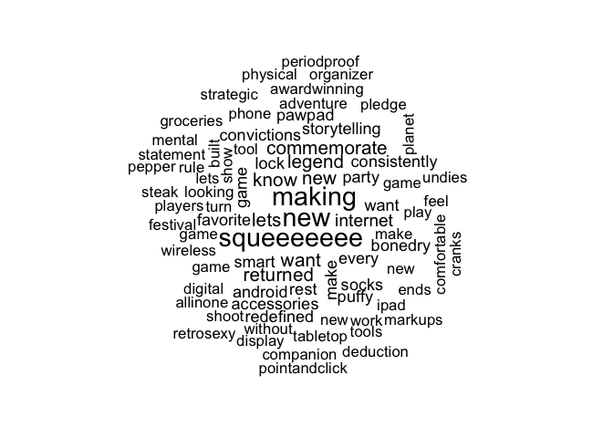<!-- -->

Note: 'Squeeeeeee' might appear to be a nonsense word, but it actually is a neologism to express excitement. See: https://neologisms.rice.edu/index.php?a=term&d=1&t=15305 

Squeeeeeee, making and new appear to have the highest values of the term frequency measure.

#### b) Success in words

Provide a pyramid plot to show how the words between successful and unsuccessful projects differ in frequency. A selection of 10 - 20 top words is sufficient here. 


```r
#combine corpora#
corpus_topandbottom1000 = tm:::c.VCorpus(clean_df_corpus_best1000,clean_df_corpus_worst1000)

corpus_topandbottom1000_dtm = DocumentTermMatrix(corpus_topandbottom1000)

corpus_topandbottom1000_dt <- tidy(corpus_topandbottom1000_dtm)

corpus_bottom1000_dt <- tidy(corpus_worst1000_dtm)

corpus_topandbottom1000_dt$bestworst = ifelse(corpus_topandbottom1000_dt$document %in% corpus_top1000_dt$document, 'Top', 'Bottom')

corpus_topandbottom1000_count <- corpus_topandbottom1000_dt %>%
  group_by(term) %>%
  summarize(total_word = sum(count)) %>%
  arrange(desc(total_word)) %>%
  head(20)
```

```
## `summarise()` ungrouping output (override with `.groups` argument)
```

```r
for_plot_pyramid = left_join(corpus_topandbottom1000_dt, corpus_topandbottom1000_count, by='term')

for_plot_pyramid <- for_plot_pyramid %>%
  filter(!is.na(total_word )) %>%
  group_by(bestworst) %>%
  mutate(count_forplot = ifelse(bestworst == 'Bottom', count*-1, count))

for_plot_pyramid
```

```
## # A tibble: 1,704 x 6
## # Groups:   bestworst [2]
##    document   term  count bestworst total_word count_forplot
##    <chr>      <chr> <dbl> <chr>          <dbl>         <dbl>
##  1 1230734355 get       1 Top               63             1
##  2 1230734355 new       1 Top              149             1
##  3 1004649506 game      1 Top              115             1
##  4 1080054203 book      1 Top               82             1
##  5 1442022498 book      1 Top               82             1
##  6 1442022498 help      1 Top              145             1
##  7 371573338  make      1 Top              114             1
##  8 371573338  want      1 Top               84             1
##  9 1617517226 album     1 Top               59             1
## 10 1617517226 new       1 Top              149             1
## # … with 1,694 more rows
```


```r
ggplot(for_plot_pyramid, aes(x = reorder(term, total_word),
                  y = count_forplot, fill = bestworst)) +
  geom_bar(data = filter(for_plot_pyramid, bestworst == "Top"), stat = "identity") +
  geom_bar(data = filter(for_plot_pyramid, bestworst == "Bottom"), stat = "identity") +
 coord_flip() +
  scale_y_continuous(breaks = seq(-100,100,25)) +
  scale_fill_discrete(name = 'Campaign Sucess', labels=c('Unsuccessful', 'Successful')) +
 ylab("") +
  ggthemes::theme_tufte() + 
  labs(
    x = 'Top 20 Words',
    y= 'Count',
    title = 'Pyramid Plot of Top 20 Words, for Unsuccessful and Successful Campaigns'
  )
```

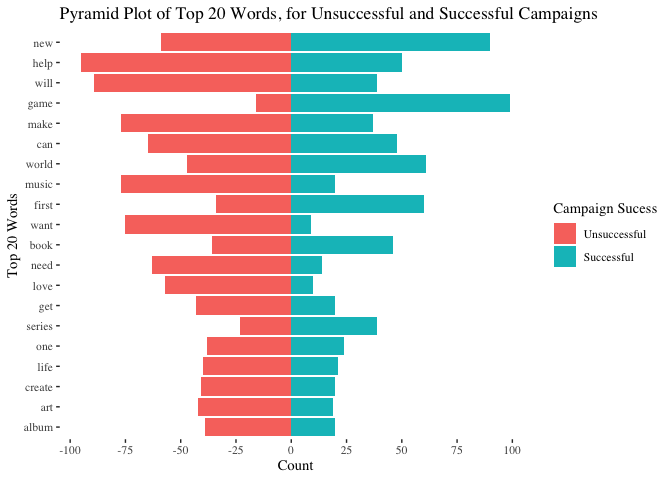<!-- -->

#### c) Simplicity as a virtue

These blurbs are short in length (max. 150 characters) but let's see whether brevity and simplicity still matters. Calculate a readability measure (Flesh Reading Ease, Flesh Kincaid or any other comparable measure) for the texts. Visualize the relationship between the readability measure and one of the measures of success. Briefly comment on your finding.


```r
require(quanteda)
```

```
## Loading required package: quanteda
```

```
## Warning: package 'quanteda' was built under R version 4.0.2
```

```
## Package version: 2.1.2
```

```
## Parallel computing: 2 of 8 threads used.
```

```
## See https://quanteda.io for tutorials and examples.
```

```
## 
## Attaching package: 'quanteda'
```

```
## The following objects are masked from 'package:tm':
## 
##     as.DocumentTermMatrix, stopwords
```

```
## The following objects are masked from 'package:NLP':
## 
##     meta, meta<-
```

```
## The following object is masked from 'package:utils':
## 
##     View
```

```r
corpus_topandbottom1000_fk <- corpus(corpus_topandbottom1000)

FRE_corpus_topandbottom1000 <- textstat_readability(corpus_topandbottom1000_fk, measure = c('Flesch.Kincaid'))
```

```
## Warning in nsentence.character(x): nsentence() does not correctly count
## sentences in all lower-cased text
```

```r
FRE_corpus_topandbottom1000$backers_count[1:1000] = df_backers_sorted_best1000$backers_count

FRE_corpus_topandbottom1000$backers_count[1001:2000] = df_backers_sorted_worst1000$backers_count
```

```r
ggplot(FRE_corpus_topandbottom1000, aes(x=Flesch.Kincaid, y = backers_count)) + 
  geom_point() + 
  geom_smooth(method='lm', color = 'red', se = F) + 
  ggthemes::theme_tufte() +
  labs(
    x = 'Flesch Kincaid Readability Score',
    y = 'Number of Backers',
    title = 'Number of Backers on Readability of Text'
  )
```

```
## `geom_smooth()` using formula 'y ~ x'
```

```
## Warning: Removed 9 rows containing non-finite values (stat_smooth).
```

```
## Warning: Removed 9 rows containing missing values (geom_point).
```

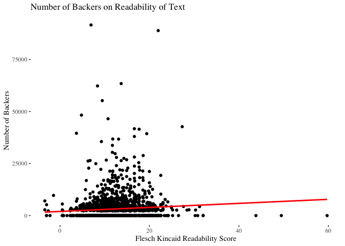<!-- -->

There seems to be no very clear linear relationship between Flesch Kincaid Score and the number of backers. There seem to be a number of outlier points which are very hard to read (i.e., low Flesch Kincaid score) but have extremely high numbers of backers. However, if we were to force a linear regression line, it does seem that the more readable the text is (i.e., higher Flesch Kincaid score), the more number of backers there are, as indicated by the positive gradient of the linear regression line.

### 3. Sentiment

Now, let's check whether the use of positive / negative words or specific emotions helps a project to be successful. 

#### a) Stay positive

Calculate the tone of each text based on the positive and negative words that are being used. You can rely on the Hu & Liu dictionary provided in lecture or use the Bing dictionary contained in the tidytext package (`tidytext::sentiments`). Visualize the relationship between tone of the document and success. Briefly comment.


```r
neg <- read.table('/Users/kagenlim/Documents/Data Viz/Week09/data/dictionaries/negative-words.txt', as.is=T)

pos <- read.table('/Users/kagenlim/Documents/Data Viz/Week09/data/dictionaries/positive-words.txt', as.is=T)

sentiment <- function(words=c("really great good stuff bad")){
  require(quanteda)
  tok <- quanteda::tokens(words)
  pos.count <- sum(tok[[1]]%in%pos[,1])
  neg.count <- sum(tok[[1]]%in%neg[,1])
  out <- (pos.count - neg.count)/(pos.count+neg.count)
}

x = sentiment('good bad nice') #test

x
```

```
## [1] 0.3333333
```


```r
df_topandbottom1000 <- as.data.frame(FRE_corpus_topandbottom1000)

texts_df <-data.frame(text=unlist(sapply(corpus_topandbottom1000, `[`, "content")), stringsAsFactors=F)

for (i in 1:2000)
{
  result = sentiment(texts_df$text[i])
  df_topandbottom1000$sentiment[i] = as.numeric(result)
}
```


```r
ggplot(data=subset(df_topandbottom1000, !is.na(sentiment)), aes(x=backers_count, y=sentiment)) +
  geom_point() +
  ggthemes::theme_tufte() + 
  scale_x_continuous(labels = scales::comma) +
  labs(
    x = "Backers Count",
    y = "Sentiment",
    title = "Scatter Plot: Sentiment by Backers Count"
  )
```

<!-- -->

It seems like generally, projects with more positive sentiment in their description (i.e., sentiment score closer to 1, or one), tend to have more backers. However, this is a bit harder to see in the scatter plot above. Some recoding was necessary to regroup the observations into positive, neutral and negative observations: 


```r
df_topandbottom1000$sentiment_cat <- ifelse(df_topandbottom1000$sentiment > 0, 'Positive', 'Neutral')

df_topandbottom1000$sentiment_cat <- ifelse(df_topandbottom1000$sentiment < 0, 'Negative', df_topandbottom1000$sentiment_cat)

df_topandbottom1000$sentiment_cat <- as.factor(df_topandbottom1000$sentiment_cat)

ggplot(data=subset(df_topandbottom1000, !is.na(sentiment)), aes(x=backers_count, y=sentiment_cat)) + 
  geom_col() +
  ggthemes::theme_tufte() + 
  scale_x_continuous(labels = scales::comma) + 
   labs(
    x = "Backers Count",
    y = "Sentiment",
    title = "Bar Chart: Sentiment by Backers Count"
   )
```

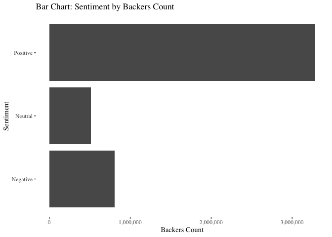<!-- -->

In this bar chart, it is clear that campaigns with more positive sentiment (i.e., sentiment score over 0) have far more backers than those with neutral sentiment (i.e., sentiment score of 0) or negative sentiment (i.e., sentiment score less than 0).

#### b) Positive vs negative

Segregate all 2,000 blurbs into positive and negative texts based on their polarity score calculated in step (a). Now, collapse the positive and negative texts into two larger documents. Create a document-term-matrix based on this collapsed set of two documents. Generate a comparison cloud showing the most-frequent positive and negative words.  


```r
count(df_topandbottom1000, 'document') #all 2000 in order# 
```

```
##   "document"    n
## 1   document 2000
```

```r
#append raw text#
for (i in 1:2000)
{
  result = texts_df$text[i]
  df_topandbottom1000$clean_text[i] = as.character(result)
}

df_topandbottom1000_polarity <- df_topandbottom1000 %>%
  na.omit() %>%
  filter(!sentiment_cat=='Neutral')

count(df_topandbottom1000_polarity, 'document') #1216 left#
```

```
##   "document"    n
## 1   document 1216
```

```r
df_topandbottom1000_positive <- df_topandbottom1000_polarity %>%
  filter(sentiment_cat=='Positive')

count(df_topandbottom1000_positive, 'document') #939 left#
```

```
##   "document"   n
## 1   document 939
```

```r
df_topandbottom1000_negative <- df_topandbottom1000_polarity %>%
  filter(sentiment_cat=='Negative')

count(df_topandbottom1000_negative, 'document') #277 left#
```

```
##   "document"   n
## 1   document 277
```


```r
library(tm) 

#positive words first#
positive_string <- paste(unlist(df_topandbottom1000_positive$clean_text), collapse = "")

positive_string_id = 'Positive Documents'

positive_texts <- data.frame(doc_id = positive_string_id, text = positive_string, stringsAsFactors = F)

df_topandbottom1000_positive_dfs <- DataframeSource(positive_texts)

positive_string_corpus <- VCorpus(df_topandbottom1000_positive_dfs)

#then negative words#
negative_string <- paste(unlist(df_topandbottom1000_negative$clean_text), collapse = "")

negative_string_id = 'Negative Documents'

negative_texts <- data.frame(doc_id = negative_string_id, text = negative_string, stringsAsFactors = F)

df_topandbottom1000_negative_dfs <- DataframeSource(negative_texts)

negative_string_corpus <- VCorpus(df_topandbottom1000_negative_dfs)

#combine both#

polarity_corpus = tm:::c.VCorpus(positive_string_corpus,negative_string_corpus)

polarity_dtm = 
DocumentTermMatrix(polarity_corpus)

#transform in tidy format#
library(tidytext)
polarity_td <- tidy(polarity_dtm)
```


```r
library(reshape2) #for the acast function#
```

```
## 
## Attaching package: 'reshape2'
```

```
## The following object is masked from 'package:tidyr':
## 
##     smiths
```

```r
set.seed(42)

polarity_td %>%
  group_by(document) %>%
  acast(term ~ document, fill=0) %>% #fill=0 value to apply to structural missing values#
  wordcloud::comparison.cloud(color= c('red', 'black'), scale = c(0.5, 2), title.size = 0.8, max.words = 80)
```

```
## Using count as value column: use value.var to override.
```

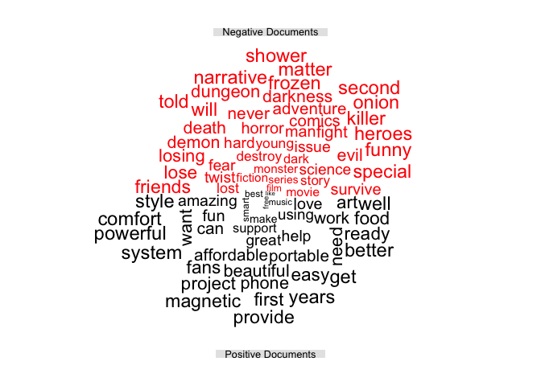<!-- -->


```r
#check that scale is correct
polarity_td[which(polarity_td$term == 'easy'), ]
```

```
## # A tibble: 1 x 3
##   document           term  count
##   <chr>              <chr> <dbl>
## 1 Positive Documents easy     15
```

```r
polarity_td[which(polarity_td$term == 'music'), ] #easy is indeed bigger than music for positive documents in the cloud. All is well.#
```

```
## # A tibble: 2 x 3
##   document           term  count
##   <chr>              <chr> <dbl>
## 1 Positive Documents music    50
## 2 Negative Documents music     5
```

```r
polarity_td[which(polarity_td$term == 'horror'), ]
```

```
## # A tibble: 2 x 3
##   document           term   count
##   <chr>              <chr>  <dbl>
## 1 Positive Documents horror     1
## 2 Negative Documents horror     6
```

```r
polarity_td[which(polarity_td$term == 'monster'), ] #monster is indeed bigger than will for positive documents in the cloud. All is well.#
```

```
## # A tibble: 1 x 3
##   document           term    count
##   <chr>              <chr>   <dbl>
## 1 Negative Documents monster     8
```

#### c) Get in their mind

Now, use the NRC Word-Emotion Association Lexicon in the `tidytext` package to identify a larger set of emotions (anger, anticipation, disgust, fear, joy, sadness, surprise, trust). Again, visualize the relationship between the use of words from these categories and success. What is your finding?


```r
library(tidytext)

nrc_sentiment = get_sentiments("nrc")

unique(nrc_sentiment$sentiment) #10 emotions#
```

```
##  [1] "trust"        "fear"         "negative"     "sadness"      "anger"       
##  [6] "surprise"     "positive"     "disgust"      "joy"          "anticipation"
```


```r
for (i in c("trust","fear","negative","sadness", "anger", "surprise","positive","disgust","joy","anticipation"))
{
assign(paste('nrc', '_', i, sep=""), dplyr::filter(nrc_sentiment, sentiment==i))
} #dfs for each emotion type#
```


```r
for_nrc_clean_text <- data.frame(doc_id=df_topandbottom1000$document, backers_count=df_topandbottom1000$backers_count, text=df_topandbottom1000$clean_text)
```


```r
for_nrc_clean_text <- data.frame(doc_id=df_topandbottom1000$document, backers_count=df_topandbottom1000$backers_count, text=df_topandbottom1000$clean_text)

for (i in 1:2000)
{
  indiv_text = for_nrc_clean_text$text[i]
  tok <- quanteda::tokens(indiv_text)
  for (x in c("trust","fear","negative","sadness", "anger", "surprise","positive","disgust","joy","anticipation"))
  {
    result = sum(tok[[1]]%in%unlist(subset(nrc_sentiment, sentiment==x, select=word)))
    for_nrc_clean_text[i,x] = result
  }
}
```


```r
head(for_nrc_clean_text, 10) #looks good#
```

```
##    doc_id backers_count
## 1   text1          2248
## 2   text2          2249
## 3   text3          2250
## 4   text4          2252
## 5   text5          2256
## 6   text6          2256
## 7   text7          2257
## 8   text8          2257
## 9   text9          2262
## 10 text10          2262
##                                                                                                        text
## 1                                                       soft cuddly pals keep company plush toys fluffnest 
## 2           cheese chopper revolutionary new way slice shred store cheese ease get perfect slice every time
## 3           queers destroy science fiction special issue hugowinning magazine written edited queer creators
## 4                                                           role playing calendar taking journey questaday 
## 5                          sonicpowered automatic toothbrush helps brush teeth simple efficient correct way
## 6                         pixel press ios android app lets draw video game level code required share others
## 7   family six travels america converted school bus discovering greatest sustainable yards homesteads farms
## 8      compact portable solar power kit single day sunlight enough multiple phone charges entire week light
## 9  republishing thought forms groundbreaking theosophical book esoteric thought spiritualist illustrations 
## 10                building beautiful mobile app help cultivate habit listening important book history bible
##    trust fear negative sadness anger surprise positive disgust joy anticipation
## 1      0    0        0       0     0        0        1       0   0            0
## 2      1    0        0       0     0        0        4       0   1            3
## 3      0    0        0       0     0        0        1       0   1            0
## 4      0    1        0       0     0        0        1       0   1            1
## 5      2    0        0       0     0        0        1       0   0            1
## 6      2    0        0       0     0        0        2       0   1            1
## 7      1    0        0       0     0        0        0       0   0            0
## 8      1    0        0       0     0        0        1       0   0            0
## 9      0    0        0       0     0        0        0       0   0            2
## 10     2    0        0       0     0        0        4       0   1            2
```

```r
colnms=c("trust","fear","negative","sadness", "anger", "surprise","positive","disgust","joy","anticipation")
```


```r
reasonable_subset <- for_nrc_clean_text[rowSums(for_nrc_clean_text[, 4:13])>0,]
#remove rows that NRC dictionary has no common words with at all#


for (emolex in c("trust","fear","negative","sadness", "anger", "surprise","positive","disgust","joy","anticipation"))
{
  #data = reasonable_subset[reasonable_subset[, emolex] != 0, ]
print(ggplot2::ggplot(data=reasonable_subset, aes(x=reasonable_subset[,emolex], y=backers_count)) + 
  geom_col() + 
    scale_y_continuous(labels = scales::comma) + 
  labs(
    x = stringr::str_to_title(emolex),
    y = "Number of Backers",
    title = paste(stringr::str_to_title(emolex), "Sentiment/Emotion")
  ) + 
   ggthemes::theme_tufte()) 
}
```

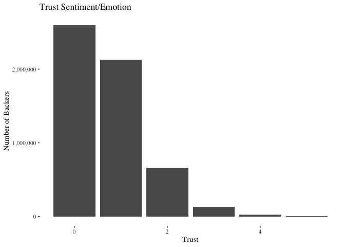<!-- -->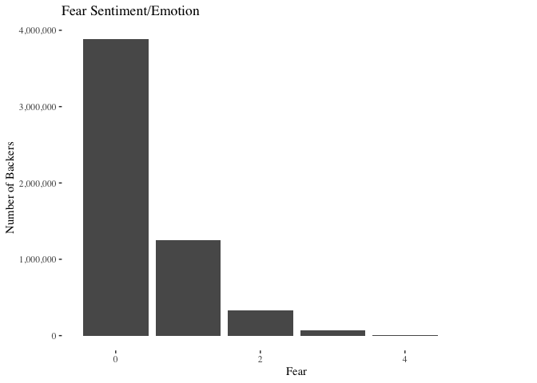<!-- --><!-- -->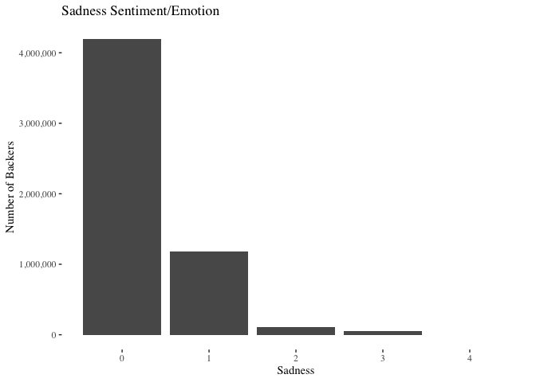<!-- --><!-- --><!-- --><!-- -->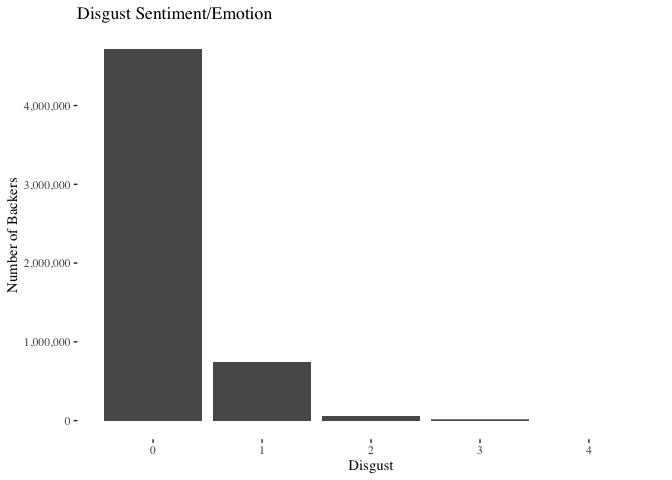<!-- -->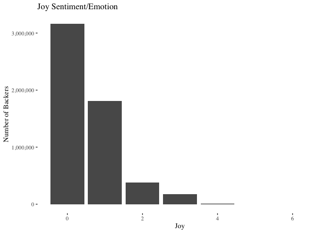<!-- -->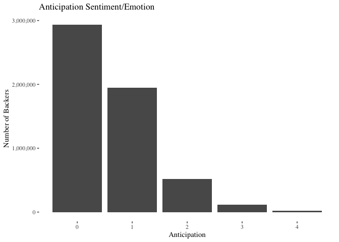<!-- -->

At the broadest level, the finding that there are differences in how different emotions/sentiment is associated with different numbers of backers is an interesting enough finding -- this tells us that there might indeed be differences in how campaigns with various kinds of sentiment, as defined by the NRC Emolex dictionary, affect campaign success.

One note of caution must be made with regard to interpreting these charts. The number of 0 values is very high for all forms of sentiment. This refers to the net number of backers for projects which do not have any words, relating to each of these sentiment categories. This should not be surprising, since this is a key limitation of dictionary based methods of calculating sentiment -- if there words in the corpus are not reflected in the dictionary, there will be a tendency to generate a 0 score for that emotion. Hence, the 0 bars for each emotion denote not just documents with the potential absence of these emotions, they also denote documents which simply do not have the same words as the Emolex dictionary. 

There is no surprise that campaigns with higher numbers of words connote the disgust emotion, tend to not do so well. The same applies to campaigns with a higher number of words that connote sadness, anger and fear emotions. This generally follows the same pattern as the relationship between negative sentiment words and number of backers, which makes sense, since these emotions would broadly be linked to negative sentiment. 

Surprisingly, the surprise emotion also appears to have a similar to pattern to emotions that might be more associated with negative sentiment. 

Campaigns with words that have positive sentiment tend to do very well - but surprisingly, the existence of too many positive sentiment words also leads to decreasing returns, in terms of campaign success (backer counts). Trust, joy and anticipation emotions have a more similar relationship with campaign success as positive sentiment. This again makes sense, since these emotions would be associated with positive sentiment. 
